# Python Security Suite

Python Security Suite is an offline-first orchestrator for complementary Python
security scanners. It runs locally installed, enterprise-approved tools; turns
their native JSON into one stable finding model; applies an explicit policy; and
creates a GitHub-friendly report artifact.

The current alpha implementation provides:

- 19 governed adapters spanning Python SAST, secrets, dependency
  vulnerabilities, SBOMs, GitHub workflows, data flow, IaC, malicious-package
  heuristics, licenses, Git history, and semantic analysis
- strict `PASS`, `WARN`, `FAIL`, and `INCOMPLETE` outcomes
- Markdown, self-contained HTML, SARIF 2.1.0, normalized JSON, a scan manifest,
  sanitized tool diagnostics, and SHA-256 checksums
- no package installation, dependency resolution, project imports, or target
  code execution
- no Python runtime dependencies beyond Python 3.11+

The suite does not itself create a network sandbox. Run it inside an
egress-denied container, VM, or enterprise runner, then pass
`--network-isolated` to attest that the external boundary is active.

## Documentation

Markdown is the canonical documentation format:

- [Documentation index](docs/index.md)
- [Solution design and Mermaid diagrams](docs/design.md)
- [Native and GitHub operations](docs/operations.md)
- [Configuration reference](docs/configuration.md)
- [Compatibility and coverage matrix](docs/compatibility-matrix.md)
- [Production security gate](docs/production-security.md)

## Solution overview

```mermaid
flowchart LR
    Project["Python project"] --> Suite["Python Security Suite"]
    Suite --> Tools["19 governed adapters"]
    Tools --> Applicability["Applicable | Not applicable | Unavailable"]
    Applicability --> Findings["Normalized and correlated findings"]
    Findings --> Policy["PASS | WARN | FAIL | INCOMPLETE"]
    Policy --> Reports["Markdown | HTML | SARIF | JSON"]
    Reports --> GitHub["GitHub summary and artifact"]
```



## Development run

```text
python -m py_security_suite scan PATH_TO_PROJECT \
  --output PATH_TO_REPORT \
  --network-isolated
```

When running directly from a source checkout, set `PYTHONPATH=src` or install the
package from an approved local wheelhouse. The suite never installs its scanner
dependencies.

```text
python -m unittest discover -s tests -v
```

## Required standard-profile assets

- `bandit`
- `semgrep` plus a local rules file or directory
- `detect-secrets`
- `osv-scanner` plus a preloaded offline vulnerability database

The stable `quick` and `standard` profiles retain their original contracts.
Use `extended`, `deep`, `supply-chain`, `artifact`, or `comprehensive` to
select additional perspectives. Use `production` for the strict source gate:
it blocks medium-or-higher findings, requires a full VCS checkout,
requires a lock and SBOM/malicious-package coverage when dependencies are
declared, and requires configured Pysa data-flow analysis for Python source.
Use `release` after building `dist/`; it adds Syft, Grype, wheel-content,
metadata, and offline publisher-provenance verification.
Conditional tools are visibly marked `not applicable` when their input is
absent; relevant missing tools produce `INCOMPLETE`.

Use `pysec.example.toml` as a repository configuration starting point. An
organization policy can be supplied separately with `--policy`; repository
configuration is rejected when it weakens protected organization settings.

## Reproducible scanner container

The connected update/build lane is represented by
`containers/scanner/Dockerfile`. It pins the four top-level scanner versions,
verifies the OSV-Scanner release and PyPI advisory snapshot checksums, embeds
the orchestrator and local Semgrep rules, preloads the PyPI OSV database, and
records installed Python packages and database digests inside the image.

```powershell
.\scripts\build-scanner-image.ps1
.\scripts\run-self-scan.ps1
```

The scan command runs the resulting image with no network, a read-only source
mount, no Linux capabilities, `no-new-privileges`, and only `.artifacts` mounted
writable.

## Native execution without Docker

The suite can also run from a verified native tool directory. The connected
preparation command downloads pinned Windows x86-64 wheels for the standard
tools plus Ruff, CycloneDX Python, zizmor, ScanCode, `run-codeql`,
check-wheel-contents, Twine, and PyPI attestations; checksum-verified
OSV-Scanner, Trivy, Gitleaks, Syft, Grype, and TruffleHog binaries; and staged
OSV and Grype vulnerability data:

```powershell
.\scripts\prepare-native-bundle.ps1
```

Transfer `.artifacts/native-bundle` into the secure boundary, then install and
scan without contacting a package index:

```powershell
.\scripts\install-native-tools.ps1
.\scripts\run-native-scan.ps1 -Profile production -NetworkIsolated
```

The isolation switch attests an external runner, firewall, or VM boundary; it
does not alter the host firewall. Omitting it performs a diagnostic scan and
correctly yields `INCOMPLETE`.

See the [native operations guide](docs/operations.md) for trust-boundary,
transfer, installation, GitHub, and troubleshooting guidance.

Trivy, Gitleaks, Syft, Grype, TruffleHog, and the artifact-validation Python
tools are installed by the Windows native bundle. `run-codeql` is installed,
but the CodeQL CLI, query packs, isolated home, and applicable license remain
separately approved assets. Pysa requires project models on
Linux/macOS/WSL; current GuardDog supports native Linux/macOS but not native
Windows. Docker is not required.

ScanCode is installed in a separate sidecar virtual environment because its
Click dependency conflicts with Semgrep's pinned runtime. Its aggregate pass is
bounded to package metadata, dependency locks, governance files, and vendored
roots; use `extended` for routine feedback and reserve `supply-chain` or
`comprehensive` for inventory-capable runners.

## GitHub Actions

`examples/github-actions.yml` is an intentionally non-runnable enterprise
template. Replace the action placeholders with organization-approved commit
SHAs and replace the isolation verification command with the runner's enforced
boundary check. The workflow:

1. runs the suite and records its policy exit code;
2. appends `summary.md` to the GitHub workflow summary;
3. uploads the complete report directory and SARIF even on `FAIL` or
   `INCOMPLETE`; and
4. applies the saved policy exit code only after publishing the evidence.

## Report artifact

Each scan writes:

```text
python-security-report/
|-- summary.md
|-- action-plan.md
|-- assurance-case.md
|-- index.html
|-- results.sarif
|-- findings.json
|-- scan-manifest.json
|-- checksums.sha256
|-- sbom.cdx.json                  # when applicable
|-- artifact-sbom.cdx.json         # when built distributions are scanned
|-- artifact-manifest.json         # SHA-256 binding for scanned distributions
|-- scancode-inventory.json        # when applicable
`-- evidence/
    |-- bandit.json
    |-- semgrep.json
    |-- detect-secrets.json
    `-- osv-scanner.json
```

Evidence files contain sanitized execution diagnostics, not raw scanner output
or detected secret values.

Each normalized finding identifies the scanner version and native rule, stable
finding ID, priority, location, area, confidence, security classifications,
impact, recommended action, and linked references. `action-plan.md` separates
finding remediation from scanner-coverage restoration and policy evidence.
`assurance-case.md` distinguishes evidence demonstrated by the scan from
dynamic testing, artifact identity, provenance, and threat-review evidence that
must be supplied by companion release gates. The GitHub summary
presents the first 20 findings in actionable detail; the self-contained HTML,
JSON, and SARIF artifacts retain the complete result set.

## Current boundaries

This is an alpha foundation. All 19 offline/static and artifact adapters are
implemented, but enterprise
rollout still requires pinned approved assets, framework-specific Pysa models,
an approved CodeQL CLI/query-pack home and license, resource quotas, baselines, and
measured false-positive policy. The current automated native bundle is Windows
x86-64 and Python 3.11; other platforms can use organization-managed native
executables through the same CLI and report contract.

No scanner portfolio can prove that software is vulnerability-free. Production
approval must bind this report, an SBOM, the final artifact digest, test
evidence, provenance, and governed risk acceptances to the same release.
