# Python Security Suite

Python Security Suite is an offline-first orchestrator for complementary Python
security scanners. It runs locally installed, enterprise-approved tools; turns
their native JSON into one stable finding model; applies an explicit policy; and
creates a GitHub-friendly report artifact.

The current alpha implementation provides:

- 62 governed adapters spanning Python security, correctness, formatting,
  typing, dead code, complexity, architectural boundaries, test evidence,
  secrets, dependency vulnerabilities, SBOMs, workflows, containers, native
  extensions, data flow, IaC, package behavior, licenses, Git history, and
  semantic analysis, organization policy, repository health, packaging schema,
  Kubernetes, documentation quality, symbolic execution, fuzzing, mutation
  testing, malware, and artifact attestations
- strict `PASS`, `WARN`, `FAIL`, and `INCOMPLETE` outcomes
- Markdown, self-contained HTML, SARIF 2.1.0, SonarQube generic external
  issues, normalized JSON, a scan manifest, sanitized tool diagnostics, and
  SHA-256 checksums
- a SLSA Verification Summary Attestation-shaped Security Passport that binds
  the source, policy, scanner health, findings, SBOMs, and report evidence;
  Cosign 2 detached signing, explicit Cosign 3 bundle signing, and local
  verification are built into the CLI
- digest-pinned offline CISA KEV, FIRST EPSS, and CycloneDX VEX enrichment,
  plus prior-report lifecycle analysis and CODEOWNERS routing
- no package installation, dependency resolution, project imports, or target
  code execution
- frozen, offline `uv.lock` SBOM export with before/after executable integrity
  checks; bounded advisory-database age; and exact, expiring, owner-attributed
  risk acceptances
- Python 3.11+ plus the small `defusedxml` parser-hardening dependency; scanner
  dependencies remain separately installed and governed

The suite does not itself create a network sandbox. Run it inside an
egress-denied container, VM, or enterprise runner, then pass
`--network-isolated` to attest that the external boundary is active.

## Documentation

Markdown is the canonical documentation format:

- [Documentation index](docs/index.md)
- [Solution design and Mermaid diagrams](docs/design.md)
- [Native and GitHub operations](docs/operations.md)
- [Configuration reference](docs/configuration.md)
- [Compatibility and coverage matrix](docs/compatibility-matrix.md)
- [Tool-selection and portfolio governance](docs/tool-selection.md)
- [Production security gate](docs/production-security.md)
- [Security policy](SECURITY.md)
- [Contributing](CONTRIBUTING.md)
- [Change history](CHANGELOG.md)

## Solution overview

```mermaid
flowchart LR
    Project["Python project"] --> Suite["Python Security Suite"]
    Suite --> Tools["62 governed adapters"]
    Tools --> Applicability["Applicable | Not applicable | Unavailable"]
    Applicability --> Findings["Normalized and correlated findings"]
    Findings --> Policy["PASS | WARN | FAIL | INCOMPLETE"]
    Policy --> Reports["Markdown | HTML | SARIF | SonarQube | JSON"]
    Reports --> GitHub["GitHub summary and artifact"]
```



## Development run

Preflight the exact profile first. This validates applicability, executables,
approved digests, local rules, vulnerability snapshots, baselines, and risk
governance without running a scanner or importing target code:

```text
pysec doctor PATH_TO_PROJECT --config pysec.toml --profile production
```

`READY` and `PROCEED TO ISOLATED SCAN` mean every applicable required
prerequisite is present. Optional tools that need attention remain visible but
do not create a false required-tool blocker. This preflight decision never
replaces the scan, the external network boundary, or release approval. Use
`--format json` for CI and inventory automation.

After a scan, verify and understand the result from one concise command:

```text
pysec inspect PATH_TO_REPORT --limit 5
```

Publish a schema-governed JSON sidecar for CI or a GitHub artifact without
changing the sealed report:

```text
pysec inspect PATH_TO_REPORT --format json \
  --output PATH_TO_REPORT-inspection.json
pysec verify-inspection PATH_TO_REPORT-inspection.json \
  --report PATH_TO_REPORT --format json \
  --output PATH_TO_REPORT-inspection-verification.json
pysec schema report-inspection-1.0 \
  --output contracts/report-inspection.schema.json
pysec schema report-inspection-verification-1.0 \
  --output contracts/report-inspection-verification.schema.json
```

`inspect` verifies the report checksum chain before showing the `ALLOW`,
`REVIEW`, or `BLOCK` scan-policy disposition, policy reasons, applicability-
aware scanner health, finding severity, domains, lifecycle, ownership, native
scanner rules, scanner entry-point approval and post-execution integrity, and
prioritized remediation. Applicable disabled or skipped tools are reported as
execution gaps, never as not applicable. An entry point observed unchanged is
not mislabeled as organization-approved. Terminal inspection names a bounded
set of approval and post-check gaps, inspection JSON retains the complete lists,
and `action-plan.md` provides a risk-ordered compact trust view plus complete,
copy-ready TOML digest candidates. Those candidates remain observations until
an independent provenance review approves them. Inspection JSON exposes the
same work as priority-ordered structured actions and distinguishes candidate
policy bindings from unique executable digests. The complete output contract is
published as an installable [Draft 2020-12 JSON Schema](src/py_security_suite/schemas/report-inspection.schema.json).
The optional output is published atomically, refuses accidental replacement
unless `--overwrite` is explicit, and must remain outside the report's exact
checksum boundary. Exported entry points and finding-detail links are artifact-
relative, so they survive GitHub download or relocation without disclosing the
runner workspace; terminal rendering resolves the same links locally.
`verify-inspection` rereads the sealed report, recomputes the normalized
inspection with the caller's expected action limit (five by default), and
requires exact semantic equality before returning its sidecar SHA-256 and
report-checksum binding. Use the same explicit `--limit` on export and
verification when overriding the default, so the sidecar cannot suppress
actions and choose its own comparison depth. This proves
consistency, not signer authenticity; use the Security Passport for approval.
The verification receipt has its own installable strict
[Draft 2020-12 JSON Schema](src/py_security_suite/schemas/report-inspection-verification.schema.json)
and is atomically published outside the sealed report for audit retention.
`schema` reads these exact contracts from the installed package and prints them
or atomically exports them for disconnected validators. Names are deliberately
version-explicit; there is no network lookup and no ambiguous `latest` alias.
Existing exports are preserved unless `--overwrite` is supplied.

Commands with `--format json` return failures on standard error using one stable
envelope with `status`, `command`, and a coded `error`; `attest` uses the same
JSON contract because its success output is machine-readable. Text failures are
single-line, bounded, control-safe, and redact credential-like assignments.

```text
python -m py_security_suite scan PATH_TO_PROJECT \
  --output PATH_TO_REPORT \
  --network-isolated
```

When running directly from a source checkout, set `PYTHONPATH=src` or install the
package from an approved local wheelhouse. The suite never installs its scanner
dependencies.

```text
uv sync --frozen
uv run python -m pytest
```

## Required standard-profile assets

- `bandit`
- `semgrep` plus a local rules file or directory
- `detect-secrets`
- `osv-scanner` plus a preloaded offline vulnerability database

The stable `quick` and `standard` profiles retain their original contracts.
Use `extended`, `deep`, `supply-chain`, `artifact`, `quality`, `iac-deep`,
`governance`, `repo-health`, `repo`, or `comprehensive` to select additional
perspectives.
`quality` runs correctness,
formatting, typing, dead-code, complexity, architectural-boundary, workflow,
Dockerfile, license-metadata, and pre-generated test-evidence checks.
`repo` combines the strict
source-security portfolio with those quality controls while excluding built
artifact checks. Use `production` for the strict source gate:
it blocks medium-or-higher findings, requires a full VCS checkout,
requires a lock and SBOM/malicious-package coverage when dependencies are
declared, and requires configured Pysa data-flow analysis for Python source.
Use `release` after building `dist/`; it adds Syft, Grype, wheel-content,
metadata, and offline publisher-provenance verification.
Conditional tools are visibly marked `not applicable` when their input is
absent; relevant missing tools produce `INCOMPLETE`.

Use `pysec.example.toml` as a repository configuration starting point. An
organization policy can be supplied separately with `--policy`; repository
configuration is rejected when it weakens protected organization settings.

## Reproducible scanner container

The connected update/build lane is represented by
`containers/scanner/Dockerfile`. It pins the four top-level scanner versions,
verifies the OSV-Scanner release and PyPI advisory snapshot checksums, embeds
the orchestrator and local Semgrep rules, preloads the PyPI OSV database, and
records installed Python packages and database digests inside the image.

```powershell
.\scripts\build-scanner-image.ps1
.\scripts\run-self-scan.ps1
```

The scan command runs the resulting image with no network, a read-only source
mount, no Linux capabilities, `no-new-privileges`, and only `.artifacts` mounted
writable.

## Native execution without Docker

The suite can also run from a verified native tool directory. The connected
preparation command downloads pinned Windows x86-64 wheels for the standard
tools plus Ruff, Pylint, mypy, Vulture, Radon, Tach, REUSE, Flawfinder,
CycloneDX Python, zizmor, deptry, diff-cover, Checkov, ScanCode, `run-codeql`,
check-wheel-contents, Twine, and PyPI attestations; checksum-verified
OSV-Scanner, actionlint, Conftest, git-sizer, Vale, KubeLinter, Hadolint,
ShellCheck, Cosign, Trivy, Gitleaks, Syft, Grype, and TruffleHog binaries;
pinned pipdeptree and validate-pyproject wheels; pinned Node.js and Pyright; a staged
PSScriptAnalyzer module; a checksum-pinned local DevSkim NuGet tool package;
and staged OSV
and Grype vulnerability data:

```powershell
.\scripts\prepare-native-bundle.ps1
```

Transfer `.artifacts/native-bundle` into the secure boundary, then install and
scan without contacting a package index:

```powershell
.\scripts\install-native-tools.ps1
.\scripts\run-native-scan.ps1 -Profile production -NetworkIsolated
```

The isolation switch attests an external runner, firewall, or VM boundary; it
does not alter the host firewall. Omitting it performs a diagnostic scan and
correctly yields `INCOMPLETE`.

The native installer records SHA-256 bindings for installed scanner entry
points. `production` and `release` require those approved digests, rehash the
entry points after execution, and verify that the target source and built
distributions have the same before/after content digest. A target mutation or
tool substitution produces `INCOMPLETE`, never a clean result.

See the [native operations guide](docs/operations.md) for trust-boundary,
transfer, installation, GitHub, and troubleshooting guidance.

Trivy, Gitleaks, Syft, Grype, TruffleHog, and the artifact-validation Python
tools are installed by the Windows native bundle. `run-codeql` is installed,
but the CodeQL CLI, query packs, isolated home, and applicable license remain
separately approved assets. Pysa requires project models on
Linux/macOS/WSL; current GuardDog supports native Linux/macOS but not native
Windows. Docker is not required.

Use `scripts/run-detection-validation.ps1` after preparing the native tools to
prove that Bandit, Semgrep, and detect-secrets detect a temporary known-bad
fixture and that every normalized finding remains attributed, classified,
located, cited, and actionable. The fixture is created outside the repository
and removed after validation.

ScanCode is installed in a separate sidecar virtual environment because its
Click dependency conflicts with Semgrep's pinned runtime. Its aggregate pass is
bounded to package metadata, dependency locks, governance files, and vendored
roots; use `extended` for routine feedback and reserve `supply-chain` or
`comprehensive` for inventory-capable runners.

## GitHub Actions

`examples/github-actions.yml` is an intentionally non-runnable enterprise
template. Replace the action placeholders with organization-approved commit
SHAs and replace the isolation verification command with the runner's enforced
boundary check. The bundled Actionlint policy recognizes the template's
`pysec-isolated` self-hosted runner label. The workflow:

1. runs the suite and records its policy exit code;
2. appends `summary.md` to the GitHub workflow summary;
3. exports the inspection and its schema-governed verification receipt beside
   the sealed report;
4. uploads the report, inspection, verification receipt, and SARIF even on
   `FAIL` or `INCOMPLETE`; and
5. applies the saved policy exit code only after publishing the evidence.

## Report artifact

Each scan writes:

```text
python-security-report/
|-- summary.md
|-- action-plan.md
|-- assurance-case.md
|-- index.html
|-- results.sarif
|-- sonarqube-external-issues.json # SonarQube generic external-issue import
|-- findings.json
|-- scan-manifest.json
|-- security-passport.json         # in-toto Statement / SLSA VSA predicate
|-- checksums.sha256
|-- risk-intelligence.json         # bounded offline snapshot provenance/results
|-- finding-delta.json             # new/existing/regressed/resolved lifecycle
|-- effectiveness.json             # observed attribution/actionability/tool yield
|-- assurance-claims.json          # NIST SSDF claim-to-evidence mapping
|-- sbom.cdx.json                  # when applicable
|-- artifact-sbom.cdx.json         # when built distributions are scanned
|-- artifact-manifest.json         # SHA-256 binding for scanned distributions
|-- scancode-inventory.json        # when applicable
|-- pylint-summary.json            # when Pylint is applicable
|-- radon-complexity.json           # rank C+ complexity evidence
|-- coverage-summary.json           # validated pre-generated test coverage
|-- junit-summary.json              # validated test outcome metadata
|-- reuse-compliance.json           # when a REUSE marker opts the repo in
|-- deptry-dependencies.json        # normalized dependency hygiene evidence
|-- diff-coverage.json              # coverage of changed executable lines
|-- checkov-iac.json                # when IaC inputs are applicable
`-- evidence/
    |-- bandit.json
    |-- semgrep.json
    |-- detect-secrets.json
    `-- osv-scanner.json
```

Evidence files contain sanitized execution diagnostics, not raw scanner output
or detected secret values.

`scan-manifest.json`, `summary.md`, and `index.html` expose target-content
integrity and per-tool entry-point integrity. The CodeQL record separately
binds its `run-codeql` wrapper and the governed CodeQL CLI helper.
The self-contained HTML dashboard shows the scan-policy decision as a visible
badge and separates applicable execution gaps from expandable, informational
not-applicable controls. Its summary grid includes completed/applicable,
execution-gap, conditional-control, and target-integrity counts.
The Markdown reports lead with an explicit `ALLOW`, `REVIEW`, or `BLOCK`
scan-policy disposition. Applicable scanner failures remain in the primary
action table, while not-applicable conditional controls are retained in a
collapsed, auditable section so they do not obscure remediation work.

Each normalized finding identifies its security or quality domain, scanner
version and native rule, stable finding ID, priority, location, area,
confidence, classifications, impact, recommended action, and linked
references. File-backed findings include a bounded, line-numbered source
excerpt in Markdown, HTML, normalized JSON, and SARIF; the affected range is
highlighted. Secret-bearing lines are always replaced with a redaction notice,
and common credential assignments in surrounding context are sanitized.

## Security Passport

Every report includes an unsigned `security-passport.json` statement. In the
separate approval lane, verify the report and create signed passport material:

```powershell
pysec verify-report .artifacts\release-scan
```

```powershell
pysec attest .artifacts\release-scan `
  --output .artifacts\release-passport `
  --signing-key C:\protected\release.key `
  --signing-password-file C:\protected\release-key.password `
  --cosign-executable C:\approved\cosign.exe `
  --cosign-sha256 APPROVED_COSIGN_SHA256
```

For Cosign 3, add `--allow-signing-network`; add `--signing-config` to select a
reviewed private or public Sigstore service configuration. This acknowledgement
is mandatory because v3 bundle creation can contact configured signing
services. Cosign 2 retains the disconnected detached-signature path. The scan
lane itself does not sign or require external access.

The deployment lane verifies the signature, passport checksums, report checksum
manifest, exact detached-to-embedded statement identity, every Passport input
digest, policy digest, and artifact subjects:

```powershell
pysec verify .artifacts\release-passport `
  --report .artifacts\release-scan `
  --artifact-root C:\release\payload-root `
  --public-key C:\trust\release.pub `
  --cosign-executable C:\approved\cosign.exe `
  --cosign-sha256 APPROVED_COSIGN_SHA256 `
  --format text
```

`--artifact-root` is the directory beneath which each repository-relative
Passport subject path exists. Verification rejects missing, linked, oversized,
or digest-mismatched release files. Each subject-containing directory must also
contain exactly the declared `.whl`, `.tar.gz`, and `.zip` files; an unbound
distribution blocks promotion, while non-distribution sidecars remain allowed.
Directory enumeration and mismatch details are bounded so an untrusted payload
cannot create unlimited verifier work or terminal output.
When artifact subjects are declared, omitting this root produces
`release_artifacts_not_verified` and cannot approve promotion.

`--unsigned` and `--allow-unsigned` support a clearly labeled integrity-only
handoff; they never claim signer authenticity. See the
[Security Passport and risk intelligence guide](docs/security-passport.md).
The verification response separates transport integrity, signer authenticity,
source-report verification, presented-release-artifact verification, policy
outcome, and release approval so a valid passport for a blocked scan is never
mislabeled as an integrity failure.
The command exits `0` only for `release_decision: approved`; a verified passport
that is unsigned, lacks its source report or required release artifacts, or
carries a failing scan policy exits `1` so a CI promotion gate cannot mistake
transport integrity for approval.
`action-plan.md` separates
finding remediation from scanner-coverage restoration and policy evidence.
`assurance-case.md` distinguishes evidence demonstrated by the scan from
dynamic testing, artifact identity, provenance, and threat-review evidence that
must be supplied by companion release gates. The GitHub summary
presents the first 20 findings in actionable detail; the self-contained HTML,
JSON, and SARIF artifacts retain the complete result set.

## Current boundaries

This is an alpha foundation. All 62 offline/static, evidence-ingestion, and
artifact adapters are
implemented, but enterprise
rollout still requires pinned approved assets, framework-specific Pysa models,
an approved CodeQL CLI/query-pack home and license, resource quotas, baselines, and
measured false-positive policy. The current automated native bundle is Windows
x86-64 and Python 3.11; other platforms can use organization-managed native
executables through the same CLI and report contract.

No scanner portfolio can prove that software is vulnerability-free. Production
approval must bind this report, an SBOM, the final artifact digest, test
evidence, provenance, and governed risk acceptances to the same release.
