# Python Security Suite

Python Security Suite is an offline-first orchestrator for complementary Python
security scanners. It runs locally installed, enterprise-approved tools; turns
their native JSON into one stable finding model; applies an explicit policy; and
creates a GitHub-friendly report artifact.

| Area | Capability |
|---|---|
| Portfolio | 64 governed adapters across source security, secrets, dependencies, architecture, quality, delivery, artifacts, and assurance evidence |
| Decisions | Explicit `PASS`, `WARN`, `FAIL`, and `INCOMPLETE` outcomes |
| Reports | Markdown, self-contained HTML, SARIF 2.1.0, SonarQube external issues, normalized JSON, an owned closure backlog, and SHA-256 manifests |
| Risk context | Digest-pinned CISA KEV, FIRST EPSS, CycloneDX VEX, alias-aware advisory decisions, scanner-attributed fix candidates, finding lifecycle, CODEOWNERS, and governed acceptances |
| Supply chain | Source and artifact SBOMs, package checks, provenance findings, and a locally verifiable Security Passport |
| Reachability | Offline three-state executable/load-only/disconnected graph with explained dispatch paths, ranked islands, and optional coverage corroboration |
| Graph context | Graphify code-only topology joined to findings for blast radius, structural hotspots, and cross-tool neighborhoods |
| Risk routes | Bounded declared-entry-point routes to findings, sensitive sinks, and exact dependency-advisory importers, joined with advisory citations/fixes, owners, runtime state, changed-line risk, shared control-point convergence, graph-selected validation campaigns, cross-campaign shared-test bottlenecks, source-revision-bound test evidence, transparent review scores, owner queues, and explicit model gaps |
| Evidence fusion | Source-to-artifact package lineage, semantic finding links, changed-line/test/graph context, exact selected-test execution, digest-bound provenance joins, and feedback into owned exposure and SDK-package verification plans |
| Structural synthesis | Cross-validated dead code, island boundaries, structural orphans, import-cycle hotspots, change-risk scoring, graph-guided test targets, exact execution status, and test/changed-line coverage alignment |
| Advisory fusion | Package-scoped CVE/GHSA/PYSEC/OSV alias clustering across source and artifact scanners, with distinct-risk/observation counts plus CycloneDX introducing-root paths, pipdeptree environment health, Graphify imports, reachability/runtime state, and deptry-use context |
| Data exposure | CWE-grounded flows into logs, telemetry, URL queries, client errors, runtime-state dumps, and process streams; monorepo SDK/configuration inventory; owner-, graph-, change-risk-, runtime-, test-, and SDK-package-aware disclosure triage |
| Runtime | Python 3.11+; scanners are installed separately from approved offline bundles |

Key trust properties:

- no package installation, dependency resolution, project import, or target-code
  execution during scanning;
- scanner entry points are hashed before and after execution and can require
  organization-approved digests;
- advisory databases, rules, policies, baselines, and acceptances are bounded
  and digest-pinned; and
- reports are sealed with an exact checksum manifest before inspection or
  attestation.

The suite does not itself create a network sandbox. Run it inside an
egress-denied container, VM, or enterprise runner, then pass
`--network-isolated` to attest that the external boundary is active.

## Documentation

Markdown is the canonical documentation format:

- [Documentation index](docs/index.md)
- [Solution design and Mermaid diagrams](docs/design.md)
- [Native and GitHub operations](docs/operations.md)
- [Configuration reference](docs/configuration.md)
- [Python reachability and code-island analysis](docs/reachability.md)
- [Graphify code-graph integration](docs/graphify.md)
- [Static risk-route synthesis](docs/risk-paths.md)
- [Cross-tool evidence fusion](docs/evidence-fusion.md)
- [Structural synthesis for dead code and islands](docs/structural-synthesis.md)
- [Sensitive-data exposure analysis](docs/data-exposure.md)
- [Detection effectiveness and operational coverage](docs/effectiveness.md)
- [Governed release readiness](docs/release-readiness.md)
- [Compatibility and coverage matrix](docs/compatibility-matrix.md)
- [Tool-selection and portfolio governance](docs/tool-selection.md)
- [Production security gate](docs/production-security.md)
- [Security policy](SECURITY.md)
- [Contributing](CONTRIBUTING.md)
- [Change history](CHANGELOG.md)

## Solution overview

```mermaid
flowchart LR
    subgraph Prep["Connected preparation lane"]
        Acquire["Acquire tools and offline data"] --> Bundle["Verify and seal native bundle"]
    end
    Bundle --> Transfer["Approved transfer"]
    subgraph Boundary["Externally isolated execution boundary"]
        Project["Python project"] --> Doctor["Preflight applicability and trust"]
        Doctor --> Plan["Offline provisioning plan"]
        Plan --> Scan["Run applicable adapters"]
        Scan --> Findings["Normalize and correlate"]
        Findings --> Policy["PASS | WARN | FAIL | INCOMPLETE"]
        Policy --> Reports["Seal reports and evidence"]
        Reports --> Pack["Atomic evidence pack<br/>role views + audit archive"]
    end
    Transfer --> Doctor
    Pack --> Verify["Verify | inspect | attest"]
    Verify --> Publish["GitHub summary, SARIF, and artifact"]
```



## Development run

Bootstrap a new repository with a minimal, valid configuration tailored to its
shape. The command is offline, never installs tools, and refuses to replace an
existing configuration unless `--overwrite` is explicit:

```text
pysec init PATH_TO_PROJECT --template library
pysec init PATH_TO_API --template api --format json
```

Templates are available for `library`, `api`, `cli`, `worker`, and `monorepo`
projects. Each receipt provides argument-safe next-step arrays and clearly
separates repository setup from external isolation and release authority.

Preflight the exact profile first. This validates applicability, executables,
approved digests, local rules, vulnerability snapshots, baselines, and risk
governance without running a scanner or importing target code:

```text
pysec doctor PATH_TO_PROJECT --config pysec.toml --profile production --explain
pysec doctor PATH_TO_PROJECT --config pysec.toml --profile production \
  --format markdown --output .artifacts/pysec-preflight.md
```

`READY` and `PROCEED TO ISOLATED SCAN` mean every applicable required
prerequisite is present. Optional tools that need attention remain visible but
do not create a false required-tool blocker. This preflight decision never
replaces the scan, the external network boundary, or release approval. Use
`--format json` for schema-governed CI automation or `--format markdown` for a
GitHub-ready prerequisite artifact. Equivalent remediation is consolidated
into root-cause batches, with every tool-specific reason retained in expandable
evidence. Both formats can be published atomically with `--output`; replacement
requires `--overwrite`.

Turn the same evidence into an offline, non-mutating acquisition and staging
plan. JSON is strict for enterprise workflow automation; Markdown is ready to
upload as a GitHub artifact:

```text
pysec provision-plan PATH_TO_PROJECT --config pysec.toml --profile production \
  --format markdown --output .artifacts/pysec-provision-plan.md
pysec schema provision-plan-1.0 --output contracts/provision-plan.schema.json
```

Portable configurations can declare `[paths] bundle_root` and use
`@bundle/...` for executables, rules, databases, trust material, and evidence.
The namespace is resolved beneath the governed root and rejects parent
traversal; it does not expand environment variables or contact a network.

Validate configuration, qualify the staged bundle without starting scanners,
and generate local or CI integration without installing packages:

```text
pysec config-check --config pysec.toml --format markdown \
  --output .artifacts/config-assessment.md
pysec adapter-check --format json --output .artifacts/adapter-conformance.json
pysec verify-native-bundle PATH_TO_NATIVE_BUNDLE \
  --manifest-sha256 APPROVED_SHA256 --python PATH_TO_TRUSTED_PYTHON \
  --require-wheelhouse-closure --format markdown \
  --output .artifacts/native-bundle-verification.md
pysec qualify-bundle PATH_TO_PROJECT --config pysec.toml --profile production \
  --effectiveness-evaluation effectiveness-evaluation.json \
  --effectiveness-report PATH_TO_CORPUS_SCAN_REPORT \
  --effectiveness-sha256 APPROVED_SHA256 \
  --minimum-effectiveness-labels 25 \
  --required-effectiveness-tool bandit \
  --format markdown --output .artifacts/bundle-qualification.md
pysec generate-hooks PATH_TO_PROJECT --profile quick
pysec generate-ci PATH_TO_PROJECT \
  --checkout-sha APPROVED_COMMIT_SHA \
  --upload-artifact-sha APPROVED_COMMIT_SHA \
  --upload-sarif-sha APPROVED_COMMIT_SHA
```

`config-check` returns a strict, read-only compatibility receipt even for an
unsupported schema or invalid setting, inventories portable and absolute paths,
and explains why repository digest pins are not organization approval.
`verify-native-bundle` rejects missing, changed, injected, linked, or malformed
bundle content and can prove each declared Python environment resolves entirely
from the staged wheelhouse. `qualify-bundle` joins all adapter contracts with
profile-specific executable, asset, applicability, trust readiness, and optional
digest-bound labeled effectiveness evidence. `generate-hooks` writes local,
activation-free adapter and readiness diagnostics; it deliberately does not run
the portfolio or claim a production boundary.

The workflow preserves the scan decision until the sealed report and verification
receipt are uploaded, then applies the original exit code. Its isolation command,
runner labels, action pins, and organization policy variable remain enterprise-
owned inputs.

When the suite is invoked as `python -m py_security_suite`, executable
discovery also checks the invoking interpreter's script directory. This keeps
preflight and scans usable without activating that virtual environment;
ordinary `PATH` resolution retains precedence and every resolved executable is
still hashed.

After a scan, verify and understand the result from one concise command:

```text
pysec inspect PATH_TO_REPORT --limit 5
```

Publish a schema-governed JSON sidecar for CI or a GitHub artifact without
changing the sealed report:

```text
pysec verify-report PATH_TO_REPORT --format json \
  --output PATH_TO_REPORT-verification.json
pysec inspect PATH_TO_REPORT --format json \
  --output PATH_TO_REPORT-inspection.json
pysec verify-inspection PATH_TO_REPORT-inspection.json \
  --report PATH_TO_REPORT --format json \
  --output PATH_TO_REPORT-inspection-verification.json
pysec schema report-inspection-1.3 \
  --output contracts/report-inspection.schema.json
pysec schema report-inspection-verification-1.3 \
  --output contracts/report-inspection-verification.schema.json
pysec schema report-verification-1.0 \
  --output contracts/report-verification.schema.json
```

`inspect` verifies the report checksum chain before showing the `ALLOW`,
`REVIEW`, or `BLOCK` scan-policy disposition, policy reasons, applicability-
aware scanner health, finding severity, domains, lifecycle, ownership, native
scanner rules, scanner entry-point approval and post-execution integrity, and
prioritized remediation. Applicable disabled or skipped tools are reported as
execution gaps, never as not applicable. An entry point observed unchanged is
not mislabeled as organization-approved. Terminal inspection names a bounded
set of approval and post-check gaps, inspection JSON retains the complete lists,
and `action-plan.md` provides a risk-ordered compact trust view plus complete,
copy-ready TOML digest candidates. Those candidates remain observations until
an independent provenance review approves them. Inspection JSON exposes the
same work as priority-ordered structured actions and distinguishes candidate
policy bindings from unique executable digests. The complete output contract is
published as an installable [Draft 2020-12 JSON Schema](src/py_security_suite/schemas/report-inspection-1.3.schema.json).
Version 1.1 adds a nullable, validated `artifact_identity` to every prioritized
action, binding binary findings to their repository-relative path, SHA-256, and
byte size. Version 1.2 gives every prioritized finding an explicit priority,
blocking decision, confidence, area, description, and impact so machines and
people receive the same triage context. Version 1.3 adds an `action_summary`
that proves how many actions were available, returned, and omitted at the
requested limit. The frozen 1.0 through 1.2 contracts remain available for
existing consumers.
Finding order uses the derived P0-P4 priority rather than native severity alone:
known-exploited findings are P0 and qualifying high-EPSS findings are P1. Within
a priority, blocking and new or regressed work appears first. Terminal actions
show the same decision context, summary, and impact before cited evidence.
Alias-aware dependency work also joins scanner fix candidates, KEV/EPSS/VEX,
exact import paths, CycloneDX introducing-root paths, pipdeptree environment
health, Graphify-selected tests, bounded case-level execution, coverage, and
CODEOWNERS-derived owners. `closure-plan.json` emits one stable
owned item per distinct advisory while retaining every native scanner
observation and citation. Current passing test evidence is never substituted
for the required post-remediation rerun.
Changed-file validation mismatches receive the same treatment: structural
change risk, Graphify-selected tests, exact case results, changed-line and
whole-file coverage, and CODEOWNERS routing become one stable closure item per
file. Production `release-check` consumes this backlog as a causal gate, so
passing focused tests cannot hide uncovered changed behavior.
The Markdown closure view summarizes those subjects by owner and evidence
condition before the exact file ledger. Release readiness 1.3 consolidates only
operationally identical subjects and reports both group and subject counts, so
large changes remain auditable without producing one repetitive release action
per file.
The optional output is published atomically, refuses accidental replacement
unless `--overwrite` is explicit, and must remain outside the report's exact
checksum boundary. Exported entry points and finding-detail links are artifact-
relative, so they survive GitHub download or relocation without disclosing the
runner workspace; terminal rendering resolves the same links locally.
`verify-inspection` rereads the sealed report, recomputes the normalized
inspection with the caller's expected action limit (five by default), and
requires exact semantic equality before returning its sidecar SHA-256 and
report-checksum binding. Use the same explicit `--limit` on export and
verification when overriding the default, so the sidecar cannot suppress
actions and choose its own comparison depth. This proves
consistency, not signer authenticity; use the Security Passport for approval.
The verification receipt has its own installable strict
[Draft 2020-12 JSON Schema](src/py_security_suite/schemas/report-inspection-verification-1.3.schema.json)
and is atomically published outside the sealed report for audit retention.
`verify-report` can atomically retain its own strict receipt before any derived
inspection is trusted. The receipt proves report integrity and semantic
binding, not signer authenticity or release approval. Verification requires
the canonical `source-inventory.json`, recomputes its strictly sorted
path/size/SHA-256 aggregate, and rejects removal, duplicate or unsafe paths,
boundedness violations, or disagreement with the scan manifest before trusting
Passport claims. `schema` reads all three
exact contracts from the installed package and prints them
or atomically exports them for disconnected validators. Names are deliberately
version-explicit; there is no network lookup and no ambiguous `latest` alias.
Existing exports are preserved unless `--overwrite` is supplied.

Every report also includes `admission-decisions.json`, which separates source,
test, dependency, built-artifact, and governance disposition so a missing
signature is not presented as a source-code defect. The same five cards lead
the Markdown and self-contained HTML reports. `portfolio-health.json` adds a
12-domain scorecard with separate execution, observed-risk, and evidence grades;
it never lets a clean execution grade disguise active findings or missing approval.
Every conditional control also carries an owner, activation trigger, required
action, and required evidence. `effectiveness.json` measures attribution and
actionability without pretending to measure detection accuracy. Measure actual
precision and recall with a separately reviewed labeled corpus:

```text
pysec benchmark REPORT --corpus CORPUS.json \
  --corpus-sha256 APPROVED_SHA256 --format json \
  --output effectiveness-evaluation.json
```

The strict contracts are exported offline with `pysec schema
effectiveness-corpus-1.0` and `effectiveness-evaluation-1.0`.

Turn the sealed scan, organization-authorized isolation and intelligence
receipts, scanner trust, optional effectiveness benchmark, and signed Passport
verification into one fail-closed promotion decision:

For the normal operator path, publish and verify the complete decision-support
set with two commands. Publication is atomic: no output directory appears until
every sidecar, relative-path manifest, completion marker, and embedded audit
archive has verified successfully.

```text
pysec evidence-pack REPORT --output security-evidence
pysec verify-evidence-pack security-evidence --report REPORT \
  --pack-sha256 PACK_MANIFEST_SHA256 \
  --output security-evidence-verification.json
```

For a governed production handoff, bind the independently reviewed inputs and
historical runtime policy in the same atomic operation:

```text
pysec evidence-pack REPORT --output security-evidence \
  --previous-report PREVIOUS_REPORT \
  --effectiveness-evaluation effectiveness-evaluation.json \
  --effectiveness-sha256 APPROVED_EVALUATION_SHA256 \
  --minimum-effectiveness-labels 25 \
  --minimum-effectiveness-positive-labels 10 \
  --minimum-effectiveness-negative-labels 10 \
  --minimum-effectiveness-tools 2 \
  --minimum-effectiveness-labels-per-tool 2 \
  --required-effectiveness-tool bandit \
  --required-effectiveness-tool semgrep \
  --passport-verification passport-verification.json \
  --passport-verification-sha256 APPROVED_PASSPORT_SHA256 \
  --require-passport \
  --performance-regression-percent 25 \
  --maximum-total-seconds 600 \
  --tool-budget bandit=30 --tool-budget semgrep=120
```

Open `security-evidence/README.md` first. It links the promotion plan and five
role-specific views, while the directory retains normalized lifecycle, policy
simulation, GitHub annotations, closed release evidence, and a portable audit
ZIP. The verified `report/` copy makes the full HTML report and Markdown finding
cards directly browsable; every finding retains tool/rule attribution,
classification, file and line, code or artifact evidence, reference, and next
action. Use `--previous-register PREVIOUS.json
--previous-register-sha256 SHA256` to carry finding lifecycle and SLA state.
Use `--previous-report PREVIOUS_REPORT` to add report trend, reachability delta,
and automatically derived prior lifecycle state. `--artifacts dist` adds an
exact-set signing request and local receipt; `--config`, `--policy`, and
`--profile` add portable, value-redacted configuration origins only when the
effective profile matches the sealed scan.
The commands below remain available when a workflow must issue or transfer one
sidecar independently.

```text
pysec release-check REPORT --format json \
  --effectiveness-evaluation effectiveness-evaluation.json \
  --effectiveness-sha256 APPROVED_SHA256 \
  --minimum-effectiveness-labels 25 \
  --minimum-effectiveness-positive-labels 10 \
  --minimum-effectiveness-negative-labels 10 \
  --minimum-effectiveness-labels-per-tool 2 \
  --required-effectiveness-tool bandit \
  --required-effectiveness-tool semgrep \
  --passport-verification passport-verification.json \
  --passport-verification-sha256 APPROVED_SHA256 \
  --require-passport --output release-readiness.json

pysec evidence-draft REPORT --format json \
  --output governance-evidence-draft.json

pysec promotion-plan REPORT --format json \
  --release-readiness release-readiness.json \
  --release-readiness-sha256 APPROVED_SHA256 \
  --operational-trend operational-trend.json \
  --operational-trend-sha256 APPROVED_TREND_SHA256 \
  --output promotion-plan.json

pysec promotion-plan REPORT --format markdown --output promotion-plan.md
pysec promotion-plan REPORT --format html --output promotion-plan.html
pysec closure-plan REPORT --coverage-target 90 --hotspot-limit 10 \
  --format markdown --output closure-plan.md
pysec baseline-candidate REPORT --format json --output baseline-candidate.json
pysec trend PREVIOUS_REPORT CURRENT_REPORT --format json \
  --output operational-trend.json
pysec trend PREVIOUS_REPORT CURRENT_REPORT --format markdown \
  --output operational-trend.md

pysec prepare-signing REPORT dist --output signing-request.json
pysec verify-signing-request signing-request.json dist \
  --request-sha256 APPROVED_SHA256 \
  --format json --output signing-request-verification.json

pysec normalize-sdist clean-build-a/project.tar.gz \
  --output clean-build-a/project.tar.gz --source-date-epoch REVIEWED_EPOCH \
  --overwrite --format json
pysec normalize-sdist clean-build-b/project.tar.gz \
  --output clean-build-b/project.tar.gz --source-date-epoch REVIEWED_EPOCH \
  --overwrite --format json
pysec compare-builds clean-build-a clean-build-b --format json \
  --output reproducible-build.json

pysec release-manifest REPORT \
  --evidence release-readiness=release-readiness.json@APPROVED_SHA256 \
  --evidence promotion-plan=promotion-plan.json@APPROVED_SHA256 \
  --output release-evidence-manifest.json

pysec verify-release-manifest release-evidence-manifest.json \
  --manifest-sha256 APPROVED_MANIFEST_SHA256 \
  --report REPORT \
  --required-evidence promotion-plan \
  --format json --output release-evidence-verification.json

pysec policy-simulate REPORT \
  --block-severity critical --block-severity high \
  --minimum-confidence medium \
  --require-tool bandit --require-tool semgrep \
  --format json --output policy-simulation.json

pysec finding-register REPORT --format json --output finding-register.json
pysec config-provenance --config pysec.toml --policy ORGANIZATION.toml \
  --format json --output config-provenance.json
pysec audience-report promotion-plan.json --plan-sha256 APPROVED_SHA256 \
  --report REPORT --audience developer --format markdown \
  --output developer-view.md
pysec github-annotations promotion-plan.json --plan-sha256 APPROVED_SHA256 \
  --report REPORT --format github
pysec audit-package REPORT \
  --evidence promotion-plan=promotion-plan.json@APPROVED_SHA256 \
  --output audit.zip
pysec verify-audit-package audit.zip --package-sha256 APPROVED_SHA256 \
  --format json --output audit-verification.json
pysec merge-coverage \
  --scenario api=api-coverage.json@APPROVED_SHA256 \
  --scenario worker=worker-coverage.json@APPROVED_SHA256 \
  --output merged-coverage.json
pysec portfolio REPORT_ONE REPORT_TWO --format json --output portfolio.json
```

Promotion plan 1.2 automatically joins the sealed report's closure plan and,
when supplied, verifies both the trend digest and that its latest scan ID and
report seal match `REPORT`. It turns changed-file test and coverage gaps into
stable CODEOWNER queues, carries validation regressions into causal blockers,
and gives every audience a bounded view of current debt, trajectory, owners,
actions, anomalies, and evidence bindings. A missing trend is reported as
unavailable and never interpreted as zero historical debt.

A report `PASS` is necessary but does not itself authorize promotion. See
[Governed release readiness](docs/release-readiness.md). Release-readiness 1.3
separates causal root blockers from derived policy outcomes and includes owner-,
authority-, and command-bearing remediation actions. The draft
collects exact observed digests for independent review but is deliberately
non-authoritative and cannot satisfy an approval control.
The promotion plan joins the evidence into executive, developer, security,
release, and auditor views without granting approval; Markdown and HTML formats
are dependency-free GitHub artifacts. Equivalent work is consolidated without
dropping finding or artifact references; each rendered action shows priority,
owner, required authority, SLA target, evidence subjects, and safe suggested
commands. `trend` compares only checksum-verified reports. Operational trend
1.3 adds validation-debt churn, state and ownership transitions, CODEOWNER queue
history, and explicit comparability gaps from each report's closure-plan 1.2
ledger and retained diff-coverage assessment scope. Missing ledger or scope
evidence is not treated as zero or resolved debt. The release manifest
closes the evidence set but cannot approve it;
`verify-release-manifest` independently rechecks the report and every evidence
digest after transfer (`--evidence-location NAME=PATH` safely remaps relocated
files). `policy-simulate` previews stricter policy without rewriting evidence.
`finding-register` carries stable fingerprints, ownership, reopen/resolution
state, and severity SLAs across digest-bound runs. `config-provenance` explains
which layer supplied each effective key without exporting values. Audience and
GitHub exports verify the promotion-plan digest and report seal before rendering.
The deterministic audit ZIP verifies every embedded file and the report after
relocation. Coverage merging unions independently hashed runtime scenarios;
portfolio aggregation accepts only distinct, independently verified reports.
`evidence-pack` composes these primitives without weakening their checks: its
manifest closes the complete directory, `checksums.sha256` gives portable file
identities, `COMPLETE` prevents partial publication from being mistaken for a
finished result, and `verify-evidence-pack` re-verifies the audit archive and
optional source report. Supplied effectiveness and Passport receipts require
lowercase approved SHA-256 values, are copied byte-for-byte, and become required
members of both the release manifest and audit archive. Performance thresholds
flow into the retained trend when a previous report is supplied. The pack
remains explicitly non-authoritative.
The signing request is a
closed-set distribution manifest for transfer to an independent controlled
signing lane; its verifier rejects changed, missing, or added wheel, sdist, and
zip payloads.

Commands with `--format json` return failures on standard error using one stable
envelope with `status`, `command`, and a coded `error`; `attest` uses the same
JSON contract because its success output is machine-readable. Text failures are
single-line, bounded, control-safe, and redact credential-like assignments.

```text
python -m py_security_suite scan PATH_TO_PROJECT \
  --output PATH_TO_REPORT \
  --network-isolated
```

When running directly from a source checkout, set `PYTHONPATH=src` or install the
package from an approved local wheelhouse. The suite never installs its scanner
dependencies.

```text
uv sync --frozen
uv run python -m pytest
```

## Required standard-profile assets

- `bandit`
- `semgrep` plus a local rules file or directory
- `detect-secrets`
- `osv-scanner` plus a preloaded offline vulnerability database

The stable `quick` and `standard` profiles retain their original contracts.
Use `extended`, `deep`, `supply-chain`, `artifact`, `quality`, `iac-deep`,
`governance`, `repo-health`, `repo`, or `comprehensive` to select additional
perspectives.
`quality` runs correctness, formatting, typing, dead-code, entry-point
reachability, complexity, architectural-boundary, workflow, Dockerfile,
license-metadata, and pre-generated test-evidence checks.
`repo` combines the strict
source-security portfolio with those quality controls while excluding built
artifact checks. Use `production` for the strict source gate:
it blocks medium-or-higher findings, requires a full VCS checkout,
requires a lock and SBOM/malicious-package coverage when dependencies are
declared, and requires configured Pysa data-flow analysis for Python source.
Use `release` after building `dist/`; it adds Syft, Grype, wheel-content,
metadata, and offline publisher-provenance verification.
Conditional tools are visibly marked `not applicable` when their input is
absent; relevant missing tools produce `INCOMPLETE`.

Use `pysec.example.toml` as a repository configuration starting point. An
organization policy can be supplied separately with `--policy`; repository
configuration is rejected when it weakens protected organization settings.

## Reproducible scanner container

The connected update/build lane is represented by
`containers/scanner/Dockerfile`. It pins the four top-level scanner versions,
verifies the OSV-Scanner release and PyPI advisory snapshot checksums, embeds
the orchestrator and local Semgrep rules, preloads the PyPI OSV database, and
records installed Python packages and database digests inside the image.

```powershell
.\scripts\build-scanner-image.ps1
.\scripts\run-self-scan.ps1
```

The scan command runs the resulting image with no network, a read-only source
mount, no Linux capabilities, `no-new-privileges`, and only `.artifacts` mounted
writable.

## Native execution without Docker

The suite can also run from a verified native tool directory. The connected
preparation command downloads pinned Windows x86-64 wheels for the standard
tools plus Ruff, Pylint, mypy, Vulture, Radon, Tach, REUSE, Flawfinder,
CycloneDX Python, zizmor, deptry, diff-cover, Checkov, ScanCode, `run-codeql`,
check-wheel-contents, Twine, and PyPI attestations; checksum-verified
OSV-Scanner, actionlint, Conftest, git-sizer, Vale, KubeLinter, Hadolint,
ShellCheck, Cosign, Trivy, Gitleaks, Syft, Grype, and TruffleHog binaries;
pinned pipdeptree and validate-pyproject wheels; pinned Node.js and Pyright; a staged
PSScriptAnalyzer module; a checksum-pinned local DevSkim NuGet tool package;
and staged OSV
and Grype vulnerability data:

```powershell
.\scripts\prepare-native-bundle.ps1
```

Transfer `.artifacts/native-bundle` into the secure boundary, then install and
scan without contacting a package index:

```powershell
.\scripts\install-native-tools.ps1
.\scripts\run-native-scan.ps1 -Profile production -NetworkIsolated
```

The isolation switch attests an external runner, firewall, or VM boundary; it
does not alter the host firewall. Omitting it performs a diagnostic scan and
correctly yields `INCOMPLETE`.

The native installer records SHA-256 bindings for installed scanner entry
points. `production` and `release` require those approved digests, rehash the
entry points after execution, and verify that the target source and built
distributions have the same before/after content digest. A target mutation or
tool substitution produces `INCOMPLETE`, never a clean result.

See the [native operations guide](docs/operations.md) for trust-boundary,
transfer, installation, GitHub, and troubleshooting guidance.

Trivy, Gitleaks, Syft, Grype, TruffleHog, and the artifact-validation Python
tools are installed by the Windows native bundle. `run-codeql` is installed,
but the CodeQL CLI, query packs, isolated home, and applicable license remain
separately approved assets. Pysa requires project models on
Linux/macOS/WSL; current GuardDog supports native Linux/macOS but not native
Windows. Docker is not required.

Use `scripts/run-detection-validation.ps1` after preparing the native tools to
prove that Bandit, Semgrep, and detect-secrets detect a temporary known-bad
fixture and that every normalized finding remains attributed, classified,
located, cited, and actionable. The fixture is created outside the repository
and removed after validation.

ScanCode is installed in a separate sidecar virtual environment because its
Click dependency conflicts with Semgrep's pinned runtime. Its aggregate pass is
bounded to package metadata, dependency locks, governance files, and vendored
roots; use `extended` for routine feedback and reserve `supply-chain` or
`comprehensive` for inventory-capable runners.

## GitHub Actions

`examples/github-actions.yml` is an intentionally non-runnable enterprise
template. Replace the action placeholders with organization-approved commit
SHAs and replace the isolation verification command with the runner's enforced
boundary check. The bundled Actionlint policy recognizes the template's
`pysec-isolated` self-hosted runner label. The workflow:

1. runs the suite and records its policy exit code;
2. appends `summary.md` to the GitHub workflow summary;
3. exports the inspection and its schema-governed verification receipt beside
   the sealed report;
4. uploads the report, inspection, verification receipt, and SARIF even on
   `FAIL` or `INCOMPLETE`; and
5. applies the saved policy exit code only after publishing the evidence.

## Report artifact

Each scan writes:

```text
python-security-report/
|-- summary.md
|-- action-plan.md
|-- assurance-case.md
|-- index.html
|-- results.sarif
|-- sonarqube-external-issues.json # SonarQube generic external-issue import
|-- findings.json
|-- scan-manifest.json
|-- security-passport.json         # in-toto Statement / SLSA VSA predicate
|-- checksums.sha256
|-- risk-intelligence.json         # bounded offline snapshot provenance/results
|-- source-inventory.json          # exact file identities behind source digest
|-- isolation-attestation.json     # isolation validation and policy authority
|-- intelligence-approval.json     # snapshot approval validation and authority
|-- finding-delta.json             # new/existing/regressed/resolved lifecycle
|-- effectiveness.json             # observed attribution/actionability/tool yield
|-- assurance-claims.json          # NIST SSDF claim-to-evidence mapping
|-- sbom.cdx.json                  # when applicable
|-- artifact-sbom.cdx.json         # when built distributions are scanned
|-- artifact-manifest.json         # SHA-256 binding for scanned distributions
|-- scancode-inventory.json        # when applicable
|-- pylint-summary.json            # when Pylint is applicable
|-- radon-complexity.json           # rank C+ complexity evidence
|-- reachability.json               # three-state topology, explained paths, coverage, and islands
|-- graphify.json                    # validated code-only nodes, edges, and file topology
|-- graph-analysis.json              # graph-aware finding context and hotspots
|-- risk-paths.json                  # entry-to-risk routes, shared controls, campaigns, owners, and validation gaps
|-- structural-synthesis.json        # dead code, island boundaries, change risk, and graph-guided tests
|-- data-exposure.json               # prioritized disclosure paths joined with graph, coverage, reachability, and fusion
|-- evidence-fusion.json             # cross-scanner, advisory-alias, and source/artifact evidence joins
|-- coverage-summary.json           # validated pre-generated test coverage
|-- junit-summary.json              # bounded output-free test case/file/result ledger
|-- reuse-compliance.json           # when a REUSE marker opts the repo in
|-- deptry-dependencies.json        # normalized dependency hygiene evidence
|-- diff-coverage.json              # coverage of changed executable lines
|-- checkov-iac.json                # when IaC inputs are applicable
`-- evidence/
    |-- bandit.json
    |-- semgrep.json
    |-- detect-secrets.json
    `-- osv-scanner.json
```

Evidence files contain sanitized execution diagnostics, not raw scanner output
or detected secret values. Coverage and JUnit producers can create adjacent,
payload-verified source bindings with `pysec-evidence bind`; see the
[native operations guide](docs/operations.md#ingest-test-evidence-without-executing-the-project).

`scan-manifest.json`, `summary.md`, and `index.html` expose target-content
integrity and per-tool entry-point integrity. The CodeQL record separately
binds its `run-codeql` wrapper and the governed CodeQL CLI helper.
The self-contained HTML dashboard shows the scan-policy decision as a visible
badge and separates applicable execution gaps from expandable, informational
not-applicable controls. Its summary grid keeps execution coverage, observed
risk, evidence completeness, and release disposition visibly distinct. Each
conditional row says who owns activation, what condition activates it, and what
evidence closes it.
The Markdown reports lead with an explicit `ALLOW`, `REVIEW`, or `BLOCK`
scan-policy disposition. Applicable scanner failures remain in the primary
action table, while not-applicable conditional controls are retained in a
collapsed, auditable section so they do not obscure remediation work.

Each normalized finding identifies its security or quality domain, scanner
version and native rule, stable finding ID, priority, location, area,
confidence, classifications, impact, recommended action, and linked
references. File-backed findings include a bounded, line-numbered source
excerpt in Markdown, HTML, normalized JSON, and SARIF; the affected range is
highlighted. Secret-bearing lines are always replaced with a redaction notice,
and common credential assignments in surrounding context are sanitized.

## Security Passport

Every report includes an unsigned `security-passport.json` statement. In the
separate approval lane, verify the report and create signed passport material:

```powershell
pysec verify-report .artifacts\release-scan `
  --format json `
  --output .artifacts\release-scan-verification.json
```

```powershell
pysec attest .artifacts\release-scan `
  --output .artifacts\release-passport `
  --signing-key C:\protected\release.key `
  --signing-password-file C:\protected\release-key.password `
  --cosign-executable C:\approved\cosign.exe `
  --cosign-sha256 APPROVED_COSIGN_SHA256
```

For Cosign 3, add `--allow-signing-network`; add `--signing-config` to select a
reviewed private or public Sigstore service configuration. This acknowledgement
is mandatory because v3 bundle creation can contact configured signing
services. Cosign 2 retains the disconnected detached-signature path. The scan
lane itself does not sign or require external access.

The deployment lane verifies the signature, passport checksums, report checksum
manifest, exact detached-to-embedded statement identity, every Passport input
digest, policy digest, and artifact subjects:

```powershell
pysec verify .artifacts\release-passport `
  --report .artifacts\release-scan `
  --artifact-root C:\release\payload-root `
  --public-key C:\trust\release.pub `
  --cosign-executable C:\approved\cosign.exe `
  --cosign-sha256 APPROVED_COSIGN_SHA256 `
  --format text
```

`--artifact-root` is the directory beneath which each repository-relative
Passport subject path exists. Verification rejects missing, linked, oversized,
or digest-mismatched release files. Each subject-containing directory must also
contain exactly the declared `.whl`, `.tar.gz`, and `.zip` files; an unbound
distribution blocks promotion, while non-distribution sidecars remain allowed.
Directory enumeration and mismatch details are bounded so an untrusted payload
cannot create unlimited verifier work or terminal output.
When artifact subjects are declared, omitting this root produces
`release_artifacts_not_verified` and cannot approve promotion.

`--unsigned` and `--allow-unsigned` support a clearly labeled integrity-only
handoff; they never claim signer authenticity. See the
[Security Passport and risk intelligence guide](docs/security-passport.md).
The verification response separates transport integrity, signer authenticity,
source-report verification, presented-release-artifact verification, policy
outcome, and release approval so a valid passport for a blocked scan is never
mislabeled as an integrity failure.
The command exits `0` only for `release_decision: approved`; a verified passport
that is unsigned, lacks its source report or required release artifacts, or
carries a failing scan policy exits `1` so a CI promotion gate cannot mistake
transport integrity for approval.
`action-plan.md` separates finding remediation from scanner-coverage
restoration and policy evidence. Artifact actions include exact digest and size
bindings, while scanner approvals are grouped by unique executable digest so a
reviewer can make one provenance decision and then record every affected policy
binding. The action table carries the assigned owner and first authoritative
reference, risk, lifecycle, and classifications. Ownership coverage and
priority-bucketed work queues make unassigned findings visible immediately;
provenance batches show the observed version beside each digest.
`assurance-case.md` distinguishes evidence demonstrated by the scan from
dynamic testing, artifact identity, provenance, and threat-review evidence that
must be supplied by companion release gates. Each control's status and next
action are derived from applicable tool health, attached companion evidence,
and active findings: verified-clean controls retain evidence, finding-bearing
controls point to the action plan, and incomplete controls request restoration
instead of repeating work that already passed. The GitHub summary
presents the first 20 findings in actionable detail; the self-contained HTML,
JSON, and SARIF artifacts retain the complete result set.
Binary artifact findings carry the exact SHA-256 and byte size in normalized
JSON and render a copy-ready identity block in Markdown and HTML, so signing,
rejection, and rebuild actions can target the precise wheel or source archive.

## Current boundaries

This is an alpha foundation. All 64 offline/static, evidence-ingestion, and
artifact adapters are
implemented, but enterprise
rollout still requires pinned approved assets, framework-specific Pysa models,
an approved CodeQL CLI/query-pack home and license, resource quotas, baselines, and
measured false-positive policy. The current automated native bundle is Windows
x86-64 and Python 3.11; other platforms can use organization-managed native
executables through the same CLI and report contract.

No scanner portfolio can prove that software is vulnerability-free. Production
approval must bind this report, an SBOM, the final artifact digest, test
evidence, provenance, and governed risk acceptances to the same release.
