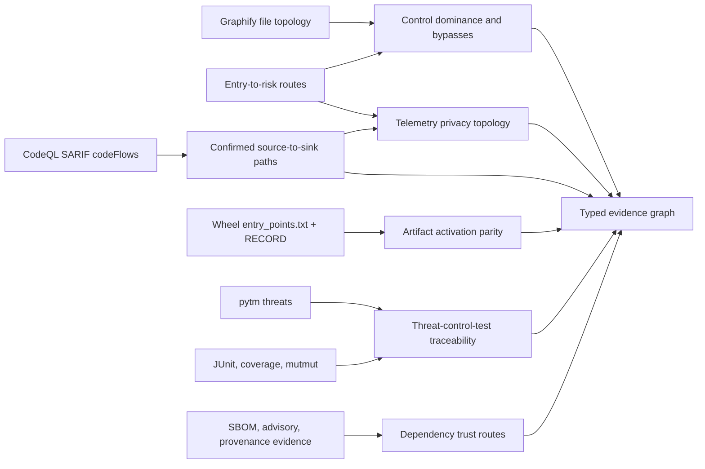

# Advanced cross-evidence analysis

Last reviewed: 2026-08-13

`advanced-analysis.json` turns retained scanner, route, artifact, threat, test,
mutation, telemetry, and dependency evidence into typed relationships and
decision-oriented review records. The analysis is offline, bounded, and does
not execute target code.

## Analysis pipeline



## Decisions produced

| Analysis | Exact evidence required | Decision |
|---|---|---|
| Control topology | Graphify file edges, declared entry roots, retained validation campaigns | A candidate control is mandatory on every static path, bypass-capable, or absent from retained routes |
| Taint-path fusion | Native SARIF `codeFlows` plus normalized finding identity | Scanner-confirmed source-to-sink steps are kept separate from graph proximity |
| Artifact route parity | Digest-bound wheel, `entry_points.txt`, `RECORD`, source graph, declared entry points | Published commands and plugins are modeled, graph-only, or absent from reviewed source |
| Threat traceability | Exact pytm finding path, candidate control, selected tests | Threat has both control and test evidence, a control without a test, or no mapped control evidence |
| Mutation leverage | Exact mutmut finding path and control candidate | A security-relevant control mutation survived and needs a failing negative test |
| Telemetry privacy | Sensitive-data route, protection status, candidate controls, optional taint steps | Protection is absent, bypass-capable, ordered after export, or statically protected |
| Dependency trust | Exact advisory importer, final-artifact inventory, KEV/EPSS, runtime and scanner assurance | Reachable and shipped dependency risk is elevated without hiding composition uncertainty |

The suite calls a file a **candidate control** only when a retained
`shared-transit` convergence hotspot or its validation campaign identifies it.
Ordinary target concentration is not control evidence. Dominance proves a graph
property, not that the implementation authenticates, authorizes, validates, or
redacts correctly. A bypass means an alternate static file path exists; it is
not an exploitability claim.

## Release regression comparison

Compare two independently retained artifacts only after approving their exact
SHA-256 digests:

```text
pysec advanced-diff BEFORE/advanced-analysis.json AFTER/advanced-analysis.json \
  --baseline-sha256 BASELINE_SHA256 \
  --current-sha256 CURRENT_SHA256 \
  --format markdown --output advanced-delta.md
```

The command fails with exit code `1` when it observes any of the following:

- a mandatory candidate control becomes bypass-capable;
- telemetry protection or redaction ordering regresses;
- a dependency trust route moves to a higher review tier;
- a new scanner-confirmed taint path appears;
- a new unmodeled published entry point appears; or
- a new wheel `RECORD` identity gap appears.

Both inputs are regular files, size-bounded, schema-identified, and
digest-verified before comparison. A passing delta means no retained regression;
it does not prove safe runtime behavior or absence of vulnerabilities.

## Report interpretation

`summary.md` and `index.html` show counts and the highest-value control,
telemetry, and dependency decisions. `advanced-analysis.json` remains the
complete machine contract and includes:

- stable subject and relationship IDs;
- contributing evidence artifact names;
- exact source paths and lines when available;
- scanner-confirmed versus structural classifications;
- owner and test handoffs;
- actionable remediation; and
- explicit limitations and truncation counts.

Actionable bypasses, artifact parity failures, privacy gaps, elevated dependency
trust routes, threat traceability gaps, and surviving security mutations are
also promoted into `closure-plan.json` with an owner, priority, acceptance
criteria, and evidence references.

Native SARIF path retention excludes source snippets and arbitrary execution
state so reports do not create a secondary sensitive-data store.
