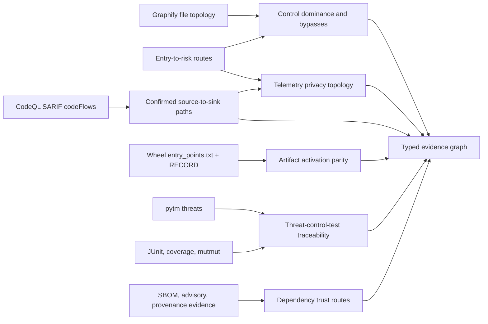

# Advanced cross-evidence analysis

Last reviewed: 2026-08-13

`advanced-analysis.json` turns retained scanner, route, artifact, threat, test,
mutation, telemetry, and dependency evidence into typed relationships and
decision-oriented review records. The analysis is offline, bounded, and does
not execute target code.

## Analysis pipeline



## Decisions produced

| Analysis | Exact evidence required | Decision |
|---|---|---|
| Control topology | Graphify file edges, exact route entry IDs mapped through reachability, retained validation campaigns | A candidate control is mandatory on every route-scoped static path, bypass-capable, absent from retained routes, or `not-established` when entry identity or graph connectivity is incomplete |
| Taint-path fusion | Native SARIF `codeFlows` plus normalized finding identity | Preserves bounded execution order, nesting, importance, and source/sink kinds; route alignment requires a sink matching the finding plus the complete ordered native file path as a subsequence of one retained entry exposure |
| Artifact route parity | Digest-bound wheel, ZIP member structure, `entry_points.txt`, `RECORD`, source graph, declared entry points | Detects ambiguous or unsafe archive members and determines whether published commands and plugins are modeled, graph-only, or absent from reviewed source |
| Threat traceability | Exact pytm finding path, mapped control campaign, case-level execution, complete inventory, source-revision binding | Separates selected test candidates from source-bound passing observations and keeps security-test intent `not-established` until an abuse-case assertion is reviewed |
| Mutation leverage | Exact mutmut finding path, control candidate, and source-bound case execution | A security-relevant control mutation survived; selected or passing tests are distinguished from mutation-killing evidence |
| Telemetry privacy | Sensitive-data route, protection status, candidate controls, aligned native taint steps | Assesses every aligned path against its retained sink, distinguishes native sanitizer kinds from heuristic labels, exposes partial redaction and exact pre-sink control correlation, and withholds a protected decision when evidence is incomplete |
| Dependency trust | Exact advisory importer, advisory and final-artifact versions, KEV/EPSS, runtime and scanner assurance | Distinguishes an affected version in the artifact, a fixed version, comparable absence, unresolved versions, and missing composition evidence before assigning review weight |

The suite calls a file a **candidate control** only when a retained
`shared-transit` convergence hotspot or its validation campaign identifies it.
Ordinary target concentration is not control evidence. Dominance proves a graph
property, not that the implementation authenticates, authorizes, validates, or
redacts correctly. A bypass means an alternate static file path exists; it is
not an exploitability claim.

Dominance is computed independently for each route's declared entry identities.
Unrelated application entry points cannot create a false bypass for a route that
does not retain them. Conversely, the analysis does not fall back to global
roots when a route entry ID is missing or its target is disconnected in the
retained graph; it reports `not-established` and creates an evidence-repair
handoff instead of claiming that the control is mandatory or bypassable.

## Release regression comparison

Compare two independently retained artifacts only after approving their exact
SHA-256 digests:

```text
pysec advanced-diff BEFORE/advanced-analysis.json AFTER/advanced-analysis.json \
  --baseline-sha256 BASELINE_SHA256 \
  --current-sha256 CURRENT_SHA256 \
  --format markdown --output advanced-delta.md
```

The command fails with exit code `1` when it observes any of the following:

- a mandatory candidate control becomes bypass-capable;
- telemetry protection or redaction ordering regresses;
- a dependency trust route moves to a higher review tier;
- a new scanner-confirmed taint path appears;
- an existing scanner-confirmed path loses ordered entry-route alignment;
- a new unmodeled published entry point appears; or
- a new wheel `RECORD` identity gap appears.

Both inputs are regular files, size-bounded, schema-identified, and
digest-verified before comparison. A passing delta means no retained regression;
it does not prove safe runtime behavior or absence of vulnerabilities.

Wheel inspection validates archive structure before interpreting `RECORD`:
duplicate names, case collisions, traversal or platform-ambiguous paths,
symlinks, encrypted entries, unverifiably large members, suspicious compression
ratios, and excessive total expansion are retained as integrity gaps. Exact ZIP
member counts are preserved instead of collapsing duplicate central-directory
entries into a set.

## Report interpretation

`summary.md` and `index.html` show counts and the highest-value control,
telemetry, and dependency decisions. `advanced-analysis.json` remains the
complete machine contract and includes:

- stable subject and relationship IDs;
- contributing evidence artifact names;
- exact source paths and lines when available;
- scanner-confirmed versus structural classifications;
- owner and test handoffs;
- actionable remediation; and
- explicit limitations and truncation counts.

`route_alignment: aligned` is deliberately strict. The final native sink must
match the normalized finding location, and every source-to-sink file transition
must occur in the same order within one retained entry-point exposure. Sharing
only the sink, sharing an unordered file set, a conflicting sink line, a path
outside the exposure, or contradictory native source/sink markers cannot create
route corroboration. Those flows remain scanner-confirmed but are reported as
`not-established` with a reconciliation action. Native `executionOrder` is used
when every retained step supplies it; otherwise the SARIF array order is kept.
Generic SARIF `codeFlows` are not automatically taint evidence: promotion
requires a security-domain `path-problem` rule or correctly ordered native
`source` and `sink` kinds. Other paths remain bounded in normalized finding
evidence as `unclassified-code-flow` and do not inflate taint-path counts.

Telemetry redaction is evaluated per aligned native path. Export position is the
retained sink endpoint, not a substring guess from messages such as `log` or
`send`. A route receives `redaction-before-export` only when every aligned,
complete path contains a redaction marker before that sink. Native sanitizer
kinds are distinguished from bounded path/message heuristics; mixed paths are
reported as `redaction-not-on-all-confirmed-paths`. Candidate controls are also
correlated by exact file occurrence before each native sink. A missing
occurrence prevents a protected claim but is not called a runtime bypass,
because data-flow scanners may omit non-data-flow control frames.
Heuristic names remain review evidence only: `protected-static-route` requires
an explicit native sanitizer kind on every aligned path, in addition to the
route's observed protection and mandatory-control correlation.

Threat and control test joins follow the mapped control's campaign IDs rather
than looking for a test campaign at the threat sink. `candidate_test_files` are
selection evidence only. A file reaches `verified_test_files` only when the
campaign retains a complete case inventory, a passing observation for that
exact file, complete source-inventory membership, and an aligned evidence
revision. Even then, the record remains a test candidate: execution and line
coverage do not establish that the test contains a negative or abuse-case
assertion for the threat. Stale, partial, failed, and unbound evidence cannot
reduce the corresponding report or closure-plan gap.

Dependency scoring compares retained advisory versions with exact artifact
versions. Merely having an artifact SBOM no longer implies that the package is
present. Comparable absence contributes no shipped-package weight; affected,
fixed, unresolved, and unavailable artifact states remain distinct in the
machine record and release delta.

Actionable bypasses, artifact parity failures, privacy gaps, elevated dependency
trust routes, threat traceability gaps, and surviving security mutations are
also promoted into `closure-plan.json` with an owner, priority, acceptance
criteria, and evidence references.

Native SARIF path retention excludes source snippets and arbitrary execution
state so reports do not create a secondary sensitive-data store.
