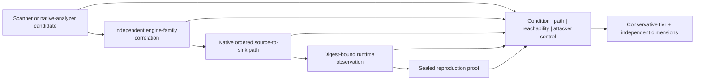

# Finding accuracy and architecture context

Last reviewed: 2026-08-26

The suite keeps severity, lifecycle, and validation independent. Severity
describes potential impact; lifecycle describes whether a stable finding is new,
existing, regressed, resolved, or governed; validation describes the strongest
retained positive evidence for the current finding.

## Evidence flow



The left-to-right chain is an evidence-strength ladder, not a mandatory route
through every state. A finding can have runtime evidence without a scanner
retaining an ordered path, for example; the independent dimensions preserve
that distinction instead of overstating the compatibility tier.

## Validation tiers

`finding-validation.json` assigns exactly one conservative tier:

| Tier | Required positive evidence |
|---|---|
| `static-candidate` | One normalized scanner or bundled-analyzer observation |
| `corroborated` | At least two independent engine families at the same normalized condition and compatible data flow |
| `static-path-confirmed` | Native SARIF retains a bounded ordered source-to-sink path |
| `runtime-observed` | A runtime producer or deployment-bound trace exercised the condition or its exact source file |
| `reproduced` | A failure- or exploit-oriented companion retained an exact source-, fingerprint-, location-, payload-, environment-, deployment-, oracle-, impact-, and negative-control binding |

Absence of runtime evidence never demotes a finding, proves safety, or establishes
a false positive. Reproduction is bound to the retained test environment and
does not imply that every production state is vulnerable. The artifact also
reports independent dimensions for condition observation, source-to-sink path,
entry-point reachability, attacker control, runtime execution, harmful effect,
reproduction, and production-environment parity. The compatibility tier never
collapses those dimensions into an exploitability claim.

## Framework-specific model coverage

`framework-model-coverage.json` discovers imports of security-relevant web,
database, task, template, API, RPC, and cloud SDK frameworks. A framework is
modeled only when the selected model engine completed and `.pysec-models.json`
binds the model plus positive and negative canaries to their exact SHA-256 and
declares the expected native rule IDs.

```json
{
  "schema_version": "1.1",
  "models": [
    {
      "framework": "fastapi",
      "engine": "codeql",
      "model_path": "security/models/fastapi.yml",
      "model_sha256": "<sha256>",
      "positive_canary_path": "security/canaries/fastapi_positive.py",
      "positive_canary_sha256": "<sha256>",
      "negative_canary_path": "security/canaries/fastapi_negative.py",
      "negative_canary_sha256": "<sha256>",
      "expected_rule_ids": ["py/fastapi-command-injection"]
    }
  ]
}
```

Production and release remain incomplete when a detected framework lacks this
evidence. Every expected rule must match the positive canary and must not match
the negative canary. Qualified positive-canary observations are retained in the
coverage artifact and excluded from real project findings. Verified execution
proves model identity and canary behavior, not that every custom wrapper,
reflection path, or runtime dispatch is represented.

## Application contracts and vulnerable calls

`application-contract-analysis.json` reconciles statically recognizable Python
route decorators with a retained JSON OpenAPI document and its optional
`security/baselines/openapi.json` baseline. It reports undocumented code routes,
spec operations without code handlers, removed operation security or scopes,
removed required inputs, and weakened patterns, enumerations, lengths, and
numeric bounds.

An optional `security/application-contracts.json` adds explicit behavioral and
dependency obligations:

```json
{
  "schema_version": "1.0",
  "endpoints": [
    {
      "method": "POST",
      "path": "/tenants/{tenant_id}",
      "tenant_scoped": true,
      "allow_test_ids": ["allow-owner"],
      "deny_test_ids": ["deny-anonymous"],
      "cross_tenant_test_ids": ["deny-other-tenant"]
    }
  ],
  "vulnerable_functions": [
    {
      "package": "example-package",
      "advisory_id": "GHSA-example",
      "symbols": ["example_package.parser.unsafe_load"]
    }
  ]
}
```

The suite joins declared test IDs only to passing cases in retained JUnit,
authorization, Schemathesis, Hypothesis, and other evidence bound to the same
sealed source digest. Unknown, failed, skipped, or detached cases do not satisfy
an allow, deny, or tenant-isolation obligation. Advisory-listed symbols are
resolved through Python import aliases and matched to exact AST calls; local
wrapper calls are followed back to recognizable API handlers. A retained chain
proves bounded static entry-point reachability, while attacker control, runtime
execution, and advisory exploit preconditions remain separate evidence.

## Code and architecture health

Broad structural profiles emit three additional artifacts:

- `code-health.json` measures bounded Python cognitive complexity, long
  functions, parameter coupling, large classes, exact duplicated function ASTs,
  and lower-severity identifier/literal-normalized semantic clones.
- `architecture-history.json` mines at most 500 commits from the already sealed
  Git history. It reports persistent high-ratio file co-change and the
  intersection of frequently changed files with active findings.
- `static-architecture.json` builds a bounded local Python import graph and
  identifies strongly connected dependency cycles, excessive direct fan-out,
  high-degree hubs, fan-in/fan-out instability, stable-to-unstable dependency
  edges, and new edges relative to an optional
  `security/baselines/architecture-edges.json` baseline.

The architecture baseline is deliberately simple and reviewable:

```json
{
  "schema_version": "1.0",
  "edges": ["package.application -> package.domain"]
}
```

The quality profile also uses strict Pyright mode, rejects untyped or partially
typed function definitions through Mypy, and enables additional time-zone and
Pylint-derived correctness families in Ruff.

These are prioritization signals. Co-change can reflect an intentional release
unit, and a complex function can be correct. Closure requires an owner to refactor,
document the boundary, or retain a reviewed exception with appropriate tests.

These analyzers run only for `audit`, `quality`, `repo`, `comprehensive`,
`production`, and `release`. Framework coverage, application-contract analysis,
finding validation, and the capability manifest are emitted for every profile.

## Capability truth

Every report includes `capability-manifest.json`. It distinguishes the complete
portfolio from the selected profile, applicable controls, completed controls,
and execution gaps. The opt-in `audit` profile provides broad source security,
quality, typing, architecture, reachability, and repository-health analysis
without requiring target-executing runtime or release producers. The example
configuration selects this profile; `quick` and `standard` remain stable for
existing users.
