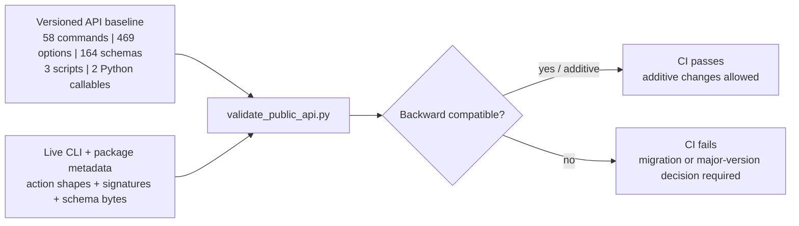

# API and compatibility policy

Last reviewed: 2026-08-30

The command line, console-script targets, explicitly exported package names,
entry-point callable signatures, and exported JSON schemas are the supported
integration surface. Other Python modules remain internal unless explicitly
promoted in a future versioned API manifest.

The checked-in [`security/api-surface-1.1.json`](../security/api-surface-1.1.json)
baseline is enforced in CI. A release may add commands, options, and new schema
versions without breaking consumers. Removing or renaming a stable command,
option, or schema requires a versioned replacement, a documented migration,
and a major compatibility decision. Existing schemas remain immutable; changes
are published under a new schema version.

`scripts/validate_public_api.py` compares the live parser and bundled schema
registry to this baseline. It protects option action, requiredness, arity, type,
and enumerated choices; choices may expand but cannot remove a supported value.
It also compares the exact SHA-256 of every protected schema, so a schema cannot
change in place while retaining its version. The baseline is checked for
internal command, option, contract, digest, console-script, package-export, and
Python-callable consistency before the live comparison.

The baseline is generated exhaustively from the parser. Generate a review
candidate outside the protected path with
`python -m scripts.generate_public_api_baseline --output <candidate>`.
Replacing the repository baseline additionally requires the explicit
`--approve-replacement` acknowledgement and normal code review.

The baseline covers the full current CLI and bundled-schema inventory. New
commands, options, choice values, and schema versions remain additive; removal
or incompatible mutation requires an explicit versioned replacement.

The project currently declares an Alpha package version. Promotion to Beta or
stable status requires a clean immutable release commit, green protected CI,
signed distributions, verified installation and rollback exercises, and a
published migration and deprecation record.
