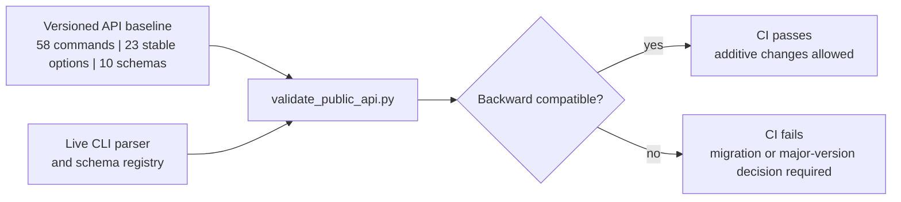

# API and compatibility policy

Last reviewed: 2026-08-30

The command line and exported JSON schemas are the supported integration
surface. Python modules remain internal unless they are explicitly promoted in
a future versioned API manifest.

The checked-in [`security/api-surface-1.0.json`](../security/api-surface-1.0.json)
baseline is enforced in CI. A release may add commands, options, and new schema
versions without breaking consumers. Removing or renaming a stable command,
option, or schema requires a versioned replacement, a documented migration,
and a major compatibility decision. Existing schemas remain immutable; changes
are published under a new schema version.

`scripts/validate_public_api.py` compares the live parser and bundled schema
registry to this baseline. This converts accidental removals into build
failures while allowing additive development.

The baseline counts are the protected compatibility subset, not the full
implementation inventory. New commands, options, and schemas may be introduced
without immediately promising indefinite compatibility; promotion into the
baseline is an explicit governance decision.

The project currently declares an Alpha package version. Promotion to Beta or
stable status requires a clean immutable release commit, green protected CI,
signed distributions, verified installation and rollback exercises, and a
published migration and deprecation record.
