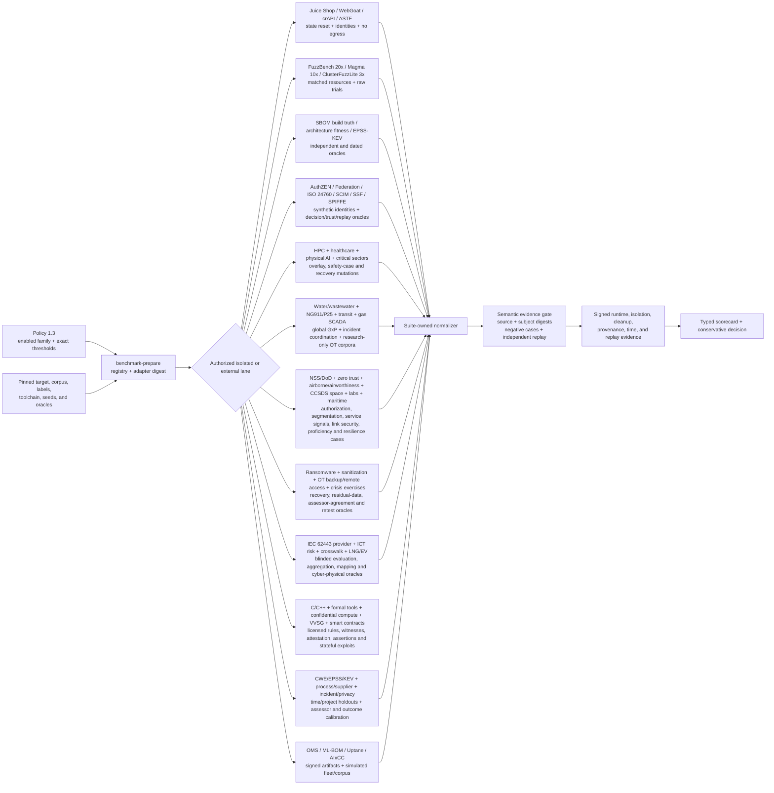
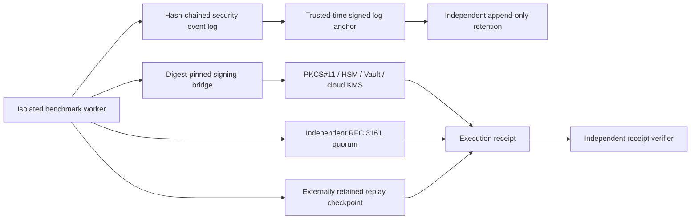
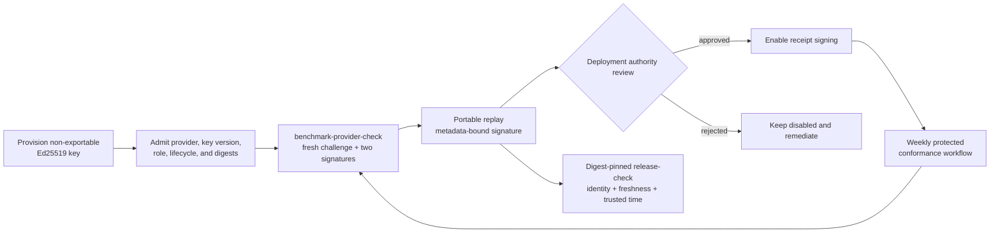

# Benchmark trust operations

Last reviewed: 2026-08-31

This runbook covers the deployment-owned controls around enhanced benchmark
execution. Repository policy cannot authorize receipt signers, trusted-time
authorities, replay state, or security-event anchors.

The maintained execution surface currently contains 262 benchmark families,
192 adapters, eleven typed scoring protocols, and 96 suite-owned semantic
evidence integrations. A registry entry is not evidence that a benchmark ran;
only a subject-bound, replay-protected scorecard from an authorized lane can
satisfy an enabled policy threshold.

## Domain execution and evidence flow



| Lane | Minimum operational evidence | Claim boundary |
|---|---|---|
| Vulnerable applications and API testing | Immutable target release or image, authoritative positive and clean labels, route and state coverage, reset proof, two-identity authorization replay, and complete egress transcript | Measures the pinned targets and cases only; ASTF 2.0.1 coverage is independently demonstrated and never inherited from the framework |
| Statistical fuzzing | Equal resource budgets, pinned toolchains, seed and dictionary manifests, raw per-trial observations, crash replay and deduplication, baseline and deliberately broken controls, and measured environment drift | Requires 20 FuzzBench, 10 Magma, or 3 ClusterFuzzLite trials; one successful run is not a performance claim |
| SBOM and SCA build truth | Declared, resolver, build, installed-artifact, and container-layer observations across at least three ecosystems, including known-unknown and false-advisory controls | Reports component, relationship, field, and advisory accuracy separately |
| Architecture fitness | Approved rules, history, ownership, clean baselines, blinded labels, and exact cycle, layering, unstable-dependency, change-coupling, ownership-concentration, and drift mutations | Measures the pinned architecture rules and mutation set, not general design quality |
| Regulated operational assurance | Applicability and authority record, controlled or licensed source digest, synthetic system/organization boundary, adverse operational cases, qualified independent review, recovery proof and immutable audit trail | Never grants an NSS authorization, accreditation, certification credit, regulatory compliance, government endorsement, flag/class approval or product listing |
| Federal configuration conformance | Quarterly STIG/SRG/SCAP release and delta digest, asset/CPE and profile applicability, XCCDF/OVAL engine lock, blinded automated/manual decisions, exceptions and POA&M, laboratory remediation/rollback, rescan and drift history | Production snapshots are immutable and read-only; remediation occurs only on representative targets and does not establish system authorization or compliance |
| OT patch lifecycle | Licensed IEC 62443-2-3 criteria, signed advisory and firmware identity, safety/availability review, qualification, maintenance window, safe state, partial failure, rollback, compensating-control expiry, restoration and outcome history | Inert IACS digital twin or representative laboratory only; no production process actuation or IEC certification claim |
| Recovery, sanitization, and crisis assurance | Pinned NIST/ISO/IEC/IEEE editions, asset and dependency scope, protected positive/negative cases, independent residual-data or recovery verification, blinded assessor decisions where applicable, corrective owners, retest, cleanup and immutable ledgers | Uses synthetic data and inert or disposable systems; does not destroy production media, deploy ransomware, operate a live emergency, modify production OT, or issue certification/compliance claims |
| Continuing airworthiness | Licensed DO-355A and ARP5150B/ARP5151B criteria, service and vulnerability signals, function/hazard/configuration trace, fleet effectivity, interim and corrective action, field deployment, effectiveness and recurrence | Synthetic fleets and inert system models with no aircraft or flight connectivity; results do not provide authority approval or certification credit |
| Space-mission communications | Pinned CCSDS threat, architecture, algorithm, credential, SDLS and extended-procedure editions; mission topology, managed parameters, keys/security associations, forgery/replay/order/delay/desynchronization/link-fault cases, recovery and residue proof | No-egress digital twin with inert payload and actuator interfaces; no production spacecraft connectivity, flight qualification or certification claim |
| Financial messaging assessment | CSCF 2026 and IAF lock, BIC/connectivity architecture, complete applicability, annual delta, significant change, assessor competence/independence, bounded prior reliance, design/operation samples, remediation, retest and KYC-SA handoff | Synthetic architecture, identities and transactions only; no production credentials/messages, attestation submission, Swift certification or compliance claim |
| Empirical calibration | Independently audited labels, project and chronological splits, duplicate and contamination analysis, point-in-time inputs, blinded assessors or independent witness validators, disagreements, confidence and longitudinal outcomes | Measures the governed corpus, observation window and assessor/tool versions only; it does not establish universal accuracy or causal improvement |
| Temporal prioritization | Three or more ordered dated EPSS, KEV, and outcome snapshots with as-of joins, alias reconciliation, future-data exclusion, censoring, calibration, operational budgets, and time-shift controls | Measures point-in-time prioritization without allowing future intelligence into an earlier decision |
| Identity lifecycle and continuous access | Synthetic SCIM tenants and roles, full resource lifecycle, cursor/ETag/bulk/filter cases, signed SET replay, SSF push/poll streams, CAEP/RISC subject and revocation events, and alpha-suite acknowledgement | Does not issue OpenID certification; official SSF conformance remains alpha and organization-owned oracles are mandatory |
| Authorization decision interoperability | AuthZEN 1.0 PDP/PEP roles, exact subject-resource-action-context bindings, declared capabilities, single/batch/search behavior, cache and policy revisions, confusion, partial failure, timeout, outage, and clean controls | Draft AuthZEN profiles are excluded; the suite supplies organization-owned conformance evidence and never issues OpenID certification |
| Identity federation | Federation 1.1 trust anchors, intermediates and leaves, signed entity statements, authority hints, metadata policies, trust marks, OIDC behavior, rollover, expiry, cycle, fork, substitution and downgrade cases | Official Federation plans are explicitly early; independent negative replay is mandatory and a pass is not OpenID certification |
| Identity-management framework | Licensed ISO/IEC 24760 Parts 1-3 criteria, people/organization/device/software identities, authorities, aliases and namespaces, privacy, federation, assurance and complete proofing-through-deletion lifecycle | Licensed criteria remain access-controlled; assessor agreement is bounded and the suite does not issue ISO certification |
| Workload identity | Stable-spec snapshot, test trust domains, node/workload attestation, selector isolation, X.509/JWT SVIDs, Workload API authorization, rotation, revocation, bundles, and federation | Experimental remote Workload API is excluded; no production identity is issued |
| HPC and AI infrastructure | SP 800-223 zones and threats, all 60 SP 800-234 tailored controls, applicability/ODPs, scheduler, accelerator, storage, shared-resource, management-plane, performance, residue and recovery evidence | Runs only in an authorized isolated partition, digital twin or representative laboratory; draft SP 800-239 is excluded and no NIST certification is claimed |
| AI data-quality visualization | TR 5259-6 measure/dataset/population/stratum binding, transformation provenance, uncertainty, missingness, comparison context, accessibility and misleading-presentation mutations | Technical Report guidance supports evidence quality but cannot be presented as ISO conformance or certification |
| Medical-device cybersecurity | SW96, IEC 80001-1/60601-4-5 and IMDRF risk, capability, SBOM, legacy and patient-safety evidence | Synthetic devices and patient data only; no regulatory approval claim |
| Physical AI and autonomy | ISO 21448/PAS 8800/34502 and UL 4600 ODD, scenario, degradation, fallback and safety-case evidence | Deterministic simulation or inert bench only; no real-world actuation |
| Critical C/C++ | Licensed MISRA C/C++ rule digests, compiler matrices, runtime corroboration and governed deviations | Licensed content stays outside artifacts; tool results are not product certification |
| Confidential computing | RATS/EAT plus SEV-SNP, TDX and CCA evidence, endorsement, TCB, revocation and secret-denial cases | Synthetic secrets and fixed trust roots; no hardware certification |
| Voting systems | VVSG 2.0 Test Assertions 1.4, software independence, accessibility, audit, media and recovery | Synthetic elections only; no EAC or jurisdiction certification |
| Nuclear, rail and space | Sector applicability, hazards, digital-twin failures, degraded operation, recovery and independent assurance | Inert laboratories only; no production actuation or regulator claim |
| Stateful smart contracts | Source-to-bytecode identity, multi-transaction exploits, economic invariants, upgrades, bridges, clean controls and fix replay | Disposable local chain and synthetic assets; alpha SCSVS excluded |
| DevSecOps/test maturity | Immutable delivery events, maturity evidence, quality/security outcomes, escaped defects, anti-gaming, longitudinal uncertainty and blinded reassessment | Read-only governance lane with protected licensed criteria and privacy-safe cohorts |
| Detection-product calibration | Independent ATT&CK step ground truth, benign workloads, visibility/detection/protection separation, false positives, latency, evasion and version drift | Isolated synthetic enterprise using inert payloads; no vendor endorsement |
| AI/ML artifact supply chain | OMS 1.0 schemas and official verifier vectors, full multi-file manifests, signer identity, independent verification, CycloneDX 1.7 model cards, datasets, dependencies, provenance, roundtrip, omission and tamper cases | Signature proves bounded integrity/authenticity and an ML-BOM proves schema-valid inventory; neither proves model safety, fairness, quality, or fitness |
| Automotive OTA | Simulated Director and Image repositories, full/partial verification ECUs, role/key thresholds, secure time, POUF, install/recovery, rollback, freeze, mix-and-match and compromise cases | Uses inert firmware and simulated vehicles; does not claim Uptane or regulatory certification |
| Autonomous remediation and criticality | Immutable approved AIxCC corpus/scoring pipeline, protected splits, contamination and training-overlap analysis, independent proof/patch/functional replay, repeated resource-bounded trials; separately, reproducible OpenSSF Criticality Score signals and temporal calibration | Fragmented public AIxCC materials are not presumed benchmark-ready; criticality is context-only and never a security gate or vulnerability-likelihood score |

Every one of these lanes must supply `suite-owned-extension-evidence` inside
the governed score evidence. Domain-specific required inputs are exported by
the maintained adapter contract, so missing raw trials, reset proof, build
truth, architecture labels, or dated snapshots fail closed before a score can
contribute to assurance. Use
[`industry-assurance-policy-1.3.example.json`](../examples/industry-assurance-policy-1.3.example.json)
as the disabled-by-default policy template.

## Deployment topology



## Signing-provider enrollment



1. Provision an Ed25519 signing key in the approved service or hardware device.
2. Admit its raw public-key digest, provider identity, key version, organization,
   role, and validity interval in the deployment authority policy.
3. Install a minimal bridge that accepts only message bytes on standard input
   and emits only a base64 Ed25519 signature on standard output.
4. Pin the bridge executable and provider profile by SHA-256. Authentication must
   use workload identity, a secure local agent, or an authenticated hardware
   session; never place credentials in arguments or the profile.
5. Exercise a known-answer signature and local verification before enabling the
   key for benchmark receipts.

Run the active provider check during enrollment and after every bridge, identity,
policy, or key-version change:

```text
pysec benchmark-provider-check \
  --profile /etc/pysec/provider.json \
  --profile-sha256 APPROVED_PROFILE_SHA256 \
  --output provider-conformance.json
```

The 1.1 receipt contains the public key, challenge, and signature needed for an
independent replay. Its domain-separated Ed25519 statement binds the challenge,
provider and key version, backend, credential mode, public-key, executable and
profile digests, observation time, and optional trusted-time identity. Changing
any field invalidates the statement digest or signature. The scheduled
`signing-provider-conformance.yml` workflow repeats this against each protected
provider and retains the receipts for 180 days. Repository CI validates the
contract and mock bridge behavior; only the protected workflow can establish
that a live deployment-owned HSM, Vault, or KMS bridge is conformant.

Bind every required provider receipt into the release decision by exact digest:

```text
pysec release-check report \
  --provider-conformance provider-conformance.json \
  --provider-conformance-sha256 APPROVED_RECEIPT_SHA256 \
  --required-provider-id provider-generic-hsm \
  --maximum-provider-conformance-age-hours 168 \
  --require-provider-conformance --format json \
  --output release-readiness.json
```

The gate rejects malformed or cryptographically detached receipts, duplicate or
missing provider identities, future observations, and stale evidence. Hardened
release evidence also requires the receipt to bind a deployment-verified
trusted-time context.

Use `--receipt-signing-provider-profile` together with
`--receipt-signing-provider-profile-sha256`. The profile schema supports
PKCS#11, generic HSMs, HashiCorp Vault Transit, AWS KMS, Azure Key Vault, and
Google Cloud KMS bridge deployments. The backend label describes the external
bridge; the suite still requires an Ed25519 public key and verifies every result
locally.

## Rotation procedure

1. Add the new key version with a future-valid lifecycle interval.
2. Run a canary benchmark and verify the receipt, replay checkpoint, trusted-time
   proof, and event-log anchor independently.
3. Move production execution to the new provider profile.
4. Mark the old key suspended, then revoked after the overlap and rollback
   windows expire. Retain the old public key and lifecycle evidence for historic
   receipt verification.
5. Advance and externally retain the new security-event anchor. Never reset its
   sequence or genesis during ordinary key rotation.

## Required alerts

Alert immediately on:

- receipt signature, signer lifecycle, or provider executable mismatch;
- trusted-time disagreement, rollback, stale receipt, or missing checkpoint;
- replay nonce reuse, fork, checkpoint deletion, or unexpected initialization;
- security-event sequence, hash-chain, anchor, or rotation discontinuity;
- cleanup failure, input mutation, containment-probe failure, or output-budget
  exhaustion; and
- repeated benchmark score changes without a corpus, runner, target, or policy
  digest change.

Alerts should include immutable receipt and event digests, not private input,
credentials, or raw sensitive findings.

## Recovery drills

Run the cross-platform `resilience-drills.yml` workflow weekly and conduct
quarterly deployment drills for process termination after intent persistence, process
termination after replay consumption, disk-full during checkpoint replacement,
lock contention, trusted-time rollback, signer suspension, corrupted event-log
tail, and lost local replay state. Recovery passes only when the runner either
reconciles exactly one prior transaction or fails closed without consuming a new
nonce. Record drill evidence outside the repository and retain it under the
organization’s audit policy.

The automated drill injects signing-bridge timeout and output flooding, verifies
that timeout containment terminates spawned descendants, exercises stage
failure with mandatory cleanup, trusted-time rollback and fork attempts, and a
post-recovery scale-budget check. It complements rather than replaces the
external service and disaster-recovery exercise.

## Verification objectives

- Every enhanced execution has one signed receipt and one replay transition.
- Every retained event prefix has a lifecycle-valid trusted-time anchor.
- Key rotation preserves verification of historic receipts.
- Recovery never produces two receipts for one nonce or silently resets state.
- Benchmark effectiveness is recalibrated whenever parsers, similarity
  algorithms, corpora, labels, or thresholds change.
