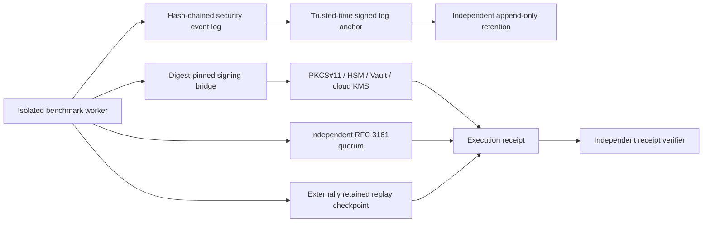
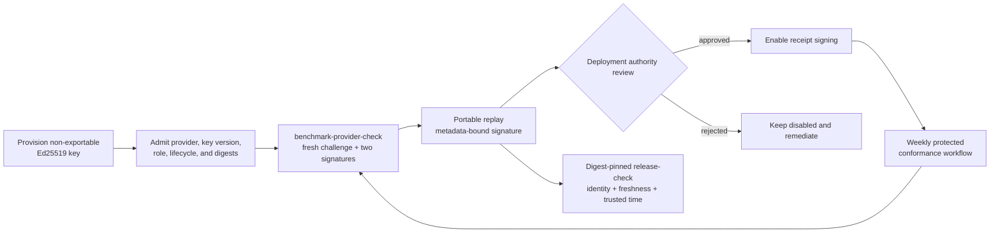

# Benchmark trust operations

Last reviewed: 2026-08-30

This runbook covers the deployment-owned controls around enhanced benchmark
execution. Repository policy cannot authorize receipt signers, trusted-time
authorities, replay state, or security-event anchors.

## Deployment topology



## Signing-provider enrollment



1. Provision an Ed25519 signing key in the approved service or hardware device.
2. Admit its raw public-key digest, provider identity, key version, organization,
   role, and validity interval in the deployment authority policy.
3. Install a minimal bridge that accepts only message bytes on standard input
   and emits only a base64 Ed25519 signature on standard output.
4. Pin the bridge executable and provider profile by SHA-256. Authentication must
   use workload identity, a secure local agent, or an authenticated hardware
   session; never place credentials in arguments or the profile.
5. Exercise a known-answer signature and local verification before enabling the
   key for benchmark receipts.

Run the active provider check during enrollment and after every bridge, identity,
policy, or key-version change:

```text
pysec benchmark-provider-check \
  --profile /etc/pysec/provider.json \
  --profile-sha256 APPROVED_PROFILE_SHA256 \
  --output provider-conformance.json
```

The 1.1 receipt contains the public key, challenge, and signature needed for an
independent replay. Its domain-separated Ed25519 statement binds the challenge,
provider and key version, backend, credential mode, public-key, executable and
profile digests, observation time, and optional trusted-time identity. Changing
any field invalidates the statement digest or signature. The scheduled
`signing-provider-conformance.yml` workflow repeats this against each protected
provider and retains the receipts for 180 days. Repository CI validates the
contract and mock bridge behavior; only the protected workflow can establish
that a live deployment-owned HSM, Vault, or KMS bridge is conformant.

Bind every required provider receipt into the release decision by exact digest:

```text
pysec release-check report \
  --provider-conformance provider-conformance.json \
  --provider-conformance-sha256 APPROVED_RECEIPT_SHA256 \
  --required-provider-id provider-generic-hsm \
  --maximum-provider-conformance-age-hours 168 \
  --require-provider-conformance --format json \
  --output release-readiness.json
```

The gate rejects malformed or cryptographically detached receipts, duplicate or
missing provider identities, future observations, and stale evidence. Hardened
release evidence also requires the receipt to bind a deployment-verified
trusted-time context.

Use `--receipt-signing-provider-profile` together with
`--receipt-signing-provider-profile-sha256`. The profile schema supports
PKCS#11, generic HSMs, HashiCorp Vault Transit, AWS KMS, Azure Key Vault, and
Google Cloud KMS bridge deployments. The backend label describes the external
bridge; the suite still requires an Ed25519 public key and verifies every result
locally.

## Rotation procedure

1. Add the new key version with a future-valid lifecycle interval.
2. Run a canary benchmark and verify the receipt, replay checkpoint, trusted-time
   proof, and event-log anchor independently.
3. Move production execution to the new provider profile.
4. Mark the old key suspended, then revoked after the overlap and rollback
   windows expire. Retain the old public key and lifecycle evidence for historic
   receipt verification.
5. Advance and externally retain the new security-event anchor. Never reset its
   sequence or genesis during ordinary key rotation.

## Required alerts

Alert immediately on:

- receipt signature, signer lifecycle, or provider executable mismatch;
- trusted-time disagreement, rollback, stale receipt, or missing checkpoint;
- replay nonce reuse, fork, checkpoint deletion, or unexpected initialization;
- security-event sequence, hash-chain, anchor, or rotation discontinuity;
- cleanup failure, input mutation, containment-probe failure, or output-budget
  exhaustion; and
- repeated benchmark score changes without a corpus, runner, target, or policy
  digest change.

Alerts should include immutable receipt and event digests, not private input,
credentials, or raw sensitive findings.

## Recovery drills

Run the cross-platform `resilience-drills.yml` workflow weekly and conduct
quarterly deployment drills for process termination after intent persistence, process
termination after replay consumption, disk-full during checkpoint replacement,
lock contention, trusted-time rollback, signer suspension, corrupted event-log
tail, and lost local replay state. Recovery passes only when the runner either
reconciles exactly one prior transaction or fails closed without consuming a new
nonce. Record drill evidence outside the repository and retain it under the
organization’s audit policy.

The automated drill injects signing-bridge timeout and output flooding, verifies
that timeout containment terminates spawned descendants, exercises stage
failure with mandatory cleanup, trusted-time rollback and fork attempts, and a
post-recovery scale-budget check. It complements rather than replaces the
external service and disaster-recovery exercise.

## Verification objectives

- Every enhanced execution has one signed receipt and one replay transition.
- Every retained event prefix has a lifecycle-valid trusted-time anchor.
- Key rotation preserves verification of historic receipts.
- Recovery never produces two receipts for one nonce or silently resets state.
- Benchmark effectiveness is recalibrated whenever parsers, similarity
  algorithms, corpora, labels, or thresholds change.
