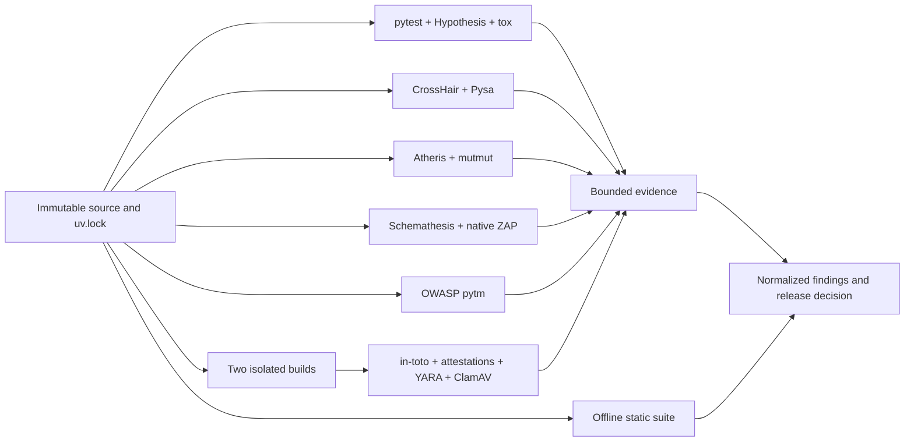

# Offline companion assurance lanes

Last reviewed: 2026-08-01

The scanner process never imports or executes target application code. Tools
that run tests, symbolic execution, fuzzers, a local service, build steps, or
artifact verification execute in disposable companion lanes. Only bounded
JUnit XML or the suite's sanitized assurance JSON crosses into aggregation.



## Locked baseline and test evidence

`uv.lock` is committed and must be checked without modification before a scan:

```powershell
uv lock --check --offline
uv sync --frozen --offline
```

The repository's `dev` dependency group locks coverage.py, Hypothesis, pytest,
tox, and the offline test-hardening utilities below. Generate branch coverage,
ordinary JUnit, and property-test JUnit with:

```powershell
.\scripts\run-test-assurance.ps1 `
  -Target . `
  -PropertyTestPath tests/test_properties.py
```

Point the suite settings at `.artifacts/test-evidence/coverage.json`,
`junit.xml`, `coverage.xml`, and `hypothesis-junit.xml`. Hypothesis is treated
as applicable for every Python production scan, so absent evidence cannot look
like a pass. Schemathesis becomes applicable when an OpenAPI file is present.

Use `uv run tox` on runners that provide Python 3.11 through 3.14. Each tox
environment builds the wheel and emits a separately attributable JUnit file.

Linux-only companion packages have their own 89-package lock at
`companion/uv.lock`. Prepare its wheelhouse in the connected lane, then use:

```bash
uv sync --project companion --frozen --offline
```

The companion project locks CrossHair, Atheris, mutmut, Schemathesis, pytm,
in-toto, YARA, check-manifest, Hypothesis, pytest, coverage, and tox without
adding them to the static scanner runtime.

## Companion tool inventory

| Control | Package/native prerequisite | Produced evidence | Boundary |
|---|---|---|---|
| Property testing | `hypothesis`, pytest | `hypothesis-junit.xml` | Any supported Python runner |
| Python version matrix | `tox` plus approved interpreters | `tox-PYTHON.xml` | One isolated environment per interpreter |
| Symbolic contracts | `crosshair-tool`, optionally `icontract` or `deal` | `crosshair.json` | Side-effect-free targets in a sandbox |
| Taint analysis | `pyre-check` plus project Pysa models | Native Pysa JSON | Linux/macOS/WSL |
| Coverage-guided fuzzing | `atheris` | `atheris.json`, retained crash corpus outside the report | Linux/macOS companion lane |
| Mutation testing | `mutmut` | `mutmut.json` | Linux/WSL because current mutmut requires `fork` |
| API generation | `schemathesis` | `schemathesis-junit.xml`, optional bounded HAR | Local schema and loopback test service only |
| Web DAST | Native OWASP ZAP plus Java | `zap.json` | Local test service; no Docker required |
| Threat modeling | OWASP `pytm`, Graphviz | `pytm.json` plus reviewed diagrams | Linux/macOS/WSL design lane |
| Supply-chain layout | `in-toto` | `in-toto.json` | Offline keys, layout, links, and products |
| Reproducibility | `reprotest`, `diffoscope` | `reproducible-build.json`, detailed diff retained separately | Linux/WSL build lane |
| Final OCI image | native Syft, Grype, and Trivy against a staged archive/digest | `oci-image.json`, detailed SBOM retained separately | Linux companion release lane; no registry pull while isolated |
| Organization malware rules | `yara-python` or native YARA | `yara.json` | Local, versioned rule bundle |
| Accidental test egress/hangs | `pytest-socket`, `pytest-timeout` | Included in JUnit failures | Disposable test lane |

## Locked Python test-hardening utilities

| Package | Contribution | Recommended use |
|---|---|---|
| `hypothesis-jsonschema` | Generates boundary and adversarial values from local JSON Schema | Exercise evidence contracts and configuration parsers without a service |
| `pyfakefs` | Isolated filesystem behavior and failure injection | Test path traversal, symlinks, permissions, and absent artifacts |
| `pytest-mock` | Consistent subprocess and boundary mocking | Exercise scanner failures without invoking native tools |
| `pytest-subprocess` | Declarative subprocess doubles and unexpected-command rejection | Prove exact command construction and fail on unapproved process launches |
| `pytest-socket` | Blocks accidental network access | Enabled globally with `--disable-socket` for this repository |
| `pytest-timeout` | Terminates hung tests | A 30-second thread timeout is enabled globally |
| `pytest-randomly` | Exposes ordering and state leakage | Use its printed seed to reproduce a failure |
| `pytest-xdist` | Parallel test execution and isolation pressure | Use `uv run pytest -n auto` in sufficiently resourced companion lanes |
| `responses` | Offline HTTP doubles for `requests` | Validate retry, authentication-redaction, and malformed-response behavior |
| `respx` | Offline HTTP doubles for HTTPX | Validate sync/async HTTP clients without opening sockets |
| `time-machine` | Deterministic wall-clock control | Test freshness, expiry, and report timestamps without delays |

These packages are test-only and do not expand the scanner process's trusted
computing base. Their exact versions and transitive dependencies are recorded
in `uv.lock`; acquire the locked wheels in the connected preparation lane.

Package wheels, native archives, rules, databases, trusted roots, and Java
runtime must be prepared in a connected update lane, checksum-verified, and
transferred with the native bundle manifest. Never resolve dependencies or
download rules during an isolated scan.

## Assurance JSON contract

ZAP, pytm, in-toto, reproducible-build, YARA, CrossHair, Atheris, mutmut,
check-manifest, ClamAV, and GitHub attestation verification use the same
bounded input shape:

```json
{
  "kind": "yara",
  "producer": "yara 4.x / organization rules 2026-08",
  "revision": "FULL_COMMIT_SHA_OR_ARTIFACT_SHA256",
  "findings": [
    {
      "rule_id": "ORG-SUSPICIOUS-DOWNLOADER",
      "title": "Suspicious downloader pattern",
      "message": "A governed YARA rule matched release content.",
      "path": "dist/package.whl",
      "severity": "high",
      "classification": "MALWARE-SUSPICIOUS-BEHAVIOR",
      "citation": "https://yara.readthedocs.io/en/stable/",
      "impact": "Untrusted executable behavior may be present in the release.",
      "remediation": "Quarantine the artifact and investigate its source-to-build chain."
    }
  ]
}
```

Validate producer output before aggregation:

```powershell
pysec-evidence assurance yara .artifacts/test-evidence/yara.json
```

The machine-readable example contract is
[`docs/schemas/assurance-evidence.schema.json`](schemas/assurance-evidence.schema.json).
It intentionally fixes `kind` to `yara` as a concrete producer template; copy
it and change the `const` value for another assurance adapter. Property tests
generate valid documents from this schema and verify that the bounded validator
accepts them, reducing drift between producer guidance and ingestion behavior.

The validator enforces file-size and finding-count limits, bounds all strings,
accepts only scalar supplemental evidence, and rejects non-HTTPS citations.
Crash logs, HTTP bodies, credentials, malware bytes, signing keys, and full
build diffs must remain outside the consolidated GitHub artifact.
