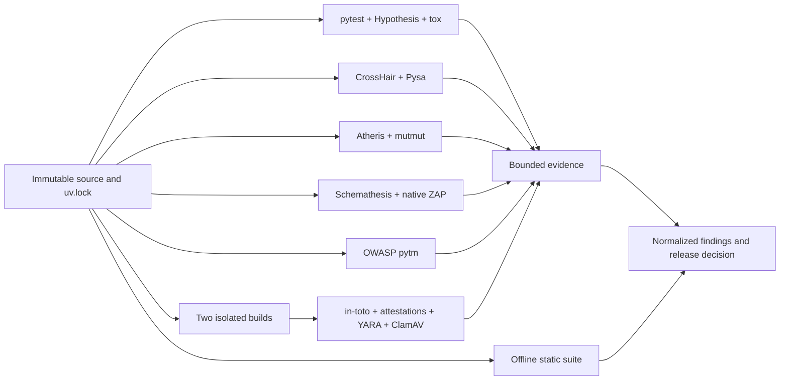

# Offline companion assurance lanes

Last reviewed: 2026-08-27

The scanner process never imports or executes target application code. Tools
that run tests, symbolic execution, fuzzers, a local service, build steps, or
artifact verification execute in disposable companion lanes. Only bounded
JUnit XML or the suite's sanitized assurance JSON crosses into aggregation.



## Locked baseline and test evidence

`uv.lock` is committed and must be checked without modification before a scan:

```powershell
uv lock --check --offline
uv sync --frozen --offline
```

The repository's `dev` dependency group locks coverage.py, Hypothesis, pytest,
tox, and the offline test-hardening utilities below. Generate branch coverage,
ordinary JUnit, and property-test JUnit with:

```powershell
.\scripts\run-test-assurance.ps1 `
  -Target . `
  -PropertyTestPath tests/test_properties.py
```

Point the suite settings at `.artifacts/test-evidence/coverage.json`,
`junit.xml`, `coverage.xml`, and `hypothesis-junit.xml`. Hypothesis is treated
as applicable for every Python production scan, so absent evidence cannot look
like a pass. Schemathesis becomes applicable when an OpenAPI file is present.

Use `uv run tox` on runners that provide Python 3.11 through 3.14. Each tox
environment builds the wheel and emits a separately attributable JUnit file.

Linux-only companion packages have their own lock at
`companion/uv.lock`. Prepare its wheelhouse in the connected lane, then use:

```bash
uv sync --project companion --frozen --offline
```

The companion project locks CrossHair, Atheris, mutmut, Schemathesis, boofuzz,
gRPC, WebSockets, pytm, in-toto, YARA, check-manifest, Hypothesis, pytest,
coverage, and tox without
adding them to the static scanner runtime.

## Companion tool inventory

| Control | Package/native prerequisite | Produced evidence | Boundary |
|---|---|---|---|
| Property testing | `hypothesis`, pytest | `hypothesis-junit.xml` | Any supported Python runner |
| Python version matrix | `tox` plus approved interpreters | `tox-PYTHON.xml` | One isolated environment per interpreter |
| Symbolic contracts | `crosshair-tool`, optionally `icontract` or `deal` | `crosshair.json` | Side-effect-free targets in a sandbox |
| Taint analysis | `pyre-check` plus project Pysa models | Native Pysa JSON | Linux/macOS/WSL |
| Coverage-guided fuzzing | `atheris` | `atheris.json`, retained crash corpus outside the report | Linux/macOS companion lane |
| Mutation testing | `mutmut` | `mutmut.json` | Linux/WSL because current mutmut requires `fork` |
| API generation | `schemathesis` | `schemathesis-junit.xml`, optional bounded HAR | Local schema and loopback test service only |
| Web DAST | Native OWASP ZAP plus Java | `zap.json` | Local test service; no Docker required |
| Authenticated browser controls | Playwright plus the bundled bounded assertion producer | `browser-security.json` | Explicit loopback target; every non-loopback browser request is blocked and recorded without cookie values |
| Runtime code analysis (IAST) | `ddtrace` 4.x plus a separately administered Datadog Agent | `iast.json` | Optional vendor lane; export is normalized locally and must not contain request bodies, credentials, or trace payloads |
| Continuous fuzzing | ClusterFuzzLite plus project-owned fuzz targets | `clusterfuzzlite.json` | PR and scheduled Linux/Docker lane; minimized reproducers remain outside the bounded report |
| Workload runtime detection | Native Falco | `falco.json` | Linux host/container/Kubernetes lane; only normalized rule, workload, count, and source-location metadata is imported |
| Deployed Kubernetes posture | Native Kubescape | `kubescape.json` | Read-only cluster/runtime lane; credentials and raw Kubernetes objects are never imported |
| Independent targeted DAST | Native Nuclei with signed, locally approved templates | `nuclei.json` | Loopback or explicitly authorized disposable target; template and workflow digests are retained |
| Out-of-band testing | A self-hosted OAST service plus bounded correlation export | `oast.json` | Explicitly authorized egress scope; raw requests and callback bodies never cross the companion boundary |
| Stateful REST API exploration | RESTler against a reviewed OpenAPI grammar | `restler.json` | Disposable target only; replayable bug identity and sequence length are retained, network logs are not |
| Non-HTTP protocols | Bundled gRPC, WebSocket, and TCP contract producer | `protocol-security.json` | Loopback-only endpoints; request bytes come from environment variables and are never retained |
| Fuzz harness quality | Fuzz Introspector reachability plus corpus summary | `fuzz-introspector.json` | Static/dynamic function counts and blocker labels only; corpus and crash content remain outside evidence |
| Cloud attack paths | Bundled bounded graph correlator over read-only inventory | `cloud-attack-path.json` | Joins identity, network, sensitive-asset, and IaC/live-drift edges; raw resource IDs are hashed and discarded |
| Connected secret verification | Provider-authorized verifier normalized to redacted receipts | `secret-verification.json` | Connected lane only; secret values, tokens, request/response bodies, and credentials are rejected from evidence |
| Deployed cloud posture and drift | Native Prowler | `prowler.json` | Read-only AWS/Azure/GCP/Kubernetes identity; account/project/region identity only, never credentials or raw resources |
| Runtime prevention | Coraza/ModSecurity or a reviewed vendor RASP | `rasp.json` | Disposable block-mode lane; the suite never enables production blocking or response automation |
| Native memory safety | ASan, UBSan, libFuzzer, and binary hardening tools | `native-sanitizers.json` | Native-source projects only; reproducers remain outside bounded evidence |
| Mobile application security | MobSF static and emulator-backed dynamic analysis | `mobsf.json` | APK/AAB/IPA projects only; application bytes and emulator data remain in the companion lane |
| Deployed transport | A separately pinned, approved TLS scanner | `tls-scan.json` | Explicitly authorized ephemeral endpoints only; certificate material is summarized, not retained |
| Polyglot semantic analysis | Language-specific CodeQL/Semgrep packs | `polyglot.json` | Activated only for supported non-Python source; exact query-pack and configuration digests are retained |
| Threat modeling | OWASP `pytm`, Graphviz | `pytm.json` plus reviewed diagrams | Linux/macOS/WSL design lane |
| Supply-chain layout | `in-toto` | `in-toto.json` | Offline keys, layout, links, and products |
| Reproducibility | `reprotest`, `diffoscope` | `reproducible-build.json`, detailed diff retained separately | Linux/WSL build lane |
| Final OCI image | native Syft, Grype, and Trivy against a staged archive/digest | `oci-image.json`, detailed SBOM retained separately | Linux companion release lane; no registry pull while isolated |
| Organization malware rules | `yara-python` or native YARA | `yara.json` | Local, versioned rule bundle |
| Accidental test egress/hangs | `pytest-socket`, `pytest-timeout` | Included in JUnit failures | Disposable test lane |

Polyglot contract-v2 evidence must include an explicit `execution.language_matrix`
row for every discovered non-Python language. Each row binds the engine and
version, query-pack digest, and an exact sorted `{path,size_bytes,sha256}` ledger
whose canonical digest must equal `source_files_sha256`; counts alone cannot
claim coverage. For every unordered pair of discovered languages,
`execution.cross_language_matrix` binds the two exact file ledgers and requires
both `semantic-dataflow` and `cross-language-boundary` modes. Publication fails
if a language or pair is omitted, either independent digest differs, file
accounting is incomplete, exclusions remain, or the required modes were not
exercised. An independent result qualifies only after at least two
lifecycle-bound receipts from distinct organization-pinned signers,
collectors, and organizations authenticate the exact language pair, primary
engine/query pack, source-file-set digest, and reproduced boundary/flow
digests.

## Bounded browser security producer

The companion lock includes Playwright and a browser assertion producer that
accepts only `localhost` or an explicit loopback IP address. It blocks every
non-loopback browser request and records only the attempted origin, never
request bodies, cookie names, cookie values, authorization headers, or page
content. Install the pinned browser in the connected preparation lane, start a
reviewed disposable service, and run:

```powershell
uv run --project companion playwright install chromium
uv run --project companion python companion/browser_security.py `
  --url http://127.0.0.1:8765/ `
  --role-url authenticated=http://127.0.0.1:8765/security/authenticated `
  --role-storage-state authenticated=security/authenticated.storage-state.json `
  --context security/assurance-context.browser.json `
  --revision APPROVED_SOURCE_REVISION `
  --run-id APPROVED_RUN_ID `
  --output .artifacts/runtime/browser-security.json
uv run pysec-evidence bind --source-root . `
  --signing-key $env:PYSEC_EVIDENCE_SIGNING_KEY `
  --run-id APPROVED_RUN_ID `
  .artifacts/runtime/browser-security.json
uv run pysec-evidence assurance browser-security `
  --require-contract-v2 `
  --require-signature `
  --public-key security/companion-evidence.pub `
  --expected-context security/assurance-context.browser.json `
  .artifacts/runtime/browser-security.json
```

The producer checks CSP quality (including unsafe directives), MIME sniffing,
framing, referrer, applicable HSTS, Permissions-Policy, cross-origin isolation,
credentialed CORS, authenticated cache storage, cookie prefixes, and cookie
`HttpOnly`, `Secure`, and `SameSite` controls. Repeat `--role-url
ROLE=LOOPBACK_URL` with exactly one `--role-storage-state ROLE=FILE` for every
non-anonymous role. Each role receives an isolated authenticated context. For
resource authorization and tenant boundaries, run
`companion/authorization_security.py` with the example contract under
`examples/companion/`; bearer tokens are read only from named environment
variables and never enter evidence. Authorization contract schema 3.0 requires a
deterministic reset request before each campaign and bounded postcondition
queries with exact JSON-pointer assertions. The contract also requires declared
state transitions, out-of-order rejection, one-time replay/idempotency
resistance, concurrent-attempt atomicity limits, and an approval-limit case.
Each declared business state machine therefore exercises normal order,
sequence bypass, duplicate action, and race behavior and then proves the
durable state invariant, rather than inferring safety from response codes. The
v3 contract additionally requires at least two distinct observer origins,
credentials, and deployment identities. It pins the canonical observer quorum
through `PYSEC_AUTHORIZATION_ORACLE_QUORUM_SHA256`, requires both observers to
return identical canonical state before and after each transition, and requires
process-restart and replica-failover invariants. The schema 2.0
compatibility contract reports those independent resilience checks as skipped.
These assertions complement authenticated ZAP active scanning. A
copy-ready scheduled workflow is provided at
`examples/github-actions/runtime-assurance.yml`.

## Runtime evidence contract

`companion-assurance-2.0` is the default normalized contract for every trusted
companion producer. It requires fresh generation and expiration timestamps, a
unique run identity, exact producer/rules/config/environment digests, discovered
and exercised target counts, a named coverage metric, minimum coverage, no
skipped checks, and successful producer canaries. A zero-finding document with
no exercised targets is invalid rather than a pass.

Every v2 result also carries an organization-issued context: the expected target
manifest, exact exercised target set, deployment, externally inventoried surface,
fresh challenge, and trusted-time receipt are all SHA-256 bound into the signed
evidence. Producers require `--context`; generic wrappers additionally require
`--exercised-targets`. Configure `expected_context_path` (or pass
`--expected-context`) so aggregation rejects a valid scan of the wrong target,
deployment, surface, run, or time window. The context contains opaque target IDs
and receipt hashes, not URLs, credentials, or service payloads.

`pysec-evidence bind --signing-key` creates a DSSE envelope over an in-toto
Statement v1. The statement binds the evidence digest, exact non-evidence source
snapshot, run identity, and validity window. Aggregation verifies that signature
with an Ed25519 public key pinned by SHA-256 in organization policy. Legacy v1
evidence remains parseable only for explicit compatibility use; configured
evidence adapters require v2 and authenticated bindings by default.

Repository applicability uses a shared semantic classifier rather than a small
filename allowlist. PEP 621, Poetry, PDM, dependency groups, lockfiles, and
Python imports can activate web, event, database, and AI lanes. Containerfile
variants, Compose, Kubernetes and Helm activate container lanes; Terraform,
CloudFormation/SAM, CDK, Serverless, Pulumi, Bicep, and ARM shapes activate cloud
lanes. OpenAPI and discovered web runtimes activate authorization and canonical
service-surface assurance even when a hand-authored authorization contract is
missing. An organization-explicit `required_scanners` entry can never be waived
by an adapter's not-applicable result.

For Python web projects, browser, ZAP, Nuclei, OAST, RESTler, RASP, TLS, and
IAST evidence becomes applicable;
OpenAPI inputs make Schemathesis applicable. Container and Kubernetes inputs
similarly activate Falco and Kubescape evidence. Production and release policy
fail closed when an applicable runtime lane is absent or incomplete. A
non-applicable control remains explicit instead of being reported as a pass.
Terraform/cloud shapes activate read-only Prowler and correlated attack-path
evidence; fuzz-target declarations activate Fuzz Introspector; `.proto` and
protocol contracts activate loopback protocol evidence; verification policy
activates connected secret receipts. Native, mobile, and supported non-Python
source activate sanitizers, MobSF, and polyglot evidence.

Five additional semantic lanes close non-HTTP gaps: `surface-inventory` detects
undeclared, retired, unowned, and shadow services; `event-security` covers
producer/consumer authorization, signing, replay, idempotency, schemas, dead
letters, and poison messages; `database-security` covers least privilege, RLS,
migrations, query boundaries, restore, and audit behavior; `ruleset-regression`
derives positive, negative, parser-variant, false-positive, and mutation scores
against a signed baseline; and optional `ai-security` covers prompt injection,
tool authorization, agency, memory, output handling, and exfiltration. Use
`companion/semantic_assurance.py` to create normalized findings from strict
oracle cases, then wrap them with `assurance_manifest.py`.
Semantic execution now emits a canonical `control_proof` for every claimed
feature, committing the exact case IDs, observations, case count, and failed
case count. Governed ingestion requires those records for semantic lanes, so a
feature label without executed-case commitments cannot satisfy admission.
Applicable runtime summaries are also reconciled into
`runtime-surface-binding.json`. Every lane must bind the same surface,
deployment, and target-manifest digests as the independently collected surface
inventory. A clean lane additionally needs a complete canary plus either an
independent/differential qualification feature or corroboration by a distinct
producer on that exact context; signatures alone do not establish semantic
truth.

For higher-authority evidence, use the native drivers instead of hand-authored
oracle outcomes: `surface_inventory.py` reconciles a declared catalog against at
least two digest-pinned runtime, gateway, mesh, or cloud inventories;
`event_security.py` exercises loopback Kafka authorization and message behavior;
and `database_security.py` runs bounded PostgreSQL statements inside read-only
transactions without retaining rows. `ai_stochastic_assurance.py` groups
repeated sanitized AI trials by control and applies Wilson confidence bounds.
Ruleset regression inputs now bind the exact corpus and ruleset digests, minimum
sample sizes, and confidence level.

Use `companion/assurance_manifest.py` to wrap external producer findings. It
requires the actual producer binary, ruleset, configuration, environment, and
a normalized native execution summary plus the organization-issued context and
opaque exercised-target list. Target, request, coverage, role,
feature, skip, and canary claims have no free-form command-line flags. The
wrapper never converts a partial execution into completed evidence.
It also requires the raw native report, normalizer, builder, invocation, and
materials paths. Their SHA-256 identities form a required provenance object that
is signed and included in replay identity; normalized findings alone are no
longer sufficient provenance.

`companion/tool_normalizers.py` removes target URLs, HTTP bodies, taint values,
command lines, cloud resource identifiers, and other high-risk raw fields while
translating native Nuclei, ZAP, Prowler, Datadog IAST, Falco, RESTler, OAST,
secret-verifier, sanitizer, mobile, TLS, polyglot, fuzz, and cloud output. The
polyglot lane accepts native Go, Rust, and npm formats plus SARIF 2.1.0 from
ESLint, SpotBugs, Detekt, Brakeman, and govulncheck. Every cross-language pair
must include canonical exact boundary and flow
ledgers, SHA-256 digests over both ledgers, and counts equal to their lengths;
the suite also checks that independently inventoried non-import boundaries are
present. Keep native reports in the restricted companion workspace; upload only normalized,
signed JSON and its binding sidecar. Nuclei must run with local signed templates,
updates and Interactsh disabled, and raw request/response plus encoded-template
output omitted. The workflow example enforces those constraints and proves a
signed loopback health canary matched before evidence can pass.

The examples under `examples/companion/` define the strict protocol, cloud,
fuzz-depth, RESTler, self-hosted OAST, and secret-receipt input contracts. OAST
and secret verification are intentionally not invoked by the default workflow:
they require an explicitly authorized service and egress scope. After signing,
configure `expected_context_path`, `expected_run_id`,
`expected_environment_sha256`, and a durable local replay ledger or central
HTTPS replay service; ingestion
then rejects evidence from another deployment
or any authenticated receipt already consumed by a prior decision.
Contract-v2 ingestion requires the organization-issued context. Its RFC 3161
timestamp response is checked against the challenge digest and nonce, the
timestamping signer certificate is digest-pinned, and its EKU and issuance-time
validity are verified. A lifecycle keyring can require multiple distinct
Ed25519 DSSE signatures and excludes revoked or out-of-window keys.

The hardened contracts close the remaining authority and behavior gaps:

- advanced RFC 3161 contexts validate the complete pinned TSA chain, CA
  constraints, issuance-time CRL snapshot, policy OID, and matching
  ESSCertIDv2. The root, policy, and authority must also be allowed by
  deployment-owned `PYSEC_TSA_ROOT_SHA256`, `PYSEC_TSA_POLICY_OIDS`, and
  `PYSEC_TSA_AUTHORITIES`. Binding schema 3 additionally requires an RFC 3161
  countersignature over every accepted DSSE signature;
- legacy RFC 3161 receipts are accepted only when their exact signer-certificate
  digest and authority are externally pinned in `PYSEC_TSA_SIGNER_SHA256` and
  `PYSEC_TSA_AUTHORITIES`; they cannot introduce their own trust identity;
- SLSA provenance v2 binds the approved builder and environment, canonical
  source/revision, build type, external parameters, materials, and byproducts.
  Organization configuration can allow-list builder IDs, build type, and source;
- central replay requires explicit CA pinning, mutual TLS, and a
  deployment-pinned Ed25519-signed, monotonically
  sequenced, predecessor-hash receipt. The evidence token is also the HTTP
  idempotency key;
- external DSSE envelopes let KMS, HSM, PKCS #11, or Sigstore signing lanes keep
  private keys outside this process. Keyring v2 adds a root signature,
  generation/predecessor chain, and explicit compromise recovery list. The
  Cosign adapter independently verifies Sigstore bundles and transparency data;
- event-security v2 is TLS-only, pins CA/client material, validates topics and
  payloads against pinned AsyncAPI/JSON Schema, correlates exact consume
  canaries, and proves committed visibility or aborted invisibility through a
  `read_committed` consumer;
- event-security v4 queries an authenticated, CA-pinned loopback schema
  registry for the exact subject/version/schema ID and compatibility mode,
  compares the live canonical JSON Schema, and supports PLAIN or SCRAM SASL;
- database-security v2 requires `verify-full` TLS and channel binding, while
  block cases require exact SQLSTATEs. `database_drills.py` only performs
  migration/backup/restore/audit checks after explicit destructive opt-in and
  only in the `pysec_disposable_` database namespace, which it removes afterward;
- Playwright blocks service workers, routes all context traffic, intercepts
  WebSocket handshakes and frames, and reports DOM sinks, wildcard
  `postMessage`, storage, cookie, mixed-content, and isolation state without
  retaining frame bodies;
- surface inventory v4 requires independent collector and signer organizations,
  signed hash-linked pagination receipts, server-signed page chains and totals,
  liveness probes, RFC 3161 collection history, and tombstones. Governed
  ingestion verifies a signed structured reconciliation proof containing each
  collector/server identity, organization, snapshot, pagination receipt, total,
  liveness count, query/endpoint binding, and collection time; feature labels
  alone cannot satisfy admission. The proof embeds both original portable
  collector and server authority envelopes plus their signed subjects, allowing
  offline public-key and signature replay after the source files are gone;
- AI v2 requires a signed calibrated judge, paired seeded scenarios across
  independent runs, multi-turn memory/tool isolation, drift baselines, and
  family-wise confidence control;
- LLM adversarial evidence requires schema-constrained proposals, repository
  prompt-injection resistance, a disposable network-denied worktree, command
  allowlisting, deterministic non-LLM oracles, negative controls, mutation
  validation, source binding, and a verified per-campaign control proof;
- ruleset v2 requires a signed holdout distinct from training, per-rule
  confusion matrices, strata, mutation operators, detectable-effect power, and
  multiplicity correction; and
- SARIF normalization retains bounded code-flow structure, taxa,
  privacy-preserving fingerprints, fixes, properties, invocation status, and
  native tool version, while redacting secret-bearing messages, discarding
  source snippets and raw flow payloads, and naming every truncated structure.

## Locked Python test-hardening utilities

| Package | Contribution | Recommended use |
|---|---|---|
| `hypothesis-jsonschema` | Generates boundary and adversarial values from local JSON Schema | Exercise evidence contracts and configuration parsers without a service |
| `pyfakefs` | Isolated filesystem behavior and failure injection | Test path traversal, symlinks, permissions, and absent artifacts |
| `pytest-mock` | Consistent subprocess and boundary mocking | Exercise scanner failures without invoking native tools |
| `pytest-subprocess` | Declarative subprocess doubles and unexpected-command rejection | Prove exact command construction and fail on unapproved process launches |
| `pytest-socket` | Blocks accidental network access | Enabled globally with `--disable-socket` for this repository |
| `pytest-timeout` | Terminates hung tests | A 60-second thread timeout is enabled globally |
| `pytest-randomly` | Exposes ordering and state leakage | Use its printed seed to reproduce a failure |
| `pytest-xdist` | Parallel test execution and isolation pressure | Use `uv run pytest -n auto` in sufficiently resourced companion lanes |
| `responses` | Offline HTTP doubles for `requests` | Validate retry, authentication-redaction, and malformed-response behavior |
| `respx` | Offline HTTP doubles for HTTPX | Validate sync/async HTTP clients without opening sockets |
| `time-machine` | Deterministic wall-clock control | Test freshness, expiry, and report timestamps without delays |

These packages are test-only and do not expand the scanner process's trusted
computing base. Their exact versions and transitive dependencies are recorded
in `uv.lock`; acquire the locked wheels in the connected preparation lane.
The pinned `Continuous parser fuzzing` workflow runs Atheris 3 against strict
JSON, SARIF, and every registered scanner adapter parser on pull requests,
main-branch pushes, and a daily schedule. Pull requests distribute every adapter
across eight deterministic 600-second shards for bounded feedback; main and
scheduled runs retain exhaustive per-adapter 240-second campaigns. Every
campaign must reach a coverage floor of 12. The oracle checks determinism,
bounded result types, stable canonical strict-JSON serialization, identities,
text, and repository-confined locations. An aggregate `Fuzz required gate`
fails if target discovery or any campaign is skipped or unsuccessful. The
workflow retains both the seed corpus and the evolved coverage corpus under
`fuzz/corpus/security-parsers`.

Package wheels, native archives, rules, databases, trusted roots, and Java
runtime must be prepared in a connected update lane, checksum-verified, and
transferred with the native bundle manifest. Never resolve dependencies or
download rules during an isolated scan.

## Assurance JSON producer contract

ZAP, pytm, in-toto, reproducible-build, YARA, CrossHair, Atheris, mutmut,
check-manifest, ClamAV, and GitHub attestation verification use the same
bounded input shape. The abbreviated example below shows the required v2
execution metadata; use `companion/assurance_manifest.py` instead of hand-writing
this document:

```json
{
  "schema_version": "2.0",
  "kind": "yara",
  "producer": "yara",
  "producer_version": "4.x",
  "producer_sha256": "64_HEXADECIMAL_CHARACTERS",
  "revision": "FULL_COMMIT_SHA_OR_ARTIFACT_SHA256",
  "generated_at": "2026-08-21T12:00:00+00:00",
  "expires_at": "2026-08-22T12:00:00+00:00",
  "run_id": "UNIQUE_RUN_ID",
  "ruleset_sha256": "64_HEXADECIMAL_CHARACTERS",
  "config_sha256": "64_HEXADECIMAL_CHARACTERS",
  "environment": "isolated-release-runner",
  "environment_sha256": "64_HEXADECIMAL_CHARACTERS",
  "context": {
    "target_manifest_sha256": "64_HEXADECIMAL_CHARACTERS",
    "exercised_targets_sha256": "64_HEXADECIMAL_CHARACTERS",
    "deployment_sha256": "64_HEXADECIMAL_CHARACTERS",
    "surface_sha256": "64_HEXADECIMAL_CHARACTERS",
    "challenge_sha256": "64_HEXADECIMAL_CHARACTERS",
    "trusted_time_sha256": "64_HEXADECIMAL_CHARACTERS",
    "trusted_time_observed_at": "2026-08-21T12:00:00+00:00",
    "trusted_time_receipt_sha256": "64_HEXADECIMAL_CHARACTERS",
    "trusted_time_signer_sha256": "64_HEXADECIMAL_CHARACTERS"
  },
  "provenance": {
    "schema_version": "1.0",
    "builder_id": "organization/release-assurance",
    "builder_sha256": "64_HEXADECIMAL_CHARACTERS",
    "native_report_sha256": "64_HEXADECIMAL_CHARACTERS",
    "normalizer_sha256": "64_HEXADECIMAL_CHARACTERS",
    "invocation_sha256": "64_HEXADECIMAL_CHARACTERS",
    "materials_sha256": "64_HEXADECIMAL_CHARACTERS"
  },
  "execution": {
    "status": "completed",
    "targets_discovered": 1,
    "targets_exercised": 1,
    "requests": 0,
    "coverage_percent": 100,
    "coverage_metric": "release-artifacts",
    "roles": [],
    "features": ["organization-rules"],
    "skipped_checks": [],
    "canaries_expected": 1,
    "canaries_observed": 1
  },
  "findings": [
    {
      "rule_id": "ORG-SUSPICIOUS-DOWNLOADER",
      "title": "Suspicious downloader pattern",
      "message": "A governed YARA rule matched release content.",
      "path": "dist/package.whl",
      "severity": "high",
      "classification": "MALWARE-SUSPICIOUS-BEHAVIOR",
      "citation": "https://yara.readthedocs.io/en/stable/",
      "impact": "Untrusted executable behavior may be present in the release.",
      "remediation": "Quarantine the artifact and investigate its source-to-build chain."
    }
  ]
}
```

Validate producer output before aggregation:

```powershell
pysec-evidence assurance yara .artifacts/test-evidence/yara.json `
  --require-contract-v2 --require-signature `
  --public-key security/companion-evidence.pub `
  --expected-context security/organization-issued-context.json
```

The legacy machine-readable property-test contract is
[`docs/schemas/assurance-evidence.schema.json`](schemas/assurance-evidence.schema.json).
It intentionally fixes `kind` to `yara` as a compatibility fixture. Property tests
generate valid documents from this schema and verify that the bounded validator
accepts them, reducing drift between producer guidance and ingestion behavior.

The validator enforces file-size and finding-count limits, bounds all strings,
accepts only scalar supplemental evidence, and rejects non-HTTPS citations.
Crash logs, HTTP bodies, credentials, malware bytes, signing keys, and full
build diffs must remain outside the consolidated GitHub artifact.

## Hardened trust and live-qualification profiles

Advanced authority statements are accepted only when every signer digest is
present in the deployment-owned `PYSEC_TRUSTED_AUTHORITY_KEY_SHA256` allowlist.
`PYSEC_TRUSTED_AUTHORITY_ROLES` is mandatory and maps canonical raw-public-key
digests to the exact purposes each signer may authorize. Evidence-local public keys and
signatures are not trust anchors.

Keyring v2/v3 verification additionally requires
`PYSEC_KEYRING_ROOT_SHA256`. The verifier persists accepted state under a
cross-process lock and rejects generation rollback, generation equivocation,
non-contiguous rotation, or a predecessor hash that does not identify the last
accepted keyring. Keyring v3 compromise records include `compromised_at`, so a
signature made before a compromise can be distinguished from one made after
it.
Set `PYSEC_KEYRING_STATE_FILE` and `PYSEC_KEYRING_MIN_GENERATION` to place and
bootstrap this checkpoint outside repository-controlled evidence.

Signed replay-service receipts persist a locked monotonic receipt-state
checkpoint. Every later receipt must increment the sequence, link the prior
receipt digest, retain the signer identity, use JSON content type, and be
contemporaneous. Protect this checkpoint with the same durable storage and
rollback controls as admission state. `PYSEC_REPLAY_STATE_FILE`,
`PYSEC_REPLAY_MIN_SEQUENCE`, and `PYSEC_REPLAY_RECEIPT_KEY_SHA256` provide its
deployment-owned location, bootstrap checkpoint, and signer pin.

Use `companion.provenance.verify_slsa_dsse` for authoritative provenance. It
verifies DSSE pre-authentication encoding and signature, in-toto Statement v1,
SLSA Provenance v1 predicate type, artifact subject, builder ID, build type,
exact external parameters, and the canonical source dependency. The older
digest-summary helper remains a compatibility record and must not be described
as independently verified SLSA provenance. The verifier also requires a
canonical builder-key digest and supports `PYSEC_SLSA_BUILDER_POLICY`, which
maps builder identities to keys and maximum SLSA levels.

High-assurance admission adds a threshold-signed assurance profile. It fixes
the minimum evidence version and required feature set independently for every
producer, establishes a monotonic generation floor, requires a remote
append-only checkpoint backend, and rejects provenance unless the configured
SLSA level and SLSA, Sigstore, VSA, and dependency-closure verifier set all
pass. `verify_sigstore_bundle`, `verify_vsa_dsse`, and `compose_provenance`
produce the schema-3 provenance record; Cosign itself is regular-file and
digest pinned and runs with explicit trusted-root, certificate identity, and
OIDC issuer arguments.

`python -m companion.deep_qualification` verifies a complete schema-2 manifest
of pinned receipts for nine areas. Every area needs a lifecycle-bound,
organization-separated signer and distinct collector quorum. All authorities
sign the same run/environment/target/source/profile context, sealed
`PYSEC_TRUST_POLICY_SHA256`, RFC 3161 time window, and nonce. The orchestrator
freezes the allowlisted trust environment at configuration load, forwards that
exact snapshot to companion verification, and records only per-value digests
in `trust-policy.json`. Consumption is atomic through either the locked local
`PYSEC_QUALIFICATION_REPLAY_LEDGER` or a deployment-owned HTTPS service selected
by `PYSEC_QUALIFICATION_REPLAY_SERVICE_URL`; remote mode requires an explicit
CA, mutual-TLS client identity, bearer-token environment indirection, and an
exact consume receipt. The receipts cover authenticated multi-engine active browser
abuse cases; Kafka TLS/SASL/ACL/durability/fencing/failover/schema behavior;
PostgreSQL hostname TLS, channel binding, privilege/RLS and recovery behavior;
AI infrastructure independence, adjudication and calibration drift; complete
SARIF reconciliation and redaction; server-issued surface history; signed
container/SBOM provenance; runner isolation and fault injection; and remote
CAS/transparency checkpoint behavior. A self-authored Boolean is not sufficient
because the receipt digest is signed by independently trusted authorities.

AI assurance schema v3 recomputes judge calibration accuracy from its pinned
corpus, signs the complete trial digest and drift inputs, and treats repeated
paired runs as correlated scenario clusters for confidence bounds. Advanced
schema v4 additionally requires one separately signed execution receipt per
run, distinct environment identities, administrative domains and authorities,
post-run signing, and non-overlapping execution windows. Advanced
schema v5 additionally requires the pinned AI deep-qualification receipt for
infrastructure independence, blind adjudication, inter-rater agreement,
per-control confusion matrices, and multi-window calibration drift. Advanced
ruleset cases must identify their rule, stratum, and mutation operator; the
verifier recomputes every declared per-rule confusion matrix from those cases
and applies the detectable-effect sample bound independently to every rule,
stratum, and mutation operator.

Surface inventory schema v3 binds collector organization, adapter digest,
endpoint identity, collection query, collection time, and a hash-linked page
receipt chain into each independent authority statement. SARIF explicitly
reports all bounded-structure truncation, redacts likely credentials, and hashes
execution order, kinds, importance, and logical locations without source text.
Schema v4 adds server-response authorities, liveness probes, signed total
counts, tombstone history, and RFC 3161 time over the history identity. Event
schema v5 and database schema v3 require their pinned production-qualification
receipts; database drill v3 applies the same requirement to recovery evidence.

The normal test suite remains network-disabled. The CI
`companion-browser-integration` job uses a digest-pinned Playwright image and
performs real login, generated-session persistence, anonymous access, and
cross-tenant denial in Chromium, Firefox, and WebKit against a disposable
loopback server. The
`companion-service-integration` job proves PostgreSQL hostname-verified TLS,
channel binding and RLS isolation, plus Kafka `read_committed` commit/abort
behavior, TLS 1.3, SCRAM-SHA-512, least-privilege ACL denial, and producer
fencing against digest-pinned disposable services. Production Kafka
multi-broker durability, hardware custody, independent runner administration,
and external transparency services still require separately administered
infrastructure; the assurance profile refuses to treat their absence as a
passing result.
