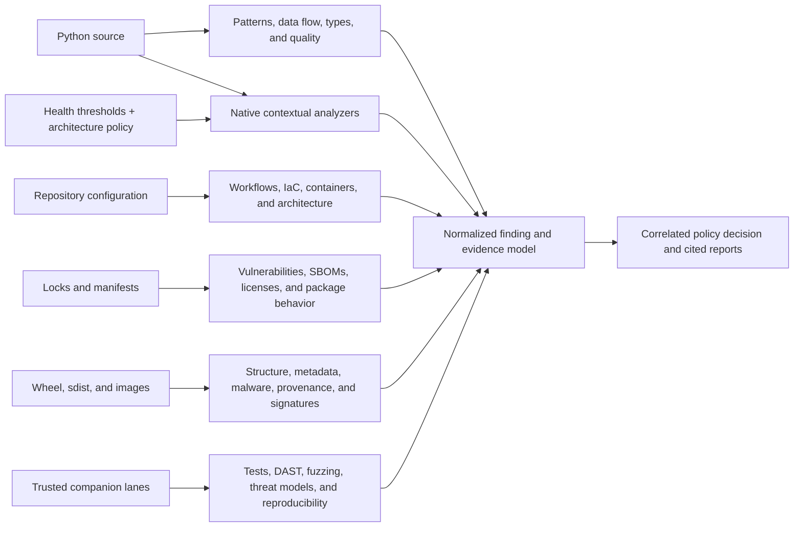

# Python Security Suite compatibility and coverage matrix

Last reviewed: 2026-08-26

See the [documentation index](index.md), [solution design](design.md), and
[operations guide](operations.md) for the surrounding architecture.

## Coverage model

The portfolio combines built-in scanner execution with bounded evidence
ingestion. Conditional controls remain visible as `not applicable`; relevant
controls that cannot run are reported as execution gaps.

## Meaning of support

`Adapter implemented` means the suite can construct an offline-oriented
command, normalize the documented output, attribute findings, and report tool
health. It does not mean every binary is shipped in the Windows standard
bundle. Enterprise approval, platform compatibility, licenses, local data, and
query or model bundles remain deployment responsibilities.

Conditional tools report `not applicable` when their input does not exist.

Every adapter uses the same execution-integrity contract: resolve an explicit
entry point, hash it before execution, compare an optional expected SHA-256,
and hash it again afterward. `production` and `release` require approved
digests for every applicable scanner. CodeQL additionally binds its CLI helper.
Repository-local expectations detect substitution but do not establish
organization authority; only organization policy or its bound catalog can do
that. For Python console scripts this authenticates the entry point, while the
approved bundle manifest and package inventory remain the evidence for the
imported runtime.

OSV and Grype additionally reject missing or older-than-policy database
markers. The default maximum is ten days and can only be adjusted through
`maximum_database_age_days`; Grype receives the same limit in its native
environment and validates the database's internal build timestamp rather than
its filesystem modification time.

Governed risk acceptances use exact finding fingerprints, optional finding-ID
binding, an approved ledger SHA-256, required owner/rationale, and an expiry no
more than 366 days away. Invalid, duplicate, expired, or unmatched entries fail
closed instead of hiding findings.

## Evidence and decision capabilities

| Capability | Offline execution | Input trust | Output/use |
|---|---|---|---|
| Security Passport | Yes for unsigned handoff and verification; Cosign 2 detached signing is offline; Cosign 3 bundle signing is an explicitly authorized connected approval action | Report checksums, applied-configuration digest, optional approved Cosign digest, signing configuration, and trusted public key | Portable in-toto/SLSA statement plus version-compatible signature material |
| CISA KEV enrichment | Yes | Bounded JSON, mandatory approved SHA-256, maximum age | Known exploitation classification, `P0`, blocking policy |
| FIRST EPSS enrichment | Yes | Bounded CSV/gzip, mandatory approved SHA-256, maximum age, numeric validation | Probability/percentile context and priority |
| CycloneDX VEX | Yes | Bounded CycloneDX JSON, mandatory approved SHA-256, maximum age, state validation | Product-context state without automatic suppression |
| Finding lifecycle | Yes | Bounded prior `findings.json` and mandatory approved SHA-256 | New, existing, regressed, and resolved evidence |
| Semantic and flow correlation | Yes | Exact semantic anchors, native ordered code-flow sinks, logical rule families, and source locations | Joins presentation-line differences while partitioning ambiguous or incompatible subjects and paths; never creates independent corroboration |
| Application contract analysis | Yes | Sealed Python routes, retained OpenAPI and optional baseline, declared endpoint/test obligations, exact advisory symbols, and source-bound test evidence | Route/auth/input drift, relative-import and class-wrapper vulnerable-call reachability, and auth/tenant/boundary/replay manifests with actors, oracles, consumers, subjects, and repeat semantics; manifests are not execution evidence |
| Configurable code health | Yes | Sealed Python AST plus optional strict `security/code-health-policy.json` | Policy-calibrated complexity, nesting, coupling, size, responsibilities, cohesion, swallowed exceptions, async blocking, mutable globals, exact duplicates, and semantic clones as review signals |
| Declared architecture policy | Yes | Local Python imports and calls, decorator entry points, dynamic imports, optional approved edge baseline, and strict `security/architecture-policy.json` | Exact high-confidence layer/forbidden-edge violations kept separate from syntactic symbol calls, unresolved dynamic-import gaps, cycles, fan-out, hubs, instability, co-change, and new-edge heuristics |
| CODEOWNERS routing | Yes | Repository-local bounded file | Owner metadata in reports and SARIF |
| Effectiveness summary | Yes | Current normalized findings, tool runs, primary/helper executable identities, trust approval, and continuity | Attribution, actionability, corroboration, tool contribution, and exact per-tool evidence posture consumed by risk routes; not a precision/recall or finding-truth claim |
| Labeled effectiveness benchmark | Yes | Verified report plus digest-bound corpus; production/release require schema 2.0, separate training/holdout identities, and lifecycle-valid signatures from two trusted organizations | TP/TN/FP/FN, precision, recall, specificity, F1, exact failed labels, and enforced CWE/language/parser/boundary/severity/mutation diversity |
| Operational domain scorecard | Yes | Applicable tool status, normalized findings, policy reasons, and executable identity | Separate A-F execution, observed-risk, and evidence grades across 12 domains; release disposition and N/A remain distinct |
| Conditional-control activation | Yes | Not-applicable reason and selected adapter identity | Owner, activation trigger, concrete action, required closure evidence, and tool reference |
| Scanner trust catalog | Yes | Organization-approved catalog bound by SHA-256, platform, role, version, source, approver, and expiry | Reusable executable approval with per-entry audit evidence and explicit-pin precedence |
| SSDF claims | Yes | Current manifest and generated evidence | Machine-readable claim-to-evidence status |
| External isolation receipt | Yes | Digest-bound, time-bounded evidence authorized in organization policy and tied to target/source digest | Separates structural validation, organization authorization, and the operator isolation assertion |
| Active isolation canaries | Yes | Actual scanner boundary with TCP/UDP IPv4/IPv6, host-interface, Unix/raw-socket, host IPC, process visibility, device namespace, proxy, target/link, and scratch probes | Unsupported or reachable channels remain incomplete; CI exercises default-deny Bubblewrap and Seatbelt plus a token-verified zero-capability Windows AppContainer and Job Objects |
| Immutable analysis snapshot | Yes | Exact regular-file path, size, and SHA-256 inventory copied race-safely to a private read-only tree; Git histories and nested submodule histories are bundled, and unresolved LFS pointers fail closed | Prevents mixed-version analyzer results and fails closed on snapshot or original-tree mutation |
| Derived artifact schemas | Yes | Closed filename registry plus artifact-specific bounded JSON Schema validation | Unknown or shape-invalid evidence cannot be sealed into a report |
| Intelligence approval receipt | Yes | Organization-policy-bound approval listing the exact KEV/EPSS/VEX digests consumed | Prevents an unapproved snapshot refresh from inheriting an earlier approval |
| Reachability regression gate | Yes | Two schema-1.1/1.2 graphs, each bound to an explicit SHA-256 | New disconnected code, new reportable islands, state regressions, and lost observations |
| Cross-tool evidence fusion | Yes | Normalized findings, tool status, source/artifact SBOMs, pipdeptree environment health, graph, reachability, coverage, bounded test-case ledgers, complexity, structural synthesis, CODEOWNERS, source inventory, artifact manifest, scanner fix records, and approved KEV/EPSS/VEX | Per-finding review reasons, semantic/cross-stage corroboration, package lineage drift, bounded introducing-root paths, digest agreement, compound hotspots, alias-aware advisory decisions with attributed fix candidates, exposure ownership/test execution/change-risk feedback, SDK-package disclosure-boundary joins, and evidence-lane gaps |
| Static risk-route synthesis | Yes | Reachability entry declarations, exact target-node runtime observations, Graphify file/reverse-test/import edges and file membership, normalized findings, exact contributing-scanner execution/trust posture, digest-approved finding lifecycle comparison, alias-aware dependency advisory/remediation clusters, source/artifact SBOM package lineage, sensitive-data findings and sink surfaces with SDK/package identity, structural islands/boundaries and change-risk synthesis, sealed source inventory, built-artifact manifest, file/diff coverage, bounded JUnit/Hypothesis/Schemathesis cases with producer-verified payload receipts, Vulture evidence, active findings in shared tests, and retained CODEOWNERS rules | Stable bounded multi-entry exposure matrices with per-interface runtime state; an end-to-end sensitive-data ledger separating scanner-confirmed flows from inventory-only review surfaces while joining data classes, boundary, protection, assurance, validation, lifecycle, and ownership; fail-closed finding/change attribution and package lifecycle; exact-path sensitive-boundary/advisory intersections; exact unrouted-target/island decisions for missing entry models, runtime conflicts, test-only scope, and dormant-capability review; shared controls and validation campaigns; shared-test quality; source-revision coherence; coordination queues; and explicit model gaps. Route applicability preserves native actions for artifact, generated-evidence, test, and non-Python controls. No static join implies production exposure, attacker control, runtime data flow, dead code, vulnerable-function invocation, exploitability, or leakage |
| Advanced cross-evidence analysis | Yes | Risk routes, Graphify file topology, declared entry roots, native SARIF `codeFlows`, wheel `entry_points.txt` and `RECORD`, artifact digests, pytm, mutmut, focused tests, sensitive-data routes, advisory intelligence, source/artifact package lineage, and scanner assurance | Typed evidence graph; mandatory and bypass-capable candidate controls; scanner-confirmed taint sequences; published activation parity; threat-control-test and security-mutation handoffs; telemetry privacy topology; dependency trust routes; and digest-bound cross-release regression decisions. Structural dominance is not control-effectiveness or exploitability proof |
| Advisory validation handoff | Yes | Exact Graphify import/reverse-test topology and import lines, retained file coverage, CODEOWNERS-derived finding ownership, bounded JUnit/Hypothesis/Schemathesis cases, alias-aware advisory clusters, and remediation context | Per-importer reachability/runtime, direct/transitive focused tests with confidence, exact current execution status, owners, low-coverage validation gaps, and one closure-plan item per distinct advisory while all scanner observations remain auditable; importer records remain isolated so aggregate evidence cannot mask a weaker path |
| Structural synthesis | Yes | Graphify node/file topology, reachability states and islands, Vulture, runtime and diff coverage, bounded case-level test execution, Radon, Tach, CODEOWNERS, and normalized findings | Dead-code disposition with counter-evidence, structural orphans, concrete island boundaries, test-only versus missing-root classification, import-cycle hotspots, change-risk scoring, direct/transitive test targets, exact execution status, and passing-test/coverage contradictions |
| Unified release readiness | Yes | Verified report plus optional digest-bound effectiveness and Passport verification receipts | Strict control-by-control `approved` or `not_approved` CI decision |

This is distinct from `unavailable`, which means relevant analysis could not be
performed.

## Portfolio

| Tool | Primary perspective | Isolation behavior | Profile placement | Adapter |
|---|---|---|---|---:|
| Bandit | Python AST security patterns | Local source only | quick, standard, all broader profiles | Yes |
| Semgrep CE | Organization-defined structural and taint rules, including credential fields, private fields, precise request collections, runtime/environment-state dumps, logs, telemetry, direct URL interpolation and query parameters, raw client errors, and risky SDK/configuration capture | Local immutable rules; generic configuration and Python analysis; metrics and version checks disabled | standard and broader | Yes |
| detect-secrets | Credential-shaped and high-entropy values | Online verification disabled; values never retained; findings join source/graph/artifact, lifecycle, ownership, and redaction provenance | quick, standard, broader | Yes |
| OSV-Scanner | Known vulnerable dependencies and advisory aliases | Local OSV snapshot, offline mode, no resolution; exit 1 is retained as findings-present success | standard and broader | Yes |
| CycloneDX Python | Reproducible Python SBOM evidence | Reads Poetry/Pipenv/pinned requirements directly; `uv.lock` uses hash-verified `uv export --frozen --offline` before CycloneDX conversion | extended and broader | Yes |
| Ruff `S` | Independent, fast Python security AST checks | `--isolated`, no cache, local source only | extended and broader | Yes |
| Ruff quality | Python correctness, bug, complexity, performance, and upgrade checks | Same Ruff binary; isolated and cacheless | quality, repo, comprehensive, release | Yes |
| Ruff formatter | Deterministic Python formatting | Same Ruff binary; check-only, isolated, cacheless | quality, repo, comprehensive, production, release | Yes |
| Pylint | Independent Python correctness, exception, logging, and design analysis | Suite policy; one worker; temporary source mirror | quality, repo, comprehensive, production, release | Yes |
| mypy | Static type-contract analysis | Suite-owned configuration; imports and site packages are not followed | quality, repo, comprehensive, release | Yes |
| Pyright | Independent type inference and contract analysis | Pinned Node runtime and staged JavaScript CLI; stable suite `basic` baseline over `src/` and `tests/` | quality, repo, comprehensive, production, release | Yes |
| deptry | Python dependency declaration correctness; unused/transitive signals join package advisories as non-exploitability use context | Local source and dependency metadata; JSON output written outside the target | quality, repo, comprehensive, production, release | Yes |
| Vulture | High-confidence unreachable and unused Python code | Reports only 100% confidence; generated roots excluded | quality, repo, comprehensive, release | Yes |
| Radon | Cyclomatic-complexity measurement | Local source; C+ retained as evidence and E/F normalized as findings | quality, repo, comprehensive, production, release | Yes |
| Tach | Declared Python module boundaries, dependency direction, cycles, and public interfaces | Reads local source and repository-owned `tach.toml`; no target imports or execution | quality, repo, comprehensive, production, release | Yes |
| Reachability | Three-state executable/load-only/disconnected topology, entry-point sequences, runtime corroboration, and ranked Python islands | Bundled bounded AST analysis; typed confidence-bearing edges; framework and polymorphic dispatch; optional bounded coverage.py JSON; explicit dynamic roots; no target imports or execution | quality, repo, comprehensive, production, release | Yes |
| Graphify | Code-property graph, symbol/file relationships, edge confidence, centrality, and impact neighborhoods | Dedicated `graphifyy` environment; `--code-only --no-cluster`; zero model tokens; AST origins and paths validated; no target imports or execution | quality, repo, comprehensive, production, release | Yes |
| Coverage evidence | Branch and statement test adequacy | Validates pre-generated coverage.py JSON; optional adjacent binding verifies its payload digest and declares the shared source-inventory digest; never runs tests | quality, repo, comprehensive, production, release | Yes |
| JUnit evidence | Automated test outcomes and exact selected-test execution | Validates bounded XML metadata; retains an output-free case/file/result ledger, drops output/failure bodies, and verifies an optional adjacent source-binding sidecar | quality, repo, comprehensive, production, release | Yes |
| pipdeptree | Installed dependency-environment integrity | Reads a local isolated environment and emits aggregate direct/transitive, missing, cyclic, and conflict evidence; does not provide the CycloneDX package path itself | repo, comprehensive, production, release | Yes |
| Hypothesis evidence | Property-based security invariants and minimized edge cases | Executes only in a disposable test lane; bounded producer-attributed JUnit ingestion | repo, comprehensive, production, release | Yes |
| Schemathesis evidence | OpenAPI/GraphQL negative, stateful, and schema-conformance testing | Exercises only a loopback test service in a companion lane; bounded JUnit ingestion | repo, comprehensive, production, release when a schema exists | Yes |
| diff-cover | Changed-line test adequacy | Reads local Git history and pre-generated Cobertura XML; does not execute tests | quality, repo, comprehensive, production, release | Yes |
| PSScriptAnalyzer | PowerShell security, correctness, compatibility, and maintainability | Pinned staged module, suite settings, reduced local environment | quality, repo, comprehensive, production, release | Yes |
| ShellCheck | Shell injection, expansion, data-loss, and portability checks | Checksum-pinned native binary; explicit local scripts | quality, repo, comprehensive, production, release | Yes |
| zizmor | GitHub Actions, composite-action, and Dependabot risks | Explicit `--offline`; SARIF output | extended and broader when GitHub files exist | Yes |
| actionlint | GitHub Actions syntax and semantic correctness | Explicit workflow files; ShellCheck and pyflakes subprocesses disabled | quality, repo, comprehensive, production, release | Yes |
| Hadolint | Dockerfile hardening and correctness | Explicit local Dockerfiles and suite-controlled policy | quality, repo, comprehensive, production, release | Yes |
| Pysa / Pyre | Interprocedural Python source-to-sink taint | Local code, configuration, models, and stubs | deep, comprehensive, and production | Yes |
| Trivy | IaC, deployment configuration, and license policy | Offline scan; DB, check, VEX, version, and telemetry updates disabled | supply-chain and comprehensive | Yes |
| Checkov | Graph-aware cloud, IaC, OpenAPI, and pipeline policies | Local policy bundle; remote enrichment and external-module downloads disabled | iac-deep, repo, comprehensive, production, release | Yes |
| GuardDog | Malicious Python package and source heuristics | Local target only; GuardDog's own sandbox remains enabled | supply-chain and comprehensive | Yes |
| ScanCode Toolkit | License, origin, and package-metadata inventory | Local rules and files; no target execution | supply-chain and comprehensive | Yes |
| REUSE | SPDX license and copyright metadata compliance | Local lint; explicit repository marker required | quality, repo, comprehensive, production, release | Yes |
| Gitleaks | Current-tree, archive, and Git-history secrets | Local Git or directory mode; 100% secret redaction; history and content-lane provenance retained without secret material | supply-chain and broader | Yes |
| TruffleHog | Independent credential detectors | Filesystem mode; verification and update checks disabled; raw values discarded; verification-disabled state remains explicit in provenance | supply-chain and broader | Yes |
| Microsoft DevSkim CLI | Security-sensitive implementation patterns across supported source formats | Scans a generated/tool-free temporary source mirror; SARIF output | repo, comprehensive, production, release | Yes |
| Flawfinder | C/C++ native-extension weakness patterns | Local staged source only; conditional on native source files | repo, comprehensive, production, release | Yes |
| CodeQL through `run-codeql` | Deep semantic and data-flow queries | Pre-staged local CLI and packs; auto-download rejected; temporary source mirror | deep, comprehensive, production, release | Yes |
| Syft | Final-distribution component SBOM | Local `dist` input; update checks disabled | artifact, comprehensive, release | Yes |
| Grype | Final-distribution vulnerabilities | Local `dist` input and staged database; auto-update disabled | artifact, comprehensive, release | Yes |
| check-wheel-contents | Wheel structure, inclusion mistakes, and maintained-source parity | Local wheels only; repository config disabled; package modules and `py.typed` are compared by SHA-256 | artifact, comprehensive, release | Yes |
| Twine | Distribution metadata and description validity | `twine check --strict`; no publication or index access | artifact, comprehensive, release | Yes |
| PyPI attestations | Distribution digest and Trusted Publisher provenance | Local distribution and provenance object; `--offline` verification | artifact, comprehensive, release | Yes |
| Cosign | Generic distribution signature, identity, digest, and transparency proof | Local artifact, Sigstore bundle, key/trusted root, and expected identity | artifact, comprehensive, release | Yes |
| OpenSSF Scorecard evidence | Repository-host security governance | Suite validates bounded pre-generated JSON; collection stays in a connected lane | governance, repo, comprehensive, production, release | Yes |
| Conftest / OPA | Organization policy as code for structured repository configuration | Approved local Rego only; no policy pulls | repo-health, iac-deep, quality and broader | Yes |
| KICS | Independent Checkmarx IaC security and compliance queries | Locally built executable plus matching local query assets; no descriptions download | repo-health, iac-deep, quality and broader | Yes |
| pipdeptree | Installed Python environment conflicts, cycles, depth, and license summary | Inspects only an explicitly configured target Python environment | repo-health, quality and broader | Yes |
| git-sizer | Git history and repository scaling hazards | Full local checkout only; JSON v2 | repo-health, quality and broader | Yes |
| validate-pyproject | PyPA metadata/schema correctness | Embedded schema with network explicitly disabled | repo-health, quality and broader | Yes |
| Vale | Documentation terminology, clarity, and organization style | Local configuration and style packages only | repo-health, quality and broader | Yes |
| KubeLinter | Kubernetes and Helm security/production-readiness policy | Local manifests only; applicability requires Kubernetes shape | repo-health, iac-deep, quality and broader | Yes |
| CrossHair evidence | Contract counterexamples from symbolic execution | Executes code only in a separate trusted lane; bounded JSON ingestion here | repo, comprehensive, production, release | Yes |
| Atheris evidence | Coverage-guided Python fuzz failures | Executes code only in a disposable fuzz lane; bounded JSON ingestion here | repo, comprehensive, production, release | Yes |
| mutmut evidence | Surviving mutations and test-suite sensitivity | Runs tests only in a separate trusted lane; bounded JSON ingestion here | repo, comprehensive, production, release | Yes |
| check-manifest evidence | Source-distribution completeness | Build backend runs only in a separate trusted packaging lane | artifact and broader | Yes |
| ClamAV evidence | Malware scanning of vendored/release bytes | Scanner and signed database run in a separate bounded artifact lane | artifact and broader | Yes |
| GitHub attestation evidence | Offline GitHub artifact-attestation verification | Verification bundle and trusted root are collected separately; bounded result ingestion | artifact and broader | Yes |
| OWASP ZAP evidence | Dynamic web vulnerability testing | Native Java automation runs against an isolated local service; bounded JSON ingestion | repo, comprehensive, production, release when applicable | Yes |
| Browser security evidence | Authenticated browser response, cookie, navigation, WebSocket proxying, runtime sink use, and egress assertions | Pinned Playwright browser against explicit loopback only; non-loopback requests blocked; page and credential content never retained; real Chromium CI qualification | runtime, repo, comprehensive, production, release when applicable | Yes |
| Authorization security evidence | Multi-role BOLA/IDOR, tenant, state-transition, replay, concurrency, and approval-limit contracts | Explicit loopback service; bearer tokens and request bodies are read from named environment variables and never retained; activates only when a project-owned contract exists | runtime and broader when configured | Yes |
| IAST evidence | Runtime-confirmed Python source-to-sink data flow | Optional `ddtrace` 4.x companion instrumentation and separately administered agent; only bounded exported findings are imported | runtime, repo, comprehensive, production, release when a Python web surface exists | Yes |
| ClusterFuzzLite evidence | Continuous change and scheduled coverage-guided fuzzing | Linux/Docker companion lane; crash corpus and reproducers remain outside bounded JSON | runtime, repo, comprehensive, production, release when configured | Yes |
| Falco evidence | Runtime host, container, and Kubernetes behavior | Native Linux runtime lane; bounded normalized alerts only | runtime, repo, comprehensive, production, release when container inputs exist | Yes |
| Kubescape evidence | Deployed Kubernetes posture and runtime threat detection | Read-only cluster/agent lane; bounded normalized findings only | runtime, repo, comprehensive, production, release when Kubernetes inputs exist | Yes |
| Nuclei evidence | Independent targeted DAST and technology-aware workflows | Signed local templates only; update and Interactsh disabled; raw request/response and encoded templates omitted | runtime and broader when a web surface exists | Yes |
| OAST evidence | Correlated DNS/HTTP/SMTP/LDAP callbacks | Self-hosted service and explicitly approved egress scope only; callback bodies and network payloads are rejected from normalized evidence | runtime and broader when a web surface exists | Yes |
| RESTler evidence | Stateful producer/consumer REST API sequence exploration | Disposable API target; only successfully replayed bug buckets and bounded execution coverage are accepted | runtime and broader when an OpenAPI surface exists | Yes |
| Protocol security evidence | gRPC, WebSocket, and TCP contract plus fault cases | Bundled producer permits loopback endpoints only and never retains environment-supplied request bytes | runtime and broader when `.proto` or a protocol contract exists | Yes |
| Fuzz Introspector evidence | Static reachability, dynamic coverage, corpus health, and blockers | Bounded summary only; fuzz corpora, crashes, and process output remain in the companion lane | runtime and broader when fuzz targets exist | Yes |
| Prowler evidence | Live cloud posture and declared-to-deployed drift | Read-only provider identity; account/project/region scope retained without credentials or raw resource objects | runtime and broader when cloud IaC exists | Yes |
| Cloud attack-path evidence | Public-entry to sensitive-asset paths across identity/network edges and IaC/live drift | Read-only bounded graph; raw node/resource identities are hashed and removed from findings | runtime and broader when cloud IaC exists | Yes |
| Secret-verification evidence | Provider-side active/revoked/invalid credential status | Authorized connected verifier; secret values, tokens, credentials, and request/response content are structurally rejected | runtime and broader when a verification policy exists | Yes |
| RASP evidence | Runtime exploit prevention effectiveness | Observe and block-mode canaries in a disposable lane; never changes production enforcement | runtime and broader when a web surface exists | Yes |
| Native sanitizer evidence | ASan, UBSan, libFuzzer, and binary hardening | Native-source projects only; reproducers and process output remain outside bounded evidence | runtime and broader when native source exists | Yes |
| MobSF evidence | Mobile static and emulator-backed dynamic security | Mobile projects only; application and emulator bytes stay in the companion lane | runtime and broader when mobile shape exists | Yes |
| TLS scan evidence | Certificate, protocol, and cipher behavior | Explicitly authorized ephemeral endpoint; bounded metadata only | runtime and broader when a web surface exists | Yes |
| Polyglot evidence | Language-specific semantic/data-flow packs | Native gosec, Cargo Audit, and npm Audit plus SARIF 2.1.0 from ESLint, SpotBugs, Detekt, Brakeman, and govulncheck; exact raw-report and normalizer provenance | runtime and broader when non-Python source exists | Yes |
| Surface inventory evidence | Declared, observed, retired, versioned, owned, and shadow API/service surfaces | Schema v3 binds independent organization, collector, signer, adapter, endpoint, query, freshness, and pagination-completeness evidence; opaque identities only | runtime and broader | Yes |
| Event security evidence | Producer/consumer authorization, transactional commit/abort, message signing, replay, idempotency, schema, dead-letter, and poison-message behavior | Native `aiokafka` driver forces TLS hostname verification, idempotent production, and read-committed consumption against an explicit loopback disposable broker; timeouts are inconclusive | runtime and broader when configured | Yes |
| Database security evidence | Least privilege, FORCE RLS, migration, query-boundary, restore, negotiated TLS, and audit behavior | Native Psycopg driver attests the negotiated TLS protocol/cipher, rejects superuser/BYPASSRLS/owner RLS oracles, and uses read-only canary transactions | runtime and broader when configured | Yes |
| Ruleset regression evidence | TP/TN, parser variants, false-positive budget, and mutation sensitivity | Exact corpus/ruleset digests, minimum samples, confidence level, point scores, and Wilson intervals are compared with the signed baseline | runtime and broader | Yes |
| AI security evidence | Prompt injection, tool authorization, agency, memory, output handling, and exfiltration | Repeated sanitized trials bind model/provider/prompt/dataset digests and enforce per-control sample sizes plus confidence-bounded failure policy | runtime and broader when configured | Yes |
| OWASP pytm evidence | Threat model, DFD, trust boundaries, and enumerated threats | Model executes in a design lane; reviewed threats are ingested | repo, comprehensive, production, release when a model exists | Yes |
| in-toto evidence | Authorized build steps, materials, products, and functionaries | Offline layout/link verification in the release lane | artifact, comprehensive, release | Yes |
| Reproducible-build evidence | Independent build equivalence and explained differences | `reprotest`/`diffoscope` execute in a build lane | artifact, comprehensive, release | Yes |
| OCI-image evidence | Final immutable image vulnerabilities, packages, configuration, and digest | Native Syft/Grype/Trivy scan a staged archive in a release lane; bounded JSON ingestion here | artifact, comprehensive, release | Yes |
| YARA evidence | Organization-specific malware and suspicious-content rules | Local versioned rules scan staged release bytes | artifact, comprehensive, release | Yes |

## Coverage comparison

Legend: **P** primary, **S** secondary, **E** evidence producer, **C**
conditional, and `-` not intended.

| Capability | Bandit | Semgrep | detect-secrets | OSV | CycloneDX | Ruff | zizmor | Pysa | Trivy | GuardDog | ScanCode | Gitleaks | TruffleHog | CodeQL |
|---|:---:|:---:|:---:|:---:|:---:|:---:|:---:|:---:|:---:|:---:|:---:|:---:|:---:|:---:|
| Python AST patterns | P | S | - | - | - | S | - | - | - | S | - | - | - | S |
| Custom enterprise rules | C | P | C | - | - | C | C | P | C | C | C | C | C | P |
| Cross-file data flow | - | C | - | - | - | - | - | P | - | - | - | - | - | P |
| Sensitive data to logs/telemetry | - | P | - | - | - | - | - | P | - | C | - | - | - | P |
| Working-tree secrets | S | C | P | - | - | S | - | - | - | - | - | P | P | C |
| Git-history secrets | - | - | - | - | - | - | - | - | - | - | - | P | C | - |
| Vulnerable dependencies | - | - | - | P | E | - | - | - | - | - | C | - | - | C |
| SBOM / component evidence | - | - | - | C | P | - | - | - | C | - | P | - | - | - |
| Malicious-package behavior | - | C | - | - | - | - | - | - | - | P | - | - | C | C |
| GitHub workflow security | - | C | - | - | - | - | P | - | C | - | - | - | - | C |
| IaC / deployment security | - | C | - | - | - | - | - | - | P | - | - | - | - | C |
| License governance | - | - | - | - | E | - | - | - | P | - | P | - | - | - |

Overlap is intentional, but correlated observations do not become multiple
risk votes. Ruff begins as an independent comparison perspective alongside
Bandit. Trivy is restricted to `misconfig,license` so it does not duplicate
OSV-Scanner and the dedicated secret scanners. TruffleHog adds detector
diversity but never verifies credentials over the network.

Artifact controls are intentionally conditional:

The added maturity layer is intentionally split between security and quality
domains so correctness debt is actionable without being misrepresented as a
confirmed vulnerability:

| Capability | Ruff quality/format | Pylint | mypy | Vulture | Radon | Tach | Coverage/JUnit | actionlint | Hadolint | REUSE | DevSkim | Flawfinder |
|---|:---:|:---:|:---:|:---:|:---:|:---:|:---:|:---:|:---:|:---:|:---:|:---:|
| Python correctness | P | P | S | S | - | - | E | - | - | - | S | - |
| Formatting consistency | P | C | - | - | - | - | - | - | - | - | - | - |
| Type contracts | - | C | P | - | - | - | E | - | - | - | - | - |
| Dead/unreachable code | C | C | - | P | - | - | E | - | - | - | - | - |
| Complexity hotspots | S | S | - | - | P | - | E | - | - | - | - | - |
| Architecture boundaries | - | - | - | - | - | P | - | - | - | - | - | - |
| Dependency cycles | - | - | - | - | - | P | - | - | - | - | - | - |
| Test outcomes/adequacy | - | - | - | - | - | - | P | - | - | - | - | - |
| Workflow correctness | - | - | - | - | - | - | - | P | - | - | C | - |
| Container hardening | - | - | - | - | - | - | - | - | P | - | C | - |
| File-level license metadata | - | - | - | - | - | - | - | - | - | P | - | - |
| Multi-language security patterns | - | - | - | - | - | - | - | - | - | - | P | - |
| Native extension security | - | - | - | - | - | - | - | - | - | - | S | P |

Reachability is kept separate from this already-wide comparison because its
output is graph evidence rather than another per-line linter:

| Capability | Reachability contribution | Complementary evidence |
|---|---|---|
| Entry-point discovery | Packaging scripts, Python mains, configured roots, and recognized framework decorators | Deployment review confirms externally or dynamically registered roots |
| Execution sequences | Representative direct-call, callback, framework, and bounded polymorphic-dispatch paths with edge confidence | Coverage and traces show paths observed in a disposable runtime lane |
| Dead/unreachable code | Executable, load-only, and disconnected states; constructor and concrete-receiver paths; framework configuration/registration; runtime corroboration; connected islands ranked by LOC with removal-readiness blockers and actions | Vulture supplies high-confidence individual unused symbols |
| Architecture | Actual static path topology and disconnected components | Tach enforces intended boundaries, layers, cycles, and public interfaces |
| Dynamic behavior | Detects dynamic loading, explains bounded dispatch inference, and correlates optional runtime coverage | Explicit roots and runtime tests cover reflection, injection, plugins, and generated code |

| Capability | Syft | Grype | Wheel contents | Twine | PyPI attestations |
|---|:---:|:---:|:---:|:---:|:---:|
| Final artifact inventory | P | S | E | E | E |
| Artifact vulnerabilities | C | P | - | - | - |
| Wheel structure/content and source parity | C | - | P | - | - |
| Publication metadata | - | - | C | P | - |
| Publisher identity and digest | - | - | - | - | P |
| Offline operation | P | P | P | P | P |

## Platform and acquisition compatibility

| Tool | Windows native | Linux native | macOS native | Acquisition notes |
|---|---:|---:|---:|---|
| Suite, Bandit, detect-secrets, CycloneDX, deptry, diff-cover | Yes | Yes | Yes | Approved Python wheelhouse; deptry benefits from target dependency metadata |
| Semgrep | Yes | Yes | Yes | Platform wheel or approved binary |
| OSV-Scanner | Yes | Yes | Yes | Release binary plus local advisory snapshot |
| Ruff | Yes | Yes | Yes | Platform wheel or standalone binary |
| Pylint, mypy, Vulture, Radon, Tach, Flawfinder | Yes | Yes | Yes | Approved Python wheelhouse |
| Pyright | Yes | Yes | Yes | Pinned Node.js runtime and staged npm package |
| PSScriptAnalyzer | Yes | Yes | Yes | Staged PowerShell module and a compatible PowerShell host |
| ShellCheck and Cosign | Yes | Yes | Yes | Checksum-pinned standalone binaries |
| Checkov | Yes | Yes | Yes | Separate Python sidecar environment; no platform service required |
| REUSE | Yes | Yes | Yes | Connected lane builds the pinned sdist into an approved wheel; runtime install is local-only |
| Coverage/JUnit evidence helper | Yes | Yes | Yes | Included with the suite; consumes reports produced by a separate test lane |
| Locked test-hardening group | Yes | Yes | Yes | Hypothesis JSON Schema generation, filesystem/subprocess/HTTP doubles, socket denial, time control, timeout, order randomization, and parallel pytest execution; test-only and resolved by `uv.lock` |
| actionlint and Hadolint | Yes | Yes | Yes | Checksum-pinned standalone binary |
| Microsoft DevSkim CLI | Yes | Yes | Yes | Local NuGet tool package and .NET 8 runtime |
| zizmor | Yes | Yes | Yes | Platform wheel or standalone binary |
| Pysa / Pyre | No supported native Windows workflow; use WSL | Yes | Yes | Python package plus organization models |
| Trivy | Yes | Yes | Yes | Standalone binary; optionally pre-stage cache/check assets |
| GuardDog 3.x | Upstream sandbox dependency limits native Windows | Yes | Yes | Python wheelhouse; scan only local inputs in the secure lane |
| ScanCode Toolkit | Yes with compatible Python/platform wheels | Yes | Yes | Separate sidecar environment, large wheel closure, and substantially longer runtime |
| Gitleaks | Yes | Yes | Yes | Standalone binary |
| TruffleHog | Yes | Yes | Yes | Standalone binary; verification is forcibly disabled |
| CodeQL through `run-codeql` | Yes | Yes | Yes | `run-codeql` wheel plus approved CodeQL bundle, local packs, isolated home, and applicable GitHub license |
| Syft and Grype | Yes | Yes | Yes | Standalone binaries; Grype additionally needs a staged vulnerability database |
| check-wheel-contents, Twine, PyPI attestations | Yes | Yes | Yes | Approved Python wheelhouse; provenance files, offline trust cache, and expected publisher identity are release inputs |
| OpenSSF Scorecard evidence | Yes | Yes | Yes | Ingestion is portable; evidence collection needs a separately authorized connected runner |
| Conftest, git-sizer, Vale, KubeLinter | Yes | Yes | Yes | Checksum-pinned Windows releases are included in the native bundle; approve equivalent native releases elsewhere |
| KICS | Source build | Source build | Source build | Upstream stopped publishing standalone release binaries; build the CLI and stage its matching assets/queries without Docker |
| pipdeptree, validate-pyproject | Yes | Yes | Yes | Approved Python wheelhouse; pipdeptree must point at the target runtime environment |
| Hypothesis and Schemathesis JUnit evidence | Yes | Yes | Yes | Ingestion is portable; the producer lane owns framework and service compatibility |
| CrossHair, Atheris, mutmut, ZAP, pytm, in-toto, reproducible-build, OCI-image, YARA, check-manifest evidence | Yes | Yes | Yes | Ingestion is portable; producer compatibility is owned by the isolated companion lane (mutmut, image, and reproducibility tooling require Linux/WSL) |
| ClamAV and GitHub attestation evidence | Yes | Yes | Yes | Ingestion is portable; verification runs with pre-staged databases, bundles, and trusted roots |

The Windows native bundle script now pins and downloads Bandit, Semgrep,
detect-secrets, Ruff, Pylint, mypy, Vulture, Radon, Tach, REUSE, Flawfinder, CycloneDX Python,
zizmor, deptry, diff-cover, Checkov, ScanCode, and the suite from
Python wheels, including `run-codeql`, check-wheel-contents, Twine, and
`pypi-attestations`. It also includes OSV-Scanner and its PyPI advisory
snapshot, Trivy, Gitleaks, Syft, Grype with a connected-lane database snapshot,
and TruffleHog. The licensed CodeQL CLI and packs, Pysa, and current GuardDog
still require separately approved assets or a compatible native runner. The
bundle also stages ShellCheck, Cosign, Node.js/Pyright, and PSScriptAnalyzer.

No Docker image is required for any suite adapter.

## Applicability

| Tool | Reported `not applicable` when |
|---|---|
| CycloneDX Python | No uv/Poetry/Pipenv lock or pinned requirements input exists |
| zizmor | No workflow, composite action, or Dependabot configuration exists |
| actionlint | No workflow exists under `.github/workflows` |
| Hadolint | No `Dockerfile` or `*.dockerfile` exists outside generated roots |
| Tach | No repository-owned `tach.toml` architecture contract exists |
| Coverage evidence | The configured pre-generated coverage JSON does not exist |
| JUnit evidence | The configured JUnit XML file/directory does not exist |
| diff-cover | Coverage XML or Git history is absent |
| PSScriptAnalyzer | No PowerShell source file exists |
| ShellCheck | No supported shell script exists |
| Checkov | No supported IaC, container, or pipeline input exists |
| OpenSSF Scorecard evidence | No pre-generated `scorecard.json` exists |
| Conftest | No approved local policy directory or supported structured input exists |
| KICS | No approved local query tree or supported IaC input exists |
| pipdeptree | No approved target Python interpreter is configured |
| git-sizer | The target is not a full Git checkout |
| validate-pyproject | No `pyproject.toml` exists |
| Vale | No approved local Vale configuration or supported documentation exists |
| KubeLinter | No Kubernetes-shaped YAML or Helm chart exists |
| Hypothesis | No evidence exists; for a Python target this remains applicable and fails closed |
| Schemathesis | No OpenAPI schema and no pre-generated Schemathesis JUnit exists |
| CrossHair, Atheris, mutmut, pytm | The corresponding pre-generated evidence is absent and no project-specific opt-in input exists |
| Authorization security | No project-owned authorization contract and no pre-generated evidence exists |
| Nuclei, OAST, RASP, TLS scan | No web application surface and no pre-generated evidence exists |
| RESTler | No OpenAPI surface and no pre-generated evidence exists |
| Protocol security | No `.proto` file, protocol contract, or pre-generated evidence exists |
| Fuzz Introspector | No fuzz-target declaration and no pre-generated evidence exists |
| Prowler, cloud attack paths | No cloud deployment/IaC shape and no pre-generated evidence exists |
| Secret verification | No verification policy and no pre-generated evidence exists |
| Native sanitizers | No native source and no pre-generated evidence exists |
| MobSF | No mobile application shape and no pre-generated evidence exists |
| Polyglot | No supported non-Python source and no pre-generated evidence exists |
| in-toto, reproducible-build, YARA | The corresponding release evidence is absent |
| check-manifest, ClamAV, GitHub attestation | The corresponding packaging/release evidence is absent |
| REUSE | No `REUSE.toml`, `.reuse/dep5`, or `LICENSES` opt-in marker exists |
| Flawfinder | No C or C++ source/header exists outside generated roots |
| Pysa | No Python source or repository Pyre/Pysa configuration exists |
| Trivy | No supported deployment, dependency, or license input exists |
| GuardDog | Native Windows is in use, or no Python source/package content exists |
| CodeQL | No Python source exists |
| Syft, Grype, Twine, PyPI attestations | No built wheel or source distribution exists under `artifacts_path` |
| check-wheel-contents | No built wheel exists under `artifacts_path` |
| Cosign | No built wheel or source distribution exists under `artifacts_path` |

Other selected tools are generally applicable to any non-empty Python
repository. A pre-staged CodeQL CLI, isolated home, and Python query pack are
prerequisites, not applicability tests. Missing approved assets make a required
deep scan `INCOMPLETE`; `run-codeql` is never permitted to download them.

## Report behavior

The orchestration layer also supplies offline, schema-versioned governance
contracts that complement scanner coverage:

| Capability | Command | Domain contribution | Authority |
|---|---|---|---|
| Unified release decision | `release-check` | Integrity, policy, claims, trust, isolation, intelligence, effectiveness, Passport | Decision support; admission remains external |
| Governance review handoff | `evidence-draft` | Exact scanner, snapshot, runner, source, and artifact digests | Candidate only |
| Promotion operating view | `promotion-plan` | Lifecycle, evidence quality, reliability, retention, digest-bound validation trajectory, ledger/assessment comparability, CODEOWNER queues, audiences, actions | Non-authoritative |
| Controlled-signing handoff | `prepare-signing` | Closed wheel/sdist/zip subject set bound to report and source | Candidate only; keys remain external |
| Signing-request receipt | `verify-signing-request` | Detects added, missing, and changed distributions | Integrity proof, not signer identity |
| Comparable lifecycle | scan baseline + `finding-delta.json` | New, unchanged, resolved, and unclassified findings | Requires same profile and scanner set |

- CycloneDX produces `sbom.cdx.json`.
- Syft safely expands wheels and source distributions into a bounded temporary
  tree, produces `artifact-sbom.cdx.json`, and produces
  `artifact-manifest.json` with the SHA-256 and size of every original
  distribution. Archive links, special files, path traversal, excessive
  member counts, and oversized expansion are rejected.
- Grype scans the same safely expanded artifact view against its staged local
  vulnerability database. Database age remains validated with a ten-day
  maximum to allow controlled air-gap transfer while failing stale bundles.
- ScanCode produces a compact `scancode-inventory.json`.
- Pylint produces `pylint-summary.json`; Radon produces full rank C+ evidence
  in `radon-complexity.json` while only extreme rank E/F blocks become findings.
- Coverage produces an overall threshold finding plus at most ten lowest-file
  hotspots and retains the complete validated report in `coverage-summary.json`.
  JUnit produces one normalized finding per failed/error test and retains only
  bounded metadata plus at most 100,000 output-free test case/file/result records
  in `junit-summary.json`.
- REUSE produces `reuse-compliance.json` when a repository explicitly opts in.
- deptry produces `deptry-dependencies.json`; diff-cover produces
  `diff-coverage.json`; and Checkov produces `checkov-iac.json`.
- KICS produces `kics-iac.json`; git-sizer produces `git-sizer.json`; and
  pipdeptree produces `pipdeptree-summary.json`.
- Checkov, git-sizer, and pipdeptree normalized artifacts retain a deterministic
  projection with every string value redacted, raw and redacted commitments,
  classification, and replay
  policy. When `PYSEC_RAW_EVIDENCE_DIRECTORY` and a digest-pinned KMS data-key
  command are configured, exact raw bytes are encrypted with AES-GCM in a content-addressed
  sidecar; per-object keys are derived with HKDF, object names use keyed HMACs,
  and a deployment-pinned KMS/storage custody receipt binds retention and key
  version. Otherwise the public artifact is explicitly non-replayable.
- `boundary-graph.json` parses Python notebook cells and WebAssembly imports,
  validates and inventories Python bytecode, reads PE/ELF/Mach-O imports, models
  template includes, and records reflection, plugin, entry-point, and dynamic
  import dispatch. Malformed, unsupported, or heuristic-only surfaces prevent
  complete or semantic-complete claims instead of disappearing from the denominator.
- `runtime-trace-correlation.json` accepts only deployment-pinned traces whose
  request-to-sink source and target match an exact retained static edge. It
  preserves authorization decisions, operations, sinks, and span counts without
  inferring execution from static reachability alone.
- Trusted-lane evidence produces a bounded `<tool>-summary.json` and never
  forwards raw crash logs, process output, artifact bytes, or malware samples.
- Every scan emits `sonarqube-external-issues.json` in addition to SARIF, so a
  self-hosted SonarQube instance can import the same normalized actions.
- ScanCode's aggregate role is bounded to package metadata, dependency locks,
  license/notice/readme files, and conventional vendored-source roots. It
  excludes generated/tool roots, scans a symlink-free staging directory with
  one local worker, caps per-file work at 120 seconds, and retains only files
  with findings. Use a separate full-tree ScanCode job when forensic
  copyright/origin due diligence is required.
- Gitleaks is invoked with full redaction, and the adapter discards `Secret`,
  `Match`, and source-line content. Its current-tree/history mode is retained in
  the bounded secret-provenance assessment.
- TruffleHog disables verification and updates, then discards `Raw`, `RawV2`,
  and all detected secret material. The suite reports verification as disabled,
  not as evidence that the credential is inactive.
- Secret findings from detect-secrets, Gitleaks, and TruffleHog are
  cross-referenced with source, Graphify, built-artifact, lifecycle, ownership,
  scanner-assurance, history, and redaction evidence. Test/generated context
  guides the review action but never suppresses or downgrades the finding.
- Production-source secret candidates are further joined to Semgrep/Pysa/CodeQL
  exposure findings and the sensitive-sink inventory only for exact-file or
  bounded Graphify-route membership. The resulting route intersection carries
  sink protection, temporal alignment, verification, assurance, validation,
  ownership, and citations, but is never represented as symbol-level taint or
  proof that a credential reached a log, telemetry SDK, URL, or network sink.
- Linked risk-route campaigns turn these intersections into an actionable
  validation handoff by combining Graphify-selected or route-mapped tests with
  exact retained JUnit execution, aggregate coverage, producer-verified source
  binding, scanner assurance, shared-test findings/quality, and CODEOWNERS gaps.
  The join fails closed and always distinguishes candidate tests from proof of an
  explicit synthetic credential-canary assertion.
- The secret/sink and sink/advisory ledgers are then joined only by identical
  retained sensitive-route identity. This adds a coordinated credential,
  boundary-protection, and dependency-remediation view with KEV/EPSS/fix,
  package-lifecycle, runtime, validation, assurance, ownership, and citations;
  it never infers disclosure, vulnerable-function execution, or exploitability.
- DevSkim excludes its generic token/key rule because checksum-pinned bundle
  assets create high-volume false positives and three dedicated secret
  scanners already cover that class. All other default rules remain enabled.
- PyPI attestations emits high-severity normalized findings for missing,
  invalid, digest-mismatched, or publisher-mismatched provenance.
- GuardDog code snippets are not retained.
- Native SARIF from zizmor and CodeQL is normalized into the suite's combined
  SARIF rather than copied verbatim.
- The CodeQL adapter does not use `run-codeql --no-fail`; exit code 1 is
  interpreted as findings only when exactly one expected Python SARIF exists.
  Missing SARIF remains a failed or parse-error analysis.
- Every finding preserves tool, version, native rule, native severity,
  priority, classifications, location, impact, remediation, and citations.
- `action-plan.md` provides a compact finding-remediation table and a separate
  coverage-restoration table with official tool references. Applicable
  execution gaps stay prominent; conditional not-applicable controls remain
  auditable in a collapsed informational section.
- `assurance-case.md` records which control areas were verified, partially
  covered, not applicable, or require external release evidence.

## Deliberately excluded as core scanners

| Tool | Reason |
|---|---|
| pip-audit | Overlaps OSV-Scanner and lacks the same first-class preloaded advisory snapshot model for this isolation contract |
| Safety | Offline commercial data and licensing would add a separate entitlement/update dependency while overlapping OSV |
| Dlint | Mostly overlaps Bandit and Ruff; unique-rule value should be demonstrated before another AST gate is added |
Dynamic tools are not core-process scanners: Hypothesis, Schemathesis, OWASP
ZAP, CrossHair, Atheris, and mutmut execute in disposable companion lanes, but
their bounded outputs now have first-class adapters and normalized reporting.

## Primary references

- [Bandit documentation](https://bandit.readthedocs.io/)
- [Semgrep documentation](https://semgrep.dev/docs/)
- [detect-secrets](https://github.com/Yelp/detect-secrets)
- [OSV-Scanner offline mode](https://google.github.io/osv-scanner/usage/offline-mode/)
- [CycloneDX Python](https://cyclonedx-bom-tool.readthedocs.io/en/stable/)
- [Ruff security rules](https://docs.astral.sh/ruff/rules/#flake8-bandit-s)
- [Ruff formatter](https://docs.astral.sh/ruff/formatter/)
- [Pylint JSON output](https://pylint.readthedocs.io/en/stable/user_guide/usage/output.html)
- [Radon command-line metrics](https://radon.readthedocs.io/en/stable/commandline.html)
- [Coverage.py reporting](https://coverage.readthedocs.io/en/latest/commands/cmd_reporting.html)
- [REUSE lint](https://reuse.readthedocs.io/en/stable/man/reuse-lint.html)
- [Tach architecture checks](https://docs.gauge.sh/usage/commands/#tach-check)
- [Tach configuration](https://docs.gauge.sh/usage/configuration/)
- [zizmor usage](https://docs.zizmor.sh/usage/)
- [Pysa](https://pyre-check.org/docs/pysa-basics/)
- [Trivy air-gap guidance](https://trivy.dev/docs/latest/guide/advanced/air-gap/)
- [Trivy March 2026 security advisory](https://github.com/aquasecurity/trivy/security/advisories/GHSA-69fq-xp46-6x23)
- [GuardDog](https://github.com/DataDog/guarddog)
- [ScanCode Toolkit](https://scancode-toolkit.readthedocs.io/en/latest/)
- [Gitleaks](https://github.com/gitleaks/gitleaks)
- [run-codeql](https://pypi.org/project/run-codeql/)
- [CodeQL CLI](https://docs.github.com/en/code-security/concepts/code-scanning/codeql/codeql-cli)
- [Syft](https://github.com/anchore/syft)
- [Grype](https://github.com/anchore/grype)
- [TruffleHog detector configuration](https://trufflesecurity.com/docs/customizing-detection)
- [check-wheel-contents](https://github.com/jwodder/check-wheel-contents)
- [Twine check](https://twine.readthedocs.io/en/stable/#twine-check)
- [PyPI digital attestations](https://docs.pypi.org/attestations/)
