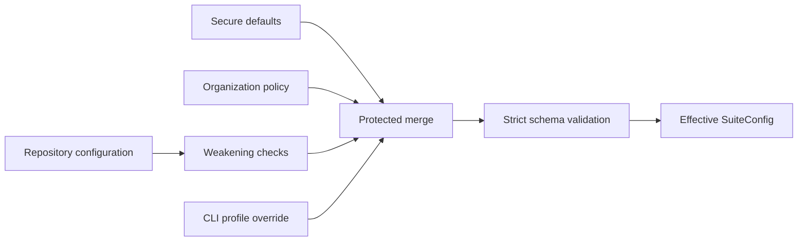

# Python Security Suite configuration

Last reviewed: 2026-08-06

## Loading and protection

Configuration is merged from secure defaults, an optional organization policy,
an optional repository configuration, and an optional CLI profile override.



Unknown sections, keys, tools, profiles, and invalid values are rejected.
Repository settings cannot weaken isolation or organization-required policy.

## Profiles

The original `quick` and `standard` contracts remain unchanged. New profiles
are opt-in so an existing enterprise gate does not unexpectedly require newly
introduced binaries.

| Profile | Selected tools |
|---|---|
| `quick` | Bandit, detect-secrets |
| `standard` | Bandit, Semgrep, detect-secrets, OSV-Scanner |
| `extended` | Standard plus CycloneDX Python, Ruff security rules, and zizmor |
| `deep` | Extended plus Pysa and CodeQL |
| `supply-chain` | Extended plus Trivy, GuardDog, ScanCode, Gitleaks, and TruffleHog |
| `artifact` | Syft, Grype, check-wheel-contents, Twine, PyPI attestations, Cosign, and passive check-manifest/ClamAV/GitHub-attestation evidence |
| `quality` | Existing correctness/structure/test tools plus Conftest, KICS, pipdeptree, git-sizer, validate-pyproject, Vale, and KubeLinter |
| `iac-deep` | Checkov, Trivy, Hadolint, actionlint, zizmor, Conftest, KICS, and KubeLinter |
| `governance` | Validated OpenSSF Scorecard evidence, REUSE, zizmor, and actionlint |
| `repo-health` | Conftest, KICS, pipdeptree, git-sizer, validate-pyproject, Vale, and KubeLinter |
| `repo` | Production source scanners plus the quality profile; excludes built-artifact controls |
| `comprehensive` | Every implemented offline/static or artifact adapter |
| `production` | Strict source-security set, including actionlint, Hadolint, DevSkim, Flawfinder, TruffleHog, and `run-codeql` |
| `release` | Comprehensive plus production completeness rules and a required built distribution |

If `policy.required_scanners` is empty, every selected and applicable tool is
required. A conditional tool with no matching input is reported as
`not applicable`; it does not make the scan incomplete. An applicable tool
that is unavailable, fails, times out, or cannot be parsed produces
`INCOMPLETE`.

The `production` profile additionally:

- blocks `medium`, `high`, and `critical` findings even if repository
  configuration lists only high and critical;
- requires an organization-approved `executable_sha256` for every applicable
  scanner and verifies the resolved entry point again after execution;
- requires a separate `auxiliary_executable_sha256` for the CodeQL CLI;
- requires a full VCS checkout for source-history and provenance evidence;
- requires a recognized lock file, CycloneDX evidence, and GuardDog coverage
  when dependencies are declared; and
- requires Pysa to be configured and applicable when Python source exists.

These checks are completeness requirements. A missing prerequisite yields
`INCOMPLETE`, never `PASS`.

The `release` profile applies the same strict policy and additionally requires
at least one wheel or source distribution. Artifact scanners remain
conditional in other profiles so source-only development scans do not claim or
require release evidence.

## Supported tool identifiers

| Identifier | Default executable | Optional local asset |
|---|---|---|
| `bandit` | `bandit` | None |
| `semgrep` | `semgrep` | `rules_path` |
| `detect-secrets` | `detect-secrets` | None |
| `osv-scanner` | `osv-scanner` | `database_path` |
| `cyclonedx-py` | `cyclonedx-py` | None |
| `ruff` | `ruff` | None |
| `ruff-quality` | `ruff` | None; correctness, bug, complexity, performance, and upgrade rules |
| `ruff-format` | `ruff` | None; deterministic formatter check |
| `pylint` | `pylint` | Suite-controlled `rules_path` |
| `mypy` | `mypy` | `rules_path` |
| `pyright` | `node` | Staged Pyright `index.js` in `database_path`; suite baseline in `rules_path` |
| `deptry` | `deptry` | Prepared dependency-analysis environment |
| `vulture` | `vulture` | `rules_path` |
| `radon` | `radon` | Rank C+ complexity evidence; rank E/F findings |
| `tach` | `tach` | Repository-root `tach.toml`; conditional when absent |
| `coverage` | `pysec-evidence` | Pre-generated coverage.py JSON at `artifacts_path` |
| `junit` | `pysec-evidence` | Pre-generated JUnit XML file or directory at `artifacts_path` |
| `diff-cover` | `diff-cover` | Cobertura `coverage.xml`, Git history, `compare_branch`, and threshold |
| `psscriptanalyzer` | `powershell.exe` | Suite settings in `rules_path`; staged module directory in `database_path` |
| `shellcheck` | `shellcheck` | Conditional on shell scripts |
| `zizmor` | `zizmor` | None |
| `actionlint` | `actionlint` | `rules_path`; conditional on `.github/workflows` |
| `hadolint` | `hadolint` | `rules_path`; conditional on Dockerfiles |
| `pysa` | `pyre` | Repository `.pyre_configuration` and taint models |
| `trivy` | `trivy` | Optional `database_path` cache |
| `checkov` | `checkov` | Local policies only; downloads forcibly disabled |
| `guarddog` | `guarddog` | None; scan input must be local |
| `scancode` | `scancode` | None |
| `reuse` | `reuse` | Conditional on `REUSE.toml`, `.reuse/dep5`, or `LICENSES` |
| `gitleaks` | `gitleaks` | None |
| `trufflehog` | `trufflehog` | None |
| `devskim` | `devskim` | Optional `rules_path`; maintained-source mirror |
| `flawfinder` | `flawfinder` | None; conditional on C/C++ sources |
| `codeql` | `run-codeql` | `auxiliary_executable` CodeQL CLI and `database_path` isolated home with local packs |
| `syft` | `syft` | `artifacts_path` |
| `grype` | `grype` | `artifacts_path` and required offline `database_path` |
| `check-wheel-contents` | `check-wheel-contents` | `artifacts_path` |
| `twine` | `twine` | `artifacts_path` |
| `pypi-attestations` | `pypi-attestations` | `artifacts_path`, `provenance_path`, offline trust `database_path`, and `repository_url` |
| `cosign` | `cosign` | Artifact bundles plus a public key, or trusted root and expected certificate identity/issuer |
| `scorecard` | `pysec-evidence` | Pre-generated Scorecard JSON from a connected governance lane |
| `conftest` | `conftest` | Approved local Rego directory in `rules_path` |
| `kics` | `kics` | Matching local KICS query tree in `rules_path` |
| `pipdeptree` | `pipdeptree` | Approved target Python in `auxiliary_executable` |
| `git-sizer` | `git-sizer` | Full local Git checkout |
| `validate-pyproject` | `validate-pyproject` | Embedded local schema; network disabled |
| `vale` | `vale` | Approved local `.vale.ini` in `rules_path` |
| `kube-linter` | `kube-linter` | Kubernetes YAML or Helm chart |
| `hypothesis`, `schemathesis` | `pysec-evidence` | Bounded pre-generated JUnit XML at `artifacts_path` |
| `crosshair`, `atheris`, `mutmut`, `zap`, `pytm` | `pysec-evidence` | Bounded pre-generated JSON at `artifacts_path` |
| `in-toto`, `reproducible-build`, `oci-image`, `yara` | `pysec-evidence` | Bounded release-assurance JSON at `artifacts_path` |
| `check-manifest`, `clamav`, `github-attestation` | `pysec-evidence` | Bounded pre-generated packaging/release JSON at `artifacts_path` |

Each `[tools.NAME]` table supports:

```toml
enabled = true
executable = "tool-name-or-approved-absolute-path"
executable_sha256 = "64-lowercase-or-uppercase-hexadecimal-characters"
timeout_seconds = 300
rules_path = "optional/local/rules"
database_path = "optional/local/database-or-cache"
artifacts_path = "optional/local/distribution-directory"
provenance_path = "optional/local-provenance-directory"
auxiliary_executable = "optional-required-helper-executable"
auxiliary_executable_sha256 = "optional-helper-sha256"
repository_url = "optional-expected-publisher-repository"
minimum_coverage_percent = 80.0
maximum_database_age_days = 10
compare_branch = "origin/main"
public_key_path = "optional/local/cosign-public-key"
certificate_identity = "optional-expected-signing-identity"
certificate_oidc_issuer = "optional-expected-oidc-issuer"
```

Only use keys meaningful to that adapter. Relative asset paths are resolved
against the scan target. See [`pysec.example.toml`](../pysec.example.toml) for
a complete configuration containing all implemented tools.

`executable_sha256` binds the exact resolved executable or console-script
entry point. It does not by itself authenticate the publisher or hash every
file imported by a Python entry point. Approve the connected-lane bundle,
retain its manifest and package lock evidence, and transfer it through the
enterprise artifact trust process. The native installer calculates these
entry-point digests and writes them to `pysec.native.toml`.

## Core schema

```toml
schema_version = "1"
profile = "standard"

[isolation]
network = "deny"
require_attestation = true
execute_target_code = false

[execution]
max_workers = 4
max_output_bytes = 16777216

[policy]
# Derive required scanners from the selected profile.
required_scanners = []
block_severities = ["critical", "high"]
incomplete_is_blocking = true
# Optional governed, expiring finding dispositions.
# risk_acceptance_path = "security/risk-acceptances.json"
# risk_acceptance_sha256 = "<approved-ledger-sha256>"

[reports]
include_sanitized_evidence = true
# baseline_path = "security-data/previous/findings.json"
# baseline_sha256 = "<approved-sha256>"

[intelligence]
# kev_path = "security-data/intelligence/kev.json"
# kev_sha256 = "<approved-sha256>"
# epss_path = "security-data/intelligence/epss.csv.gz"
# epss_sha256 = "<approved-sha256>"
# vex_path = "security-data/intelligence/product-vex.cdx.json"
# vex_sha256 = "<approved-sha256>"
maximum_age_days = 3
epss_high_probability = 0.10
epss_high_percentile = 0.90
```

`baseline_path` accepts only a bounded regular `findings.json` with schema
version `1.0`. Its approved digest is mandatory. Exact fingerprints are matched
first; a unique tool/rule/path/title match preserves lifecycle across line
movement. Findings absent from the new scan are retained only in
`finding-delta.json` as resolved evidence.

Each configured intelligence path must have its corresponding SHA-256. The
suite validates regular-file type, byte and record limits, digest, maximum age,
and native schema before enrichment. Invalid configured evidence makes the scan
`INCOMPLETE`. VEX never suppresses a finding automatically; a not-affected
decision still requires the governed risk-acceptance workflow.

## Constraints

| Setting | Constraint |
|---|---|
| `schema_version` | Must be `"1"` |
| `profile` | One of the fourteen documented profiles |
| `isolation.network` | Must be `"deny"` |
| `isolation.execute_target_code` | Must be `false` |
| `execution.max_workers` | 1 through 16 |
| `execution.max_output_bytes` | At least 1024 |
| `policy.block_severities` | Valid normalized severity values |
| Tool timeout | Positive integer seconds |
| Tool executable digest | Exactly 64 hexadecimal characters when supplied |
| `minimum_coverage_percent` | Numeric value from 0 through 100 |
| `maximum_database_age_days` | Numeric value from 0.1 through 3650; enforced for staged OSV and Grype databases |
| `policy.risk_acceptance_sha256` | Exactly 64 hexadecimal characters when supplied |

Supported severities are `critical`, `high`, `medium`, `low`,
`informational`, and `unknown`.

## Protected organization policy

A repository cannot:

- change organization-required `network = "deny"`;
- enable target code execution;
- disable organization-required isolation attestation;
- remove an organization-required scanner;
- replace an organization-approved scanner or helper digest;
- lower an organization-owned minimum coverage threshold;
- remove an organization blocking severity; or
- replace an organization-approved risk-acceptance ledger digest;
- make organization-blocking incomplete scans non-blocking.

Required applicable scanners cannot be disabled.

## CLI reference

```text
pysec scan TARGET --output REPORT [options]
pysec doctor TARGET [--config PATH] [--policy PATH] [--profile NAME]
pysec inspect REPORT [--limit 0-100] [--format text|json]
  [--output FILE] [--overwrite]
pysec verify-inspection INSPECTION --report REPORT [--limit 0-100]
  [--format text|json] [--output FILE] [--overwrite]
pysec schema {report-inspection-1.0|report-inspection-1.1|report-inspection-1.2|report-inspection-1.3|report-inspection-verification-1.0|report-inspection-verification-1.1|report-inspection-verification-1.2|report-inspection-verification-1.3|report-verification-1.0}
  [--output FILE] [--overwrite]
pysec verify-report REPORT [--format text|json] [--output FILE] [--overwrite]
pysec attest REPORT --output PASSPORT (--signing-key KEY | --unsigned)
pysec verify PASSPORT [--report REPORT] [verification options]
pysec list-tools [--profile NAME] [--format text|json]
pysec --version
```

`doctor` performs a non-executing prerequisite assessment and exits `0` when
all applicable required tools and governed context files are ready, `2` when
readiness is incomplete, and `3` for invalid invocation or configuration. Its
JSON form is stable automation input. The structured `decision` distinguishes a
preflight `proceed` from `block`, lists required-tool and governed-context
blocking reasons, and always sets `release_approval` to false. `summary`
separates selected, applicable, required-ready, not-applicable, and
attention-needed counts; `optional_attention_tools` remains visible without
blocking the run. Doctor does not run scanner version commands, execute target
code, attest network isolation, or predict the policy outcome of the eventual
scan.

`inspect` verifies the report checksum chain before reading normalized JSON.
Its JSON form retains `policy_reasons` for compatibility and adds structured
`scan_policy`, applicability-aware `tool_health`, integrity status, and cited
`top_actions`. A skipped scanner only counts as not applicable when its
manifest record explicitly has `applicable: false`; otherwise it is an
execution gap.
When `--output FILE` is present, the same rendered document is atomically
published to a regular file and still emitted on standard output. The file must
be outside `REPORT`, because adding any undeclared file to that sealed directory
correctly invalidates its exact checksum set. Existing output is preserved
unless `--overwrite` is explicit, and symbolic-link or junction components are
rejected before publication. JSON `entrypoints` and `top_actions[].details`
references are relative to the report directory for portable artifact use;
interactive text rendering resolves them against the locally supplied report.

`verify-inspection` treats the sidecar as untrusted bounded input, rejects
duplicate JSON keys, verifies the
report checksum chain, recomputes the inspection using the caller's expected
action limit, and requires exact parsed-document equality. The default is five;
use the same explicit `--limit` for export and verification. This prevents an
untrusted sidecar from suppressing actions and choosing its own comparison
depth. The success record binds
the inspection SHA-256, report checksum-manifest SHA-256, scan ID, schema ID,
and verified action count. It does not establish publisher identity or release
approval; those remain Security Passport responsibilities.
`--output FILE` requires `--format json` and atomically publishes a receipt
outside the sealed report; replacement requires explicit `--overwrite`. The
receipt is governed by the bundled
[verification schema](../src/py_security_suite/schemas/report-inspection-verification-1.3.schema.json).

`schema` retrieves an exact contract from the installed distribution without
network access or source-checkout knowledge. It always emits the schema on
standard output and optionally publishes the same bytes plus one trailing
newline atomically to `--output`. The destination must be a regular, unlinked
path; existing content is retained unless `--overwrite` is explicit, and
`--overwrite` without `--output` is rejected. Versioned names intentionally
avoid implicit upgrades:

| CLI name | Required `$id` |
|---|---|
| `report-inspection-1.0` | `urn:project-py-security-suite:schema:report-inspection:1.0` |
| `report-inspection-1.1` | `urn:project-py-security-suite:schema:report-inspection:1.1` |
| `report-inspection-1.2` | `urn:project-py-security-suite:schema:report-inspection:1.2` |
| `report-inspection-1.3` | `urn:project-py-security-suite:schema:report-inspection:1.3` |
| `report-inspection-verification-1.0` | `urn:project-py-security-suite:schema:report-inspection-verification:1.0` |
| `report-inspection-verification-1.1` | `urn:project-py-security-suite:schema:report-inspection-verification:1.1` |
| `report-inspection-verification-1.2` | `urn:project-py-security-suite:schema:report-inspection-verification:1.2` |
| `report-inspection-verification-1.3` | `urn:project-py-security-suite:schema:report-inspection-verification:1.3` |
| `report-verification-1.0` | `urn:project-py-security-suite:schema:report-verification:1.0` |

`verify-report` validates the complete `checksums.sha256` chain, the scan
manifest, every canonical report artifact, and their exact manifest bindings.
A checksum-consistent partial report is rejected. Every additional declared
artifact must also resolve to one unique, present file or explicitly marked
directory inside the report. The embedded Security Passport must be a valid
in-toto/SLSA statement, cover the exact report input set, and agree with the
manifest's scan identity, source, policy, result, findings, and scanner health.
Its exact source and distribution subject set must also agree with the validated
`artifact-manifest.json`; missing, duplicate, invented, or altered subjects are
rejected.
With `--format json`, success is a self-identifying
`report-verification:1.0` receipt containing the verified file count, checksum-
manifest digest, scan ID, and outcome. `--output FILE` requires JSON format,
publishes atomically outside the sealed report, rejects linked paths, and
preserves an existing receipt unless `--overwrite` is explicit. This receipt
proves consistency of the supplied bytes; it is not signer authentication or a
release-approval decision.
`verify` accepts a detached passport **directory** created by `attest`, not the
embedded `security-passport.json` statement file. When the Passport declares
distribution subjects, `verify --artifact-root ROOT` must resolve and hash each
subject path beneath `ROOT`; omission blocks approval. Direct distribution files
in every governed subject directory must exactly match the Passport set, so an
undeclared wheel, sdist, or zip cannot ride with an approved payload. Direct
directory entries and mismatch details are capped during this untrusted-input
check.
When `--report` is supplied, its embedded statement must be exactly the same
JSON statement as the detached Passport; transport metadata cannot redirect a
valid signature to a report carrying different claims.

`inspect` performs the same integrity verification, then presents a bounded
operational summary of outcome, scanner health, severity, domains, lifecycle,
ownership, policy reasons, and prioritized actions. Its JSON output is suitable
for release dashboards and downstream policy automation. The additive
`entrypoint_integrity` object separates observed entry points, approved-and-
unchanged entry points, unchanged post-checks, and post-check gaps. Its
`approval_gap_entrypoints` and `postcheck_gap_entrypoints` arrays retain the
complete primary/helper names for automation. The `actions` array provides each
gap's `entrypoint`, `tool`, `role`, exact `sha256`, `priority`, approval and
post-check states, candidate flag, optional dotted `configuration_key`, and
stable `required_actions` codes. `approval_candidate_entrypoints` and
`approval_candidate_unique_digests` separate policy-binding work from the
number of distinct executable payloads requiring provenance review.

The remediation codes are `quarantine_changed_toolchain`,
`restore_post_execution_verification`, `verify_provenance_before_approval`, and
`approve_exact_digest`. Consumers should process actions in emitted P0, P1, P2
order and must not interpret `approval_candidate: true` as approval.

The complete inspection document is governed by the bundled
[Draft 2020-12 schema](../src/py_security_suite/schemas/report-inspection-1.3.schema.json).
Output sets
`schema_id` to `urn:project-py-security-suite:schema:report-inspection:1.3` so an
isolated consumer can select its locally approved schema without dereferencing
a network URL. Version `1.1` adds the required-but-nullable
`top_actions[].artifact_identity` object. When a finding addresses a governed
artifact, that object carries its safe relative path, SHA-256, and byte size;
terminal inspection includes the digest and size in its evidence line. Version
`1.2` adds required priority, blocking, confidence, area, description, and impact
fields to every top action, aligning automation with the human action plan.
Version `1.3` adds a required `action_summary` with the requested limit and
available, returned, omitted, and truncated values. Its verification receipt
binds the same summary, preventing a bounded view from silently appearing
complete. Versions `1.0` through `1.2` remain frozen and exportable for
compatibility. Future additive changes require a minor version and incompatible
changes require a major version, with a matching URN and schema artifact.

All finding views share one deterministic order: derived P0-P4 priority,
blocking state, active lifecycle (`new` or `regression`), native severity, then
finding ID. Known-exploited evidence promotes a finding to P0, while
`EPSS-HIGH` promotes critical, high, or medium findings to P1. This prevents a
lower native severity with stronger exploitation evidence from being buried.

The Markdown action plan orders changed entry points before missing post-checks
and approval-only gaps. It also emits a collapsed TOML candidate block for
entry points that were observed unchanged but lack an approved digest. The
block is deliberately not an approval record: independently verify provenance,
version, and custody before copying any candidate into organization policy.

Machine-readable commands use this failure shape on standard error and exit
with code `3` for configuration, I/O, or validation failures:

```json
{
  "command": "verify",
  "error": {"code": "validation_error", "message": "bounded detail"},
  "schema_version": "1.0",
  "status": "error"
}
```

The stable error codes are `configuration_error`, `io_error`, and
`validation_error`. Messages are redacted, terminal-control safe, and bounded.

| Option | Purpose |
|---|---|
| `--config PATH` | Repository TOML configuration |
| `--policy PATH` | Organization TOML policy |
| `--profile NAME` | Override the selected profile |
| `--network-isolated` | Attest an existing external egress-denied boundary |
| `--diagnostic-without-isolation` | Run offline-configured tools without attestation and force `INCOMPLETE` |
| `--overwrite` | Replace an existing marked suite report |
| `--github-summary` | Append `summary.md` to `GITHUB_STEP_SUMMARY` |

## Outcome and exit-code reference

| Outcome | Exit | Condition |
|---|---:|---|
| `PASS` | 0 | All applicable required tools completed and no findings remain |
| `WARN` | 0 | All applicable required tools completed and findings are non-blocking |
| `FAIL` | 1 | A finding meets a configured blocking severity |
| `INCOMPLETE` | 2 | Required isolation or applicable tool evidence is incomplete |
| CLI error | 3 | Invocation, configuration, or safe-output validation failed |

Completeness is evaluated before severity. An unavailable applicable scanner
cannot be masked by an otherwise empty finding set.
