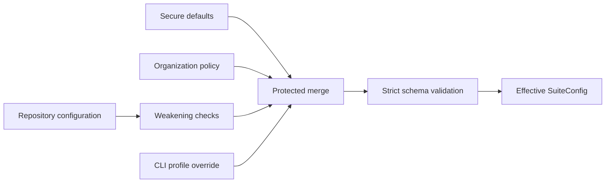

# Python Security Suite configuration

Last reviewed: 2026-07-23

## Loading and protection

Configuration is merged from secure defaults, an optional organization policy,
an optional repository configuration, and an optional CLI profile override.



Unknown sections, keys, tools, profiles, and invalid values are rejected.
Repository settings cannot weaken isolation or organization-required policy.

## Profiles

The original `quick` and `standard` contracts remain unchanged. New profiles
are opt-in so an existing enterprise gate does not unexpectedly require newly
introduced binaries.

| Profile | Selected tools |
|---|---|
| `quick` | Bandit, detect-secrets |
| `standard` | Bandit, Semgrep, detect-secrets, OSV-Scanner |
| `extended` | Standard plus CycloneDX Python, Ruff security rules, and zizmor |
| `deep` | Extended plus Pysa and CodeQL |
| `supply-chain` | Extended plus Trivy, GuardDog, ScanCode, Gitleaks, and TruffleHog |
| `artifact` | Syft, Grype, check-wheel-contents, Twine, and PyPI attestations |
| `comprehensive` | Every implemented offline/static or artifact adapter |
| `production` | Strict source-security set, including TruffleHog and `run-codeql` |
| `release` | Comprehensive plus production completeness rules and a required built distribution |

If `policy.required_scanners` is empty, every selected and applicable tool is
required. A conditional tool with no matching input is reported as
`not applicable`; it does not make the scan incomplete. An applicable tool
that is unavailable, fails, times out, or cannot be parsed produces
`INCOMPLETE`.

The `production` profile additionally:

- blocks `medium`, `high`, and `critical` findings even if repository
  configuration lists only high and critical;
- requires a full VCS checkout for source-history and provenance evidence;
- requires a recognized lock file, CycloneDX evidence, and GuardDog coverage
  when dependencies are declared; and
- requires Pysa to be configured and applicable when Python source exists.

These checks are completeness requirements. A missing prerequisite yields
`INCOMPLETE`, never `PASS`.

The `release` profile applies the same strict policy and additionally requires
at least one wheel or source distribution. Artifact scanners remain
conditional in other profiles so source-only development scans do not claim or
require release evidence.

## Supported tool identifiers

| Identifier | Default executable | Optional local asset |
|---|---|---|
| `bandit` | `bandit` | None |
| `semgrep` | `semgrep` | `rules_path` |
| `detect-secrets` | `detect-secrets` | None |
| `osv-scanner` | `osv-scanner` | `database_path` |
| `cyclonedx-py` | `cyclonedx-py` | None |
| `ruff` | `ruff` | None |
| `zizmor` | `zizmor` | None |
| `pysa` | `pyre` | Repository `.pyre_configuration` and taint models |
| `trivy` | `trivy` | Optional `database_path` cache |
| `guarddog` | `guarddog` | None; scan input must be local |
| `scancode` | `scancode` | None |
| `gitleaks` | `gitleaks` | None |
| `trufflehog` | `trufflehog` | None |
| `codeql` | `run-codeql` | `auxiliary_executable` CodeQL CLI and `database_path` isolated home with local packs |
| `syft` | `syft` | `artifacts_path` |
| `grype` | `grype` | `artifacts_path` and required offline `database_path` |
| `check-wheel-contents` | `check-wheel-contents` | `artifacts_path` |
| `twine` | `twine` | `artifacts_path` |
| `pypi-attestations` | `pypi-attestations` | `artifacts_path`, `provenance_path`, offline trust `database_path`, and `repository_url` |

Each `[tools.NAME]` table supports:

```toml
enabled = true
executable = "tool-name-or-approved-absolute-path"
timeout_seconds = 300
rules_path = "optional/local/rules"
database_path = "optional/local/database-or-cache"
artifacts_path = "optional/local/distribution-directory"
provenance_path = "optional/local-provenance-directory"
auxiliary_executable = "optional-required-helper-executable"
repository_url = "optional-expected-publisher-repository"
```

Only use keys meaningful to that adapter. Relative asset paths are resolved
against the scan target. See [`pysec.example.toml`](../pysec.example.toml) for
a complete configuration containing all implemented tools.

## Core schema

```toml
schema_version = "1"
profile = "standard"

[isolation]
network = "deny"
require_attestation = true
execute_target_code = false

[execution]
max_workers = 4
max_output_bytes = 16777216

[policy]
# Derive required scanners from the selected profile.
required_scanners = []
block_severities = ["critical", "high"]
incomplete_is_blocking = true

[reports]
include_sanitized_evidence = true
```

## Constraints

| Setting | Constraint |
|---|---|
| `schema_version` | Must be `"1"` |
| `profile` | One of the nine documented profiles |
| `isolation.network` | Must be `"deny"` |
| `isolation.execute_target_code` | Must be `false` |
| `execution.max_workers` | 1 through 16 |
| `execution.max_output_bytes` | At least 1024 |
| `policy.block_severities` | Valid normalized severity values |
| Tool timeout | Positive integer seconds |

Supported severities are `critical`, `high`, `medium`, `low`,
`informational`, and `unknown`.

## Protected organization policy

A repository cannot:

- change organization-required `network = "deny"`;
- enable target code execution;
- disable organization-required isolation attestation;
- remove an organization-required scanner;
- remove an organization blocking severity; or
- make organization-blocking incomplete scans non-blocking.

Required applicable scanners cannot be disabled.

## CLI reference

```text
pysec scan TARGET --output REPORT [options]
pysec list-tools
pysec --version
```

| Option | Purpose |
|---|---|
| `--config PATH` | Repository TOML configuration |
| `--policy PATH` | Organization TOML policy |
| `--profile NAME` | Override the selected profile |
| `--network-isolated` | Attest an existing external egress-denied boundary |
| `--diagnostic-without-isolation` | Run offline-configured tools without attestation and force `INCOMPLETE` |
| `--overwrite` | Replace an existing marked suite report |
| `--github-summary` | Append `summary.md` to `GITHUB_STEP_SUMMARY` |

## Outcome and exit-code reference

| Outcome | Exit | Condition |
|---|---:|---|
| `PASS` | 0 | All applicable required tools completed and no findings remain |
| `WARN` | 0 | All applicable required tools completed and findings are non-blocking |
| `FAIL` | 1 | A finding meets a configured blocking severity |
| `INCOMPLETE` | 2 | Required isolation or applicable tool evidence is incomplete |
| CLI error | 3 | Invocation, configuration, or safe-output validation failed |

Completeness is evaluated before severity. An unavailable applicable scanner
cannot be masked by an otherwise empty finding set.
