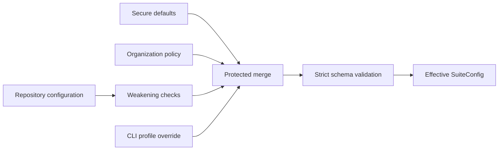
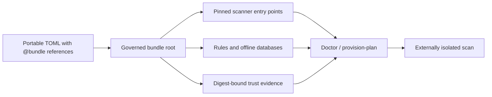

# Python Security Suite configuration

Last reviewed: 2026-08-08

## Loading and protection

Configuration is merged from secure defaults, an optional organization policy,
an optional repository configuration, and an optional CLI profile override.



Unknown sections, keys, tools, profiles, and invalid values are rejected.
Repository settings cannot weaken isolation or organization-required policy.

## Portable offline bundle paths

Use one explicit bundle root when a scanner environment must move between
approved preparation, transfer, runner, and review locations:

```toml
[paths]
bundle_root = ".pysec-tools"

[tools.bandit]
executable = "@bundle/Scripts/bandit.exe"

[tools.semgrep]
rules_path = "@bundle/Lib/site-packages/py_security_suite/rules/python-security.yml"
```

`@bundle/...` works for primary and auxiliary executables and every governed
asset path, including rules, databases, baselines, intelligence, isolation
evidence, and trust catalogs. References must remain below the configured root;
empty references, parent traversal, symbolic links, and junctions are rejected.
Ordinary relative paths remain scan-target-relative. Absolute paths remain
available for administrator-managed external trust stores. No environment,
shell, or network expansion occurs.



## Scanner trust catalog

An organization may replace repetitive per-tool digest declarations with one
reviewed, digest-bound catalog:

```toml
[trust]
catalog_path = "security-data/scanner-trust.json"
catalog_sha256 = "<organization-approved-catalog-sha256>"
```

The catalog records the exact primary, auxiliary, or Python runtime-closure
SHA-256, tool
version, provenance source, approver, expiry, and applicable platforms. Its
`status` must be `approved`; drafts are rejected. Expired, malformed,
digest-mismatched, or duplicate entries fail closed. An explicit per-tool
digest always takes precedence, and repository configuration cannot replace an
organization-approved catalog digest.

Export the strict contract with `pysec schema scanner-trust-catalog-1.0`.
Every scan retains applied, ignored, and invalid catalog decisions in
`scanner-trust.json`.

Native closure calculation recursively includes executable-directory DLL,
PYD, SO, and dylib plugins and transitive PE, ELF, or Mach-O imports. A scanner
with dynamically loaded files outside that tree must ship an exact sidecar named
`SCANNER.runtime-closure.json` beside its executable. Schema `1.0` contains a
`plugins` list of safe relative `path` and lowercase `sha256` pairs; the sidecar
and every declared file are hashed into the runtime closure. Production policy
requires schema `1.2`: it adds the exact loader-observed plugin/OS-component
ledger, the digest-pinned collector, and at least two lifecycle-bound authority
receipts from distinct signers, collectors, and organizations. The receipts
sign a subject that also binds the scanner executable. Changing the scanner,
collector, component set, plugin bytes, or declaration fails closed.

Digest origin is retained separately from digest matching. A tool pin in
repository configuration can fail closed on an unexpected binary, but it does
not establish organization approval. Organization policy pins and entries from
an organization-policy-bound catalog do. `scan-manifest.json` records both
facts for each primary and auxiliary entry point.

## Profiles

The original `quick` and `standard` contracts remain unchanged. New profiles
are opt-in so an existing enterprise gate does not unexpectedly require newly
introduced binaries.

| Profile | Selected tools |
|---|---|
| `quick` | Bandit, detect-secrets |
| `standard` | Bandit, Semgrep, detect-secrets, OSV-Scanner |
| `extended` | Standard plus CycloneDX Python, Ruff security rules, and zizmor |
| `deep` | Extended plus Pysa and CodeQL |
| `supply-chain` | Extended plus Trivy, GuardDog, ScanCode, Gitleaks, and TruffleHog |
| `artifact` | Syft, Grype, check-wheel-contents, Twine, PyPI attestations, Cosign, and passive check-manifest/ClamAV/GitHub-attestation evidence |
| `quality` | Existing correctness/structure/test tools plus Conftest, KICS, pipdeptree, git-sizer, validate-pyproject, Vale, and KubeLinter |
| `iac-deep` | Checkov, Trivy, Hadolint, actionlint, zizmor, Conftest, KICS, and KubeLinter |
| `governance` | Validated OpenSSF Scorecard evidence, REUSE, zizmor, and actionlint |
| `runtime` | Schemathesis, CrossHair, Atheris, ClusterFuzzLite, ZAP, authenticated browser, IAST, Falco, and Kubescape companion evidence |
| `repo-health` | Conftest, KICS, pipdeptree, git-sizer, validate-pyproject, Vale, and KubeLinter |
| `repo` | Production source scanners plus the quality profile; excludes built-artifact controls |
| `comprehensive` | Every implemented offline/static, companion-evidence, or artifact adapter |
| `production` | Strict source-security set plus fail-closed applicable runtime evidence, including actionlint, Hadolint, DevSkim, Flawfinder, TruffleHog, and `run-codeql` |
| `release` | Comprehensive plus production completeness rules and a required built distribution |

If `policy.required_scanners` is empty, every selected and applicable tool is
required. A conditional tool with no matching input is reported as
`not applicable`; it does not make the scan incomplete. An applicable tool
that is unavailable, fails, times out, or cannot be parsed produces
`INCOMPLETE`.

The `production` profile additionally:

- blocks `medium`, `high`, and `critical` findings even if repository
  configuration lists only high and critical;
- requires an organization-approved `executable_sha256` for every applicable
  scanner and verifies the resolved entry point again after execution;
- requires a separate `auxiliary_executable_sha256` for the CodeQL CLI;
- requires a full VCS checkout for source-history and provenance evidence;
- requires a recognized lock file, CycloneDX evidence, and GuardDog coverage
  when dependencies are declared; and
- requires Pysa to be configured and applicable when Python source exists.

These checks are completeness requirements. A missing prerequisite yields
`INCOMPLETE`, never `PASS`.

The `release` profile applies the same strict policy and additionally requires
at least one wheel or source distribution. Artifact scanners remain
conditional in other profiles so source-only development scans do not claim or
require release evidence.

## Supported tool identifiers

| Identifier | Default executable | Optional local asset |
|---|---|---|
| `bandit` | `bandit` | None |
| `semgrep` | `semgrep` | `rules_path` |
| `detect-secrets` | `detect-secrets` | None |
| `osv-scanner` | `osv-scanner` | `database_path` |
| `cyclonedx-py` | `cyclonedx-py` | None |
| `ruff` | `ruff` | None |
| `ruff-quality` | `ruff` | None; correctness, bug, complexity, performance, and upgrade rules |
| `ruff-format` | `ruff` | None; deterministic formatter check |
| `pylint` | `pylint` | Suite-controlled `rules_path` |
| `mypy` | `mypy` | `rules_path` |
| `pyright` | `node` | Staged Pyright `index.js` in `database_path`; suite baseline in `rules_path` |
| `deptry` | `deptry` | Prepared dependency-analysis environment |
| `vulture` | `vulture` | `rules_path` |
| `radon` | `radon` | Rank C+ complexity evidence; rank E/F findings |
| `tach` | `tach` | Repository-root `tach.toml`; conditional when absent |
| `reachability` | `pysec` | Built-in AST-only graph; optional `entry_points`, `source_roots`, and island threshold |
| `graphify` | `graphify` | Code-only AST graph; dedicated pinned sidecar in the native bundle |
| `coverage` | `pysec-evidence` | Pre-generated coverage.py JSON at `artifacts_path` |
| `junit` | `pysec-evidence` | Pre-generated JUnit XML file or directory at `artifacts_path` |
| `diff-cover` | `diff-cover` | Cobertura `coverage.xml`, Git history, `compare_branch`, and threshold |
| `psscriptanalyzer` | `powershell.exe` | Suite settings in `rules_path`; staged module directory in `database_path` |
| `shellcheck` | `shellcheck` | Conditional on shell scripts |
| `zizmor` | `zizmor` | None |
| `actionlint` | `actionlint` | `rules_path`; conditional on `.github/workflows` |
| `hadolint` | `hadolint` | `rules_path`; conditional on Dockerfiles |
| `pysa` | `pyre` | Repository `.pyre_configuration` and taint models |
| `trivy` | `trivy` | Optional `database_path` cache |
| `checkov` | `checkov` | Local policies only; downloads forcibly disabled |
| `guarddog` | `guarddog` | None; scan input must be local |
| `scancode` | `scancode` | None |
| `reuse` | `reuse` | Conditional on `REUSE.toml`, `.reuse/dep5`, or `LICENSES` |
| `gitleaks` | `gitleaks` | None |
| `trufflehog` | `trufflehog` | None |
| `devskim` | `devskim` | Optional `rules_path`; maintained-source mirror |
| `flawfinder` | `flawfinder` | None; conditional on C/C++ sources |
| `codeql` | `run-codeql` | `auxiliary_executable` CodeQL CLI and `database_path` isolated home with local packs |
| `syft` | `syft` | `artifacts_path` |
| `grype` | `grype` | `artifacts_path` and required offline `database_path` |
| `check-wheel-contents` | `check-wheel-contents` | `artifacts_path` |
| `twine` | `twine` | `artifacts_path` |
| `pypi-attestations` | `pypi-attestations` | `artifacts_path`, `provenance_path`, offline trust `database_path`, and `repository_url` |
| `cosign` | `cosign` | Artifact bundles plus a public key, or trusted root and expected certificate identity/issuer |
| `scorecard` | `pysec-evidence` | Pre-generated Scorecard JSON from a connected governance lane |
| `conftest` | `conftest` | Approved local Rego directory in `rules_path` |
| `kics` | `kics` | Matching local KICS query tree in `rules_path` |
| `pipdeptree` | `pipdeptree` | Approved target Python in `auxiliary_executable` |
| `git-sizer` | `git-sizer` | Full local Git checkout |
| `validate-pyproject` | `validate-pyproject` | Embedded local schema; network disabled |
| `vale` | `vale` | Approved local `.vale.ini` in `rules_path` |
| `kube-linter` | `kube-linter` | Kubernetes YAML or Helm chart |
| `hypothesis`, `schemathesis` | `pysec-evidence` | Bounded pre-generated JUnit XML at `artifacts_path` |
| `crosshair`, `atheris`, `mutmut`, `zap`, `pytm` | `pysec-evidence` | Bounded pre-generated JSON at `artifacts_path` |
| `nuclei`, `oast`, `restler`, `protocol-security`, `fuzz-introspector`, `prowler`, `cloud-attack-path`, `secret-verification`, `rasp`, `native-sanitizers`, `mobsf`, `tls-scan`, `polyglot` | `pysec-evidence` | Signed contract-v2 companion evidence; conditionally applicable to web, API/protocol, fuzz-target, cloud, secret-verification, native, mobile, deployed TLS, or non-Python source shapes |
| `in-toto`, `reproducible-build`, `oci-image`, `yara` | `pysec-evidence` | Bounded release-assurance JSON at `artifacts_path` |
| `check-manifest`, `clamav`, `github-attestation` | `pysec-evidence` | Bounded pre-generated packaging/release JSON at `artifacts_path` |

Each `[tools.NAME]` table supports:

```toml
enabled = true
executable = "tool-name-or-approved-absolute-path"
executable_sha256 = "64-lowercase-or-uppercase-hexadecimal-characters"
timeout_seconds = 300
rules_path = "optional/local/rules"
rules_sha256 = "approved-rules-file-or-tree-sha256"
database_path = "optional/local/database-or-cache"
database_sha256 = "approved-database-file-or-tree-sha256"
artifacts_path = "optional/local/distribution-directory"
provenance_path = "optional/local-provenance-directory"
auxiliary_executable = "optional-required-helper-executable"
auxiliary_executable_sha256 = "optional-helper-sha256"
repository_url = "optional-expected-publisher-repository"
minimum_coverage_percent = 80.0
maximum_database_age_days = 10
compare_branch = "origin/main"
public_key_path = "optional/local/cosign-public-key"
public_key_sha256 = "approved-public-key-sha256"
certificate_identity = "optional-expected-signing-identity"
certificate_oidc_issuer = "optional-expected-oidc-issuer"
minimum_island_loc = 100
entry_points = ["optional.module:callable"]
source_roots = ["src"]
discover_framework_roots = true
coverage_path = "optional/coverage.json"
maximum_evidence_age_days = 7
require_evidence_contract_v2 = true
require_signed_evidence = true
expected_run_id = "organization-issued-run-id"
expected_environment_sha256 = "approved-environment-sha256"
expected_context_path = "security-data/organization-issued-context.json"
replay_ledger_path = "security-data/evidence-replay.sqlite3"
# For multi-party evidence signing, use a digest-pinned lifecycle keyring instead:
# public_keyring_path = "security-data/evidence-keyring.json"
# public_keyring_sha256 = "<sha256>"
# For atomic replay consumption across runners, replace replay_ledger_path with:
# replay_service_url = "https://replay.security.example/v1/consume"
# replay_service_token_env = "PYSEC_REPLAY_SERVICE_TOKEN"
# replay_service_ca_path = "security-data/replay-service-ca.pem"
# replay_service_ca_sha256 = "<sha256>"
```

Only use keys meaningful to that adapter. Relative asset paths are resolved
against the scan target. See [`pysec.example.toml`](../pysec.example.toml) for
a complete configuration containing all implemented tools.

The final evidence settings bind companion trust. Evidence adapters require
contract v2 and signed bindings by default; the public key must be pinned by
SHA-256 and should come from organization policy. A repository cannot increase
the maximum age or disable an organization-required contract or signature.
`expected_context_path` is mandatory for contract-v2 assurance and binds the target manifest, exact exercised target set,
deployment, external surface inventory, challenge, and trusted-time receipt.
`expected_run_id` and `expected_environment_sha256` add explicit orchestrator
checks. Its trusted-time object must contain an RFC 3161 response, nonce, and
digest-pinned timestamping certificate; the verifier checks the message imprint,
nonce, signature, timestamping EKU, certificate validity, and issued time.
`replay_ledger_path` atomically consumes
each authenticated evidence identity in SQLite, so a previously accepted
receipt cannot authorize a later decision.

`replay_service_url` provides the same consume-once contract through an HTTPS
service for distributed runners. Authentication is read from the configured
environment variable. An organization-pinned CA, receipt public key, client
certificate, and client key are mandatory; an unsigned or empty HTTP 201 is
rejected. The local ledger and central service are mutually exclusive. Set
`PYSEC_REPLAY_RECEIPT_KEY_SHA256` to the canonical raw Ed25519 key digest and
use `PYSEC_REPLAY_STATE_FILE` plus `PYSEC_REPLAY_MIN_SEQUENCE` for a durable,
externally anchored checkpoint. Every replay trust file has a matching
`*_sha256` setting.

Governance v2 receipts (isolation, intelligence, execution trust, and the
organization policy itself) can use the same deployment-owned monotonic
service. Set `PYSEC_GOVERNANCE_REPLAY_SERVICE_URL`,
`PYSEC_GOVERNANCE_REPLAY_SERVICE_TOKEN_ENV`, the `..._CA`, `..._RECEIPT_KEY`,
`..._CLIENT_CERT`, and `..._CLIENT_KEY` paths, plus each matching `..._SHA256`.
Set `PYSEC_GOVERNANCE_REPLAY_REQUIRE_REMOTE=true` to forbid fallback to the
local SQLite ledger. Signed receipt time is rechecked against the governance
validity window, and `PYSEC_GOVERNANCE_REPLAY_SERVICE_STATE_FILE` retains the
monotonic hash-chain checkpoint.

A public keyring can set a threshold across distinct Ed25519 signers and assign
each key an active, retired, or revoked lifecycle state with validity dates.
Revoked or out-of-window keys never contribute to the threshold.
Keyring schema 2 adds an offline-root signature, monotonic generation,
`previous_keyring_sha256`, and `compromised_key_ids`. Configure
`allowed_builder_ids`, `expected_build_type`, and
`expected_source_repository` to reject otherwise valid evidence built by an
unapproved SLSA builder or source.

`require_assurance_profile = true` makes the high-assurance admission root
mandatory; this is the default for assurance-evidence tools. Such a tool is
rejected before execution unless both `assurance_profile_path` and
`assurance_profile_sha256` select the exact external profile. The profile requires a
quorum of independently collected organization-trusted signatures, a monotonic
generation, an expiry, RFC 3161 trusted time, a signed remote append-only
checkpoint with an exact predecessor, minimum contract
versions, required execution features, a minimum SLSA level, and required
provenance verifiers. Configure `PYSEC_ASSURANCE_PROFILE_MIN_GENERATION` and
`PYSEC_ASSURANCE_PROFILE_MIN_CHECKPOINT_SEQUENCE` as deployment-owned rollback
floors. Configure `PYSEC_ASSURANCE_PROFILE_SIGNATURE_THRESHOLD`,
`PYSEC_AUTHORITY_ORGANIZATIONS`, and `PYSEC_AUTHORITY_KEY_LIFECYCLE` outside the
repository; a
repository cannot replace either the approved profile path or digest.

Profile-governed provenance uses schema 3 and composes the independently
verified SLSA envelope, Sigstore bundle and trusted root, VSA policy, and exact
resolved-dependency closure. A valid older contract, a missing feature, or a
missing verifier is a rejection rather than a lower-confidence pass.

Deep-qualification manifests bind all nine receipts to one run, environment,
target, source, profile generation, trusted-time window, and nonce. For a
single runner, set `PYSEC_QUALIFICATION_REPLAY_LEDGER` to a protected local
file. Distributed runners instead set
`PYSEC_QUALIFICATION_REPLAY_SERVICE_URL`,
`PYSEC_QUALIFICATION_REPLAY_SERVICE_TOKEN_ENV`,
`PYSEC_QUALIFICATION_REPLAY_SERVICE_CA`,
`PYSEC_QUALIFICATION_REPLAY_SERVICE_CLIENT_CERT`, and
`PYSEC_QUALIFICATION_REPLAY_SERVICE_CLIENT_KEY`. The endpoint must atomically
create a consume receipt or return HTTP 409; credentials in URLs, unpinned CAs,
missing mutual TLS, malformed receipts, and replay are rejected.

The reachability-specific settings are `minimum_island_loc`, `entry_points`,
`source_roots`, `discover_framework_roots`, and `coverage_path`. Coverage is optional,
bounded coverage.py JSON generated in a separate test lane; organization policy
can bind its location. See
[Python reachability and code islands](reachability.md) for root discovery,
policy-strength rules, output interpretation, and dynamic-language limits.

`executable_sha256` binds the exact resolved executable or console-script
entry point. For Python console scripts, `runtime_closure_sha256` additionally
hashes every file in the owning installed distribution and its recursively
installed dependency closure. Organization policy can approve either value;
the closure is checked before and after execution. Approve the connected-lane
bundle, retain its manifest and package lock evidence, and transfer it through
the enterprise artifact trust process.

## Core schema

```toml
schema_version = "1"
profile = "standard"

[paths]
bundle_root = ".pysec-tools"

[isolation]
network = "deny"
enforcement_mode = "external-attested"
require_attestation = true
require_evidence = false
execute_target_code = false
# evidence_path = "security-data/isolation-attestation.json"
# evidence_sha256 = "<organization-approved-sha256>"
# evidence_public_key_path = "security-data/governance-ed25519.pem"
# evidence_public_key_sha256 = "<organization-approved-key-sha256>"
# evidence_signature_path = "security-data/isolation-attestation.sig"
# For local enforcement instead of an external runner:
# enforcement_mode = "sandbox-launcher"
# sandbox_executable = "/usr/bin/bwrap"
# sandbox_executable_sha256 = "<organization-approved-launcher-sha256>"
# sandbox_runtime_closure_sha256 = "<launcher-and-transitive-native-closure-sha256>"
# sandbox_arguments = ["--unshare-net", "--die-with-parent", "--"]

[execution]
max_workers = 4
max_output_bytes = 16777216

[policy]
# Derive required scanners from the selected profile.
required_scanners = []
block_severities = ["critical", "high"]
incomplete_is_blocking = true
# Optional governed, expiring finding dispositions.
# risk_acceptance_path = "security/risk-acceptances.json"
# risk_acceptance_sha256 = "<approved-ledger-sha256>"

[reports]
include_sanitized_evidence = true
classification = "confidential"
retention_days = 30
# baseline_path = "security-data/previous/findings.json"
# baseline_sha256 = "<approved-sha256>"

[intelligence]
# kev_path = "security-data/intelligence/kev.json"
# kev_sha256 = "<approved-sha256>"
# epss_path = "security-data/intelligence/epss.csv.gz"
# epss_sha256 = "<approved-sha256>"
# vex_path = "security-data/intelligence/product-vex.cdx.json"
# vex_sha256 = "<approved-sha256>"
# approval_path = "security-data/intelligence/approval.json"
# approval_sha256 = "<organization-approved-sha256>"
# approval_public_key_path = "security-data/governance-ed25519.pem"
# approval_public_key_sha256 = "<organization-approved-key-sha256>"
# approval_signature_path = "security-data/intelligence/approval.sig"
require_approval = false
maximum_age_days = 3
epss_high_probability = 0.10
epss_high_percentile = 0.90
```

`baseline_path` accepts only a bounded regular `findings.json` with schema
version `1.0`. Its approved digest is mandatory. Exact fingerprints are matched
first; a unique tool/rule/path/title match preserves lifecycle across line
movement. Findings absent from the new scan are retained only in
`finding-delta.json` as resolved evidence.

Baseline comparison is fail-closed on comparability. The baseline must record
the same scan profile and selected scanner set as the current scan. A mismatch,
or a legacy baseline that lacks the selected-tool inventory, sets
`comparison.comparable: false`, records exact reasons, and marks current
findings `unclassified`; it never presents them as newly introduced. Source
digests are retained for audit context, while revision ancestry must be proven
by the enterprise CI/VCS controller when that proof is required.

Each configured intelligence path must have its corresponding SHA-256. The
suite validates regular-file type, byte and record limits, digest, maximum age,
and native schema before enrichment. Invalid configured evidence makes the scan
`INCOMPLETE`. VEX never suppresses a finding automatically; a not-affected
decision still requires the governed risk-acceptance workflow.

`production` and `release` force `isolation.require_evidence = true`. Governance
v2 evidence is required in those profiles and binds containment capabilities,
a signed generation and nonce, two or more independent organizations and
collectors, key lifecycle/revocation policy, and an atomic replay ledger. The
evidence is accepted only when its path and digest originate in the separate
organization policy; a repository-local binding is recorded but is not treated
as enterprise authorization. It must assert egress denial, match the immutable
source digest and target, cover scan start with its validity window, and record
the external signature verifier and trust-root digest. The suite independently
verifies the exact JSON bytes with the configured, digest-pinned Ed25519 key; a
self-asserted `signature_verified` field is insufficient.

When production or release consumes KEV, EPSS, or VEX, it likewise requires a
digest-bound approval manifest from the organization policy. The manifest must
list exactly the snapshot kinds and SHA-256 values consumed by the scan. These
decisions are sealed in `isolation-attestation.json` and
`intelligence-approval.json`. `isolation-boundary.json` records whether the
scan used external attestation or a digest-pinned sandbox launcher.
`isolation-probe.json` independently exercises loopback and host-interface
TCP/UDP, IPv4/IPv6, Unix-domain and raw sockets, cleared proxy and credential
variables, unrelated host-secret read denial, root/nested target writes, link
creation, named shared-memory IPC, parent-process access/PID visibility, and
private scratch. Linux additionally requires `NoNewPrivs`, zero effective
capabilities, seccomp filter mode with at least one filter, and the
deployment-owned `PYSEC_SECCOMP_POLICY_SHA256` commitment. macOS requires the
digest-bound production sandbox launcher, arguments, and runtime closure; Windows
requires DEP, ASLR, dynamic-code prohibition, and child-process prohibition.
Linux and macOS production completeness additionally requires an exact
effective-policy receipt selected by `PYSEC_EFFECTIVE_SANDBOX_ATTESTATION_PATH`
and `PYSEC_EFFECTIVE_SANDBOX_ATTESTATION_SHA256`. The receipt binds the observed
kernel/launcher facts, effective identity, policy digest, platform, and attestor.
Sandbox arguments may use
`{PYSEC_PROBE_SECRET_PARENT}` to mask the per-run secret directory. Governance
v2 also requires host-filesystem, credential, process, device, and IPC
isolation; Windows evidence must additionally assert `windows-appcontainer`
because a Job Object alone is not a security boundary. Unsupported host
canaries remain explicitly untested and cannot satisfy required capability
coverage. `resource-limits.json` records CPU, memory, process, open-file, output,
and scratch controls; production/release additionally require an external
`file-write-quota` capability, because post-run directory polling is not a hard
write limit.
Optional exact native reports use `PYSEC_RAW_EVIDENCE_DIRECTORY`, the
digest-pinned 256-bit key named by `PYSEC_RAW_EVIDENCE_KEY_PATH`, and a custody
record named by `PYSEC_RAW_EVIDENCE_CUSTODY_RECEIPT_PATH` plus its SHA-256. The
receipt binds provider, key ID/version, store identity, retention, and the
master-key commitment. Deployment traces are admitted through
`PYSEC_RUNTIME_TRACE_EVIDENCE_PATH` plus its SHA-256 and retained only when
every source/target pair exists in `boundary-graph.json`.
`trust-policy.json` seals deployment trust variables by value digest, and its
digest is included in the effective configuration identity. Production and
release additionally require an externally quorum-signed trust-policy
attestation with expiry, generation anti-rollback, and replay consumption.
Organization policy metadata can be authenticated the same way through
`PYSEC_ORGANIZATION_POLICY_ATTESTATION` and its deployment-owned SHA-256.

Report publication verifies owner-only permissions before the atomic commit and
records classification and a deletion deadline in `report-security.json`. For
encrypted transport or storage, `pysec encrypt-report` requires the recipient
public key and digest plus `--key-lifecycle-receipt`, its digest,
`--key-authority-public-key`, its digest, and `--key-lifecycle-signature`;
`--provider-attestation`, its digest, `--provider-authority-public-key`, its
digest, `--provider-attestation-signature`, and `--trusted-time-context` are
also mandatory. The independent provider statement proves the exact key
generation is non-exportable, decrypt-only, and supports cryptographic erasure;
advanced RFC 3161 time binds both signed statements and the recipient digest.
`pysec decrypt-report` authenticates, safely extracts, and re-verifies the
report. The envelope uses X25519, HKDF-SHA256, and AES-256-GCM.

## Constraints

| Setting | Constraint |
|---|---|
| `schema_version` | Must be `"1"` |
| `profile` | One of the fourteen documented profiles |
| `isolation.network` | Must be `"deny"` |
| `isolation.execute_target_code` | Must be `false` |
| `isolation.evidence_path` / `evidence_sha256` | Paired; organization-policy binding required for production/release |
| Governance public-key path / SHA-256 / signature path | Required with isolation or intelligence governance evidence; Ed25519 only |
| `isolation.enforcement_mode` | `external-attested` or `sandbox-launcher`; launcher mode requires a digest-pinned executable |
| `intelligence.approval_path` / `approval_sha256` | Paired; required for consumed production/release snapshots |
| `execution.max_workers` | 1 through 16 |
| `execution.max_output_bytes` | At least 1024 |
| `reports.classification` | `confidential` or `restricted` |
| `reports.retention_days` | 1 through 3650 |
| `policy.block_severities` | Valid normalized severity values |
| Tool timeout | Positive integer seconds |
| Tool executable digest | Exactly 64 hexadecimal characters when supplied |
| Tool runtime closure digest | Required organization-approved exact Python distribution/dependency-closure SHA-256 in production/release; native tools additionally require an adjacent schema-1.2 manifest whose loader-observation collector and exact plugin/OS-component closure have a two-organization authority quorum |
| Tool rules/database digest | Each configured `rules_path` or `database_path` requires a matching organization-approved SHA-256 in production/release; file or canonical symlink-free directory digests are checked before and after execution, while the scanner receives only a private per-run snapshot verified before and after use |
| `minimum_coverage_percent` | Numeric value from 0 through 100 |
| `maximum_database_age_days` | Numeric value from 0.1 through 3650; enforced for staged OSV and Grype databases |
| `policy.risk_acceptance_sha256` | Exactly 64 hexadecimal characters when supplied |

Supported severities are `critical`, `high`, `medium`, `low`,
`informational`, and `unknown`.

## Protected organization policy

For `production` and `release`, `--policy` is accepted only when
`PYSEC_ORGANIZATION_POLICY_SHA256` matches the exact policy bytes. This pin is
owned by the deployment/runner, not by the repository being scanned.

A repository cannot:

- change organization-required `network = "deny"`;
- enable target code execution;
- disable organization-required isolation attestation;
- remove an organization-required scanner;
- replace an organization-approved scanner or helper digest;
- lower an organization-owned minimum coverage threshold;
- remove an organization blocking severity; or
- replace an organization-approved risk-acceptance ledger digest;
- make organization-blocking incomplete scans non-blocking.

Required applicable scanners cannot be disabled.

An optional full standards/applicability policy is deployment-owned through
`PYSEC_REQUIREMENTS_POLICY_PATH` and
`PYSEC_REQUIREMENTS_POLICY_SHA256`. Export its contract with `pysec schema
security-requirements-policy-1.0`. It must enumerate every requirement from
each pinned ASVS, MASVS, and TCASVS catalog and carry at least two approved
`security-requirements-applicability` authority signatures. Missing catalog
items, duplicate decisions, unknown evidence names, or an unverified policy
keep `security-requirements-coverage.json` incomplete.

## CLI reference

```text
pysec init TARGET [--template library|api|cli|worker|monorepo]
  [--profile NAME] [--output TARGET_RELATIVE_PATH] [--format text|json]
  [--overwrite]
pysec scan TARGET --output REPORT [options]
pysec doctor TARGET [--config PATH] [--policy PATH] [--profile NAME]
  [--explain] [--format text|json|markdown] [--output FILE] [--overwrite]
pysec inspect REPORT [--limit 0-100] [--format text|json]
  [--output FILE] [--overwrite]
pysec verify-inspection INSPECTION --report REPORT [--limit 0-100]
  [--format text|json] [--output FILE] [--overwrite]
pysec release-check REPORT [--format text|json] [--output FILE]
pysec evidence-draft REPORT [--format text|json] [--output FILE]
pysec reachability-diff BASELINE CURRENT --baseline-sha256 SHA256
  --current-sha256 SHA256 [--format text|json] [--output FILE]
pysec schema NAME [--output FILE] [--overwrite]
  [--output FILE] [--overwrite]
pysec verify-report REPORT [--format text|json] [--output FILE] [--overwrite]
pysec attest REPORT --output PASSPORT (--signing-key KEY | --unsigned)
pysec verify PASSPORT [--report REPORT] [verification options]
pysec list-tools [--profile NAME] [--format text|json]
pysec --version
```

`init` writes a minimal repository configuration for a library, API, CLI,
worker, or monorepo. The output must stay inside the target, existing content is
preserved unless `--overwrite` is explicit, and publication is atomic. Template
defaults are recommendations, not enterprise authority: initialization never
installs a scanner, approves a digest, attests isolation, signs an artifact, or
admits a release. JSON output conforms to the bundled `project-init-1.0`
contract and uses argument arrays so automation does not need to parse a shell
command string.

`doctor` performs a non-executing prerequisite assessment and exits `0` when
all applicable required tools and governed context files are ready, `2` when
readiness is incomplete, and `3` for invalid invocation or configuration. Its
JSON form is stable automation input. The structured `decision` distinguishes a
preflight `proceed` from `block`, lists required-tool and governed-context
blocking reasons, and always sets `release_approval` to false. `summary`
separates selected, applicable, required-ready, not-applicable, and
attention-needed counts; `optional_attention_tools` remains visible without
blocking the run. `--explain` adds an ordered P0/P2 action plan, evidence
reasons, selected-control state, and the isolated-lane next command. JSON is
governed by `doctor-readiness-1.1`; `action_groups` consolidates equivalent
remediation while `next_actions` retains every control-specific reason.
Markdown leads with those root-cause batches and keeps the complete evidence in
expandable tables. `--output` publishes either form atomically, rejects
link-like paths, and preserves existing files unless `--overwrite` is explicit. Doctor
does not run scanner version commands, execute target
code, attest network isolation, or predict the policy outcome of the eventual
scan.

Use `config-check` before doctor when adopting or upgrading a repository
configuration:

```text
pysec config-check --config pysec.toml [--policy organization.toml] \
  [--profile NAME] [--format text|json|markdown] [--output FILE]
```

The command reads bounded TOML, validates the exact effective merge, records
input names and SHA-256 identities without exposing absolute paths, inventories
relative, absolute, and `@bundle/` settings, and returns migration guidance for
an unsupported schema. It never performs an automatic semantic rewrite: a new
template must be reviewed before governed settings are transferred. Repository
digest pins are called out as substitution evidence, not organization approval.
JSON output conforms to `config-advice-1.0`.

Bare executable names are resolved from `PATH` first and then from the script
directory beside the invoking Python interpreter. The second lookup supports
activation-free `python -m py_security_suite` operation; it does not bypass
executable hashing, configured digest verification, or organization approval.

`inspect` verifies the report checksum chain before reading normalized JSON.
Its JSON form retains `policy_reasons` for compatibility and adds structured
`scan_policy`, applicability-aware `tool_health`, integrity status, and cited
`top_actions`. A skipped scanner only counts as not applicable when its
manifest record explicitly has `applicable: false`; otherwise it is an
execution gap.
When `--output FILE` is present, the same rendered document is atomically
published to a regular file and still emitted on standard output. The file must
be outside `REPORT`, because adding any undeclared file to that sealed directory
correctly invalidates its exact checksum set. Existing output is preserved
unless `--overwrite` is explicit, and symbolic-link or junction components are
rejected before publication. JSON `entrypoints` and `top_actions[].details`
references are relative to the report directory for portable artifact use;
interactive text rendering resolves them against the locally supplied report.

`verify-inspection` treats the sidecar as untrusted bounded input, rejects
duplicate JSON keys, verifies the
report checksum chain, recomputes the inspection using the caller's expected
action limit, and requires exact parsed-document equality. The default is five;
use the same explicit `--limit` for export and verification. This prevents an
untrusted sidecar from suppressing actions and choosing its own comparison
depth. The success record binds
the inspection SHA-256, report checksum-manifest SHA-256, scan ID, schema ID,
and verified action count. It does not establish publisher identity or release
approval; those remain Security Passport responsibilities.
`--output FILE` requires `--format json` and atomically publishes a receipt
outside the sealed report; replacement requires explicit `--overwrite`. The
receipt is governed by the bundled
[verification schema](../src/py_security_suite/schemas/report-inspection-verification-1.3.schema.json).

`schema` retrieves an exact contract from the installed distribution without
network access or source-checkout knowledge. It always emits the schema on
standard output and optionally publishes the same bytes plus one trailing
newline atomically to `--output`. The destination must be a regular, unlinked
path; existing content is retained unless `--overwrite` is explicit, and
`--overwrite` without `--output` is rejected. Versioned names intentionally
avoid implicit upgrades:

| CLI name | Required `$id` |
|---|---|
| `report-inspection-1.0` | `urn:project-py-security-suite:schema:report-inspection:1.0` |
| `report-inspection-1.1` | `urn:project-py-security-suite:schema:report-inspection:1.1` |
| `report-inspection-1.2` | `urn:project-py-security-suite:schema:report-inspection:1.2` |
| `report-inspection-1.3` | `urn:project-py-security-suite:schema:report-inspection:1.3` |
| `report-inspection-verification-1.0` | `urn:project-py-security-suite:schema:report-inspection-verification:1.0` |
| `report-inspection-verification-1.1` | `urn:project-py-security-suite:schema:report-inspection-verification:1.1` |
| `report-inspection-verification-1.2` | `urn:project-py-security-suite:schema:report-inspection-verification:1.2` |
| `report-inspection-verification-1.3` | `urn:project-py-security-suite:schema:report-inspection-verification:1.3` |
| `report-verification-1.0` | `urn:project-py-security-suite:schema:report-verification:1.0` |

`verify-report` validates the complete `checksums.sha256` chain, the scan
manifest, every canonical report artifact, and their exact manifest bindings.
A checksum-consistent partial report is rejected. Every additional declared
artifact must also resolve to one unique, present file or explicitly marked
directory inside the report. The embedded Security Passport must be a valid
in-toto/SLSA statement, cover the exact report input set, and agree with the
manifest's scan identity, source, policy, result, findings, and scanner health.
Its exact source and distribution subject set must also agree with the validated
`artifact-manifest.json`; missing, duplicate, invented, or altered subjects are
rejected.
With `--format json`, success is a self-identifying
`report-verification:1.0` receipt containing the verified file count, checksum-
manifest digest, scan ID, and outcome. `--output FILE` requires JSON format,
publishes atomically outside the sealed report, rejects linked paths, and
preserves an existing receipt unless `--overwrite` is explicit. This receipt
proves consistency of the supplied bytes; it is not signer authentication or a
release-approval decision.
`verify` accepts a detached passport **directory** created by `attest`, not the
embedded `security-passport.json` statement file. When the Passport declares
distribution subjects, `verify --artifact-root ROOT` must resolve and hash each
subject path beneath `ROOT`; omission blocks approval. Direct distribution files
in every governed subject directory must exactly match the Passport set, so an
undeclared wheel, sdist, or zip cannot ride with an approved payload. Direct
directory entries and mismatch details are capped during this untrusted-input
check.
When `--report` is supplied, its embedded statement must be exactly the same
JSON statement as the detached Passport; transport metadata cannot redirect a
valid signature to a report carrying different claims.

`inspect` performs the same integrity verification, then presents a bounded
operational summary of outcome, scanner health, severity, domains, lifecycle,
ownership, policy reasons, and prioritized actions. Its JSON output is suitable
for release dashboards and downstream policy automation. The additive
`entrypoint_integrity` object separates observed entry points, approved-and-
unchanged entry points, unchanged post-checks, and post-check gaps. Its
`approval_gap_entrypoints` and `postcheck_gap_entrypoints` arrays retain the
complete primary/helper names for automation. The `actions` array provides each
gap's `entrypoint`, `tool`, `role`, exact `sha256`, `priority`, approval and
post-check states, candidate flag, optional dotted `configuration_key`, and
stable `required_actions` codes. `approval_candidate_entrypoints` and
`approval_candidate_unique_digests` separate policy-binding work from the
number of distinct executable payloads requiring provenance review.

The remediation codes are `quarantine_changed_toolchain`,
`restore_post_execution_verification`, `verify_provenance_before_approval`, and
`approve_exact_digest`. Consumers should process actions in emitted P0, P1, P2
order and must not interpret `approval_candidate: true` as approval.

The complete inspection document is governed by the bundled
[Draft 2020-12 schema](../src/py_security_suite/schemas/report-inspection-1.3.schema.json).
Output sets
`schema_id` to `urn:project-py-security-suite:schema:report-inspection:1.3` so an
isolated consumer can select its locally approved schema without dereferencing
a network URL. Version `1.1` adds the required-but-nullable
`top_actions[].artifact_identity` object. When a finding addresses a governed
artifact, that object carries its safe relative path, SHA-256, and byte size;
terminal inspection includes the digest and size in its evidence line. Version
`1.2` adds required priority, blocking, confidence, area, description, and impact
fields to every top action, aligning automation with the human action plan.
Version `1.3` adds a required `action_summary` with the requested limit and
available, returned, omitted, and truncated values. Its verification receipt
binds the same summary, preventing a bounded view from silently appearing
complete. Versions `1.0` through `1.2` remain frozen and exportable for
compatibility. Future additive changes require a minor version and incompatible
changes require a major version, with a matching URN and schema artifact.

All finding views share one deterministic order: derived P0-P4 priority,
blocking state, active lifecycle (`new` or `regression`), native severity, then
finding ID. Known-exploited evidence promotes a finding to P0, while
`EPSS-HIGH` promotes critical, high, or medium findings to P1. This prevents a
lower native severity with stronger exploitation evidence from being buried.

The Markdown action plan orders changed entry points before missing post-checks
and approval-only gaps. It also emits a collapsed TOML candidate block for
entry points that were observed unchanged but lack an approved digest. The
block is deliberately not an approval record: independently verify provenance,
version, and custody before copying any candidate into organization policy.

Machine-readable commands use this failure shape on standard error and exit
with code `3` for configuration, I/O, or validation failures:

```json
{
  "command": "verify",
  "error": {"code": "validation_error", "message": "bounded detail"},
  "schema_version": "1.0",
  "status": "error"
}
```

The stable error codes are `configuration_error`, `io_error`, and
`validation_error`. Messages are redacted, terminal-control safe, and bounded.

| Option | Purpose |
|---|---|
| `--config PATH` | Repository TOML configuration |
| `--policy PATH` | Organization TOML policy |
| `--profile NAME` | Override the selected profile |
| `--network-isolated` | Attest an existing external egress-denied boundary |
| `--diagnostic-without-isolation` | Run offline-configured tools without attestation and force `INCOMPLETE` |
| `--overwrite` | Replace an existing marked suite report |
| `--github-summary` | Append `summary.md` to `GITHUB_STEP_SUMMARY` |

## Outcome and exit-code reference

| Outcome | Exit | Condition |
|---|---:|---|
| `PASS` | 0 | All applicable required tools completed and no findings remain |
| `WARN` | 0 | All applicable required tools completed and findings are non-blocking |
| `FAIL` | 1 | A finding meets a configured blocking severity |
| `INCOMPLETE` | 2 | Required isolation or applicable tool evidence is incomplete |
| CLI error | 3 | Invocation, configuration, or safe-output validation failed |

Completeness is evaluated before severity. An unavailable applicable scanner
cannot be masked by an otherwise empty finding set.
Encryption additionally requires digest-pinned, Ed25519-signed key-lifecycle
and provider-attestation receipts from distinct configured authorities. The
receipts name the KMS/HSM provider, key ID and generation, active validity
window, exact X25519 recipient public-key digest, non-exportability,
decrypt-report usage, and cryptographic-erasure capability. Advanced RFC 3161
time—not the local clock—establishes the active lifecycle window. These fields,
receipt/authority digests, and timestamp receipt are authenticated inside the
encrypted envelope.

Expired-report deletion requires `pysec purge-expired-report REPORT
--trusted-time-context CONTEXT.json`. The RFC 3161 timestamp challenge binds the
exact report checksum, sealed deletion deadline, and purge action; the local
wall clock and legacy signer-only timestamp receipts are not accepted as
deletion authority.
