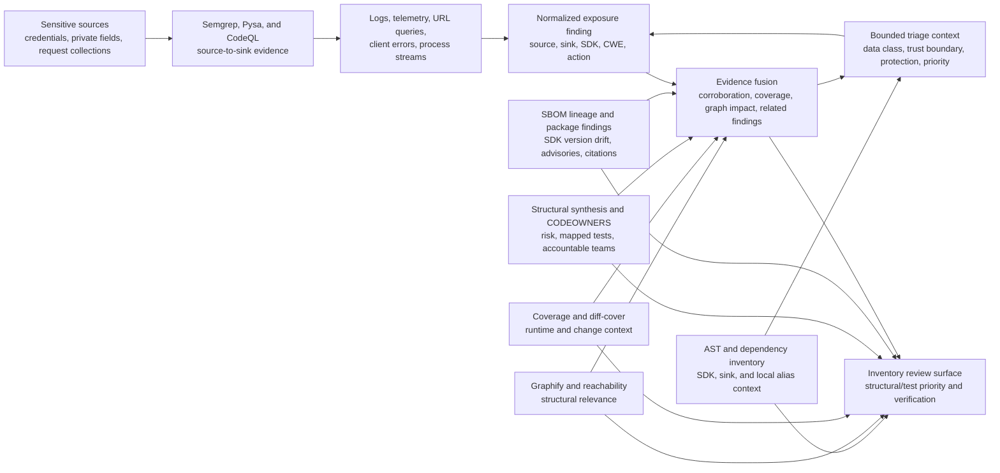

# Sensitive-data exposure analysis

The suite detects implementation paths that can disclose credentials or private
data through logs, telemetry, analytics, metrics, error reporting, or outbound
SDKs. Analysis remains offline and does not import or execute the target.

## Security basis

This control is grounded in established weakness definitions and defensive
practice:

- [CWE-532](https://cwe.mitre.org/data/definitions/532.html) covers sensitive
  information written to logs. Logs are commonly replicated, retained, and
  accessible to a broader operator population than production data stores.
- [CWE-201](https://cwe.mitre.org/data/definitions/201.html) covers sensitive
  information inserted into data sent outside its intended boundary.
- [CWE-200](https://cwe.mitre.org/data/definitions/200.html),
  [CWE-209](https://cwe.mitre.org/data/definitions/209.html), and
  [CWE-359](https://cwe.mitre.org/data/definitions/359.html) cover unauthorized
  disclosure, sensitive error details, and private personal information.
- [CWE-598](https://cwe.mitre.org/data/definitions/598.html) covers credentials,
  tokens, PII, and other sensitive values placed in URL query strings, which
  routinely propagate into histories, access logs, proxies, caches, monitoring,
  and Referer headers.
- The [OWASP Logging Cheat
  Sheet](https://cheatsheetseries.owasp.org/cheatsheets/Logging_Cheat_Sheet.html)
  recommends excluding, masking, sanitizing, hashing, or encrypting sensitive
  fields as appropriate; testing logging behavior; protecting transport and
  storage; and reviewing third-party transmission.
- [OpenTelemetry sensitive-data guidance](https://opentelemetry.io/docs/security/handling-sensitive-data/)
  recommends deleting, hashing, filtering, transforming, or allowlisting
  attributes before export. Its URL conventions require user information to be
  omitted and known-sensitive query parameters to be scrubbed.

These classifications do not turn every logger or telemetry call into a
vulnerability. The suite explicitly separates confirmed scanner traces from
review surfaces.

## Evidence model

The bundled Semgrep rules identify credential-bearing values obtained from:

- credential-named environment variables;
- authorization, cookie, session, and token headers;
- request cookies; and
- common cloud secret-manager result APIs; and
- credential-named object attributes and mapping entries, such as
  `settings.api_key` and `config["auth_token"]`.

A separate medium-confidence privacy lane recognizes explicit fields commonly
associated with contact and account data, IP addresses, government identifiers,
payment cards, birth data, and patient/health records. These matches carry
CWE-359 plus a sink-specific CWE. Field-name modeling is intentionally bounded
and does not replace an organization's authoritative data classification catalog.

They trace those values to standard and structured logging, bound logger
context, stdout/stderr (commonly collected as container logs), Sentry and other
error SDKs, OpenTelemetry-style spans, Datadog/New Relic events, metric labels,
and common analytics calls. Additional rules detect:

- whole request bodies, JSON, forms, POST/GET collections, and query-parameter
  mappings sent to logs or telemetry;
- credentials or private fields serialized into HTTP query strings, plus
  credential-bearing values interpolated directly into outbound URLs;
- raw exception text returned through FastAPI, Starlette, Flask, or Django
  response primitives; and
- Sentry `send_default_pii=True` as a high-confidence configuration review;
- broad `locals()`, `vars(...)`, `__dict__`, or process-environment snapshots
  written to logs or exported to telemetry;
- OpenTelemetry GenAI message-content capture in `.env`, TOML, YAML, INI,
  properties, and Python environment assignments; and
- wildcard OpenTelemetry request/response header capture in those configuration
  formats.

Request payload matching distinguishes request-like receivers from generic SDK
response objects. For example, `request.data` remains a review source while
`embedding_response.data` does not become request taint merely because its
attribute is named `data`.

Only explicitly named minimization, allowlisting, redaction, removal, sanitizing,
or scrubbing boundaries suppress bundled taint rules. Generic hashing, HMAC,
masking, filtering, or tokenization no longer suppresses a finding by name
alone: those transformations may be reversible, linkable, brute-forceable,
partial, or applied to the wrong field. Review evidence still records a visible
candidate transform, but organizational approval and tests determine adequacy.

## SDK and sink inventory

`data-exposure.json` inventories relevant imports, declared dependencies, and
sink calls for:

- Sentry, Rollbar, Bugsnag, OpenTelemetry, OpenCensus, Datadog/ddtrace,
  Elastic APM, New Relic, Honeycomb, Pydantic Logfire, Raygun, and AWS X-Ray;
- structlog and Loguru;
- Prometheus and StatsD clients;
- Segment/Analytics, Mixpanel, Amplitude, and PostHog; and
- Requests, HTTPX, and aiohttp egress surfaces.

The catalog also covers Azure Monitor OpenTelemetry, Google Cloud Logging and
Error Reporting, Splunk OpenTelemetry, Langfuse, OpenInference, Arize Phoenix,
and MLflow. Dependency discovery walks nested `pyproject.toml` files, PEP 621
optional dependencies, Poetry dependency groups, and requirements/constraints
files so monorepo packages do not disappear behind the root manifest.

The inventory also highlights custom logger variables, bound log context,
process output, risky Sentry PII settings, broad OpenTelemetry HTTP-header
capture, sensitive query parameters, and exception-bearing client responses.
These remain review surfaces until a scanner supplies source-to-sink or exact
configuration evidence.

Within each file, the AST inventory conservatively propagates named data-class
context through simple assignments. Surfaces record credential, personal,
financial, health, and request-content hints; operational, client, or external
trust boundaries; broad-state, serialization, URL-retention, and exception
risk factors; and the visible protection kind. Minimization/allowlisting,
redaction/masking, configured SDK hooks, and pseudonymization remain distinct so
reviewers do not mistake a hash or token for removal. High/medium/low review
priority only orders inventory work—it is not a vulnerability severity or a
regulatory classification.

Each inventory surface is also cross-referenced by file and line with available
diff coverage, full coverage, reachability/runtime observations, Graphify
upstream and downstream structure, and nearby normalized findings. The report
raises review priority for compound evidence such as a changed but uncovered
sink or a sensitive runtime-observed sink, and generates evidence-specific
verification steps. These joins improve review order only: an inventory surface
remains unconfirmed until source-to-sink or exact configuration evidence exists.

When structural synthesis is available, the same record contributes its
change-risk score and classification, exact graph-selected test files, test
selection confidence, and island or import-cycle identifiers. CODEOWNERS-derived
owners from normalized findings and structural islands are carried into the
surface context. The report therefore answers who should review, which tests to
run, and which structural hotspot explains the priority without guessing at
runtime exploitability.

After evidence fusion finalizes package lineage, each curated disclosure SDK is
also matched to its exact normalized declared package names. The suite joins
those packages to source/artifact SBOM versions and normalized dependency
findings from tools such as OSV-Scanner, Grype, Trivy, or GuardDog. The context
retains finding IDs, tools, classifications, highest severity, lineage status,
and advisory citations. Alias-aware evidence fusion also separates distinct
CVE/GHSA/PYSEC/OSV advisory risks from retained native scanner observations, so
reciprocal aliases do not inflate the actionable count. Version drift,
artifact-only presence, or a package
finding raises review priority and produces upgrade/reconciliation steps;
matched lineage without a package finding remains context and is not labeled
risk.

Each distinct SDK advisory also carries dependency-use context from CycloneDX,
Graphify, reachability/runtime evidence, and deptry. Reports name exact importing
files, whether the package is direct or transitive, and bounded CycloneDX paths
from introducing roots to affected transitive packages. pipdeptree environment
health qualifies those paths and makes missing, cyclic, or conflicting installed
dependencies visible beside the SDK risk. Incomplete entry-point
modeling remains explicit, and “unused” or “disconnected” never proves that the
vulnerable function is unreachable. Conflicting Graphify-import and
deptry-unused evidence produces a dedicated reconciliation action.

The SDK boundary now also receives each distinct advisory's threat and
remediation context. Reviewers can see KEV/EPSS/VEX state, P0-P4 priority,
scanner-attributed fixed-version candidates, and the leading action beside the
sensitive-data path. Summary counters distinguish known-exploited, high-EPSS,
fix-available, P0, and VEX-validation advisories. This compound context answers
what to do first and how to verify it; it still does not prove that the SDK
disclosed data or that a vulnerable function executes.

When topology and ownership evidence exist, the same SDK advisory names the
owners of exact importing files, Graphify-selected direct/transitive tests with
confidence, case-level pre-remediation execution status from retained JUnit,
Hypothesis, or Schemathesis evidence, and import surfaces below 80% coverage.
Missing CODEOWNERS matches, test mappings, or exact executed-test records remain
explicit rather than silently falling back to a guessed team or broad test
command.
Passing SDK-focused tests are also checked against affected import-path coverage;
a mismatch remains a named risk reason and report counter rather than a green
validation signal.

An inventory item is **not a finding**. It tells reviewers where disclosure
controls should exist and activates SDK-specific context when a scanner reports
a supported flow. Vendored SDK code remains visible to source scanners; a
dependency declaration alone cannot prove how application data is used.

## Correlation and output

For supported findings, the suite adds:

- concern and sink family;
- SDK identity when uniquely supported by import or call evidence;
- production versus test scope;
- structural relevance such as changed, connected, runtime-observed, or
  disconnected-review;
- visible sanitizer evidence without claiming sanitizer correctness;
- bounded data classes, trust boundary, protection kind, risk factors, and
  review priority;
- finalized evidence-fusion tier and corroboration, related tools/findings,
  changed-line and line-coverage state, reachability and runtime observations,
  and bounded graph blast radius;
- CODEOWNERS-derived owners, graph-selected direct/transitive/associated tests,
  change-risk score and classification, and structural hotspot identifiers;
- introducing dependency roots and paths, path confidence, and dependency-
  environment health or gaps;
- curated SDK package names, normalized package-finding IDs/tools/
  classifications, distinct advisory clusters and observation counts,
  source/artifact version lineage, advisory citations, threat intelligence,
  scanner-attributed fix candidates, and remediation decisions;
- a contextual verification plan that calls for targeted tests, local canary
  capture, entry-point validation, graph-guided regression, protection testing,
  or trust-boundary control review only when the corresponding evidence exists;
- source scanner attribution and CWE/OWASP citations; and
- a remediation specific to logging, telemetry, URL propagation, exception
  responses, or external disclosure.

For inventory-only surfaces, the suite reports the changed/covered state,
reachability and runtime state, graph neighborhood size, nearby finding IDs and
tools, and a bounded verification plan. Summary counters expose changed,
uncovered, runtime-observed, disconnected, compound, and structurally enriched
surfaces, plus ownership, mapped-test, high-change-risk, and structural-hotspot
coverage. Separate counters show SDK package correlation, normalized package
findings, version drift, and disclosure paths carrying package risk.
They also distinguish distinct SDK advisories from the number of native
observations retained for auditability.

The context is retained in normalized JSON, Markdown, HTML, SARIF, SonarQube,
and evidence-fusion review reasons. Raw sensitive values are never added to the
derived artifact.

## Required review practice

For every confirmed path:

1. Verify the source data classification and intended recipients.
2. Remove unnecessary fields; data minimization is preferred to filtering.
3. Prefer an approved allowlist or removal boundary. Treat hashing, masking,
   tokenization, and pseudonymization as still sensitive until the data owner
   approves the construction and re-identification risk.
4. Disable automatic PII collection and request/body capture in SDK settings
   where applicable.
5. Test structured serialization, exception capture, breadcrumbs, trace
   attributes, metric labels, and retry/error paths with synthetic canary data.
6. Verify transport protection, access controls, retention, deletion, and the
   third party's approved purpose.
7. Rerun the isolated suite and preserve the sealed evidence artifact.

## Limitations

- Static analysis may miss reflection, generated code, framework middleware,
  custom wrappers, and runtime object serialization.
- Variable names alone do not reliably establish PII, PHI, PCI, or proprietary
  data. Organization-specific Pysa/CodeQL/Semgrep models remain necessary.
- Static request-collection rules intentionally favor review sensitivity and
  may report benign schemas; an allowlisted event DTO is the preferred closure.
- A clean result does not prove that production logs or telemetry contain no
  sensitive data. A separate, explicitly authorized dynamic companion can send
  synthetic canary values to local exporters and inspect captured output.
- The suite inventories generic HTTP egress but does not flag it without
  source-to-sink evidence; sending credentials to an approved endpoint can be
  intentional.
- An SDK package finding does not prove that the SDK disclosed data or that the
  vulnerable function is reachable. It creates a compound review lane because
  sensitive data crosses that dependency boundary; exploitability remains with
  the package scanner, reachability evidence, and risk owner.

## Artifact contract

The current contract is bundled as
[`data-exposure-1.5.schema.json`](../src/py_security_suite/schemas/data-exposure-1.5.schema.json);
[1.4](../src/py_security_suite/schemas/data-exposure-1.4.schema.json),
[1.3](../src/py_security_suite/schemas/data-exposure-1.3.schema.json),
[1.2](../src/py_security_suite/schemas/data-exposure-1.2.schema.json),
[1.1](../src/py_security_suite/schemas/data-exposure-1.1.schema.json), and
[1.0](../src/py_security_suite/schemas/data-exposure-1.0.schema.json) remain
available for existing consumers. Analysis is bounded to 5,000 Python files,
1,000 configuration files of at most 2 MiB each, 500 sink surfaces, and 500 SDK
observations. Omitted counts and parse failures remain explicit.
