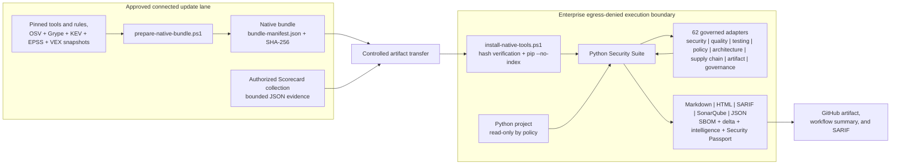
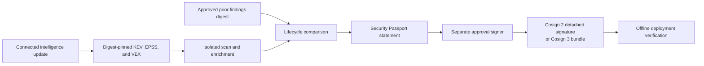
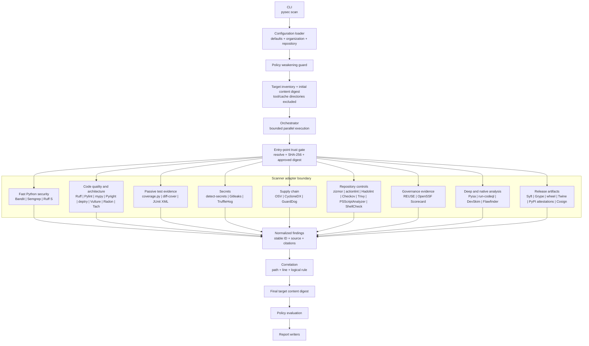
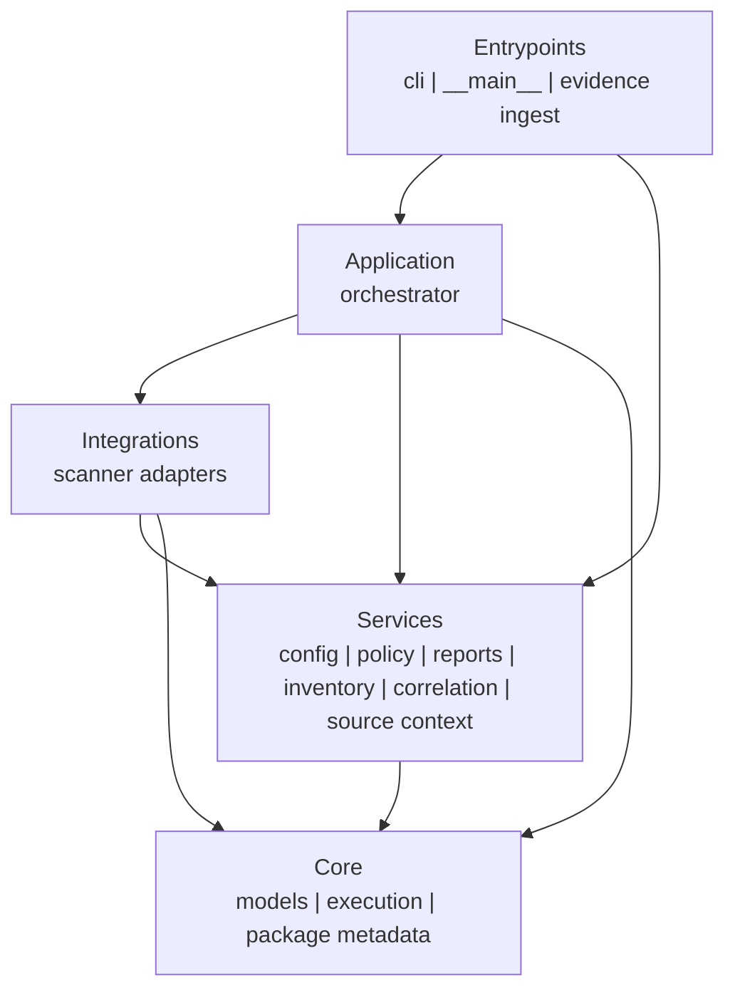
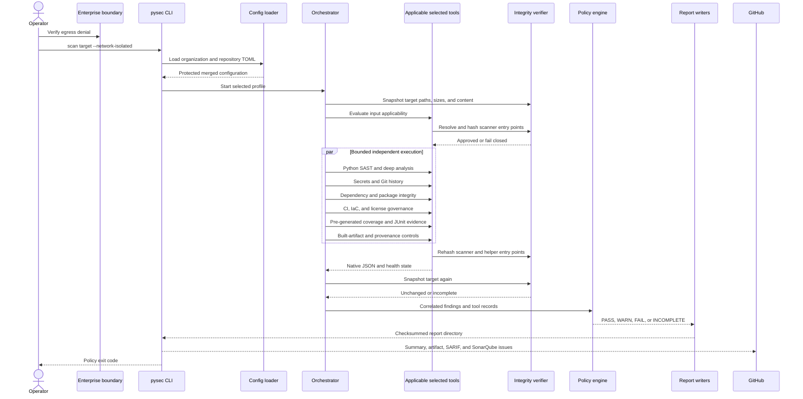
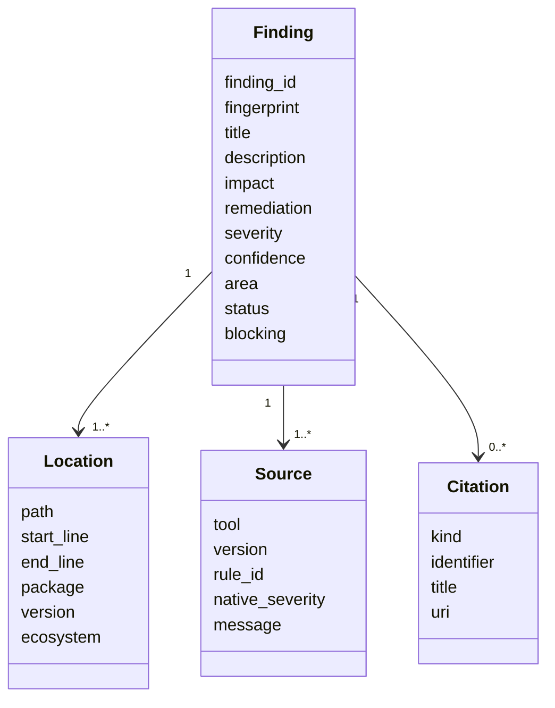
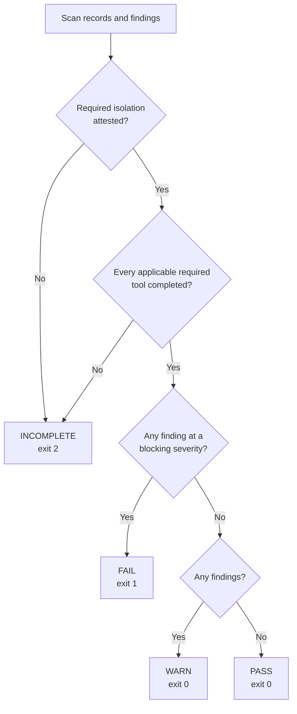
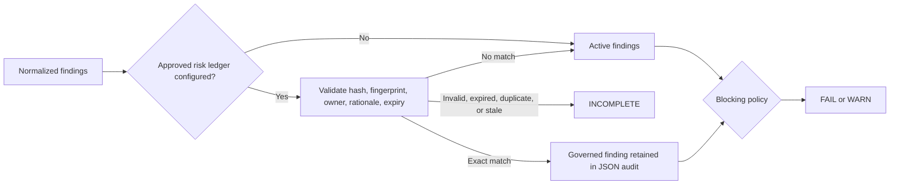

# Python Security Suite design

Status: alpha foundation  
Last reviewed: 2026-08-01

## Purpose

Python Security Suite coordinates several complementary, locally installed
security scanners against Python projects. It normalizes their output into one
finding model, correlates overlapping observations, evaluates an explicit
policy, and writes a self-contained report suitable for humans, automation, and
GitHub artifacts.

The design prioritizes:

- operation inside an externally enforced, egress-denied enterprise boundary;
- no target imports, package installation, dependency resolution, or target
  code execution during a scan;
- independently useful Python code, secret, customizable rule, and dependency
  perspectives;
- deterministic local scanner assets and advisory data;
- honest `INCOMPLETE` results when required evidence or scanner health is
  missing; and
- concise reports that retain traceability to the originating tool, native
  rule, classification, location, version, and reference.

## System context



The scan lane emits an unsigned in-toto Statement using the SLSA Verification
Summary Attestation predicate. A separate approval lane verifies the report and
signs that exact statement with an external Cosign key. Deployment consumers
verify the signature material, statement subject, applied-policy digest, report
checksum manifest, and every referenced evidence digest without running a
scanner.



The connected lane is an acquisition and curation boundary. The execution lane
does not need Docker, a package index, the Semgrep registry, OSV services, or
credential verification services. The native bundle currently targets Windows
x86-64 and Python 3.11.

`--network-isolated` does not enforce network denial. It attests that the
enterprise runner, VM, firewall, or equivalent external control already does.

## Runtime architecture



The orchestrator runs only scanners selected by the active profile. Each
adapter owns command construction, prerequisite checks, entry-point digest
verification, version detection, timeout handling, output parsing,
classification mapping, and scanner-specific remediation guidance. The
entry point is rehashed after execution; a mismatch or mid-scan change fails
closed.

Subprocesses receive a reduced environment and a disposable private home,
app-data, and cache root. Ambient proxy variables and user site packages are
not forwarded. Raw scanner output is not retained in the report; evidence
contains sanitized tool health and output digests.

### Enforced suite architecture

The repository dogfoods Tach with a checked-in [`tach.toml`](../tach.toml).
Every internal dependency is explicit, unconfigured source modules are
forbidden, circular dependencies fail the check, and unused declarations fail
because exact mode is enabled.



Tach findings use the common quality-domain contract: tool and native rule,
classification, file and line, bounded source excerpt, impact, remediation,
and an official rule citation. A boundary change therefore appears as an
actionable report item rather than an opaque scanner failure.

## Scan sequence



## Scanner portfolio

The original quick and standard profiles remain stable. Opt-in profiles layer
additional perspectives:

| Layer | Tools | Contribution |
|---|---|---|
| Standard baseline | Bandit, Semgrep, detect-secrets, OSV-Scanner | Python AST, governed patterns, current-tree secrets, vulnerable dependencies |
| Extended | CycloneDX Python, Ruff, zizmor | SBOM evidence, parser diversity, GitHub workflow security |
| Deep | Pysa, CodeQL through `run-codeql` | Interprocedural and semantic data-flow analysis |
| Supply chain | Trivy, GuardDog, ScanCode, Gitleaks, TruffleHog | IaC, licenses, malicious packages, origin inventory, diverse secret detectors |
| Artifact | Syft, Grype, check-wheel-contents, Twine, PyPI attestations, Cosign | Final-distribution SBOM, vulnerabilities, source parity, contents, metadata, signatures, identity, and provenance |
| Quality, structure, and test evidence | Ruff quality/format, Pylint, mypy, Pyright, deptry, Vulture, Radon, Tach, coverage, diff-cover, JUnit, PSScriptAnalyzer, ShellCheck, actionlint, Hadolint, REUSE | Correctness, formatting, type contracts, dependency declarations, dead code, complexity, dependency boundaries, test adequacy/outcomes, scripts, workflows, containers, and SPDX metadata |
| Deep IaC | Checkov plus Trivy, Hadolint, actionlint, and zizmor | Graph-aware cloud/IaC policies plus independent deployment and pipeline perspectives |
| Governance evidence | OpenSSF Scorecard evidence ingestion | Repository-host controls generated in a separately authorized connected lane |
| Repository insight | Conftest, KICS, pipdeptree, git-sizer, validate-pyproject, Vale, KubeLinter | Organization policy, IaC diversity, environment health, Git scale, packaging metadata, prose, and Kubernetes readiness |
| Trusted-lane evidence | Hypothesis, Schemathesis, CrossHair, Atheris, mutmut, ZAP, pytm, check-manifest, ClamAV, GitHub attestations, in-toto, reproducible builds, final OCI image, YARA | Bounded results from execution- or release-sensitive companion controls |
| Production | Source/repository portfolio plus strict readiness checks | Fail-closed pre-release source gate |
| Release | Comprehensive portfolio plus a required built distribution | Fail-closed artifact promotion gate |

The comprehensive and release profiles select every adapter. Conditional tools
first inspect repository inputs. No matching input produces a visible
`not applicable` record; a missing binary for relevant input produces
`INCOMPLETE`.

Production adds release-context requirements: a full VCS checkout, a
recognized lock plus dependency assurance when dependencies are declared,
configured Pysa analysis for Python source, and medium-or-higher blocking.

Detailed overlap, platform, acquisition, and licensing guidance is maintained
in the [compatibility matrix](compatibility-matrix.md).

Generated reports, native tool environments, virtual environments, dependency
trees, caches, and version-control metadata are excluded where supported to
avoid scanning vendored tools or counting duplicated generated source. Build
and distribution files remain inside the before/after integrity snapshot even
when they are excluded from maintained-source counts.

## Finding model



Every finding has a stable suite ID and fingerprint. Scanner observations at
the same path, line, and logical rule are correlated. Correlation preserves all
unique sources and citations while selecting the strongest severity and
confidence.

Classifications favor native CWE metadata. Adapters add conservative mappings
where a scanner does not supply one, such as CWE-798 for credential findings.

## Policy decision model



Completeness is evaluated before vulnerability severity. A missing, failed,
timed-out, or unparsable applicable required scanner cannot produce a clean
result. A non-applicable conditional tool is explicitly skipped without
weakening completeness. A connected diagnostic may execute all scanners with
`--diagnostic-without-isolation`, but its outcome remains `INCOMPLETE`.

## Report contract

Each scan creates a dedicated directory:

```text
report/
|-- summary.md
|-- action-plan.md
|-- assurance-case.md
|-- index.html
|-- results.sarif
|-- findings.json
|-- scan-manifest.json
|-- checksums.sha256
|-- sbom.cdx.json                  # when CycloneDX is applicable
|-- scancode-inventory.json        # when ScanCode is applicable
|-- pylint-summary.json            # Pylint counts/statistics
|-- radon-complexity.json           # complete rank C+ complexity evidence
|-- coverage-summary.json           # validated pre-generated coverage
|-- junit-summary.json              # validated test result metadata
|-- reuse-compliance.json           # when REUSE opt-in is present
`-- evidence/
    |-- bandit.json
    |-- semgrep.json
    |-- detect-secrets.json
    `-- osv-scanner.json
```

- `summary.md` is optimized for GitHub workflow summaries and rapid triage.
- `action-plan.md` separates prioritized finding remediation from scanner
  coverage-restoration work.
- `assurance-case.md` states what the static scan demonstrated and identifies
  required artifact, provenance, dynamic-test, and threat-review evidence.
- `index.html` is a self-contained complete human report.
- `results.sarif` supports GitHub code-scanning ingestion.
- `findings.json` is the stable machine-readable finding collection.
- `scan-manifest.json` records tool health, versions, inventory, policy
  reasons, timestamps, profile, and isolation attestation.
- `checksums.sha256` protects report integrity after generation.
- `sbom.cdx.json` and `scancode-inventory.json` are governed derived evidence.
- `evidence/*.json` contains sanitized diagnostics and output hashes, not
  secret values or raw scanner output.

The Markdown summary places actionable findings before tool-health detail and
shows the first 20 in full. Each file-backed finding carries a bounded excerpt
with two context lines, exact line numbers, and an affected-line marker.
The HTML report adds a prioritized review table, stable finding anchors,
responsive tables, and a high-contrast source panel. Normalized JSON preserves
the excerpt metadata, while SARIF uses `region` and `contextRegion` snippets for
GitHub code-scanning presentation.

Secret findings never embed the source value. They retain the file and line
citation but replace content with an explicit redaction notice. Source paths
are resolved beneath the target, symlink and traversal escapes are rejected,
common credential assignments in non-secret context are redacted, and line
length and context are bounded. Complete results remain in HTML, JSON, and
SARIF.

## Configuration and policy ownership

Configuration is layered in this order:

1. secure built-in defaults;
2. optional organization policy;
3. optional repository configuration; and
4. an optional CLI profile override.

Repository configuration cannot weaken organization-mandated network denial,
isolation attestation, target-code prohibition, required scanners, blocking
severities, approved risk-ledger digest, or incomplete-scan behavior. Unknown
settings are rejected.



See [configuration.md](configuration.md) for the complete supported schema.

## Security properties

### Controls implemented

- Scanner versions and external native assets are pinned.
- The native installer verifies every bundle entry before installation.
- The installer writes each resolved scanner entry-point SHA-256 to the native
  configuration; production and release profiles require these approved
  bindings, including a separate CodeQL CLI digest.
- Scanner and helper entry points are rehashed after execution.
- The target is content-hashed before and after the scanner portfolio; a
  changed source or distribution artifact makes the result `INCOMPLETE`.
- Native package installation uses `pip --no-index`.
- OSV-Scanner requires a local advisory database and disables resolution.
- OSV and Grype reject missing or older-than-policy database markers.
- `uv.lock` is exported with hash-verified `uv --frozen --offline`; the
  temporary pinned graph is converted by CycloneDX without dependency access.
- Semgrep uses local rules with metrics and version checks disabled.
- detect-secrets disables network verification and redacts candidate values.
- Gitleaks uses full redaction; GuardDog matched code is discarded.
- TruffleHog disables verification and updates and discards raw secret values.
- zizmor is forced offline.
- Trivy disables database, check, VEX, version, and telemetry updates.
- `run-codeql` requires a pre-staged CodeQL CLI and local Python query pack;
  auto-download is rejected and analysis uses a temporary source mirror.
- Syft disables update checks; Grype disables database and application updates
  and requires a staged database.
- PyPI distribution attestations are verified with local provenance and
  `--offline`.
- Target code is never imported or executed by the suite.
- Coverage and JUnit adapters validate only pre-generated evidence. XML DTDs,
  entities, symlinks, oversized inputs, and excessive report counts are
  rejected; test output and failure bodies are never retained.
- Scanner processes receive a low-credential environment without ambient
  proxies and with disposable private home/cache paths.
- Required scanner failure produces `INCOMPLETE`, never `PASS`.
- Production and release require completed revision-bound companion evidence;
  conditional absence cannot silently pass those gates.
- Exact, expiring risk acceptances remain auditable while active SARIF and
  action queues exclude only validated matches.
- A disposable detection corpus proves independent Bandit, Semgrep, and
  detect-secrets findings through the real aggregate path.
- Report overwrite requires a valid suite manifest and rejects unsafe roots.

### Controls supplied by the enterprise platform

- Network egress denial and proof of that boundary.
- CPU, memory, process, and wall-clock quotas beyond per-tool timeouts.
- File-system permissions and read-only source mounts. The suite detects
  content changes but does not itself make a native target read-only.
- Bundle transport, provenance, malware inspection, and approval.
- Artifact retention, access control, signing, and audit logging.

### Residual risks

- SHA-256 manifests and entry-point bindings detect substitution relative to
  an approved digest but are not publisher signatures. A Python console-script
  digest does not cover every imported package file.
- Database refresh still depends on the connected update lane, while maximum
  accepted age is enforced during isolated execution.
- Local rules and advisory snapshots define the achievable coverage.
- Static analysis produces false positives and cannot prove absence of
  vulnerabilities.
- A project without resolved dependency versions limits OSV evidence.
- The current native bundle is Windows x86-64 only.

## Verified implementation state

The native Windows self-scan process verifies:

- the `comprehensive` profile selects all 62 adapters;
- all 35 applicable scanners completed without failures, timeouts, or parse
  errors; 27 conditional scanners were correctly not applicable;
- Pylint, Radon, Ruff formatting, coverage, and JUnit adapters executed through
  approved entry-point bindings and emitted normalized derived evidence;
- the separately generated branch-coverage evidence records 90.93% combined
  line-and-branch coverage and 82.80% branch coverage, satisfying both 80%
  repository gates with no per-file hotspots; JUnit records 249 passing tests,
  one platform-limited symlink skip, and no failures or errors;
- CycloneDX completed from `uv.lock` through a frozen offline export with a
  hash-verified helper; zizmor, actionlint, Pysa, GuardDog, Flawfinder, and
  REUSE were correctly not applicable to this repository and native host;
- CodeQL completed with the staged local CLI/query pack; PyPI attestations were
  correctly not applicable because these dogfood artifacts have no Trusted
  Publisher repository identity;
- Syft and Grype inspected safely expanded wheel and source distributions;
- the artifact manifest bound both distributions by SHA-256;
- all generated report checksums verified and target content remained
  unchanged; and
- the isolated comprehensive outcome was `FAIL` with exactly two blocking
  Cosign findings for intentionally absent wheel and source-distribution
  signatures and no testing-coverage findings; and
- code security, secrets, dependency-vulnerability, architecture, and quality
  perspectives had no findings. Release remains blocked until an approved
  signing lane supplies bundles for both exact artifact digests.

## Expanded implementation state

Adapters, parser fixtures, applicability handling, profiles, attribution, and
offline command construction are implemented for all 62 portfolio tools,
including CodeQL through `run-codeql`, final-distribution controls, seven
repository-health scanners, and trusted-lane evidence adapters including final
OCI-image assurance.

The rollout remains deliberately staged:

1. keep existing quick and standard policy contracts stable;
2. validate `extended` on representative Python repositories;
3. tune organization Pysa models and CodeQL packs before enabling `deep`;
4. approve platform binaries and license policy before enabling
   `supply-chain`; and
5. make `comprehensive` required only after tool availability, runtime, and
   false-positive rates are measured on enterprise runners.
