# Python Security Suite design

Status: alpha foundation  
Last reviewed: 2026-08-12

## Purpose

Python Security Suite coordinates several complementary, locally installed
security scanners against Python projects. It normalizes their output into one
finding model, correlates overlapping observations, evaluates an explicit
policy, and writes a self-contained report suitable for humans, automation, and
GitHub artifacts.

The design prioritizes:

- operation inside an externally enforced, egress-denied enterprise boundary;
- no target imports, package installation, dependency resolution, or target
  code execution during a scan;
- independently useful Python code, secret, customizable rule, and dependency
  perspectives;
- deterministic local scanner assets and advisory data;
- honest `INCOMPLETE` results when required evidence or scanner health is
  missing; and
- concise reports that retain traceability to the originating tool, native
  rule, classification, location, version, and reference.

## System context

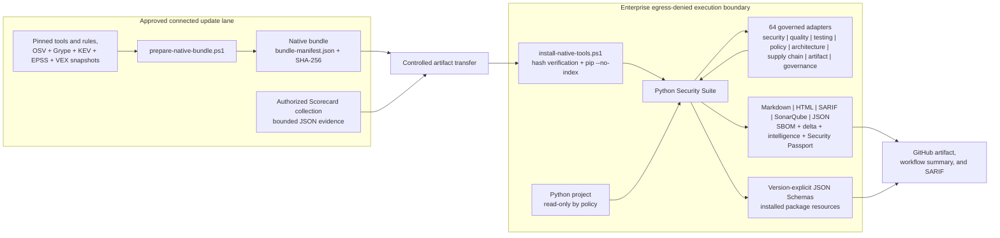

The scan lane emits an unsigned in-toto Statement using the SLSA Verification
Summary Attestation predicate. A separate approval lane verifies the report and
signs that exact statement with an external Cosign key. Deployment consumers
verify the signature material, statement subject, applied-policy digest, report
checksum manifest, exact embedded-statement identity, and every referenced
evidence digest without running a scanner. Subject-containing payload
directories are closed sets for Python distributions: undeclared wheels,
sdists, and zip archives are rejected. The verifier caps directory entries and
samples mismatch details to preserve bounded work and bounded diagnostics.
Machine-facing CLI paths also preserve a stable JSON error envelope, while all
operator-facing errors share bounded control-safe redaction.
Markdown, HTML, and terminal/JSON inspection surface entry-point trust as a
top-level metric, keeping cryptographic approval distinct from a successful
before/after observation. The action plan expands each trust gap into a
risk-ordered remediation row with a compact digest identifier. A collapsed
candidate block retains complete copy-ready SHA-256 values in valid TOML while
making clear that observation is not provenance approval. Terminal inspection
keeps a bounded preview while the JSON inspection contract retains every
affected entry point as a priority-ordered structured action. Candidate-binding
and unique-digest counts make shared executable review work explicit without
collapsing the individual policy bindings. A strict bundled Draft 2020-12
schema and self-identifying offline URN make this output a versioned integration
contract rather than an informal JSON shape. A derived inspection sidecar is
atomically published outside the sealed report, preserving the report's exact
checksum set while giving CI and GitHub artifact consumers a stable standalone
document. Its report entry points and finding anchors are artifact-relative,
preventing runner-path disclosure and preserving links after relocation;
terminal rendering performs local resolution only at the presentation edge.
Offline sidecar verification recomputes this normalized view from the sealed
report and requires exact semantic equality, binding the sidecar digest to the
report checksum digest without confusing consistency with signer authenticity.
A strict report-verification receipt makes checksum and semantic validation
portable without requiring an inspection. A separate strict receipt schema
binds a successful inspection comparison to that sealed report. The `schema`
command retrieves all three contracts from installed package resources and can
atomically stage it for a disconnected consumer. Explicit `1.0` names and URNs
prevent a policy engine from silently selecting a newer contract.

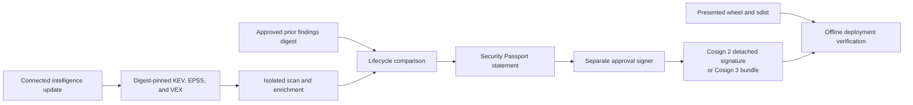

The connected lane is an acquisition and curation boundary. The execution lane
does not need Docker, a package index, the Semgrep registry, OSV services, or
credential verification services. The native bundle currently targets Windows
x86-64 and Python 3.11.

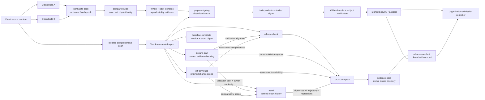

`closure-plan.json` is generated inside the same atomic report publication. It
joins active findings, governance integrity gaps, conditional activation,
coverage hotspots, reachability uncertainty, and changed-file validation
mismatches without becoming an admission decision. For each changed file it
consolidates Graphify-selected tests, exact case results, changed-line and
whole-file coverage, findings, and retained CODEOWNERS rules. Stable work IDs
survive reruns when the underlying issue is unchanged;
authority labels prevent repository automation from self-approving external
signing, isolation, scanner trust, or release controls.

Operational trend 1.3 reads that closure evidence and its retained diff-coverage
assessment scope from each independently verified report. Stable work IDs
distinguish new, resolved, unchanged, and state-transitioned validation subjects
only when both endpoints contain current ledger and assessment evidence;
CODEOWNERS routing produces owner-queue history and ownership deltas only under
that same condition. Debt growth, ownership erosion, failing-test regression,
and missing ledger or scope evidence become explicit anomalies.

The evidence-pack application layer composes existing verified services; it
does not create a second evidence model. Payload files are generated in private
staging, the release manifest binds selected decision records to the report,
the audit archive embeds the sealed report and those records, and the outer
pack manifest closes every readable artifact. Only a fully re-verified staging
tree is atomically renamed into place.

The scan lane produces evidence and candidate requests, never organizational
authority. Platform security attests isolation, security tooling approves exact
scanner entry points, vulnerability management approves intelligence,
controlled signing holds keys, and the release approver owns admission.

`--network-isolated` does not enforce network denial. It attests that the
enterprise runner, VM, firewall, or equivalent external control already does.

Production and release add a second statement: bounded evidence whose SHA-256
is pinned by organization policy, whose target and source digest match this
scan, and whose validity window covers scan start. Repository configuration
cannot promote its own evidence to `organization_approved`. Intelligence
approval uses the same authority split and binds the exact KEV, EPSS, and VEX
snapshot set.

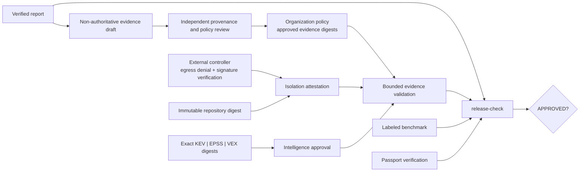

Scanner identity carries two independent facts through the manifest: whether
the observed executable matched a configured digest, and whether that digest
originated in organization policy. The release gate requires both plus an
unchanged post-execution digest. This prevents a repository from approving its
own toolchain while preserving useful local tamper detection.

## Runtime architecture

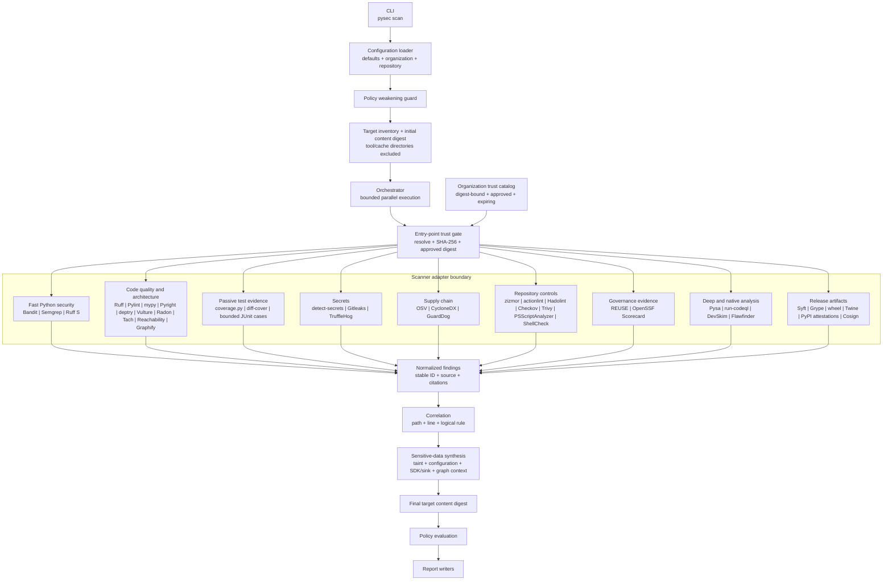

The orchestrator runs only scanners selected by the active profile. Each
adapter owns command construction, prerequisite checks, entry-point digest
verification, version detection, timeout handling, output parsing,
classification mapping, and scanner-specific remediation guidance. The
entry point is rehashed after execution; a mismatch or mid-scan change fails
closed.

Subprocesses receive a reduced environment and a disposable private home,
app-data, and cache root. Ambient proxy variables and user site packages are
not forwarded. A timeout or interruption terminates the scanner's complete
process tree and waits for cleanup, preventing orphaned child analyzers. Raw
scanner output is not retained in the report; evidence contains sanitized tool
health and output digests.

### Enforced suite architecture

The repository dogfoods Tach with a checked-in [`tach.toml`](../tach.toml).

Cross-tool joins are governed by the
[evidence-fusion contract](evidence-fusion.md). The fusion layer links semantic
classifications, source and artifact package inventories, exact artifact
digests, changed-line coverage, runtime observations, complexity, ownership,
and graph neighborhoods. It emits explanatory triage context without changing
scanner severity or treating missing observations as negative evidence.
Every internal dependency is explicit, unconfigured source modules are
forbidden, circular dependencies fail the check, and unused declarations fail
because exact mode is enabled.

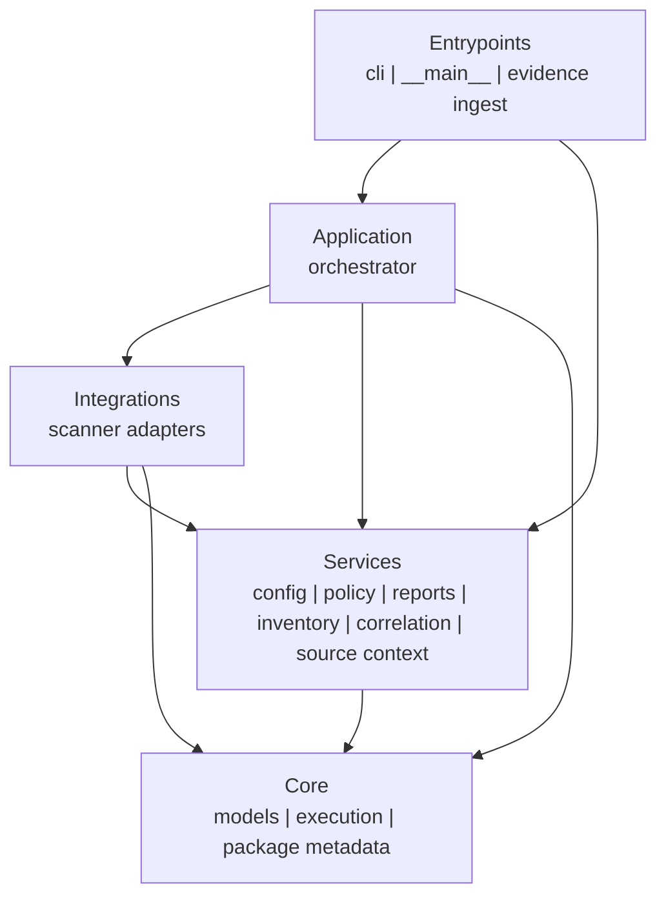

Tach findings use the common quality-domain contract: tool and native rule,
classification, file and line, bounded source excerpt, impact, remediation,
and an official rule citation. A boundary change therefore appears as an
actionable report item rather than an opaque scanner failure.

The bundled [reachability analyzer](reachability.md) adds a second structural
view. It follows bounded, typed AST edges from declared or discovered application
roots and separates executable, load-only, and disconnected code. Direct calls,
constructor lifecycle, concrete imported/local receivers, bounded polymorphic
dispatch, callback references, literal internal dynamic imports, and recognized
framework configuration or registration are distinct from imports and
definitions. Statically false and `TYPE_CHECKING` branches are pruned. Every node
and edge explains its confidence and predecessor. Optional coverage.py JSON adds
observed, not-observed, or not-measured corroboration. The sealed
`reachability.json` records representative execution sequences, applied precision
features, and ranked islands with removal readiness, blockers, and ordered actions
without importing or executing target code.

[Static risk-route synthesis](risk-paths.md) combines the complementary graph
views after finding, structural, exposure, and evidence-fusion enrichment. A
bounded multi-source search starts at declared reachability entry points and
walks deterministic Graphify file relations to normalized findings,
review-worthy sensitive-data sinks, and evidence-fusion advisory importer
paths. Each route carries runtime state, changed-
line and coverage evidence, focused tests, validation gaps, owners, related
findings, and exact supporting artifacts. Unrouted targets remain explicit
model gaps; neither a route nor its absence is treated as an exploitability or
safety verdict. Routes converging on the same non-entry file become bounded
shared control points with one cross-target validation action. Exact route and
hotspot IDs are also grouped into owner queues so teams can coordinate one
remediation/test campaign without collapsing the underlying findings. Each
hotspot also becomes a stable validation campaign: reverse Graphify edges select
direct/transitive tests, bounded case inventories establish observed execution,
file coverage exposes unexercised shared-control code, and structural synthesis
adds changed-line risk while reachability contributes runtime observation state.
The factorized review model cites each contributing artifact and keeps the native
findings unchanged.

Package findings frequently point at a lockfile rather than executable source.
Risk-route synthesis now uses alias-aware advisory clusters as the identity
boundary and promotes each exact Graphify importer path as a bounded target.
The resulting route retains KEV/EPSS/VEX context, dependency lineage,
scanner-attributed fixes, citations, owners, tests, coverage, and validation;
it links back to every native cluster finding without duplicating the finding.
This answers “which entry point reaches an affected package importer?” while
explicitly leaving vulnerable-function invocation and exploitability unproven.

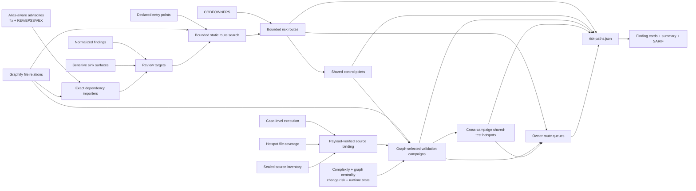

[Structural synthesis](structural-synthesis.md) then cross-validates these islands
and Vulture candidates against Graphify references, runtime coverage, Radon
complexity, Tach boundaries, ownership, and security findings. This produces
advisory removal/dynamic-use dispositions, latent attack-surface classifications,
and import-cycle hotspots without changing native scanner severity. Schema 1.2
also joins diff coverage to reverse Graphify paths for direct/transitive test
selection and compound change-risk scoring, discovers conservative structural
orphans, retains concrete island boundary evidence for missing-root versus
test-only triage, and cross-checks selected tests against exact case execution
and changed-line coverage.

[Sensitive-data exposure synthesis](data-exposure.md) adds a distinct disclosure
view. Bundled Semgrep rules establish credential, private-field, and request
collection paths into logs, telemetry, and URL queries; detect raw exception
responses and risky automatic-PII configuration; and allow Pysa/CodeQL to supply
organization models. A bounded AST inventory identifies logging, process-output,
observability, analytics, metrics, URL-query, client-response, header-capture,
and egress SDK surfaces without treating presence as a finding. The synthesis
joins exact sink and SDK evidence to Graphify, reachability, coverage, runtime,
changed-code, and related-finding context. Finalized evidence-fusion results
feed back into the exposure artifact as triage tiers and contextual verification
plans. Inventory-only sink surfaces receive the same bounded structural/test
context and evidence-specific verification steps for review ordering, but remain
explicitly separate from vulnerabilities. Structural synthesis and CODEOWNERS
also contribute accountable owners, exact graph-selected tests, change-risk
scores, and island/import-cycle identifiers, turning triage into a bounded
owner-and-test handoff. Finalized source/artifact lineage and normalized package
findings add a separate SDK dependency lane with advisory citations and explicit
matched-versus-risk semantics. Package-scoped CVE/GHSA/PYSEC/OSV alias clusters
prevent reciprocal advisory records from overstating distinct risk while
retaining every scanner source and enabling OSV/Grype corroboration.
Those clusters also join CycloneDX dependency roots, exact Graphify import
edges, importing-file reachability/runtime state, and deptry findings. The
result is actionable dependency-use context with explicit incomplete and
conflicting states, never an exploitability verdict or severity override.
OSV and Grype fixed-version records plus approved offline KEV, EPSS, and VEX
then form a per-advisory remediation context. It retains scanner attribution,
uses the established P0-P4 priority model, adapts the action to dependency-use
evidence, and carries uncertainties and verification steps. It deliberately
does not guess a minimum safe version, accept VEX without scoped validation, or
change native severity.
Reverse Graphify edges then map each exact importing file to direct/transitive
tests, while retained coverage and CODEOWNERS-derived finding ownership provide
validation gaps and responsible teams. The closure plan keys work by advisory
cluster, consolidating alias-equivalent observations without dropping native
finding IDs or scanner attribution.
It separately keys changed-file validation work by repository path, merging an
overlapping whole-file coverage hotspot into the same owned item. Release
readiness consumes these items as a causal validation-alignment control and
retains their owner, priority, action, and evidence references.
Native Coverage/diff-cover findings for that path are folded into the same work
item with their IDs and scanner attribution but remain unchanged in the finding
ledger.
The human closure view rolls exact subjects up by owner and validation state.
Release readiness 1.3 then groups remediation only across identical owner,
priority, authority, action, and causal blocker tuples. Each group retains stable
closure-item references before bounded source and artifact citations.
Evidence-fusion 1.3 also joins those graph-selected test files to exact,
repository-normalized case records from JUnit, Hypothesis, and Schemathesis.
It reports current passing, failing, incomplete, unobserved, unavailable, or
unselected evidence while preserving the requirement to rerun after remediation.
Aggregate totals cannot establish that any particular selected file executed.
Passing selected tests whose affected dependency import paths remain uncovered
are reported as an explicit validation mismatch.
CWE/OWASP/OpenTelemetry-backed actions remain
independent of native scanner severity and no sensitive values are retained.

## Scan sequence

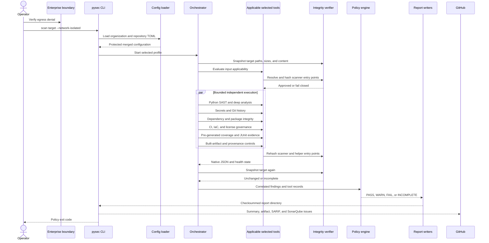

## Scanner portfolio

The original quick and standard profiles remain stable. Opt-in profiles layer
additional perspectives:

| Layer | Tools | Contribution |
|---|---|---|
| Standard baseline | Bandit, Semgrep, detect-secrets, OSV-Scanner | Python AST, governed patterns, current-tree secrets, vulnerable dependencies |
| Extended | CycloneDX Python, Ruff, zizmor | SBOM evidence, parser diversity, GitHub workflow security |
| Deep | Pysa, CodeQL through `run-codeql` | Interprocedural and semantic data-flow analysis |
| Supply chain | Trivy, GuardDog, ScanCode, Gitleaks, TruffleHog | IaC, licenses, malicious packages, origin inventory, diverse secret detectors |
| Artifact | Syft, Grype, check-wheel-contents, Twine, PyPI attestations, Cosign | Final-distribution SBOM, vulnerabilities, source parity, contents, metadata, signatures, identity, and provenance |
| Quality, structure, and test evidence | Ruff quality/format, Pylint, mypy, Pyright, deptry, Vulture, Radon, Tach, reachability, Graphify, coverage, diff-cover, JUnit, PSScriptAnalyzer, ShellCheck, actionlint, Hadolint, REUSE | Correctness, formatting, type contracts, dependency declarations, dead code, entry-point sequences, disconnected islands, graph impact, complexity, dependency boundaries, test adequacy/outcomes, scripts, workflows, containers, and SPDX metadata |
| Deep IaC | Checkov plus Trivy, Hadolint, actionlint, and zizmor | Graph-aware cloud/IaC policies plus independent deployment and pipeline perspectives |
| Governance evidence | OpenSSF Scorecard evidence ingestion | Repository-host controls generated in a separately authorized connected lane |
| Repository insight | Conftest, KICS, pipdeptree, git-sizer, validate-pyproject, Vale, KubeLinter | Organization policy, IaC diversity, environment health, Git scale, packaging metadata, prose, and Kubernetes readiness |
| Trusted-lane evidence | Hypothesis, Schemathesis, CrossHair, Atheris, mutmut, ZAP, pytm, check-manifest, ClamAV, GitHub attestations, in-toto, reproducible builds, final OCI image, YARA | Bounded results from execution- or release-sensitive companion controls |
| Production | Source/repository portfolio plus strict readiness checks | Fail-closed pre-release source gate |
| Release | Comprehensive portfolio plus a required built distribution | Fail-closed artifact promotion gate |

The comprehensive and release profiles select every adapter. Conditional tools
first inspect repository inputs. No matching input produces a visible
`not applicable` record; a missing binary for relevant input produces
`INCOMPLETE`.

Production adds release-context requirements: a full VCS checkout, a
recognized lock plus dependency assurance when dependencies are declared,
configured Pysa analysis for Python source, and medium-or-higher blocking.

Detailed overlap, platform, acquisition, and licensing guidance is maintained
in the [compatibility matrix](compatibility-matrix.md).

Generated reports, native tool environments, virtual environments, dependency
trees, caches, and version-control metadata are excluded where supported to
avoid scanning vendored tools or counting duplicated generated source. Build
and distribution files remain inside the before/after integrity snapshot even
when they are excluded from maintained-source counts.

## Finding model

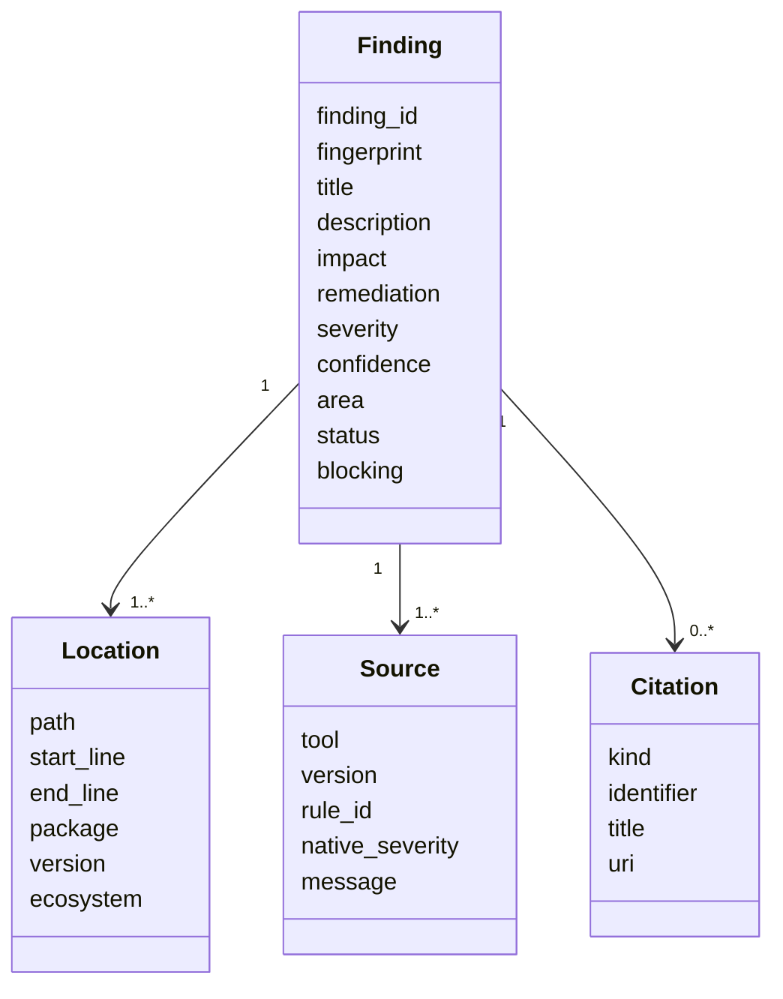

Every finding has a stable suite ID and fingerprint. Scanner observations at
the same path, line, and logical rule are correlated. Correlation preserves all
unique sources and citations while selecting the strongest severity and
confidence.

Classifications favor native CWE metadata. Adapters add conservative mappings
where a scanner does not supply one, such as CWE-798 for credential findings.

## Policy decision model

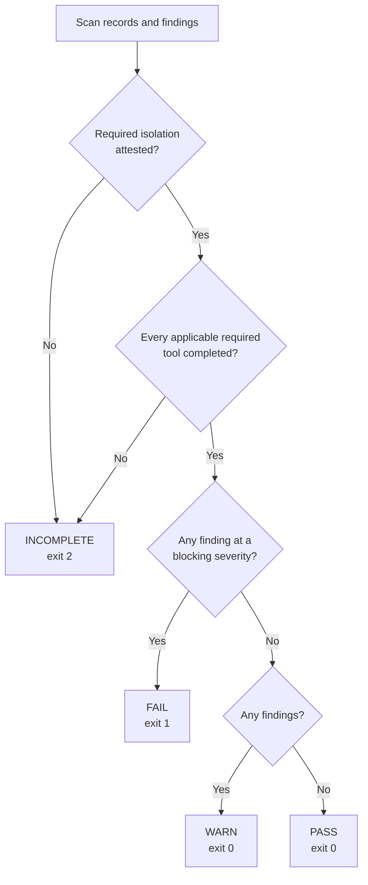

Completeness is evaluated before vulnerability severity. A missing, failed,
timed-out, or unparsable applicable required scanner cannot produce a clean
result. A non-applicable conditional tool is explicitly skipped without
weakening completeness. A connected diagnostic may execute all scanners with
`--diagnostic-without-isolation`, but its outcome remains `INCOMPLETE`.

## Report contract

Each scan creates a dedicated directory:

```text
report/
|-- summary.md
|-- action-plan.md
|-- assurance-case.md
|-- index.html
|-- results.sarif
|-- findings.json
|-- scan-manifest.json
|-- checksums.sha256
|-- sbom.cdx.json                  # when CycloneDX is applicable
|-- scancode-inventory.json        # when ScanCode is applicable
|-- pylint-summary.json            # Pylint counts/statistics
|-- radon-complexity.json           # complete rank C+ complexity evidence
|-- reachability.json               # three-state topology, explanations, coverage, and islands
|-- graphify.json                    # validated code-only topology
|-- graph-analysis.json              # graph-aware finding neighborhoods
|-- risk-paths.json                  # entry routes, shared campaigns, owners, and validation gaps
|-- structural-synthesis.json        # dead code, island boundaries, change risk, and test targets
|-- data-exposure.json               # sensitive-data paths and SDK/sink review surfaces
|-- evidence-fusion.json             # semantic and cross-stage evidence joins
|-- coverage-summary.json           # validated pre-generated coverage
|-- junit-summary.json              # bounded output-free test case/file/result ledger
|-- reuse-compliance.json           # when REUSE opt-in is present
`-- evidence/
    |-- bandit.json
    |-- semgrep.json
    |-- detect-secrets.json
    `-- osv-scanner.json
```

Inspection sidecars, both verification receipts, and exported schemas remain beside
this directory rather than inside it. This preserves the sealed report's exact
file set. The CLI exports schemas from package resources with this flow:

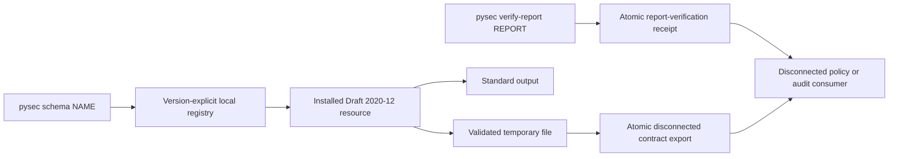

- `summary.md` is optimized for GitHub workflow summaries and rapid triage; it
  leads with the scan-policy disposition and separates applicable execution
  gaps from conditional controls that did not match the repository.
- `action-plan.md` separates prioritized finding remediation from scanner
  coverage-restoration work and collapses informational not-applicable rows
  without removing their reasons, re-enable conditions, or references. It binds
  artifact findings to complete immutable identities and groups scanner approval
  candidates into unique-digest provenance review batches before presenting the
  copy-ready policy bindings. Finding rows retain ownership and an authoritative
  reference alongside risk, lifecycle, and classification context. Ownership
  coverage and priority-bucketed queues surface assignment gaps, while each
  provenance batch records the observed tool version.
- `assurance-case.md` states what the static scan demonstrated and identifies
  required artifact, provenance, dynamic-test, and threat-review evidence. Its
  next actions are evidence-aware: completed clean controls retain evidence,
  active findings require remediation, and partial controls preserve both
  coverage-restoration and finding-remediation work.
- `index.html` is a self-contained complete human report with an explicit
  decision badge, a balanced scanner-health summary, actionable coverage gaps,
  and expandable not-applicable control evidence.
- Source findings show highlighted, line-numbered context. Binary artifact
  findings instead show the exact normalized path, SHA-256, and byte size; they
  never imply that a source line exists for a wheel or archive.
- `results.sarif` supports GitHub code-scanning ingestion.
- `findings.json` is the stable machine-readable finding collection.
- `source-inventory.json` binds each maintained source path, byte size, and
  SHA-256 to the aggregate source digest and supports non-invented clean-corpus
  labels without retaining source contents. It is a canonical required report
  artifact, not optional derived evidence; independent verification recomputes
  its bounded, strictly sorted, duplicate-free aggregate and manifest binding.
- `scan-manifest.json` records tool health, versions, inventory, policy
  reasons, timestamps, profile, and isolation attestation.
- `checksums.sha256` protects report integrity after generation. Verification
  also requires every canonical artifact and its exact scan-manifest binding,
  plus every declared derived file or directory. Missing, duplicated, linked,
  ambiguous, or boundary-crossing bindings are rejected, so a self-consistent
  but partial report cannot be presented as complete.
- `security-passport.json` is parsed and validated as an in-toto/SLSA statement;
  its exact input digest set and source, policy, outcome, profile, findings,
  tool-status, intelligence, and baseline claims must agree with the manifest.
  Its duplicate-free subject set must exactly match the source inventory and
  every distribution digest in `artifact-manifest.json`.
- `sbom.cdx.json` and `scancode-inventory.json` are governed derived evidence.
- `evidence/*.json` contains sanitized diagnostics and output hashes, not
  secret values or raw scanner output.

The Markdown summary places actionable findings before tool-health detail and
shows the first 20 in full. Each file-backed finding carries a bounded excerpt
with two context lines, exact line numbers, and an affected-line marker.
The HTML report adds a prioritized review table, stable finding anchors,
responsive tables, and a high-contrast source panel. Normalized JSON preserves
the excerpt metadata, while SARIF uses `region` and `contextRegion` snippets for
GitHub code-scanning presentation.

Secret findings never embed the source value. They retain the file and line
citation but replace content with an explicit redaction notice. Source paths
are resolved beneath the target, symlink and traversal escapes are rejected,
common credential assignments in non-secret context are redacted, and line
length and context are bounded. Complete results remain in HTML, JSON, and
SARIF.

## Configuration and policy ownership

Configuration is layered in this order:

1. secure built-in defaults;
2. optional organization policy;
3. optional repository configuration; and
4. an optional CLI profile override.

Repository configuration cannot weaken organization-mandated network denial,
isolation attestation, target-code prohibition, required scanners, blocking
severities, approved risk-ledger digest, or incomplete-scan behavior. Unknown
settings are rejected.

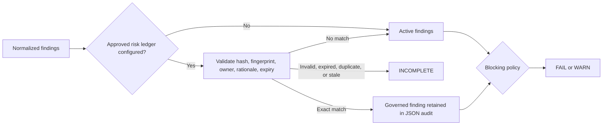

See [configuration.md](configuration.md) for the complete supported schema.

## Security properties

### Controls implemented

- Scanner versions and external native assets are pinned.
- The native installer verifies every bundle entry before installation.
- The installer writes each resolved scanner entry-point SHA-256 to the native
  configuration; production and release profiles require these approved
  bindings, including a separate CodeQL CLI digest.
- Scanner and helper entry points are rehashed after execution.
- Multi-artifact verifiers preserve that invariant when prerequisite evidence is
  absent: Cosign rehashes its entry point after the version probe even when
  every artifact is missing a bundle and no `verify-blob` command can be issued.
- The target is content-hashed before and after the scanner portfolio; a
  changed source or distribution artifact makes the result `INCOMPLETE`.
- Native package installation uses `pip --no-index`.
- OSV-Scanner requires a local advisory database and disables resolution.
- OSV rejects missing or older-than-policy database markers; Grype reads the
  authoritative internal database build timestamp so copied stale databases
  cannot appear fresh from their filesystem metadata.
- `uv.lock` is exported with hash-verified `uv --frozen --offline`; the
  temporary pinned graph is converted by CycloneDX without dependency access.
- Semgrep uses local rules with metrics and version checks disabled.
- detect-secrets disables network verification and redacts candidate values.
- Gitleaks uses full redaction; GuardDog matched code is discarded.
- TruffleHog disables verification and updates and discards raw secret values.
- zizmor is forced offline.
- Trivy disables database, check, VEX, version, and telemetry updates.
- `run-codeql` requires a pre-staged CodeQL CLI and local Python query pack;
  auto-download is rejected and analysis uses a temporary source mirror.
- Syft disables update checks; Grype disables database and application updates
  and requires a staged database.
- PyPI distribution attestations are verified with local provenance and
  `--offline`.
- Target code is never imported or executed by the suite.
- Coverage and JUnit adapters validate only pre-generated evidence. XML DTDs,
  entities, symlinks, oversized inputs, and excessive report counts are
  rejected; test output and failure bodies are never retained.
- Scanner processes receive a low-credential environment without ambient
  proxies and with disposable private home/cache paths.
- Required scanner failure produces `INCOMPLETE`, never `PASS`.
- Production and release require completed revision-bound companion evidence;
  conditional absence cannot silently pass those gates.
- Exact, expiring risk acceptances remain auditable while active SARIF and
  action queues exclude only validated matches.
- A disposable detection corpus proves independent Bandit, Semgrep, and
  detect-secrets findings through the real aggregate path.
- Report overwrite requires a valid suite manifest and rejects unsafe roots or
  linked destinations. Report publication is failure-atomic: a private sibling
  staging tree is checksummed, then its checksum chain and manifest are read
  back and verified before the final rename; a destination that appears during
  rendering is never overwritten.

### Controls supplied by the enterprise platform

- Network egress denial and proof of that boundary.
- CPU, memory, process, and wall-clock quotas beyond per-tool timeouts.
- File-system permissions and read-only source mounts. The suite detects
  content changes but does not itself make a native target read-only.
- Bundle transport, provenance, malware inspection, and approval.
- Artifact retention, access control, signing, and audit logging.

### Residual risks

- SHA-256 manifests and entry-point bindings detect substitution relative to
  an approved digest but are not publisher signatures. A Python console-script
  digest does not cover every imported package file.
- Database refresh still depends on the connected update lane, while maximum
  accepted age is enforced during isolated execution.
- Local rules and advisory snapshots define the achievable coverage.
- Static analysis produces false positives and cannot prove absence of
  vulnerabilities.
- A project without resolved dependency versions limits OSV evidence.
- The current native bundle is Windows x86-64 only.

## Verified implementation state

The native Windows self-scan process verifies:

- the `comprehensive` profile selects all 64 adapters;
- the latest readiness assessment identifies 37 applicable controls and 26
  conditional or content-not-applicable controls, with no unavailable scanner;
- Pylint, Radon, Ruff formatting, coverage, and JUnit adapters executed through
  unchanged observed entry-point bindings and emitted normalized derived
  evidence; organization approval remains an external decision;
- the separately generated branch-coverage evidence records 90.07% combined
  line-and-branch coverage across 13,486 statements and 4,558 branches,
  including 92.98% statement and 81.48% branch coverage; JUnit records 495
  collected tests, 494 passes, one platform-limited skip, and no failures or
  errors;
- CycloneDX completed from `uv.lock` through a frozen offline export with a
  hash-verified helper; zizmor, actionlint, Pysa, GuardDog, Flawfinder, and
  REUSE were correctly not applicable to this repository and native host;
- CodeQL completed with the staged local CLI/query pack; PyPI attestations were
  correctly not applicable because these dogfood artifacts have no Trusted
  Publisher repository identity;
- Syft and Grype inspected safely expanded wheel and source distributions;
- two fixed-epoch builds produced identical wheels and, after deterministic
  metadata normalization, identical source distributions; the artifact
  manifest bound both distributions by SHA-256;
- all generated report checksums verified and target content remained
  unchanged;
- every observed scanner and helper entry point was confirmed unchanged after
  execution; each remains explicitly routed as independent
  provenance-approval work rather than being locally self-approved;
- the 2026-08-10 comprehensive outcome was `INCOMPLETE` solely because the
  required external network-isolation attestation was absent; fresh local
  intelligence and complete scanner execution did not weaken that boundary;
- exactly two high-severity Cosign observations remain for intentionally absent
  wheel and source-distribution bundles, with no testing-coverage findings; and
- the bundled reachability analyzer completed its schema-1.2 three-state model
  at medium confidence because bounded polymorphic dispatch was used: four
  entry points, no disconnected code, and no reportable islands; coverage
  corroborated every executable node and nearly every load-only node; and
- code security, secrets, dependency-vulnerability, architecture, and quality
  perspectives had no unresolved repository finding. `closure-plan.json`
  preserves the remaining governed and conditional work as stable owned
  actions. Release remains blocked until the external
  isolation authority attests the exact run, the scanner identities are
  independently approved, and a controlled signing lane supplies bundles for
  both exact artifact digests.

## Expanded implementation state

Adapters, parser fixtures, applicability handling, profiles, attribution, and
offline command construction are implemented for all 64 portfolio tools,
including CodeQL through `run-codeql`, final-distribution controls, seven
repository-health scanners, and trusted-lane evidence adapters including final
OCI-image assurance.

The rollout remains deliberately staged:

1. keep existing quick and standard policy contracts stable;
2. validate `extended` on representative Python repositories;
3. tune organization Pysa models and CodeQL packs before enabling `deep`;
4. approve platform binaries and license policy before enabling
   `supply-chain`; and
5. make `comprehensive` required only after tool availability, runtime, and
   false-positive rates are measured on enterprise runners.
