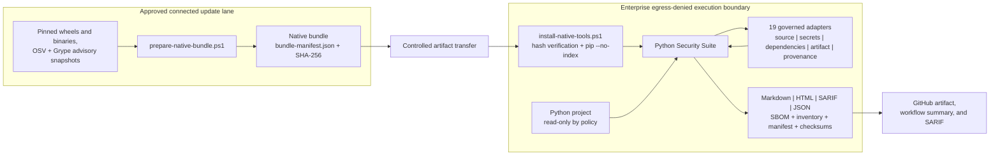
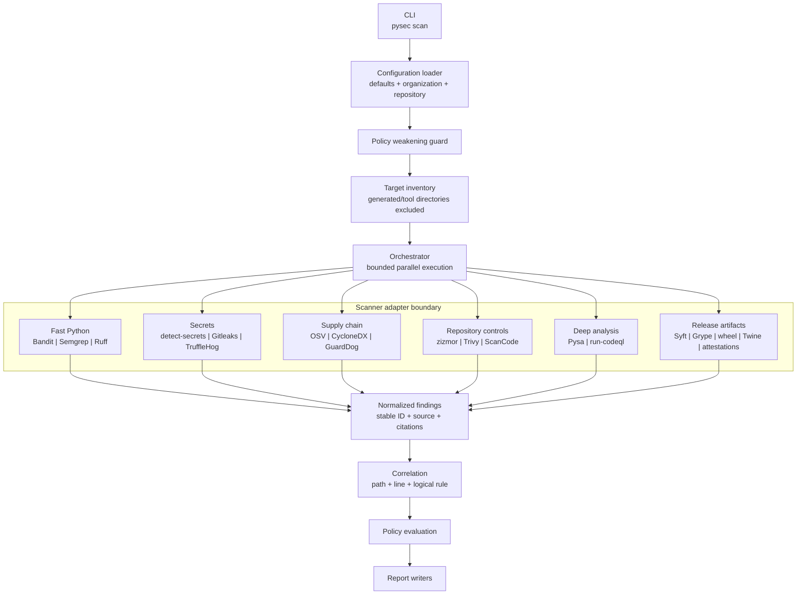
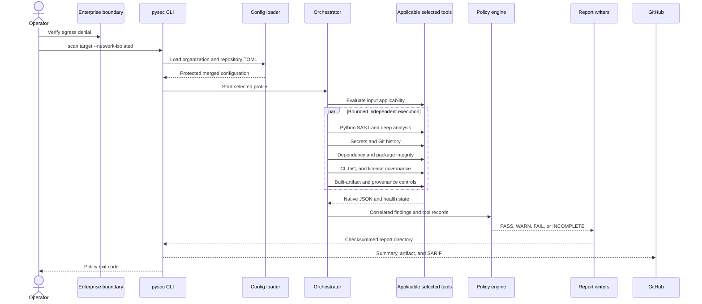
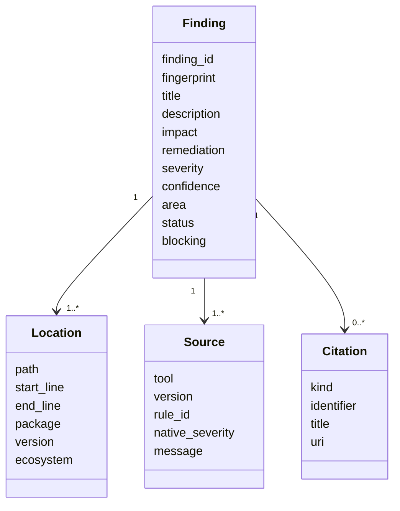
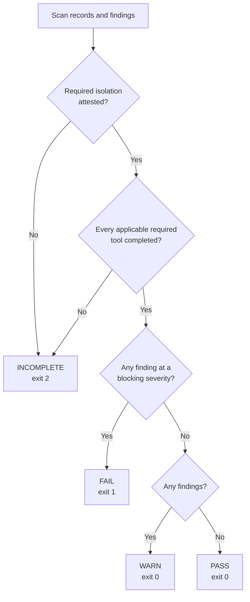

# Python Security Suite design

Status: alpha foundation  
Last reviewed: 2026-07-23

## Purpose

Python Security Suite coordinates several complementary, locally installed
security scanners against Python projects. It normalizes their output into one
finding model, correlates overlapping observations, evaluates an explicit
policy, and writes a self-contained report suitable for humans, automation, and
GitHub artifacts.

The design prioritizes:

- operation inside an externally enforced, egress-denied enterprise boundary;
- no target imports, package installation, dependency resolution, or target
  code execution during a scan;
- independently useful Python code, secret, customizable rule, and dependency
  perspectives;
- deterministic local scanner assets and advisory data;
- honest `INCOMPLETE` results when required evidence or scanner health is
  missing; and
- concise reports that retain traceability to the originating tool, native
  rule, classification, location, version, and reference.

## System context



The connected lane is an acquisition and curation boundary. The execution lane
does not need Docker, a package index, the Semgrep registry, OSV services, or
credential verification services. The native bundle currently targets Windows
x86-64 and Python 3.11.

`--network-isolated` does not enforce network denial. It attests that the
enterprise runner, VM, firewall, or equivalent external control already does.

## Runtime architecture



The orchestrator runs only scanners selected by the active profile. Each
adapter owns command construction, prerequisite checks, version detection,
timeout handling, output parsing, classification mapping, and scanner-specific
remediation guidance.

Subprocesses receive a reduced environment and a disposable private home,
app-data, and cache root. Ambient proxy variables and user site packages are
not forwarded. Raw scanner output is not retained in the report; evidence
contains sanitized tool health and output digests.

## Scan sequence



## Scanner portfolio

The original quick and standard profiles remain stable. Opt-in profiles layer
additional perspectives:

| Layer | Tools | Contribution |
|---|---|---|
| Standard baseline | Bandit, Semgrep, detect-secrets, OSV-Scanner | Python AST, governed patterns, current-tree secrets, vulnerable dependencies |
| Extended | CycloneDX Python, Ruff, zizmor | SBOM evidence, parser diversity, GitHub workflow security |
| Deep | Pysa, CodeQL through `run-codeql` | Interprocedural and semantic data-flow analysis |
| Supply chain | Trivy, GuardDog, ScanCode, Gitleaks, TruffleHog | IaC, licenses, malicious packages, origin inventory, diverse secret detectors |
| Artifact | Syft, Grype, check-wheel-contents, Twine, PyPI attestations | Final-distribution SBOM, vulnerabilities, contents, metadata, and provenance |
| Production | Source/repository portfolio plus strict readiness checks | Fail-closed pre-release source gate |
| Release | Comprehensive portfolio plus a required built distribution | Fail-closed artifact promotion gate |

The comprehensive and release profiles select every adapter. Conditional tools
first inspect repository inputs. No matching input produces a visible
`not applicable` record; a missing binary for relevant input produces
`INCOMPLETE`.

Production adds release-context requirements: a full VCS checkout, a
recognized lock plus dependency assurance when dependencies are declared,
configured Pysa analysis for Python source, and medium-or-higher blocking.

Detailed overlap, platform, acquisition, and licensing guidance is maintained
in the [compatibility matrix](compatibility-matrix.md).

Generated reports, native tool environments, virtual environments, dependency
trees, build output, and version-control metadata are excluded where supported
to avoid scanning vendored tools or counting duplicated generated source.

## Finding model



Every finding has a stable suite ID and fingerprint. Scanner observations at
the same path, line, and logical rule are correlated. Correlation preserves all
unique sources and citations while selecting the strongest severity and
confidence.

Classifications favor native CWE metadata. Adapters add conservative mappings
where a scanner does not supply one, such as CWE-798 for credential findings.

## Policy decision model



Completeness is evaluated before vulnerability severity. A missing, failed,
timed-out, or unparsable applicable required scanner cannot produce a clean
result. A non-applicable conditional tool is explicitly skipped without
weakening completeness. A connected diagnostic may execute all scanners with
`--diagnostic-without-isolation`, but its outcome remains `INCOMPLETE`.

## Report contract

Each scan creates a dedicated directory:

```text
report/
|-- summary.md
|-- action-plan.md
|-- assurance-case.md
|-- index.html
|-- results.sarif
|-- findings.json
|-- scan-manifest.json
|-- checksums.sha256
|-- sbom.cdx.json                  # when CycloneDX is applicable
|-- scancode-inventory.json        # when ScanCode is applicable
`-- evidence/
    |-- bandit.json
    |-- semgrep.json
    |-- detect-secrets.json
    `-- osv-scanner.json
```

- `summary.md` is optimized for GitHub workflow summaries and rapid triage.
- `action-plan.md` separates prioritized finding remediation from scanner
  coverage-restoration work.
- `assurance-case.md` states what the static scan demonstrated and identifies
  required artifact, provenance, dynamic-test, and threat-review evidence.
- `index.html` is a self-contained complete human report.
- `results.sarif` supports GitHub code-scanning ingestion.
- `findings.json` is the stable machine-readable finding collection.
- `scan-manifest.json` records tool health, versions, inventory, policy
  reasons, timestamps, profile, and isolation attestation.
- `checksums.sha256` protects report integrity after generation.
- `sbom.cdx.json` and `scancode-inventory.json` are governed derived evidence.
- `evidence/*.json` contains sanitized diagnostics and output hashes, not
  secret values or raw scanner output.

The Markdown summary shows the first 20 findings in actionable detail. Complete
results remain in HTML, JSON, and SARIF.

## Configuration and policy ownership

Configuration is layered in this order:

1. secure built-in defaults;
2. optional organization policy;
3. optional repository configuration; and
4. an optional CLI profile override.

Repository configuration cannot weaken organization-mandated network denial,
isolation attestation, target-code prohibition, required scanners, blocking
severities, or incomplete-scan behavior. Unknown settings are rejected.

See [configuration.md](configuration.md) for the complete supported schema.

## Security properties

### Controls implemented

- Scanner versions and external native assets are pinned.
- The native installer verifies every bundle entry before installation.
- Native package installation uses `pip --no-index`.
- OSV-Scanner requires a local advisory database and disables resolution.
- Semgrep uses local rules with metrics and version checks disabled.
- detect-secrets disables network verification and redacts candidate values.
- Gitleaks uses full redaction; GuardDog matched code is discarded.
- TruffleHog disables verification and updates and discards raw secret values.
- zizmor is forced offline.
- Trivy disables database, check, VEX, version, and telemetry updates.
- `run-codeql` requires a pre-staged CodeQL CLI and local Python query pack;
  auto-download is rejected and analysis uses a temporary source mirror.
- Syft disables update checks; Grype disables database and application updates
  and requires a staged database.
- PyPI distribution attestations are verified with local provenance and
  `--offline`.
- Target code is never imported or executed by the suite.
- Scanner processes receive a low-credential environment without ambient
  proxies and with disposable private home/cache paths.
- Required scanner failure produces `INCOMPLETE`, never `PASS`.
- Report overwrite requires a valid suite manifest and rejects unsafe roots.

### Controls supplied by the enterprise platform

- Network egress denial and proof of that boundary.
- CPU, memory, process, and wall-clock quotas beyond per-tool timeouts.
- File-system permissions and read-only source mounts.
- Bundle transport, provenance, malware inspection, and approval.
- Artifact retention, access control, signing, and audit logging.

### Residual risks

- SHA-256 manifests detect corruption but are not publisher signatures.
- Scanner and advisory freshness depends on the connected update lane.
- Local rules and advisory snapshots define the achievable coverage.
- Static analysis produces false positives and cannot prove absence of
  vulnerabilities.
- A project without resolved dependency versions limits OSV evidence.
- The current native bundle is Windows x86-64 only.

## Verified implementation state

The 2026-07-23 native Windows self-scan verified:

- the `comprehensive` profile selected all 19 adapters;
- 13 of 15 applicable scanners completed, with zero findings, failures,
  timeouts, or parse errors;
- CycloneDX, zizmor, Pysa, and GuardDog were correctly not applicable to this
  repository and native host;
- CodeQL and PyPI attestation verification failed closed because their
  separately governed CLI/query-pack and publisher/provenance assets were not
  staged;
- Syft and Grype inspected safely expanded wheel and source distributions;
- the artifact manifest bound both distributions by SHA-256;
- all generated report checksums verified; and
- the diagnostic outcome remained `INCOMPLETE` because the connected
  workstation did not attest external isolation and the two governed
  prerequisites above were intentionally absent.

## Expanded implementation state

Adapters, parser fixtures, applicability handling, profiles, attribution, and
offline command construction are implemented for all 19 portfolio tools,
including CodeQL through `run-codeql` and the five final-distribution controls.

The rollout remains deliberately staged:

1. keep existing quick and standard policy contracts stable;
2. validate `extended` on representative Python repositories;
3. tune organization Pysa models and CodeQL packs before enabling `deep`;
4. approve platform binaries and license policy before enabling
   `supply-chain`; and
5. make `comprehensive` required only after tool availability, runtime, and
   false-positive rates are measured on enterprise runners.
