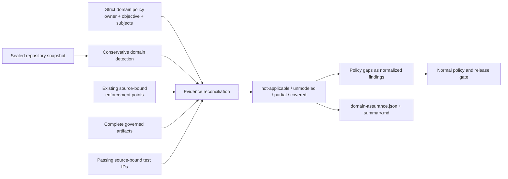

# Cross-domain assurance

Last reviewed: 2026-08-27

Conventional SAST, dependency, IaC, and architecture scanners do not establish
that product-specific invariants or specialized runtime domains were tested.
Every scan therefore emits `domain-assurance.json` 1.0: a bounded applicability
inventory and an optional repository-owned control-to-evidence contract.

## Governed domains

| Domain | Applicability signals | Evidence the policy can require |
|---|---|---|
| Business logic | Service, authorization, event, and database surfaces | State/value/quota/eligibility/idempotency/concurrency tests |
| Privacy lifecycle | Sensitive identifiers and data-flow surfaces | Purpose, consent, minimization, retention, residency, deletion, export, processors |
| Resilience | Service, event, database, and AI surfaces | Latency/error/resource budgets, recovery, amplification, backpressure |
| Detection engineering | Sigma/rule trees and retained Falco/ruleset evidence | Log sources, alerts, canary replay, false-positive budgets, incident routing |
| Cryptographic agility | Crypto imports, keys, certificates, and TLS/signing evidence | Algorithm, key, certificate, protocol, and migration inventory |
| Notebook security | Maintained `.ipynb` files | Code, output, dependency, and execution-provenance checks |
| Messaging security | Event framework and AsyncAPI surfaces | Producer/consumer authorization, delivery, schema, poison-message, dead-letter behavior |
| Desktop clients | Electron manifests and Python desktop frameworks | IPC, updater, credential-store, and protocol-handler behavior |
| Firmware and IoT | PlatformIO, Zephyr, Arduino, firmware trees, and device imports | Secure boot, update, device identity, and hardware boundaries |
| Web3 | Solidity/Vyper and chain-framework imports | Contract invariants, upgrades, oracles, and transaction ordering |
| GraphQL | GraphQL imports and framework-model evidence | Resolver/field authorization, query cost, batching, and exposure |
| Identity assurance | OAuth/OIDC/SAML/WebAuthn/session frameworks and policy | Proofing, authenticator lifecycle, recovery, federation, step-up, and session revocation |
| Tenant isolation | Tenant context, RLS, and cross-tenant controls | Database, cache, file, queue, search/vector, key, lifecycle, and audit isolation |
| Abuse resistance | Rate limits, CAPTCHA, fraud, bot, scraping, and inventory controls | Credential abuse, automation, fairness, fraud, promotions, and cost amplification |
| Workload identity | SPIFFE/SPIRE, service mesh, trust-domain, and cloud identity evidence | Attestation, rotation, service authorization, trust federation, and egress |
| Integration security | Webhooks, provider SDKs, callbacks, OAuth scopes, and egress | Authenticity, replay, least scope, schema trust, credential separation, and provider failure |
| Incident response and recovery | Playbooks, runbooks, forensic and detection evidence | Preservation, containment, exercised recovery, forensic logging, routing, and revalidation |
| Data integrity and lineage | Databases, events, ETL/orchestration, reconciliation, and audit signals | Record integrity, lineage, immutable audit, transformations, and mutation authorization |
| Serverless and edge | Lambda/functions, Serverless/SAM, workers, and edge configuration | Trigger identity, event trust, function privilege, concurrency/cost, secrets, and cache isolation |
| External assets and communications | DNS, email authentication, certificates, and public asset evidence | Ownership, DNSSEC, dangling records, SPF/DKIM/DMARC, certificate binding, and link workflows |
| OT/ICS safety | Modbus, OPC UA, PLC/SCADA trees, industrial source, and protocol evidence | Command authorization, segmentation, workstation trust, fail-safe state, interlocks, and process invariants |
| Privileged control planes | Administrative, support, back-office, impersonation, PAM, and break-glass paths | Scoped administration, session controls, dual approval, expiry, attribution, and immutable audit |
| Distributed temporal correctness | Consensus, leader, quorum, lease, partition, and clock signals | Safety and liveness under skew, partitions, duplicate/reordered delivery, leadership changes, and recovery |
| Secure human interaction | High-risk confirmation, consent, redress, phishing-resistance, and accessibility flows | Comprehension, subject-bound confirmation, accessible controls, recovery, and anti-phishing friction |
| ML model/data supply chain | AI surfaces, model registries, training pipelines, model files, and dataset provenance | Dataset/model lineage, safe deserialization, training integrity, evaluation, approval, and deployment identity |
| Credential and secret lifecycle | Secret managers, KMS, keyrings, rotation, revocation, and retained verification | Inventory, least scope, issuance, rotation, revocation, dormancy, leak response, and emergency rollover |
| Observability integrity | Telemetry SDKs, collectors, audit pipelines, time sync, and detection evidence | Source authenticity, log integrity, collector isolation, redaction, time, poison resistance, and delivery |
| Developer environment security | IDE settings/extensions, dev containers, build plugins, hooks, and bootstrap scripts | Allow-listing, locking, integrity, secret isolation, package lifecycle, and production parity |
| Parser and content security | Parser libraries plus document, media, archive, and upload surfaces | Fuzz/differential tests, polyglots, expansion limits, macros, active content, and metadata handling |
| Trust and safety | Moderation, user-reporting, age, coordinated-behavior, and recommender signals | Abuse/evasion outcomes, reporting, appeals, redress, age controls, and recommender safety |
| Confidential computing and side channels | Enclave, TEE, attestation, confidential-compute, and side-channel signals | Attestation, key release, rollback/debug controls, memory confidentiality, and leakage budgets |
| Regulated transaction integrity | Screening, maker-checker, financial ledger, and regulated-value signals | Independent authorization, screening, reconciliation, non-repudiation, and retention |
| Physical and environmental security | Facility, custody, tamper, data-center, and environmental-control signals | Access, custody, tamper response, disposal, environmental monitoring, and disaster-site recovery |

Detection is deliberately conservative: a signal makes a domain applicable but
does not assert a vulnerability. Without a repository policy the artifact uses
`unmodeled`, emits no surprise finding, and makes the gap visible in
`summary.md`. Set `enforce_inferred_domains` when every inferred domain must be
declared.

Direct file, import, and bounded configuration signals exclude top-level
documentation, example, fixture, and test trees as well as generated/tool-owned
directories. This keeps a sample policy or test-only SDK from activating a
runtime domain. Detected production paths are retained, but matching source or
configuration text is never copied into the artifact.

## Standards alignment

The policy is repository-specific, while normalized gap findings cite the most
relevant external assurance model where one exists:

| Area | Primary reference |
|---|---|
| Identity proofing, authentication, sessions, and federation | [NIST SP 800-63-4](https://pages.nist.gov/800-63-4/) |
| Multi-tenant context and lifecycle isolation | [OWASP Multi-Tenant Security](https://cheatsheetseries.owasp.org/cheatsheets/Multi_Tenant_Security_Cheat_Sheet.html) |
| Automated abuse of valid functionality | [OWASP Automated Threats](https://owasp.org/www-project-automated-threats-to-web-applications/) |
| Workload identity and cloud-native zero trust | [NIST SP 800-207A](https://csrc.nist.gov/pubs/sp/800/207/a/final) and [SPIFFE](https://spiffe.io/docs/latest/spiffe-specs/) |
| Third-party API consumption | [OWASP API10:2023](https://owasp.org/API-Security/editions/2023/en/0xaa-unsafe-consumption-of-apis/) |
| Incident response and recovery | [NIST SP 800-61 Rev. 3](https://csrc.nist.gov/pubs/sp/800/61/r3/final) |
| Cyber-resilient system behavior | [NIST SP 800-160 Vol. 2 Rev. 1](https://csrc.nist.gov/pubs/sp/800/160/v2/r1/final) |
| Serverless application security | [OWASP Serverless Top 10](https://owasp.org/www-project-serverless-top-10/) |
| Operational technology and industrial control systems | [NIST SP 800-82 Rev. 3](https://csrc.nist.gov/pubs/sp/800/82/r3/final) |
| Privileged access and physical/environmental controls | [NIST SP 800-53 Rev. 5](https://csrc.nist.gov/pubs/sp/800/53/r5/upd1/final) |
| Distributed systems engineering | [NIST SP 800-160 Vol. 1 Rev. 1](https://csrc.nist.gov/pubs/sp/800/160/v1/r1/final) |
| Human authentication interaction | [NIST SP 800-63B-4](https://pages.nist.gov/800-63-4/sp800-63b.html) |
| ML supply chain and trust-and-safety risk | [NIST AI RMF](https://www.nist.gov/itl/ai-risk-management-framework) |
| Credential and key lifecycle | [NIST SP 800-57 Part 1 Rev. 5](https://csrc.nist.gov/pubs/sp/800/57/pt1/r5/final) |
| Security log and observability integrity | [NIST SP 800-92](https://csrc.nist.gov/pubs/sp/800/92/final) |
| Developer/build supply chain | [SLSA 1.2](https://slsa.dev/spec/v1.2/) |
| Parser and hostile input validation | [CWE-20](https://cwe.mitre.org/data/definitions/20.html) |
| Regulated transaction governance | [NIST Cybersecurity Framework 2.0](https://www.nist.gov/cyberframework) plus the repository's jurisdiction-specific control profile |

## Evidence contract

Place the strict policy at `security/domain-assurance-policy.json`. Start from
[`examples/domain-assurance-policy.example.json`](../examples/domain-assurance-policy.example.json)
and export the authoritative schema with:

```console
pysec schema domain-assurance-policy-1.0
```



A requirement is satisfied only when:

- every named enforcement point resolves to a regular file inside the sealed
  source snapshot;
- every named artifact is retained, and an artifact exposing `complete` reports
  `true`;
- every named test identity is a passing source-bound observation; and
- behavioral requirement kinds include at least one adversarial test identity.

The artifact and policy are bounded to 33 domains, 2,000 total requirements,
50,000 maintained files, 4 MiB per inspected source/configuration file, and
256 MiB of aggregate source/configuration content. Exhausting a bound makes the
artifact incomplete and truncated rather than silently sampling a clean claim.
Duplicate domains, duplicate requirement IDs, duplicate bindings, unknown
fields, unsafe artifact names, malformed JSON, linked enforcement points, and
accounting inconsistencies fail closed.

## Status and release behavior

| Status | Meaning |
|---|---|
| `not-applicable` | Neither repository signals nor policy declare the domain applicable |
| `unmodeled` | A surface was inferred but no repository declaration exists |
| `partial` | A declaration conflicts with the repository or a required binding is absent/incomplete |
| `covered` | Every declared requirement has its required source, artifact, and test evidence |

An explicitly declared gap produces a normalized finding in every profile. In
`production` and `release`, a present malformed policy is incomplete; when
`enforce_inferred_domains` is enabled, uncovered inferred domains also prevent
a complete release decision.

## Claim boundary

`covered` is evidence-accounting truth, not a clean-security certificate. It
does not establish exploitability, legal privacy compliance, production
resilience, detection efficacy outside the retained corpus, hardware behavior,
or absence of defects. Trust-and-safety, confidential-computing, regulated-
transaction, and physical/environmental domains are intentionally opt-in unless
conservative repository signals establish applicability; their legal, hardware,
human-outcome, and side-channel claims require suitable native tools, domain
owners, jurisdiction-specific profiles, and bounded dynamic evidence. The policy
makes their absence explicit instead of silently crediting unrelated scanners.
