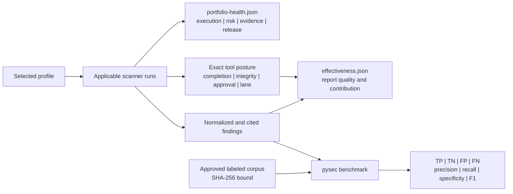

# Detection effectiveness and operational coverage

Last reviewed: 2026-08-13

The suite separates five questions that are often incorrectly collapsed into
one score:

- **Did the applicable controls run?** `portfolio-health.json` assigns an
  execution grade across 12 domains and names every execution gap.
- **What did completed controls observe?** Its independent risk grade reflects
  the highest active normalized severity and never rewards scanner completion.
- **Is the evidence decision-ready?** Its evidence grade accounts for incomplete
  execution, changed entry points, policy gaps, and external scanner approval;
  the release disposition remains a separate field.
- **Did the report preserve useful evidence?** `effectiveness.json` 1.1
  measures attribution, citations, actionability, corroboration, tool
  contribution, and per-tool completion/integrity/continuity/approval posture.
- **Did the portfolio detect known positive and negative cases?** `pysec
  benchmark` measures a verified report against a separately reviewed,
  digest-bound labeled corpus.



## Per-tool evidence posture

`tool_posture` retains one bounded record per selected control. It reports the
tool's lane, applicability and completion, normalized and unique findings,
primary and auxiliary executable integrity, organization approval, and
before/after continuity. The status is one of `approved`, `approval-gap`,
`integrity-gap`, `not-established`, `execution-gap`, or `not-applicable`.

`risk-paths.json` consumes these records by exact contributing-tool name. This
lets a route distinguish a technically important finding from the separate work
needed to establish scanner authority or an independent perspective. The join
does not alter scanner severity, infer finding truth, or grant release approval.

Export the offline contract with:

```text
pysec schema effectiveness-1.1 --output effectiveness.schema.json
```

## Labeled corpus

Export the strict offline schema from the installed package:

```text
pysec schema effectiveness-corpus-1.0 --output effectiveness-corpus.schema.json
```

Minimal corpus:

```json
{
  "schema_version": "1.0",
  "corpus_id": "python-security-regression",
  "revision": "2026.08.06",
  "labels": [
    {
      "id": "assertion-positive",
      "expected": "finding",
      "match": {"tool": "bandit", "rule_id": "B101"}
    },
    {
      "id": "known-clean-module",
      "expected": "clean",
      "match": {"path": "src/example/clean.py"}
    }
  ]
}
```

Use [the enterprise corpus template](../examples/effectiveness-corpus.enterprise.json)
to plan positive and negative cases across SAST, secrets, dependencies, IaC,
workflow security, architecture, and unused code. Replace every template match
with a reviewed fixture that is actually present in the scanned corpus. Require
per-tool minimums in `release-check`; never count a label for a scanner that was
unavailable or not applicable.

Every label needs a stable ID, an expected `finding` or `clean` result, and at
least one exact discriminator: tool, native rule, repository-relative path, or
classification. Corpus ownership, change review, representative vulnerable and
clean fixtures, and false-positive dispositions remain organization decisions.
For a `clean` label that names a path, the evaluator now requires that path in
the sealed `source-inventory.json` and verifies the inventory's exact aggregate
digest, file/byte totals, and binding to an unchanged scan-manifest snapshot.
This prevents an invented or omitted fixture from being counted as a true
negative. The inventory is also a mandatory canonical report artifact:
`verify-report` rejects its removal, non-canonical or duplicate paths, invalid
file identities, unsorted records, excessive size/count, aggregate mismatch,
or disagreement with the scan manifest. Rule-wide clean labels do not require a path but still require the
named scanner's unchanged executable identity at bundle qualification.

Schema 1.0 remains available for local and standard-profile regression work.
Production and release require corpus schema 2.0. Its root additionally carries
`training_corpus_sha256`, the RFC 8785 digest of the exact holdout labels,
`minimum_authority_signatures`, and detached authority records. At least two
independent collectors, signers, and organizations must sign the domain-separated
`effectiveness-corpus` subject inside their configured key lifecycles. The
deployment supplies the trusted key IDs, allowed roles, organization mapping,
and lifecycle policy through the same protected authority environment used by
the assurance profile; corpus files cannot authorize their own signers.

Every governed label also declares CWE, language, parser variant, boundary
type, severity, and mutation operator. Release readiness recomputes those
strata from the exact label outcomes and requires at least five CWEs, two
languages, two parser variants, three boundary types, three severities, and two
non-`none` mutation operators. Every named required tool must have both a
positive and a negative case. A schema-1.0 evaluation, a self-signed corpus, a
training/holdout digest collision, a stale authority, or diversity metadata
that disagrees with the outcomes fails the production gate.

Governed evaluation also requires an advanced RFC 3161 context and a signed,
remote consume-once service. The timestamp challenge binds the sealed report checksum, exact
corpus digest, and holdout-label digest; the verified timestamp is then used as
the authority-validation time. A rollbackable local SQLite ledger is rejected
for schema 2.0. The service atomically consumes that report/corpus/time tuple,
returns a deployment-pinned Ed25519 receipt and monotonic sequence, and enforces
the configured holdout query budget. Governed output is aggregate-only: label
identities and per-label failures are withheld to reduce tuning leakage. Release
readiness requires both `time_authority.validated` and
`replay_protected` in addition to the corpus quorum.

Run the benchmark only after sealing and verifying the scan report:

```text
pysec benchmark REPORT \
  --corpus effectiveness-corpus.json \
  --corpus-sha256 APPROVED_SHA256 \
  --trusted-time effectiveness-time.json \
  --trusted-time-sha256 APPROVED_TIME_CONTEXT_SHA256 \
  --replay-service-url https://replay.security.example/v1/effectiveness/consume \
  --replay-service-token-env PYSEC_EFFECTIVENESS_REPLAY_TOKEN \
  --replay-service-receipt-key security-data/replay-receipt.pub.pem \
  --replay-service-receipt-key-sha256 APPROVED_RECEIPT_KEY_SHA256 \
  --replay-query-budget 1 \
  --format json \
  --output effectiveness-evaluation.json
```

The evaluation is written outside the sealed report and binds the report
checksum plus corpus digest. Exit `0` means no labeled false positive or false
negative; exit `1` means the corpus exposed a miss or unexpected detection.
Nullable metrics mean the corpus did not contain the required denominator—not
that performance was perfect.

## Reading grades safely

| Axis | Meaning of `A` | What it does not mean |
|---|---|---|
| Execution | At least 90% of applicable control slots completed | No vulnerabilities exist |
| Observed risk | No active finding above informational severity was normalized | The portfolio has complete detection coverage |
| Evidence | The scan scope completed without recorded policy or identity gaps | The organization approved promotion |
| Release decision | `eligible_for_external_approval` only after the scan policy passes | The suite granted admission |

`N/A` means no selected control applied. It is never converted into a passing
execution result. Conditional controls include a deterministic activation
recipe: category, accountable owner, trigger, required action, and closure
evidence. A release decision still depends on findings, policy, fresh governed
context, source integrity, isolation attestation, provenance verification, and
independent enterprise authority.

`pysec release-check --minimum-effectiveness-labels N` can require this
evaluation, its exact SHA-256, a passing verdict, a binding to the same report
seal, and a non-trivial minimum corpus size before promotion.
