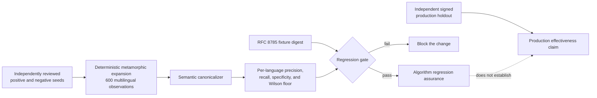
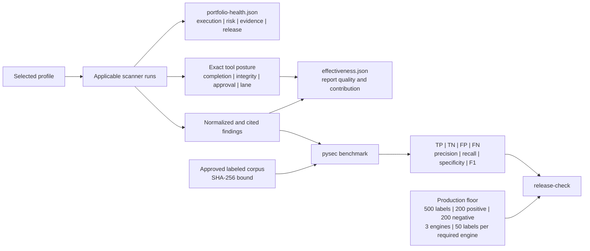

# Detection effectiveness and operational coverage

See [measured acceptance](professional-acceptance.md) for the latest completed
native detection measurements and [validation pipeline](validation-pipeline.md)
for exact-wheel verification, failed-run retention and runtime qualification.

Last reviewed: 2026-09-12

## Executable detection regression gate

See [professional acceptance](professional-acceptance.md) for the installed-wheel
CI matrix, external OWASP measurement, per-engine regression baseline, and the
remaining limits on production effectiveness claims.

`scripts/validate_detection.py` runs real Semgrep and Bandit binaries against
the developer-labeled cases in `tests/fixtures/detection-regressions.json`.
It checks request-to-SQL, SSRF, path traversal, and credential logging, including
Flask, Django, FastAPI, keyword arguments, and async handlers. Each vulnerability
class has positive and negative controls. The gate requires every expected
detection, rejects false positives on the negative controls, and retains per-CWE
precision/recall counts, detector versions, and corpus/rule digests. These small
regression fixtures do not establish production detection rates.

Semgrep now runs a fixed three attempts by default (`--semgrep-repetitions`,
bounded to one through five). Every attempt must complete its Python inventory
and native error checks, and normalized findings and engine versions must agree.
All attempt summaries remain in `semgrep_stability`, including failures followed
by successes. Per-case results describe the first attempt; a later success cannot
replace them or turn the overall gate green. Summary digests include normalized
classification and severity, not only finding counts. Timing is recorded but does
not affect the equality check. This is a regression check, not a reliability SLA.

The separate CodeQL gate compiles the bundled global taint queries and selected
upstream queries against credential, LDAP, HTML, path and XPath flows. Positive
findings must retain SARIF path traces. Controls cover identity helpers, real
escaping, source-verified imported factories and bounded value proofs. All 15
previously tracked mutation misses now pass as positive regressions, paired with
safe overwrite controls. The current CodeQL corpus has 257 passing cases. Future
known-gap records must still reject unsafe constant-value proofs and cannot be
counted as successful detections. CI requires both lanes
through `detection-regressions` and retains their JSON results.

The Semgrep rules no longer trust arbitrary function names containing `sanitize`,
`redact`, or `allowlist`. A custom helper can therefore produce a candidate finding
until its behavior is established by deeper analysis or an explicitly reviewed
model. The built-in `werkzeug.utils.secure_filename` path model is tested against
a fixed parent-directory example. Parameterized SQL and constant outbound URLs
with request-derived query parameters are negative controls.

```text
python scripts/validate_detection.py --semgrep PATH_TO_SEMGREP --bandit PATH_TO_BANDIT --output .artifacts/detection/semgrep.json
codeql pack ci src/py_security_suite/rules/codeql
python scripts/validate_detection.py --codeql-only --codeql PATH_TO_CODEQL --output .artifacts/detection/codeql.json
```

The CodeQL lane was validated with CLI 2.26.4 and the checked-in query dependency
lock. Package preparation is connected; detection uses the staged libraries.
For product scans, select a profile containing CodeQL (such as `deep`), stage
those locked dependencies under `tools.codeql.database_path/.codeql/packages`,
alongside the approved `codeql/python-queries` pack. The bundled supplemental
query pack is the default `tools.codeql.rules_path`. Production deployments must
approve the updated rules and cache digests. Missing supplemental dependencies
are an explicit readiness failure. A supplemental execution failure retains
primary CodeQL findings and makes the tool incomplete.

The CodeQL gate also tests native path/XPath flow refinement. A bounded evaluator
handles pure integer arithmetic and a single comparison in conditional expressions
whose selected branch is a string literal. Local SSA bindings must be unique,
defined, non-escaping fast locals without phi inputs. Unsupported operations,
large intermediates, unknown conditions, and other taint paths retain alerts.
The supplemental queries compare the original and refined native flows; an
exclusion requires an explicit result showing no refined flow to any node at
the same sink coordinates. No absence-of-results heuristic is used.

XPath refinement also supports an apostrophe-rejection guard on the same SSA
value and control-flow branch when that value occupies the sole, unconverted
hole of a supported quoted attribute comparison. The value must have a known
string origin. An unrelated check, wrong branch, custom object, formatting
conversion, unquoted hole or unsupported expression retains the native finding.
This context proof does not establish general XPath sanitization. Public XPath
accuracy and false-positive regression gates still fail; developer controls and
the [public measurements](validation-results.md) remain separate evidence.

Live scans require complete extraction, successful invocations, unchanged assets,
and an exact rule/file/line/column match. The original finding, resolved and
redacted through the normal parser, and its native comparison record are retained
in `evidence/codeql.json` under `native_flow_refinement`. Proof and evidence limits
retain all original alerts when exceeded. Imported SARIF and local AST review
hints do not authorize this refinement. This narrow model is not a proof about
arbitrary Python reflection or unmodeled runtime behavior.

Bandit and Semgrep reported native analysis errors also make the tool incomplete
while preserving valid findings. The gate tests a mixture of malformed source and
detectable vulnerabilities through the actual Bandit adapter; unit tests cover
both adapters' partial-result contracts. Native inventory reconciliation also
requires every maintained Python file in the private scan mirror to appear in the
engine's analyzed-file inventory. Native errors and missing files make coverage
incomplete. This verifies the engine's reported coverage, not the correctness of
every analysis it performed. Diagnostics retain counts rather than raw scanner
error contents.

Semgrep dataflow fixpoint timeouts in `time.fixpoint_timeouts` also count as
analysis failures, even with exit zero and an empty main error list. The
completion gate rejects those runs, including scans with zero findings. See the
[current acceptance qualification](professional-acceptance.md#current-qualification-native-dataflow-timeouts)
for the observed intermittent timeout and the limits on earlier measurements.

The benchmark semantic canonicalizer is regression-calibrated against the
canonical-digest-pinned multilingual fixture at
[`tests/fixtures/semantic-calibration-1.1.json`](../tests/fixtures/semantic-calibration-1.1.json).
The schema-1.1 fixture expands its independently reviewed positive and negative
seeds into 600 deterministic metamorphic observations across Python,
JavaScript, TypeScript, Go, Java, and Rust. Every language must independently
meet precision, recall, and specificity floors plus a 95% Wilson lower-bound
floor. A sidecar pins the exact RFC 8785 canonical fixture digest, so silent
fixture replacement fails the gate.
Those intervals quantify repeatable mutation-matrix stability; correlated
metamorphic variants are not represented as independent field observations.
This repository fixture detects algorithm regressions; production effectiveness
claims still require independently labeled, signed holdouts through the corpus
workflow below.



The suite separates five questions that are often incorrectly collapsed into
one score:

- **Did the applicable controls run?** `portfolio-health.json` assigns an
  execution grade across 12 domains and names every execution gap.
- **What did completed controls observe?** Its independent risk grade reflects
  the highest active normalized severity and never rewards scanner completion.
- **Is the evidence decision-ready?** Its evidence grade accounts for incomplete
  execution, changed entry points, policy gaps, and external scanner approval;
  the release disposition remains a separate field.
- **Did the report preserve useful evidence?** `effectiveness.json` 1.1
  measures attribution, citations, actionability, corroboration, tool
  contribution, and per-tool completion/integrity/continuity/approval posture.
- **Did the portfolio detect known positive and negative cases?** `pysec
  benchmark` measures a verified report against a separately reviewed,
  digest-bound labeled corpus.



## Per-tool evidence posture

`tool_posture` retains one bounded record per selected control. It reports the
tool's lane, applicability and completion, normalized and unique findings,
primary and auxiliary executable integrity, organization approval, and
before/after continuity. The status is one of `approved`, `approval-gap`,
`integrity-gap`, `not-established`, `execution-gap`, or `not-applicable`.

`risk-paths.json` consumes these records by exact contributing-tool name. This
lets a route distinguish a technically important finding from the separate work
needed to establish scanner authority or an independent perspective. The join
does not alter scanner severity, infer finding truth, or grant release approval.

Export the offline contract with:

```text
pysec schema effectiveness-1.1 --output effectiveness.schema.json
```

## Labeled corpus

Export the strict offline schema from the installed package:

```text
pysec schema effectiveness-corpus-1.0 --output effectiveness-corpus.schema.json
```

Minimal corpus:

```json
{
  "schema_version": "1.0",
  "corpus_id": "python-security-regression",
  "revision": "2026.08.06",
  "labels": [
    {
      "id": "assertion-positive",
      "expected": "finding",
      "match": {"tool": "bandit", "rule_id": "B101"}
    },
    {
      "id": "known-clean-module",
      "expected": "clean",
      "match": {"path": "src/example/clean.py"}
    }
  ]
}
```

Use [the enterprise corpus template](../examples/effectiveness-corpus.enterprise.json)
to plan 44 positive and negative cases across SAST, secrets, dependencies,
containers, Kubernetes, DAST, authorization, event handling, browser controls,
IaC, workflow security, architecture, and unused code. Replace every template match
with a reviewed fixture that is actually present in the scanned corpus. Require
per-tool minimums in `release-check`; never count a label for a scanner that was
unavailable or not applicable. This schema-1.0 file is deliberately a planning
template, not governed release evidence; it cannot pass the production or release
corpus gate unchanged.

Every label needs a stable ID, an expected `finding` or `clean` result, and at
least one exact discriminator: tool, native rule, repository-relative path, or
classification. Corpus ownership, change review, representative vulnerable and
clean fixtures, and false-positive dispositions remain organization decisions.
For a `clean` label that names a path, the evaluator now requires that path in
the sealed `source-inventory.json` and verifies the inventory's exact aggregate
digest, file/byte totals, and binding to an unchanged scan-manifest snapshot.
This prevents an invented or omitted fixture from being counted as a true
negative. The inventory is also a mandatory canonical report artifact:
`verify-report` rejects its removal, non-canonical or duplicate paths, invalid
file identities, unsorted records, excessive size/count, aggregate mismatch,
or disagreement with the scan manifest. Rule-wide clean labels do not require a path but still require the
named scanner's unchanged executable identity at bundle qualification.

Schema 1.0 remains available for local and standard-profile regression work.
Production and release require corpus schema 2.0. Its root additionally carries
`training_corpus_sha256`, the RFC 8785 digest of the exact holdout labels,
`minimum_authority_signatures`, and detached authority records. At least two
independent collectors, signers, and organizations must sign the domain-separated
`effectiveness-corpus` subject inside their configured key lifecycles. The
deployment supplies the trusted key IDs, allowed roles, organization mapping,
and lifecycle policy through the same protected authority environment used by
the assurance profile; corpus files cannot authorize their own signers.

Every governed label also declares the exact `fixture_sha256`, CWE, language,
parser variant, boundary type, severity, and mutation operator. The evaluator
rejects duplicate normalized match predicates and rejects a report finding that
matches more than one label. These checks prevent duplicated cases, overlapping
selectors, or one broad finding from inflating coverage and recall. Release
readiness verifies an aggregate-only coverage summary containing
positive/negative totals, per-tool counts, and per-tool expectation classes. It
recomputes strata from detailed schema-1.0 outcomes or verifies the signed
schema-2.0 aggregate against the corpus diversity commitment, and requires at least five CWEs, two
languages, two parser variants, three boundary types, three severities, and two
non-`none` mutation operators. Every named required tool must have both a
positive and a negative case. A schema-1.0 evaluation, a self-signed corpus, a
training/holdout digest collision, a stale authority, or diversity metadata
that disagrees with the outcomes fails the production gate.

Governed evaluation also requires an advanced RFC 3161 context and a signed,
remote consume-once service. The timestamp challenge binds the sealed report checksum, exact
corpus digest, and holdout-label digest; the verified timestamp is then used as
the authority-validation time. A rollbackable local SQLite ledger is rejected
for schema 2.0. The service atomically consumes that report/corpus/time tuple,
returns a deployment-pinned Ed25519 receipt and monotonic sequence, and enforces
the configured holdout query budget. Governed output is aggregate-only: label
identities and per-label failures are withheld to reduce tuning leakage, while
bounded aggregate counts remain available for release thresholds. Release
readiness checks those totals against the corpus label count and confusion
matrix and requires both `time_authority.validated` and
`replay_protected` in addition to the corpus quorum.
The evaluation retains the exact signed statement, verification key, request
commitment, service-key identity, sequence, holdout-use count, leaf identity,
Merkle inclusion proof, prior checkpoint, and consistency proof so an offline
auditor can reconstruct and reverify consumption. Governed clients keep the
prior tree state in the durable SQLite ledger named by
`PYSEC_EFFECTIVENESS_CHECKPOINT_STATE_PATH`; an immediate transaction rejects
rollback, forks, and concurrent advancement. Every checkpoint must also carry
valid signatures from at least two independent Ed25519 witnesses pinned by
`PYSEC_EFFECTIVENESS_WITNESS_KEYS_JSON`. Each digest maps to a key path,
organization, and lifecycle window; duplicate organizations do not count.
`PYSEC_EFFECTIVENESS_GOSSIP_CHECKPOINT_{PATH,SHA256}` selects an external
checkpoint document whose size/root, log identity, observation time, and
minimum threshold are verified through a lifecycle-valid, multi-organization
governance quorum. This makes a service split view detectable outside the
service and witness signing keys. The first checkpoint uses size zero and an
empty root.

Run the benchmark only after sealing and verifying the scan report:

```text
pysec benchmark REPORT \
  --corpus effectiveness-corpus.json \
  --corpus-sha256 APPROVED_SHA256 \
  --trusted-time effectiveness-time.json \
  --trusted-time-sha256 APPROVED_TIME_CONTEXT_SHA256 \
  --replay-service-url https://replay.security.example/v1/effectiveness/consume \
  --replay-service-token-env PYSEC_EFFECTIVENESS_REPLAY_TOKEN \
  --replay-service-receipt-key security-data/replay-receipt.pub.pem \
  --replay-service-receipt-key-sha256 APPROVED_RECEIPT_KEY_SHA256 \
  --replay-query-budget 1 \
  --format json \
  --output effectiveness-evaluation.json
```

The evaluation is written outside the sealed report and binds the report
checksum plus corpus digest. Exit `0` means no labeled false positive or false
negative; exit `1` means the corpus exposed a miss or unexpected detection.
Nullable metrics mean the corpus did not contain the required denominator—not
that performance was perfect.

## Reading grades safely

| Axis | Meaning of `A` | What it does not mean |
|---|---|---|
| Execution | At least 90% of applicable control slots completed | No vulnerabilities exist |
| Observed risk | No active finding above informational severity was normalized | The portfolio has complete detection coverage |
| Evidence | The scan scope completed without recorded policy or identity gaps | The organization approved promotion |
| Release decision | `eligible_for_external_approval` only after the scan policy passes | The suite granted admission |

`N/A` means no selected control applied. It is never converted into a passing
execution result. Conditional controls include a deterministic activation
recipe: category, accountable owner, trigger, required action, and closure
evidence. A release decision still depends on findings, policy, fresh governed
context, source integrity, isolation attestation, provenance verification, and
independent enterprise authority.

`pysec release-check --minimum-effectiveness-labels N` can require this
evaluation, its exact SHA-256, a passing verdict, a binding to the same report
seal, and a non-trivial minimum corpus size before promotion.

For meaningful empirical calibration, use a separately maintained holdout of at
least 500 labels with balanced positive and negative controls across every
required scanner, representative frameworks, real historical defects, parser
variants, custom wrappers and sanitizers, and mutation operators. The built-in
production floor now enforces 500 labels, including at least 200 positive and 200
negative cases, three engines, and 50 labels for every required engine. It is
still a minimum rather than proof that the sample is representative. Track
precision, recall, false-positive rate, and
false-negative rate per tool, rule, CWE, framework, and parser variant; do not
replace the governed holdout with fixtures used to tune scanner rules.
