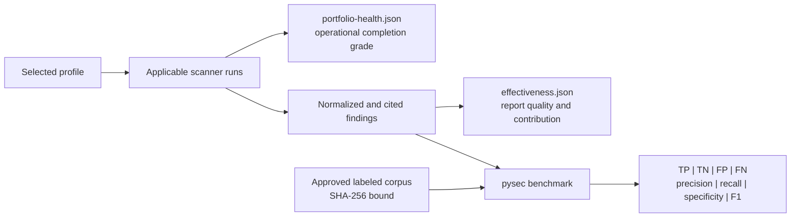

# Detection effectiveness and operational coverage

Last reviewed: 2026-08-06

The suite separates three questions that are often incorrectly collapsed into
one score:

- **Did the applicable controls run?** `portfolio-health.json` grades scanner
  completion across 12 domains and names every execution gap.
- **Did the report preserve useful evidence?** `effectiveness.json` measures
  attribution, citations, actionability, corroboration, and tool contribution.
- **Did the portfolio detect known positive and negative cases?** `pysec
  benchmark` measures a verified report against a separately reviewed,
  digest-bound labeled corpus.



## Labeled corpus

Export the strict offline schema from the installed package:

```text
pysec schema effectiveness-corpus-1.0 --output effectiveness-corpus.schema.json
```

Minimal corpus:

```json
{
  "schema_version": "1.0",
  "corpus_id": "python-security-regression",
  "revision": "2026.08.06",
  "labels": [
    {
      "id": "assertion-positive",
      "expected": "finding",
      "match": {"tool": "bandit", "rule_id": "B101"}
    },
    {
      "id": "known-clean-module",
      "expected": "clean",
      "match": {"path": "src/example/clean.py"}
    }
  ]
}
```

Every label needs a stable ID, an expected `finding` or `clean` result, and at
least one exact discriminator: tool, native rule, repository-relative path, or
classification. Corpus ownership, change review, representative vulnerable and
clean fixtures, and false-positive dispositions remain organization decisions.

Run the benchmark only after sealing and verifying the scan report:

```text
pysec benchmark REPORT \
  --corpus effectiveness-corpus.json \
  --corpus-sha256 APPROVED_SHA256 \
  --format json \
  --output effectiveness-evaluation.json
```

The evaluation is written outside the sealed report and binds the report
checksum plus corpus digest. Exit `0` means no labeled false positive or false
negative; exit `1` means the corpus exposed a miss or unexpected detection.
Nullable metrics mean the corpus did not contain the required denominator—not
that performance was perfect.

## Reading grades safely

An `A` domain grade means at least 90% of applicable control slots completed.
`N/A` means no selected control applied. Neither state proves the code is safe.
A release decision still depends on findings, policy, fresh governed context,
source integrity, isolation attestation, and provenance verification.
