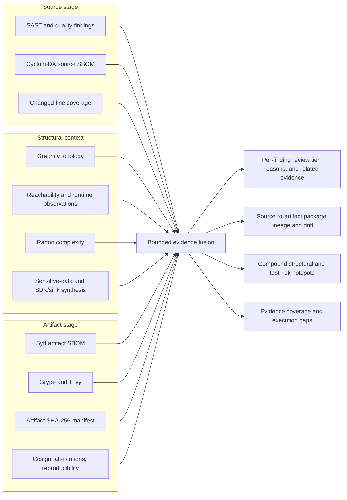

# Cross-tool evidence fusion

Last reviewed: 2026-08-12

The suite cross-references independent scanner and evidence outputs into
`evidence-fusion.json`. Fusion improves review order and explanatory context;
it never silently changes native severity, suppresses a finding, or treats an
empty scanner result as proof of safety.

## Evidence joins

| Primary evidence | Cross-reference | Added leverage |
|---|---|---|
| Bandit, Semgrep, Pysa, CodeQL, Ruff, Pylint | Graphify, reachability, coverage, diff-cover, Radon, source inventory, CODEOWNERS | Shows whether the exact finding line changed, is covered, was observed, is complex, is central, and has a broad caller/dependency neighborhood |
| OSV-Scanner source finding | Source CycloneDX SBOM and Syft artifact SBOM | Establishes whether the exact normalized package version declared in source is also present in the built distribution |
| Grype artifact finding | Source and artifact SBOMs plus OSV findings | Links artifact exposure back to the source dependency and related advisory observations |
| Trivy and ScanCode license evidence | Source/artifact component inventories | Connects license policy findings to the component and lifecycle stage where it appears |
| Cosign, attestations, reproducible-build evidence | Artifact manifest | Binds provenance conclusions to the exact artifact SHA-256 and detects digest disagreement |
| Any normalized finding | High-value classification and package indexes | Links CVE, GHSA, CWE, license, SLSA, and package observations even when tools report different paths or lifecycle stages |
| Vulture, reachability islands, changed files, and Graphify | Runtime/diff coverage, Radon, Tach, ownership, mapped tests, and normalized findings | Imports [structural synthesis](structural-synthesis.md) into finding review reasons so dead-code, latent attack-surface, import-cycle, missing-root, and high-risk change evidence affects triage without changing severity |
| Semgrep/Pysa/CodeQL exposure findings | [Sensitive-data exposure](data-exposure.md), SDK imports/dependencies/configuration, Graphify, reachability, coverage, and changed code | Distinguishes confirmed traces/configuration findings from sink review surfaces and adds exact sink, SDK, transformation evidence, structural relevance, CWE/OWASP/OpenTelemetry citations, and disclosure-specific action |
| Applicable tool status | Evidence-lane matrix | Separates completed perspectives, not-applicable controls, and real execution gaps without inferring a clean result |

## Flow

## Review semantics

Each finding receives `evidence.fusion` containing:

- `review_tier`: `urgent`, `elevated`, or `standard`;
- explicit `review_reasons`, such as changed and uncovered code, known
  exploitation, cross-stage package exposure, high complexity, or broad graph
  impact;
- `corroboration`: `single-tool`, `contextual`, `independent`, or
  `cross-stage`;
- related finding IDs, tools, and shared high-value classifications;
- exact source file digest and size when available;
- coverage, changed-line, reachability, runtime, graph, and complexity context;
- package versions in source and artifact SBOMs; and
- artifact-manifest digest agreement.

An artifact digest contradiction is stronger than ordinary triage context: it
makes the scan incomplete and names the conflicting finding in
`contradictions`. This prevents evidence produced for one artifact from being
silently applied to another.

The report also records package lineage as `matched`, `version-drift`,
`source-only`, or `artifact-only`. These states are diagnostic: development
dependencies and packaging helpers can legitimately be source-only, while an
artifact-only component requires investigation before it is considered drift.

## Trust and limits

All joins operate on already bounded, normalized local artifacts. Package
matching follows normalized Python distribution names and exact versions.
Static topology does not prove runtime exploitability. A completed scanner with
no finding remains a completed perspective—not an assertion that the target is
safe. Policy, severity, accepted risk, and release approval remain separate
governed decisions.
