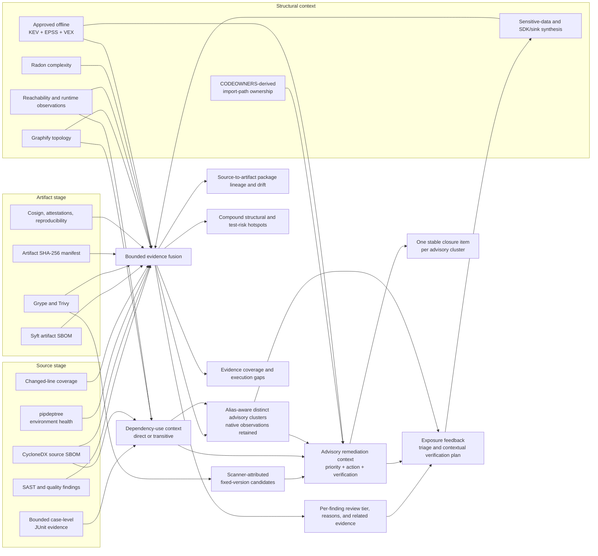

# Cross-tool evidence fusion

Last reviewed: 2026-08-13

The suite cross-references independent scanner and evidence outputs into
`evidence-fusion.json`. Fusion improves review order and explanatory context;
it never silently changes native severity, suppresses a finding, or treats an
empty scanner result as proof of safety.

## Evidence joins

| Primary evidence | Cross-reference | Added leverage |
|---|---|---|
| Bandit, Semgrep, Pysa, CodeQL, Ruff, Pylint | Graphify, reachability, coverage, diff-cover, Radon, source inventory, CODEOWNERS | Shows whether the exact finding line changed, is covered, was observed, is complex, is central, and has a broad caller/dependency neighborhood |
| OSV-Scanner source finding | Source CycloneDX SBOM and Syft artifact SBOM | Establishes whether the exact normalized package version declared in source is also present in the built distribution |
| Grype artifact finding | Source and artifact SBOMs plus OSV findings | Links artifact exposure back to the source dependency and related advisory observations |
| OSV/Grype package advisories | Exact normalized package plus transitive CVE/GHSA/PYSEC/OSV alias overlap | Preserves native findings and sources while presenting one distinct actionable advisory, canonical identifier, versions, tools, and citations instead of double-counting aliases |
| Distinct package advisory | CycloneDX dependency roots, exact Graphify external imports, importing-file reachability/runtime state, and deptry findings | Distinguishes direct/transitive, imported, executable, load-only, disconnected, reachability-incomplete, apparently unused, and conflicting evidence without asserting exploitability |
| Transitive package advisory | CycloneDX dependency relationships plus pipdeptree environment health | Names bounded root-to-affected-package paths and qualifies their confidence when the installed environment reports missing, cyclic, or conflicting dependencies |
| Distinct package advisory | OSV/Grype fixed-version evidence plus digest-approved CISA KEV, FIRST EPSS, and CycloneDX VEX snapshots | Produces one P0-P4 remediation record with scanner-attributed fix candidates, action kind, evidence basis, uncertainties, and verification steps; VEX claims require validation and never suppress native findings automatically |
| Advisory importing files | Graphify reverse dependencies, coverage, CODEOWNERS-derived finding ownership, and native findings | Routes the remediation to observed import-path owners, selects direct/transitive focused tests with explicit confidence, and highlights import paths below 80% coverage |
| Graph-selected advisory tests | Bounded JUnit, Hypothesis, and Schemathesis case ledgers | Shows whether each selected test file has retained passing, failing, partial, skipped, or no observed cases; aggregate green totals never prove a specific test ran |
| Selected-test execution | Import-path or changed-line coverage | Flags passing focused tests whose affected code remains uncovered instead of presenting them as adequate validation |
| Alias-aware advisory importer | Declared entry points plus bounded Graphify file routes | Promotes the exact maintained importer into `risk-paths.json`, links the route back to every native advisory finding, and carries citations, threat/fix context, owners, focused tests, coverage, and closure criteria without claiming vulnerable-function exploitability |
| Per-importer advisory validation | Exact import module/line, reachability/runtime, CODEOWNERS, graph-selected tests, case execution, and coverage | Emits one bounded assessment per importer so evidence from a tested or owned path cannot mask a different importer's missing tests, missing owner, or coverage gap |
| Trivy and ScanCode license evidence | Source/artifact component inventories | Connects license policy findings to the component and lifecycle stage where it appears |
| Cosign, attestations, reproducible-build evidence | Artifact manifest | Binds provenance conclusions to the exact artifact SHA-256 and detects digest disagreement |
| Any normalized finding | High-value classification and package indexes | Links CVE, GHSA, CWE, license, SLSA, and package observations even when tools report different paths or lifecycle stages |
| Vulture, reachability islands, changed files, and Graphify | Runtime/diff coverage, Radon, Tach, ownership, mapped tests, and normalized findings | Imports [structural synthesis](structural-synthesis.md) into finding review reasons so dead-code, latent attack-surface, import-cycle, missing-root, and high-risk change evidence affects triage without changing severity |
| Semgrep/Pysa/CodeQL exposure findings and inventory sinks | [Sensitive-data exposure](data-exposure.md), SDK imports/dependencies/configuration, source/artifact package lineage, normalized package findings, Graphify, structural synthesis, CODEOWNERS, reachability, coverage, and changed code | Distinguishes confirmed traces/configuration findings from sink review surfaces; feeds finalized fusion evidence back into confirmed assessments and independently ranks inventory surfaces with owners, exact mapped tests, change risk, structural hotspots, SDK advisories/version drift, nearby findings, citations, and contextual verification without inventing vulnerabilities |
| Applicable tool status | Evidence-lane matrix | Separates completed perspectives, not-applicable controls, and real execution gaps without inferring a clean result |

## Flow

## Review semantics

Each finding receives `evidence.fusion` containing:

- `review_tier`: `urgent`, `elevated`, or `standard`;
- explicit `review_reasons`, such as changed and uncovered code, known
  exploitation, cross-stage package exposure, high complexity, or broad graph
  impact;
- `corroboration`: `single-tool`, `contextual`, `independent`, or
  `cross-stage`;
- related finding IDs, tools, and shared high-value classifications;
- exact source file digest and size when available;
- coverage, changed-line, reachability, runtime, graph, and complexity context;
- package versions in source and artifact SBOMs;
- package-scoped advisory cluster, canonical identifier, aliases, native
  observation count, contributing tools, and cross-tool status; and
- dependency-use assessment with source relationship, exact importing files,
  reachability completeness/state, runtime observations, deptry signals, and
  explicit import-versus-unused conflicts; and
- advisory threat context with known-exploited CVEs, maximum matched EPSS
  probability/percentile, VEX states, and the exact offline intelligence sources;
- remediation context with operational priority, action kind, scanner-attributed
  fixed-version candidates, evidence basis, uncertainties, and bounded
  verification steps; and
- validation handoff with import-path owners, Graphify-selected direct/transitive
  test files, test-selection confidence, exact retained execution status, file
  coverage, and explicit unmapped or unobserved states; and
- artifact-manifest digest agreement.

An artifact digest contradiction is stronger than ordinary triage context: it
makes the scan incomplete and names the conflicting finding in
`contradictions`. This prevents evidence produced for one artifact from being
silently applied to another.

The report also records package lineage as `matched`, `version-drift`,
`source-only`, or `artifact-only`. These states are diagnostic: development
dependencies and packaging helpers can legitimately be source-only, while an
artifact-only component requires investigation before it is considered drift.

Evidence-fusion schema 1.3 records `advisory_clusters`. A cluster is created
only when exact normalized package names match and advisory identifiers overlap,
including transitive alias chains. CVE is preferred as the display identifier,
followed by GHSA, PYSEC, and OSV, but no native scanner source is discarded. The
report therefore presents both the number of distinct risks and the number of
retained scanner observations. Cross-tool clustering is corroboration, not
proof of reachability or exploitation. Frozen schemas 1.2, 1.1, and 1.0 remain
installable.

Focused-test execution is a pre-remediation evidence join. The passive JUnit
ingester retains bounded case identity, normalized repository file, result, and
duration metadata while dropping captured output and failure bodies. Fusion
requires an exact selected-file match. Producer file attributes are preferred;
when xUnit2 omits them, a dotted classname is accepted only if its longest
module prefix resolves to an existing, non-linked repository Python file, and
the record identifies that attribution. Fusion reports `passed`, `failed`,
`incomplete`, `not-observed`, `not-available`, or `not-selected`. A legacy or
aggregate-only green report is `not-available`, never `passed`. Even a current
`passed` state must be regenerated after the dependency or build changes.
Schema 1.3 additionally cross-checks that execution against affected import-path
coverage. `coverage-gap` means selected tests passed but at least one import path
remained below 80%; remediation uncertainties and verification steps then require
extending the tests and regenerating both evidence lanes.

Owner routing uses bounded CODEOWNERS rules retained in `finding-delta.json`
with the same last-match semantics used for normalized findings. This allows an
exact advisory import path to receive its repository owner even when that file
has no unrelated scanner finding; absence of a matching rule remains explicit.

Dependency-use assessment is deliberately conservative. An exact Graphify
external import can establish that a module name appears in a file, and
CycloneDX can establish direct/transitive composition, but neither proves that
the vulnerable API executes. A disconnected state is used only when the
reachability analysis is complete; otherwise the report says
`imported-reachability-incomplete`. A deptry `DEP002` signal becomes
`declared-unused`, while an exact import plus `DEP002` becomes an evidence
conflict that requires mapping and dynamic/plugin review. None of these states
suppresses or lowers the package scanner finding.

For transitive advisories, CycloneDX relationship edges produce bounded,
loop-safe paths from a metadata/root component to the affected package. The
report identifies the introducing package and carries the path into remediation,
closure, release-readiness, and SDK exposure context. A healthy pipdeptree
summary gives that path `high` confidence; missing, cyclic, or conflicting
installed dependencies make it `qualified`; absent environment evidence remains
`not-available`. pipdeptree's aggregate summary does not independently prove the
individual CycloneDX edge, so the suite never presents it as a second path source.

## Advisory remediation semantics

The suite intentionally reports **fixed-version candidates**, not an invented
"safest" or "minimum" version. OSV range events and Grype fix records can report
different valid branches, and lexical ordering is not a sound package upgrade
decision. Only OSV `ECOSYSTEM`/`SEMVER` fix events qualify; Git commit boundary
events are not presented as package versions. Every candidate remains attributed
to the scanner that supplied it.
The recommended action tells the operator to select an organization-approved
candidate after compatibility and release-note review, regenerate locks and
artifacts, run focused tests, and rescan both source and built artifacts.

Priority reuses the suite's established P0-P4 finding semantics. A CISA KEV
match or native critical finding is P0; qualifying EPSS-high or native high
findings are P1. Dependency-use signals change the **kind and evidence needed
for the action**, not scanner severity. For example, `declared-unused` calls for
dynamic/plugin-load validation followed by removal or upgrade, while an exact
Graphify import that conflicts with deptry requires reconciliation first.

VEX is treated as scoped product evidence. `not_affected`, `false_positive`, or
resolved states produce `validate-vex`, requiring product, component, version,
justification, and approval-provenance review. Mixed VEX states are surfaced as
an uncertainty. Presence of VEX alone never suppresses the native finding or
authorizes release.

Closure planning uses the advisory cluster ID as its stable work identity.
Alias-equivalent OSV/Grype observations remain visible in `findings.json`, but
`closure-plan.json` creates one owned remediation item with every native finding
ID, contributing tool, import path, focused test, fix candidate, uncertainty,
and acceptance step. This avoids issuing duplicate work for reciprocal advisory
identifiers without losing audit evidence. Closure-plan schema 1.1 carries
distinct-advisory and retained-observation counters; frozen schema 1.0 remains
available for existing consumers.

## Trust and limits

All joins operate on already bounded, normalized local artifacts. Package
matching follows normalized Python distribution names and exact versions.
Static topology does not prove runtime exploitability. A completed scanner with
no finding remains a completed perspective—not an assertion that the target is
safe. Policy, severity, accepted risk, and release approval remain separate
governed decisions.
