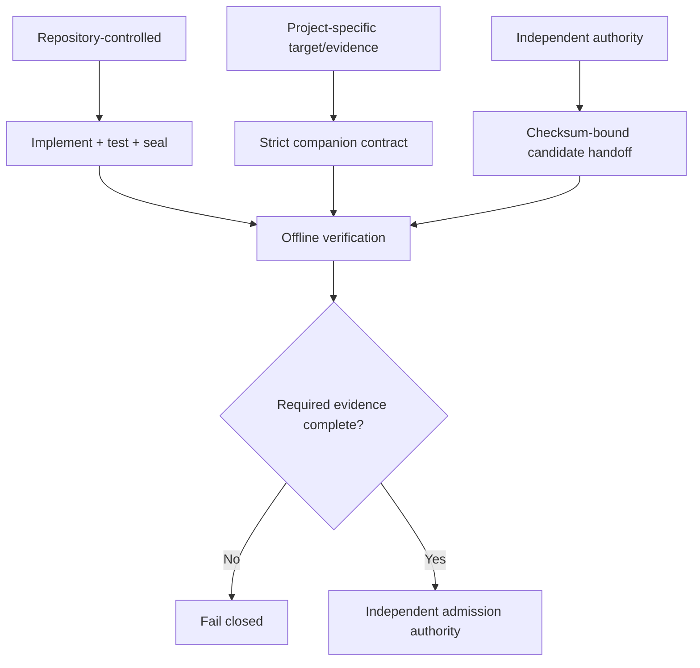

# Findings-driven closure register

Last reviewed: 2026-08-10

This register resolves the current 89-item maturity backlog. **Implemented**
means this repository contains a testable control. **Conditional** means the
adapter and strict evidence contract exist, but a project-specific target or
companion run is required. **External authority** is deliberately fail-closed:
the suite prepares and verifies evidence but cannot approve itself.

## Release and effectiveness

| # | Item | Resolution |
|---:|---|---|
| 1 | Controlled signing lane | External authority: `prepare-signing`, `verify-signing-request`, exact subjects, and signing config handoff |
| 2 | Artifact quarantine | Implemented fail-closed disposition and candidate labeling; physical quarantine and storage immutability are external |
| 3 | Signed Passport | Implemented verification and signing integration; key custody/identity approval is external |
| 4 | Enterprise admission command | Implemented: `evidence-pack` composes governed inputs; `verify-release-manifest` rechecks manifest, report, evidence, bindings, and required names |
| 5 | Scanner trust approval | External authority: grouped digest candidates, expiring catalog, exact primary/auxiliary enforcement |
| 6 | External isolation | External authority: strict signed attestation bound to runner, source, policy, and validity window |
| 7 | Intelligence approval | External authority: strict snapshot set, digest, revision, freshness, and approval evidence |
| 8 | Comparable baseline | Implemented: profile/tool set/source identity and production VCS ancestry checks plus `baseline-candidate` |
| 9 | Assurance closure | Implemented: claim prerequisites, evidence, owner, blocker graph, and remediation route |
| 10 | Expanded corpus | Implemented template covering positive/negative SAST, secrets, dependency, IaC, workflow, architecture, and dead-code cases |
| 11 | Per-scanner cases | Implemented gates: named required tools, tools represented, and minimum labels per tool |
| 12 | Disagreement reporting | Implemented: promotion plan reports unique and corroborated tool yield per finding |
| 13 | Mutation validation | Conditional: strict `mutmut` companion evidence adapter |
| 14 | Parser regression corpus | Implemented scanner fixtures, normalized-output tests, and strict schemas |
| 15 | Adapter fuzzing | Implemented bounded parsers plus Hypothesis/fuzz-oriented tests; Atheris is a conditional companion |
| 16 | False-positive workflow | Implemented digest-bound risk acceptance with fingerprint, owner, reason, scope, and expiry |
| 17 | Effectiveness history | Implemented: approved evaluations flow through release readiness and are retained in the closed release manifest and audit package; long-term retention is external |
| 18 | Minimum evidence confidence | Implemented: scan policy and `policy-simulate --minimum-confidence` |

## Conditional security domains

| # | Item | Resolution |
|---:|---|---|
| 19 | DAST | Conditional ZAP evidence adapter; live target and disposable lane required |
| 20 | Threat model | Conditional pytm evidence plus this suite threat model |
| 21 | Schemathesis | Conditional JUnit companion ingestion; API schema and target required |
| 22 | Conftest | Implemented native offline adapter when Rego/config inputs exist |
| 23 | GitHub workflow tools | Implemented zizmor and actionlint adapters plus hardened workflow example |
| 24 | Reproducible builds | Conditional strict digest comparison evidence |
| 25 | Malware | Implemented/conditional ClamAV, YARA, GuardDog, ScanCode, and package signals with local databases |
| 26 | in-toto | Conditional layout/link verification evidence and Passport provenance |
| 27 | OCI | Conditional OCI image evidence plus Trivy/Checkov/KICS/KubeLinter coverage |
| 28 | Linux companion | Implemented companion contracts and Linux runner guidance; infrastructure is external |
| 29 | Mutation/symbolic execution | Conditional mutmut, CrossHair, and Atheris evidence |

## Reporting and actionability

| # | Item | Resolution |
|---:|---|---|
| 30 | Manifest verification receipt | Implemented portable schema 1.0 receipt with relocation-safe evidence mapping |
| 31 | Freshness dashboard | Implemented deterministic isolation, intelligence, and scanner-trust freshness in promotion plan 1.1 |
| 32 | Causal blocker HTML | Implemented blocker relationships in JSON, Markdown, and standalone HTML |
| 33 | Side-by-side comparison | Implemented finding delta, reachability delta, and trend comparison |
| 34 | Evidence timeline | Implemented verified report timeline and scanner history |
| 35 | Finding SLA | Implemented durable `finding-register` state with stable identity, owner, due time, overdue state, resolution, and reopen history |
| 36 | GitHub annotations | Implemented digest/report-bound workflow commands plus SARIF and job-summary Markdown |
| 37 | Audience filtering | Implemented verified `audience-report` exports for executive, developer, security, release-engineering, and auditor views |
| 38 | Applicability explanation | Implemented per-tool reason/limitations and domain activation instructions |
| 39 | Evidence-change alerts | Implemented finding churn, version, status, applicability, profile, and performance anomalies |

## Reliability and execution

| # | Item | Resolution |
|---:|---|---|
| 40 | Performance budgets | Implemented relative regression, absolute total runtime, and named per-tool budgets in `trend` and the consolidated `evidence-pack` path |
| 41 | CodeQL optimization | Implemented explicit applicability, bounded timeout/output, database reuse boundary, and slow-tool visibility |
| 42 | Resource scheduling | Implemented bounded concurrency and private per-tool workspaces |
| 43 | Profile cadence | Implemented quick/standard/quality/repo/comprehensive/production/release and specialist profiles; cadence documented operationally |
| 44 | Scanner reliability history | Implemented completion percentage, status, version, applicability, and duration history |
| 45 | Performance anomalies | Implemented latest-versus-previous duration alerts |
| 46 | Interrupted testing | Implemented fail-closed incomplete reports plus atomic report and evidence-pack publication; partial results cannot satisfy admission |
| 47 | Path matrix | Implemented Windows/Linux/macOS compatibility and N/A reasons in the compatibility matrix |
| 48 | Cross-platform | Implemented portable Python contracts and native scripts; enterprise runners must validate their exact platform bundle |
| 49 | Incremental diagnostics | Implemented `doctor`, profile/applicability diagnostics, targeted adapters, and trend comparison; security gates still recompute evidence |

## Architecture and reachability

| # | Item | Resolution |
|---:|---|---|
| 50 | Multi-scenario runtime traces | Implemented digest-bound `merge-coverage` line union for API, worker, CLI, test, or other approved scenarios |
| 51 | Framework plugins | Implemented conservative CLI, package, test, web, task, decorator, and configuration root discovery |
| 52 | Confidence calibration | Implemented precision features, warnings, static/runtime confidence factors, and evidence strength |
| 53 | Security-aware reachability | Implemented normalized finding locations and reachable/load-only/disconnected graph correlation |
| 54 | Unused-island lifecycle | Implemented stable islands, size, confidence, owner/action guidance, and reachability delta |
| 55 | Removal verification | Implemented baseline/current graph comparison for resolved, grown, and newly disconnected islands |
| 56 | Cross-language edges | Explicit boundary: Python AST graph only; native and companion analyzers cover non-Python assets without inventing graph edges |
| 57 | Architecture drift | Implemented Tach boundary enforcement and reachability delta |

## Enterprise governance

| # | Item | Resolution |
|---:|---|---|
| 58 | Scanner-bundle SBOM | Implemented CycloneDX/Syft inventory plus tool identity manifest; enterprise bundle build publishes its SBOM |
| 59 | Tool lifecycle | Implemented admission, renewal, observation, replacement, and retirement policy in `tool-lifecycle.md` |
| 60 | Schema compatibility | Implemented immutable versioned bundled schemas, export CLI, and schema/document validation tests |
| 61 | Wheel smoke | Implemented `scripts/test-wheel-offline.ps1` with isolated no-index wheelhouse install and CLI/schema checks |
| 62 | Retention package | Implemented atomic `evidence-pack`, deterministic `audit-package`, closed file identities, completion marker, governed effectiveness/Passport inputs, and independent full-file/report verification; immutable encrypted storage is external |
| 63 | Policy simulation | Implemented `policy-simulate` for severity, confidence, required tools, and finding threshold |
| 64 | Configuration provenance | Implemented validated, value-redacted per-key origin map plus source digests and effective scanner set |
| 65 | Disclosure workflow | Implemented private reporting policy and response targets in `SECURITY.md`; incident system is external |
| 66 | Suite threat model | Implemented assets, boundaries, threats, controls, residual ownership, and abuse cases in `threat-model.md` |
| 67 | Project bootstrap | Implemented atomic offline templates for library, API, CLI, worker, and monorepo targets with safe argument-array handoff |
| 68 | Explainable preflight | Implemented schema-governed text, JSON, and Markdown readiness with actionable classifications and atomic export |
| 69 | Root-cause prerequisite triage | Implemented grouped remediation batches that preserve complete per-control evidence and fail-closed decisions |
| 70 | Relocatable scanner bundle | Implemented explicit `[paths] bundle_root`, traversal-safe `@bundle/...` resolution, and portable native installer output |
| 71 | Offline provisioning plan | Implemented non-mutating text, strict JSON, Markdown, atomic output, ordered batches, and argument-array verification |
| 72 | Multi-axis admission decision | Implemented first-class source, test, dependency, artifact, and governance cards plus a strict derived artifact |
| 73 | Adapter SDK qualification | Implemented non-executing registry, concrete-type, identity, configuration, exit-code, and environment checks for all 64 adapters |
| 74 | CI workflow generation | Implemented pinned-action, no-install GitHub workflow scaffold with explicit isolation verification and deferred policy exit |
| 75 | Local developer integration | Implemented local-only pre-commit adapter and readiness diagnostics with an explicit non-gate scope |
| 76 | Bundle qualification | Implemented activation-free join over registry contracts, profile prerequisites, executable identities, applicability, and trust state |
| 77 | Configuration assistance | Implemented bounded TOML validation, effective-profile summary, schema compatibility, portable-path inventory, and reviewed migration guidance |
| 78 | Closed native bundle and wheelhouse | Implemented independent manifest-digest verification, exact-set comparison, link/path/size/hash checks, bounded wheel inspection, and optional fail-closed no-index dependency resolution for every declared environment |
| 79 | Behavioral bundle qualification | Implemented schema 1.1 qualification that binds a labeled-corpus evaluation by approved digest, verifies its producing report, matches every measured unchanged executable digest to the current bundle, and enforces label/named-tool/required-tool minimums without misrepresenting retained evidence as execution |
| 80 | Decision-safe grades | Implemented distinct execution, observed-risk, evidence, and release fields with strict schema validation and decision-state tests |
| 81 | Conditional activation ownership | Implemented deterministic activation category, owner, trigger, action, closure evidence, and report references for every N/A control |
| 82 | Native bundle reproducibility | Corrected the pinned Actionlint asset, added bounded semantic OSV snapshot validation, included hidden files in the manifest, and independently verified exact-set plus no-index closure for all declared environments |
| 83 | Invented clean benchmark fixtures | Added a strict sealed source inventory and reject clean path labels unless the exact path participates in the unchanged source snapshot |
| 84 | Narrow behavioral qualification | Expanded retained proof to 10 reviewed labels and three core scanners, with no FP/FN and exact current executable-digest continuity |
| 85 | Divergent applicability guidance | Centralized conditional-control classification so doctor and portfolio reporting share deterministic categories while retaining audience-appropriate actions and ownership |
| 86 | Optional source inventory downgrade | Made the exact source inventory a canonical required report artifact and independently verify its bounded canonical records, aggregate identity, and manifest binding before Passport claims are accepted |
| 87 | Fragmented gap remediation | Implemented a canonical `closure-plan.json` in every report plus verified JSON/Markdown export with stable IDs, ownership, authority, evidence, and safe command arrays |
| 88 | Reproducibility evidence producer | Implemented deterministic safe `normalize-sdist` plus `compare-builds` with hidden-file inclusion, link rejection, exact-set and SHA-256 comparison, strict schemas, actionable mismatch findings, and adapter-compatible output |
| 89 | Closure-plan report integration | Linked the owned backlog from Markdown and HTML, exported immutable schemas, and kept repository work distinct from organization and external authority |

