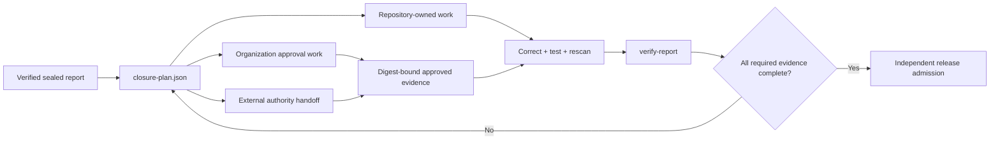

# Findings-derived enhancement plan

Last reviewed: 2026-08-10

This register maps the latest 52 enhancement recommendations to executable
product evidence. **Implemented** means the repository contains a tested local
control. **Conditional** means the adapter, evidence contract, activation rule,
owner, and closure test exist but relevant target content or companion evidence
is not present. **External authority** means the suite prepares and verifies the
handoff but deliberately cannot grant its own approval.

## Release and supply chain

| # | Enhancement | Resolution | Proof or boundary |
|---:|---|---|---|
| 1 | Controlled Sigstore signing lane | Implemented + external authority | `prepare-signing`, `verify-signing-request`, and `sign-artifacts`; key custody and signer authorization remain external |
| 2 | Independent signature verification | Implemented | Cosign bundles, exact artifact subjects, Security Passport verification, and separately supplied trust material |
| 3 | External network-isolation attestation | Implemented + external authority | Strict isolation evidence schema and source/time binding; the suite cannot create or approve its own boundary |
| 4 | Scanner executable approval | Implemented + external authority | Exact primary/helper digests, unchanged checks, grouped governance draft, expiry, and organization-approval fields |
| 5 | Release admission workflow | Implemented | `release-check` and multi-axis admission fail closed across source, tests, dependencies, artifacts, and governance |
| 6 | Reproducible distributions | Implemented now | `normalize-sdist` plus `compare-builds` produced identical wheel/sdist evidence from two clean fixed-epoch builds |
| 7 | PyPI Trusted Publisher | Conditional | `pypi-attestations` activates from reviewed publisher identity and exact distribution attestations |
| 8 | In-toto provenance | Conditional | Digest-bound companion evidence contract and release-manifest binding |
| 9 | GitHub artifact attestations | Conditional | Offline companion evidence with producer and subject identity |
| 10 | SBOM-to-artifact binding | Implemented | CycloneDX/Syft identities participate in the sealed report and closed release manifest |
| 11 | Malware inspection | Conditional | ClamAV and YARA evidence lanes activate only with approved rules/database identities |
| 12 | Package-manifest validation | Conditional | `check-manifest` companion evidence is owned and activation-safe |
| 13 | OCI artifact evidence | Conditional | OCI digest, provenance, and scanner evidence enter through the strict companion contract |

## Test, behavioral, and architecture assurance

| # | Enhancement | Resolution | Proof or boundary |
|---:|---|---|---|
| 14 | Branch-coverage improvement | Implemented | Coverage/JUnit/diff gates plus closure-plan target selection and policy thresholds |
| 15 | Critical coverage hotspots | Implemented now | `closure-plan` ranks bounded `src/` hotspots against an operator-selected target |
| 16 | Mutation testing | Conditional | Mutmut evidence contract, owner, trigger, and closure evidence |
| 17 | Symbolic and contract testing | Conditional | CrossHair evidence contract and exact companion identity |
| 18 | Parser fuzzing | Conditional | Atheris evidence contract with retained crash findings |
| 19 | API contract testing | Conditional | Schemathesis activates from a reviewed OpenAPI digest or imported bounded evidence |
| 20 | Dynamic application testing | Conditional | ZAP evidence remains bound to a separately identified running target |
| 21 | Broader effectiveness corpus | Implemented | Labeled positive/negative corpus, per-tool minimums, FP/FN measures, and executable-digest continuity |
| 22 | Explicit dynamic roots | Implemented | Reachability configuration, warnings, confidence caps, and owned closure-plan review |
| 23 | Load-only adapter noise | Implemented | Static/runtime conflict is non-reportable and removal-blocked until registry/dynamic behavior is modeled |
| 24 | Entry-point scenario coverage | Implemented | Digest-bound `merge-coverage` combines named API, worker, CLI, test, or scheduled lanes |
| 25 | Reachability regression gate | Implemented | Stable island identity and `reachability-diff` detect new, grown, and resolved islands |
| 26 | Architecture ownership | Implemented | Tach exact dependency contract plus reachability owners/actions |

## Conditional control activation

| # | Enhancement | Resolution | Proof or boundary |
|---:|---|---|---|
| 27 | Approved `pipdeptree` environment | Conditional | Immutable target-environment identity and offline dependency-tree evidence |
| 28 | PySA models | Conditional | Reviewed local Pyre/PySA configuration and completed scanner evidence |
| 29 | Conftest policy pack | Conditional | Approved local policy directory and digest |
| 30 | KICS policy library | Conditional | Approved local query library and relevant IaC trigger |
| 31 | Vale documentation policy | Conditional | Fully local reviewed configuration |
| 32 | GuardDog companion platform | Conditional | Supported Linux/macOS runner identity and digest-bound imported evidence |
| 33 | REUSE licensing | Conditional | SPDX/REUSE opt-in marker activates the control without inventing applicability |
| 34 | GitHub workflow controls | Conditional | Actionlint, Zizmor, and Scorecard activate when workflow/remote evidence exists |
| 35 | Content-triggered controls | Implemented | Deterministic content detection retains every selected control and explains N/A state |

## Reporting and operational resilience

| # | Enhancement | Resolution | Proof or boundary |
|---:|---|---|---|
| 36 | Guided gap closure | Implemented now | Canonical `closure-plan.json` and verified JSON/Markdown CLI export |
| 37 | Release handoff package | Implemented | Signing request, verification receipt, evidence pack, release manifest, and audit package |
| 38 | External-boundary labeling | Implemented | Repository, organization, and external authority are distinct in admission and closure output |
| 39 | Finding independence | Implemented | Effectiveness output distinguishes corroborated and single-tool findings |
| 40 | Coverage hotspot view | Implemented now | Stable work items include percentage, target, evidence references, owner, and acceptance criteria |
| 41 | Reachability explorer | Implemented | JSON sequences/islands plus HTML/Markdown summaries, confidence, runtime state, and removal readiness |
| 42 | Action completion tracking | Implemented | Finding register retains owner, SLA, resolution, reopen history, and stable fingerprint |
| 43 | Machine backlog export | Implemented now | Strict schema, stable `PYSEC-ACT-*` IDs, safe command arrays, tools, and related finding IDs |
| 44 | Comparative dashboard | Implemented | Trend, finding delta, reachability delta, scanner history, and portfolio aggregation |
| 45 | Evidence freshness | Implemented | Promotion plan and release readiness distinguish expiration by evidence class |
| 46 | Cross-platform qualification | Implemented + external execution | Windows native bundle and portable contracts; each enterprise runner qualifies its exact platform bundle |
| 47 | Failure injection | Implemented | Malformed, interrupted, unsafe-path, replacement, rollback, and atomic-publication tests fail closed |
| 48 | Resource governance | Implemented | Scanner timeout/output bounds, bounded concurrency, private workspaces, and trend/tool budgets |
| 49 | Bundle lifecycle | Implemented | Admission/renewal/retirement policy, doctor, qualification, closed manifest, and no-index wheel closure |
| 50 | Intelligence lifecycle | Implemented + external approval | Connected preparation, semantic validation, digest approval, offline use, freshness, and fail-closed expiry |
| 51 | Retention validation | Implemented + external storage | Checksums, `COMPLETE`, evidence/audit verification, and relocation-safe contracts; immutable storage remains external |
| 52 | Disaster-recovery verification | Implemented | Portable audit/evidence packages independently verify the embedded report and every retained file on a clean host |

## Closure flow

This register does not claim that conditional target content exists or that an
external authority has approved a candidate. It proves that each recommendation
has an integrated product control, an explicit activation boundary, or a bounded
handoff that can be independently verified.
