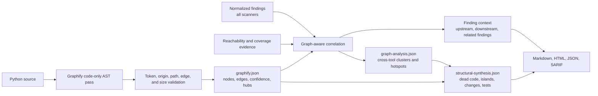

# Graphify code-graph integration

Last reviewed: 2026-08-13

Graphify adds a deterministic code-property graph to the suite's finding,
architecture, complexity, coverage, and reachability perspectives. The adapter
uses the `graphifyy` package and runs only this bounded command:

```text
graphify extract TARGET --code-only --no-cluster --out TEMP --max-workers 1
```

The scan supplies no LLM backend and does not enable document, URL, hook,
Postgres, or live-input analysis. It rejects nonzero model tokens, non-AST
origins, hyperedges, escaping paths, and oversized graphs; Graphify's implicit
package/external endpoints are normalized into bounded explicit placeholders.
API-key variables are excluded by the suite's reduced environment.

Graph JSON is written to a private temporary file. Graphify receives a bounded
64 MiB file allowance because real repository graphs can exceed the generic
16 MiB scanner-stream cap; captured stdout and stderr remain subject to that
smaller global cap. Normalization still enforces 250,000 nodes, 750,000 edges,
4,096-character fields, zero hyperedges/model tokens, repository-relative
paths, and the report's 128 MiB artifact boundary.

## Evidence flow



## Interpretation

- `graphify.json` is normalized supporting evidence, not a vulnerability list.
- `graph-analysis.json` lists structural hubs and nearby findings from multiple
  tools.
- `structural-synthesis.json` cross-validates symbol/file references against
  reachability islands, Vulture, runtime coverage, Radon, Tach, ownership, and
  findings. It also maps changed files to direct and transitive tests, identifies
  conservative orphan symbols, and retains concrete island boundary relations.
  See [Structural synthesis](structural-synthesis.md).
- Each located finding receives concise upstream, downstream, centrality, and
  related-finding context in Markdown, HTML, and JSON.
- Static connectivity does not prove runtime reachability, exploitability, or
  safety. The built-in reachability analyzer and test evidence remain separate.
- Graph centrality alone never raises or lowers a finding's native severity.

Graphify edge confidence (`EXTRACTED`, `INFERRED`, or `AMBIGUOUS`) is retained.
The connected preparation script pins the package and dependencies; the
disconnected installer creates a dedicated `graphify-env`, hashes its entry
point, and writes the exact path and SHA-256 to `pysec.native.toml`. Docker is
not required.

References: [Graphify CLI](https://graphify.com/docs/cli),
[security model](https://graphify.com/security), and
[source repository](https://github.com/Graphify-Labs/graphify).
