# Python Security Suite documentation

Last reviewed: 2026-08-07

This directory is the canonical documentation set. The suite is offline-first:
tool and data acquisition happens in a connected preparation lane; scanning and
verification happen inside an enterprise-controlled isolated boundary.

## Start here

| Goal | Read |
|---|---|
| Understand architecture and trust boundaries | [Design](design.md) |
| Install and operate without Docker or internet access | [Operations](operations.md) |
| Configure profiles, policy, ownership, and exit behavior | [Configuration](configuration.md) |
| Trace entry points and investigate disconnected code | [Python reachability](reachability.md) |
| Measure scanner execution and labeled detection effectiveness | [Effectiveness](effectiveness.md) |
| Make one fail-closed promotion decision | [Governed release readiness](release-readiness.md) |
| Compare scanner coverage and platform support | [Compatibility matrix](compatibility-matrix.md) |
| Enforce a production release gate | [Production security](production-security.md) |
| Verify provenance, risk intelligence, and passports | [Security Passport](security-passport.md) |
| Add dynamic, fuzzing, malware, or reproducibility evidence | [Companion assurance](companion-assurance.md) |
| Review tool admission and rejection criteria | [Tool selection](tool-selection.md) |

Project policies and history:

- [Security policy](../SECURITY.md)
- [Contributing guide](../CONTRIBUTING.md)
- [Changelog](../CHANGELOG.md)
- [Project README](../README.md)

## System at a glance

```mermaid
flowchart LR
    subgraph Connected["Connected preparation lane"]
        Sources["Approved package and data sources"] --> Bundle["Pinned native bundle"]
        Bundle --> Manifest["Hashes, package inventory, and offline databases"]
    end
    Manifest --> Transfer["Enterprise transfer and inspection"]
    subgraph Isolated["Externally enforced isolated boundary"]
        Transfer --> Doctor["pysec doctor"]
        Repo["Python repository"] --> Doctor
        Doctor --> Scan["63-adapter applicability-aware scan"]
        Scan --> Normalize["Normalize, correlate, classify, and own"]
        Normalize --> Gate["Policy decision"]
        Gate --> Seal["Checksum-sealed report"]
    end
    Seal --> Inspect["verify-report and inspect"]
    Inspect --> Passport["Security Passport verification"]
    Passport --> Release["release-check<br/>one governed decision"]
    Inspect --> GitHub["Markdown, HTML, SARIF, SonarQube, and JSON"]
```



`--network-isolated` records an operator assertion; it does not create a
sandbox. The VM, container, runner, or network policy must enforce isolation.

## Coverage map

| Layer | Primary perspectives | Representative tools |
|---|---|---|
| Python source security | AST patterns, structural rules, data flow, native extensions | Bandit, Semgrep, CodeQL, Pysa, Ruff, DevSkim, Flawfinder |
| Secrets | Working tree, history, detector diversity | detect-secrets, Gitleaks, TruffleHog |
| Dependencies and components | Vulnerabilities, malicious packages, SBOMs, licenses | OSV-Scanner, Grype, GuardDog, CycloneDX, Syft, Trivy, ScanCode |
| Architecture and quality | Boundaries, cycles, types, correctness, complexity, three-state reachability, explained entry-point paths, disconnected islands, runtime corroboration, changed-line coverage | Tach, reachability, mypy, Pyright, Pylint, deptry, Radon, Vulture, coverage, diff-cover |
| Delivery configuration | GitHub Actions, containers, IaC, shell and PowerShell | zizmor, actionlint, Hadolint, Checkov, ShellCheck, PSScriptAnalyzer |
| Distribution assurance | Wheel/sdist structure, metadata, attestations, signing | check-wheel-contents, Twine, PyPI attestations, Cosign, in-toto evidence |
| Governance | KEV/EPSS/VEX, ownership, lifecycle, accepted risk, release evidence | CISA KEV, FIRST EPSS, CycloneDX VEX, CODEOWNERS, Security Passport |

Overlap is deliberate. Correlation retains scanner attribution without counting
the same observation as multiple independent risk votes. See the
[compatibility matrix](compatibility-matrix.md) for all adapters, applicability,
platform support, and acquisition requirements.

## Current verified baseline

| Measure | Verified result |
|---|---:|
| Profile | `comprehensive` |
| Selected adapters | 63 |
| Applicable and completed | 36 / 36 |
| Correctly not applicable | 27 |
| Unavailable, failed, timed out, or parse errors | 0 |
| Policy outcome | `INCOMPLETE` — external network-isolation attestation was not provided |
| Normalized findings | 2 expected Cosign bundle findings |
| Reachability graph | Schema 1.2; per-island confidence and explained edges |
| Reachability states | 967 executable; 91 load-only; 0 disconnected; 0 reportable islands |
| Runtime corroboration | 967/967 executable nodes observed; 90/91 load-only nodes observed by tests |
| Tests | 370 passed, 1 platform-limited skip; 159 subtests passed |
| Combined line and branch coverage | 91.31% |
| Branch coverage | 83.90% |
| Changed-line coverage | 89%; every changed production file meets the 80% threshold |
| Operational portfolio | Grade A; 36/36 applicable control slots completed across 12 domains |
| Labeled self-scan benchmark | PASS; 1 TP, 1 TN, 0 FP, 0 FN |

The 2026-08-07 self-scan is in `.artifacts/maturity-selfscan-v13`. Its 94-file
checksum seal and semantic contracts verify. All applicable scanners completed,
and the only normalized findings are the two expected missing Cosign bundles for
the wheel and source distribution. Code security, secrets, dependency
vulnerabilities, architecture, and quality were clean. The digest-pinned KEV and
EPSS inputs were fresh, locally validated snapshots; the approval receipt
correctly records absent organization authorization. All 38 scanner entry points were unchanged after
execution; 25 bindings across 22 unique digests remain candidates for
organization provenance approval. The result correctly remains `INCOMPLETE`
because the host run did not provide an external network-isolation attestation.
Approve the governed intelligence and scanner catalog, supply organization-
policy-bound isolation evidence, rerun inside the enforced boundary, then sign
both exact release artifacts. The release-readiness sidecar names all six
remaining promotion blockers and the reachability delta reports no regressions.

The report contains:

- decision-first `summary.md`, `action-plan.md`, and `assurance-case.md`;
- a self-contained HTML dashboard with cited finding cards and source context;
- SARIF 2.1.0 and SonarQube generic external issues;
- normalized findings, scanner evidence, applicability, and integrity records;
- source and artifact CycloneDX SBOMs plus artifact SHA-256 identities;
- reachability topology and representative entry-point sequences;
- risk-intelligence, lifecycle, effectiveness, and SSDF claim evidence;
- operational domain coverage and scanner-trust application evidence; and
- an exact checksum manifest and Security Passport statement.

The companion proof at `.artifacts/detection-validation-v7` records six expected
Bandit, Semgrep, and detect-secrets findings, 100% expected-perspective recall,
and zero findings on the safe negative control.

<details>
<summary>Verified native tool versions</summary>

| Group | Versions |
|---|---|
| Core security | Bandit 1.9.4; Semgrep 1.170.0; detect-secrets package 1.5.0; OSV-Scanner 2.3.8 |
| Python quality | Ruff 0.15.22; Pylint 4.0.6; mypy 2.1.0; Pyright 1.1.411; Vulture 2.16; Radon 6.0.1; Tach 0.35.0 |
| Dependency and test evidence | deptry 0.24.0; diff-cover 10.2.0; CycloneDX Python 7.3.0 |
| Delivery | actionlint 1.7.12; Hadolint 2.14.0; Checkov 3.2.494; PSScriptAnalyzer 1.25.0 |
| Repository and supply chain | DevSkim 1.0.70; ScanCode 32.5.0; Trivy 0.69.3; Gitleaks 8.30.1; TruffleHog 3.95.9; Syft 1.49.0; Grype 0.116.0 |
| Packaging | check-wheel-contents 0.6.3; Twine 6.2.0; PyPI attestations 0.0.29; Cosign 3.1.2 |
| Semantic analysis | `run-codeql` 1.6.0 with CodeQL CLI 2.25.5 |

</details>

## Offline report contracts

| Contract | Current schema | Purpose |
|---|---|---|
| Inspection | [1.3](../src/py_security_suite/schemas/report-inspection-1.3.schema.json) | Verified machine-readable decision, health, action completeness, and prioritized findings |
| Inspection verification | [1.3](../src/py_security_suite/schemas/report-inspection-verification-1.3.schema.json) | Binds the inspection digest, report checksum, action limit, and omission summary |
| Report verification | [1.0](../src/py_security_suite/schemas/report-verification.schema.json) | Portable receipt for report integrity and semantic verification |

Export exact schemas from the installed wheel without network access:

```text
pysec schema report-inspection-1.3 --output contracts/report-inspection.schema.json
pysec schema report-inspection-verification-1.3 --output contracts/report-inspection-verification.schema.json
pysec schema report-verification-1.0 --output contracts/report-verification.schema.json
```

Inspection versions 1.0 through 1.2 remain frozen under their explicit names.
There is no ambiguous `latest` alias or remote schema lookup.

## Documentation maintenance

- Update `Last reviewed` when behavior, evidence, or pinned tools change.
- Keep connected acquisition commands separate from isolated execution commands.
- Treat implementation and generated manifests as authoritative when they
  disagree with prose.
- Never claim that an unsigned passport proves publisher identity or release
  approval.
- Add compatibility and selection entries before making a scanner required.
