# Python Security Suite documentation

Last reviewed: 2026-08-13

This directory is the canonical documentation set. The suite is offline-first:
tool and data acquisition happens in a connected preparation lane; scanning and
verification happen inside an enterprise-controlled isolated boundary.

## Start here

| Goal | Read |
|---|---|
| Understand architecture and trust boundaries | [Design](design.md) |
| Install and operate without Docker or internet access | [Operations](operations.md) |
| Configure profiles, policy, ownership, and exit behavior | [Configuration](configuration.md) |
| Understand threats, trust boundaries, and abuse cases | [Suite threat model](threat-model.md) |
| Govern scanner upgrades and retirement | [Scanner bundle lifecycle](tool-lifecycle.md) |
| Trace entry points and investigate disconnected code | [Python reachability](reachability.md) |
| Add graph-aware blast radius and cross-tool context | [Graphify integration](graphify.md) |
| Trace declared entry points to findings and sensitive sinks | [Static risk routes](risk-paths.md) |
| Cross-validate dead code, islands, and import cycles | [Structural synthesis](structural-synthesis.md) |
| Trace sensitive data into logs, telemetry, and SDKs | [Sensitive-data exposure](data-exposure.md) |
| Understand source-to-artifact and cross-scanner joins | [Cross-tool evidence fusion](evidence-fusion.md) |
| Measure scanner execution and labeled detection effectiveness | [Effectiveness](effectiveness.md) |
| Make one fail-closed promotion decision | [Governed release readiness](release-readiness.md) |
| Track every enhancement and its authority boundary | [Product enhancement matrix](product-enhancement-matrix.md) |
| Review closure of the latest findings backlog | [Findings-driven closure register](findings-closure.md) |
| Review the 52 findings-derived enhancements | [Findings enhancement plan](findings-enhancement-plan.md) |
| Compare scanner coverage and platform support | [Compatibility matrix](compatibility-matrix.md) |
| Enforce a production release gate | [Production security](production-security.md) |
| Verify provenance, risk intelligence, and passports | [Security Passport](security-passport.md) |
| Add dynamic, fuzzing, malware, or reproducibility evidence | [Companion assurance](companion-assurance.md) |
| Review tool admission and rejection criteria | [Tool selection](tool-selection.md) |

Project policies and history:

- [Security policy](../SECURITY.md)
- [Contributing guide](../CONTRIBUTING.md)
- [Changelog](../CHANGELOG.md)
- [Project README](../README.md)

## System at a glance

```mermaid
flowchart LR
    subgraph Connected["Connected preparation lane"]
        Sources["Approved package and data sources"] --> Bundle["Pinned native bundle"]
        Bundle --> Manifest["Hashes, package inventory, and offline databases"]
    end
    Manifest --> Transfer["Enterprise transfer and inspection"]
    subgraph Isolated["Externally enforced isolated boundary"]
        Transfer --> Doctor["pysec doctor"]
        Repo["Python repository"] --> Doctor
        Doctor --> Scan["64-adapter applicability-aware scan"]
        Scan --> Normalize["Normalize, correlate, classify, and own"]
        Normalize --> Gate["Policy decision"]
        Gate --> Seal["Checksum-sealed report"]
    end
    Seal --> Inspect["verify-report and inspect"]
    Inspect --> Passport["Security Passport verification"]
    Passport --> Release["release-check<br/>one governed decision"]
    Release --> Plan["promotion-plan<br/>audience views + ordered actions"]
    Seal --> Closure["closure-plan<br/>validation ownership"]
    Seal --> Diff["diff-coverage<br/>change assessment scope"]
    Seal --> Trend["operational trend<br/>debt trajectory"]
    Closure --> Plan
    Diff --> Plan
    Diff --> Trend
    Trend --> Plan
    Plan --> Audit["portable audit package<br/>closed + independently verified"]
    Plan --> Request["exact-set signing request"]
    Inspect --> GitHub["Markdown, HTML, SARIF, SonarQube, and JSON"]
```



`--network-isolated` records an operator assertion; it does not create a
sandbox. The VM, container, runner, or network policy must enforce isolation.

## Coverage map

| Layer | Primary perspectives | Representative tools |
|---|---|---|
| Python source security | AST patterns, structural rules, data flow, native extensions | Bandit, Semgrep, CodeQL, Pysa, Ruff, DevSkim, Flawfinder |
| Secrets | Working tree, history, detector diversity | detect-secrets, Gitleaks, TruffleHog |
| Sensitive-data disclosure | Logs, telemetry, analytics, metrics, error monitoring, and SDK surfaces | Semgrep taint, Pysa, CodeQL, Graphify, reachability |
| Dependencies and components | Vulnerabilities, malicious packages, SBOMs, licenses | OSV-Scanner, Grype, GuardDog, CycloneDX, Syft, Trivy, ScanCode |
| Architecture and quality | Boundaries, cycles, types, correctness, complexity, code-graph impact, three-state reachability, explained entry-point paths, disconnected islands, runtime corroboration, changed-line coverage | Tach, Graphify, reachability, mypy, Pyright, Pylint, deptry, Radon, Vulture, coverage, diff-cover |
| Delivery configuration | GitHub Actions, containers, IaC, shell and PowerShell | zizmor, actionlint, Hadolint, Checkov, ShellCheck, PSScriptAnalyzer |
| Distribution assurance | Wheel/sdist structure, metadata, attestations, signing | check-wheel-contents, Twine, PyPI attestations, Cosign, in-toto evidence |
| Governance | KEV/EPSS/VEX, ownership, lifecycle, accepted risk, release evidence | CISA KEV, FIRST EPSS, CycloneDX VEX, CODEOWNERS, Security Passport |

Overlap is deliberate. Correlation retains scanner attribution without counting
the same observation as multiple independent risk votes. See the
[compatibility matrix](compatibility-matrix.md) for all adapters, applicability,
platform support, and acquisition requirements.

## Current verified source assurance and scan baseline

| Measure | Verified result |
|---|---:|
| Profile | `comprehensive` |
| Selected adapters | 64 |
| Applicable and completed | 37 / 38 |
| Correctly not applicable | 26 |
| Unavailable, failed, timed out, or parse errors | 1 — Grype correctly rejected its 10.9-day-old offline database against the 10-day policy |
| Policy outcome | `INCOMPLETE` — the Grype database requires connected-lane refresh, the previous baseline predates the 64-tool set, and the two exact release distributions remain intentionally unsigned |
| Normalized findings | 2 expected Cosign bundle findings |
| Graphify evidence | 9,614 nodes and 18,121 edges across 251 files; zero model tokens |
| Evidence fusion | 2 findings enriched, 103 package lineages, 3 compound hotspots, 0 contradictions or version drift |
| Latest deep source validation | Zero normalized findings; CodeQL, Bandit, Semgrep, detect-secrets, OSV-Scanner, CycloneDX, and Ruff completed (`maturity-source-deep-v68`) |
| Latest structural validation | Verified, schema-valid synthesis over 10,408 Graphify nodes and 19,343 edges: 53 changed Python files mapped to 59 focused tests, 0 unmapped changes, 13 boundary-traced runtime-model gaps, 0 supported orphan/dead-code candidates, 0 cycles, and no truncation (`maturity-structural-quality-v73`) |
| Latest data-exposure validation | Behavioral corpus correlated 17 exposure findings across logs, bound logger context, credential fields, precise request collections, runtime-state dumps, Sentry, GenAI capture, wildcard headers, URL queries, raw client errors, risky PII configuration, and weak pseudonymization. All 14 exposure/configuration rules executed, all 3 required scanner perspectives were present, actionable metadata was 100%, and safe controls—including `embedding_response.data`—produced 0 findings (`detection-validation-enhanced`). The 181-file schema-1.1 self-scan produced 0 exposure findings, 0 sink/configuration surfaces, and 0 parse errors; Bandit, Semgrep, and detect-secrets completed cleanly while the 10.6-day OSV snapshot correctly remained unavailable against its 10-day policy (`data-exposure-enhanced-self-scan`). |
| Reachability graph | Schema 1.2; per-island confidence and explained edges |
| Reachability states | 1,350 executable; 123 load-only; 0 disconnected; 0 reportable islands |
| Runtime corroboration | Refreshed branch-aware coverage from every unit/property test; static states are not reclassified by runtime evidence |
| Tests | 552 collected: 551 passed and 1 platform-limited skip; 244 subtests passed |
| Combined line and branch coverage | 90.07% across 13,486 statements and 4,558 branches; 92.98% statement and 81.48% branch coverage |
| Changed-line coverage | Recomputed on every scan; uncovered changed executable lines remain explicit in `diff-coverage.json` |
| Operational portfolio | Execution A; observed risk D; evidence F; the stale Grype database remains an explicit supply-chain evidence gap |
| Labeled self-scan benchmark | PASS; 1 TP, 1 TN, 0 FP, 0 FN |
| Bundle behavioral qualification | PASS; 7 TP, 3 TN, 0 FP, 0 FN across Bandit, Semgrep, and detect-secrets; all three executable digests matched |

Each closure self-scan is published beneath `.artifacts/maturity-selfscan-*`
with an external verification receipt. The artifact is intentionally ignored
by Git because it contains generated evidence and exact candidate identities;
the release handoff records the concrete run name and digest. The current
baseline has a 102-file checksum chain and semantic contracts. All applicable
scanners except Grype complete, and the intended unresolved findings are the two missing
Cosign bundles for the exact wheel and source distribution. Code security,
secrets, dependency vulnerabilities, architecture, and quality are expected to
remain clean before the run is accepted; Grype must be rerun after its governed
offline database is refreshed. The digest-pinned KEV and EPSS inputs
are fresh, locally validated snapshots; the approval receipt correctly records
absent organization authorization. All 38 scanner entry points are checked for
post-execution integrity; the 38 bindings across 34 unique digests remain
candidates for organization provenance approval. The comprehensive baseline is
comparable, and the scan remains `INCOMPLETE` until an independent isolation
authority attests the exact run; the exact distributions additionally require
approved Sigstore bundles before release. A local network-isolated switch is
only an operator assertion, never a substitute for external enforcement and
organization attestation.

The admission decomposition reports source, tests, and dependencies as
`ALLOW`; built artifacts as `BLOCK`; and governance as `INCOMPLETE` until the
38 scanner/helper entry-point bindings receive independent organization
approval and the isolation attestation is supplied. These cards
route work but never override the aggregate scan-policy decision.

The prior 135-file `.artifacts/maturity-evidence-pack-v35` closed set remains
available for regression and independent-verifier testing; it is historical
evidence and does not represent the v42 source or distributions. Generate a new
release pack only after scanner/intelligence approval, external isolation
evidence, and controlled signing are available. None of these local controls
can grant organization approval or release access.

The report contains:

- decision-first `summary.md`, `action-plan.md`, and `assurance-case.md`;
- a self-contained HTML dashboard with cited finding cards and source context;
- SARIF 2.1.0 and SonarQube generic external issues;
- normalized findings, scanner evidence, applicability, and integrity records;
- source and artifact CycloneDX SBOMs plus artifact SHA-256 identities;
- reachability topology and representative entry-point sequences;
- risk-intelligence, lifecycle, effectiveness, and SSDF claim evidence;
- operational domain coverage and scanner-trust application evidence; and
- an exact checksum manifest and Security Passport statement.

The companion proof under `.artifacts/detection-validation-v*` records six expected
Bandit, Semgrep, and detect-secrets findings, 100% expected-perspective recall,
and zero findings on the safe negative control.

<details>
<summary>Verified native tool versions</summary>

| Group | Versions |
|---|---|
| Core security | Bandit 1.9.4; Semgrep 1.170.0; detect-secrets package 1.5.0; OSV-Scanner 2.3.8 |
| Python quality | Ruff 0.15.22; Pylint 4.0.6; mypy 2.1.0; Pyright 1.1.411; Vulture 2.16; Radon 6.0.1; Tach 0.35.0 |
| Dependency and test evidence | deptry 0.24.0; diff-cover 10.2.0; CycloneDX Python 7.3.0 |
| Delivery | actionlint 1.7.12; Hadolint 2.14.0; Checkov 3.2.494; PSScriptAnalyzer 1.25.0 |
| Repository and supply chain | DevSkim 1.0.70; ScanCode 32.5.0; Trivy 0.69.3; Gitleaks 8.30.1; TruffleHog 3.95.9; Syft 1.49.0; Grype 0.116.0 |
| Packaging | check-wheel-contents 0.6.3; Twine 6.2.0; PyPI attestations 0.0.29; Cosign 3.1.2 |
| Semantic analysis | `run-codeql` 1.6.0 with CodeQL CLI 2.25.5 |

</details>

## Offline report contracts

| Contract | Current schema | Purpose |
|---|---|---|
| Project initialization | [1.0](../src/py_security_suite/schemas/project-init.schema.json) | Safe template, selected profile, and argument-safe next steps |
| Scan preflight | [1.1](../src/py_security_suite/schemas/doctor-readiness-1.1.schema.json) | Non-executing readiness, blockers, conditional controls, and ordered actions |
| Offline provisioning plan | [1.0](../src/py_security_suite/schemas/provision-plan.schema.json) | Non-mutating, grouped acquisition/staging work and safe verification arguments |
| Configuration advice | [1.0](../src/py_security_suite/schemas/config-advice.schema.json) | Tolerant validation, schema migration guidance, and portable-path inventory |
| Adapter conformance | [1.0](../src/py_security_suite/schemas/adapter-conformance.schema.json) | Static registry and SDK contract qualification |
| Bundle qualification | [1.1](../src/py_security_suite/schemas/bundle-qualification-1.1.schema.json) | Adapter contracts and readiness joined with optional digest-bound behavioral evidence |
| Native bundle verification | [1.0](../src/py_security_suite/schemas/native-bundle-verification.schema.json) | Closed file set, wheels, and optional no-index environment resolution |
| Local hook configuration | [1.0](../src/py_security_suite/schemas/precommit-config.schema.json) | Non-authoritative local diagnostic scaffold |
| GitHub workflow | [1.0](../src/py_security_suite/schemas/github-workflow.schema.json) | Pinned no-install isolated-runner workflow scaffold |
| Admission decisions | [1.0](../src/py_security_suite/schemas/admission-decisions.schema.json) | Source, test, dependency, artifact, and governance evidence decomposition |
| Portfolio health | [1.1](../src/py_security_suite/schemas/portfolio-health-1.1.schema.json) | Separate execution, observed-risk, evidence, and release grades plus conditional-control activation recipes |
| Source inventory | [1.0](../src/py_security_suite/schemas/source-inventory.schema.json) | Exact path, size, and SHA-256 identities behind the sealed source aggregate and clean-fixture proof |
| Graphify evidence | [1.0](../src/py_security_suite/schemas/graphify-evidence.schema.json) | Validated code-only nodes, edges, confidence, and bounded file topology |
| Graph analysis | [1.0](../src/py_security_suite/schemas/graph-analysis.schema.json) | Finding neighborhoods, cross-tool clusters, and structural hotspots |
| Static risk routes | [1.0](../src/py_security_suite/schemas/risk-paths.schema.json) | Bounded multi-entry exposure matrices with exact entry-node runtime attribution, exact contributing-tool assurance at route and validation-campaign scope, fail-closed comparable-baseline finding/change attribution, ordered CODEOWNERS handoffs, and producer-verified test/coverage payload coherence; finding, sensitive-sink, advisory-importer, package-lifecycle, boundary-intersection, ownership-gap, shared-control, test, source-revision, and closure joins remain explicit and conservative |
| Observed effectiveness | [1.1](../src/py_security_suite/schemas/effectiveness-1.1.schema.json) | Attribution, actionability, corroboration, normalized/unique contribution, and exact per-tool execution plus primary/helper trust posture used by route evidence assurance |
| Evidence fusion | [1.3](../src/py_security_suite/schemas/evidence-fusion.schema.json) | Semantic, graph, package-lineage, provenance, alias-aware advisory, dependency-use/reachability, threat-intelligence, fixed-version, remediation-decision, owner/test selection, exact retained focused-test execution, and test/import-path coverage alignment; [1.2](../src/py_security_suite/schemas/evidence-fusion-1.2.schema.json), [1.1](../src/py_security_suite/schemas/evidence-fusion-1.1.schema.json), and [1.0](../src/py_security_suite/schemas/evidence-fusion-1.0.schema.json) remain bundled |
| Structural synthesis | [1.2](../src/py_security_suite/schemas/structural-synthesis-1.2.schema.json) | Dead-code dispositions, island boundaries, structural orphans, import cycles, change-risk scoring, graph-guided test selection, exact selected-test execution, and changed-line coverage alignment; 1.1 and 1.0 remain bundled |
| Sensitive-data exposure | [1.5](../src/py_security_suite/schemas/data-exposure-1.5.schema.json) | CWE-grounded source-to-sink findings, recursive monorepo SDK discovery, local data-class propagation, trust-boundary and protection context, evidence-fusion feedback, and coverage/reachability/runtime/graph/ownership/mapped-test/executed-test/coverage-alignment/change-risk/SDK-package-lineage/advisory-remediation cross-references for confirmed findings and inventory-only review surfaces; 1.4, 1.3, 1.2, 1.1, and 1.0 remain bundled |
| Inspection | [1.3](../src/py_security_suite/schemas/report-inspection-1.3.schema.json) | Verified machine-readable decision, health, action completeness, and prioritized findings |
| Inspection verification | [1.3](../src/py_security_suite/schemas/report-inspection-verification-1.3.schema.json) | Binds the inspection digest, report checksum, action limit, and omission summary |
| Report verification | [1.0](../src/py_security_suite/schemas/report-verification.schema.json) | Portable receipt for report integrity and semantic verification |
| Release readiness | [1.3](../src/py_security_suite/schemas/release-readiness-1.3.schema.json) | Causal root/derived blockers, owner/authority remediation, stable validation groups with explicit underlying subject totals, and fail-closed retained diff-assessment scope; [1.2](../src/py_security_suite/schemas/release-readiness-1.2.schema.json) remains bundled |
| Promotion plan | [1.2](../src/py_security_suite/schemas/promotion-plan-1.2.schema.json) | Lifecycle, freshness, configuration provenance, SLA, annotations, digest-bound trend, validation-accountability queues, and audience views; [1.1](../src/py_security_suite/schemas/promotion-plan-1.1.schema.json) remains bundled |
| Closure plan | [1.2](../src/py_security_suite/schemas/closure-plan.schema.json) | Stable owned backlog across findings, alias-consolidated advisories, governance, conditional controls, reachability, and CODEOWNERS-routed changed-file test/coverage alignment; [1.0](../src/py_security_suite/schemas/closure-plan-1.0.schema.json) and [1.1](../src/py_security_suite/schemas/closure-plan-1.1.schema.json) remain bundled |
| Reproducible build | [1.0](../src/py_security_suite/schemas/reproducible-build.schema.json) | Exact-set byte comparison for two independently supplied artifact directories |
| Sdist normalization | [1.0](../src/py_security_suite/schemas/sdist-normalization.schema.json) | Deterministic safe tar/gzip metadata receipt for Python source distributions |
| Baseline candidate | [1.0](../src/py_security_suite/schemas/baseline-candidate.schema.json) | Revision-bound baseline approval handoff |
| Operational trend | [1.3](../src/py_security_suite/schemas/operational-trend-1.3.schema.json) | Findings churn, scanner reliability/performance, stable validation-debt churn and state transitions, CODEOWNER queue history, ownership regressions, and fail-closed ledger plus diff-assessment comparability; [1.2](../src/py_security_suite/schemas/operational-trend-1.2.schema.json) remains bundled |
| Release evidence verification | [1.0](../src/py_security_suite/schemas/release-evidence-manifest-verification.schema.json) | Independent report/evidence/manifest integrity receipt |
| Policy simulation | [1.0](../src/py_security_suite/schemas/policy-simulation.schema.json) | Non-authoritative severity, confidence, and required-tool what-if gate |
| Release evidence manifest | [1.0](../src/py_security_suite/schemas/release-evidence-manifest.schema.json) | Closed, digest-bound evidence index |
| Signing request | [1.0](../src/py_security_suite/schemas/signing-request.schema.json) | Exact-set controlled-signing handoff |
| Signing-request verification | [1.0](../src/py_security_suite/schemas/signing-request-verification.schema.json) | Payload and request integrity receipt |
| Finding register | [1.0](../src/py_security_suite/schemas/finding-register.schema.json) | Stable lifecycle, ownership, resolution, reopen, and severity SLA state |
| GitHub annotations | [1.0](../src/py_security_suite/schemas/github-annotations.schema.json) | Digest-bound workflow annotation receipt |
| Audience report | [1.0](../src/py_security_suite/schemas/audience-report.schema.json) | Verified role-specific promotion view |
| Configuration provenance | [1.0](../src/py_security_suite/schemas/config-provenance.schema.json) | Value-redacted origin map for effective configuration |
| Coverage merge | [1.0](../src/py_security_suite/schemas/coverage-merge.schema.json) | Digest-bound union of runtime scenarios |
| Repository portfolio | [1.0](../src/py_security_suite/schemas/portfolio-dashboard.schema.json) | Cross-repository aggregation of distinct sealed reports |
| Audit-package verification | [1.0](../src/py_security_suite/schemas/audit-package-verification.schema.json) | Portable package integrity and embedded-report receipt |
| Evidence pack | [1.0](../src/py_security_suite/schemas/evidence-pack.schema.json) | Closed atomic directory manifest for every decision-support artifact |
| Evidence-pack verification | [1.0](../src/py_security_suite/schemas/evidence-pack-verification.schema.json) | Directory, completion marker, audit archive, and optional source-report receipt |

Export exact schemas from the installed wheel without network access:

```text
pysec schema project-init-1.0 --output contracts/project-init.schema.json
pysec schema doctor-readiness-1.1 --output contracts/doctor-readiness.schema.json
pysec schema provision-plan-1.0 --output contracts/provision-plan.schema.json
pysec schema admission-decisions-1.0 --output contracts/admission-decisions.schema.json
pysec schema adapter-conformance-1.0 --output contracts/adapter-conformance.schema.json
pysec schema bundle-qualification-1.1 --output contracts/bundle-qualification.schema.json
pysec schema native-bundle-verification-1.0 --output contracts/native-bundle-verification.schema.json
pysec schema config-advice-1.0 --output contracts/config-advice.schema.json
pysec schema precommit-config-1.0 --output contracts/precommit-config.schema.json
pysec schema github-workflow-1.0 --output contracts/github-workflow.schema.json
pysec schema report-inspection-1.3 --output contracts/report-inspection.schema.json
pysec schema report-inspection-verification-1.3 --output contracts/report-inspection-verification.schema.json
pysec schema report-verification-1.0 --output contracts/report-verification.schema.json
pysec schema release-readiness-1.2 --output contracts/release-readiness.schema.json
pysec schema release-readiness-1.3 --output contracts/release-readiness-1.3.schema.json
pysec schema promotion-plan-1.2 --output contracts/promotion-plan.schema.json
pysec schema baseline-candidate-1.0 --output contracts/baseline-candidate.schema.json
pysec schema operational-trend-1.1 --output contracts/operational-trend.schema.json
pysec schema operational-trend-1.3 --output contracts/operational-trend.schema.json
pysec schema evidence-pack-1.0 --output contracts/evidence-pack.schema.json
pysec schema evidence-pack-verification-1.0 --output contracts/evidence-pack-verification.schema.json
pysec schema release-evidence-manifest-1.0 --output contracts/release-evidence-manifest.schema.json
pysec schema signing-request-1.0 --output contracts/signing-request.schema.json
```

Inspection versions 1.0 through 1.2 remain frozen under their explicit names.
There is no ambiguous `latest` alias or remote schema lookup.

## Documentation maintenance

- Update `Last reviewed` when behavior, evidence, or pinned tools change.
- Keep connected acquisition commands separate from isolated execution commands.
- Treat implementation and generated manifests as authoritative when they
  disagree with prose.
- Never claim that an unsigned passport proves publisher identity or release
  approval.
- Add compatibility and selection entries before making a scanner required.
