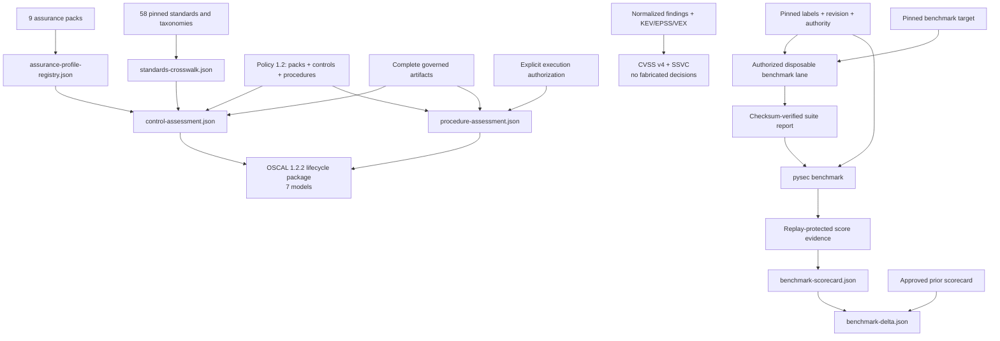

# Industry standards and benchmarks

The suite keeps five assurance layers separate so that a catalog reference is
never mistaken for test execution or certification:

1. a versioned standards registry and evidence-surface crosswalk;
2. repository-owned control objectives with explicit evidence requirements;
3. policy-pinned assessment procedures with execution and authorization proof;
4. source-retained CVSS v4 and SSVC prioritization; and
5. measured, corpus-bound benchmark scorecards and regression deltas.

Every artifact states its claim boundary. The outputs support engineering and
assurance workflows; they do not grant certification, authorization to test, or
proof that an application is vulnerability-free.

## Coverage

`standards-crosswalk.json` registers 58 version-explicit references:

- verification and test methods: OWASP ASVS 5.0, MASVS 2.1, TCASVS 5.0, WSTG
  4.2, MASTG 2.0, SCVS 1.0, and AITG 1.0;
- lifecycle, controls, assessment, and governance: NIST SSDF 1.1, CSF 2.0,
  SP 800-53 release 5.2, SP 800-53A release 5.2, SP 800-115, SP 800-161r1,
  OWASP SAMM 2.1, OpenSSF OSPS Baseline, CIS Controls 8.1, CIS Benchmarks,
  NIST SCAP 1.4, and CSA CCM 4.1;
- weaknesses, attacks, defenses, and prioritization: CWE Top 25, OWASP Top 10,
  OWASP API Top 10, CAPEC, MITRE ATT&CK, MITRE ATLAS, MITRE D3FEND, FIRST
  CVSS 4.0, and CISA SSVC;
- AI risk and management: OWASP LLM Top 10, NIST AI RMF, NIST AI 600-1,
  ISO/IEC 42001, ISO/IEC 23894, and the emerging OWASP APTS reference; and
- quality and architecture: ISO/IEC 25010, ISO/IEC 5055, ISO/IEC 25023,
  ISO/IEC/IEEE 42010, and CISQ quality measures;
- enterprise, privacy, and product response: ISO/IEC 27001, 27002, 27034-1,
  27701, 29147, and 30111; NIST Privacy Framework 1.0 and SP 800-61r3; and
- supply-chain and conditional regulatory profiles: NIST SP 800-204D and
  SP 800-218A, SLSA 1.2, ISO/IEC 18974 and 5230, SPDX 3.0/ISO 5962, EU CRA,
  PCI DSS 4.0.1, PCI Secure Software 2.x, NIST SP 800-171r3, and SOC 2 TSC.

`mapping_status=evidence-surface-present` means only that a related artifact
exists. Taxonomy versions marked `policy-pinned` must be selected and approved
by the organization rather than silently floating to a network release.

## Controls and assessment procedures

Copy [the example policy](../examples/industry-assurance-policy.example.json) to
`security/industry-assurance-policy.json`. Policy schema 1.2 supports selectable
assurance packs plus custom `controls` and `procedures`; legacy 1.0 and 1.1
policies remain readable.
The strict parser accepts only known standard identifiers, unique identities,
bounded text and collections, and safe report-local JSON artifact names.

`assurance-profile-registry.json` exposes nine built-in packs:

| Pack | Coverage |
|---|---|
| `enterprise-security` | ISO/IEC 27001, 27002, and 27034-1 |
| `privacy` | ISO/IEC 27701 and NIST Privacy Framework |
| `psirt-incident` | ISO/IEC 29147/30111 and NIST SP 800-61r3 |
| `software-supply-chain` | NIST SP 800-204D, SLSA, OpenChain, and SPDX |
| `ai-development` | NIST SP 800-218A, AI RMF, AITG, and ATLAS |
| `eu-cra` | Product security, component, support, and vulnerability handling |
| `payment-software` | PCI DSS and PCI Secure Software |
| `federal-cui` | NIST SP 800-171 and assessment procedures |
| `service-organization` | SOC 2 TSC and NIST CSF evidence surfaces |

Applicability must be explicit. A selected pack expands into evidence-backed
controls and procedures; an applicable planned procedure remains incomplete.
Copyrighted standards content is not redistributed: organizations can add their
licensed requirement-level catalogs through the existing custom policy surface.

An applicable control is `satisfied` only when every named artifact exists and
does not declare itself incomplete. An applicable procedure additionally needs:

- `execution=executed`;
- every named artifact to be complete; and
- explicit authorization proof when `authorization_required=true`.

Procedure outcomes distinguish `planned`, `evidence-gap`,
`authorization-gap`, `satisfied`, and `not-applicable`. Production and release
profiles become incomplete when an enforced applicable control or procedure is
not satisfied. Static evidence cannot masquerade as a completed penetration or
dynamic test.

## OSCAL lifecycle package

The suite emits seven OSCAL 1.2.2 JSON models:

| Artifact | Role |
|---|---|
| `oscal-catalog.json` | Repository-scoped control and procedure catalog |
| `oscal-profile.json` | Selected catalog profile |
| `oscal-component-definition.json` | Suite component implementation claims |
| `oscal-system-security-plan.json` | Digest-bound system and implementation boundary |
| `oscal-assessment-plan.json` | Planned controls and assessment subject |
| `oscal-assessment-results.json` | Observations and evidence gaps |
| `oscal-poam.json` | Gap remediation or continuous reassessment work |

The generated model set has been checked against NIST's official OSCAL 1.2.2
complete JSON Schema for empty and representative enforced policies. Repository
artifact validation also enforces the model root, UUID, metadata, and exact
OSCAL version. These are interoperable engineering records, not assessor
signatures or an authority-to-operate decision.

## CVSS v4 and SSVC

`standardized-prioritization.json` keeps native scanner severity separate from
standardized prioritization. A CVSS v4 record is `scored` only when a complete
`CVSS:4.0/...` vector and bounded score came from retained evidence. CycloneDX
1.7 VEX `CVSSv4` ratings are normalized into that source evidence. Missing or
invalid ratings remain explicitly unscored; native severity is never converted
into a fabricated vector.

SSVC is `decided` only when exploitation, automatability, technical impact,
mission prevalence, and the source outcome are all available and valid. KEV or
reproduction evidence may supply exploitation context, but cannot manufacture a
complete decision tree or outcome.

## Benchmark registry

`benchmark-registry.json` includes 18 families:

| Family | Purpose | Execution lane |
|---|---|---|
| Governed holdout | Native signed effectiveness corpus | Core verified report |
| OWASP Benchmark | SAST/DAST true- and false-positive cases | Disposable companion |
| NIST SARD/Juliet | Multi-language static-analysis cases | Disposable companion |
| OWASP Juice Shop | Web DAST behavior | Disposable companion |
| OWASP WebGoat | Web DAST lessons | Disposable companion |
| OWASP crAPI | API authorization and business-logic behavior | Disposable companion |
| CyberSecEval 4 | LLM cybersecurity behavior | Disposable companion |
| MLCommons AILuminate | AI safety and security behavior | Disposable companion |
| Organization holdout | Pinned real-world Python cases | Disposable companion |
| Python CVE pairs | Vulnerable and patched real-world revisions | Disposable companion |
| IaC holdout | Terraform, CloudFormation, and Kubernetes misconfigurations | Disposable companion |
| Container/Kubernetes holdout | Image and orchestration hardening cases | Disposable companion |
| Secret-detection holdout | Synthetic/revoked positives and clean negatives | Disposable companion |
| SBOM/SCA holdout | Component graph and advisory accuracy | Disposable companion |
| Malicious-package holdout | Inert malicious-package behavior | Disposable companion |
| Fuzzing crash holdout | Seeded defects, crashes, and deduplication | Disposable companion |
| Agentic-security holdout | Tool abuse, prompt injection, and exfiltration | Disposable companion |
| Architecture-quality holdout | Labeled dependency and architecture smells | Disposable companion |

External vulnerable applications are never executed by the core scanner. Each
enabled family gets a runner contract naming its adapter, expected labels,
minimum repetitions, required execution evidence, score semantics, and whether
a disposable target is mandatory. The generated task remains a plan until a
separately authorized lane executes it.



A benchmark score is eligible to pass only with the pinned corpus digest,
organization-approved authority, corpus revision, replay protection, validated
time, complete confusion matrix, and verified report checksum. Stochastic LLM
families require at least five repetitions. Organization-pinned corpora also
require a validated isolation receipt; exact runner, target, environment,
toolset, and oracle digests; and both positive and negative controls. Missing
execution context fails the score rather than being treated as a weak pass.

## Capability readiness scores

These scores measure framework readiness, not organizational conformance or
certification. A deployment earns the corresponding assurance only after its
applicable pack, evidence, procedures, authority, and benchmark thresholds pass.

| Area | Readiness | Basis |
|---|---:|---|
| Application security standards | 9/10 | Versioned catalogs, requirement policy, procedures, and retained evidence |
| SAST/DAST methodology | 9/10 | Static, dynamic, API, mobile, and authorized adversarial lanes |
| Software supply chain | 9/10 | SLSA/OpenChain/SPDX profile plus provenance, SBOM, signing, and release evidence |
| Benchmark methodology | 9/10 | Confusion matrices, strata, confidence intervals, replay protection, and deltas |
| Benchmark execution governance | 8/10 | 18 task contracts with identity, oracle, isolation, target, and environment requirements |
| Enterprise governance | 8/10 | ISO ISMS/application-security pack with OSCAL lifecycle output |
| Vulnerability and PSIRT lifecycle | 8/10 | Disclosure, handling, remediation, and incident-exercise controls |
| Privacy engineering | 8/10 | ISO 27701/NIST Privacy pack joined to data exposure and risk paths |
| Conditional regulatory readiness | 8/10 | CRA, PCI, CUI, and service-organization packs with explicit applicability |
| AI security | 9/10 | AI SSDF, AI RMF, AITG, ATLAS, stochastic, and agentic benchmark coverage |
| Architecture and code quality | 9/10 | Policy enforcement, history, labeled holdout, and structural evidence |
| Interoperability and audit evidence | 9/10 | SARIF, SBOM/VEX, SCAP, OSCAL, signed evidence, and schemas |

The scorecard reports precision, recall, specificity, F1, Matthews correlation
coefficient, balanced accuracy, false-positive rate, and Youden's J. Native
effectiveness evaluations also emit Wilson 95% confidence intervals and strata
by CWE, language, parser variant, boundary type, severity, and mutation operator.
`benchmark-delta.json` compares only identical benchmark families and pinned
corpus digests.

Example invocation from an authorized benchmark lane:

```text
pysec benchmark PATH_TO_VERIFIED_REPORT \
  --corpus PATH_TO_PINNED_CORPUS.json \
  --corpus-sha256 APPROVED_CORPUS_SHA256 \
  --format json --output owasp-benchmark-score.json
```

## Interoperability

`industry-assurance.json` reports observed support for SARIF 2.1.0,
CycloneDX 1.7, SPDX 2.x/3.x, CycloneDX VEX 1.7, OpenVEX 0.2, CSAF VEX 2.0,
SCAP 1.4, and OSCAL 1.2.2. CycloneDX and Syft commands explicitly request
CycloneDX 1.7; parsers reject a different SBOM version. VEX inputs are
digest-pinned offline snapshots and never suppress a finding by themselves.

Authoritative references include the [NIST OSCAL project](https://pages.nist.gov/OSCAL/),
[OWASP Benchmark](https://owasp.org/www-project-benchmark/),
[NIST SAMATE/SARD](https://www.nist.gov/itl/csd/secure-systems-and-applications/samate),
[NIST SSDF](https://csrc.nist.gov/pubs/sp/800/218/final),
[NIST CSF](https://www.nist.gov/cyberframework),
[OpenSSF OSPS Baseline](https://baseline.openssf.org/),
[MITRE CWE Top 25](https://cwe.mitre.org/top25/), and
[MITRE ATLAS](https://atlas.mitre.org/).
