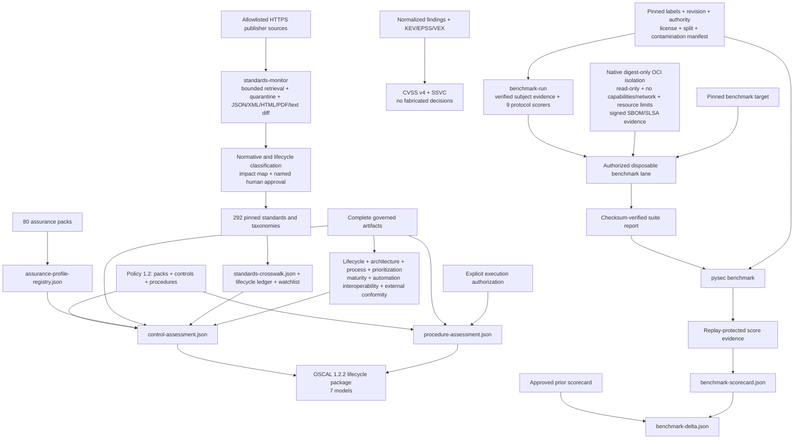

# Industry standards and benchmarks

The suite keeps five assurance layers separate so that a catalog reference is
never mistaken for test execution or certification:

1. a versioned standards registry and evidence-surface crosswalk;
2. repository-owned control objectives with explicit evidence requirements;
3. policy-pinned assessment procedures with execution and authorization proof;
4. source-retained CVSS v4 and SSVC prioritization; and
5. measured, corpus-bound benchmark scorecards and regression deltas.

Every artifact states its claim boundary. The outputs support engineering and
assurance workflows; they do not grant certification, authorization to test, or
proof that an application is vulnerability-free.

## Coverage

`standards-crosswalk.json` registers 292 version-explicit references:

- verification and test methods: OWASP ASVS 5.0, MASVS 2.1, TCASVS 5.0, WSTG
  4.2, MASTG 2.0, SCVS 1.0, and AITG 1.0;
- lifecycle, controls, assessment, and governance: NIST SSDF 1.1, CSF 2.0,
  SP 800-53 release 5.2, SP 800-53A release 5.2, SP 800-115, SP 800-161r1,
  OWASP SAMM 2.1, OpenSSF OSPS Baseline, CIS Controls 8.1, CIS Benchmarks,
  NIST SCAP 1.4, and CSA CCM 4.1;
- weaknesses, attacks, defenses, and prioritization: CWE Top 25, OWASP Top 10,
  OWASP API Top 10, CAPEC, MITRE ATT&CK, MITRE ATLAS, MITRE D3FEND, FIRST
  CVSS 4.0, and CISA SSVC;
- AI risk and management: OWASP LLM Top 10, NIST AI RMF, NIST AI 600-1,
  ISO/IEC 42001, ISO/IEC 23894, and the emerging OWASP APTS reference; and
- quality and architecture: ISO/IEC 25010, ISO/IEC 5055, ISO/IEC 25023,
  ISO/IEC/IEEE 42010, and CISQ quality measures;
- enterprise, privacy, and product response: ISO/IEC 27001, 27002, 27034-1,
  27701, 29147, and 30111; NIST Privacy Framework 1.0 and SP 800-61r3; and
- supply-chain and conditional regulatory profiles: NIST SP 800-204D and
  SP 800-218A, SLSA 1.2, ISO/IEC 18974 and 5230, SPDX 3.0/ISO 5962, EU CRA,
  PCI DSS 4.0.1, PCI Secure Software 2.x, NIST SP 800-171r3, and SOC 2 TSC;
- identity, protocols, cloud, and zero trust: NIST SP 800-63-4, RFC 9700,
  WebAuthn, OpenID FAPI, ISO/IEC 27017/27018, NIST SP 800-190, and NIST
  SP 800-207/207A;
- cryptography and resilience: FIPS 140-3, FIPS 203/204/205, NIST
  SP 800-131A, RFC 9325, ISO 22301, and NIST SP 800-34;
- EU digital obligations: GDPR, NIS2, DORA, and the EU AI Act; and
- conditional product and sector assurance: NISTIR 8259/8259A/8259B, ETSI
  EN 303 645, IEC 62443-4-1/4-2, ISO/SAE 21434, UNECE R155/R156, IEC 62304,
  IEC 81001-5-1, FDA medical-device guidance, FedRAMP, CMMC, and NIST
  SP 800-171A;
- machine-readable security exchange and assessment: OASIS SARIF, CSAF,
  STIX, and TAXII; ISO/IEC 20153; ECMA-424; NIST OSCAL; and OpenVEX;
- certification, secure coding, and verification: Common Criteria ISO/IEC
  15408 and 18045, Sigma, SEI CERT C/C++/Java, MISRA C, ISO/IEC TS 17961,
  ISO/IEC TR 24772, ISO/IEC/IEEE 29119, and ISO/IEC 20246;
- systems, safety, and sector engineering: NIST SP 800-160 volumes 1 and 2,
  SP 800-37, SP 800-55 volumes 1 and 2, ISO/IEC 27005, IEC 61508, ISO 26262,
  ISO 14971, RTCA DO-326A/DO-356A, NISTIR 8425, and ETSI TS 103 701;
- AI, privacy, and zero-trust engineering: NIST AI 100-2, ISO/IEC 42005 and
  24029, ISO 31700, ISO/IEC 29100, NIST SP 800-82 and SP 1800-35, and the CISA
  Zero Trust Maturity Model; and
- update-system assurance: The Update Framework (TUF);
- system planning, Internet, network, logging, and storage security: NIST
  SP 800-18r2 and SP 800-92 plus ISO/IEC 27014, 27032, the 27033 series, and
  ISO/IEC 27040:2024;
- privacy data lifecycle: NIST SP 800-188 and ISO/IEC 27555/27559 for governed
  deletion, de-identification, re-identification risk, and measurable review;
- harmonized accessibility testing: W3C ACT Rules Format 1.1 alongside WCAG
  2.2, with ACT rules retained as informative test procedures rather than
  substituted for WCAG conformance;
- evaluator and conformity-assessment integrity: ISO/IEC 17025, 17020, and
  17065 for competence, impartiality, consistent operation, and bounded
  certification decisions;
- complete industrial and energy operations: IEC 62443-2-1, 2-4, 3-2, and
  3-3, NERC CIP, and NISTIR 7628 in addition to product-development and
  component requirements;
- healthcare and airborne software: the HIPAA Security Rule, NIST SP 800-66,
  policy-pinned HITRUST evidence, and RTCA DO-178C/330/331/332/333 alongside
  DO-326A/356A;
- evaluation, incident, and privacy-impact processes: ISO/IEC 25040/25041,
  ISO/IEC 27035 parts 1-3, ISO/IEC/IEEE 23612, and ISO/IEC 29134;
- federal hardening: policy-pinned DISA STIG and SRG releases; and
- supply-chain identity and threat modeling: in-toto Attestation Framework,
  DSSE, CPE 2.3, SWID, package URL, OSV and CVE interchange schemas, and the
  maintained OWASP Threat Modeling guidance;
- software and systems lifecycle, requirements, architecture, and process:
  ISO/IEC/IEEE 12207, 15288, 29148, 42020, and 42030 plus ISO/IEC 33020 and
  ISO/IEC TS 33061;
- comprehensive weakness and exploit intelligence: the complete MITRE CWE
  catalog, FIRST EPSS, and the CISA Known Exploited Vulnerabilities catalog;
- supplier, signing, and attestation assurance: ISO/IEC 27036 parts 1-4,
  Sigstore, SLSA verifier conformance, and IETF RATS/EAT RFC 9334/9711;
- AI lifecycle, data, and empirical evaluation: ISO/IEC 5338, ISO/IEC 5259
  parts 1-5, NIST AI 700-2 ARIA, and UK AISI Inspect; and
- sector operations: IEC 62443-2-3 patch management, RTCA DO-355A continuing
  airworthiness, IACS UR E26/E27 maritime resilience, and SWIFT CSCF;
- organizational maturity: OWASP DSOVS, OWASP DSOMM 5.0.2, TMMi 2.0, and
  policy-pinned licensed BSIMM and CMMI Development evidence;
- AI quality and conformity: ISO/IEC 42006:2025, ISO/IEC 25059:2023,
  ISO/IEC TR 24027:2021, ISO/IEC TR 24028:2020, and CSA AICM 1.1;
- independent cloud and automation assurance: CSA STAR, OASIS CACAO 2.0,
  OpenC2 1.0, and OCSF; and
- vulnerability disclosure, product regulation, and detection evaluation:
  NIST SP 800-216, UK PSTI, ETSI EN 18031, and MITRE ATT&CK Evaluations.
- cloud-native API, service-mesh, and data protection: NIST SP 800-228 Update 1,
  SP 800-204/204B/204C, SP 800-233, and NISTIR 8505;
- transparent and consumer-side software supply chains: IETF SCITT RFC
  9942/9943, OpenSSF S2C2F, and the NTIA SBOM Minimum Elements;
- agentic and AI testing: OWASP Agentic Top 10 2026, ISO/IEC TR 29119-11,
  and ISO/IEC TS 42119-2;
- API and runtime semantics: OpenAPI 3.1.1, AsyncAPI 3.0.0, the September
  2025 GraphQL specification, JSON Schema 2020-12, and policy-pinned
  OpenTelemetry semantic conventions 1.44.0;
- vulnerability operations and regional resilience: RFC 9116, NIST SP
  800-40r4, NCSC CAF 4.0, Cyber Essentials 3.3, ASD Essential Eight, and
  CISA Cross-Sector CPGs; and
- architecture, privacy, and sector conformance: SEI ATAM, ISO/IEC TS 27560,
  ISO 24089, IEC 62351, and UL 2900;
- current SBOM, enhanced CUI, and developer verification: CISA-led 2026 SBOM
  Minimum Elements, NIST SP 800-172r3/172Ar3, SP 800-53B release 5.2.0,
  and NISTIR 8397;
- cryptographic lifecycle and agility: NIST SP 800-57 parts 1-3, SP 800-227,
  and CSWP 39 Update 1;
- continuous monitoring and ICT continuity: NIST SP 800-137/137A, NISTIR
  8212, ISO/IEC 27004:2016, and ISO/IEC 27031:2025;
- digital forensics: ISO/IEC 27037, 27041, 27042, and 27043 plus NIST
  SP 800-86; and
- inclusive quality: WCAG 2.2, EN 301 549 V3.2.1, and revised Section 508.
- lightweight cryptography and weakness analysis: NIST SP 800-232 Ascon and
  NIST SP 800-231 Bugs Framework;
- IoT security and privacy lifecycle: ISO/IEC 27400:2022, 27402:2023,
  27403:2024, and 27404:2025; and
- threat-led testing and e-discovery: TIBER-EU 2025 plus ISO/IEC 27050-1:2019
  and 27050-3:2020, applied only when the organization selects those domains.

`mapping_status=evidence-surface-present` means only that a related artifact
exists. Taxonomy versions marked `policy-pinned` must be selected and approved
by the organization rather than silently floating to a network release.
The crosswalk also carries a non-normative publication watchlist. ISO/IEC 27090,
NIST Privacy Framework 1.1, ISO/IEC 42119 parts 3, 7, and 8, the next ISO/IEC
27004 edition, and EN 301 549 V4 remain outside normative claims until final
publication, version pinning, and legal review.

Standards lifecycle governance is fail closed. Optional
`standards-lifecycle-evidence.json` input must provide, for every promoted
catalog, a publisher source digest, signed-snapshot digest, change-report
digest, observation time, edition status, approver identity, approval time, and
explicit human approval. `lifecycle_governance.complete` remains false until
every registered catalog passes. The curated entries retain publication,
observation, and supersession metadata where verified; notably, the 2021 NTIA
SBOM document is historical and points to the final CISA-led 2026 v2.1
replacement; the 2025 public-comment draft is not a normative entry.

## Controls and assessment procedures

Copy [the example policy](../examples/industry-assurance-policy.example.json) to
`security/industry-assurance-policy.json`. Policy schema 1.2 supports selectable
assurance packs plus custom `controls` and `procedures`; legacy 1.0 and 1.1
policies remain readable.
The strict parser accepts only known standard identifiers, unique identities,
bounded text and collections, and safe report-local JSON artifact names.

`assurance-profile-registry.json` exposes 80 built-in packs:

| Pack | Coverage |
|---|---|
| `enterprise-security` | ISO/IEC 27001, 27002, and 27034-1 |
| `privacy` | ISO/IEC 27701 and NIST Privacy Framework |
| `psirt-incident` | ISO/IEC 29147/30111 and NIST SP 800-61r3 |
| `software-supply-chain` | NIST SP 800-204D, SLSA, OpenChain, and SPDX |
| `ai-development` | NIST SP 800-218A, AI RMF, AITG, and ATLAS |
| `eu-cra` | Product security, component, support, and vulnerability handling |
| `payment-software` | PCI DSS and PCI Secure Software |
| `federal-cui` | NIST SP 800-171 and assessment procedures |
| `service-organization` | SOC 2 TSC and NIST CSF evidence surfaces |
| `identity-protocol-security` | Digital identity, OAuth BCP, WebAuthn, and FAPI conformance |
| `cloud-container-zero-trust` | Cloud responsibility, container lifecycle, workload identity, and CIS configuration |
| `cryptography-pqc` | Cryptographic inventory, approved modules, TLS, PQC transition, and algorithm conformance |
| `operational-resilience` | Continuity, contingency planning, recovery objectives, and exercised restoration |
| `eu-digital-regulation` | GDPR, NIS2, DORA, AI Act, and CRA applicability and evidence |
| `iot-consumer` | IoT manufacturer, device capability, support, and consumer-product baselines |
| `ot-industrial` | Industrial secure development, component controls, and zone/conduit assessment |
| `automotive` | Automotive cybersecurity engineering, management, and secure software updates |
| `medical-device` | Medical software lifecycle, safety-security verification, SBOM, and FDA evidence |
| `federal-cloud-defense` | FedRAMP OSCAL, CMMC, CUI controls, and independent assessment objectives |
| `systems-risk-measurement` | Trustworthy systems engineering, cyber resiliency, risk management, and measurement traceability |
| `security-data-interoperability` | SARIF, CSAF, STIX/TAXII, OpenVEX, OSCAL, and CycloneDX schema and semantic exchange |
| `product-certification` | Common Criteria security targets, evaluation evidence, and claimed-scope validation |
| `detection-threat-intelligence` | Sigma detections, ATT&CK behavior, STIX/TAXII exchange, and controlled detection validation |
| `secure-coding` | CERT C/C++/Java, MISRA C, and ISO language-security rule conformance |
| `software-testing-vv` | ISO/IEC/IEEE 29119 test evidence and ISO/IEC 20246 work-product review |
| `safety-security` | IEC 61508, ISO 26262, ISO 14971, and avionics safety/security co-engineering |
| `specialized-target-validation` | Mobile, cloud, smart-contract, IoT, and protocol-specific adversarial targets |
| `ai-robustness-impact` | AI impact assessment, robustness testing, measurement, and residual-risk evidence |
| `privacy-by-design` | Privacy principles, privacy-by-design lifecycle controls, and data-flow validation |
| `zero-trust-implementation` | Zero-trust maturity, workload identity, OT boundaries, and implementation validation |
| `independent-evaluator-assurance` | ISO/IEC 17025/17020/17065 method competence, impartiality, traceability, and certification boundaries |
| `ot-system-operations` | IEC 62443 asset owner/provider programs, system risk and security levels, NERC CIP, and smart-grid controls |
| `healthcare-security` | HIPAA ePHI safeguards, NIST SP 800-66 mappings, and licensed HITRUST evidence |
| `airborne-software-assurance` | DO-178C lifecycle objectives, DO-330 tool qualification, and model/OO/formal-method supplements |
| `federal-configuration-hardening` | Version-pinned DISA STIG/SRG and SCAP validation with manual-check review |
| `software-quality-evaluation` | ISO/IEC 25040/25041 evaluation design, execution, rating, limitations, and evaluator viewpoint |
| `incident-management` | ISO/IEC 27035 and ISO/IEC/IEEE 23612 preparation-through-recovery and software-incident traceability |
| `privacy-impact-assessment` | ISO/IEC 29134 PIA scope, stakeholder, impact, treatment, approval, and negative-scenario evidence |
| `supply-chain-identity` | in-toto/DSSE subject integrity and lossless CPE, SWID, purl, OSV, and CVE identities |
| `threat-model-quality` | Assets, boundaries, assumptions, threats, abuse paths, mitigations, tests, residual risk, and drift |
| `software-lifecycle-traceability` | Requirements-through-retirement evidence with bidirectional requirement coverage |
| `architecture-evaluation-process` | Stakeholder concerns, quality scenarios, risk paths, decisions, corroboration, and independent review |
| `software-process-capability` | Evidence-bounded capability levels across requirements, implementation, verification, release, response, operations, and improvement |
| `comprehensive-weakness-mapping` | Full CWE release and abstraction-policy mapping rather than Top-25-only coverage |
| `exploit-prioritization-validation` | Point-in-time EPSS/KEV outcome calibration with future-data exclusion and operational budget metrics |
| `ai-lifecycle-data-evaluation` | AI lifecycle, data quality, measurement, robustness, and repeatable empirical evaluation |
| `supplier-relationship-assurance` | Supplier agreements, component/service monitoring, ICT supply-chain controls, and cloud-chain accountability |
| `software-signing-conformance` | Sigstore and SLSA verifier trust-root, identity-policy, subject, and negative-case conformance |
| `remote-attestation-assurance` | RATS/EAT evidence, endorsement, appraisal, freshness, verifier, and relying-party boundaries |
| `ot-patch-management` | IEC 62443 disclosure, patch qualification, distribution, compensating controls, and deployment evidence |
| `continuing-airworthiness-security` | DO-355A in-service monitoring, impact assessment, corrective action, approval, and fleet traceability |
| `maritime-cyber-resilience` | IACS UR E26/E27 ship and onboard-system lifecycle, recovery, update, and conformance evidence |
| `financial-messaging-security` | SWIFT CSCF architecture, access, credential, transaction, monitoring, response, and independent-assessment evidence |
| `devsecops-maturity` | OWASP DSOVS and DSOMM evidence-backed maturity with blinded reassessment |
| `test-maturity` | TMMi 2.0 test-process maturity and independent rating calibration |
| `ai-conformity-quality` | AI quality, bias, trustworthiness, AICM controls, and independent conformity evidence |
| `security-automation-interoperability` | CACAO, OpenC2, and OCSF round-trip and semantic conformance |
| `cloud-independent-assurance` | CSA STAR/CAIQ scope, assessor independence, validity, and shared responsibility |
| `federal-vulnerability-disclosure` | NIST SP 800-216 disclosure governance and end-to-end exercise evidence |
| `consumer-product-regulation` | UK PSTI and ETSI EN 18031 applicability and product conformity evidence |
| `detection-product-evaluation` | MITRE ATT&CK Evaluations ingestion with technique-level authorized replay |
| `external-maturity-comparison` | Licensed BSIMM/CMMI evidence and governed, anonymized cohort comparison |
| `cloud-native-api-assurance` | NIST API lifecycle, microservices, service-mesh, DevSecOps, and cloud-native data protection |
| `supply-chain-transparency-consumer` | SCITT statements and receipts, S2C2F dependency consumption, and SBOM minimum elements |
| `ai-agentic-testing` | OWASP agentic risks and ISO risk-based, stochastic AI test design |
| `vulnerability-intake-patch-operations` | RFC 9116 intake plus enterprise inventory-to-verification patch management |
| `runtime-contract-interoperability` | OpenAPI, AsyncAPI, GraphQL, JSON Schema, and OpenTelemetry semantic conformance |
| `uk-cyber-resilience` | NCSC CAF essential-function outcomes and Cyber Essentials technical controls |
| `australian-essential-eight` | Evidence-backed maturity across all eight ASD mitigations |
| `cisa-cross-sector-cpg` | Prioritized cross-sector outcomes and sampled effectiveness evidence |
| `automotive-software-update` | ISO 24089 and UNECE R156 update engineering, negative cases, and recovery |
| `energy-product-security` | IEC 62351 power-protocol security and UL 2900 product test assurance |
| `modern-sbom-assurance` | CISA-led 2026 v2.1 minimum elements with author-signature, format/version, component hash/license, multi-format negative conformance, and historical NTIA traceability |
| `enhanced-cui-assurance` | NIST SP 800-172r3/172Ar3 requirements, procedures, 53B baselines, OSCAL, and independent assessment |
| `developer-verification-minimums` | NISTIR 8397 minimum technique coverage with seeded effectiveness challenge |
| `cryptographic-key-agility` | Key lifecycle, KEM behavior, PQC discovery, transition, downgrade, rollover, and recovery |
| `continuous-security-monitoring` | ISCM strategy, measurement, operations, program assessment, and blinded assessor agreement |
| `ict-continuity-readiness` | ISO/IEC 27031:2025 dependencies, recovery objectives, disruption exercises, and improvement |
| `digital-forensics-readiness` | Digital-evidence custody, method fitness, analysis reproducibility, and incident integration |
| `accessibility-quality` | WCAG 2.2, EN 301 549, and Section 508 mixed automated/manual conformance |

Applicability must be explicit. A selected pack expands into evidence-backed
controls and procedures; an applicable planned procedure remains incomplete.
Copyrighted standards content is not redistributed: organizations can add their
licensed requirement-level catalogs through the existing custom policy surface.

An applicable control is `satisfied` only when every named artifact exists and
does not declare itself incomplete. An applicable procedure additionally needs:

- `execution=executed`;
- every named artifact to be complete; and
- explicit authorization proof when `authorization_required=true`.

Procedure outcomes distinguish `planned`, `evidence-gap`,
`authorization-gap`, `satisfied`, and `not-applicable`. Production and release
profiles become incomplete when an enforced applicable control or procedure is
not satisfied. Static evidence cannot masquerade as a completed penetration or
dynamic test.

## Foundational evidence assessments

Seven strict, schema-validated artifacts turn broad standards references into
reviewable engineering evidence. They are generated on every run and fail
closed when an input is absent or declares itself incomplete:

| Artifact | Governed claim |
|---|---|
| `lifecycle-traceability.json` | Seven life-cycle stages are evidenced, the source is digest-bound, and all applicable requirements have bidirectional evidence |
| `architecture-evaluation.json` | Stakeholder concerns, quality attributes, risk paths, decisions, structural corroboration, and independent review are present |
| `process-capability-assessment.json` | Seven process dimensions reach at least bounded level 2; level 3 additionally requires independent audit-package verification |
| `prioritization-calibration.json` | At least 100 point-in-time observations use pinned EPSS, KEV, corpus, and outcome snapshots with no future leakage and report calibration, recall-at-budget, effort, and KEV response time |
| `maturity-model-assessment.json` | Applicable DSOVS, DSOMM, TMMi, BSIMM, and CMMI ratings bind scope, method, evidence, report, assessor competence, independence, review count, and domains |
| `security-automation-interoperability.json` | Selected STIX/TAXII, CACAO/OpenC2/OCSF, SCITT/COSE receipt, OpenAPI/AsyncAPI/GraphQL/JSON Schema, and OpenTelemetry versions, schemas, fixtures, positive/negative cases, round trips, semantic equivalence, authority, and replay protection are complete |
| `external-conformity-assessment.json` | Applicable AI, cloud, disclosure, product, detection, and licensed normative assessments bind scope, method, report, assessor, validity, authority, and applicability basis; assessor credentials require an immutable registry snapshot, issuer and scheme, active validity window, signature validation, and revocation check |

The three extended assessments consume deliberately separate evidence inputs:
`maturity-model-evidence.json`, `security-automation-evidence.json`, and
`external-conformity-evidence.json`. Evidence rows use policy-selected model,
protocol, or scheme identifiers and SHA-256-bind the scope, method, fixtures,
evidence, and report. Assessor records require an identity, independence claim,
and competency digest; maturity ratings require two reviewers and explicit
domains; automation records require positive and negative cases plus round-trip
and semantic-equivalence results; external assessments require an assessment
date and written applicability basis. Unknown source fields are not copied into
the governed outputs, reducing accidental disclosure from assessor workpapers.

These are readiness indicators, not ISO certification, an architecture approval,
or proof that the prioritization model generalizes beyond its pinned evaluation
window and population.

## OSCAL lifecycle package

The suite emits seven OSCAL 1.2.2 JSON models:

| Artifact | Role |
|---|---|
| `oscal-catalog.json` | Repository-scoped control and procedure catalog |
| `oscal-profile.json` | Selected catalog profile |
| `oscal-component-definition.json` | Suite component implementation claims |
| `oscal-system-security-plan.json` | Digest-bound system and implementation boundary |
| `oscal-assessment-plan.json` | Planned controls and assessment subject |
| `oscal-assessment-results.json` | Observations and evidence gaps |
| `oscal-poam.json` | Gap remediation or continuous reassessment work |

The generated model set has been checked against NIST's official OSCAL 1.2.2
complete JSON Schema for empty and representative enforced policies. Repository
artifact validation also enforces the model root, UUID, metadata, and exact
OSCAL version. These are interoperable engineering records, not assessor
signatures or an authority-to-operate decision.

## CVSS v4 and SSVC

`standardized-prioritization.json` keeps native scanner severity separate from
standardized prioritization. A CVSS v4 record is `scored` only when a complete
`CVSS:4.0/...` vector and bounded score came from retained evidence. CycloneDX
1.7 VEX `CVSSv4` ratings are normalized into that source evidence. Missing or
invalid ratings remain explicitly unscored; native severity is never converted
into a fabricated vector.

SSVC is `decided` only when exploitation, automatability, technical impact,
mission prevalence, and the source outcome are all available and valid. KEV or
reproduction evidence may supply exploitation context, but cannot manufacture a
complete decision tree or outcome.

## Benchmark registry

`benchmark-registry.json` includes 99 families:

| Family | Purpose | Execution lane |
|---|---|---|
| Governed holdout | Native signed effectiveness corpus | Core verified report |
| OWASP Benchmark | SAST/DAST true- and false-positive cases | Disposable companion |
| NIST SARD/Juliet | Multi-language static-analysis cases | Disposable companion |
| OWASP Juice Shop | Web DAST behavior | Disposable companion |
| OWASP WebGoat | Web DAST lessons | Disposable companion |
| OWASP crAPI | API authorization and business-logic behavior | Disposable companion |
| CyberSecEval 4 | LLM cybersecurity behavior | Disposable companion |
| MLCommons AILuminate | AI safety and security behavior | Disposable companion |
| Organization holdout | Pinned real-world Python cases | Disposable companion |
| Python CVE pairs | Vulnerable and patched real-world revisions | Disposable companion |
| IaC holdout | Terraform, CloudFormation, and Kubernetes misconfigurations | Disposable companion |
| Container/Kubernetes holdout | Image and orchestration hardening cases | Disposable companion |
| Secret-detection holdout | Synthetic/revoked positives and clean negatives | Disposable companion |
| SBOM/SCA holdout | Component graph and advisory accuracy | Disposable companion |
| Malicious-package holdout | Inert malicious-package behavior | Disposable companion |
| Fuzzing crash holdout | Seeded defects, crashes, and deduplication | Disposable companion |
| Agentic-security holdout | Tool abuse, prompt injection, and exfiltration | Disposable companion |
| Architecture-quality holdout | Labeled dependency and architecture smells | Disposable companion |
| NIST ACVP | Cryptographic algorithm conformance vectors | Disposable companion |
| OpenID FAPI conformance | OAuth/OIDC positive, negative, and replay behavior | Disposable companion |
| W3C Web Platform Tests | WebAuthn browser and relying-party behavior | Disposable companion |
| MITRE attack emulation | Contained ATT&CK-aligned defensive validation | Disposable companion |
| OpenSSF Scorecard | Repository security-posture checks | Disposable companion |
| Polyglot CVE pairs | Time-split vulnerable and patched revisions across eight language families | Disposable companion |
| Artifact interoperability | Semantic SARIF, SPDX, CycloneDX, and OSCAL conformance | Disposable companion |
| Scanner scale and determinism | Wall time, peak memory, and repeatable results | Disposable companion |
| Recovery/resilience holdout | Dependency-failure and restoration behavior | Disposable companion |
| Protocol-evasion holdout | Encoded, fragmented, and ambiguous parser inputs | Disposable companion |
| Atomic Red Team | Controlled detection-control validation mapped to ATT&CK | Disposable companion |
| Official artifact schema conformance | Official schema and semantic round-trip validation for security artifacts | Disposable companion |
| Defects4J | Reproducible real-world Java functional defects | Disposable companion |
| SWE-bench Verified | Repository-level Python functional diagnosis and repair | Disposable companion |
| Google FuzzBench | Statistical fuzzer performance and repeatability | Disposable companion |
| Magma | Ground-truth fuzzing bugs and reachability | Disposable companion |
| OWASP MAS Crackmes | Android and iOS mobile-security behavior | Disposable companion |
| CloudGoat | Disposable cloud attack-path validation | Disposable companion |
| SmartBugs Curated | Labeled Solidity and EVM vulnerability detection | Disposable companion |
| ETSI IoT conformance | Consumer-IoT assessment cases and approved product fixtures | Disposable companion |
| STIX/TAXII interoperability | Threat-intelligence schema and protocol exchange | Disposable companion |
| Secure-coding rule conformance | Organization-approved CERT, MISRA, and ISO rule examples | Disposable companion |
| Vul4J | Reproducible Java vulnerabilities, proof-of-vulnerability tests, and human patches | Disposable companion |
| BugsInPy | Reproducible Python functional defects, coverage, mutation, and repair behavior | Disposable companion |
| AgentDojo | Agent prompt-injection attack success and utility under attack | Disposable companion |
| OSS-Fuzz/ClusterFuzzLite | Continuous fuzzing integration, crash discovery, deduplication, and regression | Disposable companion |
| DISA STIG/SCAP conformance | Version-pinned automated and manual federal hardening checks | Disposable companion |
| IEC 62443 system conformance | Licensed system-requirement and claimed-security-level assessment | Disposable companion |
| Threat-model quality | Expert-labeled assets, boundaries, assumptions, threats, mitigations, tests, and drift | Disposable companion |
| Lifecycle traceability mutation | Seeded requirement-to-design-to-test-to-release trace breaks | Disposable companion |
| Architecture evaluation scenarios | Blinded, independently labeled quality-attribute and tradeoff scenarios | Disposable companion |
| Process capability assessor agreement | Blinded assessor agreement over evidence-bounded capability cases | Disposable companion |
| CWE mapping conformance | Full-release weakness abstraction and mapping correctness | Disposable companion |
| EPSS/KEV temporal backtest | Point-in-time exploit prioritization without future-data leakage | Disposable companion |
| SV-COMP | Resource-bounded software-verification tasks and validated witnesses | Disposable companion |
| Test-Comp | Resource-bounded test-generation tasks and validated test suites | Disposable companion |
| Sigstore client conformance | Trust-root, identity-policy, subject, and negative signature verification | Disposable companion |
| SLSA verifier conformance | Provenance subject, builder, identity, and negative verification cases | Disposable companion |
| NIST ARIA/Inspect evaluation | Repeatable AI-risk and robustness evaluation with stochastic repetitions | Disposable companion |
| IEC 62443 patch-management exercise | Qualified disclosure-to-deployment and compensating-control evidence | Disposable companion |
| DO-355 continuing-airworthiness exercise | Qualified in-service issue, impact, approval, and fleet-correction evidence | Disposable companion |
| IACS maritime cyber conformance | Qualified ship and onboard-system lifecycle and recovery evidence | Disposable companion |
| SWIFT CSCF independent assessment | Qualified financial-messaging control design and operating-effectiveness evidence | Disposable companion |
| OWASP DSOVS maturity | Evidence-backed DevSecOps verification maturity and assessor agreement | Disposable companion |
| OWASP DSOMM maturity | Evidence-backed DevSecOps maturity and assessor agreement | Disposable companion |
| TMMi assessment | Test-process maturity and independent rating agreement | Disposable companion |
| BSIMM/CMMI cohort | Governed licensed-model and compatible external cohort comparison | Disposable companion |
| CSA STAR/CAIQ conformance | Independent cloud assurance scope and evidence conformance | Disposable companion |
| CACAO/OpenC2/OCSF interoperability | Security automation round-trip, negative-case, and semantic conformance | Disposable companion |
| MITRE ATT&CK Evaluations | Lossless result ingestion and authorized technique-level replay | Disposable companion |
| AI conformity and quality | AI quality, bias, trustworthiness, and control acceptance criteria | Disposable companion |
| PSTI/EN 18031 product conformance | Consumer and radio-product regulatory test evidence | Disposable companion |
| SCITT transparency conformance | Signed statements, COSE receipts, inclusion, consistency, replay, and equivocation | Disposable companion |
| Cloud-native API/service-mesh conformance | Gateway, workload identity, policy bypass, data-plane, and control-plane adversarial cases | Disposable companion |
| API contract specification conformance | Official OpenAPI, AsyncAPI, GraphQL, and JSON Schema positive, negative, downgrade, and round-trip cases | Disposable companion |
| OpenTelemetry semantic conformance | Trace context, baggage, redaction, semantic conventions, and round-trip integrity | Disposable companion |
| AI agentic testing conformance | Risk-based stochastic agent, tool, memory, delegation, utility, and recovery cases | Disposable companion |
| S2C2F consumer dependency conformance | Dependency acquisition, substitution, quarantine, update, and compromise response | Disposable companion |
| Multi-cloud/Kubernetes attack paths | Authorized AWS, Azure, GCP, and Kubernetes identity, network, data, and control-plane paths | Disposable companion |
| security.txt and patch operations | RFC 9116 parsing plus inventory-to-deployment patch lifecycle and rollback | Disposable companion |
| Regional cyber maturity assessment | Blinded assessor agreement for CAF, Cyber Essentials, Essential Eight, and CISA CPG evidence | Disposable companion |
| Automotive software update conformance | ISO 24089 and UNECE R156 authenticity, compatibility, interruption, rollback, and recovery | Disposable companion |
| Energy product security conformance | IEC 62351 and UL 2900 licensed protocol and product negative cases | Disposable companion |
| CISA SBOM minimum-elements conformance | Current minimum fields, relationships, known unknowns, freshness, and multi-format fixtures | Disposable companion |
| Enhanced CUI OSCAL conformance | SP 800-172r3/172Ar3 controls, assessment objects, depth, coverage, and OSCAL traceability | Disposable companion |
| NIST developer verification conformance | NISTIR 8397 technique coverage, overlap, limitations, and seeded positive/negative cases | Disposable companion |
| Cryptographic lifecycle/agility conformance | Key lifecycle, KEM, transition, downgrade, hybrid, rollover, recovery, and zeroization | Disposable companion |
| ISCM program assessment | SP 800-137A/IR 8212 evidence cases with blinded assessor agreement | Disposable companion |
| ICT continuity recovery exercise | ISO/IEC 27031 disruption, degraded-mode, failover, restoration, and lessons-learned cases | Disposable companion |
| Digital forensics chain of custody | Evidence handling, validated methods, repeatability, analysis, and custody integrity | Disposable companion |
| WCAG accessibility conformance | Automated rules plus keyboard, reflow, focus, screen-reader, speech, caption, and manual cases | Disposable companion |
| NIST CFReDS/CFTT | Documented forensic images, expected artifacts, acquisition, search, mobile, and cloud tool behavior | Disposable companion |
| W3C ACT Rules | Rule applicability and expected accessibility outcomes against the formally approved ACT corpus | Disposable companion |
| DroidBench | Android lifecycle, callback, reflection, ICC, aliasing, and source-to-sink taint analysis | Disposable companion |
| Ghera | Android framework misuse and security regression cases on a pinned emulator image | Disposable companion |
| SecBench.js | Real JavaScript/TypeScript vulnerability-fix pairs with locked dependencies | Disposable companion |
| Chaos Mesh/Litmus | Bounded failure experiments with steady state, SLO, blast radius, rollback, and cleanup assertions | Disposable companion |
| Sonobuoy | Kubernetes-release and plugin-pinned conformance execution | Disposable companion |
| CIS-CAT/SCAP platform conformance | Product-, edition-, profile-, and benchmark-specific configuration results | Disposable companion |
| C2SP Project Wycheproof | Valid, invalid, and acceptable cryptographic edge cases with algorithm- and implementation-bound results | Disposable companion |
| TIBER-EU threat-led red team | Approved threat intelligence, scoped objectives, control detection, kill switches, restoration, and independent engagement governance | Authorized external engagement |

The maintained adapter catalog in `py_security_suite.benchmark_adapters`
defines acquisition, license, input, normalizer, positive/negative control, and
isolation requirements for CFReDS/CFTT, ACT Rules, DroidBench, Ghera,
SecBench.js, Chaos Mesh/Litmus, Sonobuoy, CIS-CAT/SCAP, Wycheproof, and TIBER-EU.
It deliberately does not vendor licensed content, organization targets, or
floating upstream branches.

External vulnerable applications are never executed by the core scanner. Each
enabled family gets a runner contract naming its adapter, expected labels,
minimum repetitions, required execution evidence, score semantics, and whether
a disposable target is mandatory. The generated task remains a plan until a
separately authorized lane executes it. A benchmark declaration can name an
`adapter_manifest`; that switches its generated task from report-only scoring
to `benchmark-run`. The generated command intentionally omits
`--authorize-execution`, so registry generation cannot grant execution authority.

### Executable adapter contract

Start from
[`benchmark-adapter-manifest.example.json`](../examples/benchmark-adapter-manifest.example.json)
and replace every placeholder with approved, immutable evidence. The runtime
requires an absolute executable path and SHA-256 for every stage, a digest-bound
corpus, license and label-authority digests, organization approval, runner SBOM
and provenance attestations, replay and trusted-time receipts, contamination evidence,
and an exact normalized-result location.

```shell
pysec schema benchmark-adapter-manifest-1.0 > benchmark-adapter.schema.json
pysec benchmark-run security/benchmark-adapters/droidbench.json \
  --workspace .artifacts/droidbench-workspace \
  --authorize-execution \
  --output .artifacts/droidbench-execution.json
```

Each of the six evidence references names an artifact, digest, detached Ed25519
signature, and pinned public key. The runner verifies the signature and exact
benchmark subject (corpus, binaries, versions, protocol, and isolation policy),
then validates kind-specific claims. Replay protection is true only when the
signed receipt records a consumed unique nonce; SLSA provenance, RFC 3161 time,
SBOM validity, environment capture, and contamination status are likewise
derived from verified artifacts.

Commands are argument vectors, never shell strings. The runner verifies the
executable immediately before each stage, supplies a minimal environment,
disables stdin, bounds execution time and captured output, terminates child
process trees on timeout, validates unique normalized case identities, computes
accuracy metrics, applies thresholds, and emits an atomic digest-bound receipt.
`process` isolation can claim only inherited network behavior. `oci` mode starts
a digest-pinned runtime and image with a read-only root filesystem, all Linux
capabilities dropped, no-new-privileges, denied networking, non-root identity,
bounded CPU/memory/PIDs, a no-exec temporary filesystem, optional seccomp and
AppArmor profiles, a read-only corpus, and automatic container removal. A
target-restricted network claim requires a separately verified sandbox receipt.

The normalized adapter output is deliberately small and tool-neutral:

```json
{
  "schema_version": "1.0",
  "benchmark_id": "droidbench",
  "protocol": "classification",
  "cases": [
    {
      "id": "Callbacks_Button1",
      "expected_positive": true,
      "observed_positive": true,
      "strata": {"category": "callbacks", "language": "java"}
    }
  ]
}
```

### Publisher lifecycle monitor

`standards-monitor` retrieves only explicitly allowlisted HTTPS publisher hosts,
rejects credentials, fragments, nonstandard ports, and non-public resolved
addresses, validates redirects, bounds each response and the overall run, and
writes digest-named observations into quarantine. A changed publisher payload
yields `review-required`; it never changes a normative baseline automatically.

```shell
pysec standards-monitor examples/standards-source-manifest.example.json \
  --output .artifacts/standards-monitor \
  --authorize-network \
  --signing-key security/standards-monitor-ed25519.pem

pysec standards-monitor-verify \
  .artifacts/standards-monitor/standards-monitor-report.json \
  --report-sha256 APPROVED_TRANSPORT_SHA256 \
  --public-key security/standards-monitor-ed25519.pub.pem
```

Optional Ed25519 signing binds the report to the exact manifest, observations,
decision, semantic diff, impact mapping, and promotion policy. The monitor
compares a digest-pinned local baseline using structural JSON paths, XML/HTML
sections, PDF pages, or normalized text lines; identifies added, removed, and
modified sections; classifies normative keywords and lifecycle language; and
emits affected profiles, controls, benchmarks, and a pending approval artifact.
Promotion still requires licensed-requirement review where applicable and named
human approval.



A benchmark score is eligible to pass only with the pinned corpus digest,
organization-approved authority, corpus revision, replay protection, validated
time, verified report checksum, and the evidence required by its scoring
protocol. Classification uses a complete confusion matrix; temporal,
verification, test-generation, fuzzing, stochastic-adversarial,
assessor-agreement, conformance, and detection-evaluation protocols use typed
method-specific metrics plus digest-bound, organization-approved acceptance
criteria. Every authorized
companion run also requires dataset-license, label-authority, contamination,
runner identity, digest-pinned OCI image, verified and image-subject-bound runner
SBOM and provenance, enforced resource limits, target, environment, toolset,
oracle, enforced network policy, complete egress transcript,
isolation and target-destruction receipts, and positive/negative control
evidence plus an approved fixed, project, or time split. Organization-
pinned corpora require at least two independent reviewers. Stochastic LLM, AI,
and agent families require at least five repetitions; continuous fuzzing
requires at least three. Qualified DISA STIG, IEC 62443, architecture/process,
airworthiness, maritime, and SWIFT conformance lanes additionally require
digest-bound method validation, evaluator competency, impartiality review, and
measurement traceability. Temporal prioritization requires pinned EPSS, KEV,
and outcome snapshots plus future-data exclusion and calibration/budget metrics.
Formal competitions require task, witness or test-suite, and resource-limit
digests. Signing lanes require pinned suites, trust roots, identity policies, and
negative cases. Scale benchmarks require wall-time, peak-memory, and at least
three deterministic runs. Missing execution context fails the score rather than
being treated as a weak pass.

## Capability readiness scores

These scores measure framework readiness, not organizational conformance or
certification. A deployment earns the corresponding assurance only after its
applicable pack, evidence, procedures, authority, and benchmark thresholds pass.

| Area | Readiness | Basis |
|---|---:|---|
| Application security standards | 9/10 | Versioned catalogs, requirement policy, procedures, and retained evidence |
| SAST/DAST methodology | 9/10 | Static, dynamic, API, mobile, and authorized adversarial lanes |
| Software supply chain | 9/10 | SLSA/OpenChain/SPDX profile plus provenance, SBOM, signing, and release evidence |
| Benchmark methodology | 9/10 | Nine scoring protocols, typed metrics, approved acceptance criteria, strata, replay protection, and deltas |
| Benchmark execution governance | 9/10 | 99 task contracts plus explicit authorization, subject-bound Ed25519 evidence, consumed replay receipts, nine protocol-specific scorers, digest-pinned argv-only stages, hardened native OCI execution, SBOM/SLSA provenance, contamination checks, negative controls, and conditional laboratory qualification |
| DevSecOps and test maturity | 8/10 | DSOVS, DSOMM, TMMi, licensed-model evidence, blinded reassessment, and assessor agreement |
| AI quality and conformity | 9/10 | ISO/IEC 42006, 25059, TR 24027/24028, TR 29119-11, TS 42119-2, OWASP Agentic Top 10, CSA AICM, independent scope, validity, and stochastic acceptance |
| Cloud independent assurance | 8/10 | CSA STAR/CAIQ scope, registry claim boundaries, shared responsibility, assessor independence, and sampled evidence challenge |
| Security automation interoperability | 8/10 | CACAO 2.0, OpenC2, and OCSF schema, negative-case, round-trip, and semantic-equivalence evidence |
| Consumer-product regulation | 8/10 | UK PSTI and ETSI EN 18031 applicability, technical evidence, negative cases, and legal claim boundaries |
| Detection product evaluation | 8/10 | ATT&CK Evaluations ingestion and replay with separate coverage, false-positive, visibility, protection, and latency semantics |
| Public conformance integration | 8/10 | ACVP, FAPI, WebAuthn/WPT, ATT&CK emulation, and OpenSSF runner contracts |
| Cross-language real-world benchmarks | 8/10 | Time/project-split CVE-pair contract across Python, JavaScript, Java, C/C++, C#, Go, and Rust |
| Independent benchmark assurance | 8/10 | Label-authority and contamination digests plus two-reviewer minimum for organization corpora |
| Enterprise governance | 8/10 | ISO ISMS/application-security pack with OSCAL lifecycle output |
| Vulnerability and PSIRT lifecycle | 8/10 | Disclosure, handling, remediation, and incident-exercise controls |
| Privacy engineering | 8/10 | ISO 27701/NIST Privacy pack joined to data exposure and risk paths |
| Conditional regulatory readiness | 8/10 | CRA, PCI, CUI, and service-organization packs with explicit applicability |
| Identity and protocol security | 8/10 | NIST digital identity, OAuth BCP, WebAuthn, and FAPI controls plus conformance handoff |
| Cloud, container, API, and zero trust | 9/10 | ISO cloud controls, NIST API/microservices/service-mesh/container/ZTA references, CIS execution, and workload-bound evidence |
| Cryptography and PQC readiness | 8/10 | Module, TLS, algorithm-transition, PQC inventory, migration, and ACVP evidence requirements |
| Operational resilience | 8/10 | Continuity and contingency controls with authorized failure and restoration exercises |
| EU digital regulation | 8/10 | Explicit GDPR, NIS2, DORA, AI Act, and CRA applicability pack |
| IoT and consumer products | 8/10 | Current manufacturer/device/support baselines and consumer-IoT lifecycle testing |
| OT and industrial systems | 9/10 | Full product, service-provider, asset-owner, zone/conduit, system-level, energy, and conformance coverage |
| Automotive | 9/10 | ISO/SAE lifecycle, ISO 24089 update engineering, UNECE management/update controls, and qualified negative-case testing |
| Medical devices | 8/10 | IEC lifecycle/safety-security plus FDA SBOM and vulnerability evidence |
| Federal cloud and defense | 8/10 | FedRAMP OSCAL, CMMC, NIST CUI controls, and assessment procedures |
| AI security | 9/10 | AI SSDF, AI RMF, AITG, ATLAS, stochastic, and agentic benchmark coverage |
| Architecture and code quality | 9/10 | Policy enforcement, history, labeled holdout, and structural evidence |
| Interoperability and audit evidence | 9/10 | SARIF, SBOM/VEX, SCAP, OSCAL, STIX/TAXII, CACAO/OpenC2/OCSF, SCITT, API contracts, OpenTelemetry, signed evidence, and fail-closed protocol evidence |
| Systems security engineering and risk measurement | 8/10 | Trustworthy-systems, cyber-resiliency, RMF, risk, and measurement controls with traceable review evidence |
| Security-data interoperability | 9/10 | Explicit SARIF, CSAF, STIX/TAXII, OpenVEX, OSCAL, and CycloneDX contracts plus official-schema benchmark handoff |
| Product certification readiness | 8/10 | Common Criteria security-target, evaluation-evidence, and claimed-scope assessment pack |
| Detection engineering and threat intelligence | 8/10 | Sigma, ATT&CK, STIX/TAXII, and authorized Atomic Red Team validation contracts |
| Language-specific secure coding | 8/10 | CERT C/C++/Java, MISRA C, and ISO rule catalogs with governed conformance corpus |
| Formal software testing and V&V | 8/10 | ISO/IEC/IEEE 29119 and ISO/IEC 20246 controls joined to Defects4J and SWE-bench Verified |
| Safety and security co-engineering | 8/10 | IEC 61508, ISO 26262, ISO 14971, and avionics assurance with explicit safety-impact review |
| Specialized target validation | 8/10 | OWASP MAS Crackmes, CloudGoat, SmartBugs, IoT conformance, and protocol-specific disposable lanes |
| AI robustness and impact | 8/10 | NIST AI impact assessment and ISO robustness/measurement controls with stochastic evidence requirements |
| Privacy by design | 9/10 | ISO privacy principles, privacy-by-design lifecycle controls, consent-record interoperability, and explicit data-flow procedures |
| Zero-trust implementation | 8/10 | NIST ZTA, CISA maturity, OT boundaries, and workload-identity implementation evidence |
| Canonical fuzzing and functional benchmarks | 9/10 | FuzzBench, Magma, OSS-Fuzz, Defects4J, SWE-bench, Vul4J, and BugsInPy contracts with pinned identities and qualified execution |
| Independent evaluator and laboratory assurance | 8/10 | ISO/IEC 17025/17020/17065 controls plus method, competency, impartiality, traceability, and independent-review evidence |
| Healthcare security operations | 8/10 | HIPAA safeguards and NIST SP 800-66 mapping/testing complement device-specific lifecycle assurance |
| Airborne software assurance | 8/10 | DO-178C/330 lifecycle and tool qualification with model-based, object-oriented, and formal-method supplements |
| Federal configuration conformance | 8/10 | Version-pinned DISA STIG/SRG and SCAP benchmark with qualified automated and manual assessment |
| Software quality evaluation process | 8/10 | ISO/IEC 25040/25041 evaluation design, execution, ratings, limitations, and evaluator viewpoint |
| Incident management lifecycle | 8/10 | ISO/IEC 27035 and ISO/IEC/IEEE 23612 preparation, response, recovery, traceability, and exercise controls |
| Privacy impact assessment | 8/10 | ISO/IEC 29134 PIA report and negative-scenario procedure integrated with data-flow evidence |
| Supply-chain identifier integrity | 9/10 | in-toto/DSSE verification and lossless CPE, SWID, purl, OSV, CVE, CycloneDX, and SPDX identities |
| Threat-model quality | 8/10 | Evidence-backed four-question model, systems-engineering traceability, independent challenge, and labeled benchmark |
| Software and systems lifecycle traceability | 8/10 | Seven-stage, source-bound lifecycle artifact with complete bidirectional requirement evidence and mutation benchmark |
| Scenario-based architecture evaluation | 9/10 | ISO architecture evaluation plus ATAM utility trees, sensitivity and trade-off points, risk themes, dispositions, and blinded assessor scenarios |
| Software process capability | 8/10 | Seven bounded evidence dimensions with level semantics, independent verification, and assessor-agreement benchmark |
| Comprehensive weakness mapping | 8/10 | Complete versioned CWE catalog plus release- and abstraction-policy-bound mapping conformance |
| Exploit prioritization validation | 8/10 | Point-in-time EPSS/KEV calibration with future-data exclusion, outcome authority, recall-at-budget, effort, and response-time evidence |
| Formal verification and test generation | 8/10 | SV-COMP and Test-Comp contracts with pinned tasks, validated witnesses or test suites, and resource limits |
| AI lifecycle, data quality, and evaluation | 8/10 | ISO lifecycle/data references plus ARIA/Inspect stochastic, digest-bound evaluation contracts |
| Supplier relationship assurance | 8/10 | ISO/IEC 27036 governance, agreements, monitoring, incident, change, and exit evidence |
| Software-signing conformance | 9/10 | Sigstore and SLSA verifier contracts bind suites, trust roots, identities, subjects, and negative cases |
| Remote attestation assurance | 8/10 | RATS/EAT roles, evidence, endorsements, freshness, appraisal, and relying-party decision boundaries |
| OT patch management | 8/10 | IEC 62443-2-3 disclosure, qualification, distribution, deployment, compensating controls, and qualified exercises |
| Continuing airworthiness security | 8/10 | DO-355A monitoring, impact, corrective action, approval, and fleet traceability with qualified exercise evidence |
| Maritime cyber resilience | 8/10 | IACS UR E26/E27 ship and onboard-system lifecycle, update, recovery, and qualified conformance evidence |
| Financial messaging security | 8/10 | SWIFT CSCF architecture, access, credentials, transactions, monitoring, response, and independent assessment |
| Reproducible real-world defect benchmarks | 9/10 | Defects4J, SWE-bench Verified, Vul4J, BugsInPy, CVE pairs, and governed project/time splits |
| Agent security benchmark realism | 8/10 | AgentDojo plus internal holdout with attack-success, utility, contamination, and five-repetition requirements |

Classification scorecards report precision, recall, specificity, F1, Matthews
correlation coefficient, balanced accuracy, false-positive rate, and Youden's J.
Other protocols retain their native metrics: calibration error and effort;
competition outcomes and scores; generated-test coverage and faults; fuzzing
trials, effect size, and significance; stochastic attack/utility variance;
assessor agreement; conformance cases; or detection coverage, false positives,
and latency. Native effectiveness evaluations also emit Wilson 95% confidence
intervals and strata by CWE, language, parser variant, boundary type, severity,
and mutation operator.
`benchmark-delta.json` compares only identical benchmark families and pinned
corpus digests. The protocol identifier is part of that comparison scope;
changing scoring methodology makes an older baseline incomparable. Protocol
metrics are retained per benchmark, while a previously passing benchmark that
fails its current acceptance criteria is reported as a protocol regression.

Example invocation from an authorized benchmark lane:

```text
pysec benchmark PATH_TO_VERIFIED_REPORT \
  --corpus PATH_TO_PINNED_CORPUS.json \
  --corpus-sha256 APPROVED_CORPUS_SHA256 \
  --format json --output owasp-benchmark-score.json
```

## Interoperability

`industry-assurance.json` reports observed support for SARIF 2.1.0,
CycloneDX 1.7, SPDX 2.x/3.x, CycloneDX VEX 1.7, OpenVEX 0.2, CSAF VEX 2.0,
SCAP 1.4, and OSCAL 1.2.2. CycloneDX and Syft commands explicitly request
CycloneDX 1.7; parsers reject a different SBOM version. VEX inputs are
digest-pinned offline snapshots and never suppress a finding by themselves.

Authoritative references include the [NIST OSCAL project](https://pages.nist.gov/OSCAL/),
[OWASP Benchmark](https://owasp.org/www-project-benchmark/),
[NIST SAMATE/SARD](https://www.nist.gov/itl/csd/secure-systems-and-applications/samate),
[NIST SSDF](https://csrc.nist.gov/pubs/sp/800/218/final),
[NIST CSF](https://www.nist.gov/cyberframework),
[OpenSSF OSPS Baseline](https://baseline.openssf.org/),
[MITRE CWE Top 25](https://cwe.mitre.org/top25/), and
[MITRE ATLAS](https://atlas.mitre.org/). Additional qualification and sector
sources include [ISO/IEC 17025](https://www.iso.org/standard/66912.html),
[NIST SP 800-66r2](https://csrc.nist.gov/pubs/sp/800/66/r2/final),
[FAA AC 20-115D](https://www.faa.gov/airports/resources/advisory_circulars/index.cfm/go/document.information/documentNumber/20-115D),
[DISA STIGs](https://public.cyber.mil/stigs/),
[ISO/IEC 25040](https://www.iso.org/standard/83467.html),
[ISO/IEC 29134](https://www.iso.org/standard/86012.html),
[in-toto specifications](https://in-toto.io/docs/specs/),
[Vul4J](https://github.com/tuhh-softsec/vul4j),
[BugsInPy](https://github.com/soarsmu/BugsInPy), and
[AgentDojo](https://github.com/ethz-spylab/agentdojo). The added foundational
and conformance sources include [MITRE CWE](https://cwe.mitre.org/),
[FIRST EPSS](https://www.first.org/epss/),
[CISA KEV](https://www.cisa.gov/known-exploited-vulnerabilities-catalog),
[SV-COMP](https://sv-comp.sosy-lab.org/),
[Test-Comp](https://test-comp.sosy-lab.org/),
[Sigstore conformance](https://github.com/sigstore/sigstore-conformance),
[SLSA verification](https://slsa.dev/verification_summary/),
[NIST ARIA](https://ai-challenges.nist.gov/aria),
[UK AISI Inspect](https://inspect.aisi.org.uk/),
[IETF RATS architecture](https://www.rfc-editor.org/rfc/rfc9334), and
[Entity Attestation Token](https://www.rfc-editor.org/rfc/rfc9711). The latest
extension also uses the official [OWASP DSOVS](https://owasp.org/www-project-devsecops-verification-standard/),
[OWASP DSOMM](https://owasp.org/www-project-devsecops-maturity-model/),
[TMMi](https://www.tmmi.org/tmmi-documents/),
[CSA STAR](https://cloudsecurityalliance.org/star),
[CSA AICM](https://cloudsecurityalliance.org/artifacts/ai-controls-matrix-v1-1),
[OASIS CACAO 2.0](https://docs.oasis-open.org/cacao/security-playbooks/v2.0/security-playbooks-v2.0.html),
[OpenC2](https://www.oasis-open.org/standard/oc2-ls-v1-0/),
[OCSF](https://ocsf.io/),
[NIST SP 800-216](https://csrc.nist.gov/pubs/sp/800/216/final),
[NIST SP 800-228 Update 1](https://csrc.nist.gov/pubs/sp/800/228/upd1/final),
[NIST SP 800-204C](https://csrc.nist.gov/pubs/sp/800/204/c/final),
[NIST SP 800-233](https://csrc.nist.gov/pubs/sp/800/233/final),
[NISTIR 8505](https://csrc.nist.gov/pubs/ir/8505/final),
[IETF SCITT RFC 9943](https://www.rfc-editor.org/info/rfc9943),
[RFC 9116](https://www.rfc-editor.org/info/rfc9116),
[OWASP Agentic Top 10 2026](https://genai.owasp.org/resource/owasp-top-10-for-agentic-applications-for-2026/),
[ISO/IEC TS 42119-2](https://www.iso.org/standard/84127.html),
[OpenSSF S2C2F](https://github.com/ossf/s2c2f),
[OpenTelemetry semantic conventions](https://opentelemetry.io/docs/specs/semconv/),
[NCSC CAF](https://www.ncsc.gov.uk/collection/cyber-assessment-framework),
[ASD Essential Eight](https://www.cyber.gov.au/business-government/asds-cyber-security-frameworks/essential-eight/essential-eight-maturity-model),
[ISO 24089](https://www.iso.org/standard/77796.html),
[IEC 62351](https://webstore.iec.ch/en/publication/6912), and
[UK PSTI guidance](https://www.gov.uk/guidance/regulations-consumer-connectable-product-security).

ISO/IEC 27090, NIST Privacy Framework 1.1, and ISO/IEC 42119 parts 3, 7,
and 8 remain publication watch items. The registry intentionally avoids a
normative claim until the responsible publisher releases a final edition and
the organization pins the version, source digest, applicability, and licensed
requirements after legal review.
