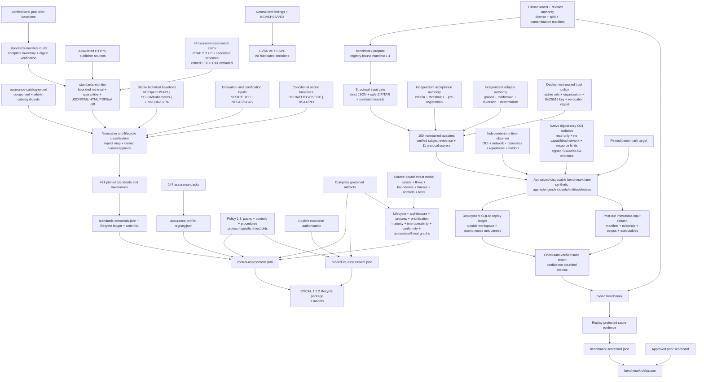

# Industry standards and benchmarks

Last reviewed: 2026-08-30

The suite keeps five assurance layers separate so that a catalog reference is
never mistaken for test execution or certification:

1. a versioned standards registry and evidence-surface crosswalk;
2. repository-owned control objectives with explicit evidence requirements;
3. policy-pinned assessment procedures with execution and authorization proof;
4. source-retained CVSS v4 and SSVC prioritization; and
5. measured, corpus-bound benchmark scorecards and regression deltas.

Every artifact states its claim boundary. The outputs support engineering and
assurance workflows; they do not grant certification, authorization to test, or
proof that an application is vulnerability-free.

## Coverage

`standards-crosswalk.json` registers 481 version-explicit references:

- verification and test methods: OWASP ASVS 5.0, MASVS 2.1, TCASVS 5.0, WSTG
  4.2, MASTG 2.0, SCVS 1.0, and AITG 1.0;
- lifecycle, controls, assessment, and governance: NIST SSDF 1.1, CSF 2.0,
  SP 800-53 release 5.2, SP 800-53A release 5.2, SP 800-115, SP 800-161r1,
  OWASP SAMM 2.1, OpenSSF OSPS Baseline, CIS Controls 8.1, CIS Benchmarks,
  NIST SCAP 1.4, and CSA CCM 4.1;
- weaknesses, attacks, defenses, and prioritization: CWE Top 25, OWASP Top 10,
  OWASP API Top 10, CAPEC, MITRE ATT&CK, MITRE ATLAS, MITRE D3FEND, FIRST
  CVSS 4.0, and CISA SSVC;
- AI risk and management: OWASP LLM Top 10, NIST AI RMF, NIST AI 600-1,
  ISO/IEC 42001, ISO/IEC 23894, and the emerging OWASP APTS reference; and
- quality and architecture: ISO/IEC 25010, ISO/IEC 5055, ISO/IEC 25023,
  ISO/IEC/IEEE 42010, and CISQ quality measures;
- enterprise, privacy, and product response: ISO/IEC 27001, 27002, 27034-1,
  27701, 29147, and 30111; NIST Privacy Framework 1.0 and SP 800-61r3; and
- supply-chain and conditional regulatory profiles: NIST SP 800-204D and
  SP 800-218A, SLSA 1.2, ISO/IEC 18974 and 5230, SPDX 3.0/ISO 5962, EU CRA,
  PCI DSS 4.0.1, PCI Secure Software 2.x, NIST SP 800-171r3, and SOC 2 TSC;
- identity, protocols, cloud, and zero trust: NIST SP 800-63-4, RFC 9700,
  WebAuthn, OpenID FAPI, ISO/IEC 27017/27018, NIST SP 800-190, and NIST
  SP 800-207/207A;
- cryptography and resilience: FIPS 140-3, FIPS 203/204/205, NIST
  SP 800-131A, RFC 9325, ISO 22301, and NIST SP 800-34;
- EU digital obligations: GDPR, NIS2, DORA, and the EU AI Act; and
- conditional product and sector assurance: NISTIR 8259/8259A/8259B, ETSI
  EN 303 645, IEC 62443-4-1/4-2, ISO/SAE 21434, UNECE R155/R156, IEC 62304,
  IEC 81001-5-1, FDA medical-device guidance, FedRAMP, CMMC, and NIST
  SP 800-171A;
- machine-readable security exchange and assessment: OASIS SARIF, CSAF,
  STIX, and TAXII; ISO/IEC 20153; ECMA-424; NIST OSCAL; and OpenVEX;
- certification, secure coding, and verification: Common Criteria ISO/IEC
  15408 and 18045, Sigma, SEI CERT C/C++/Java, MISRA C, ISO/IEC TS 17961,
  ISO/IEC TR 24772, exact ISO/IEC/IEEE 29119 Parts 1:2022, 2:2021,
  3:2021, 4:2021, and 5:2024, and ISO/IEC 20246;
- systems, safety, and sector engineering: NIST SP 800-160 volumes 1 and 2,
  SP 800-37, SP 800-55 volumes 1 and 2, ISO/IEC 27005, IEC 61508, ISO 26262,
  ISO 14971, RTCA DO-326A/DO-356A, NISTIR 8425, and ETSI TS 103 701;
- AI, privacy, and zero-trust engineering: NIST AI 100-2, ISO/IEC 42005 and
  24029, ISO 31700, ISO/IEC 29100, NIST SP 800-82 and SP 1800-35, and the CISA
  Zero Trust Maturity Model; and
- update-system assurance: The Update Framework (TUF);
- system planning, Internet, network, logging, and storage security: NIST
  SP 800-18r2 and SP 800-92 plus ISO/IEC 27014, 27032, the 27033 series, and
  ISO/IEC 27040:2024;
- privacy data lifecycle: NIST SP 800-188 and ISO/IEC 27555/27559 for governed
  deletion, de-identification, re-identification risk, and measurable review;
- harmonized accessibility testing: W3C ACT Rules Format 1.1 alongside WCAG
  2.2, with ACT rules retained as informative test procedures rather than
  substituted for WCAG conformance;
- evaluator and conformity-assessment integrity: ISO/IEC 17025, 17020, and
  17065 for competence, impartiality, consistent operation, and bounded
  certification decisions;
- complete industrial and energy operations: IEC 62443-2-1, 2-4, 3-2, and
  3-3, NERC CIP, and NISTIR 7628 in addition to product-development and
  component requirements;
- healthcare and airborne software: the HIPAA Security Rule, NIST SP 800-66,
  policy-pinned HITRUST evidence, and RTCA DO-178C/330/331/332/333 alongside
  DO-326A/356A;
- evaluation, incident, and privacy-impact processes: ISO/IEC 25040/25041,
  ISO/IEC 27035 parts 1-3, ISO/IEC/IEEE 23612, and ISO/IEC 29134;
- federal hardening: policy-pinned DISA STIG and SRG releases; and
- supply-chain identity and threat modeling: in-toto Attestation Framework,
  DSSE, CPE 2.3, SWID, package URL, OSV and CVE interchange schemas, and the
  maintained OWASP Threat Modeling guidance;
- software and systems lifecycle, requirements, architecture, and process:
  ISO/IEC/IEEE 12207, 15288, 29148, 42020, and 42030 plus ISO/IEC 33020 and
  ISO/IEC TS 33061;
- comprehensive weakness and exploit intelligence: the complete MITRE CWE
  catalog, FIRST EPSS, and the CISA Known Exploited Vulnerabilities catalog;
- supplier, signing, and attestation assurance: ISO/IEC 27036 parts 1-4,
  Sigstore, SLSA verifier conformance, and IETF RATS/EAT RFC 9334/9711;
- AI lifecycle, data, and empirical evaluation: ISO/IEC 5338, ISO/IEC 5259
  parts 1-5, NIST AI 700-2 ARIA, and UK AISI Inspect; and
- sector operations: IEC 62443-2-3 patch management, RTCA DO-355A continuing
  airworthiness, IACS UR E26/E27 maritime resilience, and SWIFT CSCF;
- organizational maturity: OWASP DSOVS, OWASP DSOMM 5.0.2, TMMi 2.0, and
  policy-pinned licensed BSIMM and CMMI Development evidence;
- AI quality and conformity: ISO/IEC 42006:2025, ISO/IEC 25059:2023,
  ISO/IEC TR 24027:2021, ISO/IEC TR 24028:2020, and CSA AICM 1.1;
- independent cloud and automation assurance: CSA STAR, OASIS CACAO 2.0,
  OpenC2 1.0, and OCSF; and
- vulnerability disclosure, product regulation, and detection evaluation:
  NIST SP 800-216, UK PSTI, ETSI EN 18031, and MITRE ATT&CK Evaluations.
- cloud-native API, service-mesh, and data protection: NIST SP 800-228 Update 1,
  SP 800-204/204B/204C, SP 800-233, and NISTIR 8505;
- transparent and consumer-side software supply chains: IETF SCITT RFC
  9942/9943, OpenSSF S2C2F, and the NTIA SBOM Minimum Elements;
- agentic and AI testing: OWASP Agentic Top 10 2026, ISO/IEC TR 29119-11,
  and ISO/IEC TS 42119-2;
- API and runtime semantics: OpenAPI 3.1.1, AsyncAPI 3.0.0, the September
  2025 GraphQL specification, JSON Schema 2020-12, and policy-pinned
  OpenTelemetry semantic conventions 1.44.0;
- vulnerability operations and regional resilience: RFC 9116, NIST SP
  800-40r4, NCSC CAF 4.0, Cyber Essentials 3.3, ASD Essential Eight, and
  CISA Cross-Sector CPGs; and
- architecture, privacy, and sector conformance: SEI ATAM, ISO/IEC TS 27560,
  ISO 24089, IEC 62351, and UL 2900;
- current SBOM, enhanced CUI, and developer verification: CISA-led 2026 SBOM
  Minimum Elements, NIST SP 800-172r3/172Ar3, SP 800-53B release 5.2.0,
  and NISTIR 8397;
- cryptographic lifecycle and agility: NIST SP 800-57 parts 1-3, SP 800-227,
  and CSWP 39 Update 1;
- continuous monitoring and ICT continuity: NIST SP 800-137/137A, NISTIR
  8212, ISO/IEC 27004:2016, and ISO/IEC 27031:2025;
- digital forensics: ISO/IEC 27037, 27041, 27042, and 27043 plus NIST
  SP 800-86; and
- inclusive quality: WCAG 2.2, EN 301 549 V3.2.1, and revised Section 508.
- lightweight cryptography and weakness analysis: NIST SP 800-232 Ascon and
  NIST SP 800-231 Bugs Framework;
- IoT security and privacy lifecycle: ISO/IEC 27400:2022, 27402:2023,
  27403:2024, and 27404:2025; and
- threat-led testing and e-discovery: TIBER-EU 2025 plus ISO/IEC 27050-1:2019
  through 27050-4, applied only when the organization selects those domains;
- audit, assessment, and certification integrity: ISO 19011:2026, ISO/IEC
  27007:2020, ISO/IEC TS 27008:2019, ISO/IEC 27006-1:2024, ISO/IEC
  17021-1, and ISO/IEC 17029;
- evaluator competence: ISO/IEC 19896 parts 1-3 for general security
  conformance, cryptographic-module, and Common Criteria evaluator roles;
- application-security governance: the published ISO/IEC 27034 Parts 1, 2,
  3, 5, 5-1, 6, and 7, with deleted Part 4 excluded and future revisions
  retained on the non-normative watchlist;
- firmware, authorization policy, and service-mesh assurance: NIST SP
  800-193, SP 800-192, SP 800-204A, and TCG TPM 2.0 Library v185;
- differential privacy and measurable quality: NIST SP 800-226 plus ISO/IEC
  25012, 25019, 25020, 25024, and 25030 and ISO/IEC TS 25052 Parts 1 and 2
  for quality-in-use and cloud-service quality measurement;
- enterprise risk and product properties: ISO 31000:2018, IEC 31010:2019,
  CISA Secure by Design, and the 2025 Product Security Bad Practices guidance;
- protocol and reproducibility conformance: TLS 1.3 RFC 8446, its operational
  profile RFC 8996, and the Reproducible Builds environment-variation test
  protocol;
- device identity, telecom, and workforce assurance: TCG DICE Attestation
  Architecture 1.2, ISO/IEC 27011:2024, NIST SP 800-181r1, and NICE Framework
  Components 2.2.0;
- independent security-test governance: AMTSO Testing Protocol Standard 1.3,
  the CREST penetration-testing guide, and PTES; and
- operational outcomes and sector controls: the DORA five software-delivery
  metrics, ISO 27799:2025 for health information, and ISO/IEC 27019:2024 for
  energy utilities; and
- structured assurance, integrity-scaled V&V, cryptographic modules,
  biometrics, service management, and proficiency testing: ISO/IEC/IEEE
  15026-2:2022 and 15026-4:2021, OMG SACM 2.3, IEEE 1012-2024, current CMVP
  scheme evidence, ISO/IEC 19790:2025 and 24759:2025, ISO/IEC 17825:2024 and
  20085 Parts 1 and 2, ISO/IEC 19795-1:2021 and 30107 Parts 3 and 4,
  ISO/IEC 20000-1 with Amendment 1:2024, ISO/IEC 27013 with Amendment 1:2024,
  and ISO/IEC 17043:2023.
- lifecycle, quality, and enterprise risk completion: ISO/IEC/IEEE 24748-1:2024,
  15289:2019, 16085:2021, and 90003:2018; ISO/IEC 25002:2024, 25021:2012,
  25022:2016, and 25051:2014; and NIST SP 800-30r1 and SP 800-39;
- current privacy, data, and AI governance: ISO/IEC 29100:2024, 29151:2026,
  27557:2022, TR 27550:2019, 38505-1:2026, 22989:2022, 23053:2022, and
  38507:2022; and
- protective architecture and practical review guidance: ISO 22340:2024,
  OWASP Code Review Guide 2.0, the policy-pinned 2026 OWASP Cornucopia
  Companion Edition, and CIS/SAFECode Secure by Design 1.1;
- enterprise cyber-risk integration: the complete NIST IR 8286 Revision 1
  series for risk identification, estimation, prioritization, response,
  governance roll-up, and business-impact analysis, plus CIS RAM 2.2;
- SQuaRE governance and differentiated AI benchmarking: ISO/IEC 25001:2014,
  confirmed in 2026, and ISO/IEC TR 42106:2026;
- AI data, transparency, explanation, control, bias, and safety: ISO/IEC
  8183:2023, 12792:2025, TS 6254:2025, TS 8200:2024, TS 12791:2024, and
  TR 5469:2024; and
- licensed enterprise governance and architecture: COBIT 2019, TOGAF 10th
  Edition with Technical Corrigendum 1, ArchiMate 3.2, and Open FAIR 2.0,
  represented only through identifiers and organization-supplied licensed
  requirement digests;
- AI application verification, quality, use cases, and ethical engineering:
  OWASP AISVS 1.0, ISO/IEC TS 25058:2024, ISO/IEC TR 24030:2024 and
  27563:2023, and IEEE 7000/7001/7002/7003/7009;
- product certification and federal procurement assurance: the EUCC scheme
  with its 2025 amendment and the policy-pinned CISA Secure Software
  Development Attestation common form;
- organizational IT, quality, and CSF profile governance: ISO/IEC 38500:2024,
  ISO 9001:2026, ISO/IEC 27000:2026, and NIST SP 1301; and
- privacy operationalisation and PET engineering: ISO/IEC 27561:2024,
  ISO/IEC TS 27564:2025, and ISO/IEC 27565:2026 zero-knowledge-proof guidance;
- agent-tool protocol security: the stable MCP 2025-11-25 protocol revision
  plus a date-pinned OWASP MCP Security Cheat Sheet, with authorization,
  capability, tool, resource, prompt, task, sampling, and proxy boundaries;
- provider-native cloud posture: AWS Foundational Security Best Practices 1.0,
  Microsoft Cloud Security Benchmark v1, and the reviewed Google Cloud
  Enterprise Foundations Blueprint, supplementing CSA, CIS, and ISO controls;
- operational response maturity and memory safety: FIRST CSIRT Services
  Framework 2.1, PSIRT Services Framework 1.1 and PSIRT Maturity, plus the
  CISA memory-safe roadmap and buffer-overflow guidance;
- organizational AI impact and resilience: IEEE 2863-2026, IEEE 7010-2020,
  ISO 22316:2017, and ISO/TS 22317:2021; and
- project and ISMS implementation practices: OpenSSF Best Practices Badge
  criteria, ISO/IEC 27003:2017, and ISO/IEC TS 27022:2021.
- interoperable agent-to-agent security: A2A Protocol 1.0.0 identity,
  Agent Card, transport, task, message, artifact, streaming, webhook, and
  delegated-authorization boundaries, kept separate from MCP tool-protocol
  assurance;
- IoT platform evaluation and composition: GlobalPlatform SESIP 1.2 and
  EN 17927:2023 security-functional, assurance, evaluation, certification,
  composition, vulnerability, change, and expiry evidence;
- controlled threat-information exchange and incident analysis: FIRST TLP 2.0,
  FIRST IEP 2.0, and policy-pinned VERIS 1.3.6 label, redistribution,
  deidentification, schema, provenance, and analytic-equivalence controls;
- stable web runtime defenses: W3C CSP Level 2 and Subresource Integrity 1.0
  policy enforcement, integrity, redirect, CORS, substitution, multi-policy,
  reporting, fallback, and cross-browser evidence;
- regulated financial and cloud assurance: the DORA Level 2 technical acts for
  ICT risk, incident classification/reporting, provider registers, and TLPT;
  the current FFIEC Development, Acquisition, and Maintenance, Architecture,
  Infrastructure, and Operations, and Information Security booklets; and BSI
  C5:2020 cloud-control attestation; and
- consumer-IoT labeling: FCC 24-26 Cyber Trust Mark product, laboratory,
  applicant, QR, registry, renewal, withdrawal, and anti-forgery boundaries.
- digital credentials and financial-grade identity: W3C Verifiable Credentials
  Data Model 2.0, Data Integrity 1.0, Bitstring Status List 1.0, final OpenID4VP,
  OpenID4VCI, HAIP, and FAPI 2.0 profile, attacker model, and message signing;
- operational cloud and Kubernetes hardening: CISA SCuBA Microsoft 365 and
  Google Workspace baselines plus CIS Kubernetes Benchmark 2.0.1;
- privacy, runtime, and analysis-method assurance: LINDDUN PRO privacy threat
  modeling and independently scored SAST, DAST, IAST, and RASP evidence;
- conditional industry schemes: GSMA NESAS 3.0 with product-applicable 3GPP
  SCAS, VDA ISA 6.0.3/TISAX, PCI MPoC/P2PE, and C2PA 2.4 content credentials.

`mapping_status=evidence-surface-present` means only that a related artifact
exists. Taxonomy versions marked `policy-pinned` must be selected and approved
by the organization rather than silently floating to a network release.
The crosswalk also carries a non-normative publication watchlist. Draft NIST
SSDF 1.2, NIST SP 800-154, and ISO/IEC 25000-22 remain quarantined while the
final NIST SSDF 1.1 and ISO/IEC 25022:2016 baselines remain normative. ISO/IEC 27090,
NIST Privacy Framework 1.1, ISO/IEC 42119 parts 3, 7, and 8, the next ISO/IEC
27004 and ISO 31000 editions, EN 301 549 V4, TCG DICE 1.3, and draft
ISO/IEC/IEEE 29119-14, the next ISO/IEC/IEEE 15026-4 edition, and IEEE P1012
remain outside normative claims until final publication, version pinning, and
legal review. ISO/IEC 42105 human oversight and ISO/IEC 24970 AI logging also
remain watch items at final-draft status. OWASP ISVS stays on the watchlist while its
public page exposes conflicting release-candidate and final-release labels;
the suite does not infer a stable edition from that ambiguity.
ISO/IEC 42007 and NIST IR 8596 remain draft AI conformity and Cyber AI Profile
inputs, and the next ISO/IEC TR 24030 edition remains a new project. MLCommons
AILuminate Agentic and Multimodal remain non-normative watch items until each
has an immutable released corpus, evaluator, scoring method, and split contract.
The MCP 2026 release candidate, MCSB v2 preview, W3C VC Data Model 2.1,
OpenID4VP 1.1, VDA ISA 2027, next ISO/IEC 27003 edition,
ISO 22316 revision, CSP Level 3, Subresource Integrity 2, Trusted Types, and
draft BSI TR-03183 Parts 1 and 3 are also quarantined. The retired FFIEC
Cybersecurity Assessment Tool is explicitly excluded from current FFIEC
claims. ISO/IEC 27009 is deliberately
excluded because ISO withdrew the 2020 edition; the suite does not preserve a
withdrawn sector-extension standard merely to increase catalog breadth.

Standards lifecycle governance is fail closed. Optional
`standards-lifecycle-evidence.json` input must provide, for every promoted
catalog, a publisher source digest, signed-snapshot digest, change-report
digest, observation time, edition status, approver identity, approval time, and
explicit human approval. `lifecycle_governance.complete` remains false until
every registered catalog passes. The curated entries retain publication,
observation, and supersession metadata where verified; notably, the 2021 NTIA
SBOM document is historical and points to the final CISA-led 2026 v2.1
replacement; the 2025 public-comment draft is not a normative entry.

## Controls and assessment procedures

Copy [the example policy](../examples/industry-assurance-policy.example.json) to
`security/industry-assurance-policy.json`. Policy schema 1.3 supports selectable
assurance packs, custom `controls` and `procedures`, and exact protocol-specific
benchmark thresholds. Frozen 1.0 through 1.2 policies remain readable.
The strict parser accepts only known standard identifiers, unique identities,
bounded text and collections, and safe report-local JSON artifact names.

`assurance-profile-registry.json` exposes 147 built-in packs:

| Pack | Coverage |
|---|---|
| `enterprise-security` | ISO/IEC 27001, 27002, and 27034-1 |
| `privacy` | ISO/IEC 27701 and NIST Privacy Framework |
| `psirt-incident` | ISO/IEC 29147/30111 and NIST SP 800-61r3 |
| `software-supply-chain` | NIST SP 800-204D, SLSA, OpenChain, and SPDX |
| `ai-development` | NIST SP 800-218A, AI RMF, AITG, and ATLAS |
| `eu-cra` | Product security, component, support, and vulnerability handling |
| `payment-software` | PCI DSS and PCI Secure Software |
| `federal-cui` | NIST SP 800-171 and assessment procedures |
| `service-organization` | SOC 2 TSC and NIST CSF evidence surfaces |
| `identity-protocol-security` | Digital identity, OAuth BCP, WebAuthn, and FAPI conformance |
| `cloud-container-zero-trust` | Cloud responsibility, container lifecycle, workload identity, and CIS configuration |
| `cryptography-pqc` | Cryptographic inventory, approved modules, TLS, PQC transition, and algorithm conformance |
| `operational-resilience` | Continuity, contingency planning, recovery objectives, and exercised restoration |
| `eu-digital-regulation` | GDPR, NIS2, DORA, AI Act, and CRA applicability and evidence |
| `iot-consumer` | IoT manufacturer, device capability, support, and consumer-product baselines |
| `ot-industrial` | Industrial secure development, component controls, and zone/conduit assessment |
| `automotive` | Automotive cybersecurity engineering, management, and secure software updates |
| `medical-device` | Medical software lifecycle, safety-security verification, SBOM, and FDA evidence |
| `federal-cloud-defense` | FedRAMP OSCAL, CMMC, CUI controls, and independent assessment objectives |
| `systems-risk-measurement` | Trustworthy systems engineering, cyber resiliency, risk management, and measurement traceability |
| `security-data-interoperability` | SARIF, CSAF, STIX/TAXII, OpenVEX, OSCAL, and CycloneDX schema and semantic exchange |
| `product-certification` | Common Criteria security targets, evaluation evidence, and claimed-scope validation |
| `detection-threat-intelligence` | Sigma detections, ATT&CK behavior, STIX/TAXII exchange, and controlled detection validation |
| `secure-coding` | CERT C/C++/Java, MISRA C, and ISO language-security rule conformance |
| `software-testing-vv` | Exact ISO/IEC/IEEE 29119 process, documentation, technique, and keyword-driven test evidence plus ISO/IEC 20246 work-product review |
| `safety-security` | IEC 61508, ISO 26262, ISO 14971, and avionics safety/security co-engineering |
| `specialized-target-validation` | Mobile, cloud, smart-contract, IoT, and protocol-specific adversarial targets |
| `ai-robustness-impact` | AI impact assessment, robustness testing, measurement, and residual-risk evidence |
| `privacy-by-design` | Privacy principles, privacy-by-design lifecycle controls, and data-flow validation |
| `zero-trust-implementation` | Zero-trust maturity, workload identity, OT boundaries, and implementation validation |
| `independent-evaluator-assurance` | ISO/IEC 17025/17020/17065 method competence, impartiality, traceability, and certification boundaries |
| `ot-system-operations` | IEC 62443 asset owner/provider programs, system risk and security levels, NERC CIP, and smart-grid controls |
| `healthcare-security` | HIPAA ePHI safeguards, NIST SP 800-66 mappings, and licensed HITRUST evidence |
| `airborne-software-assurance` | DO-178C lifecycle objectives, DO-330 tool qualification, and model/OO/formal-method supplements |
| `federal-configuration-hardening` | Version-pinned DISA STIG/SRG and SCAP validation with manual-check review |
| `software-quality-evaluation` | ISO/IEC 25001/25040/25041 quality-requirements planning, evaluation design, execution, rating, limitations, and evaluator viewpoint |
| `incident-management` | ISO/IEC 27035 and ISO/IEC/IEEE 23612 preparation-through-recovery and software-incident traceability |
| `privacy-impact-assessment` | ISO/IEC 29134 PIA scope, stakeholder, impact, treatment, approval, and negative-scenario evidence |
| `supply-chain-identity` | in-toto/DSSE subject integrity and lossless CPE, SWID, purl, OSV, and CVE identities |
| `threat-model-quality` | Assets, boundaries, assumptions, threats, abuse paths, mitigations, tests, residual risk, and drift |
| `software-lifecycle-traceability` | Requirements-through-retirement evidence with bidirectional requirement coverage |
| `architecture-evaluation-process` | Stakeholder concerns, quality scenarios, risk paths, decisions, corroboration, and independent review |
| `software-process-capability` | Evidence-bounded capability levels across requirements, implementation, verification, release, response, operations, and improvement |
| `comprehensive-weakness-mapping` | Full CWE release and abstraction-policy mapping rather than Top-25-only coverage |
| `exploit-prioritization-validation` | Point-in-time EPSS/KEV outcome calibration with future-data exclusion and operational budget metrics |
| `ai-lifecycle-data-evaluation` | AI lifecycle, data quality, bias, transparency, explainability, robustness, supervised-learning evaluation, and repeatable empirical benchmarking |
| `supplier-relationship-assurance` | Supplier agreements, component/service monitoring, ICT supply-chain controls, and cloud-chain accountability |
| `software-signing-conformance` | Sigstore and SLSA verifier trust-root, identity-policy, subject, and negative-case conformance |
| `remote-attestation-assurance` | RATS/EAT evidence, endorsement, appraisal, freshness, verifier, and relying-party boundaries |
| `ot-patch-management` | IEC 62443 disclosure, patch qualification, distribution, compensating controls, and deployment evidence |
| `continuing-airworthiness-security` | DO-355A in-service monitoring, impact assessment, corrective action, approval, and fleet traceability |
| `maritime-cyber-resilience` | IACS UR E26/E27 ship and onboard-system lifecycle, recovery, update, and conformance evidence |
| `financial-messaging-security` | SWIFT CSCF architecture, access, credential, transaction, monitoring, response, and independent-assessment evidence |
| `devsecops-maturity` | OWASP DSOVS and DSOMM evidence-backed maturity with blinded reassessment |
| `test-maturity` | TMMi 2.0 test-process maturity and independent rating calibration |
| `ai-conformity-quality` | AI quality, bias, trustworthiness, AICM controls, and independent conformity evidence |
| `security-automation-interoperability` | CACAO, OpenC2, and OCSF round-trip and semantic conformance |
| `cloud-independent-assurance` | CSA STAR/CAIQ scope, assessor independence, validity, and shared responsibility |
| `federal-vulnerability-disclosure` | NIST SP 800-216 disclosure governance and end-to-end exercise evidence |
| `consumer-product-regulation` | UK PSTI and ETSI EN 18031 applicability and product conformity evidence |
| `detection-product-evaluation` | MITRE ATT&CK Evaluations ingestion with technique-level authorized replay |
| `external-maturity-comparison` | Licensed BSIMM/CMMI evidence and governed, anonymized cohort comparison |
| `cloud-native-api-assurance` | NIST API lifecycle, microservices, service-mesh, DevSecOps, and cloud-native data protection |
| `supply-chain-transparency-consumer` | SCITT statements and receipts, S2C2F dependency consumption, and SBOM minimum elements |
| `ai-agentic-testing` | OWASP agentic risks and ISO risk-based, stochastic AI test design |
| `vulnerability-intake-patch-operations` | RFC 9116 intake plus enterprise inventory-to-verification patch management |
| `runtime-contract-interoperability` | OpenAPI, AsyncAPI, GraphQL, JSON Schema, and OpenTelemetry semantic conformance |
| `uk-cyber-resilience` | NCSC CAF essential-function outcomes and Cyber Essentials technical controls |
| `australian-essential-eight` | Evidence-backed maturity across all eight ASD mitigations |
| `cisa-cross-sector-cpg` | Prioritized cross-sector outcomes and sampled effectiveness evidence |
| `automotive-software-update` | ISO 24089 and UNECE R156 update engineering, negative cases, and recovery |
| `energy-product-security` | IEC 62351 power-protocol security and UL 2900 product test assurance |
| `modern-sbom-assurance` | CISA-led 2026 v2.1 minimum elements with author-signature, format/version, component hash/license, multi-format negative conformance, and historical NTIA traceability |
| `enhanced-cui-assurance` | NIST SP 800-172r3/172Ar3 requirements, procedures, 53B baselines, OSCAL, and independent assessment |
| `developer-verification-minimums` | NISTIR 8397 minimum technique coverage with seeded effectiveness challenge |
| `cryptographic-key-agility` | Key lifecycle, KEM behavior, PQC discovery, transition, downgrade, rollover, and recovery |
| `continuous-security-monitoring` | ISCM strategy, measurement, operations, program assessment, and blinded assessor agreement |
| `ict-continuity-readiness` | ISO/IEC 27031:2025 dependencies, recovery objectives, disruption exercises, and improvement |
| `digital-forensics-readiness` | Digital-evidence custody, method fitness, analysis reproducibility, and incident integration |
| `accessibility-quality` | WCAG 2.2, EN 301 549, and Section 508 mixed automated/manual conformance |
| `audit-assessment-integrity` | Audit program, independence, sampling, technical control assessment, findings, and reperformance integrity |
| `security-evaluator-competence` | Role-bound ISO/IEC 19896 qualification, impartiality, blinded calibration, drift, and adjudication |
| `application-security-governance` | Complete published ISO/IEC 27034 framework, management, ASC exchange, and assurance-prediction validation |
| `firmware-hardware-trust` | NIST platform protect/detect/recover plus TPM measured boot, event-log replay, attestation, and recovery testing |
| `differential-privacy-engineering` | Explicit privacy definitions, budgets, composition, hazards, accounting, utility, and reproducible implementation evaluation |
| `data-quality-engineering` | SQuaRE quality requirements, models, measures, reference data, uncertainty, and repeatable decision rules |
| `quality-in-use-cloud` | ISO/IEC 25019 and 25052 context, cloud quality model, measures, workloads, uncertainty, and decisions |
| `enterprise-risk-techniques` | ISO 31000 governance plus IEC 31010 technique selection, multi-method comparison, sensitivity, and blinded calibration |
| `secure-by-design-product` | CISA secure-default product properties and negative tests for prohibited or high-risk bad practices |
| `tls-protocol-assurance` | TLS 1.3 state-machine, alert, certificate, extension, replay, downgrade, and interoperability conformance |
| `reproducible-build-assurance` | Independent rebuilds across controlled time, path, user, locale, ordering, parallelism, and builder variations |
| `malware-protection-validation` | AMTSO-governed transparent evaluation using harmless EICAR, inert fixtures, clean negatives, isolation, and restoration |
| `confidential-computing-attestation` | DICE layered identity joined to TPM and RATS/EAT evidence, freshness, mutation, and verifier decisions |
| `telecommunications-security` | ISO/IEC 27011 telecom scope, shared responsibility, network/service controls, evidence, and recovery |
| `cyber-workforce-assurance` | Current NICE task, knowledge, and skill coverage with qualifications, separation of duties, drift, and succession |
| `penetration-testing-governance` | CREST/PTES/NIST authorization, scope, safety, methodology, evidence, cleanup, remediation, retest, and closure |
| `software-delivery-outcomes` | Independently recomputed DORA five-metric outcomes with immutable events, bounded scopes, uncertainty, and anti-gaming controls |
| `structured-assurance-case` | ISO 15026 claim-argument-evidence integrity and SACM 2.3 machine-readable exchange with semantic mutation testing |
| `integrity-level-vv` | IEEE 1012 integrity-scaled system, software, hardware, interface, reuse, COTS, and independent V&V |
| `cmvp-cryptographic-module` | Scheme-pinned FIPS 140-3/CMVP evidence, guidance, referenced-edition, prerequisite, and certificate-status validation |
| `international-cryptographic-module` | ISO/IEC 19790:2025 and 24759:2025 module claims, vendor evidence, calibrated tests, faults, and optional non-invasive testing |
| `biometric-identity-assurance` | ISO biometric comparison and PAD design with locked thresholds, demographic strata, attack instruments, and confidence bounds |
| `integrated-service-security-management` | ISO/IEC 20000-1 and 27013 service, change, configuration, supplier, incident, continuity, and ISMS integration |
| `interlaboratory-proficiency` | ISO/IEC 17043 blinded round-robin agreement, reference accuracy, bias, drift, adjudication, and corrective action |
| `enterprise-cyber-risk-integration` | NIST IR 8286 risk records, estimation, prioritization, roll-up, business impact, CIS RAM attack paths, and optional licensed quantitative risk |
| `enterprise-architecture-governance` | Licensed COBIT, TOGAF, ArchiMate, and Open FAIR governance, model semantics, decision traceability, and risk sensitivity |
| `ai-benchmark-governance` | ISO/IEC TR 42106 differentiated AI benchmarking with complexity, context, strata, uncertainty, metamorphic stability, and bounded claims |
| `ai-application-security-verification` | OWASP AISVS Level 1-3 applicability, AI asset/data/model/tool/memory traceability, bounded authority, and adversarial requirement conformance |
| `responsible-ai-system-assurance` | ISO AI quality/use-case evaluation plus IEEE ethical design, measurable transparency, privacy process, bias, and fail-safe validation |
| `eucc-product-certification` | EUCC scheme, laboratory and certification authority, product/certificate identity, vulnerability management, and assurance continuity |
| `federal-software-attestation` | CISA producer/product scope, authorized signatory, SSDF evidence, exceptions, release binding, expiry, and re-attestation |
| `it-quality-governance` | ISO/IEC 38500 governing-body direction and ISO 9001/90003 quality-management evidence with blinded assessor challenge |
| `nist-csf-profile-management` | CSF 2.0 current and target profiles, traceable gaps/actions, valid identifiers, priorities, exceptions, and reassessment |
| `privacy-engineering-pets` | Privacy operationalisation and model validation plus adversarial zero-knowledge-proof implementation and composition evidence |
| `mcp-protocol-security` | MCP schema, lifecycle, capability, OAuth, task, tool, prompt, resource, sampling, consent, proxy, and adversarial containment evidence |
| `cloud-provider-native-security` | AWS FSBP, MCSB v1, and Google Enterprise Foundations inventory, posture, exception, drift, attack-path, cleanup, and rescan evidence |
| `incident-response-service-maturity` | FIRST CSIRT/PSIRT mandate, constituency, service catalog, operational outcomes, maturity, exercise, assessor agreement, and improvement |
| `memory-safety-engineering` | Unsafe-code and FFI inventory, production hardening, static/sanitizer/fuzz evidence, exception governance, and risk-prioritized migration |
| `organizational-ai-governance-impact` | IEEE 2863 governing-body process and IEEE 7010 stakeholder well-being impact, indicators, monitoring, adjudication, and improvement |
| `organizational-resilience-bia` | ISO 22316/22317 dependency and impact analysis, tolerances, RTO/RPO, degraded operation, restoration, reconciliation, and reassessment |
| `open-source-project-assurance` | OpenSSF baseline/metal criteria with evidence-bound answers, freshness, independent sampling, recomputation, and bounded badge claims |
| `isms-implementation-process` | ISO/IEC 27003 implementation guidance and ISO/IEC TS 27022 process capability with assessor calibration and certification boundaries |
| `a2a-protocol-security` | A2A 1.0 Agent Card and endpoint binding, principal-to-skill/task/artifact authority, transport equivalence, OAuth, webhook/stream containment, quotas, and teardown evidence |
| `sesip-iot-platform-evaluation` | SESIP 1.2 and EN 17927 target, profile, assurance-level, composition, certificate, vulnerability, change, evaluator, laboratory, and claim-boundary evidence |
| `threat-intelligence-handling` | FIRST TLP/IEP labeling and redistribution plus VERIS incident classification, policy resolution, round trips, deidentification, audit, and downgrade resistance |
| `web-platform-defense` | CSP2 and SRI1 browser policy, integrity, origin, redirect, CORS, reporting, fallback, substitution, and cross-engine validation |
| `dora-level2-financial-resilience` | DORA ICT-risk, incident classification/reporting, provider-register, and authorized TLPT technical-standard conformance |
| `ffiec-banking-technology` | Current FFIEC DAM, AIO, and Information Security handbook assessment with blinded examiner agreement and retired-CAT exclusion |
| `bsi-c5-cloud-assurance` | C5 cloud-service boundary, control design/operation, customer responsibility, deviations, assessor independence, and attestation-versus-certification precision |
| `us-cyber-trust-mark` | FCC consumer-IoT boundary, recognized-laboratory evidence, application authority, QR/registry integrity, renewal, withdrawal, and mark-overclaim resistance |
| `digital-credential-security` | W3C VC/Data Integrity/status plus final OpenID4VP, OpenID4VCI, HAIP, and issuer-wallet-verifier evidence |
| `federal-saas-hardening` | CISA SCuBA M365/GWS tenant inventory, read-only assessment, exception, remediation, and drift evidence |
| `kubernetes-hardening-conformance` | CIS Kubernetes 2.0.1 control-plane, node, workload, manual-check, exception, and rescan evidence |
| `privacy-threat-modeling` | LINDDUN data-flow, threat-tree, misuse-case, mitigation, blinded-review, and residual-risk evidence |
| `ast-modality-effectiveness` | Matched SAST/DAST/IAST effectiveness plus separately governed RASP prevention evidence |
| `telecom-equipment-assurance` | NESAS development-process and product-applicable 3GPP SCAS laboratory assurance |
| `tisax-automotive-information-assurance` | VDA ISA/TISAX scope, maturity, assessor independence, follow-up, sharing, and label boundaries |
| `content-provenance-authenticity` | C2PA manifest, claim, ingredient, signature, trust, tamper, and truth-claim boundaries |
| `payment-acceptance-security` | PCI MPoC/P2PE solution, payment-flow, key, laboratory, tamper, and validation-claim boundaries |
| `fedramp-20x-continuous-assurance` | Final 2026 Classes A-C rules, security goals, measures, KSIs, independent validation, persistent packages, continuous monitoring, and agency-decision boundaries |
| `fido2-authenticator-assurance` | CTAP 2.2, WebAuthn, MDS 3.1, transport, user verification, authenticator metadata, recovery, and certification-claim boundaries |
| `eudi-wallet-assurance` | eIDAS 2, consolidated implementing acts, ARF 3.0.0/FCAF wallet, issuer, relying-party, privacy, trust-list, and lifecycle conformance |
| `hitrust-assessment-assurance` | Licensed HITRUST CSF 11.8.0 e1/i1/r2 scope, factors, maturity, assessor independence, corrective action, validity, and certification boundaries |
| `pci-software-security-framework` | PCI Secure Software 2.0 and Secure SLC 1.1 product, SDK, module, sensitive-asset, change, annual-attestation, and listing boundaries |
| `nis2-implementation-assurance` | NIS2 Implementing Regulation 2024/2690 and ENISA guidance applicability, technical measures, effectiveness, incidents, suppliers, and notification boundaries |
| `supplier-due-diligence` | NIST SP 1326 supplier identity, ownership, provenance, dependencies, authoritative sources, contract decisions, monitoring, exit, and deception testing |
| `software-assurance-maturity` | OWASP SAMM 2.1 activity-quality evidence, blinded assessor agreement, roadmaps, reassessment, privacy-safe cohort comparison, and sample limitations |

Applicability must be explicit. A selected pack expands into evidence-backed
controls and procedures; an applicable planned procedure remains incomplete.
Copyrighted standards content is not redistributed: organizations can add their
licensed requirement-level catalogs through the existing custom policy surface.

An applicable control is `satisfied` only when every named artifact exists and
does not declare itself incomplete. An applicable procedure additionally needs:

- `execution=executed`;
- every named artifact to be complete; and
- explicit authorization proof when `authorization_required=true`.

Procedure outcomes distinguish `planned`, `evidence-gap`,
`authorization-gap`, `satisfied`, and `not-applicable`. Production and release
profiles become incomplete when an enforced applicable control or procedure is
not satisfied. Static evidence cannot masquerade as a completed penetration or
dynamic test.

## Foundational evidence assessments

Nine strict, schema-validated artifacts turn broad standards references into
reviewable engineering evidence. They are generated on every run and fail
closed when an input is absent or declares itself incomplete:

| Artifact | Governed claim |
|---|---|
| `lifecycle-traceability.json` | Seven life-cycle stages are evidenced; the source is digest-bound; applicable requirements have bidirectional evidence and end-to-end graph reachability; directional links, verified change-impact samples, and independent approval are complete |
| `architecture-evaluation.json` | Stakeholder concerns, quality attributes, risk paths, decisions, structural corroboration, and independent review are present |
| `process-capability-assessment.json` | Seven process dimensions reach at least bounded level 2; level 3 additionally requires independent audit-package verification |
| `prioritization-calibration.json` | At least 100 point-in-time observations use pinned EPSS, KEV, corpus, and outcome snapshots with no future leakage and report calibration, recall-at-budget, effort, and KEV response time |
| `maturity-model-assessment.json` | Applicable DSOVS, DSOMM, TMMi, BSIMM, and CMMI ratings bind scope, method, evidence, report, assessor competence, independence, review count, and domains |
| `security-automation-interoperability.json` | Selected STIX/TAXII, CACAO/OpenC2/OCSF, SCITT/COSE receipt, OpenAPI/AsyncAPI/GraphQL/JSON Schema, and OpenTelemetry versions, schemas, fixtures, positive/negative cases, round trips, semantic equivalence, authority, and replay protection are complete |
| `external-conformity-assessment.json` | Applicable AI, cloud, disclosure, product, detection, and licensed normative assessments bind scope, method, report, assessor, validity, authority, and applicability basis; assessor credentials require an immutable registry snapshot, issuer and scheme, active validity window, signature validation, and revocation check |
| `assurance-case-assessment.json` | ISO 15026/SACM claims, defeaters, evidence, relationships, scope binding, freshness, confidence, graph semantics, round-trip validity, and independent approval are complete |
| `threat-model-assessment.json` | The source-bound asset/component/flow/boundary graph has exact references and risk arithmetic; sensitive crossings are protected; mitigated threats have verified controls and passing negative tests; assumptions, acceptances, change triggers, and independent review are current |

The four extended assessments consume deliberately separate evidence inputs:
`maturity-model-evidence.json`, `security-automation-evidence.json`, and
`external-conformity-evidence.json`, plus
[`structured-assurance-case.json`](../examples/structured-assurance-case.example.json).
Threat-model semantics consume the separate
[`threat-model-evidence.json`](../examples/threat-model-evidence.example.json)
contract so scanner-derived topology cannot silently substitute for reviewed
assets, attack steps, risk decisions, mitigation proof, or approval.
Lifecycle semantics similarly consume
[`lifecycle-traceability-evidence.json`](../examples/lifecycle-traceability-evidence.example.json)
and reject dangling, duplicate, reverse-stage, orphaned, source-unbound, or
incompletely propagated relationships rather than inferring traceability from
artifact presence.
The structured case is intentionally strict: it requires SACM 2.3 schema,
semantic, and round-trip validation; unique claims and evidence; digest-bound
subjects; fresh verified evidence; acyclic support; resolved defeaters; no
contradictory edge semantics; policy confidence; and at least two independent
reviewers. Evidence rows use policy-selected model,
protocol, or scheme identifiers and SHA-256-bind the scope, method, fixtures,
evidence, and report. Assessor records require an identity, independence claim,
and competency digest; maturity ratings require two reviewers and explicit
domains; automation records require positive and negative cases plus round-trip
and semantic-equivalence results; external assessments require an assessment
date and written applicability basis. Unknown source fields are not copied into
the governed outputs, reducing accidental disclosure from assessor workpapers.

These are readiness indicators, not ISO certification, an architecture approval,
or proof that the prioritization model generalizes beyond its pinned evaluation
window and population.

## OSCAL lifecycle package

The suite emits seven OSCAL 1.2.2 JSON models:

| Artifact | Role |
|---|---|
| `oscal-catalog.json` | Repository-scoped control and procedure catalog |
| `oscal-profile.json` | Selected catalog profile |
| `oscal-component-definition.json` | Suite component implementation claims |
| `oscal-system-security-plan.json` | Digest-bound system and implementation boundary |
| `oscal-assessment-plan.json` | Planned controls and assessment subject |
| `oscal-assessment-results.json` | Observations and evidence gaps |
| `oscal-poam.json` | Gap remediation or continuous reassessment work |

The generated model set has been checked against NIST's official OSCAL 1.2.2
complete JSON Schema for empty and representative enforced policies. Repository
artifact validation also enforces the model root, UUID, metadata, and exact
OSCAL version. These are interoperable engineering records, not assessor
signatures or an authority-to-operate decision.

## CVSS v4 and SSVC

`standardized-prioritization.json` keeps native scanner severity separate from
standardized prioritization. A CVSS v4 record is `scored` only when a complete
`CVSS:4.0/...` vector and bounded score came from retained evidence. CycloneDX
1.7 VEX `CVSSv4` ratings are normalized into that source evidence. Missing or
invalid ratings remain explicitly unscored; native severity is never converted
into a fabricated vector.

SSVC is `decided` only when exploitation, automatability, technical impact,
mission prevalence, and the source outcome are all available and valid. KEV or
reproduction evidence may supply exploitation context, but cannot manufacture a
complete decision tree or outcome.

## Benchmark registry

`benchmark-registry.json` includes 182 families:

| Family | Purpose | Execution lane |
|---|---|---|
| Governed holdout | Native signed effectiveness corpus | Core verified report |
| OWASP Benchmark | SAST/DAST true- and false-positive cases | Disposable companion |
| NIST SARD/Juliet | Multi-language static-analysis cases | Disposable companion |
| OWASP Juice Shop | Web DAST behavior | Disposable companion |
| OWASP WebGoat | Web DAST lessons | Disposable companion |
| OWASP crAPI | API authorization and business-logic behavior | Disposable companion |
| CyberSecEval 4 | LLM cybersecurity behavior | Disposable companion |
| MLCommons AILuminate | AI safety and security behavior | Disposable companion |
| Organization holdout | Pinned real-world Python cases | Disposable companion |
| Python CVE pairs | Vulnerable and patched real-world revisions | Disposable companion |
| IaC holdout | Terraform, CloudFormation, and Kubernetes misconfigurations | Disposable companion |
| Container/Kubernetes holdout | Image and orchestration hardening cases | Disposable companion |
| Secret-detection holdout | Synthetic/revoked positives and clean negatives | Disposable companion |
| SBOM/SCA holdout | Component graph and advisory accuracy | Disposable companion |
| Malicious-package holdout | Inert malicious-package behavior | Disposable companion |
| Fuzzing crash holdout | Seeded defects, crashes, and deduplication | Disposable companion |
| Agentic-security holdout | Tool abuse, prompt injection, and exfiltration | Disposable companion |
| Architecture-quality holdout | Labeled dependency and architecture smells | Disposable companion |
| NIST ACVP | Cryptographic algorithm conformance vectors | Disposable companion |
| OpenID FAPI conformance | OAuth/OIDC positive, negative, and replay behavior | Disposable companion |
| W3C Web Platform Tests | WebAuthn browser and relying-party behavior | Disposable companion |
| MITRE attack emulation | Contained ATT&CK-aligned defensive validation | Disposable companion |
| OpenSSF Scorecard | Repository security-posture checks | Disposable companion |
| Polyglot CVE pairs | Time-split vulnerable and patched revisions across eight language families | Disposable companion |
| Artifact interoperability | Semantic SARIF, SPDX, CycloneDX, and OSCAL conformance | Disposable companion |
| Scanner scale and determinism | Wall time, peak memory, and repeatable results | Disposable companion |
| Recovery/resilience holdout | Dependency-failure and restoration behavior | Disposable companion |
| Protocol-evasion holdout | Encoded, fragmented, and ambiguous parser inputs | Disposable companion |
| Atomic Red Team | Controlled detection-control validation mapped to ATT&CK | Disposable companion |
| Official artifact schema conformance | Official schema and semantic round-trip validation for security artifacts | Disposable companion |
| Defects4J | Reproducible real-world Java functional defects | Disposable companion |
| SWE-bench Verified | Repository-level Python functional diagnosis and repair | Disposable companion |
| Google FuzzBench | Statistical fuzzer performance and repeatability | Disposable companion |
| Magma | Ground-truth fuzzing bugs and reachability | Disposable companion |
| OWASP MAS Crackmes | Android and iOS mobile-security behavior | Disposable companion |
| CloudGoat | Disposable cloud attack-path validation | Disposable companion |
| SmartBugs Curated | Labeled Solidity and EVM vulnerability detection | Disposable companion |
| ETSI IoT conformance | Consumer-IoT assessment cases and approved product fixtures | Disposable companion |
| STIX/TAXII interoperability | Threat-intelligence schema and protocol exchange | Disposable companion |
| Secure-coding rule conformance | Organization-approved CERT, MISRA, and ISO rule examples | Disposable companion |
| Vul4J | Reproducible Java vulnerabilities, proof-of-vulnerability tests, and human patches | Disposable companion |
| BugsInPy | Reproducible Python functional defects, coverage, mutation, and repair behavior | Disposable companion |
| AgentDojo | Agent prompt-injection attack success and utility under attack | Disposable companion |
| HarmBench | Standardized automated LLM red teaming, robust refusal, utility, and private-holdout generalization | Disposable companion |
| AgentHarm Inspect Evals 6-B | Multi-step harmful agent behavior, refusal, tool-authority containment, benign utility, and scorer-correctness checks | Disposable companion |
| garak probe conformance | Version-pinned probe, detector, generator, plugin, calibration, and regression execution | Disposable companion |
| OWASP Cornucopia threat-model coverage | Card-to-threat-to-control-to-test traceability, omission mutations, and independent adjudication | Disposable companion |
| OSS-Fuzz/ClusterFuzzLite | Continuous fuzzing integration, crash discovery, deduplication, and regression | Disposable companion |
| DISA STIG/SCAP conformance | Version-pinned automated and manual federal hardening checks | Disposable companion |
| IEC 62443 system conformance | Licensed system-requirement and claimed-security-level assessment | Disposable companion |
| Threat-model quality | Expert-labeled assets, boundaries, assumptions, threats, mitigations, tests, and drift | Disposable companion |
| Lifecycle traceability mutation | Seeded requirement-to-design-to-test-to-release trace breaks | Disposable companion |
| Architecture evaluation scenarios | Blinded, independently labeled quality-attribute and tradeoff scenarios | Disposable companion |
| Process capability assessor agreement | Blinded assessor agreement over evidence-bounded capability cases | Disposable companion |
| CWE mapping conformance | Full-release weakness abstraction and mapping correctness | Disposable companion |
| EPSS/KEV temporal backtest | Point-in-time exploit prioritization without future-data leakage | Disposable companion |
| SV-COMP | Resource-bounded software-verification tasks and validated witnesses | Disposable companion |
| Test-Comp | Resource-bounded test-generation tasks and validated test suites | Disposable companion |
| Sigstore client conformance | Trust-root, identity-policy, subject, and negative signature verification | Disposable companion |
| SLSA verifier conformance | Provenance subject, builder, identity, and negative verification cases | Disposable companion |
| NIST ARIA/Inspect evaluation | Repeatable AI-risk and robustness evaluation with stochastic repetitions | Disposable companion |
| IEC 62443 patch-management exercise | Qualified disclosure-to-deployment and compensating-control evidence | Disposable companion |
| DO-355 continuing-airworthiness exercise | Qualified in-service issue, impact, approval, and fleet-correction evidence | Disposable companion |
| IACS maritime cyber conformance | Qualified ship and onboard-system lifecycle and recovery evidence | Disposable companion |
| SWIFT CSCF independent assessment | Qualified financial-messaging control design and operating-effectiveness evidence | Disposable companion |
| OWASP DSOVS maturity | Evidence-backed DevSecOps verification maturity and assessor agreement | Disposable companion |
| OWASP DSOMM maturity | Evidence-backed DevSecOps maturity and assessor agreement | Disposable companion |
| TMMi assessment | Test-process maturity and independent rating agreement | Disposable companion |
| BSIMM/CMMI cohort | Governed licensed-model and compatible external cohort comparison | Disposable companion |
| CSA STAR/CAIQ conformance | Independent cloud assurance scope and evidence conformance | Disposable companion |
| CACAO/OpenC2/OCSF interoperability | Security automation round-trip, negative-case, and semantic conformance | Disposable companion |
| MITRE ATT&CK Evaluations | Lossless result ingestion and authorized technique-level replay | Disposable companion |
| AI conformity and quality | AI quality, bias, trustworthiness, and control acceptance criteria | Disposable companion |
| PSTI/EN 18031 product conformance | Consumer and radio-product regulatory test evidence | Disposable companion |
| SCITT transparency conformance | Signed statements, COSE receipts, inclusion, consistency, replay, and equivocation | Disposable companion |
| Cloud-native API/service-mesh conformance | Gateway, workload identity, policy bypass, data-plane, and control-plane adversarial cases | Disposable companion |
| API contract specification conformance | Official OpenAPI, AsyncAPI, GraphQL, and JSON Schema positive, negative, downgrade, and round-trip cases | Disposable companion |
| OpenTelemetry semantic conformance | Trace context, baggage, redaction, semantic conventions, and round-trip integrity | Disposable companion |
| AI agentic testing conformance | Risk-based stochastic agent, tool, memory, delegation, utility, and recovery cases | Disposable companion |
| S2C2F consumer dependency conformance | Dependency acquisition, substitution, quarantine, update, and compromise response | Disposable companion |
| Multi-cloud/Kubernetes attack paths | Authorized AWS, Azure, GCP, and Kubernetes identity, network, data, and control-plane paths | Disposable companion |
| security.txt and patch operations | RFC 9116 parsing plus inventory-to-deployment patch lifecycle and rollback | Disposable companion |
| Regional cyber maturity assessment | Blinded assessor agreement for CAF, Cyber Essentials, Essential Eight, and CISA CPG evidence | Disposable companion |
| Automotive software update conformance | ISO 24089 and UNECE R156 authenticity, compatibility, interruption, rollback, and recovery | Disposable companion |
| Energy product security conformance | IEC 62351 and UL 2900 licensed protocol and product negative cases | Disposable companion |
| CISA SBOM minimum-elements conformance | Current minimum fields, relationships, known unknowns, freshness, and multi-format fixtures | Disposable companion |
| Enhanced CUI OSCAL conformance | SP 800-172r3/172Ar3 controls, assessment objects, depth, coverage, and OSCAL traceability | Disposable companion |
| NIST developer verification conformance | NISTIR 8397 technique coverage, overlap, limitations, and seeded positive/negative cases | Disposable companion |
| Cryptographic lifecycle/agility conformance | Key lifecycle, KEM, transition, downgrade, hybrid, rollover, recovery, and zeroization | Disposable companion |
| ISCM program assessment | SP 800-137A/IR 8212 evidence cases with blinded assessor agreement | Disposable companion |
| ICT continuity recovery exercise | ISO/IEC 27031 disruption, degraded-mode, failover, restoration, and lessons-learned cases | Disposable companion |
| Digital forensics chain of custody | Evidence handling, validated methods, repeatability, analysis, and custody integrity | Disposable companion |
| WCAG accessibility conformance | Automated rules plus keyboard, reflow, focus, screen-reader, speech, caption, and manual cases | Disposable companion |
| NIST CFReDS/CFTT | Documented forensic images, expected artifacts, acquisition, search, mobile, and cloud tool behavior | Disposable companion |
| W3C ACT Rules | Rule applicability and expected accessibility outcomes against the formally approved ACT corpus | Disposable companion |
| DroidBench | Android lifecycle, callback, reflection, ICC, aliasing, and source-to-sink taint analysis | Disposable companion |
| Ghera | Android framework misuse and security regression cases on a pinned emulator image | Disposable companion |
| SecBench.js | Real JavaScript/TypeScript vulnerability-fix pairs with locked dependencies | Disposable companion |
| Chaos Mesh/Litmus | Bounded failure experiments with steady state, SLO, blast radius, rollback, and cleanup assertions | Disposable companion |
| Sonobuoy | Kubernetes-release and plugin-pinned conformance execution | Disposable companion |
| CIS-CAT/SCAP platform conformance | Product-, edition-, profile-, and benchmark-specific configuration results | Disposable companion |
| C2SP Project Wycheproof | Valid, invalid, and acceptable cryptographic edge cases with algorithm- and implementation-bound results | Disposable companion |
| TIBER-EU threat-led red team | Approved threat intelligence, scoped objectives, control detection, kill switches, restoration, and independent engagement governance | Authorized external engagement |
| NIST Dioptra | Digest-pinned models, datasets, attacks, defenses, seeds, repeated attack success, utility, and variance | Disposable accelerator companion |
| Firmware resilience and measured boot | Signed firmware, protect/detect/recover faults, TPM event logs, PCR replay, quotes, and recovery oracles | Authorized hardware laboratory or emulator |
| Access-control policy/model conformance | Policy models, decision oracles, boundary cases, mutation operators, and fail-closed authorization outcomes | Disposable companion |
| Differential-privacy implementation evaluation | Neighboring datasets, privacy accountant, epsilon/delta, composition, hazards, utility, and repeated deterministic evidence | Disposable statistical companion |
| Security evaluator calibration | Role-specific licensed criteria, blinded cases, golden decisions, impartiality, agreement, and adjudication | Blinded assessment workspace |
| SQuaRE quality measurement | Approved quality requirements, measure definitions, reference datasets, formulas, scales, uncertainty, and golden results | Disposable measurement companion |
| ISO 29119 test-process conformance | Licensed Parts 2-5 criteria, process/document omissions, technique oracles, boundary cases, and traceability breaks | Protected test-management companion |
| SQuaRE quality-in-use/cloud | User contexts, cloud quality models, workloads, measures, uncertainty, degradation, and recovery decisions | Disposable cloud measurement companion |
| Risk technique calibration | ISO 31000/IEC 31010 scenarios, technique-selection oracles, uncertainty, sensitivity, agreement, and adjudication | Blinded assessment workspace |
| TLS protocol conformance | Pinned BoGo/tlsfuzzer state, alert, certificate, extension, replay, downgrade, fragmentation, and interoperability cases | Loopback-only protocol laboratory |
| Reproducible-build variation | Independent builds across controlled time, path, user, locale, ordering, parallelism, and builder-image variations | No-egress disposable builders |
| CISA Secure by Design negative assurance | Clean-install secure defaults, identity, logging, update, recovery, service exposure, and exception cases | Disposable product environment |
| AMTSO malware-protection evaluation | Approved test plan, harmless EICAR, inert positives, clean negatives, visibility, latency, remediation, safety, and restoration | Dedicated isolated malware laboratory |
| DICE attestation conformance | Layered identity, certificates, evidence, endorsements, freshness, mutation, verifier decisions, reset, and recovery | Authorized hardware laboratory or emulator |
| Telecom security controls | Licensed ISO/IEC 27011 scope, shared responsibility, controls, evidence, incidents, and non-applicability cases | Read-only assessment or disposable telecom lab |
| NICE workforce coverage | NICE 2.2.0 role/task/knowledge/skill mappings, qualifications, separation of duties, coverage, and drift | Access-controlled assessment workspace |
| Penetration-test engagement quality | Signed authorization, rules of engagement, competence, evidence, safety, cleanup, remediation, retest, and closure | Authorized target with kill switches and restoration |
| DORA delivery outcomes | Immutable change, deployment, incident, recovery, and rework events with independent five-metric recomputation | Read-only pseudonymized analytics workspace |
| Structured assurance-case conformance | SACM syntax/semantics and ISO 15026 graph mutation, defeater, evidence, confidence, and review cases | No-egress blinded validation worker |
| Integrity-level V&V conformance | IEEE 1012 integrity classification, task rigor, independence, interfaces, reuse, COTS, and anomaly disposition | Independent read-only V&V workspace |
| CMVP FIPS 140-3 validation | Current scheme publications, referenced editions, module boundary, algorithm prerequisites, certificate status, and decision trace | Qualified cryptographic laboratory |
| ISO 19790/24759 module conformance | International module requirements, vendor evidence, calibrated tests, faults, boundaries, and uncertainty | Qualified cryptographic laboratory |
| Biometric performance and PAD | Locked-threshold FMR, FNMR, IAPAR, demographic and attack-instrument strata with Wilson bounds | Consent-governed sequestered biometric laboratory |
| Service/security management integration | Change, release, configuration, supplier, incident, problem, continuity, recovery, and corrective-action traceability | Read-only evidence plus disposable service twin |
| Interlaboratory proficiency | Blinded assigned-value agreement, reference accuracy, bias, drift, outliers, appeals, and corrective action | Separated proficiency-provider workspace |
| NIST IR 8286 enterprise risk register | Official schema validation, estimation and prioritization re-performance, roll-up lineage, correlation, units, BIA, appetite, and mutation cases | Read-only risk evidence workspace |
| CIS RAM attack-path analysis | Pinned risk criteria, threat and safeguard analysis, blinded assessor agreement, sensitivity, adjudication, and acceptance | Blinded risk assessment workspace |
| SQuaRE quality governance | Licensed ISO/IEC 25001 planning, methods, tools, competence, decisions, feedback, and management fault injection | Independent quality-evaluation workspace |
| ISO/IEC TR 42106 differentiated AI benchmarking | Complexity- and context-stratified quality benchmarking, uncertainty, aggregation, metamorphic rank stability, evaluator robustness, and claim boundaries | Disposable AI benchmark laboratory |
| Enterprise architecture governance | Licensed framework mapping, ArchiMate semantics, stakeholder and decision trace, assessor agreement, and quantitative-risk sensitivity | Read-only blinded architecture workspace |
| Microsoft PyRIT AI red team | Pinned multi-turn scenarios, objectives, techniques, converters, targets, scorers, memory, private holdouts, calibration, and cleanup | No-egress disposable AI sandbox |
| OWASP AISVS 1.0 conformance | Requirement levels, applicability, system boundary, complete control/test/evidence trace, prompt/data/model/tool/memory negative cases, mutation, and adjudication | No-egress disposable AI application sandbox |
| ISO/IEC TS 25058 AI quality evaluation | Licensed quality-model criteria, context, measures, datasets, strata, uncertainty, metamorphic/adverse cases, decisions, and monitoring | Independent AI quality laboratory |
| EUCC scheme assurance | Regulation/amendment/SotA pinning, CC/CEM and security-target map, ITSEF/CB authority, certificate/product binding, and assurance continuity | Read-only separated certification workspace |
| CISA secure-software attestation | Common-form and SSDF claim map, product/release scope, signatory authority, exceptions, forgery, replay, staleness, and change triggers | Read-only test-signing workspace |
| IEEE 7000-series AI ethics | Ethical-value trace, transparency, privacy, subgroup bias, application boundaries, fail-safe behavior, appeals, uncertainty, and adjudication | Disposable responsible-AI assessment workspace |
| AI use-case security/privacy | Domain context and boundary, security/privacy risks and controls, normal/adverse/out-of-domain/misuse cases, and residual-risk review | Disposable domain use-case workspace |
| IT/quality governance assessor agreement | Licensed ISO/IEC 38500/ISO 9001 mapping, blinded cases, competence, agreement, nonconformity, correction, and adjudication | Blinded governance assessment workspace |
| NIST CSF profile reassessment | Valid CSF identifiers, current/target state, gap/risk/action/owner trace, exceptions, expiry, mutation, regression, and reassessment | Read-only governance evidence workspace |
| MLCommons AILuminate Safety | Versioned safety standard, locale, hazards, public/private split, evaluator calibration, grading, contamination, utility, and uncertainty | No-egress disposable model worker |
| MLCommons AILuminate Jailbreak | Versioned attack/baseline corpus, protected split, evaluator calibration, naive-versus-attack grading, variance, utility, and contamination | No-egress disposable model worker |
| Privacy engineering/PET conformance | Privacy model and attacker boundary plus ZKP statement/setup/parameter binding, malformed/replay/linkability/composition/differential cases, and cryptographic review | Disposable cryptographic privacy laboratory |
| MCP client/server security conformance | Schema, lifecycle, capability, transport, OAuth discovery, audience, scopes, redirects, tasks, tools, resources, prompts, sampling, injection, SSRF, confused-deputy, replay, and cleanup cases | No-egress disposable MCP laboratory |
| AWS FSBP/Security Hub conformance | Account/OU/region/resource coverage, controls, findings, suppressions, expiry, drift, remediation, CloudTrail, cleanup, and rescan | Read-only AWS assessment plus disposable test accounts |
| Microsoft MCSB/Defender conformance | Tenant/subscription/resource coverage, v1 baselines, Defender findings, exemptions, preview separation, drift, remediation, activity log, cleanup, and rescan | Read-only Azure assessment plus disposable subscriptions |
| GCP Enterprise Foundations conformance | Organization hierarchy, identities, policies, networks, logging, keys, secrets, SCC, Terraform drift, deviations, cleanup, and rescan | Read-only GCP assessment plus disposable projects |
| FIRST CSIRT/PSIRT maturity | Mandate, constituency, service portfolio, competencies, outcomes, capacity, handoffs, exercises, blinded assessor agreement, and improvement | Blinded synthetic response workspace |
| Memory-safety engineering | Unsafe and FFI reachability, production build hardening, static analysis, sanitizers, fuzzing, crash regressions, exceptions, and migration parity | No-egress native-code builders and runners |
| IEEE AI governance/well-being | Governing authority, roles, lifecycle, stakeholders, indicators, baselines, impacts, tradeoffs, monitoring, appeals, and assessor agreement | Blinded human-impact assessment workspace |
| Organizational resilience/BIA exercise | Dependencies, impact timelines, tolerances, RTO/RPO, capacity, disruption, degradation, failover, restoration, reconciliation, and reassessment | Authorized disposable service twin |
| OpenSSF badge conformance | Criteria revisions, project identity, response export, evidence freshness, disabled controls, stale links, inflated levels, and recomputation | Read-only project assessment workspace |
| ISMS implementation/process assessment | ISO/IEC 27003/27022 mapping, scope, interfaces, measures, capability, tailoring, audit/corrective-action cases, agreement, and claim boundaries | Blinded ISMS assessment workspace |
| A2A protocol security conformance | Agent Card identity, endpoint/version binding, principal/skill/task/message/artifact/subscription authorization, transport equivalence, downgrade, cross-tenant, SSRF, replay, race, and cleanup cases | No-egress disposable A2A laboratory with synthetic agents and callback sinkholes |
| SESIP IoT platform evaluation | SESIP/EN 17927 target, profile, assurance, composition, certificate, vulnerability, change, expiry, evaluator, laboratory, and negative-claim evidence | Separated authorized IoT laboratory with representative non-production hardware or emulators |
| FIRST TLP/IEP information handling | Label and policy semantics, recipients, communities, actions, attribution, storage, redistribution, STIX/TAXII round trips, downgrade, removal, and unauthorized-sharing cases | No-egress synthetic information-exchange laboratory with disclosure sinkholes |
| VERIS incident schema conformance | Schema/vocabulary identity, actor/action/asset/attribute/timeline/impact semantics, unknown values, round trips, aggregation, deidentification, and truth-claim boundaries | Read-only no-egress workspace using deidentified or synthetic incidents |
| W3C web-platform defense | CSP2/SRI1 policy, nonce/hash/source and integrity behavior, redirect/CORS/CDN substitution, multiple policies, reporting, fallback, recovery, and cross-engine results | Disposable loopback browser laboratory with synthetic origins and digest-pinned engines |
| DORA Level 2 technical standards | ICT-risk controls, incident classification/timelines/forms/channels, register templates, TLPT scope/testers/intelligence/safety/remediation, and legal claim boundaries | Legally reviewed synthetic assessment workspace plus separately authorized disposable TLPT service twin |
| FFIEC IT Handbook assessment | DAM 2024, AIO 2021, and Information Security 2016 scope, controls, outcomes, blinded examiner decisions, independence, and retired-CAT exclusion | Blinded financial-technology examination workspace with synthetic institutions and minimized data |
| BSI C5 cloud assurance | Service boundary, locations, architecture, subservices, control design/operation, customer controls, deviations, opinion period, samples, validity, and assessor agreement | Blinded licensed-criteria workspace with no provider mutation |
| FCC Cyber Trust Mark conformance | Product/component boundary, recognized-laboratory evidence, application and label-administrator authority, QR/registry integrity, renewal, forgery, expiry, withdrawal, and overclaim cases | Separated consumer-IoT laboratory with synthetic registry and no real mark application |
| OpenID digital credential conformance | VC issuance/presentation, selective disclosure, status, holder binding, privacy, and interoperability | Synthetic no-egress issuer-wallet-verifier laboratory |
| CISA SCuBA SaaS posture | M365/GWS tenant coverage, read-only findings, exceptions, remediation, drift, and rescans | Least-privilege read-only tenant lane |
| CIS Kubernetes hardening | Automated/manual Kubernetes 2.0.1 checks, applicability, negative cases, exceptions, and rescans | Disposable clusters plus immutable production snapshots |
| LINDDUN privacy threat modeling | DFD completeness, threat elicitation, mitigations, omission mutations, and assessor agreement | Blinded deidentified assessment workspace |
| OWASP Benchmark AST modality comparison | Matched SAST, DAST, and IAST precision/recall, overlap, latency, and capability boundaries | Separate matched-corpus runners |
| RASP prevention effectiveness | Attack block/observe/bypass, false positives, latency, health, tamper, and fail-mode behavior | Disposable instrumented application |
| GSMA NESAS/3GPP SCAS | Development-process and product security test assurance with laboratory authority and retest | Authorized segmented telecom laboratory |
| TISAX/VDA ISA | Scope, protection needs, maturity, findings, follow-up, assessor agreement, sharing, and label boundaries | Blinded licensed-criteria workspace |
| C2PA content credentials | Manifest/signature/trust validation, round trips, edits, revocation, tamper, and parser limits | Synthetic-media test-trust laboratory |
| PCI payment acceptance | MPoC/P2PE components, flows, keys, controls, tamper, updates, remediation, and claim limits | Authorized synthetic-data payment laboratory |
| FedRAMP 20x continuous validation | Class rules, security goals, measures, KSIs, validation code, evidence freshness, boundary drift, Marketplace status, and agency-decision limits | Authorized read-only cloud evidence workspace |
| FIDO2 authenticator conformance | CTAP 2.2/WebAuthn transports, credentials, UV/PIN, malformed CBOR, downgrade, replay, MDS freshness, status, and recovery | No-egress test-authenticator laboratory |
| EUDI wallet functional conformance | ARF 3.0.0/FCAF issuance, presentation, wallet-to-wallet, trust lists, consent, minimization, replay, recovery, and privacy | Synthetic cross-wallet laboratory |
| HITRUST CSF assessment | Licensed 11.8.0 e1/i1/r2 scope, inheritance, samples, maturity, assessor agreement, QA, corrective action, validity, and claims | Blinded licensed assessment workspace |
| PCI Secure Software Framework | Secure Software 2.0/Secure SLC 1.1 product, SDK, module, lifecycle, delta, vulnerability, attestation, and listing evidence | Authorized synthetic-payment software laboratory |
| NIS2 implementing regulation | Applicability, technical measures, evidence effectiveness, incident thresholds/timing, supply chain, continuity, exceptions, and legal/guidance boundaries | Synthetic notification and service exercise |
| NIST supplier due diligence | Supplier ownership, provenance, dependencies, authoritative sources, contradictions, contract decisions, monitoring, exit, aliases, and deception | Blinded immutable-source workspace |
| OWASP SAMM assessment benchmark | SAMM 2.1 scope, quality criteria, maturity evidence, assessor agreement, roadmap, reassessment, cohort privacy, and representativeness | Blinded privacy-protected assessment workspace |

The maintained 100-adapter catalog in `py_security_suite.benchmark_adapters`
defines acquisition, license, input, normalizer, positive/negative control, and
isolation requirements for CFReDS/CFTT, ACT Rules, DroidBench, Ghera,
SecBench.js, Chaos Mesh/Litmus, Sonobuoy, CIS-CAT/SCAP, Wycheproof, TIBER-EU,
NIST Dioptra, firmware/TPM resilience, access-control policy models,
differential privacy, evaluator calibration, SQuaRE measurement, exact
ISO 29119 testing, quality-in-use/cloud, risk calibration, TLS, reproducible
builds, secure-by-design negative testing, AMTSO malware protection, DICE,
telecom, NICE workforce coverage, penetration-test engagement quality, and
DORA delivery outcomes, structured assurance cases, integrity-level V&V,
CMVP and international cryptographic-module conformance, biometric performance
and PAD, integrated service/security management, interlaboratory proficiency,
HarmBench, AgentHarm Inspect Evals, garak, OWASP Cornucopia, Microsoft PyRIT,
OWASP AISVS, EUCC, CISA secure-software attestation, NIST CSF profile
reassessment, and separate MLCommons AILuminate Safety and Jailbreak contracts.
It also defines fail-closed adapters for MCP clients/servers/proxies, AWS FSBP,
MCSB/Defender, Google Enterprise Foundations/SCC, FIRST CSIRT/PSIRT maturity,
memory-safety engineering, IEEE AI governance and well-being, resilience/BIA
exercises, OpenSSF badge recomputation, ISMS process assessment, A2A 1.0,
SESIP/EN 17927, FIRST TLP/IEP, VERIS, CSP2/SRI1, DORA Level 2 technical acts,
FFIEC IT Handbook assessment, BSI C5, and FCC Cyber Trust Mark conformance.
The current tranche adds FedRAMP 20x, FIDO2, EUDI Wallet, HITRUST 11.8,
PCI Secure Software 2.0/Secure SLC, NIS2 implementation, NIST SP 1326, and
OWASP SAMM adapters, and promotes maintained contracts for OWASP Benchmark,
Juliet, ACVP, WPT WebAuthn, STIG/SCAP, Sigstore, SLSA, SV-COMP, Test-Comp,
ATT&CK Evaluations, Atomic Red Team, Defects4J, SWE-bench Verified, Vul4J,
BugsInPy, and OpenSSF Scorecard. Candidate CTAP 2.3 and EUCS, EUMSS, EUDIW,
and EU5G certification schemes remain in the non-normative publisher watchlist.
It deliberately does not vendor licensed content, organization targets, or
floating upstream branches.

The new adapters retain domain-specific safety boundaries. TLS runs are
loopback-only and use no production credentials. Malware-control evaluation
starts with harmless EICAR and permits only approved inert fixtures unless a
separately governed malware laboratory supplies stronger authorization,
containment, destruction, and restoration evidence. Penetration-test quality
assessment cannot authorize an engagement: it requires pre-existing signed
scope and rules of engagement, target allowlists, kill switches, cleanup, and
restoration proof. DORA metrics are research-backed operational outcomes, not
security certification, and CISA/CREST/PTES/Reproducible Builds publications
remain typed as guidance even though their measurable procedures are governed.
AISVS and AILuminate model tests require no-egress disposable targets,
synthetic identities and data, protected-split separation, scorer-manipulation
tests, bounded cost and authority, harmful-output quarantine, kill switches,
reset, and destruction proof. EUCC and federal attestation adapters are
verification-only: they cannot issue certificates or sign producer claims.
A2A, web, information-sharing, and regulatory adapters use synthetic parties,
origins, incidents, registries, and supervisory channels; SESIP, C5, FFIEC,
DORA, and FCC claims remain bounded to the applicable external scheme,
qualified party, and legal scope.
AST modality results are never collapsed into one union score: SAST, DAST, and
IAST retain separate identities and confusion matrices, while RASP uses the
detection/effectiveness protocol because prevention behavior is not a static
finding-classification claim. C2PA validity is also kept separate from content
truth, and all PCI, TISAX, NESAS, OpenID, and CIS outcomes retain external
authority and certification or label boundaries.

External vulnerable applications are never executed by the core scanner. Each
enabled family gets a runner contract naming its adapter, expected labels,
minimum repetitions, required execution evidence, score semantics, and whether
a disposable target is mandatory. The generated task remains a plan until a
separately authorized lane executes it. A benchmark declaration can name an
`adapter_manifest`; that switches its generated task from report-only scoring
to `benchmark-run`. The generated command intentionally omits
`--authorize-execution`, so registry generation cannot grant execution authority.

### Executable adapter contract

For maintained adapters, start from the schema
[`benchmark-preparation-request-1.0` example](../examples/benchmark-preparation-request.example.json)
and let the compiler bind the
registry version, lane, protocol, adapter-spec digest, required inputs, corpus,
and executable identities:

```shell
pysec benchmark-prepare security/benchmark-requests/droidbench.json \
  --workspace .artifacts/droidbench-workspace \
  --output security/benchmark-adapters/droidbench.json
pysec benchmark-runtime-probe /usr/bin/docker \
  --runtime-sha256 APPROVED_RUNTIME_SHA256 --runtime-name docker \
  --runtime-version APPROVED_RUNTIME_VERSION --authorize-execution \
  --output .artifacts/docker-capabilities.json
```

The compiler does not fabricate independent evidence. After the subject digest
is known, trusted authorities issue and sign the referenced acceptance-criteria,
adapter-conformance, runtime-observation, time, replay, contamination, SBOM,
provenance, environment, external-isolation, and cleanup attestations. Schema
1.2 requires role-correct, lifecycle-bounded authority envelopes with revocation
state, at least four distinct signer keys and two organizations, and declared
key/organization separation groups. High-risk `authorized-companion` contracts
reject process mode, inherited networking, non-disposable targets, and missing
cleanup stages.

For frozen legacy integrations, start from
[`benchmark-adapter-manifest.example.json`](../examples/benchmark-adapter-manifest.example.json)
and replace every placeholder with approved, immutable evidence. The runtime
requires an absolute executable path and SHA-256 for every stage, a digest-bound
corpus, license and label-authority digests, organization approval, runner SBOM
and provenance attestations, replay and trusted-time receipts, contamination evidence,
and an exact normalized-result location.

```shell
pysec schema benchmark-adapter-manifest-1.0 > benchmark-adapter.schema.json
pysec schema benchmark-adapter-manifest-1.1 > benchmark-adapter-1.1.schema.json
pysec schema benchmark-adapter-manifest-1.2 > benchmark-adapter-1.2.schema.json
pysec benchmark-run security/benchmark-adapters/droidbench.json \
  --workspace .artifacts/droidbench-workspace \
  --authority-trust-policy /etc/pysec/benchmark-authorities.json \
  --authority-trust-policy-sha256 APPROVED_POLICY_SHA256 \
  --authority-trust-policy-signature /etc/pysec/benchmark-authorities.sig \
  --authority-trust-root /etc/pysec/benchmark-authority-root.pem \
  --authority-trust-root-sha256 APPROVED_ROOT_SHA256 \
  --trusted-time-context /var/lib/pysec/benchmark-time-context.json \
  --trusted-time-context-sha256 APPROVED_TIME_CONTEXT_SHA256 \
  --replay-ledger /var/lib/pysec/benchmark-replay.sqlite3 \
  --replay-checkpoint-state /var/lib/pysec/benchmark-replay-checkpoint.json \
  --receipt-signing-key /run/secrets/benchmark-receipt-key.pem \
  --receipt-signing-key-sha256 APPROVED_RECEIPT_KEY_SHA256 \
  --authorize-execution \
  --output .artifacts/droidbench-execution.json
```

Use `--initialize-replay-checkpoint` only during an explicitly approved first
enrollment. The retained state is signed, bound to the ledger location, checked
before nonce consumption, and atomically advanced after consumption. Schema 1.2
first persists a signed intent, requires the retained checkpoint to be the live
ledger head, holds a cross-process operating-system lease for the complete
transition, and recovers only one exact matching advance after interruption.
Scorecard admission is a separate trust decision: policy 1.3 cannot declare
receipt authorities. The relying deployment supplies a root-signed, expiring,
digest-pinned authority policy outside the workspace through the five
`PYSEC_INDUSTRY_RECEIPT_AUTHORITY_*` settings. Active `execution-receipt` entries
are evaluated at receipt completion, so repository content and receipt-controlled
public keys cannot bootstrap downstream authority.

The preferred deployment authority file follows
[`benchmark-authority-trust-policy-1.1`](../src/py_security_suite/schemas/benchmark-authority-trust-policy-1.1.schema.json);
the repository includes a non-secret
[`example`](../examples/benchmark-authority-trust-policy-1.1.example.json). Its
approved digest, root signature, trusted-time context, replay checkpoint, and
receipt signer are deployment inputs, not manifest or workspace inputs. They
must resolve outside the benchmark workspace and should be protected by the
orchestrator's service-account ACLs. Policies expire within 31 days; public-key
identities hash canonical raw Ed25519 keys rather than serialization bytes.
Schema 1.1 binds key versions, activation/retirement windows, and revocation time;
the relying party evaluates the receipt completion time against those fields.

Each evidence reference names an artifact, digest, detached Ed25519
signature, and pinned public key. The runner verifies the signature and exact
benchmark subject (corpus, binaries, versions, protocol, and isolation policy),
then validates kind-specific claims and their cross-bindings. Acceptance must
bind the exact criteria, thresholds, protocol, and pre-registration; conformance
must bind the adapter spec, executable, normalizer, at least three golden,
malformed, and label-inversion fixtures, deterministic repetitions, the complete
fixture-set digest, and a named, digest-pinned semantic oracle; runtime
observation must bind the isolation mode,
target, image, network/resource controls, repetitions, power/leakage/duplicate
checks, and sequestered holdout. Replay protection is true only when the signed
receipt records a consumed unique nonce, that nonce is atomically consumed in
the deployment SQLite ledger, and its SHA-256 chain reproduces the retained
deployment checkpoint. Every signer must also match an active,
role-specific Ed25519 key, organization, and revocation-state digest in the
deployment policy. CycloneDX/SPDX SBOM subjects, DSSE Ed25519 envelopes over
canonical in-toto/SLSA v1 provenance with a signed complete-material-set digest
and count, repeated conformance outcomes, per-repetition runtime
observations, and two independent cleanup probes are replayed from digest-bound
documents rather than accepted as signed booleans alone. Advanced RFC 3161 time
is replayed from the raw receipt, pinned TSA chain, policy, revocation snapshot,
nonce, challenge, and deployment monotonic state. Power is recomputed with a
protocol-selected exact equal-tail two-sided binomial or standardized-mean model, explicit
Bonferroni adjustment, and a digest-verified preregistered analysis-plan document.
Training/holdout leakage, duplicate-case, and
training-corpus contamination are derived from the actual bounded corpus files
with material-digest-pinned Python/tree-sitter parsers; supplied semantic digests
must reproduce and cannot substitute for the files. Bounded multi-signal Jaccard
analysis combines AST structure, normalized lexical/operator sequences, and
control-flow features to reject high-similarity near-duplicates across languages.

Maintained adapters can use `run_adapter_conformance_suite` to produce a
multi-fixture qualification report by executing their real normalizer at least
three times. Golden, malformed, and label-inverted fixture classes each require
at least three cases; malformed parsing and semantic inversion are evaluated by
separate controls. The compatibility `run_adapter_conformance` helper remains
available for frozen single-fixture contracts. Each canonical golden output must
match its approved oracle, and a metadata-only declaration cannot produce a
passing report.

Commands are argument vectors, never shell strings. The runner verifies the
executable immediately before each stage, supplies a minimal environment,
disables stdin, bounds execution time and captured output, terminates child
process trees on timeout, validates unique normalized case identities, computes
accuracy metrics, applies thresholds, and emits an atomic digest-bound receipt.
After cleanup it rehashes the manifest, all attestation/signature/key material,
claim-referenced evidence, corpus, adapter inputs, and executables. Any mutation
or disappearance changes the decision to fail.
Schema 1.1 additionally rejects statistically insufficient or unbalanced samples
using protocol-specific floors and strata, rejects confidence intervals wider
than policy, and compares minimum metrics against Wilson lower bounds and maximum
error/attack rates against Wilson upper bounds. Its canonical receipt is consumed
directly by the industry scorecard without a hand-authored translation layer.
`process` isolation can claim only inherited network behavior. Before `oci`
execution, the runner actively probes the digest-pinned runtime version and
required containment options and binds the probe-output digests into the signed
receipt. It then starts a preloaded image with `--pull=never`, a read-only root filesystem, all Linux
capabilities dropped, no-new-privileges, denied networking, non-root identity,
bounded CPU/memory/PIDs/open files/core dumps, an init process, a no-exec
temporary filesystem, digest-pinned optional seccomp and named AppArmor
profiles, a read-only workspace and corpus, a single initially empty writable
`.pysec-output` mount with byte and file-count ceilings, explicit container-path
environment variables, and automatic container removal. A
target-restricted network claim requires a separately verified sandbox receipt.

The Linux CI matrix supplies Docker and rootless Podman through
`PYSEC_TEST_OCI_RUNTIME` with a digest-pinned `PYSEC_TEST_OCI_IMAGE` and
mandatorily verifies actual non-root, zero-capability, read-only-root,
no-exec-temporary-filesystem, isolated-network behavior against the immutable image.
Receipt signing is provider-neutral in the Python API: deployments can inject a
`ReceiptSigningProvider` backed by PKCS#11, an HSM, or a KMS. The included
`ExternalEd25519SigningProvider` is a digest-pinned, no-shell vendor bridge that
passes payloads on standard input and verifies returned signatures locally. Provider identity
and key version are cryptographically protected, and the returned Ed25519 public
key must remain admitted by the root-signed authority policy. The CLI retains a
digest-pinned local PEM provider for compatible offline deployments.

Audit JSONL records carry a cross-process global sequence in addition to their
hash link and fsync durability. `sign_security_event_log_head` creates an
HSM/KMS-compatible signed checkpoint whose signer is independently pinned by the
retaining party; subsequent verification rejects log replacement, truncation,
untrusted signers, or a broken anchor chain.

The normalized adapter output is deliberately small and tool-neutral:

```json
{
  "schema_version": "1.0",
  "benchmark_id": "droidbench",
  "protocol": "classification",
  "cases": [
    {
      "id": "Callbacks_Button1",
      "expected_positive": true,
      "observed_positive": true,
      "strata": {"category": "callbacks", "language": "java"}
    }
  ]
}
```

### Publisher lifecycle monitor

The compiled catalog and source manifest can be produced deterministically:

```shell
pysec assurance-catalog-export --output .artifacts/assurance-catalog.json
pysec standards-manifest-build security/standards-baselines.json \
  --output .artifacts/standards-source-manifest.json
```

The catalog export carries a digest for every component and the complete
catalog. The manifest builder verifies every selected local publisher baseline,
derives the exact HTTPS host allowlist and profile/control impact map, and fails
closed on missing or digest-mismatched inventory records.

`standards-monitor` retrieves only explicitly allowlisted HTTPS publisher hosts,
rejects credentials, fragments, nonstandard ports, and non-public resolved
addresses, validates redirects, bounds each response and the overall run, and
writes digest-named observations into quarantine. A changed publisher payload
yields `review-required`; it never changes a normative baseline automatically.

```shell
pysec standards-monitor examples/standards-source-manifest.example.json \
  --output .artifacts/standards-monitor \
  --authorize-network \
  --signing-key security/standards-monitor-ed25519.pem

pysec standards-monitor-verify \
  .artifacts/standards-monitor/standards-monitor-report.json \
  --report-sha256 APPROVED_TRANSPORT_SHA256 \
  --public-key security/standards-monitor-ed25519.pub.pem
```

Optional Ed25519 signing binds the report to the exact manifest, observations,
decision, semantic diff, impact mapping, and promotion policy. The monitor
compares a digest-pinned local baseline using structural JSON paths, XML/HTML
sections, PDF pages, or normalized text lines; identifies added, removed, and
modified sections; classifies normative keywords and lifecycle language; and
emits affected profiles, controls, benchmarks, and a pending approval artifact.
Promotion still requires licensed-requirement review where applicable and named
human approval.



The diagram separates four claim layers that must not be collapsed. A catalog
entry records a reviewed publication; a selected pack records applicability;
an adapter records how evidence must be acquired and normalized; and a passing
score records only the pinned subject, corpus, method, authority, and execution
context. SESIP, EUCC, C5, FCC, DORA, and FFIEC outcomes remain external-scheme
or regulatory evidence and never become suite-issued certifications,
attestations, labels, examinations, or supervisory submissions.

A benchmark score is eligible to pass only with the pinned corpus digest,
organization-approved authority, corpus revision, replay protection, validated
time, verified report checksum, and the evidence required by its scoring
protocol. Classification uses a complete confusion matrix; temporal,
verification, test-generation, fuzzing, stochastic-adversarial,
assessor-agreement, biometric-performance, proficiency-testing, conformance,
and detection-evaluation protocols use typed
method-specific metrics plus digest-bound, organization-approved acceptance
criteria. Every authorized
companion run also requires dataset-license, label-authority, contamination,
runner identity, digest-pinned OCI image, verified and image-subject-bound runner
SBOM and provenance, enforced resource limits, target, environment, toolset,
oracle, enforced network policy, complete egress transcript,
isolation and target-destruction receipts, and positive/negative control
evidence plus an approved fixed, project, or time split. Organization-
pinned corpora require at least two independent reviewers. Stochastic LLM, AI,
and agent families require at least five repetitions; continuous fuzzing
requires at least three. Qualified DISA STIG, IEC 62443, architecture/process,
airworthiness, maritime, and SWIFT conformance lanes additionally require
digest-bound method validation, evaluator competency, impartiality review, and
measurement traceability. Temporal prioritization requires pinned EPSS, KEV,
and outcome snapshots plus future-data exclusion and calibration/budget metrics.
Formal competitions require task, witness or test-suite, and resource-limit
digests. Signing lanes require pinned suites, trust roots, identity policies, and
negative cases. Scale benchmarks require wall-time, peak-memory, and at least
three deterministic runs. Missing execution context fails the score rather than
being treated as a weak pass.

## Capability readiness scores

These scores measure framework readiness, not organizational conformance or
certification. A deployment earns the corresponding assurance only after its
applicable pack, evidence, procedures, authority, and benchmark thresholds pass.

| Area | Readiness | Basis |
|---|---:|---|
| Application security standards | 9/10 | Versioned catalogs, requirement policy, procedures, and retained evidence |
| SAST/DAST methodology | 9/10 | Static, dynamic, API, mobile, and authorized adversarial lanes |
| Software supply chain | 9/10 | SLSA/OpenChain/SPDX profile plus provenance, SBOM, signing, release evidence, and product/version-bound federal producer attestation with authorized-signatory and exception validation |
| Benchmark methodology | 9/10 | Eleven scoring protocols, typed metrics, independently signed acceptance criteria, strata, power/leakage/duplicate/holdout checks, conservative Wilson decisions, replay protection, and deltas |
| Benchmark execution governance | 9/10 | 182 task contracts plus explicit authorization, default registry enforcement, structural corpus validation, deployment-owned active-key admission with four-signer/two-organization separation, subject/cross-bound Ed25519 evidence, durable external SQLite replay receipts, strict claim schemas, independently replayed conformance/runtime/SBOM/SLSA/cleanup documents, post-run immutable-input verification, eleven protocol-specific scorers, 100 maintained adapters, digest-pinned argv-only stages and OCI runtime, read-only-workspace OCI execution, contamination checks, negative controls, and conditional laboratory qualification |
| Audit and assessment integrity | 9/10 | ISO 19011, ISO/IEC 27007/27008/27006-1/17021-1/17029 with scoped sampling, independence, validity, and reperformance |
| Security evaluator competence | 9/10 | ISO/IEC 19896 role-specific qualification plus blinded golden cases, agreement, drift, adjudication, and bounded claims |
| Firmware and hardware trust | 9/10 | NIST SP 800-193 and TPM 2.0 protect/detect/recover, measured-boot replay, fault injection, and recoverable laboratory isolation |
| Differential privacy engineering | 9/10 | NIST SP 800-226 guarantee, accountant, composition, implementation-hazard, reproducibility, and utility evidence |
| Data, software, and cloud quality measurement | 9/10 | ISO/IEC 25001/25012/25019/25020/25024/25030 and TS 25052 planning, governance, requirements, contexts, models, measures, workloads, uncertainty, and golden outcomes |
| Enterprise risk technique assurance | 9/10 | ISO 31000/IEC 31010 plus NIST IR 8286 and CIS RAM governance, schemas, technique selection, multi-tier roll-up, BIA, sensitivity, blinded scenarios, agreement, and adjudication |
| Secure-by-design product assurance | 9/10 | CISA secure-default properties and product bad-practice negative cases with explicit guidance-versus-certification boundaries |
| Build reproducibility | 9/10 | Independent no-egress rebuilds across controlled environment variations with artifact equivalence, classified diffs, and provenance subjects |
| Workforce and engagement quality | 9/10 | NICE 2.2.0 coverage plus CREST/PTES authorization, competence, evidence, cleanup, remediation, retest, and closure controls |
| DevSecOps and test maturity | 8/10 | DSOVS, DSOMM, TMMi, licensed-model evidence, blinded reassessment, and assessor agreement |
| AI quality and conformity | 9/10 | ISO/IEC 42006, 25058, 25059, TR 42106/24030/27563, 8183, 12792, TS 6254/8200/12791, TR 5469, TR 29119-11, TS 42119-2, IEEE 7000-series, CSA AICM, differentiated context, validity, ethics, and stochastic acceptance |
| Cloud independent and provider-native assurance | 9/10 | CSA STAR/CAIQ plus AWS FSBP, MCSB v1, and Google Enterprise Foundations scope, complete inventory, native findings, independent drift reconciliation, exceptions, cleanup, and rescans |
| Security automation interoperability | 9/10 | CACAO 2.0, OpenC2, OCSF, FIRST TLP/IEP, and VERIS schema, downgrade, deidentification, negative-case, round-trip, and semantic-equivalence evidence |
| Consumer-product regulation | 9/10 | UK PSTI, ETSI EN 18031, and FCC Cyber Trust Mark applicability, product/lab/QR/registry evidence, negative cases, withdrawal, and legal claim boundaries |
| Detection product evaluation | 8/10 | ATT&CK Evaluations ingestion and replay with separate coverage, false-positive, visibility, protection, and latency semantics |
| Public conformance integration | 8/10 | ACVP, FAPI, WebAuthn/WPT, ATT&CK emulation, and OpenSSF runner contracts |
| Cross-language real-world benchmarks | 8/10 | Time/project-split CVE-pair contract across Python, JavaScript, Java, C/C++, C#, Go, and Rust |
| Independent benchmark assurance | 8/10 | Label-authority and contamination digests plus two-reviewer minimum for organization corpora |
| Enterprise governance | 9/10 | ISO ISMS/application security, ISO/IEC 38500 governing-body oversight, ISO 9001/90003 quality management, NIST IR 8286, CSF current/target profile management, and optional licensed COBIT, TOGAF, ArchiMate, and Open FAIR packs with evidence-bound OSCAL output |
| Vulnerability, CSIRT, and PSIRT lifecycle | 9/10 | FIRST service catalogs and PSIRT maturity plus disclosure, handling, outcomes, exercises, blinded assessment, improvement, and reassessment controls |
| Privacy engineering | 9/10 | ISO 27701/NIST Privacy plus ISO/IEC 27561 operationalisation, TS 27564 model validation, 27565 ZKP guidance, adversarial PET cases, data exposure, and risk-path evidence |
| Conditional regulatory readiness | 9/10 | CRA, EUCC, DORA technical acts, FFIEC handbooks, BSI C5, FCC labeling, PCI, CUI, federal software producer attestation, and service-organization packs with explicit applicability, scope, authority, expiry, and claim boundaries |
| Identity, MCP, A2A, and protocol security | 9/10 | NIST digital identity, OAuth BCP, WebAuthn, FAPI, stable MCP schema/auth/task/tool conformance, and A2A Agent Card/principal/task/artifact/subscription authorization with confused-deputy, SSRF, cross-tenant, downgrade, replay, and cleanup cases |
| Web runtime defense | 9/10 | CSP2 and SRI1 policy/integrity behavior across nonce, hash, source, redirect, CORS, CDN substitution, reporting, fallback, multiple policies, and digest-pinned browser engines |
| Financial technology assurance | 9/10 conditional | DORA Level 2 ICT-risk, incident, provider-register, reporting, and TLPT evidence plus current FFIEC DAM/AIO/Information Security handbook assessment with legal scope, qualified testers, blinded examiners, and retired-CAT exclusion |
| Cloud-service attestation precision | 9/10 conditional | BSI C5 service/control/customer-responsibility evidence, independent practitioner decisions, report validity, and explicit attestation-versus-certification boundaries |
| Cloud, container, API, and zero trust | 9/10 | ISO cloud controls, NIST API/microservices/service-mesh/container/ZTA references, CIS execution, and workload-bound evidence |
| Cryptography, TLS, and PQC readiness | 9/10 | Module and algorithm conformance, TLS 1.3 BoGo/tlsfuzzer behavior, algorithm transition, PQC inventory, migration, and ACVP evidence requirements |
| Operational resilience and BIA | 9/10 | ISO 22316/22317 resilience and impact analysis plus dependency, tolerance, RTO/RPO, degraded-mode, failover, restoration, reconciliation, variance, and reassessment evidence |
| Memory-safety engineering | 9/10 | CISA roadmap, unsafe/FFI reachability inventory, production hardening, language rules, static analysis, sanitizers, fuzzing, regression, exception, and risk-prioritized migration evidence |
| EU digital regulation | 9/10 | Explicit GDPR, NIS2, DORA, AI Act, and CRA applicability plus DORA Level 2 risk, incident, register, reporting, and TLPT execution contracts |
| IoT and consumer products | 9/10 conditional | Current manufacturer/device/support baselines, SESIP/EN 17927 platform evaluation and composition, FCC Cyber Trust Mark laboratory/registry controls, and consumer-IoT lifecycle testing |
| OT and industrial systems | 9/10 | Full product, service-provider, asset-owner, zone/conduit, system-level, energy, and conformance coverage |
| Automotive | 9/10 | ISO/SAE lifecycle, ISO 24089 update engineering, UNECE management/update controls, and qualified negative-case testing |
| Medical devices | 8/10 | IEC lifecycle/safety-security plus FDA SBOM and vulnerability evidence |
| Federal cloud and defense | 8/10 | FedRAMP OSCAL, CMMC, NIST CUI controls, and assessment procedures |
| AI security | 9/10 | OWASP AISVS Level 1-3, AI SSDF, AI RMF, AITG, ATLAS, bounded tool/data/memory authority, mutation testing, and stochastic agentic benchmark coverage |
| Architecture and code quality | 9/10 | Policy enforcement, history, labeled holdout, and structural evidence |
| Interoperability and audit evidence | 9/10 | SARIF, SBOM/VEX, SCAP, OSCAL, STIX/TAXII, CACAO/OpenC2/OCSF, SCITT, API contracts, OpenTelemetry, signed evidence, and fail-closed protocol evidence |
| Systems security engineering and risk measurement | 9/10 | Trustworthy-systems, cyber-resiliency, RMF, NIST SP 800-30/39 multi-tier risk, ISO/IEC/IEEE 16085 lifecycle risk, and measurement controls with traceable review evidence |
| Security-data interoperability | 9/10 | Explicit SARIF, CSAF, STIX/TAXII, OpenVEX, OSCAL, and CycloneDX contracts plus official-schema benchmark handoff |
| Product certification readiness | 9/10 | Common Criteria, EUCC, and SESIP/EN 17927 scheme pinning, accredited or qualified laboratory/certification authority, target/product/component/certificate identity, assurance continuity, vulnerability handling, public status, and negative-claim validation |
| Detection engineering and threat intelligence | 9/10 | Sigma, ATT&CK, STIX/TAXII, FIRST TLP/IEP handling, VERIS classification/deidentification, and authorized Atomic Red Team validation contracts |
| Language-specific secure coding | 8/10 | CERT C/C++/Java, MISRA C, and ISO rule catalogs with governed conformance corpus |
| Formal software testing and V&V | 9/10 | Exact ISO/IEC/IEEE 29119 Parts 1-5 and ISO/IEC 20246 controls joined to a maintained process/document/technique conformance adapter and real-defect benchmarks |
| Safety and security co-engineering | 8/10 | IEC 61508, ISO 26262, ISO 14971, and avionics assurance with explicit safety-impact review |
| Specialized target validation | 8/10 | OWASP MAS Crackmes, CloudGoat, SmartBugs, IoT conformance, and protocol-specific disposable lanes |
| AI robustness and impact | 8/10 | NIST AI impact assessment and ISO robustness/measurement controls with stochastic evidence requirements |
| Privacy by design | 9/10 | ISO privacy principles, privacy-by-design and operationalisation lifecycle controls, model validation, consent-record interoperability, explicit data-flow procedures, and cryptographic PET evidence |
| Zero-trust implementation | 8/10 | NIST ZTA, CISA maturity, OT boundaries, and workload-identity implementation evidence |
| Canonical fuzzing and functional benchmarks | 9/10 | FuzzBench, Magma, OSS-Fuzz, Defects4J, SWE-bench, Vul4J, and BugsInPy contracts with pinned identities and qualified execution |
| Independent evaluator and laboratory assurance | 8/10 | ISO/IEC 17025/17020/17065 controls plus method, competency, impartiality, traceability, and independent-review evidence |
| Structured assurance-case reasoning | 9/10 | ISO 15026/SACM claim-argument-evidence graphs with scope, freshness, confidence, defeater, contradiction, cycle, and independent-review validation |
| Integrity-scaled V&V | 9/10 | IEEE 1012 risk-tiered system/software/hardware rigor, independence, interface, reuse, COTS, and anomaly evidence |
| Cryptographic-module certification precision | 9/10 | Separate CMVP scheme-pinned and ISO 19790:2025/24759:2025 profiles with certificate status, calibrated methods, faults, and non-invasive options |
| Biometric identity assurance | 9/10 conditional | ISO 19795/30107 locked-threshold FMR, FNMR, IAPAR, demographic and attack-instrument strata, and Wilson confidence bounds |
| Integrated service/security management | 9/10 | ISO 20000-1/27013 lifecycle trace from service configuration and change through incidents, recovery, suppliers, and corrective action |
| Cross-laboratory proficiency | 9/10 | ISO 17043 blinded assigned values, agreement, chance correction, reference accuracy, bias, drift, appeals, and corrective action |
| Healthcare security operations | 8/10 | HIPAA safeguards and NIST SP 800-66 mapping/testing complement device-specific lifecycle assurance |
| Airborne software assurance | 8/10 | DO-178C/330 lifecycle and tool qualification with model-based, object-oriented, and formal-method supplements |
| Federal configuration conformance | 8/10 | Version-pinned DISA STIG/SRG and SCAP benchmark with qualified automated and manual assessment |
| Software quality evaluation process | 9/10 | ISO/IEC 25001/25002/25021/25022/25040/25041/25051 planning, technology management, model selection, measure elements, quality-in-use reproduction, evaluation design, product acceptance, ratings, limitations, and evaluator viewpoint |
| Incident management lifecycle | 8/10 | ISO/IEC 27035 and ISO/IEC/IEEE 23612 preparation, response, recovery, traceability, and exercise controls |
| Privacy impact assessment | 8/10 | ISO/IEC 29134 PIA report and negative-scenario procedure integrated with data-flow evidence |
| Supply-chain identifier integrity | 9/10 | in-toto/DSSE verification and lossless CPE, SWID, purl, OSV, CVE, CycloneDX, and SPDX identities |
| Threat-model quality | 9/10 | A source-bound asset/component/flow/boundary graph with referential integrity, exact risk arithmetic, assumption and acceptance expiry, verified mitigations, passing negative tests, architecture-change coverage, two-person independent approval, systems-engineering traceability, and a labeled benchmark |
| Software and systems lifecycle traceability | 9/10 | Seven-stage, source-bound graph with complete bidirectional requirement evidence, directional digest-backed links, end-to-end requirement reachability, independently verified change-impact samples, two-person review, and a mutation benchmark |
| Scenario-based architecture evaluation | 9/10 | ISO architecture evaluation plus ATAM utility trees, sensitivity and trade-off points, risk themes, dispositions, and blinded assessor scenarios |
| Software process capability | 8/10 | Seven bounded evidence dimensions with level semantics, independent verification, and assessor-agreement benchmark |
| Comprehensive weakness mapping | 8/10 | Complete versioned CWE catalog plus release- and abstraction-policy-bound mapping conformance |
| Exploit prioritization validation | 8/10 | Point-in-time EPSS/KEV calibration with future-data exclusion, outcome authority, recall-at-budget, effort, and response-time evidence |
| Formal verification and test generation | 8/10 | SV-COMP and Test-Comp contracts with pinned tasks, validated witnesses or test suites, and resource limits |
| AI lifecycle, data quality, and evaluation | 9/10 | ISO/IEC 22989 terminology, 23053 ML architecture, 38507 governance, 38505-1 data governance, 5338 lifecycle, 5259 data quality, TS 25058 quality evaluation, TR 24030/27563 domain cases, and ARIA/Inspect/AILuminate stochastic digest-bound evaluation contracts |
| Supplier relationship assurance | 8/10 | ISO/IEC 27036 governance, agreements, monitoring, incident, change, and exit evidence |
| Software-signing conformance | 9/10 | Sigstore and SLSA verifier contracts bind suites, trust roots, identities, subjects, and negative cases |
| Remote attestation assurance | 9/10 | DICE/TPM/RATS/EAT layered identity, evidence, endorsements, freshness, mutations, appraisal, reset/recovery, and relying-party decision boundaries |
| OT patch management | 8/10 | IEC 62443-2-3 disclosure, qualification, distribution, deployment, compensating controls, and qualified exercises |
| Continuing airworthiness security | 8/10 | DO-355A monitoring, impact, corrective action, approval, and fleet traceability with qualified exercise evidence |
| Maritime cyber resilience | 8/10 | IACS UR E26/E27 ship and onboard-system lifecycle, update, recovery, and qualified conformance evidence |
| Financial messaging security | 8/10 | SWIFT CSCF architecture, access, credentials, transactions, monitoring, response, and independent assessment |
| Reproducible real-world defect benchmarks | 9/10 | Defects4J, SWE-bench Verified, Vul4J, BugsInPy, CVE pairs, and governed project/time splits |
| Agent security benchmark realism | 9/10 | AgentDojo, HarmBench, AgentHarm Inspect Evals 6-B, version-pinned garak probes, and an internal holdout with attack success, utility retention, scorer-manipulation tests, contamination analysis, private-case generalization, confidence intervals, inert tools, bounded authority, and five-repetition requirements |

Classification scorecards report precision, recall, specificity, F1, Matthews
correlation coefficient, balanced accuracy, false-positive rate, and Youden's J.
Other protocols retain their native metrics: calibration error and effort;
competition outcomes and scores; generated-test coverage and faults; fuzzing
trials, effect size, and significance; stochastic attack/utility variance;
assessor agreement; conformance cases; or detection coverage, false positives,
and latency. Native effectiveness evaluations also emit Wilson 95% confidence
intervals and strata by CWE, language, parser variant, boundary type, severity,
and mutation operator.
`benchmark-delta.json` compares only identical benchmark families and pinned
corpus digests. The protocol identifier is part of that comparison scope;
changing scoring methodology makes an older baseline incomparable. Protocol
metrics are retained per benchmark, while a previously passing benchmark that
fails its current acceptance criteria is reported as a protocol regression.

Example invocation from an authorized benchmark lane:

```text
pysec benchmark PATH_TO_VERIFIED_REPORT \
  --corpus PATH_TO_PINNED_CORPUS.json \
  --corpus-sha256 APPROVED_CORPUS_SHA256 \
  --format json --output owasp-benchmark-score.json
```

## Interoperability

`industry-assurance.json` reports observed support for SARIF 2.1.0,
CycloneDX 1.7, SPDX 2.x/3.x, CycloneDX VEX 1.7, OpenVEX 0.2, CSAF VEX 2.0,
SCAP 1.4, and OSCAL 1.2.2. CycloneDX and Syft commands explicitly request
CycloneDX 1.7; parsers reject a different SBOM version. VEX inputs are
digest-pinned offline snapshots and never suppress a finding by themselves.

Authoritative references include the [NIST OSCAL project](https://pages.nist.gov/OSCAL/),
[OWASP Benchmark](https://owasp.org/www-project-benchmark/),
[NIST SAMATE/SARD](https://www.nist.gov/itl/csd/secure-systems-and-applications/samate),
[NIST SSDF](https://csrc.nist.gov/pubs/sp/800/218/final),
[NIST CSF](https://www.nist.gov/cyberframework),
[OpenSSF OSPS Baseline](https://baseline.openssf.org/),
[MITRE CWE Top 25](https://cwe.mitre.org/top25/), and
[MITRE ATLAS](https://atlas.mitre.org/). Additional qualification and sector
sources include [ISO/IEC 17025](https://www.iso.org/standard/66912.html),
[NIST SP 800-66r2](https://csrc.nist.gov/pubs/sp/800/66/r2/final),
[FAA AC 20-115D](https://www.faa.gov/airports/resources/advisory_circulars/index.cfm/go/document.information/documentNumber/20-115D),
[DISA STIGs](https://public.cyber.mil/stigs/),
[ISO/IEC 25040](https://www.iso.org/standard/83467.html),
[ISO/IEC 29134](https://www.iso.org/standard/86012.html),
[in-toto specifications](https://in-toto.io/docs/specs/),
[Vul4J](https://github.com/tuhh-softsec/vul4j),
[BugsInPy](https://github.com/soarsmu/BugsInPy), and
[AgentDojo](https://github.com/ethz-spylab/agentdojo). The AI adversarial
execution sources also include
[HarmBench](https://github.com/centerforaisafety/HarmBench),
[AgentHarm in Inspect Evals](https://github.com/UKGovernmentBEIS/inspect_evals/tree/main/src/inspect_evals/agentharm),
[NVIDIA garak](https://github.com/NVIDIA/garak), and
[OWASP Cornucopia](https://cornucopia.owasp.org/), and
[Microsoft PyRIT](https://github.com/microsoft/PyRIT). Their outputs remain
corpus-, implementation-, scorer-, model-, and configuration-specific and are
not presented as proof of general AI safety. The added foundational
and conformance sources include [MITRE CWE](https://cwe.mitre.org/),
[FIRST EPSS](https://www.first.org/epss/),
[CISA KEV](https://www.cisa.gov/known-exploited-vulnerabilities-catalog),
[SV-COMP](https://sv-comp.sosy-lab.org/),
[Test-Comp](https://test-comp.sosy-lab.org/),
[Sigstore conformance](https://github.com/sigstore/sigstore-conformance),
[SLSA verification](https://slsa.dev/verification_summary/),
[NIST ARIA](https://ai-challenges.nist.gov/aria),
[UK AISI Inspect](https://inspect.aisi.org.uk/),
[IETF RATS architecture](https://www.rfc-editor.org/rfc/rfc9334), and
[Entity Attestation Token](https://www.rfc-editor.org/rfc/rfc9711). The latest
extension also uses the official [OWASP DSOVS](https://owasp.org/www-project-devsecops-verification-standard/),
[OWASP DSOMM](https://owasp.org/www-project-devsecops-maturity-model/),
[TMMi](https://www.tmmi.org/tmmi-documents/),
[CSA STAR](https://cloudsecurityalliance.org/star),
[CSA AICM](https://cloudsecurityalliance.org/artifacts/ai-controls-matrix-v1-1),
[OASIS CACAO 2.0](https://docs.oasis-open.org/cacao/security-playbooks/v2.0/security-playbooks-v2.0.html),
[OpenC2](https://www.oasis-open.org/standard/oc2-ls-v1-0/),
[OCSF](https://ocsf.io/),
[NIST SP 800-216](https://csrc.nist.gov/pubs/sp/800/216/final),
[NIST SP 800-228 Update 1](https://csrc.nist.gov/pubs/sp/800/228/upd1/final),
[NIST SP 800-204C](https://csrc.nist.gov/pubs/sp/800/204/c/final),
[NIST SP 800-233](https://csrc.nist.gov/pubs/sp/800/233/final),
[NISTIR 8505](https://csrc.nist.gov/pubs/ir/8505/final),
[IETF SCITT RFC 9943](https://www.rfc-editor.org/info/rfc9943),
[RFC 9116](https://www.rfc-editor.org/info/rfc9116),
[OWASP Agentic Top 10 2026](https://genai.owasp.org/resource/owasp-top-10-for-agentic-applications-for-2026/),
[ISO/IEC TS 42119-2](https://www.iso.org/standard/84127.html),
[OpenSSF S2C2F](https://github.com/ossf/s2c2f),
[OpenTelemetry semantic conventions](https://opentelemetry.io/docs/specs/semconv/),
[NCSC CAF](https://www.ncsc.gov.uk/collection/cyber-assessment-framework),
[ASD Essential Eight](https://www.cyber.gov.au/business-government/asds-cyber-security-frameworks/essential-eight/essential-eight-maturity-model),
[ISO 24089](https://www.iso.org/standard/77796.html),
[IEC 62351](https://webstore.iec.ch/en/publication/6912), and
[UK PSTI guidance](https://www.gov.uk/guidance/regulations-consumer-connectable-product-security). The current extension is grounded in
[ISO/IEC/IEEE 29119-2](https://www.iso.org/standard/79428.html),
[ISO/IEC 25019](https://www.iso.org/standard/78177.html),
[ISO/IEC TS 25052-2](https://www.iso.org/standard/86722.html),
[ISO 31000](https://www.iso.org/standard/65694.html),
[IEC 31010](https://webstore.iec.ch/en/publication/59809),
[CISA Secure by Design](https://www.cisa.gov/securebydesign),
[RFC 8446](https://www.rfc-editor.org/rfc/rfc8446),
[tlsfuzzer](https://tlsfuzzer.readthedocs.io/en/latest/),
[Reproducible Builds](https://reproducible-builds.org/docs/plans/),
[AMTSO](https://www.amtso.org/standards/),
[TCG DICE](https://trustedcomputinggroup.org/resource/dice-attestation-architecture/),
[NICE Framework Components](https://www.nist.gov/itl/applied-cybersecurity/nice/nice-framework-resource-center/nice-framework-current-versions),
[CREST](https://www.crest-approved.org/wp-content/uploads/2023/04/A-Guide-to-Penetration-Testing-2022.pdf), and
[DORA metrics](https://dora.dev/guides/dora-metrics/). The assurance-case,
V&V, module, biometric, service, and proficiency extensions use
[ISO/IEC/IEEE 15026-2](https://www.iso.org/standard/80625.html),
[OMG SACM 2.3](https://www.omg.org/spec/SACM/2.3),
[IEEE 1012-2024](https://standards.ieee.org/ieee/1012/12536/),
[NIST CMVP](https://csrc.nist.gov/Projects/cryptographic-module-validation-program),
[ISO/IEC 19790:2025](https://www.iso.org/standard/82423.html),
[ISO/IEC 24759:2025](https://www.iso.org/standard/82424.html),
[ISO/IEC 30107-3:2023](https://www.iso.org/standard/79520.html),
[ISO/IEC 20000-1](https://www.iso.org/standard/70636.html), and
[ISO/IEC 17043:2023](https://www.iso.org/standard/80864.html). Enterprise-risk,
quality-governance, AI, and architecture additions use
[NIST IR 8286 Rev. 1](https://csrc.nist.gov/pubs/ir/8286/r1/final),
[CIS RAM 2.2](https://learn.cisecurity.org/cis-ram-v2-2),
[ISO/IEC 25001](https://www.iso.org/standard/64787.html),
[ISO/IEC TR 42106](https://www.iso.org/standard/86903.html),
[ISO/IEC 8183](https://www.iso.org/standard/83002.html),
[ISO/IEC 12792](https://www.iso.org/standard/84111.html),
[ISO/IEC TS 8200](https://www.iso.org/standard/83012.html),
[COBIT](https://www.isaca.org/resources/cobit), and policy-pinned Open Group
TOGAF, ArchiMate, and Open FAIR sources. Licensed content is never vendored;
adopters must supply approved requirement and interpretation digests.
The latest assurance tranche uses
[OWASP AISVS 1.0](https://owasp.org/www-project-artificial-intelligence-security-verification-standard-aisvs-docs/),
[ISO/IEC TS 25058](https://www.iso.org/standard/82570.html),
[EUCC](https://certification.enisa.europa.eu/certification-library/eucc-certification-scheme_en),
[CISA Secure Software Development Attestation](https://www.cisa.gov/resources-tools/resources/secure-software-development-attestation-form),
[IEEE autonomous and intelligent system standards](https://standards.ieee.org/initiatives/autonomous-intelligence-systems/standards/),
[ISO/IEC TR 27563](https://www.iso.org/standard/80396.html),
[ISO/IEC TR 24030](https://www.iso.org/standard/84144.html),
[ISO/IEC 38500](https://www.iso.org/standard/81684.html),
[NIST SP 1301](https://csrc.nist.gov/pubs/sp/1301/final), and
[MLCommons AILuminate](https://mlcommons.org/ailuminate/).
The agent, IoT, information-handling, web, and sector additions use official
[A2A 1.0](https://a2a-protocol.org/latest/specification/),
[GlobalPlatform SESIP 1.2](https://globalplatform.org/specs-library/sesip-methodology/),
[FIRST TLP 2.0](https://www.first.org/tlp/),
[FIRST IEP 2.0](https://www.first.org/iep/),
[VERIS](https://verisframework.org/),
[W3C CSP Level 2](https://www.w3.org/TR/CSP2/),
[W3C SRI 1.0](https://www.w3.org/TR/2016/REC-SRI-20160623/),
[DORA delegated and implementing acts](https://www.eba.europa.eu/activities/direct-supervision-and-oversight/digital-operational-resilience-act),
[FFIEC IT Handbooks](https://ithandbook.ffiec.gov/it-booklets/),
[BSI C5](https://www.bsi.bund.de/dok/C5), and
[FCC 24-26](https://docs.fcc.gov/public/attachments/FCC-24-26A1.pdf).
The digital-credential, posture, privacy, telecom, provenance, automotive, and
payment tranche uses official
[W3C VC Data Model 2.0](https://www.w3.org/TR/vc-data-model-2.0/),
[OpenID4VP 1.0](https://openid.net/specs/openid-4-verifiable-presentations-1_0.html),
[OpenID4VC HAIP 1.0](https://openid.net/specs/openid4vc-high-assurance-interoperability-profile-1_0-final.html),
[FAPI 2.0 final specifications](https://openid.net/fapi-2-security-profile-attacker-model-final-specifications-approved/),
[CISA SCuBA](https://github.com/cisagov/ScubaGear),
[CIS Kubernetes Benchmark](https://www.cisecurity.org/benchmark/kubernetes),
[LINDDUN](https://linddun.org/),
[OWASP Benchmark](https://owasp.org/www-project-benchmark/),
[GSMA NESAS](https://www.gsma.com/solutions-and-impact/technologies/security/network-equipment-security-assurance-scheme/),
[ENX TISAX downloads](https://enx.com/en-us/TISAX/downloads/),
[C2PA specifications](https://spec.c2pa.org/specifications/), and
[PCI Security Standards](https://www.pcisecuritystandards.org/standards/).

ISO/IEC 27090, NIST Privacy Framework 1.1, ISO/IEC 42119 parts 3, 7, and 8,
the next ISO 31000 and ISO/IEC/IEEE 15026-4 editions, IEEE P1012, TCG DICE
1.3, ISO/IEC/IEEE 29119-14, ISO/IEC 42105, ISO/IEC 24970, ISO/IEC 42007,
NIST IR 8596, the next ISO/IEC TR 24030 edition, unreleased AILuminate
Agentic/Multimodal contracts, release-ambiguous OWASP ISVS, W3C CSP Level 3,
SRI 2, Trusted Types, W3C VC Data Model 2.1, OpenID4VP 1.1, VDA ISA 2027,
and draft BSI TR-03183 Parts 1 and 3 remain
publication watch items. The registry
intentionally avoids a normative claim until the responsible publisher exposes
a stable final edition and the organization pins its version, source digest,
applicability, and licensed requirements after legal review.
