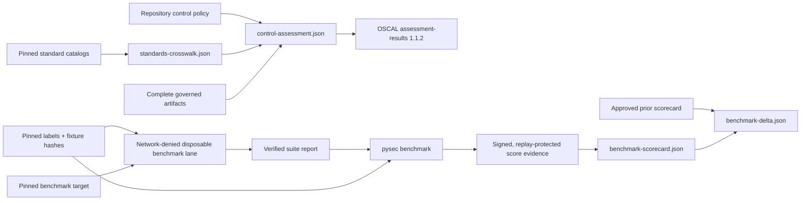

# Industry standards and benchmarks

The suite turns industry references into three deliberately separate layers:

1. a versioned catalog and evidence crosswalk;
2. repository-owned control objectives with explicit evidence requirements; and
3. measured, corpus-bound benchmark scorecards.

None of these outputs claims third-party certification or proves that a scanner
finds every vulnerability. The claim boundary is retained in every generated
artifact.

## Coverage

`standards-crosswalk.json` registers 19 catalogs spanning:

- verification: OWASP ASVS 5.0, MASVS 2.1, and TCASVS 5.0;
- lifecycle, governance, and maturity: NIST SSDF 1.1, NIST CSF 2.0, OWASP SAMM
  2.1, and the OpenSSF OSPS Baseline;
- weaknesses and attacks: CWE Top 25, OWASP Top 10, OWASP API Top 10, CAPEC,
  MITRE ATT&CK, and MITRE ATLAS;
- AI assurance: OWASP LLM Top 10, NIST AI RMF, and NIST AI 600-1; and
- quality and architecture: ISO/IEC 25010, ISO/IEC/IEEE 42010, and CISQ quality
  measures.

The registry links to the authoritative catalog source and names relevant suite
artifacts. `mapping_status=evidence-surface-present` means only that a related
artifact exists. It is not a control result.

## Control assessment

Copy [the example policy](../examples/industry-assurance-policy.example.json) to
`security/industry-assurance-policy.json`, replace its illustrative controls
with the organization's scoped objectives, and set `enforce` only after the
evidence mapping has been reviewed. The parser accepts exact fields, bounded
collections, known standard identifiers, safe report-local artifact names, and
unique control identities.

An applicable control is `satisfied` only when every named artifact exists and
does not declare itself incomplete. An inapplicable control is recorded rather
than silently omitted. In production and release profiles, an enforced gap makes
the scan incomplete.

The suite also emits an OSCAL 1.1.2 assessment-results document. Its observations
link to retained evidence; policy gaps become OSCAL findings. This is an
interchange export, not a complete OSCAL system-security plan or an assessor
signature.

## Benchmark registry

`benchmark-registry.json` includes eight families:

| Family | Purpose | Execution lane |
|---|---|---|
| Governed holdout | Native, signed effectiveness corpus | Core verified report |
| OWASP Benchmark | SAST/DAST true- and false-positive cases | Disposable companion |
| NIST SARD/Juliet | Multi-language static-analysis cases | Disposable companion |
| OWASP Juice Shop | Web DAST behavior | Disposable companion |
| OWASP WebGoat | Web DAST lessons | Disposable companion |
| OWASP crAPI | API authorization and business-logic behavior | Disposable companion |
| CyberSecEval 2 | LLM cybersecurity behavior | Disposable companion |
| Organization holdout | Pinned real-world Python cases | Disposable companion |

External vulnerable applications are never executed by the core scanner. The
generated task contract requires a separately authorized disposable target and
denies network access. Pin the benchmark source and normalized corpus by digest;
do not point a production scan at a live vulnerable training application.



Enable a benchmark in the policy only after supplying its exact corpus digest,
report-local score artifact name, and thresholds. A score is accepted only when
it has the pinned corpus digest, an organization-approved corpus authority,
replay protection, and the required confusion metrics.

The scorecard reports precision, recall, specificity, F1, Matthews correlation
coefficient, balanced accuracy, and false-positive rate. Native evaluations also
emit scorecards by CWE, language, parser variant, boundary type, severity, and
mutation operator when those strata exist. `benchmark-delta.json` compares an
approved prior scorecard and identifies metric regressions; comparability is
explicit and source-bound.

Example invocation from an authorized benchmark lane:

```text
pysec benchmark PATH_TO_VERIFIED_REPORT \
  --corpus PATH_TO_PINNED_CORPUS.json \
  --corpus-sha256 APPROVED_CORPUS_SHA256 \
  --format json --output owasp-benchmark-score.json
```

## Interoperability

`industry-assurance.json` reports observed support for SARIF, CycloneDX, SPDX,
CycloneDX VEX, OpenVEX, CSAF VEX, and OSCAL. VEX inputs are digest-pinned offline
snapshots; CycloneDX, OpenVEX, and CSAF product states are normalized while their
original format is retained. A VEX statement adds exploitability context but
never suppresses a finding by itself.

Authoritative project references include the [OWASP Benchmark](https://owasp.org/www-project-benchmark/),
[NIST SAMATE/SARD](https://www.nist.gov/itl/csd/secure-systems-and-applications/samate),
[NIST SSDF](https://csrc.nist.gov/pubs/sp/800/218/final),
[NIST CSF](https://www.nist.gov/cyberframework),
[OpenSSF OSPS Baseline](https://baseline.openssf.org/),
[MITRE CWE Top 25](https://cwe.mitre.org/top25/), and
[MITRE ATLAS](https://atlas.mitre.org/).
