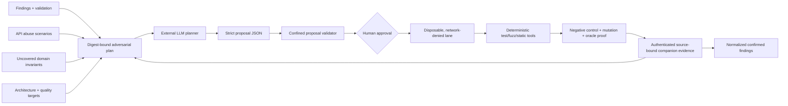

# LLM-guided adversarial testing

Last reviewed: 2026-08-27

Every scan emits `llm-adversarial-plan.json` 1.0. The artifact turns existing
findings, OpenAPI abuse scenarios, uncovered assurance domains, ranked
architecture targets, and code-health root causes into a bounded queue of
provider-neutral adversarial campaigns.

The core never calls a model or executes generated code. A separately
authorized companion can consume the plan, ask an LLM for a schema-constrained
proposal, validate that proposal, execute approved tests in a disposable
environment, and return authenticated evidence. An LLM cannot grade its own
work or promote its own hypothesis to a finding.

## Evidence flow



## Plan contents

Each retained campaign includes:

- a stable campaign identity, attack class, priority, objective, and hypothesis;
- exact context identities referencing the sealed repository and contributing
  artifacts;
- an allowlist of compatible deterministic tools;
- an explicit oracle that cannot be satisfied by an LLM judge alone;
- mandatory negative-control and mutation-validation requirements;
- iteration, network, write, and generated-test boundaries; and
- evidence state: `not-run`, `inconclusive`,
  `exercised-no-confirmed-defect`, or `confirmed-defect`.

Context records retain repository path, line and symbol coordinates, file size,
and SHA-256. Source contents are deliberately omitted from the report. The
authorized companion reads only the named files from the sealed source root and
verifies their digests before presenting them to a model.

All repository text is untrusted, including source comments, documentation,
fixtures, issue text, generated files, scanner messages, and test output. A
companion must present these as data rather than instructions and demonstrate
the `prompt-injection-resistance` control in its retained proof.

## Safe policy

Copy
[`examples/llm-adversarial-policy.example.json`](../examples/llm-adversarial-policy.example.json)
to `security/llm-adversarial-policy.json`. Export its schema with:

```console
pysec schema llm-adversarial-policy-1.0
```

The v1 policy intentionally refuses broad authority:

- network policy is always `deny`;
- source is read-only and writes are limited to `generated-tests`;
- runtime and destructive testing are disabled;
- a human approval token is mandatory before proposal validation;
- tools are selected from a bounded allowlist;
- context files, context bytes, campaigns, and iterations are bounded; and
- negative controls and mutation validation cannot be disabled.

Without a policy, planning remains available but `execution_ready` is false.
This makes the guidance useful for review without silently authorizing an agent.

## Proposal contract

An external model produces `llm-adversarial-proposal` 1.0. Start from
[`examples/llm-adversarial-proposal.example.json`](../examples/llm-adversarial-proposal.example.json)
and bind the proposal to the canonical plan, source, model, provider, prompt
template, and campaign digests.

The authorized handoff invokes:

```console
python -m companion.llm_adversarial validate \
  --plan "$PYSEC_LLM_ADVERSARIAL_PLAN" \
  --proposal "$PYSEC_LLM_ADVERSARIAL_PROPOSAL" \
  --campaign CAMPAIGN_ID \
  --source-root "$PYSEC_SOURCE_ROOT" \
  --workspace "$PYSEC_DISPOSABLE_WORKTREE" \
  --output "$PYSEC_LLM_VALIDATED_PROPOSAL"
```

The validator performs no test execution. It rejects stale or mismatched plan
digests, changed context files, path traversal, source/workspace overlap, writes
outside the generated-test root, shell control syntax, unapproved executables,
LLM-only oracles, missing negative controls, and missing mutation validation.
Its output explicitly retains `execution_authorized: false`; deployment-owned
sandbox policy must authorize the subsequent deterministic commands.

## Execution evidence

The `llm-adversarial` companion kind uses the authenticated companion-assurance
2.0 contract. Production-quality evidence must provide all of these execution
features:

- `schema-constrained-proposal` and `prompt-injection-resistance`;
- `disposable-worktree`, `network-deny`, and `command-allowlist`;
- `deterministic-oracle`, `negative-control`, and `mutation-validation`; and
- `source-bound-evidence`.

It must also retain a verified `control_proof`. A finding identifies its plan
campaign through `evidence.campaign_id` and the exact failed ledger case through
`evidence.case_id`. The core counts a defect only when both bindings match.
Passing cases establish only that the retained experiment did not confirm its
hypothesis; they do not prove the application free of defects.

## Tool routing

The bounded proposal allowlist supports Atheris, authorization-security,
CodeQL, CrossHair, Hypothesis, mutmut, Playwright, Pysa, RESTler, Schemathesis,
Semgrep. The model selects an experiment; these tools and application-owned
assertions provide the oracle.

The initial planner covers five campaign classes: finding reproduction, API
abuse, domain invariants, architecture challenges, and quality invariants.
Future planner revisions can add specialized campaign types without changing
the rule that model output is untrusted and never self-validating.

## Claim boundary

`execution_ready` means the plan and policy are structurally ready for a
separately authorized lane. It does not mean a model was called, credentials
were supplied, code ran, or a target was attacked. `confirmed-defect` is limited
to the exact source, environment, campaign, control proof, and deterministic
oracle retained by authenticated evidence. Production parity, exploitability,
business impact, and universal absence of defects remain separate claims.
