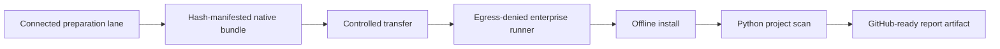
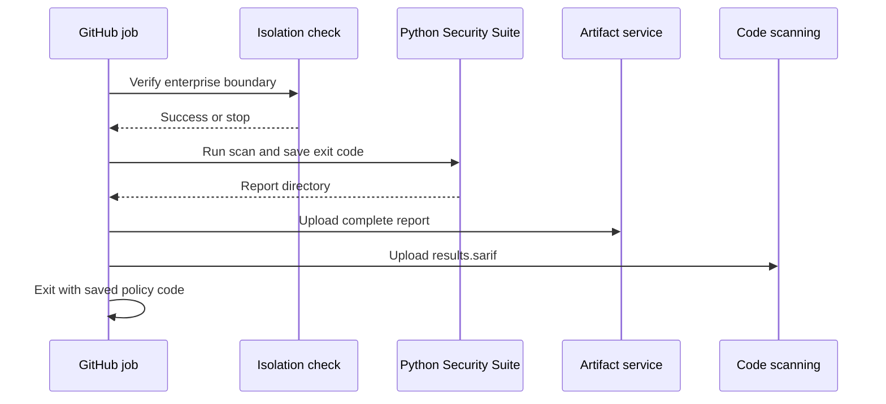

# Python Security Suite operations

Last reviewed: 2026-07-23

## Operating model

Scanner acquisition and scanner execution are separate workflows.



The native workflow does not require Docker. Docker remains an optional Linux
execution mode.

## Prerequisites

For the current native baseline:

- Windows x86-64;
- Python 3.11 with `pip` in the connected preparation lane;
- Python 3.11 with `venv` in the isolated execution lane;
- PowerShell 5.1 or later; and
- an enterprise control capable of enforcing and verifying scanner-child
  network denial.

## 1. Prepare the native bundle

Run only in an approved connected update lane:

```powershell
.\scripts\prepare-native-bundle.ps1
```

The default output is `.artifacts/native-bundle`. It contains:

- pinned top-level Bandit, Semgrep, detect-secrets, Ruff, CycloneDX Python,
  zizmor, ScanCode, `run-codeql`, PyPI attestations,
  check-wheel-contents, Twine, and suite wheels, plus their resolved
  transitive wheel set;
- the pinned Windows OSV-Scanner executable;
- pinned, checksum-verified Windows Trivy, Gitleaks, Syft, Grype, and
  TruffleHog release archives;
- the pinned PyPI OSV advisory snapshot and a connected-lane Grype database;
  and
- `bundle-manifest.json` with the size and SHA-256 digest of every file.

Use `-Force` only to replace a previously marked bundle:

```powershell
.\scripts\prepare-native-bundle.ps1 -Force
```

The script refuses unsafe workspace and drive-root destinations.

The upstream OSV `all.zip` endpoint is a rolling database export. The script
therefore accepts only the explicitly reviewed SHA-256 snapshot embedded in
the preparation script. Updating advisory data is a governed source change:
validate every JSON record, review additions and removals, update the approved
digest, and rebuild the bundle. A checksum mismatch stops preparation.

## 2. Transfer and inspect

Transfer the entire native bundle through the organization's approved artifact
path. The enterprise platform should add provenance, approval, malware
inspection, signing, or attestation according to local policy.

The bundled SHA-256 manifest provides integrity, not publisher identity.
Top-level tool versions are stable inputs, while transitive versions are the
resolution captured by that bundle build. Treat `bundle-manifest.json` as the
exact immutable transfer record; identical rebuilds require an
organization-maintained fully pinned constraints set or artifact mirror.

## 3. Install without package-index access

Inside the secure boundary:

```powershell
.\scripts\install-native-tools.ps1
```

The installer:

1. validates the bundle schema and Windows platform;
2. verifies every recorded bundle digest;
3. creates `.pysec-tools`;
4. installs wheels with `pip --no-index --no-compile`;
5. copies OSV-Scanner and its advisory data;
6. extracts Trivy, Gitleaks, Syft, Grype, and TruffleHog from their verified
   archives and restores the staged Grype database;
7. writes an absolute-path native configuration with the bundled Gitleaks
   exclusions;
8. verifies scanner versions; and
9. records tool versions and installed packages in `native-install.json`.

To replace a previously marked tool directory:

```powershell
.\scripts\install-native-tools.ps1 -Force
```

## 4. Run inside the isolated boundary

After the enterprise isolation check succeeds:

```powershell
.\scripts\run-native-scan.ps1 -NetworkIsolated
```

Defaults:

| Setting | Default |
|---|---|
| Target | Repository root |
| Output | `.artifacts/native-self-scan` |
| Tool root | `.pysec-tools` |
| Profile | `standard` |

Custom paths are supported:

```powershell
.\scripts\run-native-scan.ps1 `
    -Target C:\work\service `
    -Output C:\work\service\.artifacts\security `
    -ToolRoot C:\approved\pysec-tools `
    -Profile extended `
    -NetworkIsolated
```

The Windows bundle directly installs the scanners used by `quick`, `standard`,
`extended`, `artifact`, and most of `supply-chain`. The remaining
comprehensive tools have these requirements:

| Tool | Native staging requirement |
|---|---|
| CodeQL | `run-codeql` is bundled; separately stage the licensed CodeQL CLI and an isolated home containing `.codeql/packages/codeql/python-queries` |
| Pysa | Linux, macOS, or WSL Python environment with approved models |
| GuardDog 3.x | Linux/macOS Python environment with its sandbox support |

Point `tools.codeql.auxiliary_executable` at the staged CodeQL binary and
`tools.codeql.database_path` at its isolated home. GuardDog is
reported not applicable on native Windows because upstream supports Windows
only through Docker, which this suite does not require. None of the supported
native paths require Docker.

Trivy is pinned to 0.69.3 because
[Aqua's March 2026 security advisory](https://github.com/aquasecurity/trivy/security/advisories/GHSA-69fq-xp46-6x23)
lists 0.69.3 and earlier as unaffected by the compromised 0.69.4-0.69.6
publication window. Any version change requires a new archive digest and
security review.

Run every configured adapter:

```powershell
.\scripts\run-native-scan.ps1 `
    -Profile comprehensive `
    -NetworkIsolated
```

Run the final distribution gate after the approved build has populated
`dist/`:

```powershell
.\scripts\run-native-scan.ps1 `
    -Profile release `
    -NetworkIsolated
```

For PyPI provenance, stage each Integrity API response as
`dist/FILENAME.provenance.json` and set
`tools.pypi-attestations.repository_url` to the exact approved GitHub or GitLab
publisher repository. Stage the approved Sigstore/TUF trust cache under
`tools.pypi-attestations.database_path`. Verification uses only local files
and disables TUF refresh.

An applicable missing asset makes the result `INCOMPLETE`. A conditional tool
with no relevant repository input is shown as `not applicable`.

ScanCode is intentionally a bounded governance inventory pass. The aggregate
scans package metadata, requirements and lockfiles, license/copying/notice
files, the root README, and conventional vendored-source roots. It excludes
generated/tool trees, copies only those inputs to a symlink-free temporary
staging directory, uses one local worker for Windows reliability, caps any
single-file analysis at 120 seconds, and emits only files with findings. A
separate full-tree ScanCode forensic or due-diligence job may still be
appropriate; on Windows it can take many minutes even for a small repository.

Omitting `-NetworkIsolated` runs an explicit diagnostic. Scanner commands still
use offline options, but the result is correctly `INCOMPLETE`.

### Production promotion scan

Use the strict profile against a full immutable checkout, not a source archive:

```powershell
.\scripts\run-native-scan.ps1 `
  -Profile production `
  -Target C:\approved\full-clone `
  -Output C:\evidence\production-security `
  -NetworkIsolated
```

The gate blocks medium-or-higher findings and reports `INCOMPLETE` when VCS
history, required scanner coverage, isolation evidence, a dependency lock, or
configured deep Python data-flow analysis is missing. Review
`assurance-case.md` before promotion; it identifies artifact provenance,
dynamic testing, and threat-review evidence that the source scan cannot
produce.

See the [production security gate](production-security.md) for the complete
release-evidence model.

## GitHub publication

Use [examples/github-actions.yml](../examples/github-actions.yml) as an
enterprise template. Replace every action reference with an approved immutable
commit SHA and replace the isolation placeholder with an organization-owned
boundary check.

The workflow preserves the suite exit code, publishes the Markdown summary,
uploads the complete artifact, publishes SARIF, and only then applies the
policy result.



## Exit codes

| Exit | Outcome | Meaning |
|---:|---|---|
| 0 | `PASS` | Applicable required tools completed and no findings were reported |
| 0 | `WARN` | Applicable required tools completed; only non-blocking findings remain |
| 1 | `FAIL` | At least one finding meets a blocking severity |
| 2 | `INCOMPLETE` | Isolation or required scanner evidence is incomplete |
| 3 | CLI error | Configuration, path, output-safety, or invocation error |

## Troubleshooting

### Required scanner is unavailable

Inspect `scan-manifest.json` and `evidence/<tool>.json`. For native installs,
also inspect `.pysec-tools/native-install.json`. Reinstall from the verified
bundle if an executable or offline asset is missing.

### Semgrep fails on Windows

Use the generated native configuration and current suite adapter. It supplies a
temporary `USERPROFILE` and `HOME`, disables metrics and version checks, and
points Semgrep at the bundled local rules.

### detect-secrets is slow on Windows

The adapter uses one worker to avoid excessive Windows process spawning and
passes explicit top-level scan roots so native tools and generated artifacts
are not traversed.

### OSV-Scanner reports no package sources

The project needs a supported lockfile, manifest with resolved versions, or
SBOM for useful dependency evidence. `--no-resolve` is deliberate: the scanner
must not contact package indexes during an isolated scan.

### Native bundle preparation rejects the OSV snapshot checksum

The upstream PyPI snapshot URL is mutable. A checksum failure is an expected
supply-chain control, not a reason to disable verification. Validate the new
snapshot in the connected preparation lane, update the approved SHA-256 value
passed to `prepare-native-bundle.ps1`, and review that change before transfer.

### An added tool is skipped

Check the tool's `applicable` field in `scan-manifest.json`. `false` means the
repository has no matching input, such as no GitHub workflow for zizmor or no
lockfile for CycloneDX. This does not weaken completeness.

### A deep or comprehensive scan is INCOMPLETE

Pysa requires repository configuration and models. CodeQL requires the
`run-codeql` wrapper, a pre-staged CodeQL CLI, and a local Python query pack
under `tools.codeql.database_path`. Current GuardDog requires its
upstream-supported sandbox platform. Missing relevant prerequisites are
reported as unavailable instead of silently dropping coverage.

### Artifact SBOM contains only an opaque wheel

Use the current suite adapter rather than invoking Syft directly on `dist/`.
The adapter safely expands wheel and source distributions into a bounded
temporary tree so Syft and Grype can recognize Python package metadata. The
generated `artifact-manifest.json` binds the evidence to the unexpanded
release files by SHA-256 and byte size.

### Result is INCOMPLETE although all scanners completed

Check `network_isolation_attested` in `scan-manifest.json`. A diagnostic run on
a connected host is incomplete by design. Run in a verified egress-denied
boundary and use `-NetworkIsolated`.

### Existing output cannot be overwritten

`--overwrite` only replaces an existing directory containing a valid suite
`scan-manifest.json`. Choose a new directory if the destination contains
unrelated files.

## Verification

Run unit tests:

```powershell
$env:PYTHONPATH = (Resolve-Path src).Path
python -m unittest discover -s tests -v
```

Verify the report using the digests in:

```text
.artifacts/native-self-scan/checksums.sha256
```

The installer independently verifies the native bundle before any package is
installed.
