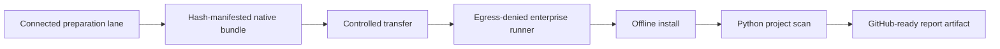
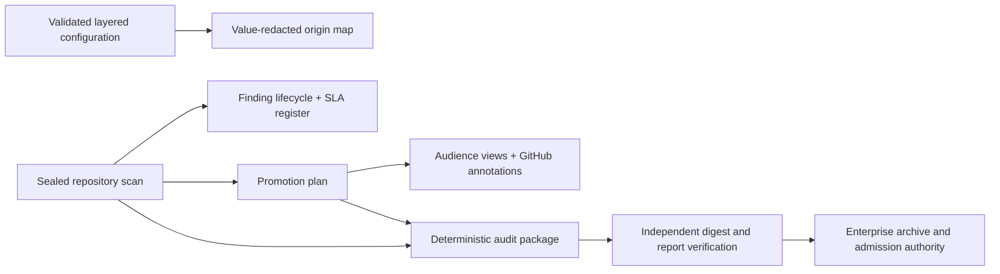
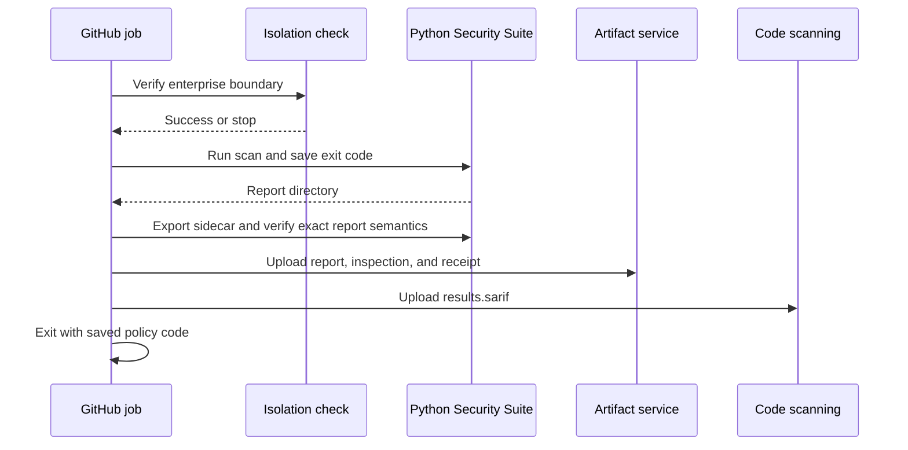
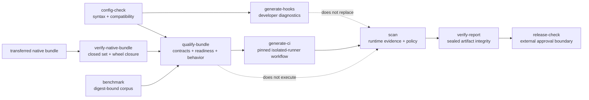
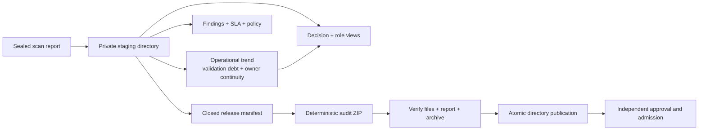

# Python Security Suite operations

Last reviewed: 2026-08-26

## Operating model

Scanner acquisition and scanner execution are separate workflows.



The native workflow does not require Docker. Docker remains an optional Linux
execution mode.

## Evidence publication flow



All sidecars are written outside the sealed report. Inputs that can affect a
decision are SHA-256-bound, and every derived view remains non-authoritative.
For the complete command sequence, use
[`examples/github-actions.yml`](../examples/github-actions.yml).

## Prerequisites

For the current native baseline:

- Windows x86-64;
- Python 3.11 with `pip` in the connected preparation lane;
- Python 3.11 with `venv` in the isolated execution lane;
- .NET 8 SDK or newer in both lanes when installing DevSkim;
- PowerShell 5.1 or later; and
- an enterprise control capable of enforcing and verifying scanner-child
  network denial.

## 1. Prepare the native bundle

Run only in an approved connected update lane:

```powershell
.\scripts\prepare-native-bundle.ps1
```

The default output is `.artifacts/native-bundle`. It contains:

- pinned top-level Bandit, Semgrep, detect-secrets, Ruff, Pylint, mypy,
  Vulture, Radon, Tach, Graphify, the bundled reachability analyzer, REUSE, Flawfinder,
  CycloneDX Python, zizmor, ScanCode,
  `run-codeql`, PyPI attestations,
  check-wheel-contents, Twine, and suite wheels, plus their resolved
  transitive wheel set;
- the pinned Windows OSV-Scanner executable;
- pinned, checksum-verified Windows actionlint, Hadolint, Trivy, Gitleaks,
  Syft, Grype, and TruffleHog assets;
- a checksum-pinned DevSkim NuGet tool package installed from a local-only
  NuGet configuration;
- the pinned PyPI OSV advisory snapshot and a connected-lane Grype database;
  and
- schema 2.0 `bundle-manifest.json` with the size and SHA-256 digest of every
  file plus the exact root requirements for each isolated Python environment.
  Graphify is installed into its own sidecar environment and runs in code-only
  AST mode; see the [Graphify integration](graphify.md).

Use `-Force` only to replace a previously marked bundle:

```powershell
.\scripts\prepare-native-bundle.ps1 -Force
```

The script refuses unsafe workspace and drive-root destinations.

The upstream OSV `all.zip` endpoint is a rolling database export. The script
therefore accepts only the explicitly reviewed SHA-256 snapshot embedded in
the preparation script. `scripts/validate-osv-snapshot.py` then checks bounded
archive/member/record/expanded sizes, safe paths, JSON-only members, CRCs,
unique advisory IDs, `affected` arrays, and parseable `modified` timestamps.
It emits a compact validation receipt before the snapshot can enter the bundle.
Updating advisory data is a governed source change: validate every record,
review additions and removals, update the approved digest, and rebuild the
bundle. A checksum, structure, or semantic failure stops preparation.

The runtime accepts a Grype database for at most ten days from its build time,
allowing a bounded approval and transfer window. Preflight reads the database's
authoritative `db_metadata.build_timestamp`; it does not trust the later file
copy or extraction timestamp. An older or malformed database is unavailable
before execution and makes the policy result `INCOMPLETE`; refresh, rebuild,
and reapprove the native bundle instead of disabling age validation.

REUSE 6.2.0 is published as source. The connected preparation lane builds its
pinned source distribution into a wheel and places that wheel and its resolved
dependencies in the hash-manifested wheelhouse. The isolated installer never
builds it and still uses `pip --no-index`.

## 2. Transfer and inspect

Transfer the entire native bundle through the organization's approved artifact
path. The enterprise platform should add provenance, approval, malware
inspection, signing, or attestation according to local policy.

The bundled SHA-256 manifest provides integrity, not publisher identity.
Top-level tool versions are stable inputs, while transitive versions are the
resolution captured by that bundle build. Treat `bundle-manifest.json` as the
exact immutable transfer record; identical rebuilds require an
organization-maintained fully pinned constraints set or artifact mirror.

Before installation, independently verify the transferred artifact. Supply the
manifest digest through a separately controlled channel:

```powershell
pysec verify-native-bundle .artifacts\native-bundle `
  --manifest-sha256 APPROVED_SHA256 `
  --python C:\Approved\Python311\python.exe `
  --require-wheelhouse-closure `
  --format json `
  --output .artifacts\native-bundle-verification.json
```

This performs a closed-set comparison, so an injected file fails even if every
declared digest remains correct. It rejects links and junctions, unsafe or
case-colliding paths, size or digest changes, malformed/encrypted wheels, CRC
failures, and a wheelhouse that cannot resolve every declared environment with
`pip --isolated --no-index --dry-run`. Schema 1 manifests remain verifiable but
cannot claim dependency closure; rebuild them to schema 2.0.

The current dogfood schema-2 proof verified 5,779 declared files and 274 wheels
with no missing, unexpected, changed, or structurally invalid entry. All four
declared Python environments resolved from the wheelhouse with `--no-index`.
That proves closed-set integrity and offline dependency closure for the tested
bundle; publisher identity, malware absence, network enforcement, and
organization approval remain independent controls.

## 3. Install without package-index access

Inside the secure boundary:

```powershell
.\scripts\install-native-tools.ps1
```

The installer:

1. validates the bundle schema and Windows platform;
2. rejects undeclared, missing, linked, resized, or digest-changed bundle files;
3. creates `.pysec-tools`;
4. installs wheels with `pip --no-index --no-compile`;
5. copies OSV-Scanner and its advisory data;
6. extracts actionlint, Hadolint, Trivy, Gitleaks, Syft, Grype, and TruffleHog
   from verified assets, installs DevSkim from the local NuGet source, and
   restores the staged Grype database;
7. writes an absolute-path native configuration with the bundled Gitleaks
   exclusions and the installed SHA-256 of every scanner entry point;
8. verifies scanner versions; and
9. records tool versions and installed packages in `native-install.json`.

The CodeQL CLI remains a separately governed asset. After staging it, set both
`auxiliary_executable` and `auxiliary_executable_sha256` in the generated
configuration. Production and release scans remain `INCOMPLETE` until that
helper binding is approved and verified.

To replace a previously marked tool directory:

```powershell
.\scripts\install-native-tools.ps1 -Force
```

## 4. Run inside the isolated boundary

After the enterprise isolation check succeeds:

```powershell
.\scripts\run-native-scan.ps1 -NetworkIsolated
```

Defaults:

| Setting | Default |
|---|---|
| Target | Repository root |
| Output | `.artifacts/native-self-scan` |
| Tool root | `.pysec-tools` |
| Profile | `standard` |

Custom paths are supported:

```powershell
.\scripts\run-native-scan.ps1 `
    -Target C:\work\service `
    -Output C:\work\service\.artifacts\security `
    -ToolRoot C:\approved\pysec-tools `
    -Profile extended `
    -NetworkIsolated
```

The Windows bundle directly installs the scanners used by `quick`, `standard`,
`extended`, `artifact`, and most of `supply-chain`. The remaining
comprehensive tools have these requirements. The expanded portfolio also
requires staged ShellCheck, Cosign, Node.js/Pyright, PSScriptAnalyzer, deptry,
diff-cover, and the isolated Checkov sidecar when their inputs are applicable:

| Tool | Native staging requirement |
|---|---|
| CodeQL | `run-codeql` is bundled; separately stage the licensed CodeQL CLI and an isolated home containing `.codeql/packages/codeql/python-queries` |
| KICS | Upstream no longer ships native release binaries. In the connected build lane, compile the pinned KICS source without Docker and transfer the executable together with the matching `assets/queries` tree; set `tools.kics.rules_path` to that tree. |
| Conftest | Binary is bundled; configure an approved local Rego directory in `tools.conftest.rules_path`. |
| Vale | Binary is bundled; stage reviewed style packages and configure the local `.vale.ini` in `tools.vale.rules_path`. |
| pipdeptree | Wheel is bundled; set `auxiliary_executable` to the Python interpreter from the already-created target runtime environment, never the scanner environment by accident. |
| CrossHair, Atheris, mutmut | Execute them in separately sandboxed trusted lanes and emit the bounded assurance schema consumed by `pysec-evidence assurance`. |
| check-manifest, ClamAV, GitHub attestations | Run build-, malware-, and host-bound verification in their appropriate companion lanes; ingest only the bounded JSON result. |
| Pysa | Linux, macOS, or WSL Python environment with approved models |
| GuardDog 3.x | Linux/macOS Python environment with its sandbox support |

Point `tools.codeql.auxiliary_executable` at the staged CodeQL binary and
`tools.codeql.database_path` at its isolated home. GuardDog is
reported not applicable on native Windows because upstream supports Windows
only through Docker, which this suite does not require. None of the supported
native paths require Docker.

Trivy is pinned to 0.69.3 because
[Aqua's March 2026 security advisory](https://github.com/aquasecurity/trivy/security/advisories/GHSA-69fq-xp46-6x23)
lists 0.69.3 and earlier as unaffected by the compromised 0.69.4-0.69.6
publication window. Any version change requires a new archive digest and
security review.

Run every configured adapter:

```powershell
.\scripts\run-native-scan.ps1 `
    -Profile comprehensive `
    -NetworkIsolated
```

Run the final distribution gate after the approved build has populated
`dist/`:

```powershell
.\scripts\run-native-scan.ps1 `
    -Profile release `
    -NetworkIsolated
```

For PyPI provenance, stage each Integrity API response as
`dist/FILENAME.provenance.json` and set
`tools.pypi-attestations.repository_url` to the exact approved GitHub or GitLab
publisher repository. Stage the approved Sigstore/TUF trust cache under
`tools.pypi-attestations.database_path`. Verification uses only local files
and disables TUF refresh.

An applicable missing asset makes the result `INCOMPLETE`. A conditional tool
with no relevant repository input is shown as `not applicable`.

### Ingest test evidence without executing the project

Run tests in a separate disposable build/test lane, not in the static scanner
boundary. Produce branch-aware coverage.py JSON and JUnit XML, then transfer
those files with the immutable checkout:

```powershell
New-Item -ItemType Directory -Force .artifacts/test-evidence | Out-Null
$env:COVERAGE_FILE = ".artifacts/test-evidence/.coverage"
python -m coverage run --branch -m pytest `
  --junitxml=.artifacts/test-evidence/junit.xml
python -m coverage json -o .artifacts/test-evidence/coverage.json
python -m coverage xml -o .artifacts/test-evidence/coverage.xml
pysec-evidence bind --source-root . `
  .artifacts/test-evidence/coverage.json `
  .artifacts/test-evidence/coverage.xml `
  .artifacts/test-evidence/junit.xml
```

Bind every report from the same test run in one invocation, after report
generation and before scanning. The helper excludes those reports and their
sidecars from the source digest, writes each `*.pysec-binding.json` atomically,
and records both the common source digest and exact evidence-payload digest.
This includes Cobertura XML when diff-cover consumes it; omitting any configured
test-evidence payload from the binding set can make the scan's excluded-source
inventory differ from the digest declared by the remaining evidence.
Ingestion rejects a sidecar after its report changes. Use `--overwrite` only
when intentionally replacing bindings for newly generated evidence.
Downstream validation campaigns require both the matching sealed source digest
and the producer-verified payload receipt retained by the normalized evidence.
A hand-authored or legacy summary containing only `source_sha256` is
`unverified`, not aligned. Regenerate it with the current trusted
`pysec-evidence` helper and preserve its sidecar; never copy a source digest into
a summary to satisfy revision checks.

Campaign acceptance has a separate route-evidence prerequisite. The suite
resolves every campaign route ID and aggregates the execution, integrity, and
organization-approval posture of each exact contributing scanner. Passing tests
and complete coverage do not satisfy closure while that aggregate reports a
trust, execution, unassessed, or missing-route gap. Complete or approve the
named scanner bindings, regenerate the scan, and retain `effectiveness.json`,
`scanner-trust.json`, and `risk-paths.json` with the test evidence. A
single-perspective state requires an independent applicable scan or a governed
concentration-risk disposition.

Configure `tools.coverage.artifacts_path`,
`tools.coverage.minimum_coverage_percent`, and `tools.junit.artifacts_path`.
The bundled `pysec-evidence` helper validates and normalizes those files using
bounded standard-library I/O and the hardened `defusedxml` parser. It never
imports the target, invokes a test runner, retains captured process output, or
expands XML entities. The normalized JUnit artifact retains at most 100,000
case identities, repository-relative files, result states, and durations so
Graphify-selected tests can be matched to actual execution evidence. A green
aggregate without an exact case/file ledger does not prove a selected test ran.
When xUnit2 omits `file`, the adapter maps a dotted classname only to an existing,
non-linked repository module and labels the attribution. Current passing
evidence must still be regenerated after remediation. Missing
evidence is visibly `not applicable` outside organization policies that make
the companion test lane mandatory.
Structural and advisory synthesis also compare passing selected-test evidence
with changed-line or affected import-path coverage. A `coverage-gap` is an
actionable contradiction: extend the selected tests and regenerate both the
case ledger and coverage artifact before approval.

The sidecar proves digest agreement, not producer identity, test isolation, or
that the declared source was the code executed. Preserve the test lane's
attestation and access controls separately. A validation campaign reports
`aligned` only when every retained case/coverage artifact declares the sealed
scan source digest; missing declarations remain `not-established`, and a
different digest is `mismatch` with a regenerate-evidence action.

When separate API, worker, CLI, or scheduled-job lanes produce coverage, merge
their exact artifacts before reachability analysis:

```powershell
pysec merge-coverage `
  --scenario api=.artifacts/api-coverage.json@APPROVED_SHA256 `
  --scenario worker=.artifacts/worker-coverage.json@APPROVED_SHA256 `
  --output .artifacts/merged-coverage.json
```

The merge is a line union, not an average, and records every source digest.

### Ingest trusted-lane assurance evidence

Hypothesis, Schemathesis, CrossHair, Atheris, mutmut, OWASP ZAP, OWASP pytm,
in-toto, reproducible-build verification, final OCI-image scanning, YARA, check-manifest, ClamAV, and
GitHub attestation verification intentionally do not execute inside the static scanner boundary.
Their companion lanes emit this bounded schema:

```json
{
  "kind": "crosshair",
  "producer": "crosshair 0.x",
  "revision": "FULL_COMMIT_SHA",
  "findings": [
    {
      "rule_id": "postcondition",
      "title": "Postcondition can fail",
      "message": "Counterexample: value=-1",
      "path": "src/package/module.py",
      "line": 42,
      "severity": "high",
      "classification": "CONTRACT-POSTCONDITION",
      "citation": "https://crosshair.readthedocs.io/en/latest/contracts.html",
      "evidence": {"counterexample": "value=-1"}
    }
  ]
}
```

Use the corresponding `kind` and configured filename. The validator caps file
size and finding count, bounds every string, permits only scalar evidence, and
does not retain raw stdout, stack traces, corpus files, malware bytes, or
credentials. Enterprise promotion policy should independently bind `revision`
and the companion report digest to the scanned revision.

Validate the complete fail-closed evidence set before scanning:

```powershell
.\scripts\validate-production-evidence.ps1 `
  -EvidenceDirectory .artifacts\test-evidence `
  -Profile production
```

Use `-Profile release` to additionally require packaging, malware,
attestation, in-toto, reproducibility, and final OCI-image evidence. The OCI
producer must scan the immutable image archive or digest with locally staged
Syft, Grype, and Trivy data and emit bounded `oci-image.json`; the suite never
pulls an image while isolated.

### Govern accepted risk

Copy `security/risk-acceptances.example.json`, add only exact normalized
fingerprints, and configure both `policy.risk_acceptance_path` and the approved
SHA-256. Every entry requires a disposition, owner, rationale, and ISO expiry
no more than 366 days away. Expired, duplicate, malformed, ID-mismatched, or
stale unmatched entries make the result `INCOMPLETE`. Governed findings remain
in `findings.json` for audit but are excluded from active SARIF, SonarQube, and
action queues.

### Import normalized findings into SonarQube

Every report includes `sonarqube-external-issues.json`. Configure
`sonar.externalIssuesReportPaths` in the self-hosted Sonar scanner to point at
that file. The
export preserves the suite rule, mapped severity/type, actionable message,
file, and line range; the complete citations and source excerpts remain in
`summary.md`, `index.html`, `findings.json`, and `results.sarif`.

ScanCode is intentionally a bounded governance inventory pass. The aggregate
scans package metadata, requirements and lockfiles, license/copying/notice
files, the root README, and conventional vendored-source roots. It excludes
generated/tool trees, copies only those inputs to a symlink-free temporary
staging directory, uses one local worker for Windows reliability, caps any
single-file analysis at 120 seconds, and emits only files with findings. A
separate full-tree ScanCode forensic or due-diligence job may still be
appropriate; on Windows it can take many minutes even for a small repository.

Omitting `-NetworkIsolated` runs an explicit diagnostic. Scanner commands still
use offline options, but the result is correctly `INCOMPLETE`.

### Production promotion scan

Use the strict profile against a full immutable checkout, not a source archive:

```powershell
.\scripts\run-native-scan.ps1 `
  -Profile production `
  -Target C:\approved\full-clone `
  -Output C:\evidence\production-security `
  -NetworkIsolated
```

The gate blocks medium-or-higher findings and reports `INCOMPLETE` when VCS
history, required scanner coverage, isolation evidence, a dependency lock,
configured deep Python data-flow analysis, or required revision-bound dynamic
and governance evidence is missing. Review
`assurance-case.md` before promotion; it identifies artifact provenance,
dynamic testing, and threat-review evidence that the source scan cannot
produce. Read the status and next-action columns together: attached passing
evidence is acknowledged, active findings link remediation to `action-plan.md`,
and incomplete control areas request missing evidence without telling operators
to regenerate evidence that already passed.

See the [production security gate](production-security.md) for the complete
release-evidence model.

## GitHub publication

Use [examples/github-actions.yml](../examples/github-actions.yml) as an
enterprise template. Replace every action reference with an approved immutable
commit SHA and replace the isolation placeholder with an organization-owned
boundary check.

The workflow preserves the suite exit code, publishes the Markdown summary,
exports the report receipt, inspection, and inspection-verification receipt
beside the sealed report, uploads all four as one artifact, publishes SARIF, and
only then applies the
policy result. The bundled
Actionlint policy recognizes the template's `pysec-isolated` self-hosted runner
label so the distributed example validates without weakening runner isolation.



## Exit codes

For `pysec scan`:

| Exit | Outcome | Meaning |
|---:|---|---|
| 0 | `PASS` | Applicable required tools completed and no findings were reported |
| 0 | `WARN` | Applicable required tools completed; only non-blocking findings remain |
| 1 | `FAIL` | At least one finding meets a blocking severity |
| 2 | `INCOMPLETE` | Isolation or required scanner evidence is incomplete |
| 3 | CLI error | Configuration, path, output-safety, or invocation error |

For `pysec verify`, exit `0` means the passport's release decision is
`approved`; exit `1` means its integrity was verified but the release is
`not_approved`; and exit `3` means verification or invocation failed. An
unsigned integrity-only passport therefore never returns a release-gate
success status.

Passport output follows the same defensive publication model as scan reports.
It rejects symbolic links and junctions before resolving the requested path,
requires checksum manifests to cover the exact evidence file set, verifies
staged checksums before publication, never replaces a destination that appears
unless `--overwrite` was supplied, validates an existing Passport before
replacement, and restores it if the final replacement cannot complete.

Changed-line coverage findings are threshold-accurate at both repository and
file scope. Uncovered changed lines remain in Diff Cover evidence, while a
normalized file finding is emitted only when that file is below the configured
minimum percentage.

Treat report, Passport, key, password, and signing-configuration paths as direct
trust inputs. The suite rejects a requested symbolic link or junction before
resolution and bounds both checksum entries and total traversed evidence-tree
entries. Copy approved material into regular files and directories inside the
controlled lane instead of linking to it.

Repository-relative governed inputs follow the same rule before they are
resolved against the target. Configuration files, scanner rules and databases,
public keys, risk acceptances, finding baselines, and intelligence snapshots
must be direct paths rather than symbolic links or junctions. This prevents
normalization from erasing the identity of a configured trust input.

Passive evidence roots (`artifacts_path` and `provenance_path`) are governed by
the same rule. Wheel, source-distribution, and ZIP candidates inside those roots
must also be direct regular files; linked release artifacts are rejected before
SBOM, vulnerability, metadata, provenance, or signature analysis.

For repository-relative trust inputs, every path component from the scan target
to the configured asset is checked before normalization. An intermediate
symbolic link or Windows junction is rejected even when the final file is a
regular file. Explicit absolute paths outside the repository remain supported
for administrator-staged tool bundles and trust stores.

`--overwrite` replaces a non-empty destination only after the existing
directory passes the report checksum verifier and contains every canonical
report file. The old verified report remains available while scanners run and
the successor is staged and verified; publication uses a same-volume rename and
rolls back the old report if the successor cannot be published. A partial
report, a copied manifest marker, or any tampered evidence is refused and left
untouched. Empty output directories still require the explicit flag.

The final publication window is serialized by a sibling
`.REPORT.publish-lock` directory. A concurrent publisher is refused before it
can move either report. If a process is interrupted during publication, retain
the lock and any `.REPORT.backup-*` directory as recovery evidence: verify the
backup with `pysec verify-report`, restore it if the destination is absent, and
remove the lock only after the incident is resolved.

## Troubleshooting

### Required scanner is unavailable

Inspect `scan-manifest.json` and `evidence/<tool>.json`. For native installs,
also inspect `.pysec-tools/native-install.json`. Reinstall from the verified
bundle if an executable or offline asset is missing.

### Semgrep fails on Windows

Use the generated native configuration and current suite adapter. It supplies a
temporary `USERPROFILE` and `HOME`, disables metrics and version checks, and
points Semgrep at the bundled local rules.

### detect-secrets is slow on Windows

The adapter uses one worker to avoid excessive Windows process spawning and
passes explicit top-level scan roots so native tools and generated artifacts
are not traversed.

### OSV-Scanner reports no package sources

The project needs a supported lockfile, manifest with resolved versions, or
SBOM for useful dependency evidence. `--no-resolve` is deliberate: the scanner
must not contact package indexes during an isolated scan.
The suite recognizes OSV-Scanner exit code `1` as a successful scan containing
vulnerabilities; those findings remain available to policy and cross-tool
correlation. Exit codes outside `0` and `1` remain scanner failures.

### Native bundle preparation rejects the OSV snapshot checksum

The upstream PyPI snapshot URL is mutable. A checksum failure is an expected
supply-chain control, not a reason to disable verification. Validate the new
snapshot in the connected preparation lane, update the approved SHA-256 value
passed to `prepare-native-bundle.ps1`, and review that change before transfer.

### An added tool is skipped

Check the tool's `applicable` field in `scan-manifest.json`. `false` means the
repository has no matching input, such as no GitHub workflow for zizmor or no
lockfile for CycloneDX. This does not weaken completeness.

### A deep or comprehensive scan is INCOMPLETE

Pysa requires repository configuration and models. CodeQL requires the
`run-codeql` wrapper, a pre-staged CodeQL CLI, and a local Python query pack
under `tools.codeql.database_path`. Current GuardDog requires its
upstream-supported sandbox platform. Missing relevant prerequisites are
reported as unavailable instead of silently dropping coverage.

### Artifact SBOM contains only an opaque wheel

Use the current suite adapter rather than invoking Syft directly on `dist/`.
The adapter safely expands wheel and source distributions into a bounded
temporary tree so Syft and Grype can recognize Python package metadata. The
generated `artifact-manifest.json` binds the evidence to the unexpanded
release files by SHA-256 and byte size.

### An unrouted target recommends the wrong kind of entry point

Inspect `route_applicability` in `risk-paths.json` and the **Unrouted target
dispositions** table in `summary.md`. Only `python-runtime-source` is an
actionable Python route-model gap. The suite separately classifies
`artifact-control`, `generated-evidence`, `test-validation-source`, and
`outside-python-runtime-model`; these retain the finding and point to packaging/
provenance, evidence-producer, test-quality, or native repository controls.

For a Python target, compare `graph_path_member` with
`source_inventory_member`: graph `false` identifies a Graphify/model-membership
gap, while graph `true` with no route identifies a declared-entry connectivity
gap. For artifact findings, confirm `artifact_manifest_member` and follow the
release evidence action. Do not add an artificial Python entry point merely to
make an artifact, test, generated report, or configuration finding appear
routed.

### Result is INCOMPLETE although all scanners completed

Check `network_isolation_attested` in `scan-manifest.json`. A diagnostic run on
a connected host is incomplete by design. Run in a verified egress-denied
boundary and use `-NetworkIsolated`.

### Existing output cannot be overwritten

`--overwrite` only replaces an existing directory containing a valid suite
`scan-manifest.json`. Choose a new directory if the destination contains
unrelated files. A requested output that is itself a symbolic link or junction
is rejected before path resolution. Reports are rendered and checksummed in a
private sibling staging directory, then the complete checksum chain and scan
manifest are independently read back and verified before one final rename.
Rendering or self-verification failures remove staging and never leave a partial
report at the requested destination. A destination that appears during
generation is not overwritten.

## Compare cross-evidence attack surfaces

Every scan emits `advanced-analysis.json`. Before promotion, compare the
approved baseline and candidate by exact SHA-256 identity:

```text
pysec advanced-diff previous/advanced-analysis.json current/advanced-analysis.json \
  --baseline-sha256 BASELINE_SHA256 \
  --current-sha256 CURRENT_SHA256 \
  --format markdown --output advanced-delta.md
```

Exit code `1` means the retained attack surface regressed: a candidate control
became bypass-capable, telemetry protection weakened, dependency trust rose, or
a new confirmed taint path, unmodeled published entry point, or wheel identity
gap appeared. Exit code `0` means no retained regression; it is not a safety or
exploitability claim. Both inputs are bounded regular files and are rejected
unless their supplied digests match. See
[Advanced cross-evidence analysis](advanced-analysis.md).

## Verification

Run unit tests:

```powershell
$env:PYTHONPATH = (Resolve-Path src).Path
python -m unittest discover -s tests -v
```

Verify the report using the digests in:

```text
.artifacts/native-self-scan/checksums.sha256
```

The installer independently verifies the native bundle before any package is
installed.

Also review `scan-manifest.json`:

- `inventory.source_sha256` must equal `source_sha256_after`;
- `inventory.source_integrity_verified` must be `true`; and
- each applicable production scanner must report
  `executable_integrity_verified: true` and `executable_unchanged: true`.

These checks detect content or entry-point substitution during the scan. They
complement, but do not replace, an enterprise read-only checkout, signed
artifact transport, and publisher/provenance verification.

The post-execution check also applies when a verifier reports missing input
evidence before its main verification command. Cosign still rehashes the
executable used for its version probe when every staged artifact lacks a
signature bundle. A mutation is an execution failure in addition to the
retained missing-bundle findings.

For finding triage, open `index.html` first. Its prioritized table leads to a
finding card containing the exact file/range, highlighted source context,
scanner and rule, classification links, impact, and recommended action.
The decision badge and scanner-health grid provide the release-log summary;
execution, observed-risk, and evidence grades remain separate from the release
disposition, so `Execution A` cannot conceal a high-severity finding or missing
approval. Conditional rows include an owner, activation trigger, required
action, and closure evidence. The primary coverage-gap table contains only
applicable execution gaps. Expand
the not-applicable controls beneath it when reviewing conditional coverage.
`summary.md` carries the same first 20 actionable findings into the GitHub job
summary. Secret-bearing content is deliberately absent from every format; use
the protected checkout and cited line when validating a secret finding.
Both Markdown views put the scan-policy disposition and applicable execution
gaps before conditional controls. Expand the not-applicable section during
coverage review to confirm each reason and the condition that would re-enable
the control.

Before committing runner time to a production scan, perform the same offline
readiness assessment against the target and governed configuration:

```powershell
pysec doctor . --config .pysec-tools\pysec.native.toml `
  --profile production --explain
pysec doctor . --config .pysec-tools\pysec.native.toml `
  --profile production --format markdown `
  --output .artifacts\pysec-preflight.md
pysec provision-plan . --config .pysec-tools\pysec.native.toml `
  --profile production --format markdown `
  --output .artifacts\pysec-provision-plan.md
```

The text view leads with `PROCEED TO ISOLATED SCAN` or `BLOCK PRE-FLIGHT`, then
shows required and applicable readiness counts. Attention items are labeled
`required`, `optional`, or `required context`, so an operator can distinguish a
hard prerequisite from a useful conditional control. `--explain` gives each
gap an ordered priority, reason, action, and selected-control identity.
Equivalent actions are consolidated into root-cause batches while per-control
reasons remain in expandable evidence. The decision is preflight only and
never grants release approval. Use `--format json` for the strict
`doctor-readiness-1.1` contract or `--format markdown` for a readable GitHub
artifact. `--output` is atomic and overwrite-safe. Discovery
prunes generated artifacts, virtual environments, installed scanner trees,
build outputs, and symlinked directories before descent.

`provision-plan` reuses that evidence but performs no acquisition or filesystem
mutation. It groups work into priority-ordered root-cause batches, retains each
control-specific reason, emits argument arrays for verification, and states
that trust and release authority remain external. Native installer
configurations use relocatable `@bundle/...` references whenever the tool root
is inside the repository; moving the repository and scanner tree together does
not require rewriting executable or rule paths.

Before rolling out a configuration, bundle, adapter, or workflow change,
publish the activation-free qualification receipts and generate reviewed local
and CI integration:

```powershell
pysec config-check --config .pysec-tools\pysec.native.toml `
  --format markdown --output .artifacts\config-assessment.md
pysec adapter-check --format json `
  --output .artifacts\adapter-conformance.json
pysec verify-native-bundle .artifacts\native-bundle `
  --manifest-sha256 APPROVED_SHA256 `
  --python C:\Approved\Python311\python.exe `
  --require-wheelhouse-closure `
  --format markdown --output .artifacts\native-bundle-verification.md
pysec qualify-bundle . --config .pysec-tools\pysec.native.toml `
  --profile production `
  --effectiveness-evaluation effectiveness-evaluation.json `
  --effectiveness-report .artifacts\detection-validation `
  --effectiveness-sha256 APPROVED_SHA256 `
  --minimum-effectiveness-labels 200 `
  --minimum-effectiveness-tools 2 `
  --required-effectiveness-tool bandit `
  --required-effectiveness-tool semgrep `
  --format markdown `
  --output .artifacts\bundle-qualification.md
pysec generate-hooks . --config .pysec-tools\pysec.native.toml `
  --profile quick
pysec generate-ci . `
  --checkout-sha APPROVED_40_CHARACTER_COMMIT `
  --upload-artifact-sha APPROVED_40_CHARACTER_COMMIT `
  --upload-sarif-sha APPROVED_40_CHARACTER_COMMIT
```

`adapter-check` proves registry completeness, concrete implementations,
identity/config bindings, bounded exit-code contracts, and fail-closed
environment construction without executing a scanner. `verify-native-bundle`
proves the transferred file set and optional no-index dependency closure before
installation. `qualify-bundle` adds target applicability, local assets,
executable digests, required-control readiness, organization-approval state,
and an optional digest-bound result from the separate labeled corpus gate to one
strict receipt. The producing report is independently verified and every named
behavioral tool must have completed unchanged with the same executable digest as
the currently staged bundle. It never represents retained evidence as a scanner execution.
`config-check` tolerantly reports invalid or unsupported
configuration, never rewrites it, and supplies reviewed migration and portable-
path actions. `generate-hooks` creates only local adapter/readiness diagnostics;
it is not a scan or isolation claim. `generate-ci` refuses floating action tags, unsafe repository
paths, multiline isolation commands, and output outside the target. It assumes
the enterprise runner is already provisioned; it never performs package
installation or claims the external boundary is active.



After scanning, use `pysec inspect REPORT` as the terminal and release-log entry
point. It verifies checksums first and then shows the scan-policy disposition
and reasons, applicability-aware scanner health, domain and lifecycle counts,
and the highest-priority actions with finding ID, scanner rule, owner,
location, blocking state, area, confidence, summary, impact, classification,
authoritative references, remediation, and a direct link to the full HTML
evidence card. Action-plan finding IDs use the same deep
links when viewed from a GitHub artifact. Use `--limit 0` for summary-only
output or publish a machine-readable sidecar beside the sealed report:

```powershell
pysec verify-report .artifacts\release-scan `
  --format json `
  --output .artifacts\release-scan-verification.json
pysec inspect .artifacts\release-scan `
  --format json `
  --output .artifacts\release-scan-inspection.json
pysec verify-inspection .artifacts\release-scan-inspection.json `
  --report .artifacts\release-scan `
  --format json `
  --output .artifacts\release-scan-inspection-verification.json
pysec schema report-inspection-1.3 `
  --output .artifacts\contracts\report-inspection.schema.json
pysec schema report-inspection-verification-1.3 `
  --output .artifacts\contracts\report-inspection-verification.schema.json
pysec schema report-verification-1.0 `
  --output .artifacts\contracts\report-verification.schema.json
```

The output is created atomically and is never permitted inside the report's
exact-file checksum boundary. A pre-existing sidecar is retained unless the
operator explicitly supplies `--overwrite`. JSON links remain relative to the
report directory and therefore work after the report and sidecar are downloaded
or relocated together; terminal output resolves those links on the current
machine. Both schema-governed verification receipts are kept outside the sealed
report. The report receipt can be validated independently when an inspection is
not needed; the inspection receipt additionally binds the derived action view.
They should travel with the report and inspection sidecar. The
quick view reports how many
scanner and helper entry points were cryptographically approved and unchanged,
how many were observed unchanged after execution, and any missing post-checks.
Treat "observed unchanged" as useful tamper evidence, not organizational
approval; production and release gates require configured approved digests.
Terminal output previews at most five names per trust-action class and reports
the omitted count. Use `--format json` for the complete named gap arrays, or
open `action-plan.md` for risk-ordered entry-point state and remediation. The
plan binds affected distributions to full SHA-256 and byte-size identities,
groups scanner candidates by unique executable digest for provenance review,
shows the observed version for that review, and retains a collapsed TOML block
with every copy-ready policy binding. Finding rows include the assigned owner
and first authoritative reference together with lifecycle and classification
context. The ownership summary and priority-bucketed queues expose unassigned
work without changing finding counts. Treat all observed candidates as
unapproved until provenance, version, and custody are independently verified.
For dashboards and policy automation, `inspect --format json` emits findings
with explicit priority, blocking decision, confidence, area, description, and
impact. Its action summary records the configured limit and exactly how many
actions were available, returned, omitted, and truncated; terminal output names
the same omission instead of presenting a bounded view as complete. It also
emits the same trust work as P0/P1/P2
`entrypoint_integrity.actions`, including stable remediation
codes and configuration keys. Candidate-binding and unique-digest counts expose
where multiple logical controls share one executable payload.
Validate that document against the locally staged
`py_security_suite/schemas/report-inspection-1.3.schema.json`; its `schema_id` URN
must match the schema `$id`. Schema selection is deterministic inside an isolated
boundary and never requires URL retrieval.
The `schema` commands above work from an installed wheel, stage the exact
versioned contracts without PyPI or JSON Schema URL access, and fail safely if
a destination already exists. Transfer those contracts with the sidecars when
the downstream policy engine cannot import Python package resources.

Inspection treats report content as untrusted even after checksum validation.
Terminal-facing values are length-bounded, non-printing and bidirectional
control characters are visibly neutralized, credential-like assignments are
redacted, and citation links are emitted only for well-formed HTTP(S) URLs. The
same bounded single-line sanitation applies to CLI failures. JSON-mode commands
emit a stable coded error object on standard error for CI parsing. Checksum
verification proves report consistency, not signer identity; use a verified
Security Passport when authenticity matters.

Generated Markdown, HTML, and SARIF also treat scanner and imported-evidence
citations as untrusted. A citation becomes a link only when it is a bounded,
well-formed HTTP(S) URL with a host, valid port, no embedded credentials, and no
control or Markdown-delimiter characters. Rejected destinations remain visible
as plain citation labels rather than active links.

## Intelligence, baseline, and Security Passport lanes

Production/release evidence paths and SHA-256 values for external isolation and
snapshot approval belong in organization policy. The scan emits receipts that
distinguish structural validity from organization authority. Run
`pysec release-check` after report and Passport verification; see
[Governed release readiness](release-readiness.md).

The connected preparation lane downloads the authoritative CISA KEV JSON and
FIRST EPSS CSV, receives the product-specific CycloneDX VEX from its approved
owner, validates each native format, and records SHA-256 plus acquisition time.
Transfer only those reviewed snapshots into `security-data/intelligence`.

The isolated scan rejects an unbound, stale, oversized, malformed, symlinked,
or digest-mismatched snapshot. KEV matches become `P0` and block policy even if
the originating scanner assigned a lower severity. EPSS affects priority, not
severity. VEX state is displayed but never suppresses a finding by itself.
Evidence fusion joins those matches with OSV/Grype fixed-version candidates and
dependency-use evidence. Treat candidates as scanner assertions, not an
automatic upgrade selection: review the supported release branch and release
notes, choose an organization-approved version, regenerate source locks and
built-artifact SBOMs, run focused tests, and rescan. A bounded/resolved VEX state
requires product, component, version, justification, and approval-provenance
validation before disposition.

Configure `[reports] baseline_path` and `baseline_sha256` when release review
needs change-origin context. Risk routes consume `finding-delta.json` only when
its profile, scanner set, and revision ancestry checks establish comparability,
then join lifecycle to exact changed-line, validation, entry-runtime, owner, and
scanner-assurance evidence. Without that proof, reports say baseline attribution
is not established; never interpret the default `new` label from an unbaselined
scan as proof that the current change introduced a defect.

Retain a reviewed `.github/CODEOWNERS`, `CODEOWNERS`, or
`docs/CODEOWNERS` file to enable route ownership topology. The suite applies the
bounded retained rules with last-match semantics to each ordered entry,
transit, and target file. Treat `not-established` as missing ownership evidence,
not as proof that files are unowned. When evidence is available, resolve every
reported unowned segment, target-owner mismatch, and cross-team handoff before
closing the route; owner queues intentionally duplicate a route across all
teams that must coordinate its remediation and regression evidence.

Scanner executable approvals follow the same connected-preparation pattern.
Validate publisher provenance and custody outside the scan, create an approved
catalog conforming to `scanner-trust-catalog-1.0`, calculate its SHA-256, and
bind both path and digest in organization policy. The isolated scan never
self-approves an observed executable.

Create a bounded review package directly from the verified report:

```text
pysec evidence-draft REPORT --format json \
  --output governance-evidence-draft.json
```

This removes transcription work without collapsing the trust boundary. The
output is a candidate, never an approval: security tooling reviews provenance,
platform security issues isolation evidence, vulnerability management approves
the snapshot set, and release engineering signs the exact artifact digests.

### Publish the complete evidence pack

Use the consolidated workflow for routine CI and operator handoff:

```text
pysec evidence-pack REPORT --output security-evidence
pysec verify-evidence-pack security-evidence --report REPORT \
  --pack-sha256 PACK_MANIFEST_SHA256 \
  --output security-evidence-verification.json
```

`evidence-pack` performs report and inspection verification, release readiness,
governance handoff, promotion rendering, finding lifecycle, GitHub annotations,
all five audience views, baseline candidacy, policy simulation, portfolio
summary, release-evidence closure, and deterministic audit packaging. It builds
in a sibling staging directory, verifies the result, and publishes it with one
rename. An interrupted or failed build leaves no destination. Existing packs
are preserved unless `--overwrite` is explicit; replacement is accepted only
after the existing closed set verifies against the report.
The sealed report is retained under `report/` for direct browsing, so
`report/summary.md`, `report/index.html`, and `report/action-plan.md` preserve
the original cited finding cards and stable anchors without extracting the ZIP.
When `--previous-report` is supplied, the pack builds JSON and Markdown trend
artifacts before promotion. Promotion verifies the trend digest and exact latest
report binding, then propagates validation trajectory, CODEOWNER queues,
regressions, and actions into all role views.



The pack SHA-256 printed by the command is the digest of
`pack-manifest.json`. Retain that digest through an independently controlled
channel. `checksums.sha256` covers every payload plus the manifest; `COMPLETE`
binds the manifest digest. The pack uses relative internal paths and verifies
after relocation. It cannot sign, approve, or admit itself.

Optional inputs keep adjacent workflows inside the same integrity boundary:

- `--previous-report` adds longitudinal scanner/performance evidence,
  reachability changes, validation-debt and CODEOWNER queue continuity from
  closure-plan 1.2, and an automatically chained finding register. Validation
  new/resolved and owner-delta claims require retained diff-coverage assessment
  scope in both reports; otherwise trend 1.3 records a comparability gap;
- `--effectiveness-evaluation` and `--passport-verification`, each paired with
  its approved SHA-256, flow into release readiness and are retained as required
  release-manifest and audit-package evidence;
- effectiveness minimums and `--require-passport` make those governed inputs
  fail-closed rather than informational;
- `--performance-regression-percent`, `--maximum-total-seconds`, and repeatable
  `--tool-budget TOOL=SECONDS` govern the retained trend when history is present;
- `--artifacts` inventories and re-verifies the exact wheel, sdist, and zip set
  for controlled signing; and
- `--config`, `--policy`, and `--profile` add value-redacted configuration
  origins after requiring the effective profile to match the sealed report.

An input path without its approved digest is rejected. A digest without its
input path is also rejected. `verify-evidence-pack` derives the required
optional evidence names from the closed directory and re-verifies their
membership after transfer.

Consolidate lifecycle state and audience-specific actions without granting
approval:

```text
pysec promotion-plan REPORT --release-readiness release-readiness.json \
  --release-readiness-sha256 READINESS_SHA256 \
  --operational-trend operational-trend.json \
  --operational-trend-sha256 TREND_SHA256 --format json \
  --output promotion-plan.json

pysec promotion-plan REPORT --format markdown --output promotion-plan.md
pysec promotion-plan REPORT --format html --output promotion-plan.html
pysec closure-plan REPORT --coverage-target 90 --hotspot-limit 10 \
  --format markdown --output closure-plan.md
pysec baseline-candidate REPORT --format json --output baseline-candidate.json
pysec trend PREVIOUS_REPORT REPORT --format json --output operational-trend.json
pysec trend PREVIOUS_REPORT REPORT --format markdown --output operational-trend.md
```

Every newly sealed report also contains `closure-plan.json`. It combines active
findings, admission integrity gaps, conditional-control activation recipes,
coverage hotspots, dynamic-reachability warnings, and changed-file validation
mismatches into stable owned work items. Change items join Graphify-selected
tests, exact case results, changed-line and whole-file coverage, findings, and
CODEOWNERS ownership; overlapping coverage work is consolidated by file. Each
item distinguishes repository, organization, and external authority;
lists acceptance evidence; and stores commands as argument arrays. The plan is
non-authoritative and cannot approve trust, isolation, signing, or release.
Consolidation retains native Coverage/diff-cover finding IDs and tool names in
the file item; the unmodified scanner observations remain in `findings.json`.
The Markdown view adds an owner/evidence-condition queue above the detailed
ledger. `release-check` 1.3 applies a stricter grouping key—owner, priority,
authority, action, and blocker must all match—and publishes separate validation
group and subject totals. Inspect the referenced closure items for exact files,
changed lines, and focused tests.
Release readiness and promotion require retained `diff-coverage.json` scope in
addition to the closure ledger; zero queue entries without that assessment are
reported as unproven, never aligned.
If the bounded structural artifact omits changed-file details, the plan emits a
P1 completeness item and release readiness remains closed until a replacement
report contains every assessment.

Generate native reproducibility evidence from two separately produced artifact
directories:

```text
pysec normalize-sdist clean-build-a/project.tar.gz \
  --output clean-build-a/project.tar.gz --source-date-epoch REVIEWED_EPOCH \
  --overwrite --format json
pysec normalize-sdist clean-build-b/project.tar.gz \
  --output clean-build-b/project.tar.gz --source-date-epoch REVIEWED_EPOCH \
  --overwrite --format json
pysec compare-builds clean-build-a clean-build-b --format json \
  --output reproducible-build.json
```

`normalize-sdist` rejects unsafe paths, links, devices, duplicate members, and
boundedness violations before applying the reviewed epoch, canonical modes and
ownership, stable member order, and deterministic gzip metadata. The comparison
then includes hidden files, rejects filesystem links, requires an exact relative
file set, and compares size plus SHA-256. A mismatch returns a nonzero status and
emits a high-severity finding consumable by the `reproducible-build` adapter.
Source identity, independent builder identity, and custody remain separate
governed evidence.

Before transferring distributions to the controlled signing lane, bind the
closed subject set to the verified scan and verify it again at receipt:

```text
pysec prepare-signing REPORT dist --output signing-request.json
pysec verify-signing-request signing-request.json dist \
  --request-sha256 REQUEST_SHA256 --format json \
  --output signing-request-verification.json
```

Any added, missing, or changed distribution invalidates the handoff. Retain the
request, verification receipt, signer output, release decision, promotion plan,
and Passport according to the classes in `promotion-plan.json`.

After every input is independently issued, create one closed evidence index:

```text
pysec release-manifest REPORT \
  --evidence release-readiness=release-readiness.json@READINESS_SHA256 \
  --evidence promotion-plan=promotion-plan.json@PLAN_SHA256 \
  --evidence passport-verification=passport-verification.json@PASSPORT_SHA256 \
  --output release-evidence-manifest.json
```

Every JSON input must bind the same report checksum seal. The manifest is still
non-authoritative; the admission controller verifies and approves it.
Set `PYSEC_REQUIRE_HARDENED_RELEASE_EVIDENCE=1` in that controller to require
authenticated, complete ClusterFuzzLite, GitHub-attestation, in-toto,
OCI-image, YARA, ClamAV, check-manifest, reproducible-build, surface-inventory,
release-readiness, passport-verification, and promotion-plan records.
Reproducibility must be a byte-for-byte match, and surface evidence must carry
the structured independent v4 reconciliation proof. The pinned `Release
artifact assurance` workflow builds on two independent runners from the commit
epoch, separately attests both outputs, compares exact bytes, and exercises the
retained wheel against a hash-locked offline wheelhouse. The manual `Closed
release evidence assembly` workflow accepts exactly one source-run artifact
from the hard-pinned `Governed release evidence source` workflow. That source
workflow runs only on a deployment-managed `release-evidence` runner, under its
own protected environment, and re-verifies the closed directory at the
independently approved manifest digest before it uploads anything. Assembly
verifies that run's repository, branch, commit, attempt, conclusion, artifact
digest, and independently approved manifest digest, then re-verifies every
hardened evidence class under the protected `release-admission` environment. It
emits the sole `release-evidence` artifact accepted by promotion. The `Promote
verified release evidence` workflow is hard-pinned to that workflow path,
attempt one, the same repository and commit, the protected `main` ref, a
successful manual event, one unexpired artifact, and the artifact archive digest
before it extracts anything. Repository administrators should disable
environment bypass, prohibit self-review, require an independent reviewer, and
restrict deployment branches to `main`.

The comparison job also invokes `scripts/verify_release_independent.py` under
Python isolated mode. That standard-library-only verifier imports no suite code:
it independently checks the exact wheel/sdist set, every wheel `RECORD` digest
and size, archive path/link safety, one canonical sdist root, normalized
ownership and commit timestamps, and byte equality. Configure the
`independent-release-verification` environment and a
`self-hosted,linux,x64,pysec-independent-builder` runner to add a third-provider
wheel rebuild. Protected variables supply SHA-256 identities for the runner's
`uv`, `gh`, and Python executables.

After independent approval, dispatch `publish-pypi.yml` with both successful
workflow run IDs, the exact source SHA, and approved wheel and sdist SHA-256
values. Publishing re-downloads the third-provider wheel, verifies its separate
workflow identity and attestation, and requires its hash to match the canonical
wheel.
The fixed `pypi-production` environment should prohibit bypass and self-review,
restrict deployment to protected `main`, and be registered as the package's
PyPI Trusted Publisher. The workflow performs a public-index
download/install/CLI round trip after publishing; this is the first point at
which the lifecycle may truthfully move to `published`.

Before release promotion, sign every distribution into a separate provenance
directory:

```text
pysec sign-artifacts dist --output release-provenance \
  --signing-key RELEASE_KEY \
  --signing-password-file PASSWORD_FILE \
  --cosign-executable APPROVED_COSIGN \
  --cosign-sha256 APPROVED_COSIGN_SHA256
```

This creates one Sigstore bundle per wheel, sdist, or zip plus a checksummed
`release-signing-manifest.json`. Cosign 3 network use remains blocked unless
`--allow-signing-network` is explicitly supplied in the controlled signing
lane. Configure the release-profile Cosign adapter to consume the transferred
bundles; missing or invalid provenance is a blocking release finding.

After the isolated scan, move the complete report into an approval lane. Keep
the release private key and optional password file outside the checkout and
report. Run `pysec attest`, then move the signed passport, report, approved
public key, approved Cosign executable, and release payload tree into the
deployment boundary. Run `pysec verify PASSPORT --report REPORT --artifact-root
PAYLOAD_ROOT` before promotion. Each artifact subject path must exist beneath
that root as a regular, unlinked file with the signed digest. Every direct
`.whl`, `.tar.gz`, or `.zip` in a governed subject directory must be declared;
additional documentation or signature sidecars are allowed. Direct entry walks
and mismatch diagnostics are bounded. Verification failure rejects the release.

At the first handoff, validate the report itself with
`pysec verify-report REPORT`. This checks every checksum entry, requires the
complete canonical report set, and validates its scan-manifest artifact bindings
without requiring a signing key. Missing, duplicate, ambiguous, unsafe, or
linked declared evidence is rejected. The required `source-inventory.json` is
recomputed from its strictly sorted, duplicate-free path/size/SHA-256 records;
its totals and aggregate must match the scan manifest before Passport claims
are considered. The embedded in-toto/SLSA statement must
bind every report input and agree with the manifest's source, policy, outcome,
finding counts, and tool statuses. Its exact source and release-artifact subject
set must agree with the source inventory and `artifact-manifest.json`.
`pysec verify PASSPORT --report REPORT --artifact-root PAYLOAD_ROOT` is the
stronger detached passport operation and expects `PASSPORT` to be a directory
created by `pysec attest`. If the statement has artifact subjects, omitting the
payload root returns the stable `release_artifacts_not_verified` blocker.
Verification also requires the detached statement to exactly match
`REPORT/security-passport.json`; a checksum-consistent report with different
embedded claims is rejected before a release decision is produced.

For environments where the approval signer is a separate service, use
`pysec attest REPORT --output PASSPORT --unsigned`, sign
`security-passport.json` externally, and populate version-compatible signature material using
the documented passport layout before final verification. `--allow-unsigned`
checks integrity only and is not a production authenticity control.
