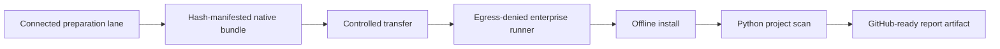
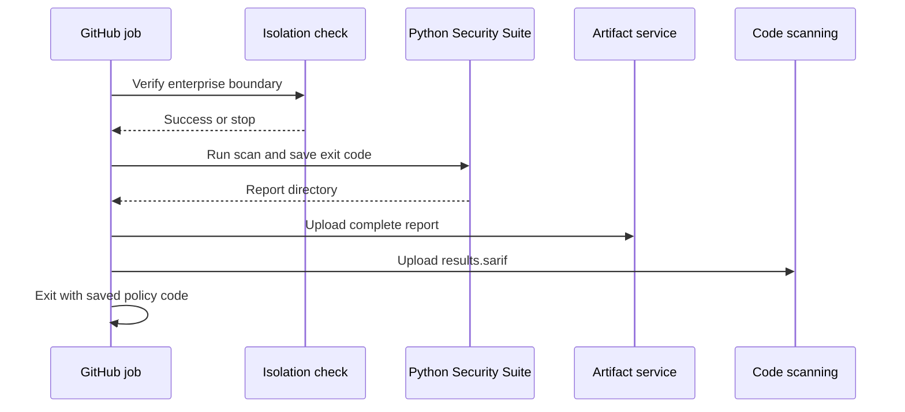

# Python Security Suite operations

Last reviewed: 2026-08-01

## Operating model

Scanner acquisition and scanner execution are separate workflows.



The native workflow does not require Docker. Docker remains an optional Linux
execution mode.

## Prerequisites

For the current native baseline:

- Windows x86-64;
- Python 3.11 with `pip` in the connected preparation lane;
- Python 3.11 with `venv` in the isolated execution lane;
- .NET 8 SDK or newer in both lanes when installing DevSkim;
- PowerShell 5.1 or later; and
- an enterprise control capable of enforcing and verifying scanner-child
  network denial.

## 1. Prepare the native bundle

Run only in an approved connected update lane:

```powershell
.\scripts\prepare-native-bundle.ps1
```

The default output is `.artifacts/native-bundle`. It contains:

- pinned top-level Bandit, Semgrep, detect-secrets, Ruff, Pylint, mypy,
  Vulture, Radon, Tach, REUSE, Flawfinder, CycloneDX Python, zizmor, ScanCode,
  `run-codeql`, PyPI attestations,
  check-wheel-contents, Twine, and suite wheels, plus their resolved
  transitive wheel set;
- the pinned Windows OSV-Scanner executable;
- pinned, checksum-verified Windows actionlint, Hadolint, Trivy, Gitleaks,
  Syft, Grype, and TruffleHog assets;
- a checksum-pinned DevSkim NuGet tool package installed from a local-only
  NuGet configuration;
- the pinned PyPI OSV advisory snapshot and a connected-lane Grype database;
  and
- `bundle-manifest.json` with the size and SHA-256 digest of every file.

Use `-Force` only to replace a previously marked bundle:

```powershell
.\scripts\prepare-native-bundle.ps1 -Force
```

The script refuses unsafe workspace and drive-root destinations.

The upstream OSV `all.zip` endpoint is a rolling database export. The script
therefore accepts only the explicitly reviewed SHA-256 snapshot embedded in
the preparation script. Updating advisory data is a governed source change:
validate every JSON record, review additions and removals, update the approved
digest, and rebuild the bundle. A checksum mismatch stops preparation.

The runtime accepts a Grype database for at most ten days from its build time,
allowing a bounded approval and transfer window. Preflight reads the database's
authoritative `db_metadata.build_timestamp`; it does not trust the later file
copy or extraction timestamp. An older or malformed database is unavailable
before execution and makes the policy result `INCOMPLETE`; refresh, rebuild,
and reapprove the native bundle instead of disabling age validation.

REUSE 6.2.0 is published as source. The connected preparation lane builds its
pinned source distribution into a wheel and places that wheel and its resolved
dependencies in the hash-manifested wheelhouse. The isolated installer never
builds it and still uses `pip --no-index`.

## 2. Transfer and inspect

Transfer the entire native bundle through the organization's approved artifact
path. The enterprise platform should add provenance, approval, malware
inspection, signing, or attestation according to local policy.

The bundled SHA-256 manifest provides integrity, not publisher identity.
Top-level tool versions are stable inputs, while transitive versions are the
resolution captured by that bundle build. Treat `bundle-manifest.json` as the
exact immutable transfer record; identical rebuilds require an
organization-maintained fully pinned constraints set or artifact mirror.

## 3. Install without package-index access

Inside the secure boundary:

```powershell
.\scripts\install-native-tools.ps1
```

The installer:

1. validates the bundle schema and Windows platform;
2. verifies every recorded bundle digest;
3. creates `.pysec-tools`;
4. installs wheels with `pip --no-index --no-compile`;
5. copies OSV-Scanner and its advisory data;
6. extracts actionlint, Hadolint, Trivy, Gitleaks, Syft, Grype, and TruffleHog
   from verified assets, installs DevSkim from the local NuGet source, and
   restores the staged Grype database;
7. writes an absolute-path native configuration with the bundled Gitleaks
   exclusions and the installed SHA-256 of every scanner entry point;
8. verifies scanner versions; and
9. records tool versions and installed packages in `native-install.json`.

The CodeQL CLI remains a separately governed asset. After staging it, set both
`auxiliary_executable` and `auxiliary_executable_sha256` in the generated
configuration. Production and release scans remain `INCOMPLETE` until that
helper binding is approved and verified.

To replace a previously marked tool directory:

```powershell
.\scripts\install-native-tools.ps1 -Force
```

## 4. Run inside the isolated boundary

After the enterprise isolation check succeeds:

```powershell
.\scripts\run-native-scan.ps1 -NetworkIsolated
```

Defaults:

| Setting | Default |
|---|---|
| Target | Repository root |
| Output | `.artifacts/native-self-scan` |
| Tool root | `.pysec-tools` |
| Profile | `standard` |

Custom paths are supported:

```powershell
.\scripts\run-native-scan.ps1 `
    -Target C:\work\service `
    -Output C:\work\service\.artifacts\security `
    -ToolRoot C:\approved\pysec-tools `
    -Profile extended `
    -NetworkIsolated
```

The Windows bundle directly installs the scanners used by `quick`, `standard`,
`extended`, `artifact`, and most of `supply-chain`. The remaining
comprehensive tools have these requirements. The expanded portfolio also
requires staged ShellCheck, Cosign, Node.js/Pyright, PSScriptAnalyzer, deptry,
diff-cover, and the isolated Checkov sidecar when their inputs are applicable:

| Tool | Native staging requirement |
|---|---|
| CodeQL | `run-codeql` is bundled; separately stage the licensed CodeQL CLI and an isolated home containing `.codeql/packages/codeql/python-queries` |
| KICS | Upstream no longer ships native release binaries. In the connected build lane, compile the pinned KICS source without Docker and transfer the executable together with the matching `assets/queries` tree; set `tools.kics.rules_path` to that tree. |
| Conftest | Binary is bundled; configure an approved local Rego directory in `tools.conftest.rules_path`. |
| Vale | Binary is bundled; stage reviewed style packages and configure the local `.vale.ini` in `tools.vale.rules_path`. |
| pipdeptree | Wheel is bundled; set `auxiliary_executable` to the Python interpreter from the already-created target runtime environment, never the scanner environment by accident. |
| CrossHair, Atheris, mutmut | Execute them in separately sandboxed trusted lanes and emit the bounded assurance schema consumed by `pysec-evidence assurance`. |
| check-manifest, ClamAV, GitHub attestations | Run build-, malware-, and host-bound verification in their appropriate companion lanes; ingest only the bounded JSON result. |
| Pysa | Linux, macOS, or WSL Python environment with approved models |
| GuardDog 3.x | Linux/macOS Python environment with its sandbox support |

Point `tools.codeql.auxiliary_executable` at the staged CodeQL binary and
`tools.codeql.database_path` at its isolated home. GuardDog is
reported not applicable on native Windows because upstream supports Windows
only through Docker, which this suite does not require. None of the supported
native paths require Docker.

Trivy is pinned to 0.69.3 because
[Aqua's March 2026 security advisory](https://github.com/aquasecurity/trivy/security/advisories/GHSA-69fq-xp46-6x23)
lists 0.69.3 and earlier as unaffected by the compromised 0.69.4-0.69.6
publication window. Any version change requires a new archive digest and
security review.

Run every configured adapter:

```powershell
.\scripts\run-native-scan.ps1 `
    -Profile comprehensive `
    -NetworkIsolated
```

Run the final distribution gate after the approved build has populated
`dist/`:

```powershell
.\scripts\run-native-scan.ps1 `
    -Profile release `
    -NetworkIsolated
```

For PyPI provenance, stage each Integrity API response as
`dist/FILENAME.provenance.json` and set
`tools.pypi-attestations.repository_url` to the exact approved GitHub or GitLab
publisher repository. Stage the approved Sigstore/TUF trust cache under
`tools.pypi-attestations.database_path`. Verification uses only local files
and disables TUF refresh.

An applicable missing asset makes the result `INCOMPLETE`. A conditional tool
with no relevant repository input is shown as `not applicable`.

### Ingest test evidence without executing the project

Run tests in a separate disposable build/test lane, not in the static scanner
boundary. Produce branch-aware coverage.py JSON and JUnit XML, then transfer
those files with the immutable checkout:

```powershell
New-Item -ItemType Directory -Force .artifacts/test-evidence | Out-Null
$env:COVERAGE_FILE = ".artifacts/test-evidence/.coverage"
python -m coverage run --branch -m pytest `
  --junitxml=.artifacts/test-evidence/junit.xml
python -m coverage json -o .artifacts/test-evidence/coverage.json
```

Configure `tools.coverage.artifacts_path`,
`tools.coverage.minimum_coverage_percent`, and `tools.junit.artifacts_path`.
The bundled `pysec-evidence` helper validates and normalizes those files using
bounded standard-library I/O and the hardened `defusedxml` parser. It never
imports the target, invokes a test runner, retains captured process output, or
expands XML entities. Missing
evidence is visibly `not applicable` outside organization policies that make
the companion test lane mandatory.

### Ingest trusted-lane assurance evidence

Hypothesis, Schemathesis, CrossHair, Atheris, mutmut, OWASP ZAP, OWASP pytm,
in-toto, reproducible-build verification, final OCI-image scanning, YARA, check-manifest, ClamAV, and
GitHub attestation verification intentionally do not execute inside the static scanner boundary.
Their companion lanes emit this bounded schema:

```json
{
  "kind": "crosshair",
  "producer": "crosshair 0.x",
  "revision": "FULL_COMMIT_SHA",
  "findings": [
    {
      "rule_id": "postcondition",
      "title": "Postcondition can fail",
      "message": "Counterexample: value=-1",
      "path": "src/package/module.py",
      "line": 42,
      "severity": "high",
      "classification": "CONTRACT-POSTCONDITION",
      "citation": "https://crosshair.readthedocs.io/en/latest/contracts.html",
      "evidence": {"counterexample": "value=-1"}
    }
  ]
}
```

Use the corresponding `kind` and configured filename. The validator caps file
size and finding count, bounds every string, permits only scalar evidence, and
does not retain raw stdout, stack traces, corpus files, malware bytes, or
credentials. Enterprise promotion policy should independently bind `revision`
and the companion report digest to the scanned revision.

Validate the complete fail-closed evidence set before scanning:

```powershell
.\scripts\validate-production-evidence.ps1 `
  -EvidenceDirectory .artifacts\test-evidence `
  -Profile production
```

Use `-Profile release` to additionally require packaging, malware,
attestation, in-toto, reproducibility, and final OCI-image evidence. The OCI
producer must scan the immutable image archive or digest with locally staged
Syft, Grype, and Trivy data and emit bounded `oci-image.json`; the suite never
pulls an image while isolated.

### Govern accepted risk

Copy `security/risk-acceptances.example.json`, add only exact normalized
fingerprints, and configure both `policy.risk_acceptance_path` and the approved
SHA-256. Every entry requires a disposition, owner, rationale, and ISO expiry
no more than 366 days away. Expired, duplicate, malformed, ID-mismatched, or
stale unmatched entries make the result `INCOMPLETE`. Governed findings remain
in `findings.json` for audit but are excluded from active SARIF, SonarQube, and
action queues.

### Import normalized findings into SonarQube

Every report includes `sonarqube-external-issues.json`. Configure
`sonar.externalIssuesReportPaths` in the self-hosted Sonar scanner to point at
that file. The
export preserves the suite rule, mapped severity/type, actionable message,
file, and line range; the complete citations and source excerpts remain in
`summary.md`, `index.html`, `findings.json`, and `results.sarif`.

ScanCode is intentionally a bounded governance inventory pass. The aggregate
scans package metadata, requirements and lockfiles, license/copying/notice
files, the root README, and conventional vendored-source roots. It excludes
generated/tool trees, copies only those inputs to a symlink-free temporary
staging directory, uses one local worker for Windows reliability, caps any
single-file analysis at 120 seconds, and emits only files with findings. A
separate full-tree ScanCode forensic or due-diligence job may still be
appropriate; on Windows it can take many minutes even for a small repository.

Omitting `-NetworkIsolated` runs an explicit diagnostic. Scanner commands still
use offline options, but the result is correctly `INCOMPLETE`.

### Production promotion scan

Use the strict profile against a full immutable checkout, not a source archive:

```powershell
.\scripts\run-native-scan.ps1 `
  -Profile production `
  -Target C:\approved\full-clone `
  -Output C:\evidence\production-security `
  -NetworkIsolated
```

The gate blocks medium-or-higher findings and reports `INCOMPLETE` when VCS
history, required scanner coverage, isolation evidence, a dependency lock,
configured deep Python data-flow analysis, or required revision-bound dynamic
and governance evidence is missing. Review
`assurance-case.md` before promotion; it identifies artifact provenance,
dynamic testing, and threat-review evidence that the source scan cannot
produce.

See the [production security gate](production-security.md) for the complete
release-evidence model.

## GitHub publication

Use [examples/github-actions.yml](../examples/github-actions.yml) as an
enterprise template. Replace every action reference with an approved immutable
commit SHA and replace the isolation placeholder with an organization-owned
boundary check.

The workflow preserves the suite exit code, publishes the Markdown summary,
uploads the complete artifact, publishes SARIF, and only then applies the
policy result.



## Exit codes

| Exit | Outcome | Meaning |
|---:|---|---|
| 0 | `PASS` | Applicable required tools completed and no findings were reported |
| 0 | `WARN` | Applicable required tools completed; only non-blocking findings remain |
| 1 | `FAIL` | At least one finding meets a blocking severity |
| 2 | `INCOMPLETE` | Isolation or required scanner evidence is incomplete |
| 3 | CLI error | Configuration, path, output-safety, or invocation error |

## Troubleshooting

### Required scanner is unavailable

Inspect `scan-manifest.json` and `evidence/<tool>.json`. For native installs,
also inspect `.pysec-tools/native-install.json`. Reinstall from the verified
bundle if an executable or offline asset is missing.

### Semgrep fails on Windows

Use the generated native configuration and current suite adapter. It supplies a
temporary `USERPROFILE` and `HOME`, disables metrics and version checks, and
points Semgrep at the bundled local rules.

### detect-secrets is slow on Windows

The adapter uses one worker to avoid excessive Windows process spawning and
passes explicit top-level scan roots so native tools and generated artifacts
are not traversed.

### OSV-Scanner reports no package sources

The project needs a supported lockfile, manifest with resolved versions, or
SBOM for useful dependency evidence. `--no-resolve` is deliberate: the scanner
must not contact package indexes during an isolated scan.

### Native bundle preparation rejects the OSV snapshot checksum

The upstream PyPI snapshot URL is mutable. A checksum failure is an expected
supply-chain control, not a reason to disable verification. Validate the new
snapshot in the connected preparation lane, update the approved SHA-256 value
passed to `prepare-native-bundle.ps1`, and review that change before transfer.

### An added tool is skipped

Check the tool's `applicable` field in `scan-manifest.json`. `false` means the
repository has no matching input, such as no GitHub workflow for zizmor or no
lockfile for CycloneDX. This does not weaken completeness.

### A deep or comprehensive scan is INCOMPLETE

Pysa requires repository configuration and models. CodeQL requires the
`run-codeql` wrapper, a pre-staged CodeQL CLI, and a local Python query pack
under `tools.codeql.database_path`. Current GuardDog requires its
upstream-supported sandbox platform. Missing relevant prerequisites are
reported as unavailable instead of silently dropping coverage.

### Artifact SBOM contains only an opaque wheel

Use the current suite adapter rather than invoking Syft directly on `dist/`.
The adapter safely expands wheel and source distributions into a bounded
temporary tree so Syft and Grype can recognize Python package metadata. The
generated `artifact-manifest.json` binds the evidence to the unexpanded
release files by SHA-256 and byte size.

### Result is INCOMPLETE although all scanners completed

Check `network_isolation_attested` in `scan-manifest.json`. A diagnostic run on
a connected host is incomplete by design. Run in a verified egress-denied
boundary and use `-NetworkIsolated`.

### Existing output cannot be overwritten

`--overwrite` only replaces an existing directory containing a valid suite
`scan-manifest.json`. Choose a new directory if the destination contains
unrelated files.

## Verification

Run unit tests:

```powershell
$env:PYTHONPATH = (Resolve-Path src).Path
python -m unittest discover -s tests -v
```

Verify the report using the digests in:

```text
.artifacts/native-self-scan/checksums.sha256
```

The installer independently verifies the native bundle before any package is
installed.

Also review `scan-manifest.json`:

- `inventory.source_sha256` must equal `source_sha256_after`;
- `inventory.source_integrity_verified` must be `true`; and
- each applicable production scanner must report
  `executable_integrity_verified: true` and `executable_unchanged: true`.

These checks detect content or entry-point substitution during the scan. They
complement, but do not replace, an enterprise read-only checkout, signed
artifact transport, and publisher/provenance verification.

For finding triage, open `index.html` first. Its prioritized table leads to a
finding card containing the exact file/range, highlighted source context,
scanner and rule, classification links, impact, and recommended action.
The decision badge and scanner-health grid provide the release-log summary;
the primary coverage-gap table contains only applicable execution gaps. Expand
the not-applicable controls beneath it when reviewing conditional coverage.
`summary.md` carries the same first 20 actionable findings into the GitHub job
summary. Secret-bearing content is deliberately absent from every format; use
the protected checkout and cited line when validating a secret finding.
Both Markdown views put the scan-policy disposition and applicable execution
gaps before conditional controls. Expand the not-applicable section during
coverage review to confirm each reason and the condition that would re-enable
the control.

Before committing runner time to a production scan, perform the same offline
readiness assessment against the target and governed configuration:

```powershell
pysec doctor . --config .pysec-tools\pysec.native.toml --profile production
```

The text view leads with `PROCEED TO ISOLATED SCAN` or `BLOCK PRE-FLIGHT`, then
shows required and applicable readiness counts. Attention items are labeled
`required`, `optional`, or `required context`, so an operator can distinguish a
hard prerequisite from a useful conditional control. The decision is preflight
only and never grants release approval. Use `--format json` to archive the same
structured decision and blocking reasons in runner diagnostics. Discovery
prunes generated artifacts, virtual environments, installed scanner trees,
build outputs, and symlinked directories before descent.

After scanning, use `pysec inspect REPORT` as the terminal and release-log entry
point. It verifies checksums first and then shows the scan-policy disposition
and reasons, applicability-aware scanner health, domain and lifecycle counts,
and the highest-priority actions with finding ID, scanner rule, owner,
location, classification, authoritative references, remediation, and a direct
link to the full HTML evidence card. Action-plan finding IDs use the same deep
links when viewed from a GitHub artifact. Use `--limit 0` for summary-only
output or `--format json` for dashboards.

## Intelligence, baseline, and Security Passport lanes

The connected preparation lane downloads the authoritative CISA KEV JSON and
FIRST EPSS CSV, receives the product-specific CycloneDX VEX from its approved
owner, validates each native format, and records SHA-256 plus acquisition time.
Transfer only those reviewed snapshots into `security-data/intelligence`.

The isolated scan rejects an unbound, stale, oversized, malformed, symlinked,
or digest-mismatched snapshot. KEV matches become `P0` and block policy even if
the originating scanner assigned a lower severity. EPSS affects priority, not
severity. VEX state is displayed but never suppresses a finding by itself.

After the isolated scan, move the complete report into an approval lane. Keep
the release private key and optional password file outside the checkout and
report. Run `pysec attest`, then move the signed passport, report, approved
public key, and approved Cosign executable into the deployment boundary. Run
`pysec verify` before promotion. Verification failure rejects the release.

At the first handoff, validate the report itself with
`pysec verify-report REPORT`. This checks every manifest entry without requiring
a signing key. `pysec verify PASSPORT --report REPORT` is the stronger detached
passport operation and expects `PASSPORT` to be a directory created by
`pysec attest`.

For environments where the approval signer is a separate service, use
`pysec attest REPORT --output PASSPORT --unsigned`, sign
`security-passport.json` externally, and populate version-compatible signature material using
the documented passport layout before final verification. `--allow-unsigned`
checks integrity only and is not a production authenticity control.
