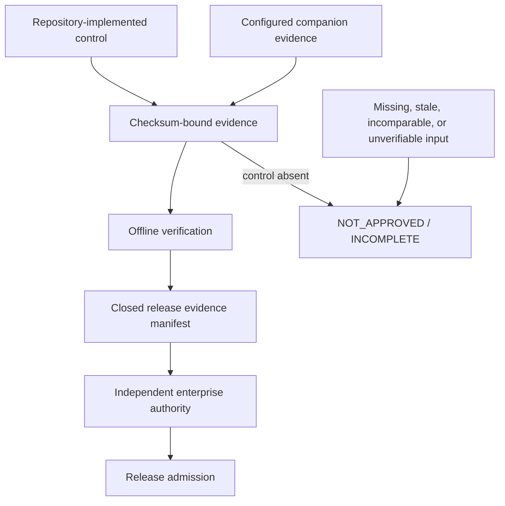

# Product enhancement matrix

Last reviewed: 2026-08-09

The latest findings-driven 79-item backlog is resolved in the
[closure register](findings-closure.md), including conditional activation and
external-authority boundaries.

This matrix closes the product backlog against implemented evidence. “External
authority” is an intentional trust boundary: the suite prepares and verifies a
bounded handoff, but an independent enterprise control must grant approval.

| # | Enhancement | Resolution | Evidence or boundary |
|---:|---|---|---|
| 1 | Exact release payload | Implemented now | `prepare-signing` inventories a closed distribution set. |
| 2 | Detect payload substitution | Implemented now | `verify-signing-request` rejects added, missing, or changed subjects. |
| 3 | Separate build, sign, and verify states | Implemented now | Promotion lifecycle exposes each state independently. |
| 4 | Provenance binding | Implemented | in-toto/SLSA evidence adapter and Passport subject verification. |
| 5 | Reproducible build comparison | Implemented | Digest-bound companion evidence adapter; build execution remains isolated. |
| 6 | Release identity | Implemented | Passport binds source, report, policy, and artifacts. |
| 7 | Failed-artifact quarantine | Policy-resolved | Promotion stays blocked; repository workflow owns storage/quarantine mechanics. |
| 8 | Organization scanner approval | Implemented | Exact entry-point catalog; only organization policy grants approval. |
| 9 | Approval handoff | Implemented now | `evidence-draft` removes digest transcription while remaining non-authoritative. |
| 10 | Expiring governance receipts | Implemented | Strict isolation, intelligence, and scanner-trust contracts. |
| 11 | Known scanner versions | Implemented now | Production rejects unknown versions; Cosign JSON version parsing added. |
| 12 | Detect executable changes | Implemented | Before/after entry-point digests fail closed. |
| 13 | Auxiliary executable trust | Implemented | CodeQL CLI and other auxiliary entry points are independently bound. |
| 14 | Repository pin versus authority | Implemented | Digest match and organization authorization are separate facts. |
| 15 | Actionable release blockers | Implemented now | Release readiness 1.2 separates causal roots from derived policy outcomes and routes owner, authority, evidence, command, and priority. |
| 16 | Remove duplicate remediation | Implemented now | Generic scan-policy work is suppressed when specific controls exist; semantically equivalent finding actions are consolidated while retaining every finding and artifact evidence subject. |
| 17 | Promotion state machine | Implemented now | `promotion-plan` exposes seven lifecycle stages. |
| 18 | Profile-specific gates | Implemented | Quick, comprehensive, production, and release profiles. |
| 19 | Independent verification receipt | Implemented | Report, inspection, signing-request, and Passport verification receipts. |
| 20 | Acceptance expiry | Implemented | Digest-bound risk-acceptance ledger with expiry and owner. |
| 21 | Labeled detection corpus | Implemented | Bounded offline corpus and confusion-matrix evaluation. |
| 22 | Perspective-specific effectiveness | Implemented now | Positive, negative, tool-count, named-tool, and per-tool minimum gates. |
| 23 | Mutation evidence | Implemented | Optional `mutmut` companion adapter. |
| 24 | Parser fuzzing | Implemented | Bounded parsing plus generative/fuzz-oriented tests. |
| 25 | Adapter contract tests | Implemented | Shared runtime hardening and scanner-specific fixtures. |
| 26 | Governed risk acceptance | Implemented | Exact fingerprint, scope, owner, reason, expiry, and digest. |
| 27 | Duplicate correlation | Implemented | Normalized fingerprints retain every contributing source. |
| 28 | Risk thresholds | Implemented | Severity, confidence, quality, coverage, reachability, and release controls. |
| 29 | Comparable finding baseline | Implemented now | Profile/tool-set mismatch or unverified production VCS ancestry yields `unclassified`, never false “new.” `baseline-candidate` prepares the exact approval handoff. |
| 30 | Artifact baseline | Implemented | Artifact findings and identities participate in sealed delta evidence. |
| 31 | Portfolio trend | Implemented now | `trend` compares 2-100 distinct, checksum-verified reports; long-term storage remains external. |
| 32 | Regression gates | Implemented | New blocking findings and reachability regressions fail policy. |
| 33 | Dynamic test evidence | Conditional | Digest-bound DAST evidence adapter activates when input is configured. |
| 34 | Runtime scanner evidence | Conditional | ZAP/other approved outputs can enter through strict companion contracts. |
| 35 | Threat-model evidence | Conditional | Threat-model input activates the domain without inventing results. |
| 36 | Distribution inspection | Implemented | Wheel, sdist, metadata, attestation, signature, SBOM, and identity adapters. |
| 37 | Dependency hygiene | Implemented | deptry, OSV, Grype, Trivy, CycloneDX, Syft, licenses, and malicious-package signals. |
| 38 | One governed decision | Implemented | `release-check` aggregates all required evidence fail closed. |
| 39 | Artifact relationship graph | Implemented now | Promotion plan links source, report, SBOM, Passport, and distributions. |
| 40 | Evidence-quality scoring | Implemented now | Ten actionability and traceability dimensions are measured. |
| 41 | GitHub-native outputs | Implemented now | Summary Markdown, standalone promotion HTML, SARIF, SonarQube, JSON, and artifacts. |
| 42 | Precise remediation | Implemented | Finding cards cite tool/rule/classification/file/line/context and actions. |
| 43 | Audience-specific views | Implemented now | Executive, developer, security, release, and auditor summaries. |
| 44 | Accessible offline report | Implemented | Self-contained HTML plus readable Markdown; no remote assets. |
| 45 | Side-by-side change evidence | Implemented | Finding and reachability delta documents retain state transitions. |
| 46 | Safe caching | Resolved by design | Security evidence is recomputed; no stale scanner cache can satisfy a gate. |
| 47 | Parallel scheduling | Implemented | Bounded orchestration concurrency and private per-tool execution directories. |
| 48 | Resume after interruption | Resolved by design | Partial evidence is incomplete; rerun the exact candidate for a coherent seal. |
| 49 | Adapter SDK | Implemented | Common adapter base, normalized model, diagnostics, fixtures, and schemas. |
| 50 | Reliability reporting | Implemented now | Status, version, integrity, changed entry point, duration, limitations, and sealed longitudinal deltas. |
| 51 | Cross-platform validation | Implemented | Native Windows path plus Linux CI examples; applicability is explicit. |
| 52 | Retention and audit | Implemented now | Promotion plan assigns retention classes; enterprise storage enforces them. |
| 53 | Causal blocker model | Implemented now | Root and derived blockers plus explicit graph edges prevent duplicated work. |
| 54 | Grouped trust review | Implemented now | Governance drafts group shared executable digests while retaining every tool and role. |
| 55 | Closed release evidence set | Implemented now | `release-manifest` rejects digest mismatches and evidence bound to another report. |
| 56 | Human promotion artifact | Implemented now | Markdown and standalone HTML views prioritize decision, lifecycle, and ownership. |
| 57 | Self-authorization prevention | Enforced boundary | Every candidate and aggregate states `authoritative: false`; signing, organization approval, and admission remain external. |
| 58 | One-command evidence pipeline | Implemented now | `evidence-pack` composes decision, lifecycle, audience, annotation, manifest, and audit outputs. |
| 59 | Atomic multi-file publication | Implemented now | Private sibling staging is fully verified before a single directory rename; failed builds publish nothing. |
| 60 | Closed artifact-directory integrity | Implemented now | Relative file records, `checksums.sha256`, `COMPLETE`, and the pack-manifest digest detect missing, added, changed, or partial content. |
| 61 | Relocatable independent verification | Implemented now | `verify-evidence-pack` rechecks the closed set and embedded report archive without trusting original absolute paths. |
| 62 | Safe pack replacement | Implemented now | `--overwrite` first verifies the existing pack and restores it if publication fails. |
| 63 | Policy simulation | Implemented | `policy-simulate` previews severity, confidence, required-tool, and finding-count gates without mutating evidence. |
| 64 | Configuration provenance | Implemented | Value-redacted origin and digest records explain every effective setting and selected control. |
| 65 | Disclosure workflow | Implemented | `SECURITY.md` defines private reporting, response expectations, and supported-version handling. |
| 66 | Suite threat model | Implemented | Assets, boundaries, abuse cases, controls, and residual ownership are explicit and reviewed. |
| 67 | Project bootstrap | Implemented now | `init` atomically creates valid library, API, CLI, worker, or monorepo configurations with safe next steps. |
| 68 | Explainable scan preflight | Implemented now | Doctor schema 1.1 and Markdown/text views provide ordered reasons, actions, identities, and overwrite-safe artifact export. |
| 69 | Root-cause preflight triage | Implemented now | Equivalent prerequisite remediation is consolidated into resolution batches while per-control reasons remain available in JSON and expandable Markdown evidence. |
| 70 | Relocatable scanner bundle | Implemented now | `[paths] bundle_root` and traversal-safe `@bundle/...` references remove machine-specific paths from native configurations. |
| 71 | Offline provisioning workflow | Implemented now | `provision-plan` emits non-mutating text, strict JSON, or GitHub-ready Markdown with root-cause batches and safe argv. |
| 72 | Multi-axis admission cards | Implemented now | Reports and `admission-decisions.json` separate source, tests, dependencies, artifacts, and governance without weakening the aggregate gate. |
| 73 | Adapter conformance command | Implemented now | `adapter-check` emits a strict offline receipt for all 63 registry and SDK contracts without executing scanners. |
| 74 | Hardened CI generator | Implemented now | `generate-ci` requires immutable action pins and produces a no-install, least-privilege, fail-closed workflow for pre-provisioned isolated runners. |
| 75 | Safe local developer hooks | Implemented now | `generate-hooks` emits local adapter/readiness diagnostics without installing dependencies, forwarding source paths, executing scanners, or claiming production isolation. |
| 76 | Scanner bundle qualification | Implemented now | `qualify-bundle` joins all 63 adapter contracts with profile applicability, assets, exact executable identities, required readiness, and organization-approval state. |
| 77 | Configuration validation and migration guidance | Implemented now | `config-check` emits a tolerant, strict receipt for valid, invalid, or unsupported configuration; inventories portable paths and refuses unsafe automatic semantic migration. |
| 78 | Closed offline scanner bundle | Implemented now | `verify-native-bundle` rejects undeclared, missing, changed, linked, unsafe, or malformed content and can require no-index resolution of every declared Python environment. |
| 79 | Behavioral scanner qualification | Implemented now | Bundle qualification 1.1 binds approved labeled-corpus evidence and its verified report, requires current unchanged scanner digests to match the measured run, and enforces fail-closed minimums while keeping execution a separate event. |
| 80 | Decision-safe portfolio grades | Implemented now | Portfolio health 1.1 separates execution completion, observed risk, evidence completeness, and release disposition so a green execution score cannot conceal findings or authority gaps. |
| 81 | Conditional-control activation recipes | Implemented now | Every N/A control receives a deterministic category, accountable owner, activation trigger, concrete action, required closure evidence, and reference in JSON, Markdown, and HTML. |
| 82 | Reproducible native-bundle closure | Implemented now | Connected preparation validates the rolling OSV archive structurally and semantically, inventories hidden files, uses the correct pinned Actionlint asset, and produced a 5,779-file/274-wheel schema-2 bundle that resolved all four environments with no index. |
| 83 | Nonexistent clean-fixture defense | Implemented now | New reports seal an exact source-file inventory; effectiveness evaluation refuses path-based clean labels absent from that digest-bound, unchanged snapshot. |
| 84 | Multi-scanner behavioral qualification | Implemented now | The reviewed detection corpus passed 7 positive and 3 negative labels across Bandit, Semgrep, and detect-secrets, and qualification matched all three measured executable digests to the current bundle. |

## Closure model

The suite intentionally does not store private signing keys, enforce its own
network boundary, approve its own scanners or intelligence, or publish a
release. Those separations prevent repository compromise from minting its own
production authorization.
