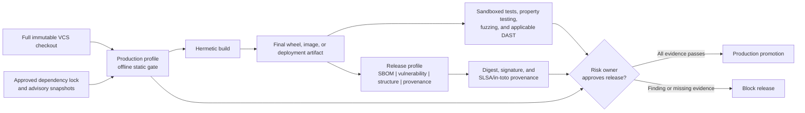

# Production security gate

Last reviewed: 2026-08-21

## Purpose

The `production` profile is the strict source-security gate for code proposed
for release. It selects the complete source/repository portfolio, blocks
medium-or-higher findings, and fails closed when required scanner or
release-context evidence is missing. The `release` profile adds the built
distribution controls and requires a wheel or source distribution.

It does not claim that a scanner can prove software safe. NIST SSDF treats
secure release as a lifecycle practice, OWASP ASVS includes controls that need
runtime verification, and SLSA distinguishes source review from trustworthy
artifact provenance.

## Repository continuous verification

The repository runs a connected GitHub validation lane on every push and pull
request. It complements the isolated production gate without claiming that a
hosted runner is the production isolation boundary:

- the locked test environment runs on Python 3.11, 3.12, and 3.13;
- an explicit Ruff baseline covers correctness, async hazards, common bugs,
  broad exception handling, and Bandit-derived security rules;
- zizmor audits every GitHub workflow with its pedantic ruleset;
- mypy checks production source and the Pages audit hooks;
- `pip-audit` evaluates a hash-pinned export of the complete locked dependency
  graph while excluding only the unpublished local project itself;
- distributions are built from the locked checkout; and
- CodeQL runs the Python `security-extended` query suite and uploads SARIF to
  GitHub code scanning.

Secret-bearing findings cross an additional fail-closed boundary before
correlation or derived analysis: scanner-controlled titles, descriptions,
messages, remediation, rule labels, non-taxonomy citations, snippets, and
non-allowlisted evidence are discarded. Reports retain only normalized
location, lifecycle, verification, history, ownership, and redaction metadata;
they never retain the candidate value.

Every third-party action is commit-SHA pinned, checkout credentials are not
persisted, jobs use explicit least-privilege permissions and timeouts, and
concurrency cancels superseded work. Dependabot covers GitHub Actions, the root
Python lock, and the separately hashed documentation environment with a
seven-day version-update cooldown. Security updates are not a replacement for
the locked dependency audit.

## Release flow



Run the native profile inside an independently enforced egress-denied boundary:

```powershell
.\scripts\run-native-scan.ps1 `
  -Profile production `
  -Target C:\approved\full-clone `
  -Output C:\evidence\security-report `
  -NetworkIsolated
```

Before promotion, verify that the generated manifest records:

- matching target before/after SHA-256 values;
- `source_integrity_verified: true`;
- approved and unchanged scanner entry points; and
- both an approved `run-codeql` entry point and CodeQL CLI helper when CodeQL
  is applicable.

“Approved” means the exact digest originated in separate organization policy
or its digest-bound trust catalog. A matching repository-configured hash is
valuable integrity evidence, but cannot authorize its own scanner.

The suite fails closed when these integrity claims are absent in production or
release profiles. The enterprise runner should still mount the checkout
read-only where possible; change detection is evidence, not access control.

After the approved build has produced `dist/`, run the `release` profile
against the same immutable checkout. Stage each PyPI Integrity API provenance
object as `dist/FILENAME.provenance.json` and configure the expected Trusted
Publisher repository URL.

Promotion requires `PASS`, not merely zero findings. An `INCOMPLETE` result
means a required scanner, full history, dependency lock, data-flow
configuration, or isolation assertion was missing.

## Governed promotion decision

After Passport verification, retain its JSON receipt outside the sealed report
and aggregate every release control:

```powershell
pysec verify release-passport --report release-scan `
  --artifact-root C:\release\payload --public-key C:\trust\release.pub `
  --cosign-executable C:\approved\cosign.exe `
  --cosign-sha256 APPROVED_COSIGN_SHA256 --format json `
  --output passport-verification.json

pysec release-check release-scan --format json `
  --passport-verification passport-verification.json `
  --passport-verification-sha256 PASSPORT_RECEIPT_SHA256 `
  --require-passport --output release-readiness.json
```

`release-check` verifies the report seal, then fails closed on policy, blocking
findings, assurance claims, operational gaps, external isolation, scanner
entry-point trust, intelligence approval, and any required effectiveness or
Passport evidence. See [Governed release readiness](release-readiness.md).

## Coverage and residual risk

| Layer | Suite coverage | Required production companion |
|---|---|---|
| Python source and structure | Bandit, Semgrep, Ruff, Pylint, mypy, Pyright, deptry, Vulture, Radon, Tach, reachability, Pysa, CodeQL through `run-codeql` | Review configured dynamic roots, unreachable-island candidates, sensitive business logic, authorization, and intentional architecture changes |
| Secrets | detect-secrets, Gitleaks, and TruffleHog | Full history, rotation workflow, and secret-manager controls |
| Sensitive-data disclosure | Semgrep taint/configuration rules, organization Pysa/CodeQL models, Graphify, reachability, and SDK/sink inventory | Logging, telemetry, request-body, URL-query, client-error, and automatic-PII minimization; approved transforms, third-party boundaries, retention, and synthetic-canary verification |
| Dependencies | OSV-Scanner, GuardDog, CycloneDX | Governed lock updates, advisory freshness SLA, and dependency-owner review |
| CI, IaC, deployment | zizmor, actionlint, Hadolint, Checkov, Trivy, PSScriptAnalyzer, and ShellCheck | Scan the exact deployment definitions, scripts, generated plans, and final container/image |
| License and component origin | ScanCode, Trivy, and opt-in REUSE metadata compliance | Legal policy and exceptions |
| Test evidence | Passive coverage.py, diff-cover, and JUnit ingestion | Execute unit, integration, property, and fuzz tests in disposable companion lanes and bind their reports to the same revision |
| Built artifact | `release`: Syft, Grype, wheel-content checks, Twine, offline PyPI attestation verification, and Cosign | Source-to-build reproducibility and organization release signature |
| Final OCI image | Bounded `oci-image` findings and digest evidence | Scan the immutable image archive with staged Syft, Grype, and Trivy databases; never pull during the isolated gate |
| Repository governance | Validated OpenSSF Scorecard JSON | Generate the JSON in a separately authorized connected lane and bind it to the scanned revision |
| Runtime behavior | Hypothesis and Schemathesis JUnit plus Atheris, mutmut, and ZAP evidence are normalized; target behavior is deliberately not executed by the scanner | Sandboxed unit/integration, abuse-case, fuzz, API, and DAST execution |
| Design risk | OWASP pytm threats are normalized when a model exists | Human threat-model and architecture review plus time-bounded risk acceptance |

The generated `assurance-case.md` records these boundaries for each run. Its
next action is computed from actual applicability, completion, attached
companion evidence, and active findings, so a passing coverage or deep-analysis
lane is retained rather than incorrectly requested again.

## Implemented additions and companion controls

The following offline controls are now implemented:

1. **Syft plus Grype** for a second artifact SBOM/vulnerability view. The
   native preparation lane stages the Grype database and the isolated adapter
   disables automatic updates.
2. **TruffleHog** with verification and update checks disabled. Raw credential
   material is never retained in normalized findings or evidence.
3. **`check-wheel-contents`, maintained-source SHA-256 parity, and `twine check --strict`** for promoted Python
   distributions.
4. **PyPI attestations** using a local distribution, local provenance object,
   expected Trusted Publisher repository, and `--offline`.
5. **CodeQL through `run-codeql`** with a pre-staged CodeQL CLI and query pack.
   The adapter refuses auto-download, disables repository runner overrides,
   and scans a temporary source mirror. It does not use the wrapper's
   `--no-fail` option because that option can also suppress analysis errors;
   a finding exit is accepted only when the expected Python SARIF exists.
6. **Pylint, Radon, Ruff formatting, and REUSE** for independently attributed
   correctness, complexity, consistency, and file-license metadata evidence.
7. **Passive coverage.py and JUnit ingestion** for bounded, sanitized test
   evidence without running target code in the scanner boundary.
8. **PSScriptAnalyzer and ShellCheck** for repository automation safety.
9. **deptry, Pyright, and diff-cover** for dependency contracts, independent
   typing, and changed-line coverage.
10. **Checkov** with all remote downloads disabled for deep IaC policy, and
    **Cosign** for staged release signature and identity verification.
11. **OpenSSF Scorecard evidence ingestion**. Collection remains in the
    connected governance lane; only bounded JSON crosses into the scanner.

The following project-owned controls now have first-class evidence adapters but
still execute in dynamic or connected companion stages:

1. **Hypothesis** for security invariants and edge cases, and **Atheris** for
   coverage-guided fuzzing of parsers, serializers, and native extensions.
2. **Schemathesis** for OpenAPI/GraphQL property and stateful testing, plus
   **OWASP ZAP** where an isolated deployed web application is available.
3. **OWASP pytm** for model-as-code threats, **in-toto** for authorized build
   steps, reproducible-build comparison, and **YARA** for local organization
   malware rules.

Production now fails closed without completed Hypothesis, CrossHair, Atheris,
mutmut, pytm, and Scorecard evidence. Release additionally requires
check-manifest, ClamAV, GitHub attestation, in-toto, reproducibility, YARA,
final OCI-image evidence, and offline PyPI attestation verification.

Dynamic tools execute application behavior and must use disposable test
credentials, synthetic data, resource limits, and a network policy appropriate
to the test target.

## Promotion evidence

Bind the following to one immutable release digest:

- suite report and verified `checksums.sha256`;
- normalized findings and recorded dispositions;
- CycloneDX or SPDX SBOM;
- vulnerability-database versions and freshness timestamps;
- unit, integration, property, fuzz, and applicable DAST results;
- final artifact scan results;
- signed provenance and builder identity;
- threat-model review and accepted risks with owner and expiry.

## Primary references

- [NIST SP 800-218 Secure Software Development Framework](https://csrc.nist.gov/pubs/sp/800/218/final)
- [OWASP Application Security Verification Standard](https://owasp.org/www-project-application-security-verification-standard/)
- [SLSA build levels](https://slsa.dev/spec/v1.0/levels)
- [PyPI digital attestations](https://docs.pypi.org/attestations/)
- [Syft](https://github.com/anchore/syft)
- [pip-audit security model](https://github.com/pypa/pip-audit)
- [Hypothesis](https://hypothesis.readthedocs.io/)
- [Atheris](https://github.com/google/atheris)
- [Schemathesis](https://schemathesis.readthedocs.io/)
- [OWASP ZAP Automation Framework](https://www.zaproxy.org/docs/automate/automation-framework/)
