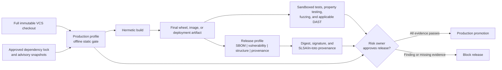

# Production security gate

Last reviewed: 2026-08-21

## Purpose

The `production` profile is the strict source-security gate for code proposed
for release. It selects the complete source/repository portfolio, blocks
medium-or-higher findings, and fails closed when required scanner or
release-context evidence is missing. The `release` profile adds the built
distribution controls and requires a wheel or source distribution.

It does not claim that a scanner can prove software safe. NIST SSDF treats
secure release as a lifecycle practice, OWASP ASVS includes controls that need
runtime verification, and SLSA distinguishes source review from trustworthy
artifact provenance.

## Repository continuous verification

The repository runs a connected GitHub validation lane on every push and pull
request. It complements the isolated production gate without claiming that a
hosted runner is the production isolation boundary:

The containment matrix now executes real platform-boundary canaries on all
three hosted operating systems: a default-deny Bubblewrap mount/PID/IPC/network
namespace on Linux, a default-deny Seatbelt profile on macOS, and a
zero-capability AppContainer process on Windows. The Windows lane reads the
launched process token to prove AppContainer membership and zero capabilities,
then proves denial of multiple host-file canaries and loopback network access;
Job Object resource controls remain a separate availability mechanism.

- the locked test environment runs on Python 3.11, 3.12, and 3.13;
- an explicit Ruff baseline covers correctness, async hazards, common bugs,
  broad exception handling, and Bandit-derived security rules;
- zizmor audits every GitHub workflow with its pedantic ruleset;
- mypy checks production source and the Pages audit hooks;
- `pip-audit` evaluates platform-resolved, hash-pinned exports of both the
  scanner and companion locked dependency graphs on Linux, Windows, and macOS
  with Python 3.11 and 3.13, excluding only the unpublished local projects;
- distributions are built from the locked checkout; and
- CodeQL runs the Python `security-extended` query suite and uploads SARIF to
  GitHub code scanning.

Secret-bearing findings cross an additional fail-closed boundary before
correlation or derived analysis: scanner-controlled titles, descriptions,
messages, remediation, rule labels, non-taxonomy citations, snippets, and
non-allowlisted evidence are discarded. Reports retain only normalized
location, lifecycle, verification, history, ownership, and redaction metadata;
they never retain the candidate value.

Every third-party action is commit-SHA pinned, checkout credentials are not
persisted, jobs use explicit least-privilege permissions and timeouts, and
concurrency cancels superseded work. Dependabot covers GitHub Actions, the root
Python lock, the companion runtime lock, and the separately hashed documentation environment with a
seven-day version-update cooldown. Security updates are not a replacement for
the locked dependency audit.

## Release flow



Run the native profile inside an independently enforced egress-denied boundary:

```powershell
.\scripts\run-native-scan.ps1 `
  -Profile production `
  -Target C:\approved\full-clone `
  -Output C:\evidence\security-report `
  -NetworkIsolated
```

Before promotion, verify that the generated manifest records:

- matching target before/after SHA-256 values;
- `source_integrity_verified: true`;
- approved and unchanged scanner entry points; and
- both an approved `run-codeql` entry point and CodeQL CLI helper when CodeQL
  is applicable.

“Approved” means the exact digest originated in separate organization policy
or its digest-bound trust catalog. A matching repository-configured hash is
valuable integrity evidence, but cannot authorize its own scanner.

The suite fails closed when these integrity claims are absent in production or
release profiles. The enterprise runner should still mount the checkout
read-only where possible; change detection is evidence, not access control.
Each scan first copies the exact regular-file inventory into a private read-only
snapshot and runs every analyzer against that copy. Exact size and SHA-256 are
checked while copying, the snapshot is rehashed before the decision, and the
verified revision is materialized through a hook-free Git bundle/clone inside
the read-only snapshot so history and diff scanners retain exact history. Any
source symlink is counted and makes source integrity incomplete instead of
being silently omitted. Scanner rules and offline databases are independently
digest-sealed before and after execution. The original checkout is rehashed
afterward. Any race or mutation makes the result
`INCOMPLETE`; analyzers never combine pre-change and post-change files.

After the approved build has produced `dist/`, run the `release` profile
against the same immutable checkout. Stage each PyPI Integrity API provenance
object as `dist/FILENAME.provenance.json` and configure the expected Trusted
Publisher repository URL.

Promotion requires `PASS`, not merely zero findings. An `INCOMPLETE` result
means a required scanner, full history, dependency lock, data-flow
configuration, or isolation assertion was missing.

## Governed promotion decision

After Passport verification, retain its JSON receipt outside the sealed report
and aggregate every release control:

```powershell
pysec verify release-passport --report release-scan `
  --artifact-root C:\release\payload --public-key C:\trust\release.pub `
  --cosign-executable C:\approved\cosign.exe `
  --cosign-sha256 APPROVED_COSIGN_SHA256 --format json `
  --output passport-verification.json

pysec release-check release-scan --format json `
  --passport-verification passport-verification.json `
  --passport-verification-sha256 PASSPORT_RECEIPT_SHA256 `
  --require-passport --output release-readiness.json
```

`release-check` verifies the report seal, then fails closed on policy, blocking
findings, assurance claims, operational gaps, external isolation, scanner
entry-point trust, intelligence approval, and any required effectiveness or
Passport evidence. See [Governed release readiness](release-readiness.md).

## Coverage and residual risk

| Layer | Suite coverage | Required production companion |
|---|---|---|
| Python source and structure | Bandit, Semgrep, Ruff, Pylint, mypy, Pyright, deptry, Vulture, Radon, Tach, reachability, Pysa, CodeQL through `run-codeql` | Review configured dynamic roots, unreachable-island candidates, sensitive business logic, authorization, and intentional architecture changes |
| Secrets | detect-secrets, Gitleaks, and TruffleHog | Full history, rotation workflow, and secret-manager controls |
| Sensitive-data disclosure | Semgrep taint/configuration rules, organization Pysa/CodeQL models, Graphify, reachability, and SDK/sink inventory | Logging, telemetry, request-body, URL-query, client-error, and automatic-PII minimization; approved transforms, third-party boundaries, retention, and synthetic-canary verification |
| Dependencies | OSV-Scanner, GuardDog, CycloneDX | Governed lock updates, advisory freshness SLA, dependency-owner review, and a raw-output-bound OSV receipt naming and hashing every covered manifest |
| CI, IaC, deployment | zizmor, actionlint, Hadolint, Checkov, Trivy, PSScriptAnalyzer, ShellCheck, Kubescape, read-only Prowler, and redacted cloud attack-path evidence | Scan the exact deployment definitions, live cloud/cluster inventory, identity/network paths, drift, scripts, generated plans, and final container/image |
| License and component origin | ScanCode, Trivy, and opt-in REUSE metadata compliance | Legal policy and exceptions |
| Test evidence | Passive coverage.py, diff-cover, and JUnit ingestion | Execute unit, integration, property, and fuzz tests in disposable companion lanes and bind their reports to the same revision |
| Built artifact | `release`: Syft, Grype, wheel-content checks, Twine, offline PyPI attestation verification, and Cosign | Source-to-build reproducibility and organization release signature |
| Final OCI image | Bounded `oci-image` findings and digest evidence | Scan the immutable image archive with staged Syft, Grype, and Trivy databases; never pull during the isolated gate |
| Repository governance | Validated OpenSSF Scorecard JSON | Generate the JSON in a separately authorized connected lane and bind it to the scanned revision |
| Runtime behavior | Hypothesis and Schemathesis JUnit plus Atheris, ClusterFuzzLite, Fuzz Introspector, ZAP, Nuclei, self-hosted OAST, RESTler, browser, authorization, protocol contracts, IAST, Falco, RASP, native-sanitizer, MobSF, TLS, and connected secret-verification evidence are normalized; target behavior is deliberately not executed by the scanner | Sandboxed multi-role/state/replay/concurrency abuse cases, fuzz-depth analysis, API/GraphQL state machines, authenticated and out-of-band DAST, non-HTTP fault cases, instrumentation-health, runtime-rule, prevention, mobile, transport, and provider-verification canaries |
| Design risk | OWASP pytm threats are normalized when a model exists | Human threat-model and architecture review plus time-bounded risk acceptance |

The generated `assurance-case.md` records these boundaries for each run. Its
next action is computed from actual applicability, completion, attached
companion evidence, and active findings, so a passing coverage or deep-analysis
lane is retained rather than incorrectly requested again.

## Implemented additions and companion controls

The following offline controls are now implemented:

1. **Syft plus Grype** for a second artifact SBOM/vulnerability view. The
   native preparation lane stages the Grype database and the isolated adapter
   disables automatic updates.
2. **TruffleHog** with verification and update checks disabled. Raw credential
   material is never retained in normalized findings or evidence.
3. **`check-wheel-contents`, maintained-source SHA-256 parity, and `twine check --strict`** for promoted Python
   distributions.
4. **PyPI attestations** using a local distribution, local provenance object,
   expected Trusted Publisher repository, and `--offline`.
5. **CodeQL through `run-codeql`** with a pre-staged CodeQL CLI and query pack.
   The adapter refuses auto-download, disables repository runner overrides,
   and scans a temporary source mirror. It does not use the wrapper's
   `--no-fail` option because that option can also suppress analysis errors;
   a finding exit is accepted only when the expected Python SARIF exists.
6. **Pylint, Radon, Ruff formatting, and REUSE** for independently attributed
   correctness, complexity, consistency, and file-license metadata evidence.
7. **Passive coverage.py and JUnit ingestion** for bounded, sanitized test
   evidence without running target code in the scanner boundary.
8. **PSScriptAnalyzer and ShellCheck** for repository automation safety.
9. **deptry, Pyright, and diff-cover** for dependency contracts, independent
   typing, and changed-line coverage.
10. **Checkov** with all remote downloads disabled for deep IaC policy, and
    **Cosign** for staged release signature and identity verification.
11. **OpenSSF Scorecard evidence ingestion**. Collection remains in the
    connected governance lane; only bounded JSON crosses into the scanner.

The following project-owned controls now have first-class evidence adapters but
still execute in dynamic or connected companion stages:

1. **Hypothesis** for security invariants and edge cases, and **Atheris** for
   coverage-guided fuzzing of parsers, serializers, and native extensions.
2. **Schemathesis** for OpenAPI/GraphQL property and stateful testing, plus
   **OWASP ZAP** where an isolated deployed web application is available.
3. **OWASP pytm** for model-as-code threats, **in-toto** for authorized build
   steps, reproducible-build comparison, and **YARA** for local organization
   malware rules.
4. **Nuclei, Prowler, Falco, Kubescape, RASP, native sanitizers, MobSF,
   an approved TLS scanner, and language-specific CodeQL/Semgrep packs** for independent DAST,
   deployed posture and drift, workload behavior, prevention, memory safety,
   mobile, transport, and polyglot evidence.
5. **Multi-role authorization contracts** for explicit BOLA/IDOR and tenant
   boundaries plus state transitions, replay resistance, concurrency limits,
   and approval ceilings. Contract schema 3.0 reads every durable postcondition
   through a quorum of separately credentialed, deployment-identified observers
   on distinct network origins. It requires explicit process-restart and replica-
   failover triggers and verifies their durable invariants through every observer.
   Each observer response is independently Ed25519-signed and binds its pinned
   host, organization, request, observation ID, state, recovery epoch, and
   fencing token. Every observation is bound to the raw run-context digest,
   run/deployment/challenge, recovery event, and trusted scan-time window and is
   atomically consumed through `PYSEC_AUTHORIZATION_ORACLE_REPLAY_STATE_PATH`;
   the quorum identity is deployment-pinned through
   `PYSEC_AUTHORIZATION_ORACLE_QUORUM_SHA256`, and credentials cannot be shared.
   Restart and failover trigger responses must
   also carry an Ed25519 receipt under the deployment-pinned
   `PYSEC_AUTHORIZATION_ORCHESTRATOR_KEY_PATH` key, with distinct before/after
   instance identities, recovery epoch, fencing-token digest, and event ID;
   schema 2.0 records these resilience, independent-oracle, and durable-
   postcondition checks as skipped. These complement, but cannot infer, human-
   reviewed business rules and approval intent.
6. **Self-hosted OAST, RESTler, gRPC/WebSocket/TCP contracts, Fuzz
   Introspector, cloud attack-path correlation, and redacted provider secret
   receipts** for blind callbacks, stateful APIs, non-HTTP faults, harness
   quality, composed cloud exposure, and live credential status.

Production now fails closed without completed Hypothesis, CrossHair, Atheris,
mutmut, pytm, and Scorecard evidence. Release additionally requires
check-manifest, ClamAV, GitHub attestation, in-toto, reproducibility, YARA,
final OCI-image evidence, and offline PyPI attestation verification.
Applicable web, OpenAPI/protocol, authorization-contract, fuzz-target, cloud,
secret-verification, container, Kubernetes, native, mobile, TLS, and non-Python
shapes additionally require their corresponding v2 runtime evidence; absence
is `INCOMPLETE`, not a clean pass.

Dynamic tools execute application behavior and must use disposable test
credentials, synthetic data, resource limits, and a network policy appropriate
to the test target.
The CI integration lane exercises actual default-deny Bubblewrap on Linux and
`sandbox-exec` on macOS; Windows separately exercises a token-inspected,
zero-capability AppContainer plus Job Object assignment and limits. The active
boundary probe checks TCP and UDP over IPv4 and IPv6, a non-loopback host
interface, Unix-domain and raw sockets, host IPC, parent-process visibility,
the host device namespace, ambient proxy removal, target-root/nested/link
immutability, and private scratch access. Host IPC is a separate named
shared-memory canary rather than an alias for Unix sockets. The child also
introspects Linux `NoNewPrivs`, effective capabilities, and seccomp state or
Windows DEP, ASLR, dynamic-code, and child-process mitigation policy; missing
required policy fails the boundary proof.
Governed profiles require an externally enforced file-write quota in addition
to local CPU, memory, process, descriptor, output, and POSIX file-size limits.
Their bounded outputs use companion-assurance v2 and are rejected unless fresh,
complete, canary-verified, source-bound, and authenticated by a SHA-pinned
Ed25519 DSSE/in-toto producer identity.

Production assurance evidence additionally requires an exact checkpointed
assurance profile. Profile metadata is inserted before source binding, and the
normalized result records a governed digest over the evidence, source, and
profile digests so profile substitution or detachment changes the admitted
identity. Deep qualification uses RFC 3161 time, lifecycle-bound independent
authorities, and consume-once replay protection; use the central HTTPS/mTLS
replay-service mode whenever more than one runner can admit the same receipt.
Every derived publication artifact is looked up in a closed schema registry.
Unknown filenames fail publication, normalized suite artifacts use
artifact-specific bounded schemas, and companion v2 evidence must satisfy its
strict contract before checksums are sealed.
Cross-language results carry canonical digest-bound boundary and flow ledgers,
exact file/line/language membership, and a second-engine reproduction receipt;
both engines' ledger digests must match while their engine and query-pack
identities must differ.
Checkov, pipdeptree, and git-sizer outputs are normalized into suite-owned,
additional-properties-closed contracts.

Production and release decisions always require schema-2.0 labeled-corpus
effectiveness evidence with a distinct training digest, an exact holdout-label
digest, a lifecycle-valid quorum from at least two trusted organizations, at
least 25 labels, 10 positive labels, 10 negative labels, two tools, and five
labels for each required tool. CWE, language, parser, boundary, severity, and
mutation diversity minimums are enforced, and every required tool needs both
positive and negative cases. Omitting CLI flags cannot disable this gate.
`security-requirements-coverage.json` records pinned ASVS 5.0.0, MASVS 2.1.0,
and TCASVS 5.0.0 catalog metadata and mapped evidence. Full completion requires
both the threshold-signed applicability policy and a separate threshold-signed
assessment named by `PYSEC_REQUIREMENTS_ASSESSMENT_PATH`. The assessment must
match exact, canonical requirement-ID snapshots pinned outside the evidence by
`PYSEC_REQUIREMENTS_CATALOG_SHA256`; every applicable pass or fail carries an
assessor, trusted assessment time, exact procedure ID, artifact SHA-256, JSON
Pointer, operator, expected value, observation time, polarity, and pinned
producer identity. The suite replays those assertions and derives
the result. A separately deployment-pinned requirements evidence policy limits
the artifact names, methods, operators, and minimum assertions acceptable for
every requirement. It must be independently authorized through an Ed25519
envelope under `PYSEC_REQUIREMENTS_EVIDENCE_POLICY_AUTHORITY`, and passing
assessments must use `artifact-value-replay-v1`, satisfy bounded evidence-age
rules, and include the policy's minimum positive and negative-control
assertions; an existence-only check cannot pass. Every assertion also binds a
retained procedure-execution record containing the pinned command, fixture,
mutation, argv/environment/runtime/assets/sandbox identities, exit code,
stdout/stderr digests, timestamps, and result digest. A policy-approved
execution authority signs the whole record, and mutation operators link
negative controls to their parent fixture.
Positive and negative controls must come from distinct executions. Artifact
names or catalog counts alone cannot establish conformance.

Deployment-pinned runtime traces retain their complete signed subject and
portable authority receipt. Admission re-verifies the embedded Ed25519
envelope, collector/build/instrumentation identities, 100% sampling claim,
static-edge digests, allow-and-deny behavior, timestamps, and an explicit
required-route matrix; every top-level trace and coverage field must equal the
signed evidence. Sandbox, raw-evidence custody, and requirements-policy
artifacts retain the same portable proof material for later verification.

Native binary parsing runs in a resource-contained isolated worker, with an
optional deployment-pinned OS sandbox prefix. PE, ELF, and Mach-O analysis
retains import/symbol and hardening state; WebAssembly analysis validates
bounded sections and records import, memory-limit/shared-memory, and start
function controls. Tree-sitter grammars provide AST-bound import and call
extraction for supported non-Python source and retain the exact package version
and parser-module digest. Governed polyglot admission additionally requires
separately authorized compiler-frontend evidence, bound to each complete
language file set (including Python), with complete symbol, CFG, dataflow, and
interprocedural edge ledgers rather than aggregate counts alone. Publication
recomputes each file-set, semantic-ledger, and graph digest before re-verifying
the retained authority receipt.
Templates record computed includes and explicit escaping
bypasses, while notebooks and bytecode are parsed without executing target
code. Git history qualification rejects shallow, partial, promisor, sparse,
alternate, replace-ref, unreachable, or corrupt stores; it supports and binds
both SHA-1 and SHA-256 object formats and rechecks the complete ref/object
ledger after bundle creation and materialization. Production and release
require SHA-256 Git objects, a pinned Git verifier and security configuration,
lifecycle-valid signers from at least two approved organizations, a good
signature on every reachable commit and tag, and a signed manifest of the full
ref/object/configuration state. `source-inventory.json` retains that manifest,
its portable authority receipt, the exact allowed-signers bytes, lifecycle
policy, and the observed commit/tag signer ledger for clean-host replay.

Encrypted native evidence requires an authority-signed hardware-KMS envelope
receipt binding the exact scan challenge and command request, plaintext object
and ephemeral data-key digests, non-exportable
wrapping-key and hardware assertions, wrapped-key digest, operation ID, store,
and retention policy. The signed receipt and its portable authority envelope
are retained with the ciphertext commitment. The KMS operation must pass
through its digest-pinned launcher and preserve an mTLS/TLS 1.3 transcript,
endpoint allowlist, peer identity, and launcher identity that publication
revalidates offline.

## Promotion evidence

Bind the following to one immutable release digest:

- suite report and verified `checksums.sha256`;
- normalized findings and recorded dispositions;
- CycloneDX or SPDX SBOM;
- vulnerability-database versions and freshness timestamps;
- unit, integration, property, fuzz, and applicable DAST results;
- final artifact scan results;
- signed provenance and builder identity;
- threat-model review and accepted risks with owner and expiry.

## Primary references

- [NIST SP 800-218 Secure Software Development Framework](https://csrc.nist.gov/pubs/sp/800/218/final)
- [OWASP Application Security Verification Standard](https://owasp.org/www-project-application-security-verification-standard/)
- [SLSA build levels](https://slsa.dev/spec/v1.0/levels)
- [PyPI digital attestations](https://docs.pypi.org/attestations/)
- [Syft](https://github.com/anchore/syft)
- [pip-audit security model](https://github.com/pypa/pip-audit)
- [Hypothesis](https://hypothesis.readthedocs.io/)
- [Atheris](https://github.com/google/atheris)
- [Schemathesis](https://schemathesis.readthedocs.io/)
- [OWASP ZAP Automation Framework](https://www.zaproxy.org/docs/automate/automation-framework/)
