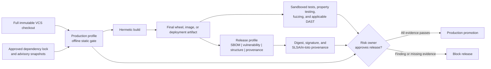

# Production security gate

Last reviewed: 2026-07-23

## Purpose

The `production` profile is the strict source-security gate for code proposed
for release. It selects the complete source/repository portfolio, blocks
medium-or-higher findings, and fails closed when required scanner or
release-context evidence is missing. The `release` profile adds the built
distribution controls and requires a wheel or source distribution.

It does not claim that a scanner can prove software safe. NIST SSDF treats
secure release as a lifecycle practice, OWASP ASVS includes controls that need
runtime verification, and SLSA distinguishes source review from trustworthy
artifact provenance.

## Release flow



Run the native profile inside an independently enforced egress-denied boundary:

```powershell
.\scripts\run-native-scan.ps1 `
  -Profile production `
  -Target C:\approved\full-clone `
  -Output C:\evidence\security-report `
  -NetworkIsolated
```

After the approved build has produced `dist/`, run the `release` profile
against the same immutable checkout. Stage each PyPI Integrity API provenance
object as `dist/FILENAME.provenance.json` and configure the expected Trusted
Publisher repository URL.

Promotion requires `PASS`, not merely zero findings. An `INCOMPLETE` result
means a required scanner, full history, dependency lock, data-flow
configuration, or isolation assertion was missing.

## Coverage and residual risk

| Layer | Suite coverage | Required production companion |
|---|---|---|
| Python source | Bandit, Semgrep, Ruff, Pysa, CodeQL through `run-codeql` | Security review of sensitive business logic and authorization |
| Secrets | detect-secrets, Gitleaks, and TruffleHog | Full history, rotation workflow, and secret-manager controls |
| Dependencies | OSV-Scanner, GuardDog, CycloneDX | Governed lock updates, advisory freshness SLA, and dependency-owner review |
| CI, IaC, deployment | zizmor and Trivy | Scan the exact deployment definitions and final container/image |
| License and component origin | ScanCode and Trivy | Legal policy and exceptions |
| Built artifact | `release`: Syft, Grype, wheel-content checks, Twine, and offline PyPI attestation verification | Source-to-build reproducibility and organization release signature |
| Runtime behavior | Deliberately not executed | Sandboxed unit/integration, abuse-case, fuzz, API, and DAST evidence |
| Design risk | Not automatable | Threat model, architecture review, and time-bounded risk acceptance |

The generated `assurance-case.md` records these boundaries for each run.

## Implemented additions and companion controls

The following offline controls are now implemented:

1. **Syft plus Grype** for a second artifact SBOM/vulnerability view. The
   native preparation lane stages the Grype database and the isolated adapter
   disables automatic updates.
2. **TruffleHog** with verification and update checks disabled. Raw credential
   material is never retained in normalized findings or evidence.
3. **`check-wheel-contents` and `twine check --strict`** for promoted Python
   distributions.
4. **PyPI attestations** using a local distribution, local provenance object,
   expected Trusted Publisher repository, and `--offline`.
5. **CodeQL through `run-codeql`** with a pre-staged CodeQL CLI and query pack.
   The adapter refuses auto-download, disables repository runner overrides,
   and scans a temporary source mirror. It does not use the wrapper's
   `--no-fail` option because that option can also suppress analysis errors;
   a finding exit is accepted only when the expected Python SARIF exists.

The remaining controls are project-owned dynamic or connected stages:

1. **Hypothesis** for security invariants and edge cases, and **Atheris** for
   coverage-guided fuzzing of parsers, serializers, and native extensions.
2. **Schemathesis** for OpenAPI/GraphQL property and stateful testing, plus
   **OWASP ZAP** where an isolated deployed web application is available.
3. **OpenSSF Scorecard** in a separate connected governance lane for repository
   posture. It is intentionally excluded from the air-gapped source scan
   because many checks depend on hosting-provider metadata.

Dynamic tools execute application behavior and must use disposable test
credentials, synthetic data, resource limits, and a network policy appropriate
to the test target.

## Promotion evidence

Bind the following to one immutable release digest:

- suite report and verified `checksums.sha256`;
- normalized findings and recorded dispositions;
- CycloneDX or SPDX SBOM;
- vulnerability-database versions and freshness timestamps;
- unit, integration, property, fuzz, and applicable DAST results;
- final artifact scan results;
- signed provenance and builder identity;
- threat-model review and accepted risks with owner and expiry.

## Primary references

- [NIST SP 800-218 Secure Software Development Framework](https://csrc.nist.gov/pubs/sp/800/218/final)
- [OWASP Application Security Verification Standard](https://owasp.org/www-project-application-security-verification-standard/)
- [SLSA build levels](https://slsa.dev/spec/v1.0/levels)
- [PyPI digital attestations](https://docs.pypi.org/attestations/)
- [Syft](https://github.com/anchore/syft)
- [pip-audit security model](https://github.com/pypa/pip-audit)
- [Hypothesis](https://hypothesis.readthedocs.io/)
- [Atheris](https://github.com/google/atheris)
- [Schemathesis](https://schemathesis.readthedocs.io/)
- [OWASP ZAP Automation Framework](https://www.zaproxy.org/docs/automate/automation-framework/)
