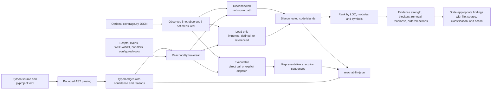

# Python reachability and code islands

Last reviewed: 2026-08-06

The `reachability` scanner maps production Python modules and symbols from
application entry points without importing or executing target code. It complements
Vulture's individual dead-code findings, Radon's complexity measurements, and
Tach's declared module boundaries.

## What it provides

- Discovers roots from `[project.scripts]`, `[project.gui-scripts]`, arbitrary
  `[project.entry-points.*]` groups, Poetry scripts, `__main__.py`, guarded Python
  mains, configured roots, common decorated framework handlers, and WSGI/ASGI
  `application` modules.
- Parses target source with Python's AST and builds bounded import, definition,
  reference, direct-call, constructor-lifecycle, class-member,
  framework-configuration, registration-dispatch, polymorphic-dispatch,
  ownership, literal-dynamic-import, and package-initialization edges.
- Resolves concrete local and imported instances, including chained constructor
  calls, so `Worker().run()` and `worker.run()` reach the correct implementation.
- Prunes statically false and `TYPE_CHECKING` branches from the runtime graph.
- Follows literal internal dynamic imports without treating them as unresolved
  reflection. Non-literal imports remain an explicit confidence qualification.
- Assigns every node one of three explicit states: `executable`, `load-only`, or
  `disconnected`; every assignment records its predecessor, edge kind, reason,
  and confidence.
- Assigns confidence per island, with explicit factors for static-path strength,
  runtime corroboration, and unresolved dynamic behavior; a global confidence
  value never silently overstates an individual candidate.
- Traces representative direct-call and bounded dispatch sequences from each
  entry point.
- Groups disconnected modules and connected load-only symbol subgraphs into code
  islands without claiming that load-only code is dead.
- Ranks islands by physical source lines, module count, and symbol count.
- Gives every island a triage priority, evidence strength, removal-readiness
  state, blocking factors, and ordered next actions.
- Optionally correlates bounded coverage.py JSON so reviewers can distinguish
  statically reachable code that was observed, not observed, or not measured.
- Emits normalized, cited findings only when an island meets the configured size
  threshold. The complete graph and all candidates remain in `reachability.json`.



## Entry-point discovery

Automatic discovery is conservative. Framework handlers are recognized through
common decorators such as `route`, `get`, `post`, `command`, `task`, `receiver`,
and `subscribe`. WSGI and ASGI modules that assign `application` are roots.
Recognized Django configuration follows `DJANGO_SETTINGS_MODULE`,
`ROOT_URLCONF`, `WSGI_APPLICATION`, and `ASGI_APPLICATION`; common registration
calls such as `path`, `re_path`, `register`, and `connect` create explicit
medium-confidence dispatch edges. Applications using reflection, dependency
injection, generated registries, custom decorators, or data-driven plugin loading
must declare those roots:

```toml
[tools.reachability]
enabled = true
executable = "pysec"
timeout_seconds = 600
minimum_island_loc = 100
discover_framework_roots = true
entry_points = [
  "acme.plugins:load_plugins",
  "acme.public:Client",
]
source_roots = ["src"]
coverage_path = ".artifacts/test-evidence/coverage.json"
```

Each entry uses `module:function`, `module:Class`, or a module name. Organization
policy can require roots and source scopes. Repository configuration cannot remove
organization-required roots, disable required framework discovery, or raise the
organization's reporting threshold.

For direct inspection without a full portfolio scan:

```powershell
pysec reachability . --minimum-island-loc 100 --pretty
```

To add runtime corroboration from a separately generated test lane:

```powershell
pysec reachability . --coverage .artifacts/test-evidence/coverage.json --pretty
```

Both commands write schema `1.2` JSON to standard output and perform no network
operations. The analyzer reads coverage evidence but never runs tests itself.

## Reachability states

| State | Evidence required | Interpretation | Default action |
|---|---|---|---|
| `executable` | Entry point, direct call, constructor lifecycle, bounded callback reference, recognized framework hook or registration, or bounded polymorphic dispatch | A static execution path exists; medium-confidence dispatch edges remain clearly labeled | Review the representative sequence and edge explanations |
| `load-only` | Import, definition, member creation, or reference, with no executable path | The code is available at runtime but invocation is unproven | Confirm callbacks/plugins and coverage before removal |
| `disconnected` | No load or executable path from any discovered root | Strongest unused-island candidate, subject to dynamic-language caveats | Validate missing roots, then test and remove or explicitly retain |

An observed `load-only` or `disconnected` node is reported as a static/runtime
model gap, not dead code. It may be a test-only path, indirect dispatch, or missing
production root. The distinction preserves runtime evidence without silently
promoting every imported symbol to executable.

## Reading the artifact

`reachability.json` contains:

| Section | Meaning |
|---|---|
| `analysis` | Mode, three-state model, confidence, completeness, limits, graph digest, coverage binding, and target-execution statement |
| `scope` | Inferred source roots and analyzed Python volume |
| `summary` | Executable, load-only, disconnected, runtime-observed, entry-point, edge, and island counts |
| `entry_points` | Every root, its discovery source, declaration, file, and line |
| `representative_sequences` | Bounded paths showing how roots reach internal behavior |
| `islands` | All disconnected components, including candidates below the finding threshold, with candidate-specific confidence and its factors |
| `nodes` / `edges` | Machine-readable graph with node state, runtime observation, predecessor explanation, typed edge, confidence, reason, and source location |
| `dynamic_features` | Observed wildcard imports, dynamic imports, `eval`, `exec`, or bounded polymorphic dispatch |
| `precision_features` | Applied precision controls such as constructor lifecycle, typed receivers, static-branch pruning, literal import resolution, and framework configuration/registration tracing |
| `warnings` / `errors` | Confidence qualifications and incomplete-analysis conditions |

Each island's `triage` object provides:

- `priority`: which model gaps or large disconnected candidates to inspect first;
- `evidence_strength`: static-only, static plus non-observation, or a
  static/runtime conflict;
- `removal_readiness`: whether removal is blocked, needs manual validation, or is
  a candidate after validation;
- `blocking_factors` and `recommended_actions`: ordered, report-ready review work.

Large islands become standard findings with the `PYREACH` classification family.
Only disconnected candidates cite
[CWE-561](https://cwe.mitre.org/data/definitions/561.html); load-only candidates
do not assert dead code. Runtime-observed static candidates are informational
model-gap findings. Findings include
the tool, native rule, confidence, affected files, source excerpts, component size,
symbols, citations, impact, and a concrete next action.

## Limits and confidence

Static reachability is an approximation. Python reflection, monkey patching,
dependency injection, generated modules, native extensions, externally loaded
plugins, and data-driven dispatch can create runtime paths that are not visible in
an AST. The analyzer therefore:

- never labels a candidate as proven runtime-dead;
- treats `__new__` and `__init__` as executable when their class is constructed;
- resolves methods on locally constructed, imported, assigned, and directly
  chained instances when the concrete class is statically known;
- prunes `TYPE_CHECKING`, `if False`, and the unreachable arm of `if True`;
- resolves literal internal `importlib.import_module()` and `__import__()` targets
  as high-confidence load edges while retaining non-literal calls as caveats;
- uses medium-confidence, bounded method-name dispatch only when multiple internal
  implementations make an unresolved receiver plausibly polymorphic;
- recognizes `ast.NodeVisitor` hooks as framework dispatch and exposes the exact
  convention on the edge;
- lowers confidence when unresolved dynamic loading, execution, wildcard import,
  or polymorphic dispatch is observed;
- disables island conclusions when no root resolves;
- turns parse, scope, duplicate-module, and resource-limit gaps into actionable
  medium-severity findings;
- includes every caveat in the sealed report artifact.

Treat an island as a review candidate. Confirm registrations and deployment entry
points, add missing roots, rerun, then remove code with regression tests. Runtime
coverage is corroboration: observation proves a path ran in that test lane, while
non-observation alone never proves production deadness.

## Resource and trust boundaries

The analyzer is bundled with the suite and invoked through the `pysec` entry point,
so the existing executable digest and post-execution integrity controls apply. It
does not need Docker, network access, a database, or target dependencies. Parsing
is bounded to 20,000 files, 5 MiB per file, 250 MiB of Python source, 50,000 graph
nodes, 50,000 graph edges, 64 MiB of coverage JSON, and five million executed-line
observations. Entry points and displayed sequences are separately
bounded; exceeding a conclusion-affecting limit produces incomplete-analysis
evidence instead of a silent partial conclusion.
