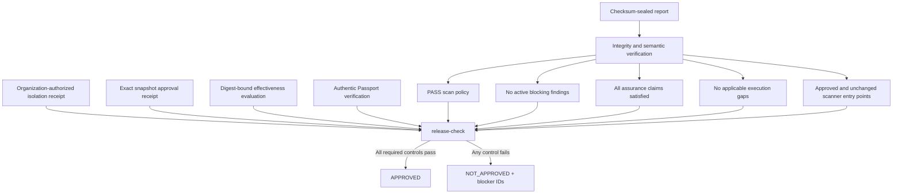

# Governed release readiness

Last reviewed: 2026-08-07

`pysec release-check` produces one fail-closed promotion decision from sealed,
digest-bound evidence. It is intended for an enterprise admission job after the
scan and build lanes finish. It does not deploy, sign, contact a network, or
replace the organization's human or policy-engine authorization.

## Decision model



The output names every control, status, reason, and evidence reference. Exit
code `0` means `approved`; exit code `1` means a valid decision with failed
controls; exit code `3` means invalid or unverifiable input.

## Evidence authority

The external controller must enforce egress denial and verify its signed policy
evidence. The suite consumes the resulting bounded JSON; it does not create the
boundary. For production/release, put the path and SHA-256 in organization
policy:

```toml
[isolation]
require_attestation = true
require_evidence = true
evidence_path = "security-data/isolation-attestation.json"
evidence_sha256 = "<approved-sha256>"

[intelligence]
require_approval = true
approval_path = "security-data/intelligence/approval.json"
approval_sha256 = "<approved-sha256>"
```

The isolation document uses exactly these fields:

```json
{
  "schema_version": "1.0",
  "status": "enforced",
  "network_policy": "deny",
  "target": "repository-name",
  "source_sha256": "<exact-scan-source-sha256>",
  "issuer": "enterprise-runner-controller",
  "runner_id": "runner-17",
  "policy_id": "egress-deny-v3",
  "policy_sha256": "<policy-sha256>",
  "approved_by": "platform-security",
  "valid_from": "2026-08-07T00:00:00Z",
  "valid_until": "2026-08-08T00:00:00Z",
  "signature_verified": true,
  "verifier": "enterprise-attestation-verifier",
  "trust_root_sha256": "<trust-root-sha256>"
}
```

The intelligence approval has exact `kind`/`sha256` entries for every snapshot
consumed, plus `manifest_id`, `revision`, `approved_by`, `valid_until`,
`signature_verified`, `verifier`, and `trust_root_sha256`. Added, removed, or
changed snapshots invalidate it. Repository-only bindings may be structurally
valid, but the receipts expose `organization_approved: false` and cannot satisfy
the release gate.

## CI usage

```powershell
pysec benchmark report --corpus effectiveness-corpus.json `
  --corpus-sha256 CORPUS_SHA256 --format json `
  --output effectiveness-evaluation.json

pysec verify passport --report report --artifact-root payload `
  --public-key release.pub --cosign-executable cosign `
  --cosign-sha256 COSIGN_SHA256 --format json `
  --output passport-verification.json

pysec release-check report --format json `
  --effectiveness-evaluation effectiveness-evaluation.json `
  --effectiveness-sha256 EVALUATION_SHA256 `
  --minimum-effectiveness-labels 25 `
  --passport-verification passport-verification.json `
  --passport-verification-sha256 PASSPORT_RECEIPT_SHA256 `
  --require-passport --output release-readiness.json
```

Publish `release-readiness.json` beside—never inside—the sealed report. Export
strict offline contracts with:

```text
pysec schema isolation-attestation-1.0
pysec schema intelligence-approval-1.0
pysec schema release-readiness-1.0
pysec schema reachability-delta-1.0
```

The minimum label count prevents a trivially small benchmark from satisfying a
production control. The evaluation and Passport receipts require their exact
SHA-256, and the evaluation must bind to the same report seal. A `release`
profile report always requires an authentic approved Passport, even when
`--require-passport` is omitted; the flag lets stricter source gates require it
for other profiles too.
