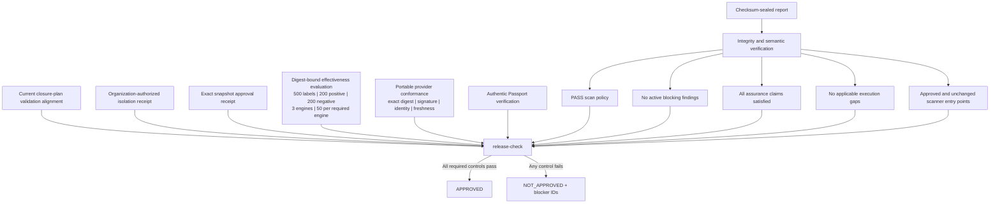

# Governed release readiness

Last reviewed: 2026-08-30

`pysec release-check` produces one fail-closed promotion decision from sealed,
digest-bound evidence. It is intended for an enterprise admission job after the
scan and build lanes finish. It does not deploy, sign, contact a network, or
replace the organization's human or policy-engine authorization.

## Decision model



The 1.3 output names every control, status, reason, evidence reference, owner,
authority boundary, priority, and safe next command. Exit
code `0` means `approved`; exit code `1` means a valid decision with failed
controls; exit code `3` means invalid or unverifiable input.

## Evidence authority

The external controller must enforce egress denial and verify its signed policy
evidence. The suite consumes the resulting bounded JSON; it does not create the
boundary. For production/release, put the path and SHA-256 in organization
policy:

```toml
[isolation]
require_attestation = true
require_evidence = true
evidence_path = "security-data/isolation-attestation.json"
evidence_sha256 = "<approved-sha256>"

[intelligence]
require_approval = true
approval_path = "security-data/intelligence/approval.json"
approval_sha256 = "<approved-sha256>"
```

The isolation document uses exactly these fields:

```json
{
  "schema_version": "1.0",
  "status": "enforced",
  "network_policy": "deny",
  "target": "repository-name",
  "source_sha256": "<exact-scan-source-sha256>",
  "issuer": "enterprise-runner-controller",
  "runner_id": "runner-17",
  "policy_id": "egress-deny-v3",
  "policy_sha256": "<policy-sha256>",
  "approved_by": "platform-security",
  "valid_from": "2026-08-07T00:00:00Z",
  "valid_until": "2026-08-08T00:00:00Z",
  "signature_verified": true,
  "verifier": "enterprise-attestation-verifier",
  "trust_root_sha256": "<trust-root-sha256>"
}
```

The intelligence approval has exact `kind`/`sha256` entries for every snapshot
consumed, plus `manifest_id`, `revision`, `approved_by`, `valid_until`,
`signature_verified`, `verifier`, and `trust_root_sha256`. Added, removed, or
changed snapshots invalidate it. Repository-only bindings may be structurally
valid, but the receipts expose `organization_approved: false` and cannot satisfy
the release gate.

The same rule applies to scanner digests. A repository pin proves that the
observed executable matched a requested digest; only an identical pin supplied
by organization policy, or an organization-policy-bound trust catalog, sets
`executable_organization_approved: true`.

Generate the review handoff without granting authority:

```text
pysec evidence-draft report --format json \
  --output governance-evidence-draft.json
```

The draft binds the sealed report, source, observed scanner entry points,
consumed intelligence, isolation target, and unsigned artifact identities. Its
contract forces `status: candidate` and `authoritative: false`; validators never
accept it as isolation, intelligence, scanner, signing, or release approval.

## Promotion and controlled signing handoffs

`promotion-plan` consolidates the verified report, its sealed closure plan, and
optional digest-bound release and trend decisions into one non-authoritative
operating view:

```text
pysec promotion-plan report --release-readiness release-readiness.json \
  --release-readiness-sha256 READINESS_SHA256 \
  --operational-trend operational-trend.json \
  --operational-trend-sha256 TREND_SHA256 --format json \
  --output promotion-plan.json

pysec promotion-plan report --format markdown --output promotion-plan.md
pysec promotion-plan report --format html --output promotion-plan.html
pysec baseline-candidate report --format json --output baseline-candidate.json
pysec trend previous-report report --format json --output operational-trend.json
pysec trend previous-report report --format markdown --output operational-trend.md
```

It shows built/scanned/reviewed/signed/verified/approved/published lifecycle
states, claim prerequisites and owners, evidence-quality dimensions, scanner
health limitations, conditional domain activation, artifact relationships,
retention classes, audience-specific summaries, and ordered next actions.
Schema 1.2 also cross-references closure-plan 1.2 validation items with the
trend's new, resolved, unchanged, transitioned, anomalous, and owner-history
signals. The trend must identify the promoted report as its latest sealed
snapshot. Current debt and blocking regressions become causal promotion
blockers; missing history remains explicit and makes no longitudinal claim.
Equivalent finding work is grouped without losing any finding or artifact
reference. Markdown and HTML actions expose priority, owner, authority, SLA
target, evidence subjects, and safely encoded suggested commands. The plan
cannot approve or publish a release.

Alias-equivalent OSV, Grype, and other advisory observations are consolidated
under the stable evidence-fusion advisory ID. The resulting release action
retains every native finding ID while inheriting the fused P0-P4 priority,
CODEOWNERS route, affected import paths, and focused direct or transitive tests.
Missing ownership, test mapping, or coverage remains explicit evidence—not an
implicit pass.

The `change-validation-alignment` control requires closure-plan 1.2 evidence.
It also requires retained diff-coverage scope so an empty closure queue can be
distinguished from an unassessed change set. It fails closed when either input
is absent or any changed file still has
failing, incomplete, unobserved, unavailable, or changed-line coverage-mismatched
validation. Each causal remediation action retains the closure item's
CODEOWNER-derived owner, priority, exact test and source references, and required
post-change rescan. A broad module-coverage hotspot for the same file is folded
into that item rather than presented as duplicate work.
Any omitted change-impact detail is itself a P1 validation gap; bounded output
therefore cannot turn an unassessed large change into an approval.

Release remediation preserves each file as an exact closure subject but groups
operational actions only when blocker, owner, priority, authority, action, and
commands match. `validation_remediation_groups` measures rendered release work;
`validation_remediation_subjects` measures the underlying closure items. Stable
group IDs are derived from sorted closure IDs, and bounded evidence retains all
closure references before source paths and shared artifacts.

After build and scan, create an exact-set handoff for the controlled signer:

```text
pysec prepare-signing report dist --output signing-request.json
pysec verify-signing-request signing-request.json dist \
  --request-sha256 REQUEST_SHA256 --format json \
  --output signing-request-verification.json
```

The verifier rejects any added, missing, or changed wheel, sdist, or zip. The
request contains no key material and never claims signer authority; signing and
publisher identity verification remain in the independent signing lane.

## CI usage

```powershell
pysec benchmark report --corpus effectiveness-corpus.json `
  --corpus-sha256 CORPUS_SHA256 --format json `
  --output effectiveness-evaluation.json

pysec verify passport --report report --artifact-root payload `
  --public-key release.pub --cosign-executable cosign `
  --cosign-sha256 COSIGN_SHA256 --format json `
  --output passport-verification.json

pysec release-check report --format json `
  --effectiveness-evaluation effectiveness-evaluation.json `
  --effectiveness-sha256 EVALUATION_SHA256 `
  --minimum-effectiveness-labels 500 `
  --minimum-effectiveness-positive-labels 200 `
  --minimum-effectiveness-negative-labels 200 `
  --minimum-effectiveness-tools 3 `
  --minimum-effectiveness-labels-per-tool 50 `
  --required-effectiveness-tool bandit `
  --required-effectiveness-tool codeql `
  --required-effectiveness-tool semgrep `
  --passport-verification passport-verification.json `
  --passport-verification-sha256 PASSPORT_RECEIPT_SHA256 `
  --require-passport `
  --provider-conformance provider-conformance.json `
  --provider-conformance-sha256 PROVIDER_RECEIPT_SHA256 `
  --required-provider-id provider-generic-hsm `
  --maximum-provider-conformance-age-hours 168 `
  --require-provider-conformance --output release-readiness.json
```

The closed-admission workflow checks out and verifies the exact producer commit,
requires the producer run's head SHA, ref, workflow name, event, and successful
conclusion to match operator-approved inputs, and executes behind the
`release-admission` GitHub Environment. Configure that environment with required
reviewers and deployment-branch restrictions; an unprotected environment is not
an independent approval boundary.

Publish `release-readiness.json` beside—never inside—the sealed report. Export
strict offline contracts with:

```text
pysec schema isolation-attestation-1.0
pysec schema intelligence-approval-1.0
pysec schema release-readiness-1.0
pysec schema release-readiness-1.1
pysec schema release-readiness-1.2
pysec schema release-readiness-1.3
pysec schema reachability-delta-1.0
pysec schema governance-evidence-draft-1.0
pysec schema promotion-plan-1.2
pysec schema signing-request-1.0
pysec schema signing-request-verification-1.0
pysec schema baseline-candidate-1.0
pysec schema operational-trend-1.1
pysec schema operational-trend-1.3
pysec schema release-evidence-manifest-1.0
```

The total, positive, negative, named-tool, and per-tool minimums prevent a
trivially small or single-perspective benchmark from satisfying a production
control. The evaluation and Passport receipts require their exact
SHA-256, and the evaluation must bind to the same report seal. A `release`
profile report always requires an authentic approved Passport, even when
`--require-passport` is omitted; the flag lets stricter source gates require it
for other profiles too.
