# Static risk-route synthesis

Last reviewed: 2026-08-13

`risk-paths.json` turns several separate observations into one bounded review
route: a declared Python entry point, Graphify file relationships, a normalized
finding or review-worthy sensitive-data sink, runtime/reachability state,
coverage and focused-test evidence, related findings, dependency-advisory
importers, and CODEOWNERS-derived ownership.

The artifact answers a practical triage question: **where can a reviewer start,
what files connect that start to the target, who owns it, and what validation is
still missing?** It deliberately does not claim attacker-controlled input,
vulnerable-function reachability, exploitability, or actual data leakage.

## Evidence flow

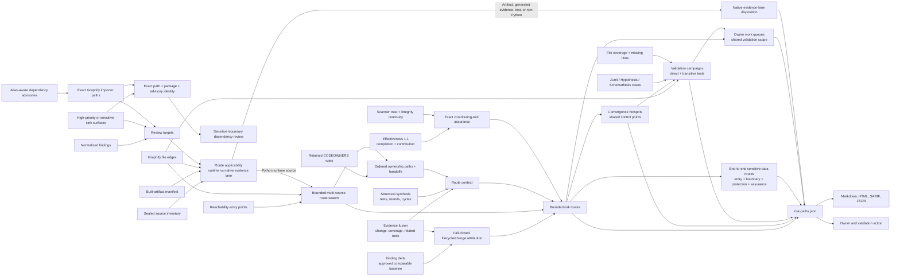

## Route contract

Each retained route includes:

- a stable route ID and P0-P4 priority inherited from the finding or sink review
  priority;
- the exact declared entry point and a maximum eight-hop file sequence;
- a bounded matrix of every other declared entry point with its own stable
  exposure ID, exact file/edge sequence, entry kind, and explicit omissions;
- the Graphify relation for every step;
- target tool, rule/classification, file, and line attribution;
- a route-applicability record joining Graphify membership, sealed source
  inventory membership, built-artifact identity, target kind, scanner, area,
  and path class;
- reachability state and retained runtime observation;
- changed-line, line/file coverage, graph-selected tests, focused execution,
  alignment gaps, an explicit aligned/gap/partial/not-assessed state, and the
  next validation action;
- owners, related findings/tools, structural risk IDs, advisory identity, and
  supporting artifact names; and
- exact contributing-tool completion, evidence lane, normalized/unique yield,
  primary and helper integrity/continuity, organization approval, and
  independent-perspective posture;
- comparable-baseline lifecycle joined to exact changed-line, validation,
  declared-entry runtime, and scanner-assurance context; and
- ordered CODEOWNERS assignments, exact cross-owner handoffs, unowned segments,
  collaborating owners, and target-owner alignment; and
- an explicit recommended action.

Exposure findings additionally retain a stable end-to-end sensitive-data route
record. The record preserves whether evidence is scanner-confirmed or an
inventory-only review surface and joins sink family, SDK, data classes, trust
boundary, protection state, every retained entry point, exact entry-node runtime
counts, route files, validation, scanner assurance, lifecycle, and ownership.

Routes are also cross-referenced with one another. A convergence hotspot is a
file traversed by at least two routes leading to at least two distinct targets.
It is classified as a shared transit point, target concentration, or mixed
control point. The hotspot consolidates route/target IDs, scanners, owners,
validation states, mapped tests, evidence artifacts, and one shared action.
Entry-point files are excluded from this calculation so a universal CLI root
does not become a low-value hotspot by definition.

Owner work queues collect exact route and hotspot IDs with P0-P4 and
aligned/gap/partial/not-assessed counts plus the exact shared validation
campaign IDs. A route can appear in multiple queues
when ownership overlaps; this preserves accountability rather than selecting an
arbitrary owner. These groups coordinate work and tests but do not merge or
inflate the underlying scanner findings.

## Scanner evidence assurance

Every routed and unrouted target joins its exact contributing tools to
`effectiveness.json` 1.1. The join keeps four questions separate:

- did the contributing scanner complete;
- was its primary executable—and any required helper—integrity-verified and
  unchanged during the run;
- did the organization approve those exact entry-point bindings; and
- is the conclusion independently corroborated, multi-tool, single-tool, or
  suite-derived?

The route emits `assured`, `perspective-gap`, `trust-gap`, `execution-gap`,
`not-assessed`, or `derived-analysis`. Tool records retain evidence lane,
normalized and unique contribution, completion, integrity, continuity, and
approval without collapsing them into a confidence score. An unapproved tool
does not make its finding false, and an approved tool does not make a finding
correct. A suite-derived sink correlation is never counted as an independent
scanner perspective.

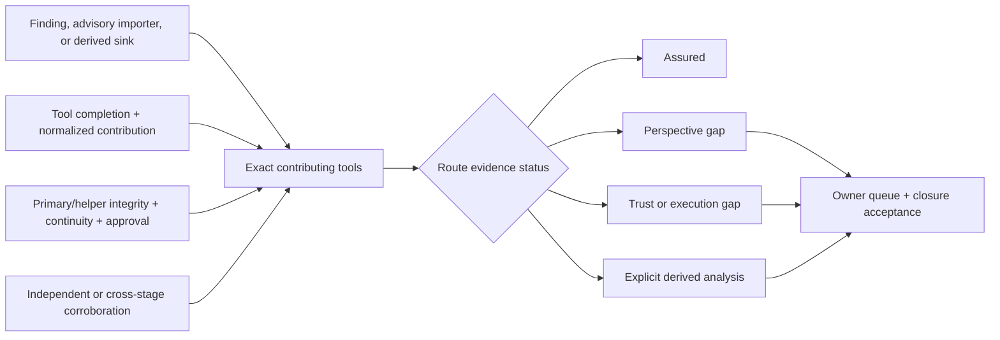

Statuses and exact tool names flow into route JSON, finding/SARIF evidence,
Markdown/HTML, sensitive-boundary dependency intersections, owner queues, and
closure criteria. A single perspective calls for an independent applicable
technique or governed sufficiency rationale; trust and execution gaps require
replacement-report evidence for the exact contributing bindings.

## Finding lifecycle and change attribution

A scanner finding's `new`, `existing`, or `regression` value is useful only
when its baseline is comparable. Risk synthesis therefore joins
`finding-delta.json` with the route's exact changed-line state, validation
assessment, declared-entry runtime matrix, owner, and contributing-tool
assurance. It emits a bounded `change_lifecycle_attribution` containing:

- baseline state (`comparable`, `not-configured`, `incomparable`, or
  `not-established`) and bounded comparison reasons;
- lifecycle plus any exact previous-finding match evidence;
- changed-line, outside-change-scope, or unavailable change context;
- an explicit classification and review signal rather than a confidence score;
- validation, entry-runtime, and scanner-assurance factors; and
- one conservative next action.

Only a digest-approved comparable baseline can produce
`baseline-new-on-changed-line` or `regression-on-changed-line`. Default `new`
status from a scan with no baseline is reported as `baseline-not-configured` or
`baseline-not-established`; an incompatible profile, scanner set, or ancestry
is `baseline-incomparable`. None of those states is silently treated as code
introduced by the current change.

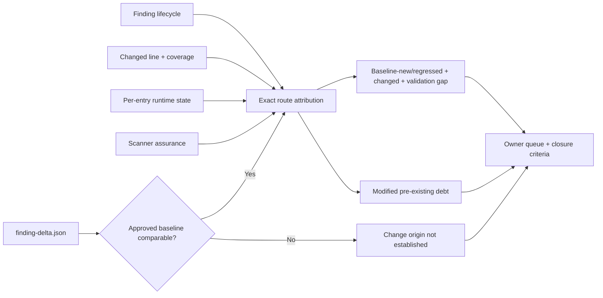

Summary counters distinguish comparable lifecycle routes, routes without
comparable lifecycle, baseline-new/regressed changed-line routes, validation
gaps among those routes, and modified pre-existing findings. The same context
flows through finding JSON and SARIF, Markdown/HTML detail, owner queues, and
closure acceptance criteria. This attribution supports review ordering; it
does not prove when a defect was authored, why a scanner first detected it, or
whether a finding is exploitable.

## Route ownership topology

For each retained primary and alternate entry path, the suite applies bounded
CODEOWNERS rules to files in exact route order. The resulting
`ownership_context` retains:

- owners and entry/transit/target roles for each exact file;
- stable boundary IDs for every adjacent owner-set transition;
- the entry exposures that traverse each boundary;
- distinct and coordinating owners plus exact unowned files;
- target finding-owner versus target-file CODEOWNERS alignment; and
- evidence availability, coordination status, artifacts, and next action.

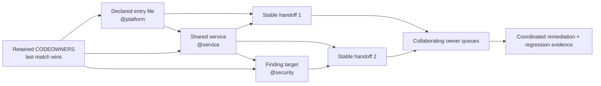

`not-established` means no retained ownership rules were available. It is
different from `unowned-segment`, which requires ownership evidence and an
exact route file with no matching rule. A target-owner mismatch is retained as
a review condition rather than silently replacing either source. Routes appear
in every coordinating owner's queue; an additional `Unassigned` queue makes
unowned segments visible. The same context flows into finding JSON/SARIF,
Markdown/HTML, dependency route context, closure evidence, and acceptance
criteria.

Ownership topology identifies responsibility boundaries. It does not prove
code authorship, approval, runtime control, exploitability, or security review
completion.

## Multi-entry exposure matrix

The primary route remains the deterministic shortest path used for the stable
route ID. Risk synthesis then performs a bounded per-entry search and attaches
every declared entry point that reaches the same target within eight file hops.
Declarations that share a source file remain distinct because a console script,
`python -m` module, worker, framework hook, or plugin declaration can require a
different validation plan. Unrelated entry points are not attached, and at most
25 exposure records are retained per route with exact omission counts.

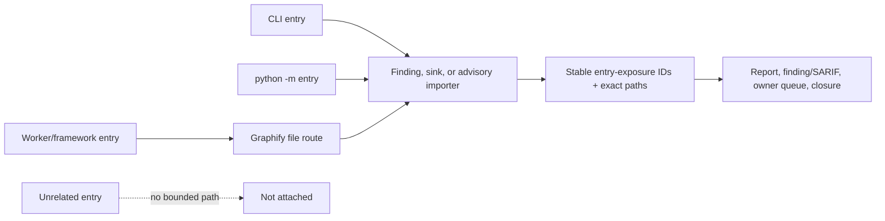

Summary counters show retained exposure records, multi-entry routes, multi-entry
security routes, the maximum interface breadth, and route-level truncation.
Owner queues coordinate interface-specific validation, while closure requires
each retained route to be exercised or covered by an approved equivalence
disposition. Static interface breadth does not establish network exposure,
attacker control, distinct runtime interfaces, execution, or exploitability.

Each exposure also joins the declaration's exact `target` node from
`reachability.json`. Its runtime assessment is `observed`, `not-observed`, or
`not-available`; matching by file alone is never accepted. Summary counters,
sensitive-boundary intersections, owner queues, finding/SARIF context, and
closure work preserve those states. Unobserved interfaces require
production-representative runtime evidence or an approved equivalence
disposition, while unavailable evidence requires an exact modeled node.

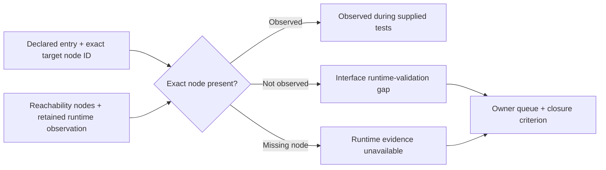

Observation is attributable only to the retained test/runtime evidence. It does
not establish production traffic, external accessibility, attacker control, or
sufficient behavioral coverage; non-observation does not prove dead code.

## End-to-end sensitive-data routes

`sensitive_data_routes` closes a reporting seam between source-to-sink analysis
and reachability. A confirmed Semgrep, Pysa, CodeQL, or other normalized
exposure finding retains `scanner-confirmed-source-to-sink`; a high-value AST
sink inventory record retains `inventory-review-surface`. These bases are never
presented as equivalent evidence.

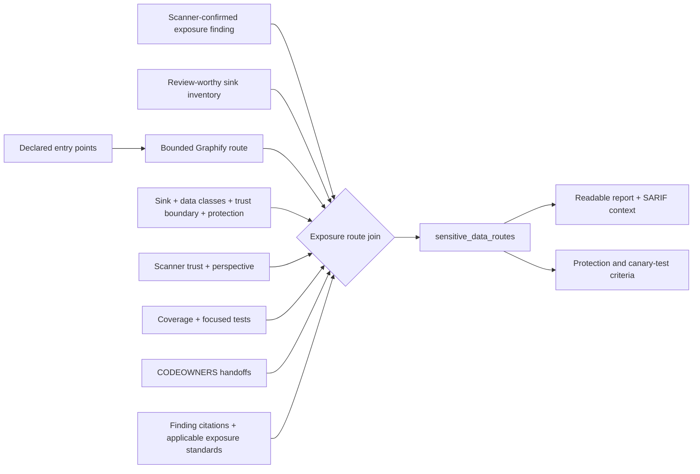

Summary counters separate scanner-confirmed and inventory-only records and show
routes without observed protection, routes with runtime-observed entries,
validation or scanner-assurance gaps, ownership boundaries, multiple entry
interfaces, and citation coverage. Confirmed routes retain bounded normalized
finding citations; inventory routes select only standards applicable to the sink
family. Finding cards, SARIF, and closure work retain these references with the
stable sensitive-route ID and require concrete data-class, recipient, purpose,
retention, access-control, minimization, and synthetic-canary review. A route
without a citation becomes an explicit closure gap.

The ledger is not interprocedural taint proof. Static entry reachability plus a
sink observation does not establish attacker-controlled input, that a value
reached the sink at runtime, that a disclosure occurred, or that a regulatory
classification applies.
Citations support classification and remediation guidance; they do not validate
the route or elevate inventory evidence into a confirmed flow.

## Secret candidate provenance

`secret_provenance_assessments` gives each retained `secrets` or
`secrets-history` finding a bounded, value-free triage record. It joins evidence
that dedicated scanners cannot safely determine in isolation:

- whether the cited path is production Python, test/validation source,
  generated evidence, a built artifact, or another repository control;
- whether the path belongs to the sealed source inventory, Graphify graph, or
  built-artifact manifest, and whether it has a Python entry-point route;
- whether the observation came from the current tree or retained Git history;
- whether a scanner verified the credential, ran without verification, or
  supplied no verification state, plus its execution/trust posture;
- whether the finding is new, existing, regressed, or unclassified and which
  CODEOWNERS should review it; and
- whether the normalized evidence explicitly confirms that secret material was
  redacted before report generation.

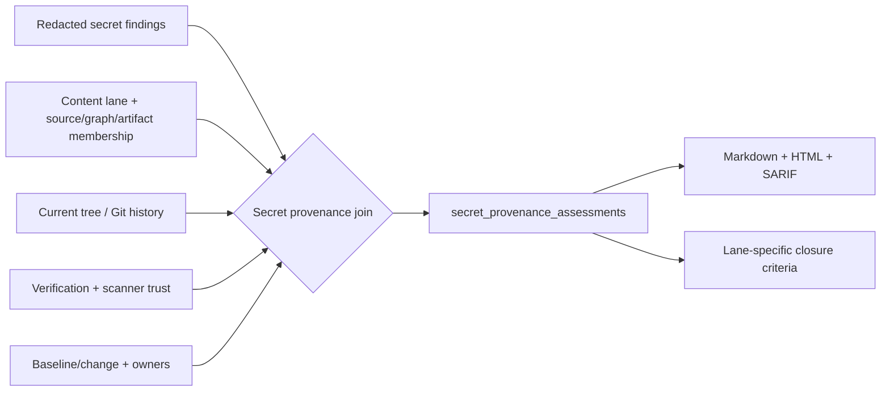

The report gives production credentials a rotate/remove/secret-store action;
generated evidence a credential-versus-deterministic-digest review; test
fixtures a synthetic/nonfunctional proof requirement; artifact candidates a
purge-and-fix-producer action; and history candidates a cited-commit review.
Closure also requires protected investigation, appropriate history cleanup,
scanner verification review, and redaction verification when those signals are
missing.

This context never changes native severity, suppresses a finding, or labels it a
false positive. Test and generated paths can still contain live credentials,
and scanner verification does not prove current usability, privilege, or scope.
The suite never retains detected secret values. Summary counters expose lane,
history, verification, scanner-assurance, and redaction gaps; the retained
assessment list is capped at 250 and reports its exact omitted count.

## Dependency-advisory importer routes

The synthesis promotes each deduplicated advisory/importer pair from
`evidence-fusion.json` into a stable `dependency-import-*` review target. This
bridges the common lockfile gap: OSV, Grype, or another package scanner may cite
dependency metadata that has no application entry-point route, while Graphify
identifies the exact maintained source file importing that distribution.

Each importer route cross-references:

- the advisory cluster, every retained native finding ID/tool/citation, package,
  version, direct/transitive relationship, and introducing dependency paths;
- the exact importing file, declared entry point, bounded Graphify file sequence,
  path-specific reachability/runtime state, CODEOWNERS result, and structural
  change-risk context;
- approved KEV/EPSS/VEX context, scanner-attributed fixed-version candidates,
  source-versus-built-artifact package lineage, and the advisory remediation
  action; and
- graph-selected focused tests, exact retained case state, importer file
  coverage, validation alignment, and any linked shared-control campaign.

Validation is importer-local. `evidence-fusion.json` retains a bounded
`import_path_assessments` ledger with the exact module and import line,
reachability/runtime state, owners, test selection and case execution, coverage,
alignment, and source artifacts for each path. A route consumes its own ledger
record even when fields are empty; it never borrows another importer's owner,
passing test, or coverage result. Older artifacts without the ledger use the
documented conservative aggregate fallback.

One advisory may produce several importer routes, but duplicate importer paths
within the cluster are collapsed. The compact route set flows back to every
native finding in the cluster, including when its lockfile location is itself
unroutable. Markdown provides a citation-bearing dependency route table; finding
JSON, HTML, SARIF, and closure work retain exact route, importer, advisory, test,
fix, and action context. Closure requires vulnerable-function review and an
upgrade, removal, mitigation, or governed VEX disposition.

This is deliberately not call-level reachability. A route establishes a static
path to a source file that imports the affected distribution; it does not prove
that a vulnerable function executes, that input is attacker controlled, or that
the advisory is exploitable in the application.

### Package lifecycle context

Each advisory importer performs a fail-closed join between `package_lineage`
and the retained source/artifact composition lanes. When both inventories are
available, the route distinguishes `matched`, `version-drift`, `source-only`,
and `artifact-only`. Missing inventories and packages absent from otherwise
comparable inventories remain explicit evidence gaps. Reports, finding context,
intersections, SARIF, and closure work retain the exact source/artifact versions.

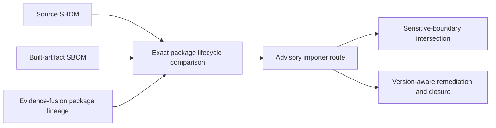

An exact fixed-version string match in the artifact is useful verification
evidence, but the suite does not infer version ranges, inventory completeness,
runtime loading, vulnerable-function use, or exploitability from this join.

## Sensitive-boundary dependency intersections

`exposure_advisory_intersections` combines two independently useful route
families only when all three identities agree:

- the sink and importer use the same normalized source path;
- the data-exposure SDK context and dependency route name the same package; and
- both records name the same alias-collapsed advisory cluster.

The bounded record links the sink and importer route IDs and retains the sink
line/family, SDK, trust boundary, data classes, protection status, advisory
identifier/citations, KEV/EPSS/fix signals, owners, and both validation states.
It also retains the evidence-assurance status of each side so an approved
dependency observation cannot mask an unassessed derived sink, or vice versa.
Stable IDs flow into related findings, Markdown/HTML, SARIF, and closure work.
Missing or aggregate-only importer evidence fails closed and produces no
intersection.

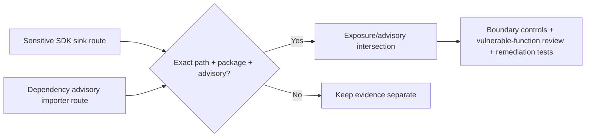

The intersection is a compound triage signal, not a taint or exploitability
claim. It does not prove the sensitive value reached the SDK, crossed the
boundary, leaked, or invoked the vulnerable function.

## Shared validation campaigns

Every retained convergence hotspot receives one stable `campaign-*` ID. The
campaign converts a shared control point into an executable validation handoff
by joining:

- direct and two-hop transitive test candidates selected from Graphify's reverse
  file graph;
- focused tests already mapped by change/exposure synthesis, retained separately
  when no direct graph path is available;
- exact file-attributed JUnit, Hypothesis, and Schemathesis case results;
- file coverage percent and bounded missing-line evidence for the shared control
  point, explicitly labeled as aggregate retained file evidence rather than
  coverage attributable solely to the selected tests; and
- exact source-inventory bindings for the control point and selected tests,
  plus aligned/mismatched/unverified/unbound revision state and exact payload
  receipt identity for retained case and coverage evidence; and
- structural change risk, exact uncovered changed lines, complexity, graph
  centrality, and runtime observation state for the same control-point path;
- the exact contributing-tool assurance of every retained route, including
  completed, approved, trust-gap, execution-gap, unassessed, derived, and
  single-perspective counts plus unresolved route references; and
- routes, targets, findings, priority, owners, evidence artifacts, a transparent
  factor-by-factor review score, and one next action.

The alignment is explicit: `tests-failing`, `tests-not-observed`,
`tests-incomplete`, `test-evidence-not-available`, `coverage-not-available`,
`coverage-gap`, `aligned-current-evidence`, or `not-selected`. Selected test
files and campaign IDs flow into finding evidence, SARIF properties, owner
queues, Markdown/HTML summaries, and closure acceptance criteria. This makes a
shared remediation runnable without presenting static selection or a passing
test as a security proof.

Route assurance is a campaign prerequisite, not a test result. Trust,
execution, unassessed, or unresolved-route gaps fail closed even when every
selected test passes and coverage is complete. A single-perspective route
remains usable as retained evidence only with an explicit action to add an
independent applicable perspective or approve the concentration risk. Derived
suite observations remain labeled separately and cannot promote scanner
evidence to assured.

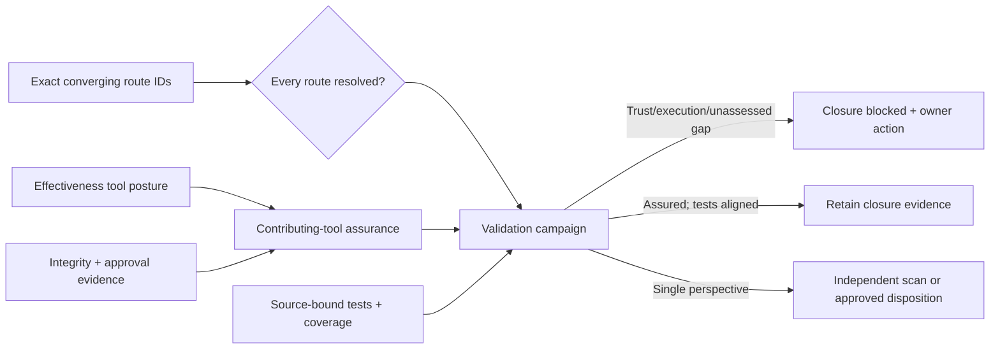

Revision alignment is deliberately fail-closed. Each retained evidence summary
must declare the sealed `source_sha256` and carry a schema-1.0 binding receipt
whose producer verified the exact evidence payload digest. The campaign keeps
the artifact name, declared source digest, binding status, evidence digest, and
binding filename. A matching source digest without a complete verified receipt
is `unverified`; a different digest is `mismatch`; missing declarations remain
`not-established`. Mismatch takes precedence over other gaps when several
evidence producers are combined.

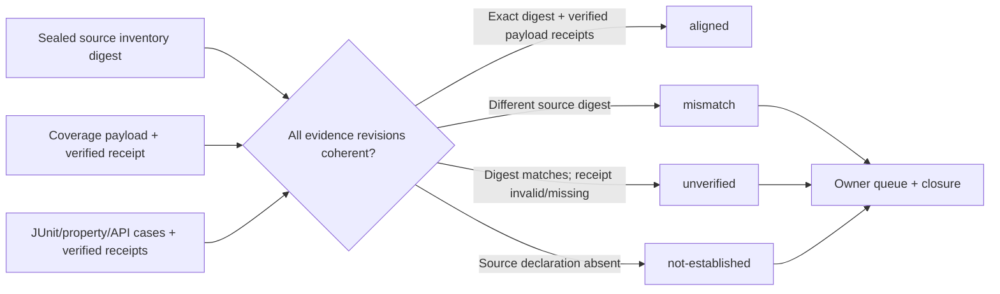

`shared-control-review-v5` ranks review work from route priority and convergence,
security-target and tool diversity, coverage/test state, changed-control risk,
uncovered changed lines, runtime observation gaps, complexity, graph centrality,
ownership, route scanner execution/trust/perspective assurance, evidence-revision
coherence, producer-verified payload-binding state, and the quality of any shared
test evidence. The report retains every non-zero
factor, point contribution, and exact source artifacts; Markdown/HTML campaign
cards show a bounded factor breakdown beside the score. The score is triage guidance, not a
vulnerability severity or exploitability calculation. The prior v1 through v4
identifiers remain schema-readable for stored artifacts. Evidence revision state is
`aligned` only when all retained coverage/case artifacts declare the exact sealed
source-inventory digest. `mismatch` and `not-established` generate explicit
regeneration/binding work and flow into owner queues and closure acceptance
criteria. Uncovered changed lines and unobserved runtime state add their own
closure criteria rather than being hidden inside an aggregate score.

## Shared validation-test hotspots

The synthesis performs one bounded cross-campaign pass after campaigns are
built. A `test-hotspot-*` record is emitted only when the same test file is
selected by at least two distinct campaigns. Each record joins:

- campaign, shared-control, route, target, finding, and owner identities;
- direct, transitive, and route-context selection counts;
- campaigns that have no other selected test file;
- exact retained execution states, case count, and producer artifacts without
  summing the same JUnit cases once per campaign; and
- the test file's source-inventory binding and a consistency check across every
  contributing campaign;
- active normalized findings in the exact test file, including line, severity,
  classifications, and contributing tools; and
- exact test-file CODEOWNERS plus alignment with the campaign owners.

The report turns this into a coordination action and recommends an independent
focused test when a campaign depends on the shared test alone. Stable hotspot
IDs flow into routes, finding JSON, SARIF, owner queues, Markdown/HTML context,
and closure criteria. Each hotspot is graded `strong`, `qualified`, `weak`, or
`not-established`; the weakest linked state feeds back into every dependent
campaign. A passing test with active findings, an ownership handoff, or sole-test
dependency is qualified rather than silently treated as strong. This is
concentration and evidence-quality context, not proof that tests are independent,
assertions are strong, or behavior is sufficiently covered.

Targets with no route are retained in `unrouted_targets`. They are not presented
as safe or unreachable. Before calling a target a model gap, applicability joins
Graphify file membership, source-inventory membership, artifact-manifest identity,
target kind, scanner, area, and path type. The result is one of:

| Class | Python route expected? | Required action |
|---|---:|---|
| `python-runtime-source` | Yes | Model framework, registry, plugin, generated-code, dependency-injection, or external entry paths, or retain a governed rationale |
| `artifact-control` | No | Resolve packaging, provenance, integrity, or source-parity evidence in the release lane |
| `generated-evidence` | No | Correct the evidence producer or scanner scope; do not add the output as an entry point |
| `test-validation-source` | No | Resolve the test finding as validation-evidence quality and rerun affected campaigns |
| `outside-python-runtime-model` | No | Use the native repository, configuration, infrastructure, or supply-chain evidence lane |

The report separately counts all unrouted dispositions, actionable Python route
gaps, graph-membership gaps, and expected non-runtime targets. A non-route-
applicable classification changes only the route action; it never suppresses or
downgrades the underlying finding.

Inventory-only sink targets are included only when they are production scoped
and have high review priority, sensitive-data context, a nearby normalized
finding, or package-risk evidence. This keeps common low-context logging calls
from overwhelming the route ledger. A sink target remains an inventory signal
unless a scanner has established a source-to-sink finding.

## Bounds and enterprise operation

The synthesis runs in process over already normalized local artifacts. It does
not import target code, execute the target, install packages, or access a
network. It retains at most 100 declared entry points, searches at most 100,000
graph files to a depth of eight hops, analyzes the highest-priority 10,000
targets, and emits at most 250 routed targets, 250 unrouted targets, 50
convergence hotspots/validation campaigns, 50 tests per campaign, and 100 owner
queues. It retains at most 100 shared validation-test hotspots. Reverse test
selection examines at most 500 graph neighbors per
campaign and retains at most 100 missing lines. At most 50 normalized importer
paths are promoted per advisory, inside the existing 10,000-target global bound.
At most 100 exact-path exposure/advisory intersections are retained. Omitted
counts are explicit. At most 100 sensitive-data route records are retained with
a separate omission count. At most 500 bounded tool-posture records are accepted from
the local effectiveness artifact; each route retains at most 25 exact
contributing-tool records.

The current JSON Schema is
[`risk-paths.schema.json`](../src/py_security_suite/schemas/risk-paths.schema.json).
The artifact and finding-level route context are included in the checksum-sealed
report; SARIF carries the same `risk_path` property used by Markdown and HTML.
Finding closure items cite the route artifact and exact route files, preserve
route, hotspot, and campaign IDs plus selected test files and assessment state,
and require missing validation evidence or an unrouted dynamic-entry rationale
to be closed in the replacement report. Non-runtime dispositions instead require
the finding to be resolved or governed in its native evidence lane without
inventing a Python entry point.

## Interpretation limits

- Static imports and calls can over-approximate production execution.
- Dynamic Python behavior can create legitimate paths absent from the graph.
- Artifact, generated-evidence, test, and non-Python dispositions mean a
  production Python route is not expected; they do not mean the finding is safe,
  false, or resolved.
- Runtime observation covers only retained executions and is not a proof of
  completeness.
- A passing focused test does not resolve uncovered changed lines or establish
  a security property.
- Route priority guides review; native scanner severity and policy remain
  authoritative.
- Scanner approval and perspective breadth are evidence-quality facts, not
  finding truth, exploitability, or release approval.
- Dependency importer reachability is not vulnerable-function reachability or
  exploitability evidence.
