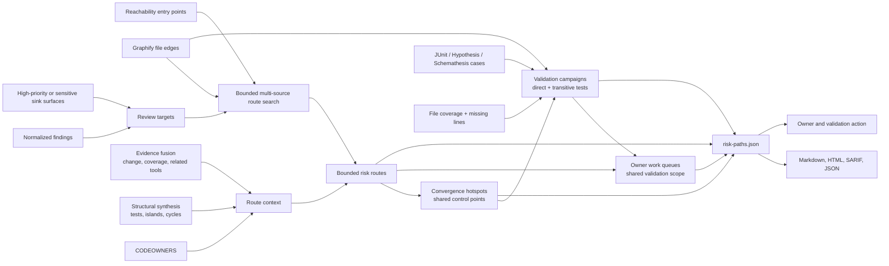

# Static risk-route synthesis

Last reviewed: 2026-08-13

`risk-paths.json` turns several separate observations into one bounded review
route: a declared Python entry point, Graphify file relationships, a normalized
finding or review-worthy sensitive-data sink, runtime/reachability state,
coverage and focused-test evidence, related findings, and CODEOWNERS-derived
ownership.

The artifact answers a practical triage question: **where can a reviewer start,
what files connect that start to the target, who owns it, and what validation is
still missing?** It deliberately does not claim attacker-controlled input,
vulnerable-function reachability, exploitability, or actual data leakage.

## Evidence flow

## Route contract

Each retained route includes:

- a stable route ID and P0-P4 priority inherited from the finding or sink review
  priority;
- the exact declared entry point and a maximum eight-hop file sequence;
- the Graphify relation for every step;
- target tool, rule/classification, file, and line attribution;
- reachability state and retained runtime observation;
- changed-line, line/file coverage, graph-selected tests, focused execution,
  alignment gaps, an explicit aligned/gap/partial/not-assessed state, and the
  next validation action;
- owners, related findings/tools, structural risk IDs, advisory identity, and
  supporting artifact names; and
- an explicit recommended action.

Routes are also cross-referenced with one another. A convergence hotspot is a
file traversed by at least two routes leading to at least two distinct targets.
It is classified as a shared transit point, target concentration, or mixed
control point. The hotspot consolidates route/target IDs, scanners, owners,
validation states, mapped tests, evidence artifacts, and one shared action.
Entry-point files are excluded from this calculation so a universal CLI root
does not become a low-value hotspot by definition.

Owner work queues collect exact route and hotspot IDs with P0-P4 and
aligned/gap/partial/not-assessed counts plus the exact shared validation
campaign IDs. A route can appear in multiple queues
when ownership overlaps; this preserves accountability rather than selecting an
arbitrary owner. These groups coordinate work and tests but do not merge or
inflate the underlying scanner findings.

## Shared validation campaigns

Every retained convergence hotspot receives one stable `campaign-*` ID. The
campaign converts a shared control point into an executable validation handoff
by joining:

- direct and two-hop transitive test candidates selected from Graphify's reverse
  file graph;
- focused tests already mapped by change/exposure synthesis, retained separately
  when no direct graph path is available;
- exact file-attributed JUnit, Hypothesis, and Schemathesis case results;
- file coverage percent and bounded missing-line evidence for the shared control
  point, explicitly labeled as aggregate retained file evidence rather than
  coverage attributable solely to the selected tests; and
- exact source-inventory bindings for the control point and selected tests,
  plus aligned/mismatched/unbound revision state for retained case and coverage
  evidence; and
- routes, targets, findings, priority, owners, evidence artifacts, a transparent
  factor-by-factor review score, and one next action.

The alignment is explicit: `tests-failing`, `tests-not-observed`,
`tests-incomplete`, `test-evidence-not-available`, `coverage-not-available`,
`coverage-gap`, `aligned-current-evidence`, or `not-selected`. Selected test
files and campaign IDs flow into finding evidence, SARIF properties, owner
queues, Markdown/HTML summaries, and closure acceptance criteria. This makes a
shared remediation runnable without presenting static selection or a passing
test as a security proof.

`shared-control-review-v1` ranks review work from route priority and convergence,
security-target and tool diversity, coverage/test state, complexity, graph
centrality, ownership, and evidence-revision coherence. The report retains every
non-zero factor and its source artifacts; the score is triage guidance, not a
vulnerability severity or exploitability calculation. Evidence revision state
is `aligned` only when all retained coverage/case artifacts declare the exact
sealed source-inventory digest. `mismatch` and `not-established` generate
explicit regeneration/binding work and flow into owner queues and closure
acceptance criteria.

Targets with no route are retained in `unrouted_targets`. They are not presented
as safe or unreachable: the action is to confirm framework, registry, plugin,
generated-code, dependency-injection, or externally invoked entry points and
extend the governed model.

Inventory-only sink targets are included only when they are production scoped
and have high review priority, sensitive-data context, a nearby normalized
finding, or package-risk evidence. This keeps common low-context logging calls
from overwhelming the route ledger. A sink target remains an inventory signal
unless a scanner has established a source-to-sink finding.

## Bounds and enterprise operation

The synthesis runs in process over already normalized local artifacts. It does
not import target code, execute the target, install packages, or access a
network. It retains at most 100 declared entry points, searches at most 100,000
graph files to a depth of eight hops, analyzes the highest-priority 10,000
targets, and emits at most 250 routed targets, 250 unrouted targets, 50
convergence hotspots/validation campaigns, 50 tests per campaign, and 100 owner
queues. Reverse test selection examines at most 500 graph neighbors per
campaign and retains at most 100 missing lines. Omitted counts are explicit.

The current JSON Schema is
[`risk-paths.schema.json`](../src/py_security_suite/schemas/risk-paths.schema.json).
The artifact and finding-level route context are included in the checksum-sealed
report; SARIF carries the same `risk_path` property used by Markdown and HTML.
Finding closure items cite the route artifact and exact route files, preserve
route, hotspot, and campaign IDs plus selected test files and assessment state,
and require missing validation evidence or an unrouted dynamic-entry rationale
to be closed in the replacement report.

## Interpretation limits

- Static imports and calls can over-approximate production execution.
- Dynamic Python behavior can create legitimate paths absent from the graph.
- Runtime observation covers only retained executions and is not a proof of
  completeness.
- A passing focused test does not resolve uncovered changed lines or establish
  a security property.
- Route priority guides review; native scanner severity and policy remain
  authoritative.
