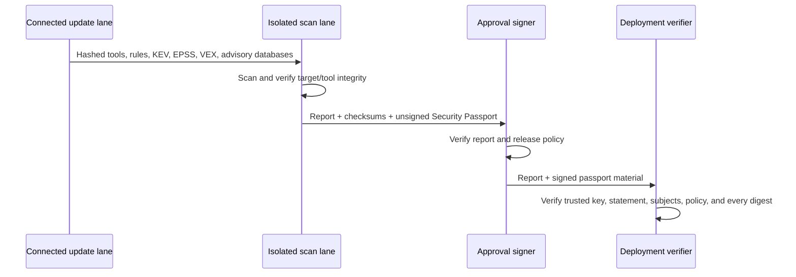

# Security Passport, intelligence, and lifecycle evidence

Last reviewed: 2026-08-02

## Objective

The Security Passport turns a scan directory into portable release evidence.
It binds what was scanned, the exact policy and intelligence used, scanner
health, normalized findings, derived assurance files, and release artifact
digests. A deployment verifier can validate the decision without installing or
executing any scanner.

The passport uses an in-toto Statement v1 with the SLSA Verification Summary
Attestation predicate. `verificationResult` is `PASSED` only when the suite
outcome is `PASS`; `WARN`, `FAIL`, and `INCOMPLETE` remain `FAILED`. This avoids
turning an advisory exit code into a release claim.

## Trust flow



Passport creation uses a sibling staging directory and publishes it only after
all signing material is complete and the generated checksum manifest has been
read back successfully. Verification requires the manifest to cover the exact
evidence file set, so injected unchecksummed files fail validation. Requested
output links and junctions are rejected before path resolution, a destination
that appears without `--overwrite` is preserved, an overwrite target must
itself be a checksum-verified structurally valid Passport, and the prior
Passport is restored if the final replacement fails. Failed signing and
publication attempts remove incomplete staging material.

The signer key is never copied into the report. An optional password file is
bounded, read only for the signing operation, supplied as `COSIGN_PASSWORD` to
the reduced subprocess environment, and never written to diagnostics.

## Offline intelligence

| Dataset | Role | Policy treatment |
|---|---|---|
| CISA KEV | Confirms exploitation in the wild | Match is `P0` and blocking |
| FIRST EPSS | Estimates 30-day exploitation probability | Raises action priority at configured probability or percentile thresholds |
| CycloneDX VEX | Records product-context analysis | Displayed as evidence; never an automatic suppression |

Each snapshot is a bounded regular file with an organization-approved SHA-256
and maximum age. JSON/CSV structures, CVE identifiers, numeric ranges, record
counts, gzip expansion, and VEX states are validated before use. Any configured
snapshot failure makes the scan incomplete.

## Finding lifecycle and ownership

An approved prior `findings.json` enables four states:

- `new`: no prior match;
- `existing`: exact fingerprint or one unambiguous semantic match;
- `regression`: the prior record was explicitly resolved;
- `resolved`: present previously and absent now, retained in the delta artifact.

The suite evaluates `.github/CODEOWNERS`, root `CODEOWNERS`, then
`docs/CODEOWNERS`, applying the last matching supported rule. Owners are shown
in Markdown, HTML, normalized JSON evidence, and SARIF properties. Lifecycle
does not silently weaken the full-repository production policy.

## Generated evidence

| File | Purpose |
|---|---|
| `security-passport.json` | Unsigned in-toto/SLSA statement generated with every scan |
| `risk-intelligence.json` | Snapshot hashes, ages, record counts, thresholds, matches, and validation errors |
| `finding-delta.json` | Baseline identity, match strategies, lifecycle counts, and bounded resolved records |
| `effectiveness.json` | Tool completion, attribution, actionability, corroboration, and unique contribution |
| `assurance-claims.json` | NIST SSDF claim-to-evidence graph |

Effectiveness metrics describe observed normalization and contribution for the
current scan. They do not claim precision or recall. Detection recall requires
the labeled fixture lane driven by `scripts/run-detection-validation.ps1` and
future domain-specific positive and negative corpora.

## Commands

Verify the generated report before it enters the approval lane:

```text
pysec verify-report REPORT
```

This validates the report checksum chain and scan manifest. The embedded
`REPORT/security-passport.json` is the unsigned in-toto/SLSA statement; it is
not itself the detached passport directory accepted by `pysec verify`.

Create a signed passport with Cosign 2 in a disconnected approval lane:

```text
pysec attest REPORT --output PASSPORT \
  --signing-key RELEASE_KEY \
  --signing-password-file PASSWORD_FILE \
  --cosign-executable APPROVED_COSIGN \
  --cosign-sha256 APPROVED_COSIGN_SHA256
```

Cosign 3 replaced the legacy detached-signature flags with Sigstore bundles.
Bundle creation can contact the signing services named by Cosign's signing
configuration. The suite therefore fails closed unless that egress is explicitly
authorized in a controlled signing lane:

```text
pysec attest REPORT --output PASSPORT \
  --signing-key RELEASE_KEY \
  --signing-password-file PASSWORD_FILE \
  --cosign-executable APPROVED_COSIGN \
  --cosign-sha256 APPROVED_COSIGN_SHA256 \
  --allow-signing-network \
  --signing-config REVIEWED_PRIVATE_OR_PUBLIC_SIGNING_CONFIG
```

Omit `--signing-config` only when the public Sigstore service configuration is
intentionally approved. The isolated scan lane never signs and should use
`--unsigned`; verification consumes only the transferred passport, key, bundle,
report, and pinned verifier executable. Network enforcement remains the
responsibility of the host boundary.

Verify it with the original report:

```text
pysec verify PASSPORT --report REPORT \
  --public-key APPROVED_PUBLIC_KEY \
  --cosign-executable APPROVED_COSIGN \
  --cosign-sha256 APPROVED_COSIGN_SHA256
```

Add `--format text` for a concise operator decision. JSON remains the default
for integrations. Verification output deliberately separates five concepts:

| Field | Meaning |
|---|---|
| `verification_status` | Passport checksum and structure verification completed |
| `verification_scope` | `integrity-only` or `authenticity-and-integrity` |
| `report_integrity_verified` | The supplied source report and every bound input digest verified |
| `policy_verification_result` | The SLSA policy result: `PASSED` or `FAILED` |
| `release_decision` | `approved` only when authenticity, source-report verification, and policy all pass |

The legacy `verification_result` field is retained and remains an alias for the
SLSA policy result. It does not describe checksum or signature verification.
`release_blockers` explains every unmet approval condition using stable,
machine-readable identifiers.

For example, a valid unsigned passport bound to a failing report produces:

```text
VERIFIED (integrity only): 2 passport files; 88 report files
Policy: FAIL (FAILED); release decision: NOT APPROVED
Blockers: signer authenticity not verified; scan policy not satisfied
```

`pysec attest ... --unsigned` is an approval-handoff operation.
`pysec verify ... --allow-unsigned` proves only checksum integrity and must not
be treated as signer authentication.

### Verification exit codes

| Exit | Decision | Meaning |
|---:|---|---|
| 0 | `approved` | Authentic signature, supplied source report, and passing scan policy all verified |
| 1 | `not_approved` | Passport integrity verified, but one or more release-approval conditions failed |
| 3 | CLI error | Passport integrity, signature, report binding, configuration, or invocation was invalid |

This distinction is fail-closed for deployment automation: `--allow-unsigned`
can demonstrate a valid handoff without producing a successful release-gate
exit status.
