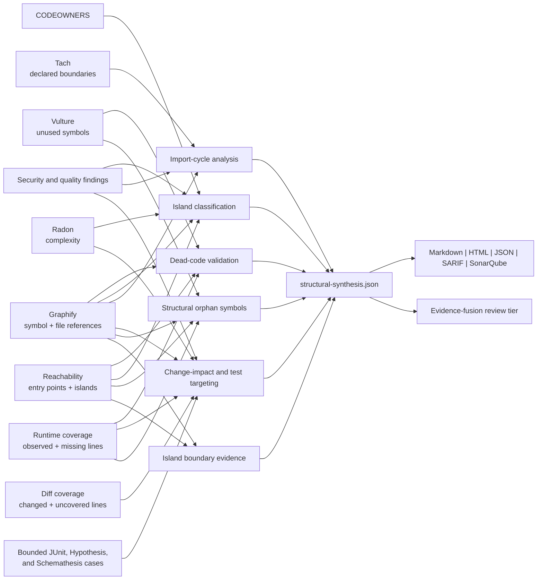

# Structural synthesis

Last reviewed: 2026-08-13

Structural synthesis combines independent repository signals so reviewers can
act on code-island and dead-code results without treating a single static tool as
proof. It runs after scanner normalization and writes
`structural-synthesis.json`; no target code, network service, model, or database
is required.

## Evidence joins

| Join | Stronger conclusion | Important counter-evidence |
|---|---|---|
| Vulture + disconnected scope + uncovered line + no Graphify inbound reference | `likely-removable` candidate | Missing dynamic root or production-only path |
| Vulture + observed runtime scope or inbound symbol reference | `likely-dynamic` candidate | Observation may be test-only; caller still needs validation |
| Disconnected/load-only island + security finding | `latent-attack-surface` | State does not establish exploitability |
| Disconnected island + external Graphify caller | `missing-entry-point` | Reference can still be non-executable |
| Graphify import cycle + Tach/security finding | High-priority architecture hotspot | Cycles indicate coupling, not a vulnerability by themselves |
| Changed lines + Graphify reverse paths + coverage | Direct and transitive test targets with a compound change-risk score | Static test dependencies cannot replace dynamic integration tests |
| Graph-selected tests + exact case execution + changed-line coverage | Distinguishes aligned validation from failing, incomplete, unobserved, unavailable, and passing-but-uncovered evidence | Passing evidence describes the scanned state and must be regenerated after the final change |
| Unreferenced Graphify callable + disconnected/load-only + not observed + uncovered | Conservative structural-orphan candidate | Framework, inheritance, registry, or plugin dispatch may be implicit |
| Island boundary edges + source/test path role | Distinguishes test-only fixtures from probable missing production entry points | A file reference is not necessarily executable |

## Dead-code dispositions

| Disposition | Meaning | Action |
|---|---|---|
| `likely-removable` | Several independent signals support focused removal review | Confirm ownership and dynamic behavior, remove narrowly, test, and rescan |
| `likely-dynamic` | Runtime observation or graph references contradict a dead-code conclusion | Trace callbacks, registries, plugins, reflection, and framework conventions |
| `needs-review` | Evidence is missing or mixed | Model entry points and collect production-like coverage before deciding |

The suite never automatically deletes code, changes scanner severity, or
suppresses a Vulture result. A high-confidence synthesis means confidence in the
reported evidence combination, not proof that production cannot execute the
code.

Vulture's quoted symbol name is matched to the normalized Graphify label before
the line-nearest fallback is used. Symbol-level inbound references drive the
disposition; file-level imports remain visible counter-evidence and lower
confidence instead of incorrectly proving that every definition in an imported
module is live.

## Island classifications

- `latent-attack-surface`: dormant or load-only code contains a security or
  supply-chain finding;
- `missing-entry-point`: static reachability says disconnected while Graphify
  finds cross-island callers or imports;
- `likely-dynamic`: runtime observation or load-only state suggests indirect use;
- `likely-removable`: disconnected, unreferenced code also contains Vulture
  candidates; and
- `orphaned-code-review`: ownership and intent remain unresolved.

Each island includes stable identity, state, confidence, LOC, priority, impact
score, paths, external graph references, runtime observation, coverage,
complexity, owners, related finding IDs, evidence, counter-evidence, and a
specific next action. Import strongly connected components are separately listed
with Tach and security correlations.

## Change impact and graph-guided tests

For every changed non-test Python file reported by diff-cover, synthesis walks
Graphify's reverse file graph for two bounded hops. Direct tests import, call,
reference, or use the changed file; transitive tests reach it through one
intermediate production file. For a changed package `__init__.py`, associated
tests exercise modules that the package imports or re-exports; these are labeled
separately because they do not prove a dependency path to the package surface.
The artifact reports all three groups separately and never claims that the
selected tests replace the full suite.

Change risk combines uncovered changed-line ratio, mapping confidence (direct,
transitive, package-associated, or absent), two-hop upstream blast radius,
local security findings, and high complexity.
Each assessment includes the exact uncovered lines, test files, upstream and
downstream paths, findings, risk score, priority, exact retained test results,
test/coverage alignment, and a concrete validation action. A passing selected
test with uncovered changed executable lines is reported as `coverage-gap`, not
as adequate validation. `aligned-current-evidence` requires every selected file
to have passing retained cases and no uncovered changed executable line.
Findings in changed files receive the same context in Markdown, HTML, SARIF,
SonarQube, and evidence-fusion review reasons.

## Structural orphan symbols

Graphify-only absence of callers is too noisy for Python, so the suite retains
an orphan candidate only when all of these hold:

- the node is a production Python callable with no Graphify call/reference/use;
- its containing reachability scope is `disconnected` or `load-only`;
- runtime coverage did not observe the scope; and
- line evidence marks the definition uncovered.

Vulture agreement raises confidence and is explicitly cited. Without Vulture,
the result stays a structural review candidate. Observed runtime execution
always prevents an orphan conclusion.

## Island boundary evidence

Every island now retains bounded inbound and outbound file edges with relation
and count, candidate entry paths, and directly mapped tests. Boundary analysis
distinguishes `test-only-or-fixture`, `candidate-missing-entry-point`,
`runtime-model-gap`, `closed-boundary`, and `referenced-boundary`. These refine
triage without overwriting the underlying reachability state.

Risk-route synthesis consumes these retained islands and boundaries for a
second-order join: an unrouted production Python target receives structural
context only for exact path membership and, where a primary line range exists,
exact line containment. This connects candidate entry paths, direct tests,
Vulture corroboration, runtime and coverage counter-evidence, findings, and
owners to the route-gap decision. The bounded risk-path ledger remains
referentially closed and does not reinterpret an island as proof of dead code.

## Report contract and limits

The current artifact uses bundled JSON Schema `structural-synthesis-1.2`; the
1.1 and 1.0 schemas remain bundled for existing consumers. Output is bounded to 100
dead-code assessments, 100 island assessments, 50 import cycles, 100 change
impacts, 100 orphan symbols, 100 island boundaries, and 250 finding links;
omitted counts are explicit. Relevant findings receive a
compact `structural_synthesis` evidence object and supporting Graphify and
reachability citations. The main summary shows counts and the five highest-value
islands and change hotspots, while the full artifact preserves machine-readable
evidence.

Static analysis cannot completely model reflection, dependency injection,
generated code, native extensions, data-driven plugins, or framework dispatch.
Runtime non-observation also does not prove absence. A removal decision therefore
requires owner review, production-representative tests, and a clean reachability
delta and isolated rescan.
